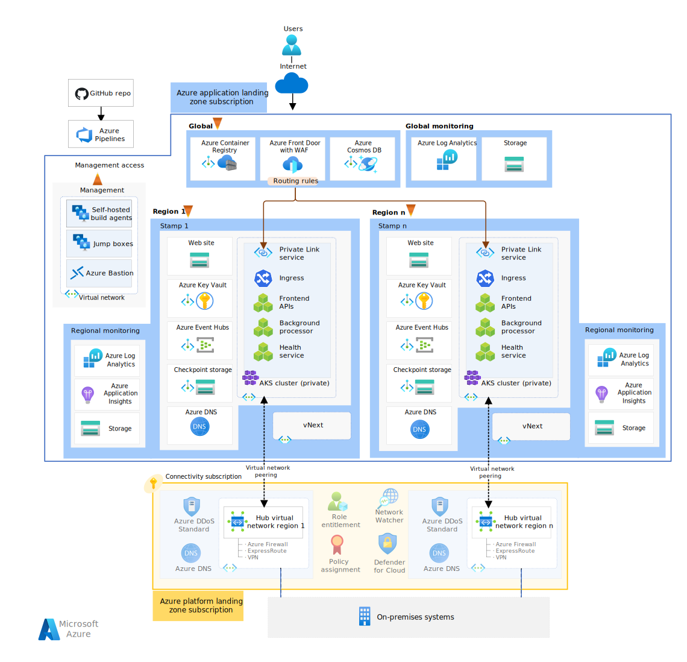
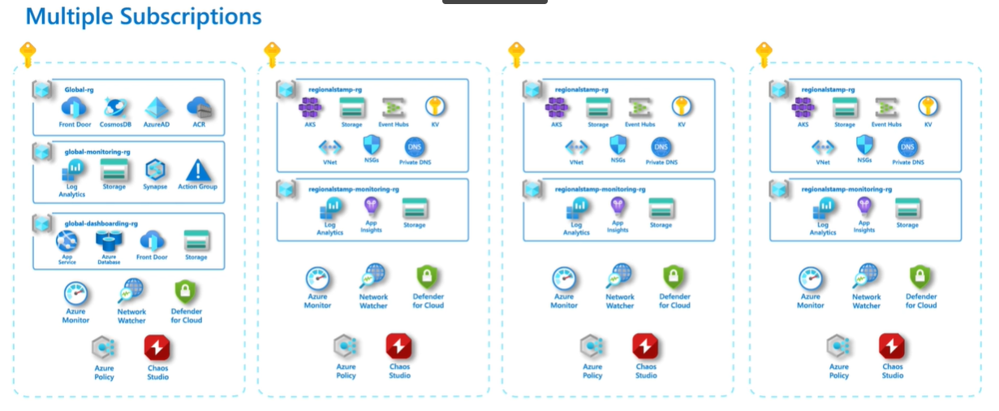

This reference architecture provides guidance for deploying a mission critical workload that uses centralized shared services and integrates with other workloads of an enterprise. As a workload owner, you might find yourself in this situation if there's a need to deploy the workload in an _application Azure landing zone_ provided by your organization. The organization will also provide _platform Azure landing zones_ with pre-provisioned shared resources that are managed by centralized teams.

In this approach, **the centrally managed components need to be highly reliable for a mission critical workload to operate as expected.** The reliability tier of the platform and the workload must be aligned. The workload team must have a trusted relationship with the platform team so that unavailability issues in the foundational services, which  affect the workload, are mitigated at the platform level. 

> [!IMPORTANT]
> An application landing zone is a pre-provisioned subscription that's connected to the organization's shared resources. It has access to basic infrastructure needed to run the workload, such as networking, identity access management, policies, and monitoring capabilities. Platform landing zones is a collection of various subscriptions each with specific functionality. For example, the Connectivity subscription contains Azure Private DNS Zone, ExpressRoute circuit, Firewall in a virtual network that's available for application teams to use. 
>
> A key benefit for the application team is that they can offload management of shared reources to central teams, and  focus on development efforts. The organization benefits by applying consistent governance and optimizing on cost by reusing resources for multiple application teams. 
> 
> If you aren't familiar with the concept of landing zones, we highly recommend you start with [What is an Azure landing zone?](https://learn.microsoft.com/en-us/azure/cloud-adoption-framework/ready/landing-zone/)

This architecture builds on the [**mission-critical **baseline architecture** with network controls**](./mission-critical-network-architecture.yml). It's recommended that you become familiar with the **baseline architecture** before proceeding with this article. 

> [!NOTE]
>  The guidance is backed by a production-grade [example implementation](https://github.com/Azure/Mission-Critical-Connected) which showcases mission critical application development on Azure. This implementation can be used as a basis for further solution development in your first step towards production.

## Key design strategies
The design strategies for mission-critical baseline still apply in this use case. Here are the considerations for this architecture:

- **Lifecycle of the architecture components**

    Consider the lifecycle of each component as your deployment is expected to have zero down time. Components can be, ephemeral or short-lived resources that can be created and destroyed as needed; non-ephemeral or long-lived and share the lifetime with the system or region). There are also components that used to be ephemeral in the **baseline architecture** but are now non-ephemeral because they're pre-provisioned by the platform team.  

- **Network-secure topology**
    Maintain your workload's network perimeter, both public and private. Also, draw boundaries for connectivity to cloud resources as opposed to on-premises. 

- **Evaluate reliability**

    Minimize external dependencies on components and processes, which can introduce a point of failure in the workload. Understand and mitigate remaining risks with agreed upon configurations. The architecture has resources owned by various teams outside the application team. Those components are in-scope for workload. Evaluate the reliability of those components and policies with the platform team regularly.

- **Subscription topology**

    Azure landing zones don't imply a single subscription topology. Plan your subscription footprint in advance with your platform team to accommodate workload reliability and requirements and the DevOps team responsibilities across all environments.

- **Maintain isolation**

    Separate use of resources based on the purpose. For example, use separate environments (and even subscriptions) for production and development. 

- **Autonomous observability into the critical path**

    Factor in _all_ components that participate in processing of requests. The path includes components owned by the application team and the external components that the workload depends on. Have dedicated monitoring resources that enable the team to query their data collection quickly and act on remediations.  

## Architecture

The components of this architecture are same as the [**mission-critical baseline architecture with network controls**](./mission-critical-network-architecture.yml). The descriptions are short for brevity. If you need more information, see the linked articles. For product documentation about Azure services, see [Related resources](#related-resources).

### Global resources

The global resources are non-ephemeral and share the lifetime of the system. The Azure services and their configuration remain the same as the **baseline architecture**.

> For more information, see [**Global resources**](/azure/architecture/reference-architectures/containers/aks-mission-critical/mission-critical-app-platform#global-resources).

### Regional monitoring resources

Monitoring data for global resources and regional resources are stored independently. A single, centralized observability store isn't recommended because it can potentially be a single point of failure. The Azure services and their configuration remain the same as the **baseline architecture**.

> [!IMPORTANT]
> There are dependencies on the platform-owned monitoring resources that must considered you are developing a health model for this architecture. See the [Monitoring considerations](#monitoring-considerations) section.

> For more information, see [baseline monitoring resources](/azure/architecture/reference-architectures/containers/aks-mission-critical/mission-critical-network-architecture#observability-resources).

### Regional networking resources

The **baseline architecture** deploys resources owned by the application team. However in this architecture, networking resources are provided through the [Connectivity subscription](/azure/cloud-adoption-framework/ready/azure-best-practices/traditional-azure-networking-topology) provisioned as part of the platform landing zone. Consider these resources to non-ephemeral.

> [!IMPORTANT]
> The stamp depends on these platform-owned resources. **Azure Virtual Network** provides a shared environment, **Azure Firewall** inspects all egress traffic, and **On-premises gateway** connects to on-premises network through a VPN device or ExpressRoute circuit. See the [Networking considerations](#networking-considerations) section.

### Regional stamp resources

These resources live in the application landing zone subscription. The resources are part of a _deployment stamp_ and intended to be ephemeral to provide more resiliency, scale, and proximity to users. These resources share nothing with resources in another region. They share [global resources](#global-resources) between each other. 

> [!IMPORTANT]
> **Azure Virtual Network** is pre-provisioned in the landing zone subscription. It's the only part of stamp that is non-ephemeral. The workload deployment references the network and provisions the resources in subnets defined by the application team. See the [Networking considerations](#networking-considerations) section.

Other Azure services and their configuration remain the same as the **baseline architecture**.

> For more information, see [**Regional stamp resources**](/azure/architecture/reference-architectures/containers/aks-mission-critical/mission-critical-app-platform#deployment-stamp-resources).

### Deployment pipeline resources

Build and release pipelines for a mission critical application must be fully automated to guarantee a consistent way of deploying a validated stamp. These resources remain the same as the **baseline architecture**. 

> [!IMPORTANT]
> The deployment strategy must take into consideration the non-ephemeral resources that aren't owned by the application team but are in-scope for this architecture. See the [Deployment considerations](#deployment-considerations) section. 

> For more information, see [Deployment pipeline](/azure/architecture/reference-architectures/containers/aks-mission-critical/mission-critical-network-architecture#deployment-pipeline-resources).

### Management resources
To gain access to the private compute cluster, this architecture uses private build agents and jump box virtual machines instances. Azure Bastion provides secure access to the jump box VMs. These resources remain the same as the **baseline architecture**.

> For more information, see [Management resources](/azure/architecture/reference-architectures/containers/aks-mission-critical/mission-critical-network-architecture#management-resources).

## Networking considerations

There are fundamental changes in the networking design area the **baseline architecture**. The workload in the application landing zone will need connectivity to the federated resources in the platform landing zone. The purpose could be for accessing on-premises resources, controlling egress traffic, and so on. 

Those resources are on the critical path for the workload. The design choices that provide maximum reliability is a shared responsibility between the platform team and application team. If any shared component doesn't meet the reliability target of the workload, the application team is accountable for driving continuous evaluation and the overall change with the platform team.

### Network topology

The platform team decides the network topology for the entire organization. This architecture assumes the hub-spoke topology, used for regional deployments. 

- The hub virtual network in the Connectivity subscription. It has federated resources such as Azure Private DNS Zones, ExpressRoute circuit.
- The spoke virtual network connects with the hub resources through virtual network peering. The workload will run in that network.

> [!NOTE]
> A key benefit in using the federated hub is that the workload can integrate with other workloads either in Azure or cross-premises by traversing the organization-managed network hubs. Another benefit is cost optimization when compared to the **baseline architecture with network controls**. This change also lowers the operational costs because of the shift in responsibility to the platform team for shared resources. 

The application team is responsible for:

- Defining virtual network subnet(s) within the provided IP address space in the spoke network. 
- Applying network security groups (NSGs). 
- Making sure the subnets are accessible after organizational policies are applied by the platform team after the deployment. 

The spoke virtual network is considered to be non-epheremal. When the deployment stamp is no longer required, all stamp resources are deleted including subnets but not the pre-provisioned network. Here are some design considerations.

##### IP address planning

The virtual networks that participate in peerings must have distinct addresses. Overlapping addresses, for example of on-premises and workload networks, can cause disruptions leading to outage.

When you allocate subnets, the address spaces should be right-sized. They should be able to contain the runtime and deployments resources, handle failovers, and support scalability. The number of spokes in an application landing zone is limited by the number of peered connections allowed by the platform team.  

##### Multi-region redundancy

A basic principle of designing mission-critical workloads is removing single points of failure in the system. This architecture addresses that principle by building redundancy in layers. 

A baseline expectation of this architecture is deployment in multiple regions to withstand regional outages. The platform team must replicate the hub and peering(s) in each region. The hub virtual network, Azure Firewall, and gateway are in scope of the workload's regional resources, as indicated in the architecture diagram. 

##### Network segmentation

Proper network segmentation must be maintained so that the workload's reliability isn't compromised by unauthorized access. This architecture uses network security groups (NSGs) to protect traffic across subnets and traffic from the Connectivity subscription. 

The platform team must be aware that in this design, there isn't any traffic between the stamps. Also there aren't any inter-region flows.

##### DNS resolution

Private DNS zones are hosted in the Connectivity subscription to enable cross-premises DNS name resolution. For example, Azure Front Door Premium SKU inspects and routes directly from edge nodes to application endpoints. However, if the traffic is routed to an on-premises component, it will reach central DNS records maintained by the platform team. The platform team may enforce policies on centralized DNS access.  

> The global routing design remains the same as the [**baseline architecture with network controls**](/azure/architecture/reference-architectures/containers/aks-mission-critical/mission-critical-network-architecture#private-ingress).

The platform team should factor in potential DNS failures for mission-critical workloads. For example, does linking hub virtual networks in all regions to the same Azure Private DNS zones go over service limits? When possible, the Azure Private DNS zones should be delegated to the application team for more reliable DNS resolution. 

### Networking component configuration

In this architecture, the networking components can be categorized by stamp and regional. Further, take into consideration the team that owns the component. 

#### Regional stamp virtual network

The application landing zone has at least two pre-provisioned virtual networks, per region, which are referenced by the  stamp. These virtual networks are non-ephemeral. One serves production traffic and the other targets the vNext deployment. This approach gives you the ability to perform reliable and safe deployments practices. 

These considerations are discussed in [Zero-downtime deployment](/azure/architecture/reference-architectures/containers/aks-mission-critical/mission-critical-landing-zone#zero-downtime-deployment).

#### Regional stamp subnetting

The application team is responsible for allocating subnets in the regional virtual network. The subnets and the resources in them are considered as ephemeral. 

After traffic reaches the virtual network, communication with PaaS services within the network, is locked down by using private endpoints, just like the [**baseline architecture with network controls**](/azure/architecture/reference-architectures/containers/aks-mission-critical/mission-critical-network-architecture#private-endpoints-for-paas-services). These endpoints are placed in a dedicated subnet, outside the AKS node pool subnet. The address space is large enough to accommodate all private endpoints necessary for the stamp. Private IP addresses to the private endpoints are assigned from that subnet. Network Security Groups (NSGs) and firewall rules are placed on each subnet to inspect communication within the virtual network. NSGs use ServiceTags for the supported services. The platform team also enforces NGS by Azure Policies.

The scalability requirements of the workload influence how much address space should be allocated for the subnets. The subnets should be large enough to accommodate the AKS nodes and pods as they scale out. Load test the workload components to determine the maximum scalability limit. Factor in all the system and user nodes and their limits. If you want to scale out by 400%, you'll need four times the addresses for the scaled-out nodes. This strategy applies to individual pods if they're reachable because each pod needs an individual address. 

The pre-provisioned virtual network and peerings must be able to support the expected growth of the workload. The application team must evaluate and communicate that growth with the platform team regularly.

#### Regional virtual network in the Connectivity subscription

The Connectivity subscription contains a hub virtual network that contains resources shared by workloads of the organization. From a mission-critical perspective, the resources are expected to be provisioned in each region and peered to the virtual network in the regional stamp. The resources are in-scope for the workload and are treated as non-ephemeral components: 

- Azure ExpressRoute for private connectivity from on-premises to Azure infrastructure. For the workload, dual circuits and even multiple ExpressRoute instances is recommended to build redundancy. 
- Azure Firewall to control and inspect egress traffic
- Active Directory-integrated DNS infrastructure used for cross-premises DNS name resolution for which the record is maintained by the platform team.
- VPN gateway for connectivity to remote organization branches over the public internet to Azure infrastructure. This resource can also be considered as a backup connectivity alternative adding resiliency.

#### Operations virtual network

This architecture keeps the same design as the [**baseline architecture with network controls**](/azure/architecture/reference-architectures/containers/aks-mission-critical/mission-critical-network-architecture#operations-virtual-network), where the operational traffic is isolated in a separate virtual network. This virtual network is owned by the application team and is non-ephemeral.  

There's no peering between the operations network and spoke network. All communication is through Private Links. If the operations network needs to reach on-premises resources, then the platform team needs to add peering from the hub network in the Connectivity subscription to the operations network. 

## Deployment considerations

Failed deployments or erroneous releases are common causes for application outages. The application (and new features) must be thoroughly tested as part of the application lifecycle. When deploying the workload in a landing zone, you'll need to integrate your design with the platform-provided resources and governance. 

> Refer to: [Well-architected mission critical workloads: Deployment and testing](/azure/architecture/framework/mission-critical/mission-critical-deployment-testing).

### Deployment environments

- **How is isolation maintained?** It's a general practice to place workloads in separate environments for development, pre-production, and production. The production environment _must_ be isolated from other environments. Lower environments should also  maintain a level of isolation. 

- **What is the expected lifecycle?** Environments have different lifecycle requirements. Some are ephemeral, which can be created and destroyed as needed through continuous integration/continuous deployment (CI/CD) automation.

- **What are the tradeoffs?** Consider the tradeoffs between isolation of environments, complexity of management, and cost optimization.

##### Production environment

One production environment is required for global, regional, and stamp resources owned by the application team. These resources will run, deploy, maintain, and monitor the application, across all regions. Factor in resources needed for production runtime _and_ the side-by-side zero-downtime deployments. In addition, there are build agents, Azure Bastion, and jump boxes needed for management.

##### Pre-production environment

Pre-production environments, such as staging and integration, are needed to make sure the application is tested in an environment that simulates production, as much as possible. These environments should be destroyed after validation tests are completed. 

##### Development environment

Development must be done in separate environment. This environment should be a scaled down version of production, containing all relevant Azure resources and components used by the application. It's recommended that development environments share the lifetime of a feature. For instance, you can create a new development environment tied to the feature branch and destroy it when the feature is merged with an upstream branch. Consider using automated pipelines for that purpose.

Multiple features should be simultaneously developed in multiple dedicated environments. Shared environments for parallel feature development should be avoided as they can cause bugs to leak into production environment. 

> [!TIP]
> All environments should take dependencies on production instances of external resources including platform resources. For example, a production regional hub in the Connectivity subscription. You'll be able to minimize the delta between pre-production and production environments.

### Subscription topology for workload infrastructure

Using subscriptions to contain the environments can achieve the required level of isolation. Typically, the subscriptions aren't ephemeral but the deployments within them can be. The application landing zone subscription is provisioned by your platform team.

All application landing zone subscriptions inherit the same governance from the organization's management groups. That way, consistency with production is ensured for testing and validation. However, subscription topologies can become complex. Depending on the number of environments, you'll need several subscriptions for just one workload. Depending on the type of environment, some environments might need dedicated subscriptions while other environments might be consolidated into one subscription.

Regardless, work with the platform team to design a topology that meets the overall reliability target for the workload.  Avoid using shared resources between environments, even when environments are colocated in the same subscription.

##### Production subscription

There might be resource limits defined on the subscription given to you as part of the application landing zone.
If you colocate all those resources in one subscription, you may reach those limits. Based on your scale units and expected scale, consider a more distributed model. For example,
- One application landing zone subscription that contains both Azure DevOps build agents and global resources.
- One application landing zone subscription, per region. It contains the regional, stamp, and jump boxes for the regional stamp(s).

Here's an example subscription topology used in this architecture.

##### Pre-production subscription

At least one Azure landing zone subscription is required. It can run many independent environments, however, having multiple environments in dedicated subscriptions is recommended. This subscription may also be subject to resource limits like the production subscription, described above.

##### Development subscription

At least, one Azure landing zone subscription is recommended for consolidating these environments.  While a subscription that has production-like rigor is ideal, for development, a subscription with fewer constraints, governance, and capabilities can be considered. This deviation is to support the flexibility needed for activities such as exploratory development, vNext feature resource usage and configuration, advanced debugging techniques, and so on. That subscription should still be provided by your platform team. Work with your platform team to place the subscription under a suitable management group hierarchy to achieve this outcome. 

### Deployment infrastructure

Reliability of the deployment infrastructure, such as build agents and their network, is as important as the runtime resources of the workload. 

This architecture uses private build agents to prevent unauthorized access that can impact the application's availability. 

Maintaining isolation between deployment resources is highly recommended. Don't share resources between your production Azure landing zone and pre-production instances. A deployment infrastructure should be bound to your application landing zone subscription. If you're using multiple environments, then create further separation by limiting access to only those individual environments. Per-region deployment resources could be considered to make the deployment more reliable.

### Zero-downtime deployment

A mission-critical workload must not experience outage caused by updates to the application. Consistent deployments must be enforced with each update. These approaches are recommended:
- Fully automated deployment pipelines
- New deployments must start from a _factory reset_ state. You'll need to tear down existing deployment and create infrastructure resources (global, regional, and stamp) every time there's a change to the code is deployed.

In the **baseline architecture**, those strategies can be implemented as the application team has full autonomy of the workload resources. They can be created and destroyed in every deployment. In this architecture, the platform team owns some of those resources, applies policies. So, there are some areas where you might need to adjust your approach.

##### Non-ephemeral resources

In the application landing zone, the stamp resources are ephemeral and owned by the application team. But, the given pre-peered virtual network isn't. The deployment stamp allocates subnet(s) in the provided IP address space, applies network security groups, and connects the Azure resources to those subnets. The stamp isn't allowed to create the virtual network or peering to the regional hub. 

You'll need to reuse the non-ephemeral resources in each deployment. The strategy is illustrated for networking resources in the next section.

##### Deployment model

The **baseline architecture** uses Blue-Green model to deploy application updates. New stamps with changes are deployed alongside existing stamps. After traffic is moved to the new stamp, the existing stamp is destroyed. 

In this architecture, the existing stamp can't be destroyed because platform-owned resources aren't ephemeral. For example, networking components, such as Azure DNS, virtual networks, network peering, and so on. The workload assumes at least two virtual networks pre-provisioned, per region, in the application landing zone. 

In this case, the Canary model can achieve reliable and safe deployment with the option to roll back. First, a new stamp is deployed with code changes. The deployment pipeline references the pre-provisioned virtual network and allocates subnets, deploys resources, adds private endpoints. Then, it shifts traffic to the new subnets.

When the existing stamp is no longer required, all stamp resources are deleted by the pipeline, except the pre-provisioned network. It will take the stamp to a factory reset state, and is used for the next new deployment.

##### DINE (deploy-if-not-exists) Azure policies

Azure landing zones use DINE (deploy-if-not-exists) Azure policies to manipulate deployed resources in application landing zones, even when they're owned by the application team. There might be a mismatch between your deployment and the final resource configuration.

Evaluate the impact of all DINE policies that will be applied to your resources, early in the workload’s development cycle. If you need make to changes, incorporate them into your declarative deployments. Don't fix post-deployment discrepancies through imperative approaches as they can impact the overall reliability.  

##### Deployment identity and access management

As part of the application landing zone subscription, the platform team should give you a deployment service principal. It has permissions scoped to the resources within that subscription. 

If you're running multiple deployments within a subscription, you would be given one service principal per environment. Having separate service principals ensures reliability by limiting the blast radius. If there's a mis-configured pipeline, then only resources in that environment are impacted. Expect those service principals to provide autonomy over resources your workload will need to create and to be restricted from excessively manipulating the corp-provided and configured resources within the subscription.

## Monitoring considerations

The Azure landing zone platform provides shared observability resources as part of the Management subscriptions. The centralized operations team [encourage the application teams to use federated model](/azure/cloud-adoption-framework/ready/landing-zone/design-area/management-workloads) but for mission-critical workloads, an autonomous approach for monitoring is recommended.  

Mission-critical workloads need telemetry that's unique and not applicable or actionable for centralized operations team. Offloading the responsibility may cause in delays in incident response. Workload operators are ultimately responsible for the monitoring and must have access to all data that represents the overall health.

The **baseline architecture** follows that approach and is continued in this reference architecture. Azure Log Analytics and Azure Application Insights are deployed regionally and globally to monitor resources, respectively and maintained separately. Aggregating logs, creating dashboards, and alerting is in scope for the workload team. The workload team can take advantage of the Azure Diagnostics feature that supports multi-casting metrics and logs to various sinks. They can send data to the platform team, if reliability of the workload isn't impacted.

### Health model

Mission-critical design methodology requires a system [health model](mission-critical-health-modeling.md). When you're defining an overall health score, include the platform flows that the application depends on. Those platform resources are in-scope for the architecture. The workload operators must have visibility into platform-provided log sinks. The platform team must grant role-based access control (RBAC) to log sinks for relevant platform resources that are used by your architecture. Then, build log, health, and alert queries to perform cross-workspace queries to factor in those resources.

In this architecture, the health model includes logs and metrics from resources provisioned in Connectivity subscription, such as Azure Firewall. If you extend this design to reach an on-premises database, the health model must include network connectivity to that database, including security boundaries like network virtual appliances in Azure _and_ on-premises. This information is important to quickly determine the root cause and remediate the reliability impact. For example, did the failure occur when trying to route to the database, or was there an issue with the database.

> Refer to: [Well-architected mission critical workloads: Health modeling](/azure/architecture/framework/mission-critical/mission-critical-health-modeling).

## Key and certification rotation

The deployment provisions one Azure Key Vault per region in the application landing zone subscription. The application team should be aware of the [Azure Key Vault limits](/azure/azure-resource-manager/management/azure-subscription-service-limits). The application must be designed within the [Azure Key Vault transaction limits](/azure/key-vault/general/overview-throttling) so that overwhelming requests can be throttled during rotation. 

The application team depends on the centralized platform team for procurement and renewal of certificates. After that, rotation is the responsibility of the application team. The application should implement automated key and certificate rotation. An example implementation is described in [Keys, secrets, and certification rotation](/azure/architecture/reference-architectures/containers/aks-mission-critical/mission-critical-operationskeysecretcertificate-rotations).

## Integration with the platform-provided policies

The application landing zone subscription inherits Azure policies, Azure Network Manager rules, and other controls from its management group. Those guardrails are provided by the platform team. 

For deployments, don't depend on the platform-provided policies exclusively as they can lead to reliability issues. Especially when those policies and rules change outside your workload’s control. It's highly recommended that you create Azure policies that meet the workload requirement. This effort might lead to some duplication but that's acceptable, considering the potential impact on reliability of the system. If there are changes in the platform policies, the workload policies will still be in effect locally. 

As platform policies evolve, make sure you're involved in the change control process so that the reliability target of your application isn't compromised. In this architecture, the networking components in the Connectivity subscription are key areas. Make sure you understand and agree with the updates to network virtual appliances (NVA), firewall rules, routing rules, ExpressRoute fail over to VPN Gateway, DNS infrastructure, and so on. 

## Deploy this architecture

The networking aspects of this architecture are implemented in the Mission-critical Connected implementation.

> [!div class="nextstepaction"]
> [Implementation: Mission-critical Connected](https://github.com/Azure/Mission-Critical-Connected)

> [!NOTE]
> The Connected implementation is intended to illustrate a mission-critical workload that relies on organizational resources, integrates with other workloads, and uses shared services. It builds on this reference architecture and uses the network controls described in this article. However, the Connected scenario assumes that virtual private network or Azure Private DNS Zone already exist within the Azure landing zones Connectivity subscription.

## Next steps

For details on the design decisions made in this architecture, review the networking and connectivity design area for mission-critical workloads in Azure Well-architected Framework.

> [!div class="nextstepaction"]
> [Design area: Networking and connectivity](/azure/architecture/framework/mission-critical/mission-critical-networking-connectivity)

## Related resources

For product documentation on the Azure services used in this architecture, see these articles.

- [Azure Front Door](/azure/frontdoor/)
- [Azure Cosmos DB](/azure/cosmos-db/)
- [Azure Container Registry](/azure/container-registry/)
- [Azure Log Analytics](/azure/azure-monitor/)
- [Azure Key Vault](/azure/key-vault/)
- [Azure Service Bus](/azure/service-bus-messaging/)
- [Azure Kubernetes Service](/azure/aks/)
- [Azure Application Insights](/azure/azure-monitor/)
- [Azure Event Hubs](/azure/event-hubs/)
- [Azure Blob Storage](/azure/storage/blobs/)
- [Azure Firewall](/azure/storage/firewall/)

