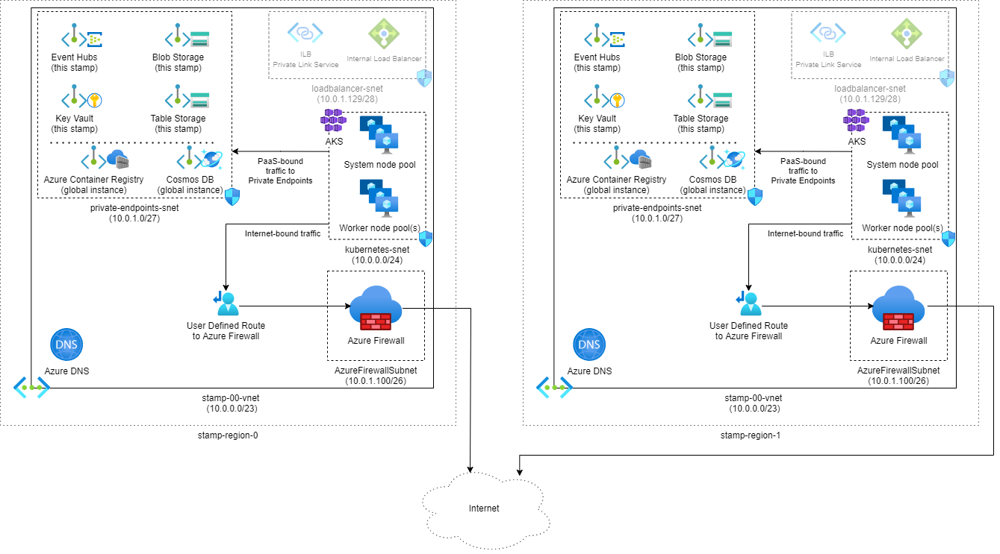

This reference architecture provides guidance for designing a mission critical workload that has network controls in place to prevent any unauthorized public access between the internet and the workload.

 It builds on the [mission-critical baseline architecture](/azure/architecture/reference-architectures/containers/aks-mission-critical/mission-critical-intro), which is focused on maximizing reliability and operational effectiveness. This architecture adds features to secure ingress and egress paths using cloud-native capabilities. It's recommended that you become familiar with the baseline before proceeding with this article.

> [!IMPORTANT]
>  The guidance is backed by a production-grade [example implementation](https://github.com/Azure/Mission-Critical-Connected) which showcases mission critical application development on Azure. This implementation can be used as a basis for further solution development in your first step towards production.

## Reliability tier
<!--how does security impact the overall reliablity-->

> [!TIP]
> To define a realistic SLO, it's important to understand the SLA of all Azure components within the architecture. These individual numbers should be aggregated to determine a [composite SLA](/azure/architecture/framework/resiliency/business-metrics#composite-slas) which should align with workload targets.
>
> Refer to [Well-architected mission critical workloads: Design for business requirements](/azure/architecture/framework/mission-critical/mission-critical-design-methodology#1design-for-business-requirements).

## Key design strategies

The [design strategies for mission-critical baseline](/azure/architecture/reference-architectures/containers/aks-mission-critical/mission-critical-intro#key-design-strategies) still apply in this use case. Here are some additional points:

- **Secure ingress**
    
    Ingress or inbound communication into the virtual network must secured. Eliminate any public connectivity to Azure services by using private endpoints. Further, inspect traffic to subnets by using network security groups (NSGs) on subnets with private endpoints.

- **Secure egress** 

    Egress traffic refers to traffic from a virtual network to entities outside that network. For example, Azure services used in the workload might need to access  endpoints for various management and control plane operations. That communication might be over the public internet. Lack of security controls on egress traffic might lead to data exfilteration attacks by malicious third-party services.

    Consider restricting outbound traffic to the internet using Azure Firewall and network security groups (NSGs) on the subnets.

- **Balance tradeoffs with security**

    There are significant trade-offs security features are added to the workload architecture. You might notice some impact on performance, operational agility, and even reliability. However, attack vectors, such as Denial-Of-Service (DDoS), data intrusion, and others, can target the system's overall reliability and eventually cause unavailability.

  
> The preceding strategies are based on the guidance provided in [Well-architected mission critical workloads](/azure/architecture/framework/mission-critical/).

The components of this architecture can be broadly categorized in this manner. For product documentation about Azure services, see [Related resources](#related-resources). 

## Global resources

The global resources are long living and share the lifetime of the system. They have the capability of being globally available within the context of a multi-region deployment model. 

**Azure Front Door** is used as the global load balancer for reliably routing traffic to the regional deployments with some level of guarantee based on the availability of backend services in a region. 

> Refer to [Well-architected mission critical workloads: Global traffic routing](/azure/architecture/framework/mission-critical/mission-critical-networking-connectivity#global-traffic-routing).

**Azure Cosmos DB with SQL API** is used to store state related to the workload outside the compute cluster. The database account is replicated to each regional stamp and also has zonal redundancy enabled. 

> Refer to [Well-architected mission critical workloads: Globally distributed multi-write datastore](/azure/architecture/framework/mission-critical/mission-critical-data-platform#globally-distributed-multi-write-datastore).

**Azure Container Registry** is used to store all container images. It has geo-replication capabilities that allow the resources to function as a single registry, serving multiple regions with multi-master regional registries.

> Refer to [Well-architected mission critical workloads: Container registry](/azure/architecture/framework/mission-critical/mission-critical-deployment-testing#container-registry).

## Regional resources
The regional resources are provisioned as part of a _deployment stamp_ to a single Azure region. They are short-lived to provide more resiliency, scale, and proximity to users. These resources share nothing with resources in another region. They can be independently removed or replicated to additional regions. They, however, share [global resources](#global-resources) between each other. 

**Static website in an Azure Storage Account** hosts a single page application (SPA) that send requests to backend services.

**Azure Virtual Networks** provide secure environments for running the workload and management operations. 

**Azure Kubernetes Service (AKS)** is the orchestrator for backend compute that runs an application and is stateless. The AKS cluster is deployed as a private cluster. So, the Kubernetes API server isn't exposed to the public internet, and traffic to the API server is limited to a private network. 

> Refer to [Well-architected mission critical workloads: Container Orchestration and Kubernetes](/azure/architecture/framework/mission-critical/mission-critical-application-platform#container-orchestration-and-kubernetes).

**Azure Firewall** is a network security service that protects all the Azure Virtual Network resources. The firewall allows only approved services and fully qualified domain names (FQDNs) as egress traffic.

**Azure Event Hubs** is used to optimize performance and maintain responsiveness during peak load, the design uses asynchronous messaging to handle intensive system flows. An additional Azure Storage account is provisioned for checkpointing. 

> Refer to [Well-architected mission critical workloads: Loosely coupled event-driven architecture](/azure/architecture/framework/mission-critical/mission-critical-application-design#loosely-coupled-event-driven-architecture).

**Azure Key Vault** stores secrets and configuration. There are common secrets such as connection strings to the global database but there is also information unique to a single stamp, such as the Event Hubs connection string. Also, independent resources avoid a single point of failure.

> Refer to [Well-architected mission critical workloads: Data integrity protection](/azure/architecture/framework/mission-critical/mission-critical-security#data-integrity-protection).

## Deployment pipeline

Build and release pipelines for a mission critical application must be fully automated. No action should be performed manually. This design demonstrates fully automated pipelines that deploy a validated stamp consistently every time. Another alternative approach is to only deploy rolling updates to an existing stamp.  

**GitHub** is used for source control, providing a highly available git-based platform for collaboration on application code and infrastructure code.

**Azure Pipelines** is chosen to automate pipelines are required for building, testing, and deploying a mission workload in preproduction _and_ production environments. 

> Refer to [Well-architected mission critical workloads: DevOps processes](/azure/architecture/framework/mission-critical/mission-critical-operational-procedures#devops-processes).

**Self-hosted Azure DevOps build agent pools** are used to have more control over the builds and deployments. This level of autonomy is needed because the compute cluster is private. 

> [!NOTE] 
>  The use of self-hosted agents is demonstrated in the [Mission Critical - Connected](https://aka.ms/mission-critical-connected) reference implementation.

## Observability resources

Operational data from application and infrastructure must be available to allow for effective operations and maximize reliability. Monitoring data for global resources and regional resources should be stored independently. A single, centralized observability store isn't recommended to avoid a single point of failure.

- **Azure Log Analytics** is used as a unified sink to store logs and metrics for all application and infrastructure components. 
- **Azure Application Insights** is used as an Application Performance Management (APM) tool to collect all application monitoring data and store it directly within Log Analytics.

## Management resources

Because the compute cluster is private, additional resources are provisioned to gain secure access to cluster. 

**Azure Virtual Machine Scale Sets** for jump box instances to run tools against the cluster, such as kubectl.

**Azure Bastion** provides secure access to a jump box and removes the need for the jump boxes to have public IPs. Bastion host is in a dedicated subnet of the virtual network in the stamp. 

The regional resources are provisioned as part of a _deployment stamp_ to a single Azure region. These resources share nothing with resources in another region. They can be independently removed or replicated to additional regions. They, however, share [global resources](#global-resources) between each other.

## Networking

Isolate regional resources and management resources in separate virtual networks. They have distinct purposes. 

- Type of traffic: Regional resources participate in processing of a business operation and need higher security controls. For example, the compute cluster must be protected from direct internet traffic. Management resources are provisioned only to access the regional resources for operations. So, they can be exposed to the public internet. 

- Lifetime: The expected lifetimes of those resources are also different. Regional resources are expected to be short-lived (ephemeral). They are created as part of the deployment stamp and destroyed when the stamp is torn down. Management resources share the lifetime of the region and out live the stamp resources.

In this architecture, there are two virtual networks: stamp network and operations network. Create further isolation within each virtual network by using subnets and network security groups (NSGs) to secure communication between the subnets.

### Operations virtual network

The operational traffic isolated in a separate virtual network. Because the cluster is private in this architecture, the network requires tighter security and segmentation through  subnetting. There are separate subnets to support, the deployment model that requires self-hosted build agents; management operations such as debugging. 

Both operations need to access PaaS services in the regional stamp, such as AKS, Key Vault, and others. Also, access to global resources such as the container registry is needed. In this architecture all PaaS service are locked down and can only be reached through private endpoints. So, another subnet is created for those endpoints. Inbound access to this subnet is secured by NSG that only allows traffic from the management and deployment subnets.

(need to mention DNS here)

#### Management operations

A typical use case is when an operator needs to access the compute cluster to run management tools and commands. Nodes in a private cluster  cannot be accessed directly. That's why jump boxes are provisioned where the operator can run the tools. But, the jump boxes need to be protected from unauthorized access. Direct access to jump boxes by opening RDP/SSH ports should be avoided. Azure Bastion is recommended for this purpose and requires a dedicated subnet in this virtual network. There's a separate subnet for the jump boxes. 

> [!NOTE] Connectivity through Azure Bastion and jump boxes can have an impact on developer productivity (like what?). Be aware of these impacts before deciding to harden security for your mission-critical workload.

You can secure ingress to the jump box subnet by using an NSG that only allows inbound traffic from the Bastion subnet over SSH.

If the operator needs to access public endpoints, outbound traffic must also be secure. (How?)

#### Deployment operations

To build deployment pipelines, you need to provision additional compute to run build agents. This architecture sequesters the build agents in a separate subnet. Ingress is restricted to Azure DevOps. Egress (how?)

## Global routing

## Stamp ingress

## Stamp egress
- Egress

Egress flow:
Two solutions:

- New snet called azure in all stamps. there's UDR on the subnet if there's coming from AKS or private endpoint. It will be go through Firewall. 
- Firewall rules can be very crisp and hyper local.

(most aligned version but very cost inffective. )

Option 2:

Keep vnet the same, 2 snets (priv end, k8)
regional vnets, has firewall. it's peered to the stamp v-net. 
(violates principles)
peering: when one vnet can talk to another vnet. free flowing. treat two as one. for MC perspective, peering can fail. It's weird to set up. Both sides resources need to be created. Deployment can be trickly. Not very intentional. You need non overlapping IP space. 

closer to the connected story.

## Design areas

We suggest that you explore these design areas for recommendations and best practice guidance when defining your own mission critical architecture.

|Design area|Description|
|---|---|
|[Application design](/azure/architecture/framework/mission-critical/mission-critical-application-design)|Design patterns that allow for scaling, and error handling.|
|**[Application platform](mission-critical-app-platform.md)|Infrastructure choices and mitigations for potential failure cases.|
|[Data platform](/azure/architecture/framework/mission-critical/mission-critical-data-platform)|Choices in data store technologies, informed by evaluating required volume, velocity, variety, and veracity characteristics.|
|**[Networking and connectivity](/azure/architecture/reference-architectures/containers/aks-mission-critical/mission-critical-networking)|Network considerations for routing incoming traffic to stamps.|
|[Health modeling](/azure/architecture/framework/mission-critical/mission-critical-health-modeling)|Observability considerations through customer impact analysis correlated monitoring to determine overall application health.|
|[Deployment and testing](/azure/architecture/framework/mission-critical/mission-critical-deployment-testing)|Strategies for CI/CD pipelines and automation considerations, with incorporated testing scenarios, such as synchronized load testing and failure injection (chaos) testing.|
|[Security](/azure/architecture/framework/mission-critical/mission-critical-security)|Mitigation of attack vectors through Microsoft Zero Trust model.|
|[Operational procedures](/azure/architecture/framework/mission-critical/mission-critical-operational-procedures)|Processes related to deployment, key management, patching and updates.|

** Indicates design area considerations that are specific to this reference architecture.

## Related resources

For product documentation on the Azure services used in this architecture, see these articles. 
- [Azure Front Door](/azure/frontdoor/)
- [Azure Cosmos DB](/azure/cosmos-db/)
- [Azure Container Registry](/azure/container-registry/)
- [Azure Log Analytics](/azure/azure-monitor/)
- [Azure Key Vault](/azure/key-vault/)
- [Azure Service Bus](/azure/service-bus-messaging/)
- [Azure Kubernetes Service](/azure/aks/)
- [Azure Application Insights](/azure/azure-monitor/)
- [Azure Event Hubs](/azure/event-hubs/)
- [Azure Blob Storage](/azure/storage/blobs/)

## Deploy this architecture

Deploy the reference implementation to get a complete understanding of considered resources, including how they are operationalized in a mission-critical context. 

> [!div class="nextstepaction"]
> [Implementation: Mission-Critical Online](https://github.com/Azure/Mission-Critical-Online)

## Next steps

If you want to extend this implementation with added security measures, refer to [Mission-Critical Connected](https://github.com/Azure/Mission-Critical-Connected). It contains a security-focused reference implementation and deployment guide intended to illustrate a solution-oriented approach for mission-critical application development on Azure.

