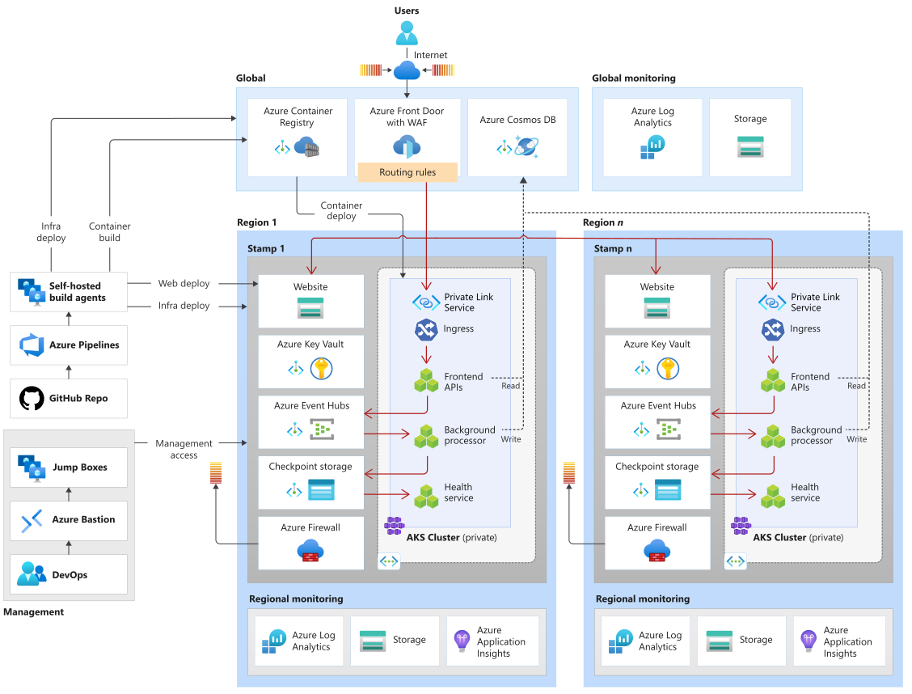
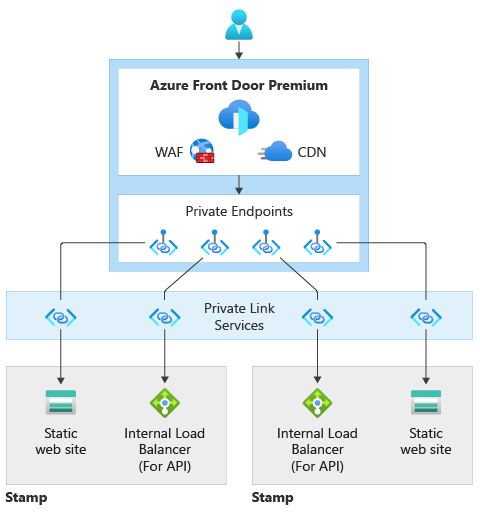
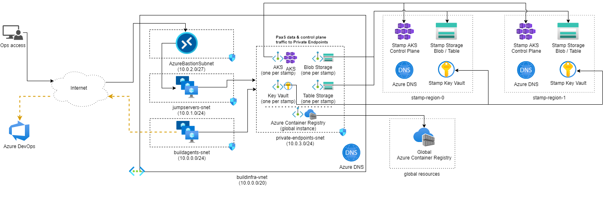

This reference architecture provides guidance for designing a mission critical workload that has network controls in place to prevent any unauthorized public access between the internet and the workload. 

It builds on the [mission-critical baseline architecture](/azure/architecture/reference-architectures/containers/aks-mission-critical/mission-critical-intro), which is focused on maximizing reliability and operational effectiveness without any private network. This architecture adds features to secure ingress and egress paths using cloud-native capabilities. It's recommended that you become familiar with the baseline before proceeding with this article.

## Reliability tier
TBD: how does security impact the overall reliablity -- insert blurb.

> [!TIP]
> To define a realistic SLO, it's important to understand the SLA of all Azure components within the architecture. These individual numbers should be aggregated to determine a [composite SLA](/azure/architecture/framework/resiliency/business-metrics#composite-slas) which should align with workload targets.
>
> Refer to [Well-architected mission critical workloads: Design for business requirements](/azure/architecture/framework/mission-critical/mission-critical-design-methodology#1design-for-business-requirements).

## Key design strategies

The [design strategies for mission-critical baseline](/azure/architecture/reference-architectures/containers/aks-mission-critical/mission-critical-intro#key-design-strategies) still apply in this use case. Here are some networking considerations:

- **Secure ingress traffic**
    
    Ingress or inbound communication into the virtual network must be secured. Distributed Denial of Service (DDoS) attacks can cause a targeted resource to become unavailable by overwhelming it with illegitimate traffic.
    
    _Eliminate public connectivity to Azure services by using private endpoints_. Further, inspect traffic by using network security groups (NSGs) on subnets with private endpoints.

- **Secure egress traffic** 

    Egress traffic from a virtual network to entities outside that network must be secured. Lack of security controls might lead to data exfilteration attacks by malicious third-party services.

    _Restrict outbound traffic to the internet using Azure Firewall and network security groups (NSGs) on the subnets_.

- **Balance tradeoffs with security**

    There are significant trade-offs when security features are added to a workload architecture. You might notice some impact on performance, operational agility, and even reliability. However,_ attack vectors, such as Denial-Of-Service (DDoS), data intrusion, and others, can target the system's overall reliability and eventually cause unavailability_.
  
> Preceding strategies are based on the guidance provided in [Well-architected mission critical workloads](/azure/architecture/framework/mission-critical/).

## Architecture

The components of this architecture can be broadly categorized in this manner. For product documentation about Azure services, see [Related resources](#related-resources). 

### Global resources

The global resources are long living and share the lifetime of the system. They have the capability of being globally available within the context of a multi-region deployment model. For more information, see [Global resources](/azure/architecture/reference-architectures/containers/aks-mission-critical/mission-critical-app-platform?branch=pr-en-us-7138#global-resources).

**Azure Front Door** is used as the global load balancer for reliably routing traffic to the regional deployments with some level of guarantee based on the availability of backend services in a region. 

> Refer to [Well-architected mission critical workloads: Global traffic routing](/azure/architecture/framework/mission-critical/mission-critical-networking-connectivity#global-traffic-routing).

**Azure Cosmos DB with SQL API** is used to store state related to the workload outside the compute cluster. The database account has multi-master write enabled. It's replicated to each regional stamp and also has zonal redundancy enabled. 

> Refer to [Well-architected mission critical workloads: Globally distributed multi-write datastore](/azure/architecture/framework/mission-critical/mission-critical-data-platform#globally-distributed-multi-write-datastore).

**Azure Container Registry** is used to store all container images. It has geo-replication capabilities that allow the resources to function as a single registry, serving multiple regions with multi-master regional registries.

> Refer to [Well-architected mission critical workloads: Container registry](/azure/architecture/framework/mission-critical/mission-critical-deployment-testing#container-registry).

### Regional resources
The regional resources are provisioned as part of a _deployment stamp_ to a single Azure region. They are short-lived to provide more resiliency, scale, and proximity to users. These resources share nothing with resources in another region. They can be independently removed or replicated to other regions. They, however, share [global resources](#global-resources) between each other. For more information, see [Regional stamp resources]/azure/architecture/reference-architectures/containers/aks-mission-critical/mission-critical-app-platform?branch=pr-en-us-7138#deployment-stamp-resources).

**Static website in an Azure Storage Account** hosts a single page application (SPA) that send requests to backend services. This component has the same configuration as the [baseline frontend](/azure/architecture/reference-architectures/containers/aks-mission-critical/mission-critical-intro?branch=pr-en-us-7138#frontend).

**Azure Virtual Networks** provide secure environments for running the workload and management operations. 

**Azure Kubernetes Service (AKS)** is the orchestrator for backend compute that runs an application and is stateless. The AKS cluster is deployed as a private cluster. So, the Kubernetes API server isn't exposed to the public internet, and traffic to the API server is limited to a private network. For more information, see the [Compute cluster](/azure/architecture/reference-architectures/containers/aks-mission-critical/mission-critical-app-platform?branch=pr-en-us-7138#compute-cluster) article of this architecture.

> Refer to [Well-architected mission critical workloads: Container Orchestration and Kubernetes](/azure/architecture/framework/mission-critical/mission-critical-application-platform#container-orchestration-and-kubernetes).

**Azure Firewall** is protects all egress traffic from the Azure Virtual Network resources. 

**Azure Event Hubs** is used as the [message broker](/azure/architecture/reference-architectures/containers/aks-mission-critical/mission-critical-intro?branch=pr-en-us-7138#regional-message-broker) to optimize performance and maintain responsiveness during peak load by using asynchronous messaging. An additional Azure Storage account is provisioned for checkpointing. 

> Refer to [Well-architected mission critical workloads: Loosely coupled event-driven architecture](/azure/architecture/framework/mission-critical/mission-critical-application-design#loosely-coupled-event-driven-architecture).

**Azure Key Vault** is used as the [regional secret store](/azure/architecture/reference-architectures/containers/aks-mission-critical/mission-critical-intro?branch=pr-en-us-7138#regional-secret-store). There are common secrets such as connection strings to the global database but there is also information unique to a single stamp, such as the Event Hubs connection string. Also, independent resources avoid a single point of failure.

> Refer to [Well-architected mission critical workloads: Data integrity protection](/azure/architecture/framework/mission-critical/mission-critical-security#data-integrity-protection).

### Deployment pipeline resources

Build and release pipelines for a mission critical application must be fully automated to guarantee a consistent way of deploying a validated stamp.  

**GitHub** is used for source control, providing a highly available git-based platform for collaboration on application code and infrastructure code.

**Azure Pipelines** is chosen to automate pipelines are required for building, testing, and deploying a mission workload in preproduction _and_ production environments. 

> Refer to [Well-architected mission critical workloads: DevOps processes](/azure/architecture/framework/mission-critical/mission-critical-operational-procedures#devops-processes).

**Self-hosted Azure DevOps build agent pools** are used to have more control over the builds and deployments. This level of autonomy is needed because the compute cluster is private. 

> [!NOTE] 
>  The use of self-hosted agents is demonstrated in the [Mission Critical - Connected](https://aka.ms/mission-critical-connected) reference implementation.

### Observability resources

Monitoring data for global resources and regional resources are stored independently. A single, centralized observability store isn't recommended to avoid a single point of failure.

- **Azure Log Analytics** is used as a unified sink to store logs and metrics for all application and infrastructure components. 
- **Azure Application Insights** is used as an Application Performance Management (APM) tool to collect all application monitoring data and store it directly within Log Analytics.

### Management resources

A significant design change from the baseline architecture is the compute cluster. In this design AKS cluster is private. This change requires extra resources to be  provisioned to gain secure access to cluster. 

**Azure Virtual Machine Scale Sets** for jump box instances to run tools against the cluster, such as kubectl.

**Azure Bastion** provides secure access to a jump box and removes the need for the jump boxes to have public IPs. 

## Private endpoints for PaaS services

To process a single business operation, the application and the build agents need to reach several Azure PaaS services that are provisioned  globally, within the region, and even within the stamp. In the baseline architecture, that communication is over the public internet. 

In this design, those services have been protected with private endpoints to prevent data exfiltration attacks. Using private endpoints increases the security of the design. However, it introduces another point of failure. Carefully consider the tradeoffs with security before adopting this approach.

Private endpoints require a dedicated subnet within a virtual network. Private IP addresses to the private endpoints are assigned from that subnet. Essentially, any resource in the virtual network can communicate with the service by reaching the private IP address. Make sure the address space is large enough to accommodate this subnet. 

To connect over a private endpoint, you need a DNS record. It's recommended that DNS records associated with the services are in private DNS zones. Make sure that the fully qualified domain name (FQDN) resolves to the private IP address.

In this architecture, private endpoints have been configured for Azure Container Registry, Cosmos DB, Key Vault, Storage resources, and Event Hubs. Also, the AKS cluster is deployed as a private cluster, which creates a private endpoint for the Kubernetes API service in the cluster's network. 

There are two virtual networks provisioned in this design and both have dedicated subnets to hold private endpoints for all those services. The network layout is described in [Virtual network layout](#virtual-network-layout).

As you add more components to the architecture, consider adding more private endpoints. They can be created on the same or different subnets within the same virtual network. There are limits to the number of private endpoints you can create in a subscription. For more information, see [Azure limits](/azure/azure-resource-manager/management/azure-subscription-service-limits#networking-limits).

Tighten the security further by using network security groups on the subnet to control both incoming and outgoing traffic.

## Global routing
Azure Front Door is used as the global entry point for all incoming client traffic. It uses Web Application Firewall (WAF) capabilities to allow or deny, and route traffic to the configured backend.

Because in this architecture, the [PaaS services have been secured by using private endpoints](#private-endpoints-for-paas-services), Front Door premium is used. This allows traffic to flow from the internet to Azure virtual networks without the use of public IPs to allow access to backends.

## Virtual network layout

Isolate regional resources and management resources in separate virtual networks. They have distinct characteristics, purposes, and security considerations. 

- **Type of traffic**: Regional resources, which participate in processing of business operations, need higher security controls. For example, the compute cluster must be protected from direct internet traffic. Management resources are provisioned only to access the regional resources for operations. So, they can be exposed to the public internet. 

- **Lifetime**: The expected lifetimes of those resources are also different. Regional resources are expected to be short-lived (ephemeral). They are created as part of the deployment stamp and destroyed when the stamp is torn down. Management resources share the lifetime of the region and out live the stamp resources.

In this architecture, there are two virtual networks: stamp network and operations network. Create further isolation within each virtual network by using subnets and network security groups (NSGs) to secure communication between the subnets.

### Regional stamp virtual network
The deployment stamp provisions a virtual network in each region. 

The virtual network is divided into these main subnets. All subnets have Network Security Groups (NSGs) assigned. NSGs will secure traffic between the application subnet and interactions with other components.  

- **Stamp ingress subnet**

    The entry point to each stamp is a private Azure Standard Load Balancer with one zone-redundant public IP. This approach mitigates the risk of attackers  attempting DDoS attacks against the endpoints. This resource is deployed as part of the Kubernetes Ingress Controller resource.

- **Stamp egress subnet**

    Azure Firewall is the single egress point and is used to inspect all outgoing traffic from the virtual network. User-defined routes (UDRs) must be considered on subnets that are capable of generating egress traffic, such as the application subnet. Traffic inspection is done through Azure Firewall rules that allow traffic from specific sources to go to specific targets.

- **Application subnet**

    The cluster node pools are placed in a dedicated subnet. If you need to isolate the system node pool from the worker node pool, you can place them in separate subnets. For each subnet, apply NSGs to block any malicious access from the virtual network.  
    
    Traffic from the node pools is restricted to the virtual network. However, AKS clusters require some public internet access to reach the managed control plane. Using NSGs and Firewall can make sure that egress traffic is inspected.

- **Private endpoints subnet**

    The application subnet will need to access the PaaS services in the regional stamp, Key Vault, and others. Also, access to global resources such as the container registry is needed. In this architecture, [all PaaS service are locked down](#private-endpoints-for-paas-services) and can only be reached through private endpoints. So, another subnet is created for those endpoints. Inbound access to this subnet is secured by NSG that only allows traffic from the application.

### Operations virtual network

The operational traffic isolated in a separate virtual network. Because the cluster is private in this architecture, the network requires tighter security and segmentation through  subnetting. There are separate subnets to support, the deployment model that requires self-hosted build agents; management operations such as debugging. 

Both operations need to access global PaaS services as well as those in the regional stamp. Similar to the regional stamp virtual network, a dedicated subnet is created for the private endpoints to PaaS services. NSG on this subnet makes sure ingress traffic is allowed only from the management and deployment subnets.

#### Management operations

A typical use case is when an operator needs to access the compute cluster to run management tools and commands. Nodes in a private cluster  can't be accessed directly. That's why jump boxes are provisioned where the operator can run the tools. There's a separate subnet for the jump boxes.

But, those jump boxes need to be protected as well from unauthorized access. Direct access to jump boxes by opening RDP/SSH ports should be avoided. Azure Bastion is recommended for this purpose and requires a dedicated subnet in this virtual network.  

> [!NOTE] 
> Connectivity through Azure Bastion and jump boxes can have an impact on developer productivity (like what?). Be aware of these impacts before deciding to harden security for your mission-critical workload.

You can secure ingress to the jump box subnet by using an NSG that only allows inbound traffic from the Bastion subnet over SSH.

If the operator needs to access public endpoints, outbound traffic must also be secure. (How? NSG? UDR?)

#### Deployment operations

To build deployment pipelines, you need to provision additional compute to run build agents. This architecture sequesters the build agents in a separate subnet. Ingress is restricted to Azure DevOps. Egress (how?)

## Design areas

We suggest that you explore these design areas for recommendations and best practice guidance when defining your own mission critical architecture.

|Design area|Description|
|---|---|
|[Application design](/azure/architecture/framework/mission-critical/mission-critical-application-design)|Design patterns that allow for scaling, and error handling.|
|**[Application platform](mission-critical-app-platform.md)|Infrastructure choices and mitigations for potential failure cases.|
|[Data platform](/azure/architecture/framework/mission-critical/mission-critical-data-platform)|Choices in data store technologies, informed by evaluating required volume, velocity, variety, and veracity characteristics.|
|**[Networking and connectivity](/azure/architecture/reference-architectures/containers/aks-mission-critical/mission-critical-networking)|Network considerations for routing incoming traffic to stamps.|
|[Health modeling](/azure/architecture/framework/mission-critical/mission-critical-health-modeling)|Observability considerations through customer impact analysis correlated monitoring to determine overall application health.|
|[Deployment and testing](/azure/architecture/framework/mission-critical/mission-critical-deployment-testing)|Strategies for CI/CD pipelines and automation considerations, with incorporated testing scenarios, such as synchronized load testing and failure injection (chaos) testing.|
|[Security](/azure/architecture/framework/mission-critical/mission-critical-security)|Mitigation of attack vectors through Microsoft Zero Trust model.|
|[Operational procedures](/azure/architecture/framework/mission-critical/mission-critical-operational-procedures)|Processes related to deployment, key management, patching and updates.|

** Indicates design area considerations that are specific to this reference architecture.

## Deploy this architecture

The networking aspects of this architecture are illustrated in the Mission-Critical Connected implementation.

> [!div class="nextstepaction"]
> [Implementation: Mission-Critical Connected](https://github.com/Azure/Mission-Critical-Connected)

> [!NOTE]
> The Connected implementation is intended to illustrate a mission-critical workload that relies on organizational resources, integrates with other workloads, and uses shared services. It builds on this reference architecture and uses the network controls described in this article. However, the Connected scenario assumes that virtual private network or Azure Private DNS Zone already exist within the Azure landing zones connectivity subscription.

## Related resources

For product documentation on the Azure services used in this architecture, see these articles. 
- [Azure Front Door](/azure/frontdoor/)
- [Azure Cosmos DB](/azure/cosmos-db/)
- [Azure Container Registry](/azure/container-registry/)
- [Azure Log Analytics](/azure/azure-monitor/)
- [Azure Key Vault](/azure/key-vault/)
- [Azure Service Bus](/azure/service-bus-messaging/)
- [Azure Kubernetes Service](/azure/aks/)
- [Azure Application Insights](/azure/azure-monitor/)
- [Azure Event Hubs](/azure/event-hubs/)
- [Azure Blob Storage](/azure/storage/blobs/)
- [Azure Firewall](/azure/storage/firewall/)