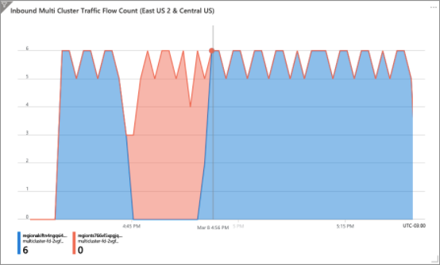

This reference architecture details how to run multiple instances of an Azure Kubernetes Service (AKS) cluster across multiple regions in an active/active and highly available configuration.

This architecture builds on the [AKS Baseline architecture](/azure/architecture/reference-architectures/containers/aks/secure-baseline-aks), Microsoft's recommended starting point for AKS infrastructure. The AKS baseline details infrastructural features like Azure Active Directory (Azure AD) pod identity, ingress and egress restrictions, resource limits, and other secure AKS infrastructure configurations. These infrastructural details are not covered in this document. It is recommended that you become familiar with the AKS baseline before proceeding with the multi-region content.

[](./images/aks-ha-large.png#lightbox)

 A reference implementation of this architecture is available on [GitHub](https://github.com/mspnp/aks-baseline-multi-region).

## Components

Many components and Azure services are used in the multi-region AKS reference architecture. Only those with uniqueness to this multi-cluster architecture are listed below. For the remaining, please reference the [AKS Baseline architecture](/azure/architecture/reference-architectures/containers/aks/secure-baseline-aks).

- **Multiple clusters / multiple regions** Multiple AKS clusters are deployed, each in a separate Azure region. During normal operations, network traffic is routed between all regions. If one region becomes unavailable, traffic is routed to a region closest to the user who issued the request.
- **Azure Front Door** Azure Front door is used to load balance and route traffic to a regional Azure Application Gateway instance, which sits in front of each AKS cluster. Azure Front Door allows for layer seven global routing, both of which are required for this reference architecture.
- **Key store** Azure Key Vault is provisioned in each region for storing sensitive values and keys.
- **Container registry** The container images for the workload are stored in a managed container registry.  In this architecture, a single Azure Container Registry is used for all Kubernetes instances in the cluster. Geo-replication for Azure Container Registry enables replicating images to the selected Azure regions and providing continued access to images even if a region is experiencing an outage.

## Design considerations

Consider the following items when designing a multi-region AKS deployment.

### Azure subscription

This reference architecture is split across several resource groups in a single subscription. This is to replicate the fact that many organizations will split certain responsibilities into specialized subscriptions (e.g. regional hubs/vwan in a Connectivity subscription and workloads in landing zone subscriptions). We expect you to explore this reference architecture within a single subscription, but when you implement this cluster at your organization, you will need to take what you've learned here and apply it to your expected subscription and resource group topology (such as those offered by the Cloud Adoption Framework.) This single subscription, multiple resource group model is for simplicity of demonstration purposes only.

### Cluster design

This reference architecture uses two cloud design patterns. [Geographical Node (geodes)](/azure/architecture/patterns/geodes), where any region can service any request, and [Deployment Stamps](/azure/architecture/patterns/deployment-stamp) where  multiple independent copies of an application or application component are deployed from a single source (deployment template). 

#### Geographical Node pattern considerations

When selecting geographical regions for each individual AKS cluster, consider utilizing paired Azure regions. Paired regions consist of two regions within the same geography which influence how Azure maintenance is performed. As your cluster scales beyond two regions, continue to plan for regional pair placement for each pair of AKS clusters. For more information on pared regions, see [Azure Paired Regions](/azure/best-practices-availability-paired-regions).

Within each individual region, the members of the AKS node pool are spread across multiple availability zones to help prevent issues due to zonal failures. AKS availability zones are specified during deployment and cannot be updated once deployed. AKS has a limited set of regional support for availability zones, which influences regional cluster placement. For more information on AKS and Availability zones, including a list of supported regions, see [AKS Availability Zones](/azure/aks/availability-zones).

#### Deployment stamp considerations

When managing a multi-region AKS cluster, multiple AKS instances are deployed across multiple regions. Each one of these instances is considered a stamp. In the event of a regional failure or the need to add more capacity and / or regional presence for your cluster, you may need to create a new stamp instance. When selecting a process for creating and managing deployment stamps, or individual Kubernetes instances in this case, it is important to consider the following things:

- Select stamp definition technology that allows for generalized configuration such as infrastructure as code
- Provide instance-specific values using a deployment input mechanism such as variables or parameter files
- Select deployment tooling that allows for flexible, repeatable, and idempotent deployment
- In an active/active stamp configuration, consider how traffic is balanced across each stamp
- As stamps are added and removed from the collection, consider capacity and cost concerns
- Consider how to gain visibility and/or monitor the collection of stamps as a single unit

Each of these items is detailed with specific guidance in the following sections of this reference architecture.

### Cluster deployment, configuration, and management

When deploying multiple Kubernetes clusters in highly available and geographically distributed configurations, it is essential to consider the sum of each Kubernetes cluster as a coupled unit. You will want to develop code-driven strategies for automated deployment and configuration to ensure that each Kubernetes instance is as identical as possible. You will want to consider strategies for scaling out and in by adding or removing additional Kubernetes instances. You will want to think through regional failure and ensure that any byproduct of a failure is compensated for in your deployment and configuration plan.

#### Deployment

You have many options for deploying an Azure Kubernetes Service cluster. The Azure portal, Azure CLI, Azure PowerShell module are all decent options for deploying individual or non-coupled AKS clusters. These tools, however, can present some challenges when working with many tightly coupled AKS clusters. For example, using the Azure portal opens the opportunity for miss-configuration due to missed steps or unavailable configuration options. As well, the deployment and configuration of many clusters using the portal is a timely process requiring the focus of one or more engineers. While you can construct a repeatable and automated process using the command line tools, the onus of things like idempotency, deployment failure control, and failure recovery is on you and the scripts you build. 

We recommend using infrastructure as code solutions, such and Azure Resource Manager templates, Bicep templates or Terraform configurations. Infrastructure as code solutions will provide an automated, scalable, and idempotent deployment solution. This reference architecture includes an ARM Template for the solutions shared services and then another for the AKS clusters + regional services. Using infrastructure as code, a deployment stamp can be defined with generalized configurations such as networking, authorization, and diagnostics. A deployment parameter file can be provided with regional-specific values. With this configuration, a single template can be used to deploy an identical stamp across any region.

_Example parameter file used to deploy an AKS cluster into the centralus region. Multiple parameter files can be provided, one for each region into which an ASK instance needs to be created._

```json
{
    "$schema": "https://schema.management.azure.com/schemas/2019-04-01/deploymentParameters.json#",
    "contentVersion": "1.0.0.0",
    "parameters": {
      "location": {
        "value": "centralus"
      },
      "targetVnetResourceId": {
        "value": "<cluster-spoke-vnet-resource-id>"
      },
      "appInstanceId": {
        "value": "04"
      },
      "clusterAdminAadGroupObjectId": {
        "value": "<azure-ad-aks-admin-group-object-id>"
      },
      "k8sControlPlaneAuthorizationTenantId": {
        "value": "<tenant-id-with-user-admin-permissions>"
      },
      "clusterInternalLoadBalancerIpAddress": {
        "value": "10.244.4.4"
      },
      "logAnalyticsWorkspaceId": {
        "value": "<log-analytics-workspace-id>"
      },
      "containerRegistryId": {
        "value": "<container-registry-id>"
      },
      "acrPrivateDnsZonesId": {
        "value": "<acrPrivateDns-zones-id>"
      }
    }
  }
```

Once the cluster stamp has been defined, you have many options for deploying individual or multiple stamp instances. Our recommendation is to use modern continuous integration technology such as GitHub Actions or Azure DevOps Pipelines. The benefit of continuous integration based deployment solutions include:

- Code-based deployments that allow for stamps to be added and removed using code
- Integrated testing capabilities
- Integrated environment and staging capabilities
- Integrated secrets management solutions 
- Integration with code / deployment source control
- Deployment history and logging

_The following is an example from the included GitHub Action demonstrating the deployment of an individual AKS cluster. In this example, the Azure CLI activity is used to deploy the stamp ARM template, providing region-specific values found in the region-specific parameters file._

```yaml
- name: Azure CLI - Deploy AKS cluster - Region 1
    id: aks-cluster-region1
    if: success() && env.DEPLOY_REGION1 == 'true'
    uses: Azure/cli@v1.0.0
    with:
    inlineScript: |
        az group create --name rg-bu0001a0042-03 --location eastus2
        az deployment group create --resource-group rg-bu0001a0042-03 \
        --template-file "cluster-stamp.json" \
            --parameters @azuredeploy.parameters.eastus2.json \
            appGatewayListenerCertificate=${{ secrets.APP_GATEWAY_LISTENER_REGION1_CERTIFICATE_BASE64 }} \
            aksIngressControllerCertificate=${{ secrets.AKS_INGRESS_CONTROLLER_CERTIFICATE_BASE64 }}
```

#### Cluster bootstrapping

Once each Kubernetes instance or stamp has been deployed, cluster components such as ingress controllers, identity solutions, and workload components need to be deployed and configured. You will also need to consider applying security, access, and governance policies across the cluster.

Similar to deployment, these configurations can become challenging to manage across several Kubernetes instances manually. Instead, consider the following options for configuration and policy at scale.

##### GitOps Pipelines

Instead of manually configuring Kubertnets components, consider using automated tooling to apply configurations to a Kubernetes cluster as these configurations are checked into a source repository. This process is often referred to as GitOps, and a popular GitOps solutions for Kubernetes include Flux and Argo CD.

GitOps is detailed in more depth in the [AKS Baseline Reference Architecture](/azure/architecture/reference-architectures/containers/aks/secure-baseline-aks#cluster-cicd). The important note here is that using a GitOps based approach to configuration helps ensure that each Kubernetes instance is configured similarly without bespoke effort.  

##### Azure Policy

As multiple Kubernetes instances are added to the globally avaliable cluster, the benefit of policy driven governanace, compliance, and configuraion increases. Utilizing policies, Azure Policies, in this case, provides a centralized and scalable method for cluster control. The benefit of AKS policies is detailed in the [AKS Secure Baseline](/azure/architecture/reference-architectures/containers/aks/secure-baseline-aks#policy-management).

Azure Policy is enabled in this reference implementation when the AKS clusters are created and assigns the restrictive initiative in Audit mode to gain visibility into non-compliance. The implementation also sets additional policies that are not part of any built-in initiatives. Those policies are set in Deny mode. For example, there is a policy in place to ensure that only approved container images are run in the cluster. Consider creating your own custom initiatives. Combine the policies that are applicable for your workload into a single assignment.

Policy scope refers to the target of each policy and policy initiative. The reference implementation associated with this architecture uses an ARM template to assign policies to the resource group into which each AKS cluster is deployed. As the footprint of the global cluster grows, this will result in many duplicate policies. You can also scope policies to an Azure Subscription or Azure Management Group, which would allow for a single set of policies to be applied to all AKS clusters within the scope of a subscription and/or all subscriptions found under a Management Group. Consider a policy management schema that works for your organization. See [Cloud Adoption Frameworks Management group and subscription organization](/azure/cloud-adoption-framework/ready/enterprise-scale/management-group-and-subscription-organization) for material that will help establish a policy management strategy.


_Example policy assignment that restricts the use of container images to a named set. Note that the scope is set to a resource group, and the effect is set to deny._

```json
{
    "type": "Microsoft.Authorization/policyAssignments",
    "apiVersion": "2020-03-01",
    "name": "[variables('policyAssignmentNameEnforceImageSource')]",
    "properties": {
        "displayName": "[concat('[', variables('clusterName'),'] ', reference(variables('policyResourceIdEnforceImageSource'), '2020-09-01').displayName)]",
        "scope": "[subscriptionResourceId('Microsoft.Resources/resourceGroups', resourceGroup().name)]",
        "policyDefinitionId": "[variables('policyResourceIdEnforceImageSource')]",
        "parameters": {
            "allowedContainerImagesRegex": {
                 "value": "[concat(variables('containerRegistryName'),'\.azurecr\.io\/.+$|mcr\.microsoft\.com\/.+')]"
            },
            "excludedNamespaces": {
                "value": [
                    "gatekeeper-system"
                ]
            },
            "effect": {
                "value": "deny"
            }
        }
    }
}
```

#### Workload deployment

In addition to AKS instance configuration, consider the workload deployed into each regional instance or stamp. Deployment solutions or pipelines will require configuration to accommodate each regional stamp.  As additional stamps are added to the global cluster, the deployment process needs to be extended or flexible enough to accommodate the new regional instances.

Consider the following when planning for workload deployment.

- Generalize the deployment, such as with a Helm chart, to ensure that a single deployment configuration can be used across multiple cluster stamps.
- Use a single continuous deployment pipeline configured to deploy the workload across all cluster stamps.
- Provide stamp-specific instance details as deployment parameters.
- Consider how application diagnostic logging and distributed tracing are configured for application-wide observability. 

### Avalibility / Failover

A significant motivation for choosing a multi-region Kubernetes architecture is service availability. That is, if a service or service component becomes un-available in one region, traffic should be routed to a region where that service is available. A multi-region architecture includes many different failure points. In this section, each of these potential failure points is discussed.

#### Application Pods (regional)

A Kubernetes deployment object is used to create multiple replicas of a pod (ReplicaRet). If one is unavailable, traffic is routed between the remaining. The Kubernetes ReplicaSet attempts to keep the specified number of replicas up and running. If one instance goes down, a new instance should be re-created. Finally, liveness probes can be used to check the state of the application or process running in the pod. If the service is not responding appropriately, the liveness probe will remove the pod, which forces the ReplicaSet to create a new instance.

For more information, see [Kubernetes Replicaset](https://kubernetes.io/docs/concepts/workloads/controllers/replicaset/).

#### Application Pods (global)

When an entire region becomes unavailable, the pods in the cluster are no longer available to serve requests. In this case, the Azure Front Door instance routes all traffic to the remaining healthy regions. The Kubernetes clusters and pods in these regions will continue to serve requests.

Take care in this situation to compensate for increased traffic / requests to the remaining cluster. A few things to consider:

- Ensure that network and compute resources are right-sized to absorb any sudden increase in traffic due to region failover. For example, when using Azure CNI, make sure you have a subnet that can support all Pod IPs with a spiked traffic load.
- Utilize Horizontal Pod Autoscaler to increase the pod replica count to compensate for the increased regional demand.
- Utilize AKS Cluster Autoscaler to increase the Kubernetes instance node counts to compensate for the increased regional demand.

For more information, see [Horizontal Pod Autoscaler](https://kubernetes.io/docs/concepts/workloads/controllers/replicaset/) and [AKS cluster autoscaler](/azure/aks/cluster-autoscaler).

#### Kubernets node pools (regional)

Occasionally localized failure can occur to compute resources, for instance, if power becomes unavailable to a single rack of Azure servers. To protect your AKS nodes from becoming a single point regional failure, utilize Azure Availability zones. Using availability zones ensures that AKS nodes in a given availability zone are physically separated from those defined in another availability zone.

For more information, see [AKS and Azure Availability Zones](/azure/aks/availability-zones).

#### Kubernetes node pools (global)

In a complete regional failure, Azure Front Door will route traffic to the remaining and healthy regions. Again, take care in this situation to compensate for increased traffic / requests to the remaining cluster.

For more information, see [Azure Front Door](/azure/frontdoor/).

### Traffic management

In this architecture, the traffic flows over the internet at several points. The receiving service only accepts and forwards TLS-encrypted traffic for maximum security. For example, The gateway accepts TLS encrypted traffic coming from the internet (as routed from Azure Front Door). Within the spoke, the cluster only accepts TLS encrypted traffic from the gateway.


1. The user sends a request to a domain name (https://multicluster-fd-2vgfhderl7kec.azurefd.net), which is resolved to the Azure Front Door instance. This request is encrypted with a wildcard certificate (*.azurefd.net) issued for all subdomains of Azure Front Door. The Azure Front Door instance validates the request against WAF policies, selects the fastest backend (based on health and latency), and uses public DNS to resolve the backend IP address (Azure Application Gateway instance).

2. Front Door forwards the request to the selected appropriate Application Gateway instance, which serves as the entry point for the regional stamp. The traffic flows over the internet and is encrypted by Azure Front Door. Consider a method to ensure that the Application Gateway instance only accepts traffic from the Front Door instance. One approach is to use a Network Security Group on the subnet that contains the Application Gateway. The rules can filter inbound (or outbound) traffic based on properties such as Source, Port, Destination. The Source property allows you to set a built-in service tag that indicates IP addresses for an Azure resource. This abstraction makes it easier to configure and maintain the rule and keep track of IP addresses. 

3.  Application Gateway routes the traffic to its backend pool, which is the FDQN of the internal load balancer deployed as part of the cluster's ingress resources. As an added security measure, you can re-encrypt this traffic to ensure unsafe traffic doesn’t flow into the cluster subnet. 
Application Gateway uses SSL ciphers to create a secure connection to the AKS cluster. 

4. The internal load balancer forwards the traffic to the workload pods. The load balancer decrypts traffic, and this is the final TLS termination point. From here on, traffic to the pods is over HTTP. 

### Shared resource considerations

While the focus of this reference architecture is on having multiple Kubernetes instances spread across multiple Azure regions, it does make sense to have some shared resources across all instances. The AKS multi-region reference implementation using a single ARM template to deploy all shared resources and then another to deploy each regional stamp. This section details each of these shared resources and considerations for using each across multiple AKS instances.

#### Container Registry

Azure Container Registry is used in this reference architecture to provide container image services (pull). Consider the following items when working with Azure Container Registry in a multi-region cluster deployment.

##### Geographic avalibility

Positioning a container registry in each region in which an AKS cluster is deployed allows for network-close operations, enabling fast, reliable image layer transfers. Having multiple image service endpoints also provides availability in the event regional services are unavailable. Using Azure Container Registries geo-replication functionality allows you to manage one Container Registry instance replicated to multiple regions.

The AKS multi-region reference implementation created a single Container Registry instance and replicas of this instance into each cluster region. For more information on Azure Container Registry replication, see [Geo-replication in Azure Container Registry](/azure/container-registry/container-registry-geo-replication).

_Image showing multiple ACR replicas from within the Azure portal._


##### Cluster Access

Each AKS instance requires access for pulling image layers from the Azure Container Registry. There are multiple ways for establishing access to Azure Container Registry; this reference architecture uses an Azure Managed Identity for each cluster, which is then granted the AcrPull role on the Container Registry instance. For more information and recommendations on using Managed Identities for Container Registry access, see the [AKS Secure Baseline](/azure/architecture/reference-architectures/containers/aks/secure-baseline-aks#integrate-azure-active-directory-for-the-cluster).

This configuration is defined in the cluster stamp ARM template so that each time a new stamp is deployed, the new AKS instance is granted access. Because the Container Registry is a shared resource, ensure that your deployment stamp template can consume and use the necessary details, in this case, the resource ID of the Container Registry.

#### Log Analytics and Azure Monitor

The Azure Monitor for containers feature is the recommended tool for monitoring and logging because you can view events in real-time. Azure Monitor utilizes a Log Analytics workspace for storing diagnostic logs. See the [AKS Secure Baseline](/azure/architecture/reference-architectures/containers/aks/secure-baseline-aks#monitor-and-collect-metrics) for more information.

When considering monitoring for a cross-region implementation such as this reference architecture, it is important to consider the coupling between each stamp. In this case, consider each stamp a component of a single unit (regional cluster). The multi-region AKS reference implementation utilizes a single Log Analytics workspace for each Kubernetes cluster. Like with the other shared resources, define your regional stamp to consume information about the single log analytics workspace and connect each cluster to it.

_ARM template example where the Log Analytics workspace ID is consumed as a parameter used to configure monitoring for each cluster stamp._

```json
"omsagent": {
    "enabled": true,
    "config": {
        "logAnalyticsWorkspaceResourceId": "[parameters('logAnalyticsWorkspaceId')]"
    }
}
```

Now that each regional cluster is omitting diagnostic logs to a single Log Analytics workspace, this data, along with resource metrics, can be used to more easily build reports and dashboards that represent the entirety of the global cluster.

_Example chart showing inbound traffic across all regions. Note, no reports are included with the reference architecture, you will need to create your own._



#### Azure Front Door

Azure Front door is used to load balance and route traffic to each AKS cluster. Azure Front Door allows for layer seven global routing, both of which are required for this reference architecture.

##### Cluster configuration

As AKS instances are added to the global cluster, the Application Gateway deployed alongside the Kubernetes cluster needs to be enrolled as a backend for proper routing. In the included reference implementation, this process is managed using the Azure CLI in the deployment pipeline.

_Example pipeline step demonstrating adding an Application Gateway instance as a Front Door backend._

```yaml
- name: Azure CLI - Enroll Azure Application Gateway as backend in Azure Front Door - Region 1 
  id: enrol-cluster-1
  if: success() && env.DEPLOY_REGION1 == 'true'
  uses: Azure/cli@v1.0.0
  with:
    inlineScript: |
      az extension add --upgrade -n front-door
      APPGW_FQDN_BU0001A0042_03=$(az deployment group show -g rg-enterprise-networking-spokes -n spoke-BU0001A0042-03 --query properties.outputs.appGwFqdn.value -o tsv)
      FRONT_DOOR_NAME=$(az deployment group show -g rg-bu0001a0042-shared -n shared-svcs-stamp --query properties.outputs.frontDoorName.value -o tsv)
      FRONT_DOOR_BACKENDPOOL_NAME=$(az deployment group show -g rg-bu0001a0042-shared -n shared-svcs-stamp --query properties.outputs.frontDoorBackendPoolName.value -o tsv)
      az network front-door backend-pool backend add --address $APPGW_FQDN_BU0001A0042_03 --front-door-name $FRONT_DOOR_NAME --pool-name $FRONT_DOOR_BACKENDPOOL_NAME -g rg-bu0001a0042-shared --backend-host-header $APPGW_FQDN_BU0001A0042_03 --disabled false --http-port 80 --https-port 443  --priority 1 --weight 50
```

##### Certificates

Front Door doesn't use self-signed certificates even in Dev/Test environments. To enable HTTPS traffic, you need to create your TLS/SSL certificate that is signed by a certificate authority (CA). This architecture uses [Certbot](https://certbot.eff.org/) to create a Let's Encrypt Authority X3 certificate. Certbot is a free, open-source software tool. It generates certificates for manually administrated websites. To check the validity of the website, Certbot sends a request to the domain. Respond to that request to acknowledge that you own the domain. If that validation is successful, a certificate is generated.

For information about other CAs supported by Front Door, see [Allowed certificate authorities for enabling custom HTTPS on Azure Front Door](/azure/frontdoor/front-door-faq#what-certificates-are-supported-on-azure-front-door-).

### Cluster access and identity

As discussed in the [AKS Baseline Reference Architecture](/azure/architecture/reference-architectures/containers/aks/secure-baseline-aks#integrate-azure-active-directory-for-the-cluster), consider using Azure Active Directory as a cluster access identity provider. The Azure Active Directory groups can then be used to control access to cluster resources.

When managing multiple clusters, you will need to decide on an access schema. Options include:

- Create a global cluster-wide access-group where members can access all objects across every Kubernetes instance in the cluster.
- Create an individual access group for each Kubernetes instance which is used to grant access to objects in an individual cluster instance.
- Define granular access controls for Kubernetes object types and namespaces, and correlate this to an Azure Directory Group structure.

With the included reference implementation, a two AAD groups are created for admin access. These groups are specified at cluster stamp deployment time using the deployment parameter file. Members of each group have full access to the coresponding cluster stamp.

<insert additional content on options and trade offs - [link](https://github.com/MicrosoftDocs/architecture-center-pr/pull/2928#discussion_r658062888)]

For more information on managing AKS cluster access with Azure Active Directory, see [AKS Azure AD Integration](/azure/aks/azure-ad-integration-cli).

### Data and state

When using a globally distributed cluster of AKS instances, consider the architecture of the application, process, or other workloads that might run across the cluster. As state-based workload is spread across the cluster, will it need to access a state store? If a process is recreated elsewhere in the cluster due to failure, will the workload or process continue to have access to a dependant state store? State can be achieved in many ways; however, it can be complex in a single Kubernetes cluster. The complexity increases when adding in multiple clustered Kubernetes instances. Due to regional access and complexity concerns, consider architecting your applications to use a globally distributed state store service.

The multi-cluster reference implementation does not include a demonstration or configuration for state concerns. If running applications across clustered AKS instance, consider architecting workload to use a globally distributed data service, such as Azure Cosmos DB. Azure Cosmos DB is a globally distributed database system that allows you to read and write data from the local replicas of your database. For more information, see [Azure Cosmos DB](/azure/cosmos-db/).