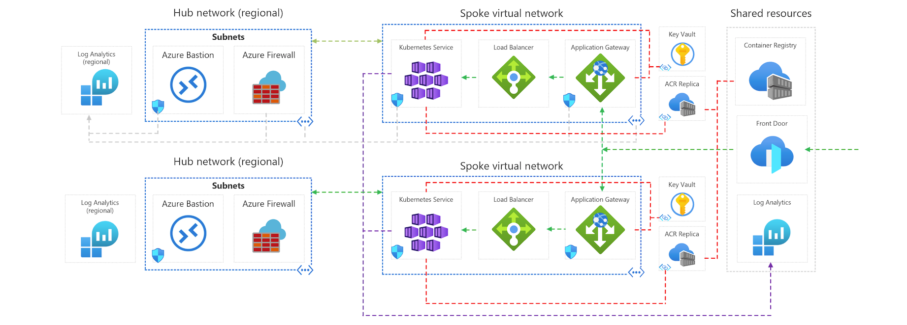

This reference architecture details how to run multiple instances of an Azure Kubernetes Service (AKS) cluster across multiple regions in an active/active and highly available configuration.

This architecture builds on the [AKS Baseline architecture](../aks/secure-baseline-aks.yml), Microsoft's recommended starting point for AKS infrastructure. The AKS baseline details infrastructural features like Azure Active Directory (Azure AD) pod identity, ingress and egress restrictions, resource limits, and other secure AKS infrastructure configurations. These infrastructural details are not covered in this document. It is recommended that you become familiar with the AKS baseline before proceeding with the multi-region content.

 A reference implementation of this architecture is available on [GitHub](https://github.com/mspnp/aks-baseline-multi-region).

## Components

Many components and Azure services are used in the multi-region AKS reference architecture. Only those components with uniqueness to this multi-cluster architecture are listed below. For the remaining, reference the [AKS Baseline architecture](../aks/secure-baseline-aks.yml).

- **Multiple clusters / multiple regions** Multiple AKS clusters are deployed, each in a separate Azure region. During normal operations, network traffic is routed between all regions. If one region becomes unavailable, traffic is routed to a region closest to the user who issued the request.
- **hub-spoke network per region** A regional hub-spoke network pair are deployed for each regional AKS instance. Azure Firewall Manager policies are used to manage firewall policies across all regions.
- **Regional Key store** Azure Key Vault is provisioned in each region for storing sensitive values and keys specific to the AKS instance and supporting services found in that region.
- **Azure Front Door** Azure Front door is used to load balance and route traffic to a regional Azure Application Gateway instance, which sits in front of each AKS cluster. Azure Front Door allows for layer seven global routing, both of which are required for this reference architecture.
- **Log Analytics** Regional Log Analytics instances are used for storing regional networking metrics and diagnostic logs. Additionally, a shared Log Analytics instance is used to store metrics and diagnostic logs for all AKS instances.
- **Container registry** The container images for the workload are stored in a managed container registry. In this architecture, a single Azure Container Registry is used for all Kubernetes instances in the cluster. Geo-replication for Azure Container Registry enables replicating images to the selected Azure regions and providing continued access to images even if a region is experiencing an outage.

## Design patterns

This reference architecture uses two cloud design patterns. [Geographical Node (geodes)](../../../patterns/geodes.md), where any region can service any request, and [Deployment Stamps](../../../patterns/deployment-stamp.yml) where multiple independent copies of an application or application component are deployed from a single source (deployment template).

#### Geographical Node pattern considerations

When selecting regions into which each AKS cluster will be deployed, consider regions close to the workload consumer or your customers. Also, consider utilizing paired Azure regions. Paired regions consist of two regions within the same geography, which influence how Azure maintenance is performed. As your cluster scales beyond two regions, continue to plan for regional pair placement for each pair of AKS clusters. For more information on pared regions, see [Azure Paired Regions](/azure/best-practices-availability-paired-regions).

Within each region, the nodes in the AKS node pools are spread across multiple availability zones to help prevent issues due to zonal failures. Availability zones are supported in a limited set of regions, which influences regional cluster placement. For more information on AKS and Availability zones, including a list of supported regions, see [AKS Availability Zones](/azure/aks/availability-zones).

#### Deployment stamp considerations

When managing a multi-region AKS cluster, multiple AKS instances are deployed across multiple regions. Each one of these instances is considered a stamp. In the event of a regional failure or the need to add more capacity and / or regional presence for your cluster, you may need to create a new stamp instance. When selecting a process for creating and managing deployment stamps, it is important to consider the following things:

- Select stamp definition technology that allows for generalized configuration such as infrastructure as code
- Provide instance-specific values using a deployment input mechanism such as variables or parameter files
- Select deployment tooling that allows for flexible, repeatable, and idempotent deployment
- In an active/active stamp configuration, consider how traffic is balanced across each stamp
- As stamps are added and removed from the collection, consider capacity and cost concerns
- Consider how to gain visibility and/or monitor the collection of stamps as a single unit

Each of these items is detailed with specific guidance in the following sections of this reference architecture.

### Cluster deployment and bootstrapping

When deploying multiple Kubernetes clusters in highly available and geographically distributed configurations, it is essential to consider the sum of each Kubernetes cluster as a coupled unit. You may want to develop code-driven strategies for automated deployment and configuration to ensure that each Kubernetes instance is as identical as possible. You will want to consider strategies for scaling out and in by adding or removing additional Kubernetes instances. You will want to think through regional failure and ensure that any byproduct of a failure is compensated for in your deployment and configuration plan.

#### Cluster definition

You have many options for deploying an Azure Kubernetes Service cluster. The Azure portal, Azure CLI, Azure PowerShell module are all decent options for deploying individual or non-coupled AKS clusters. These tools, however, can present challenges when working with many tightly coupled AKS clusters. For example, using the Azure portal opens the opportunity for miss-configuration due to missed steps or unavailable configuration options. As well, the deployment and configuration of many clusters using the portal is a timely process requiring the focus of one or more engineers. While you can construct a repeatable and automated process using the command-line tools, the onus of things like idempotency, deployment failure control, and failure recovery is on you and the scripts you build.

When working with many AKS instances, we recommend considering infrastructure as code solutions, such and Azure Resource Manager templates, Bicep templates, or Terraform configurations. Infrastructure as code solutions provide an automated, scalable, and idempotent deployment solution. This reference architecture includes an ARM Template for the solutions shared services and then another for the AKS clusters + regional services. Using infrastructure as code, a deployment stamp can be defined with generalized configurations such as networking, authorization, and diagnostics. A deployment parameter file can be provided with regional-specific values. With this configuration, a single template can be used to deploy an almost identical stamp across any region.

The cost of developing and maintaining infrastructure as code assets can be costly. In some cases, such as when a static / fixed number of AKS instances are deployed, the overhead of infrastructure as code may outweigh the benefits. For these cases, using a more imperative approach, such as with command-line tools, or even a manual approach, are ok.

#### Cluster deployment

Once the cluster stamp definition has been defined, you have many options for deploying individual or multiple stamp instances. Our recommendation is to use modern continuous integration technology such as GitHub Actions or Azure Pipelines. The benefit of continuous integration-based deployment solutions include:

- Code-based deployments that allow for stamps to be added and removed using code
- Integrated testing capabilities
- Integrated environment and staging capabilities
- Integrated secrets management solutions
- Integration with code / deployment source control
- Deployment history and logging

As new stamps are added or removed from the global cluster, the deployment pipeline needs to be updated to reflect. In the reference implementation, each region is deployed as an individual step within a GitHub action workflow [(example)](https://github.com/mspnp/aks-baseline-multi-region/blob/main/github-workflow/aks-deploy.yaml#L55). This configuration is simple in that each cluster instance is clearly defined within the deployment pipeline. This configuration does, however, carry some administrative overhead in adding and removing clusters from the deployment.

Another option would be to utilize logic to create clusters based on a list of desired locations or other indicating data points. For instance, the deployment pipeline could contain a list of desired regions; a step within the pipeline could then loop through this list, deploying a cluster into each region found in the list. The disadvantage to this configuration is the complexity in deployment generalization and that each cluster stamp is not explicitly detailed in the deployment pipeline. The positive benefit is that adding or removing cluster stamps from the pipeline becomes a simple update to the list of desired regions.

Also, note that removing a cluster stamp from the deployment pipeline does not necessarily ensure that it will also be decommissioned. Depending on your deployment technology and configuration, you may need an extra step to ensure that the AKS instances have appropriately been decommissioned.

#### Cluster bootstrapping

Once each Kubernetes instance or stamp has been deployed, cluster components such as ingress controllers, identity solutions, and workload components need to be deployed and configured. You will also need to consider applying security, access, and governance policies across the cluster.

Similar to deployment, these configurations can become challenging to manage across several Kubernetes instances manually. Instead, consider the following options for configuration and policy at scale.

##### GitOps

Instead of manually configuring Kubertnets components, consider using automated tooling to apply configurations to a Kubernetes cluster as these configurations are checked into a source repository. This process is often referred to as GitOps, and popular GitOps solutions for Kubernetes include Flux and Argo CD.

GitOps is detailed in more depth in the [AKS Baseline Reference Architecture](../aks/secure-baseline-aks.yml#cluster-cicd). The important note here is that using a GitOps based approach to configuration helps ensure that each Kubernetes instance is configured similarly without bespoke effort.

##### Azure Policy

As multiple Kubernetes instances are added, the benefit of policy-driven governance, compliance, and configuration increases. Utilizing policies, Azure Policies, in this case, provides a centralized and scalable method for cluster control. The benefit of AKS policies is detailed in the [AKS Baseline Reference Architecture](../aks/secure-baseline-aks.yml#policy-management).

Azure Policy is enabled in this reference implementation when the AKS clusters are created and assigns the restrictive initiative in Audit mode to gain visibility into non-compliance. The implementation also sets additional policies that are not part of any built-in initiatives. Those policies are set in Deny mode. For example, there is a policy in place to ensure that only approved container images are run in the cluster. Consider creating your own custom initiatives. Combine the policies that are applicable for your workload into a single assignment.

Policy scope refers to the target of each policy and policy initiative. The reference implementation associated with this architecture uses an ARM template to assign policies to the resource group into which each AKS cluster is deployed. As the footprint of the global cluster grows, this will result in many duplicate policies. You can also scope policies to an Azure Subscription or Azure Management Group, which would allow for a single set of policies to be applied to all AKS clusters within the scope of a subscription and/or all subscriptions found under a Management Group.

When designing policy for multiple AKS clusters, consider the following items:

- Policies that should apply globally to all AKS instances can be applied to a management group or subscription
- Placing each regional cluster in its own resource group allows for region-specific policies applied to the resource group

See [Cloud Adoption Frameworks Management group and subscription organization](/azure/cloud-adoption-framework/ready/enterprise-scale/management-group-and-subscription-organization) for material that will help establish a policy management strategy.

#### Workload deployment

In addition to AKS instance configuration, consider the workload deployed into each regional instance or stamp. Deployment solutions or pipelines will require configuration to accommodate each regional stamp.  As additional stamps are added to the global cluster, the deployment process needs to be extended or flexible enough to accommodate the new regional instances.

Consider the following items when planning for workload deployment.

- Generalize the deployment, such as with a Helm chart, to ensure that a single deployment configuration can be used across multiple cluster stamps.
- Use a single continuous deployment pipeline configured to deploy the workload across all cluster stamps.
- Provide stamp-specific instance details as deployment parameters.
- Consider how application diagnostic logging and distributed tracing are configured for application-wide observability.

### Availability / Failover

A significant motivation for choosing a multi-region Kubernetes architecture is service availability. That is, if a service or service component becomes unavailable in one region, traffic should be routed to a region where that service is available. A multi-region architecture includes many different failure points. In this section, each of these potential failure points is discussed.

#### Application Pods (regional)

A Kubernetes deployment object is used to create multiple replicas of a pod (ReplicaSet). If one is unavailable, traffic is routed between the remaining. The Kubernetes ReplicaSet attempts to keep the specified number of replicas up and running. If one instance goes down, a new instance should be re-created. Finally, liveness probes can be used to check the state of the application or process running in the pod. If the service is not responding appropriately, the liveness probe will remove the pod, which forces the ReplicaSet to create a new instance.

For more information, see [Kubernetes ReplicaSet](https://kubernetes.io/docs/concepts/workloads/controllers/replicaset/).

#### Application Pods (global)

When an entire region becomes unavailable, the pods in the cluster are no longer available to serve requests. In this case, the Azure Front Door instance routes all traffic to the remaining healthy regions. The Kubernetes clusters and pods in these regions will continue to serve requests.

Take care in this situation to compensate for increased traffic / requests to the remaining cluster. A few things to consider:

- Ensure that network and compute resources are right-sized to absorb any sudden increase in traffic due to region failover. For example, when using Azure CNI, make sure you have a subnet that can support all Pod IPs with a spiked traffic load.
- Utilize Horizontal Pod Autoscaler to increase the pod replica count to compensate for the increased regional demand.
- Utilize AKS Cluster Autoscaler to increase the Kubernetes instance node counts to compensate for the increased regional demand.

For more information, see [Horizontal Pod Autoscaler](/azure/aks/concepts-scale#horizontal-pod-autoscaler) and [AKS cluster autoscaler](/azure/aks/cluster-autoscaler).

#### Kubernetes node pools (regional)

Occasionally localized failure can occur to compute resources, for instance, if power becomes unavailable to a single rack of Azure servers. To protect your AKS nodes from becoming a single point regional failure, utilize Azure Availability zones. Using availability zones ensures that AKS nodes in a given availability zone are physically separated from those defined in another availability zone.

For more information, see [AKS and Azure Availability Zones](/azure/aks/availability-zones).

#### Kubernetes node pools (global)

In a complete regional failure, Azure Front Door will route traffic to the remaining and healthy regions. Again, take care in this situation to compensate for increased traffic / requests to the remaining cluster.

For more information, see [Azure Front Door](/azure/frontdoor/).

### Network topology

Similar to the AKS Baseline Reference Architecture, this architecture uses a hub-spoke network topology. In addition to the considerations specified in the [AKS Baseline Reference Architecture](../aks/secure-baseline-aks.yml#network-topology), consider the following:

- Implement a hub-spoke for each regional AKS instance, where the hub-spoke virtual networks are peered.
- Route all outbound traffic through an Azure Firewall instance found in each regional hub network. Utilize Azure Firewall Manager policies to manage firewall policies across all regions.
- Follow the IP sizing found in the [AKS Baseline Reference Architecture](../aks/secure-baseline-aks.yml#plan-the-ip-addresses) plus allow for additional IP addresses for both node and pod scale operations in the event of a regional failure.

### Traffic management

With the AKS Baseline Reference Architecture, workload traffic is routed directly to an Azure Application Gateway instance, then forwarded onto the backend load balancer / AKS ingress resources. When working with multiple clusters, client requests are routed through an Azure Front Door instance, which routes to the Azure Application Gateway instance.

1. The user sends a request to a domain name (e.g. https://contoso-web.azurefd.net), which is resolved to the Azure Front Door instance. This request is encrypted with a wildcard certificate (*.azurefd.net) issued for all subdomains of Azure Front Door. The Azure Front Door instance validates the request against WAF policies, selects the fastest backend (based on health and latency), and uses public DNS to resolve the backend IP address (Azure Application Gateway instance).

2. Front Door forwards the request to the selected appropriate Application Gateway instance, which serves as the entry point for the regional stamp. The traffic flows over the internet and is encrypted by Azure Front Door. Consider a method to ensure that the Application Gateway instance only accepts traffic from the Front Door instance. One approach is to use a Network Security Group on the subnet that contains the Application Gateway. The rules can filter inbound (or outbound) traffic based on properties such as Source, Port, Destination. The Source property allows you to set a built-in service tag that indicates IP addresses for an Azure resource. This abstraction makes it easier to configure and maintain the rule and keep track of IP addresses. Additionally, consider utilizing the Front Door to backend `X-Azure-FDID` header to ensure that the Application Gateway instance only accepts traffic from the Front Door instance. For more information on Front Door headers, see [Protocol support for HTTP headers in Azure Front Door](/azure/frontdoor/front-door-http-headers-protocol).

### Shared resource considerations

While the focus of this reference architecture is on having multiple Kubernetes instances spread across multiple Azure regions, it does make sense to have some shared resources across all instances. The AKS multi-region reference implementation using a single ARM template to deploy all shared resources and then another to deploy each regional stamp. This section details each of these shared resources and considerations for using each across multiple AKS instances.

#### Container Registry

Azure Container Registry is used in this reference architecture to provide container image services (pull). Consider the following items when working with Azure Container Registry in a multi-region cluster deployment.

##### Geographic availability

Positioning a container registry in each region in which an AKS cluster is deployed allows for network-close operations, enabling fast, reliable image layer transfers. Having multiple image service endpoints also provides availability in the event regional services are unavailable. Using Azure Container Registries geo-replication functionality allows you to manage one Container Registry instance replicated to multiple regions.

The AKS multi-region reference implementation created a single Container Registry instance and replicas of this instance into each cluster region. For more information on Azure Container Registry replication, see [Geo-replication in Azure Container Registry](/azure/container-registry/container-registry-geo-replication).

_Image showing multiple ACR replicas from within the Azure portal._

##### Cluster Access

Each AKS instance requires access for pulling image layers from the Azure Container Registry. There are multiple ways for establishing access to Azure Container Registry; this reference architecture uses an Azure Managed Identity for each cluster, which is then granted the AcrPull role on the Container Registry instance. For more information and recommendations on using Managed Identities for Container Registry access, see the [AKS Baseline Reference Architecture](../aks/secure-baseline-aks.yml#integrate-azure-active-directory-for-the-cluster).

This configuration is defined in the cluster stamp ARM template so that each time a new stamp is deployed, the new AKS instance is granted access. Because the Container Registry is a shared resource, ensure that your deployment stamp template can consume and use the necessary details, in this case, the resource ID of the Container Registry.

#### Log Analytics and Azure Monitor

The Azure Monitor container insights feature is the recommended tool for monitoring and logging because you can view events in real time. Azure Monitor utilizes a Log Analytics workspace for storing diagnostic logs. See the [AKS Baseline Reference Architecture](../aks/secure-baseline-aks.yml#monitor-and-collect-metrics) for more information.

When considering monitoring for a cross-region implementation such as this reference architecture, it is important to consider the coupling between each stamp. In this case, consider each stamp a component of a single unit (regional cluster). The multi-region AKS reference implementation utilizes a single Log Analytics workspace, shared by each Kubernetes cluster. Like with the other shared resources, define your regional stamp to consume information about the single log analytics workspace and connect each cluster to it.

Now that each regional cluster is omitting diagnostic logs to a single Log Analytics workspace, this data, along with resource metrics, can be used to more easily build reports and dashboards that represent the entirety of the global cluster.

#### Azure Front Door

Azure Front door is used to load balance and route traffic to each AKS cluster. Azure Front Door allows for layer seven global routing, both of which are required for this reference architecture.

##### Cluster configuration

As regional AKS instances are added, the Application Gateway deployed alongside the Kubernetes cluster needs to be enrolled as a Front Door backend for proper routing. This operation requires an update to your infrastructure as code assets. Alternatively, this operation can be decoupled from the deployment configuration and managed with tools such as the Azure CLI. The included reference implementations deployment pipeline utilizes a distinct Azure CLI step for this operation.

##### Certificates

Front Door does not support self-signed certificates even in Dev/Test environments. To enable HTTPS traffic, you need to create your TLS/SSL certificate signed by a certificate authority (CA). The reference implementation uses [Certbot](https://certbot.eff.org/) to create a Let's Encrypt Authority X3 certificate. When planning for a production cluster, use your organization's preferred method for procuring TLS certificates.

For information about other CAs supported by Front Door, see [Allowed certificate authorities for enabling custom HTTPS on Azure Front Door](/azure/frontdoor/front-door-faq#does-front-door-support-self-signed-certificates-on-the-backend-for-https-connection-).

### Cluster access and identity

As discussed in the [AKS Baseline Reference Architecture](../aks/secure-baseline-aks.yml#integrate-azure-active-directory-for-the-cluster), it is recommended to use Azure Active Directory as the clusters' access identity provider. The Azure Active Directory groups can then be used to control access to cluster resources.

When managing multiple clusters, you will need to decide on an access schema. Options include:

- Create a global cluster-wide access-group where members can access all objects across every Kubernetes instance in the cluster. This option provides minimal administration needs; however, it grants significant privilege to any group member.
- Create an individual access group for each Kubernetes instance which is used to grant access to objects in an individual cluster instance. With this option, the administrative overhead does increase; however, it also provides more granular cluster access.
- Define granular access controls for Kubernetes object types and namespaces, and correlate this to an Azure Directory Group structure. With this option, the administrative overhead increases significantly; however, it provides granular access to not only each cluster but the namespaces and Kubernetes APIS found within each cluster.

With the included reference implementation, two AAD groups are created for admin access. These groups are specified at cluster stamp deployment time using the deployment parameter file. Members of each group have full access to the corresponding cluster stamp.

For more information on managing AKS cluster access with Azure Active Directory, see [AKS Azure AD Integration](/azure/aks/azure-ad-rbac).

### Data, state, and cache

When using a globally distributed cluster of AKS instances, consider the architecture of the application, process, or other workloads that might run across the cluster. As state-based workload is spread across the cluster, will it need to access a state store? If a process is recreated elsewhere in the cluster due to failure, will the workload or process continue to have access to a dependant state store or caching solution? State can be achieved in many ways; however, it can be complex in a single Kubernetes cluster. The complexity increases when adding in multiple clustered Kubernetes instances. Due to regional access and complexity concerns, consider architecting your applications to use a globally distributed state store service.

The multi-cluster reference implementation does not include a demonstration or configuration for state concerns. If running applications across clustered AKS instances, consider architecting workload to use a globally distributed data service, such as Azure Cosmos DB. Azure Cosmos DB is a globally distributed database system that allows you to read and write data from the local replicas of your database. For more information, see [Azure Cosmos DB](/azure/cosmos-db/).

If your workload utilizes a caching solution, ensure that it is architected so that caching services remain functional. To do so, ensure the workload itself is resilient to cache-related failover and that the caching solutions are present on all regional AKS instances.

### Cost management

Use the [Azure pricing calculator](https://azure.microsoft.com/pricing/calculator/) to estimate costs for the services used in the architecture. Other best practices are described in the [Cost Optimization](/azure/architecture/framework/cost/overview) section in Microsoft Azure Well-Architected Framework.
