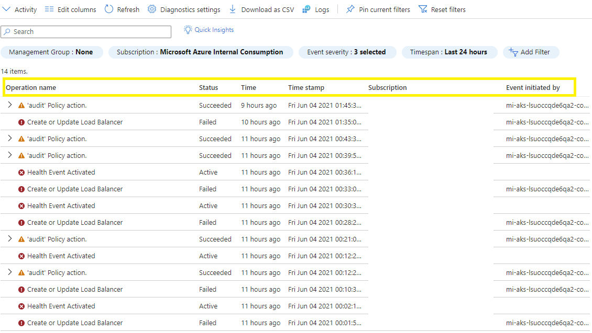
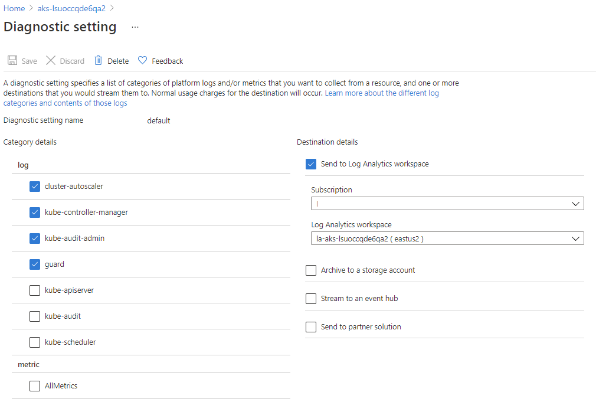
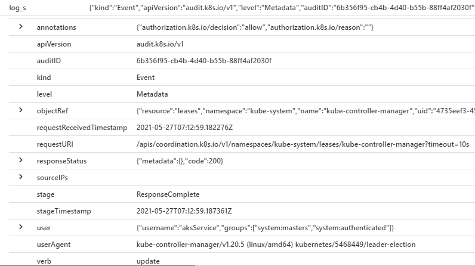

This article describes the considerations for an Azure Kubernetes Service (AKS) cluster that runs a workload in compliance with the Payment Card Industry Data Security Standard (PCI-DSS 3.2.1).

> This article is part of a series. Read the [introduction](aks-pci-intro.yml).

> [!IMPORTANT]
>
> The guidance  and the accompanying implementation builds on the [AKS baseline architecture](/azure/architecture/reference-architectures/containers/aks/baseline-aks). That architecture based on a hub-and-spoke topology. The hub virtual network contains the firewall to control egress traffic, gateway traffic from on-premises networks, and a third network for maintenance. The spoke virtual network contains the AKS cluster that provides the cardholder data environment (CDE) and hosts the PCI DSS workload. 
>
>  [GitHub: Azure Kubernetes Service (AKS) Baseline Cluster for Regulated Workloads](https://github.com/mspnp/aks-baseline-regulated) demonstrates a regulated environment.  The implementation illustrates the use of audit trails through various Azure Monitor features. It has examples of network test points within the cluster and resources that interact with the cluster subnet.

## Regularly Monitor and Test Networks

### **Requirement 10**&mdash;Track and monitor all access to network resources and cardholder data

#### AKS feature support

Azure provides the Container Insights feature that monitors containers, including AKS clusters. For more information, see [Container insights overview](/azure/azure-monitor/insights/container-insights-overview).

AKS provides audit logs at multiple levels that can be useful protecting the system and data proactively. Activity logs provide information about, operations related to account and secret management; diagnostic setting management; server management; and other resource access operations. All logs are recorded with date, time, identity, and other detailed information. You can also access all chronological records of all API calls made into the AKS cluster. Logs include information about the caller, time when the call was made, source where the call was initiated, and so on. For more information, see [Enable and review Kubernetes control plane logs in Azure Kubernetes Service (AKS)](/azure/aks/view-master-logs).

RBAC (role-based access control) can be used to manage the resource access policy as a standard practice on Azure.

All logs should be stored in a customer-owned storage account or Azure Monitor Logs. That way, you can quickly generate insights from a large volume of data. All logs are kept with at least three copies in a region. You can have more copies by enabling cross-region backup or replication. All log entries are available only through secured HTTP(s) channels.

Azure's alerting framework allows you to configure alerts to detect suspicious access. You can set what alerts need to be fired and the events. Users can also manually check the full log using Log Analytics with filtering capability based on type of the activity, content of the activity, or caller of the activity.

#### Your responsibilities

|Requirement|Responsibility|
|---|---|
|[Requirement 10.1](#requirement-101)|Implement audit trails to link all access to system components to each individual user.|
|[Requirement 10.2](#requirement-102)|Implement automated audit trails for all system components to reconstruct the following events:|
|[Requirement 10.3](#requirement-103)|Record at least the following audit trail entries for all system components for each event:|
|[Requirement 10.4](#requirement-104)|Using time-synchronization technology, synchronize all critical system clocks and times and ensure that the following is implemented for acquiring, distributing, and storing time. |
|[Requirement 10.5](#requirement-105)|Secure audit trails so they cannot be altered.|
|[Requirement 10.6](#requirement-106)|Review logs and security events for all system components to identify anomalies or suspicious activity.|
|[Requirement 10.7](#requirement-107)|Retain audit trail history for at least one year, with a minimum of three months immediately available for analysis (for example, online, archived, or restorable from backup).|
|[Requirement 10.8](#requirement-108)|Additional requirement for service providers only: Respond to failures of any critical security controls in a timely manner. Processes for responding to failures in security controls must include|
|[Requirement 10.9](#requirement-109)|Ensure that security policies and operational procedures for monitoring all access to network resources and cardholder data are documented, in use, and known to all affected parties.|

### **Requirement 11**&mdash;Regularly test security systems and processes

#### AKS feature support

AKS is integrated with Azure monitoring services:

- Microsoft Defender for Containers provides many security scanning features. For example, Defender for Containers scans images pulled, pushed, and imported to container registries and provides recommendations. For details, see [Vulnerability assessment](/azure/defender-for-cloud/defender-for-containers-introduction#vulnerability-assessment).

- Azure Monitor can be used to set alerts based on event type to protect system integrity and security. When there are any expected system failures on AKS nodes, AKS autoheals the resource in a timely manner without interruption to system processing.

AKS clusters are protected by Azure Application Gateway with Web Application Firewall (WAF), and can be configured in detect mode to log alerts and threats. A stronger mode is the preventive mode, which actively blocks detected intrusions and attacks. For details, see [Best practices for network connectivity and security in Azure Kubernetes Service (AKS)](/azure/aks/operator-best-practices-network).

#### Your responsibilities

|Requirement|Responsibility|
|---|---|
|[Requirement 11.1](#requirement-111)|Implement processes to test for the presence of wireless access points (802.11), and detect and identify all authorized and unauthorized wireless access points on a quarterly basis.|
|[Requirement 11.2](#requirement-112)|Run internal and external network vulnerability scans at least quarterly and after any significant change in the network (such as new system component installations, changes in network topology, firewall rule modifications, product upgrades). |
|[Requirement 11.3](#requirement-113)|Implement a methodology for penetration testing that includes the following:|
|[Requirement 11.4](#requirement-114)|Use intrusion-detection and/or intrusion-prevention techniques to detect and/or prevent intrusions into the network. |
|[Requirement 11.5](#requirement-115)|Deploy a change-detection mechanism (for example, file-integrity monitoring tools) to alert personnel to unauthorized modification (including changes, additions, and deletions) of critical system files, configuration files, or content files; and configure the software to perform critical file comparisons at least weekly. |
|[Requirement 11.6](#requirement-116)|Ensure that security policies and operational procedures for security monitoring and testing are documented, in use, and known to all affected parties.|

### Requirement 10.1

Implement audit trails to link all access to system components to each individual user.

#### Your responsibilities

We recommend that you use audit operations performed on each component using the following methods:

- [Azure Monitor activity log](/azure/azure-monitor/essentials/activity-log). The activity log provides information about the type and time of Azure resource operations. It also logs the identity that started the operation. It's enabled by default, and the information is collected as soon as the resource operation is done. The audit trail is write-only and cannot be deleted.

  Data is retained for 90 days. For longer retention options, consider [sending activity log entries to Azure Monitor Logs](/azure/azure-monitor/logs/data-retention-archive) and configure a retention and archive policy.

    

- [Azure Diagnostic settings](/azure/azure-monitor/essentials/diagnostic-settings). Provides diagnostic and auditing information of Azure resources and the platform to which the setting applies. We recommend that you enable diagnostic settings for AKS and other components in the system, such as Azure Blob Storage and Key Vault. Based on the resource type, you can choose the type of logs and metric data to send to a destination. Your diagnostics destination must meet the required retention periods.

    - Diagnostic setting for AKS. From the provided AKS categories, enable Kubernetes audit logs. Diagnostic settings include `kube-audit` or `kube-audit-admin`, and `guard`.

      Enable `kube-audit-admin` to see log-based API server calls that might modify the state of your cluster. If you need an audit trail of all API server interactions (including non-modifying events such read requests), enable `kube-audit` instead. Those events can be prolific, create noise, and increase your consumption cost. These logs have information about the access and identity name that's used to make the request.

      Enable `guard` logs to track managed Azure AD and Azure role-based access control (RBAC) audits.

    In addition to the user-based logs, consider logs from the Kubernetes control plane, including `kube-apiserver` and `kube-controller-manager`. These logs aren't typically user-associated, but can help correlate system changes that users have made.

    For more information, see [View the control plane component logs](/azure/aks/view-control-plane-logs).

    This reference implementation enables `cluster-autoscaler`, `kube-controller-manager`, `kube-audit-admin`, and `guard` logs and forwards to a Log Analytics workspace. The workspace retention period is set to 90 days.

    

- Azure Kubernetes Service (AKS) diagnostics helps detect and troubleshoot issues with the cluster, such as node failures. It also includes networking-specific diagnostic data that doesn't cost extra. This data isn't typically user-associated, but it can help correlate system changes that users have made. For information, see [Azure Kubernetes Service diagnostics](/azure/aks/concepts-diagnostics).

The preceding audit trail mechanisms should be implemented at the time of resource deployment. Azure Policy should also be active to ensure that these configurations aren't inadvertently or maliciously disabled in your CDE.

### Requirement 10.2

Implement automated audit trails for all system components to reconstruct the following events:

- 10.2.1 All individual user accesses to cardholder data
- 10.2.2 All actions taken by any individual with root or administrative privileges
- 10.2.3 Access to all audit trails
- 10.2.4 Invalid logical access attempts
- 10.2.5 Use of and changes to identification and authentication mechanisms—including but not limited to creation of new accounts and elevation of privileges—and all changes, additions, or deletions to accounts with root or administrative privileges
- 10.2.6 Initialization, stopping, or pausing of the audit logs
- 10.2.7 Creation and deletion of system-level objects

#### Your responsibilities

AKS provides audit logs at multiple levels, as described in [Requirement 10.1](#requirement-101). Here are some key points:

- By default, activity logs provide information about critical Azure resource operations. All logs include status, time, and the identity that started the operation.
- Enable diagnostic settings to access all records of all API calls made into the AKS cluster. The logs provide details about the requestor, the time stamp, the source of request, and the contents of the request. Store the logs in a Log Analytics workspace with an appropriate retention period. Enable Log Analytics workspace logging to make sure that even access to audit trail is logged.
- Include audit logging for other compute such as build agents and jump boxes. Disable access to the systems directly as root. Verify all actions are being performed under a specific identity.
- Log unsuccessful access attempts. This includes access requests to components such as Azure Storage, Azure Key Vault, the AKS API server, and any RDP/SSH access on other systems.
- Take advantage of features, offered by third-party security agents, to help analyze user patterns inside your AKS cluster. These features might be useful for user-access audit data.

### Requirement 10.3

Record at least the following audit trail entries for all system components for each event:

- 10.3.1 User identification
- 10.3.2 Type of event
- 10.3.3 Date and time
- 10.3.4 Success or failure indication
- 10.3.5 Origination of event
- 10.3.6 Identity or name of affected data, system component, or resource.

#### Your responsibilities

As described in [Requirement 10.2](#requirement-102),  you can get audit logs from the cluster by enabling diagnostic setting for AKS. The logs contain detailed information about get, list, create, update, delete, patch, and post events. The logs contain information in the list under Requirements. Store the logs in a storage account so that you can query the information.

For example, you want to view the preceding set of information for kube-audit-admin events by running this query:

```kusto
AzureDiagnostics
| where Category == 'kube-audit-admin'
| project TimeGenerated, ResourceId, log_s,  pod_s
| top 200 by TimeGenerated desc
```



The result set shows the information as part of the log_s field.

|Required information| Schema|
|---|---|
|User identification|SourceIPs|
|Type of event|verb|
|Date and time|requestReceivedTimestamp|
|Success or failure indication|responseStatus|
|Origination of event|user|
|Identity or name of affected data, system component, or resource| objectRef|

For information about the master log, see [View the control plane component logs](/azure/aks/view-control-plane-logs).

### Requirement 10.4

Use time-synchronization technology to synchronize all critical system clocks and times, and verify that the following is implemented for acquiring, distributing, and storing time.

- 10.4.1 Critical systems have the correct and consistent time.
- 10.4.2 Time data is protected.
- 10.4.3 Time settings are received from industry-accepted time sources.

Note: One example of time synchronization technology is Network Time Protocol (NTP).

#### Your responsibilities

AKS uses NTP from the underlying Azure hosts and doesn't require any outbound network traffic allowances to support NTP. Other VMs you add to your CDE might use external NTP servers such as ntp.ubuntu.org (and its pool) as their time synchronization source. Additional compute you bring into your CDE should explicitly use the NTP source of your choice and should be documented.

### Requirement 10.5

Limit viewing of audit trails to only people with a job-related need.

- 10.5.1 Limit viewing of audit trails to people with a job-related need.
- 10.5.2 Protect audit trail files from unauthorized modifications.
- 10.5.3 Promptly back up audit trail files to a centralized log server or media that is difficult to alter.
- 10.5.4 Write logs for external-facing technologies onto a secure, centralized, internal log server or media device.
- 10.5.5 Use file-integrity monitoring or change-detection software on logs to ensure that existing log data cannot be changed without generating alerts (although new data being added should not cause an alert).

#### Your responsibilities

Having multiple logging syncs adds overhead to securing, reviewing, analyzing, and querying audit trail data. Plan your audit trail topologies to balance tradeoffs between complete audit trail isolation and management concerns.

When possible, integrate logs. The advantage is the ability to review, analyze, and query data efficiently. Azure provides several technology options. You can use Azure Monitor container insights to write logs into a Log Analytics workspace. Another option is to integrate data into security information and event management (SIEM) solutions, such as Microsoft Sentinel. Other popular third-party choices are Splunk, QRadar, and ArcSight. Microsoft Defender for Cloud and Azure Monitor support all of those solutions. Those solutions are append-only data sinks to make sure the trail can't be altered.

Defender for Cloud can export results at configured intervals. For more information, see [Continuous export](/azure/defender-for-cloud/continuous-export).

All logs are kept with at least three copies in one region. As a backup strategy, you can have more copies by enabling cross-region backup or replication. All log entries are available only through secured HTTP/S channels.

Log Analytics and Microsoft Sentinel support various role-based access controls to manage audit trail access. Make sure the roles are mapped to the roles and responsibilities of the organization.

Make sure your Log Analytics workspace supports both operations and compliance needs. Consider a dedicated workspace for your in-scope clusters, which forwards to your SIEM solution.

Most logging in AKS will come from stdout/stderr and will be collected by Azure Monitor Container insights. If you have other manually created logs, consider emitting data in a way that is sent to a trusted forwarding stream and isn't subject to tampering.

### Requirement 10.6

Review logs and security events for all system components to identify anomalies or suspicious activity.

- 10.6.1  Review the following at least daily:
    - All security events
    - Logs of all system components that store, process, or transmit CHD and/or SAD
    - Logs of all critical system components
    - Logs of all servers and system components that perform security functions (for example, firewalls, intrusion-detection systems/intrusion-prevention systems (IDS/IPS), authentication servers, e-commerce redirection servers, etc.)."
- 10.6.2 Review logs of all other system components periodically based on the organization's policies and risk management strategy, as determined by the organization's annual risk assessment.
- 10.6.3 Follow up exceptions and anomalies identified during the review process.

#### Your responsibilities

The Azure monitoring services, Azure Monitor and Microsoft Defender for Cloud, can generate notifications or alerts when they detect anomalous activity. Those alerts include context information such as severity, status, and activity time.

As alerts are generated, have a remediation strategy and review progress. One way is to track the security score in Microsoft Defender for Cloud and compare that against historical results.

Centralize data in a single view by using SIEM solutions, such as Microsoft Sentinel. Integrating data can provide rich alert context.

Alternatively, manually check the full log in your storage. For example, in Azure Monitor Logs, you can use a filtering capability based on type of the activity, content of the activity, or caller of the activity.

Have organizational policies to review alerts and events at a regular cadence, and plan initiatives with specific improvement goals. Use custom saved queries in Log Analytics to document intended log queries and to make querying easier. This ensures the team knows what's important to review as it pertains to 10.6, and that all manual efforts involved in this process follow a consistent workflow.

### Requirement 10.7

Retain audit trail history for at least one year, with a minimum of three months immediately available for analysis (for example, online, archived, or restorable from backup).

#### Your responsibilities

Logs aren't available indefinitely. Ensure that Azure activity logs and diagnostic settings are retained and can be queried. Specify a three-month retention period when you enable diagnostic settings for your resources. Azure Monitor Logs supports long-term archiving, so they can be used for audits or offline analysis. Implement your long-term archiving solution to align with the principle of write once, read many.

### Requirement 10.8

- 10.8.1 Additional requirement for service providers only: Respond to failures of any critical security controls in a timely manner. Processes for responding to failures in security controls must include:

- Restoring security functions
- Identifying and documenting the duration (date and time start to end) of the security failure
- Identifying and documenting cause(s) of failure, including root cause, and documenting remediation required to address root cause
- Identifying and addressing any security issues that arose during the failure
- Performing a risk assessment to determine whether further actions are required as a result of the security failure
- Implementing controls to prevent cause of failure from reoccurring
-Resuming monitoring of security controls"

#### Your responsibilities

When it's practical, have alerts that indicate the existence of critical security controls. Otherwise, ensure that your audit process can detect the lack of an expected security control in a timely manner. Consider controls such as security agents running in the AKS cluster and access controls (IAM and network) on Azure resources. Include settings to check if the AKS cluster is a private cluster, for network exposure points through Network Security Group (NSG) rules, or check for unexpected public IPs. Also include unexpected changes in DNS, network routing, firewall, and Azure AD.

### Requirement 10.9

Ensure that security policies and operational procedures for monitoring all access to network resources and cardholder data are documented, in use, and known to all affected parties.

#### Your responsibilities

It's critical that you maintain thorough documentation about the processes and policies. Maintain documentation about the enforced policies. As part of your monitoring efforts, people must be trained in enabling and viewing audit logs and identifying and remediating the common risks. This is important for people who are part of the approval process from a policy perspective.

### Requirement 11.1

Implement processes to test for the presence of wireless access points (802.11), and detect and identify all authorized and unauthorized wireless access points on a quarterly basis.

External networks are out of scope for this documentation and must be evaluated separately.

#### Your responsibilities

This architecture and its implementation aren't designed to support on-premises or corporate network-to-cloud transactions over wireless connections. For considerations, refer to the guidance in the official PCI-DSS 3.2.1 standard.

### Requirement 11.2

Run internal and external network vulnerability scans at least quarterly and after any significant network changes, such as:

* New system component installations
* Changes in network topology
* Firewall rule modifications
* Product upgrades

For more information, see [Payment Card Industry (PCI) Data Security Standard Approved Scanning Vendors](https://www.pcisecuritystandards.org/documents/ASV_Program_Guide_v3.1.pdf?agreement=true&time=1623964812162).

#### Your responsibilities

Have a process that checks for changes in the AKS cluster, network configuration, container registries, and other components of the architecture.

If there are changes in network, the process should evaluate if a scan is necessary. For example, is the cluster now exposed to the public internet? Are the new firewall rules overly permissive? Within the cluster, are there any security gaps in the flow between the pods?

Have a clear and agreed-upon definition of significant changes with respect to your infrastructure. Some examples are:

* Configuration of NSG or Azure Firewall rules
* Virtual network peerings
* DNS settings
* Azure Private Link configurations
* Other network components

**APPLIES TO 11.2.1**

The quarterly scan for vulnerabilities must be run by skilled personnel with deep understanding of Azure networking and Kubernetes networking concepts. Map the results to [Requirement 6.1](./aks-pci-malware.yml#requirement-61) with severity levels and resolve high-priority items. If there are significant changes, run the scans before the scheduled quarterly scan. This helps you detect new vulnerabilities so that you can proactively fix issues.

This scan must also include in-cluster (pod-to-pod) networks.

**APPLIES TO 11.2.2** Select an Approved Scanning Vendor (ASV) that has extensive experience with Azure networking and Kubernetes. This provides depth and specificity in suggested remediation.

### Requirement 11.3

Implement a methodology for penetration testing that includes the following:

- Is based on industry-accepted penetration testing approaches (for example, NIST SP800-115)
- Includes coverage for the entire CDE perimeter and critical systems
- Includes testing from both inside and outside the network
- Includes testing to validate any segmentation and scope-reduction controls
- Defines application-layer penetration tests to include, at a minimum, the vulnerabilities listed in Requirement 6.5
- Defines network-layer penetration tests to include components that support network functions and operating systems
- Includes review and consideration of threats and vulnerabilities experienced in the last 12 months
- Specifies retention of penetration testing results and remediation activities results.

#### Your responsibilities

Perform penetration testing to find security gaps by gathering information, analyzing vulnerabilities, and reporting. We recommend that you follow the industry guidelines provided in [Penetration Testing Execution Standard (PTES)](http://www.pentest-standard.org/index.php/Main_Page) to address common scenarios and the activities required to establish a baseline.

The penetration test practitioner should have a deep understanding of on-premises and Azure networking to ensure that the yearly segmentation tests are covered extensively. Extend the test methodology to in-cluster networks. This person requires strong experience with Kubernetes networking concepts.

The tests must cover the application and data layers running in the CDE.

In a penetration testing exercise, the practitioners might need access to sensitive data for the entire organization. Follow the rules of engagement to make sure that access and the intent aren't misused. For guidance about planning and executing simulated attacks, see [Penetration Testing Rules of Engagement](https://www.microsoft.com/msrc/pentest-rules-of-engagement).

### Requirement 11.4

Use intrusion-detection and/or intrusion-prevention techniques to detect and/or prevent intrusions into the network. Monitor all traffic at the perimeter of the cardholder data environment and at critical points in the cardholder data environment. Alert personnel to suspected compromises.

#### Your responsibilities

Protect the AKS cluster by inspecting inbound traffic using a web application firewall (WAF). In this architecture, Azure Application Gateway with integrated WAF prevents intrusion. Use the **prevent** mode to actively block the detected intrusions and attacks. Don't just use **detect** mode. For more information, see [Best practices for network connectivity and security in Azure Kubernetes Service (AKS)](/azure/aks/operator-best-practices-network).

An alternate option is to use intrusion-detection and/or intrusion-prevention capabilities in Azure Firewall Premium. For more information, see [IDPS](/azure/firewall/premium-features#idps).

Another option is enabling [Azure Monitor Network Insights](/azure/azure-monitor/insights/network-insights-overview), which provides access to network monitoring capabilities like Connection Monitor, flow logging for network security groups (NSGs), and Traffic Analytics.

Enable Microsoft Defender plans as they apply to various components of the CDE. For example, if Azure SQL is used to store CHD, then [Microsoft Defender for SQL](/azure/security-center/defender-for-sql-introduction) will make sure that data layer intrusions are detected.

Also, detect anomalies in traffic patterns by connecting NSG flow logs into a centralized SIEM solution, such as Microsoft Sentinel. In this reference implementation, logs are in append-only mode, which minimizes the change tracking on audit logs. However, all logs that are sent to external sinks for long-term storage must not be modified. They must follow the write-once/read-many approach. Make sure the file integrity monitoring (FIM) solution covers those external entities to detect changes.

## Requirement 11.5

Deploy a change tracking solution (for example, a file integrity monitoring solution) to alert personnel to unauthorized modification of critical system files, configuration files, or content files. Configure the product to perform critical file comparisons at least weekly.

#### Your responsibilities

In your cluster, run a file integrity monitoring (FIM) solution in together with a Kubernetes-aware security agent to detect file and system-level access that could result in node-level changes. When choosing a FIM solution, have a clear understanding of its features and the depth of detection. Consider software developed by reputable vendors.

> [!IMPORTANT]
>
> The reference implementation provides a placeholder `DaemonSet` deployment to run a FIM solution antimalware agent. The agent will run on every node VM in the cluster. Place your choice of antimalware software in this deployment.

Check all default settings of the FIM tool to ensure that the values detect the scenarios you want to cover, and adjust those settings appropriately.

Enable the solution to send logs to your monitoring or SIEM solution so that they can generate alerts. Be aware of log schema changes, or you might miss critical alerts.

Any other compute in the CDE should have change tracking enabled.

## Requirement 11.6

Ensure that security policies and operational procedures for security monitoring and testing are documented, in use, and known to all affected parties.

#### Your responsibilities

It's critical that you maintain thorough documentation about the processes and policies. Maintain documentation about the enforced policies. As part of your testing efforts, include the cadence of reviews and the review criteria. Make sure the team understand aspects of penetration testing. Have a documented remediation plan to mitigate the risks found.

This is important for people who are part of the approval process from a policy perspective.

## Next steps

Maintain a policy that addresses information security for all personnel.

> [!div class="nextstepaction"]
> [Maintain an Information Security Policy](aks-pci-policy.yml)
