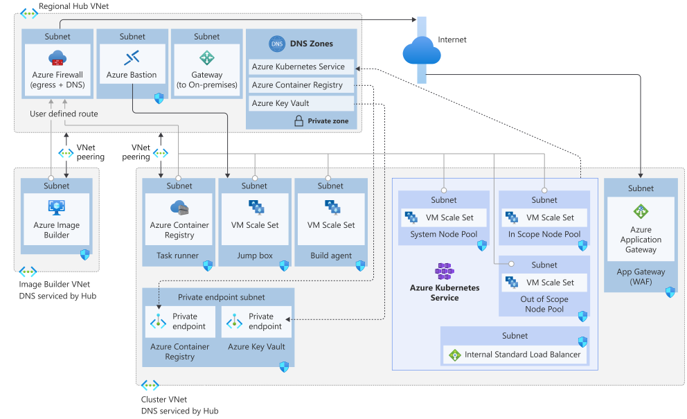

This article describes the considerations for an Azure Kubernetes Service (AKS) cluster that runs a workload in compliance with the Payment Card Industry Data Security Standard (PCI-DSS). 

> This article describes the responsibilities of a workload owner in how the workload interacts with the infrastructure. This article is part of a series. Read the [introduction](aks-pci-intro.yml) here.

 [GitHub: Azure Kubernetes Service (AKS) Baseline Cluster for Regulated Workloads](https://github.com/mspnp/aks-baseline-regulated) demonstrates the regulated infrastructure. This implementation provides a microservices application. It's included to help you experience the infrastructure and illustrate the network and security controls. The application does not represent or implement an actual PCI DSS workload.

> [!IMPORTANT]
>
> The guidance in this article and the above-mentioned reference implementation builds on the [AKS baseline architecture](/azure/architecture/reference-architectures/containers/aks/secure-baseline-aks). That architecture based on a hub and spoke topology. The hub virtual network contains the firewall to control egress traffic, gateway traffic from on-premises networks, and a third network for maintainence. The spoke virtual network contains the AKS cluster that provides the card holder environment (CDE) and hosts the PCI DSS workload. 

## Build and Maintain a Secure Network and Systems
The hub and spoke topology in the baseline is a natural choice for a PCI DSS infrastructure. Network controls are placed in both hub and spoke networks and follow the Microsoft zero-trust model. The controls can be tuned with least-privilege to secure traffic flowing in and out of the cluster. In addition, several defense-in-depth approaches can be applied by adding controls at each network hop. 

**Requirement 1**&mdash;Install and maintain a firewall configuration to protect cardholder data.

|Requirement|Responsibility|
|---|---|
|[Requirement 1.1](#requirement-1-1)|Establish and implement firewall and router configuration standards.|
|[Requirement 1.2](#requirement-1-2)|Build firewall and router configurations that restrict connections between untrusted networks and any system components in the cardholder data environment.|
|[Requirement 1.3](#requirement-1-3)|Prohibit direct public access between the Internet and any system component in the cardholder data environment.|
|[Requirement 1.4](#requirement-1-4)|Install personal firewall software or equivalent functionality on any portable computing devices (including company and/or employee-owned) that connect to the Internet when outside the network (for example, laptops used by employees), and which are also used to access the CDE. |
|[Requirement 1.5](#requirement-1-5)|Ensure that security policies and operational procedures for managing firewalls are documented, in use, and known to all affected parties.|

**Requirement 2**&mdash;Do not use vendor-supplied defaults for system passwords and other security parameters.
|Requirement|Responsibility|
|---|---|
|[Requirement 2.1](#requirement-2-1)|Always change vendor-supplied defaults and remove or disable unnecessary default accounts before installing a system on the network.|
|[Requirement 2.2](#requirement-2-2)|Develop configuration standards for all system components. Assure that these standards address all known security vulnerabilities and are consistent with industry-accepted system hardening standards.|
|[Requirement 2.3](#requirement-2-3)|Encrypt all non-console administrative access using strong cryptography.|
|[Requirement 2.4](#requirement-2-4)|Maintain an inventory of system components that are in scope for PCI DSS.|
|[Requirement 2.5](#requirement-2-5)|Ensure that security policies and operational procedures for managing vendor defaults and other security parameters are documented, in use, and known to all affected parties.|
|[Requirement 2.6](#requirement-2-6)|Shared hosting providers must protect each entity’s hosted environment and cardholder data.|

### Requirement 1.1 Establish and implement firewall and router configuration standards that include the following:

#### Requirement 1.1.1

**Requirement&mdash;**A formal process for approving and testing all network connections and changes to the firewall and router configurations.

##### Your responsibilities
      
Don't implement configurations manually. Instead, use Infrastructure as code (IaC). With IaC, infrastructure is managed through a descriptive model that uses a versioning system. IaC model generates the same environment every time it's applied. Common examples of IaC are Azure Resource Manager or Terraform.

Have a gated approval process that involves people and processes to approve changes to any network configuration. Have detailed documentation that describes the process. 

<chad: to give input around can the approval process be automated, who should be responsible and how is that incorporated in the pipeline.>

### Requirement 1.1.2
Current network diagram that identifies all connections between the cardholder data environment and other networks, including any wireless networks

#### Your responsibilities

As part of your documentation, maintain a network flow diagram that shows the incoming and outgoing traffic with specific controls.

This image shows the network diagram of the reference implementation.

:::image type="content" source="./images/network-topology-small.png" alt-text="Network topology" lightbox="network-topology.svg":::

**Figure 1.1.2 - Network flow**

- Incoming traffic from the internet to the workload running in the cluster. All traffic is intercepted by Azure Application Gateway provisioned in a subnet that is secured by a network security group (NSG). Application Gateway has an integrated web application firewall (WAF) that has  rules to inspect and route traffic to the configured backend. For example, Application Gateway only allows: 
    - TLS-encrypted traffic. 
    - Traffic for within a port range for control plane communication from the Azure infrastructure. 
    - Health probes to check the health of the internal load balancer. 

The traffic flow is same as the baseline architecture. For more information, see [Ingress traffic flow](/azure/architecture/reference-architectures/containers/aks/secure-baseline-aks#ingress-traffic-flow).

<chad: You must allow incoming Internet traffic on TCP ports 65503-65534 for the Application Gateway v1 SKU, and TCP ports 65200-65535 for the v2 SKU with the destination subnet as Any and source as GatewayManager service tag.  This is set to any>

- Outgoing traffic from any network provisioned as part of the architecture must go through Azure Firewall in the hub network. This choice protects The route is specified by  using user-defined routes (UDRs) on each subnet in the spoke vnet.  

- Management and operational traffic**&mdash;
- Communication between the cluster to other services**&mdash;
- Communication between the pods in the cluster**&mdash;

## Build and Maintain a Secure Network and Systems

- App gateway ()
- CDE is not exposed to the internet. Not a publically routable vnet. no direct access. by default vnet does that. The hole to punched is for WAF. Fulfilled 
- Outbound connections by default are open to internet. Secure that with hub's firewall. 
- Private cluster (mode). CDE is aks cluster. the manegement can require intenret so we want to make that private as well. Anything mnagement thing needs to happen through endpoint. For aks cluster there's an endpoit and DNS record. so it's not exposed to intenret; k8 control plane is not longer accisble. You have to provide access through a trusted network (internal). Bastiion. the host runs in a subnet that hosts a jumpbox. thats where you run kubectl for emergency access. regular operations through pipeline which needs access to that subnet. 

#### Components

##### Hub Vnet

### Requirement 1.1.3
Current diagram that shows all cardholder data flows across systems and networks.
#### Your responsibilities
Include a data flow diagram that shows how data is protected at rest and in transit

### Requirement 1.1.4
Requirements for a firewall at each Internet connection and between any demilitarized zone (DMZ) and the internal network zone.

#### Your responsibilities
      
For a PCI DSS infrastructure, using firewalls to block unauthorized access into and out of the network is mandatory. This requirement applies to:
- Communication to and from a pod from other pods.
- Communication to and from a pod from/to other components in the architecture.
- Communication to an from a pod from/to trusted networks.
- Commuication to and from a pod from public internet.

Firewalls are used to block unwanted access and manage authorized access into and out of the network. Firewalls must be configured properly for a strong security posture.

The specific firewall configuration settings are determined by the organization. 

Teams need to be aware of and following security policies and operational procedures to ensure firewalls and routers are continuously managed to prevent unauthorized access to the network.

### Your responsibility
"Customers are responsible for deploying AKS workloads behind a firewall. The recommended process of securing AKS with Azure Firewall to how to satisfy this requirement is available at: https://docs.microsoft.com/en-us/azure/firewall/protect-azure-kubernetes-service
- create an appropriate DNAT rule in Firewall to correctly allow inbound traffic.

1.1.2 Current network diagram that identifies all connections between the cardholder data environment and other networks, including any wireless networks

1.1.3 Current diagram that shows all cardholder data flows across systems and networks
1.1.4 Requirements for a firewall at each Internet connection and between any demilitarized zone (DMZ) and the internal network zone

1.1.5 Description of groups, roles, and responsibilities for management of network components

1.1.6 Documentation of business justification and approval for use of all services, protocols, and ports allowed, including documentation of security features implemented for those protocols considered to be insecure.

1.1.7 Requirement to review firewall and router rule sets at least every six months

**Requirement 2**&mdash;Do not use vendor-supplied defaults for system passwords and other security parameters

***

## Network topology

## Firewall configuration

### Implementation considerations

"People/Process
Documentation
Opt for IaC vs Azure Portal-based management
"
"Documentation.
Azure Network diagrams can be pulled to jump start the documentation process."
"Documentation.
NSG Flow Logs can be used to help gather ""actuals"" vs ""expected"""
"Azure firewall is used for egress traffic for all vnet-homed resources (cluster, Internal Load balancers, jump boxes, build agents). NSGs are applied to all subnets containing the same resources listed above. Workload is fronted by a WAF to manage ingress traffic. Azure Firewall may be addeded there as well.

https://docs.microsoft.com/azure/firewall/protect-azure-kubernetes-service"
"People/Process.
Documentation.
Azure RBAC + Dedicated Deployment Pipelines
"
"Documention.
Gather required ports from Microsoft's documentation as vendor requirements.
Ensure all firewall rules are scoped exclusively to their releated resources (apply rules to individual IP addresses or subnets (if all like kind) vs vnets)"
People/Process

### Azure services and capabilities
There Azure services are relevant in fulfilling this requirement.
:::row:::
   :::column span="2":::
      Azure virtual network
      
      A fundamental block for a private network in which you deploy resources. By default, the inbound traffic to those resources is denied; the resources can communicate with the internet.  

   :::column-end:::
   :::column span="":::
      Capabilities

        - Subnetting
        - Private Link
        - Peering
   :::column-end:::
:::row-end:::
|Service|Features|
|---|---|
|Azure virtual network||
is reponsible for network configurations on PaaS VMs and system settings that customers are not able to alter. 
- VNet + NSG
- VPN gateway/expressroute -- placeholder
- WAF
- Firewall

The services work as configured

The Customer then configures these to their specifications and requirements. Microsoft Azure filters communication when coming into the platform.

### AKS responsibility
AKS cluster need to access certain ports and fully qualified domain names (FQDNs). These actions could be to communicate with the API server, or to download and then install core Kubernetes cluster components and node security updates. Azure Firewall can help you lock down your environment and filter outbound traffic.
- FQDN tags AzureKubernetesService FQDN tag

### Reference implementation details

## System security measures for
### Azure responsibility
For Microsoft Azure, the Security Services team develops security configuration standards for systems in the Microsoft Azure environment that are consistent with industry-accepted hardening standards. These configurations are documented in system baselines and relevant configuration changes are communicated to impacted teams (e.g., IPAK team). Procedures are implemented to monitor for compliance against the security configuration standards. The security configuration standards for systems in the Microsoft Azure environment are consistent with industry-accepted hardening standards and are reviewed at least annually.

Not applicable

Microsoft Azure software and hardware configurations are reviewed at least quarterly to identify and eliminate any unnecessary functions, ports, protocols and services.

Not applicable

Azure ensures only authorized personal are able to configure Azure platform security controls, using multi-factor access controls and a documented buiness need.

Azure ensures that systems in the Azure platform follow hardening standards and policies for infrastructure and services within Azure's control. 

Microsoft Azure ensures the use of strong cryptography are enforced when accessing the hypervisor infrastructure.  Microsoft Azure also ensures that customers using the Microsoft Azure Management Portal are able to access their service/IaaS consoles with strong cryptography.

Not applicable

Not applicable

### AKS responsibility
Container technology addresses this requirement by default, as one instance of a container is responsible for one function in the system. 

### Your responsibility

### Implementation considerations
"Disable Admin access on ACR.
Ensure Jump Boxes and Build Agents follow user management procedures - removing needed system users.
Do not generate/provide SSH key access to nodes to administrator user. If emergency access is necessary, use Azure recovery process to get JIT access."

Ensure your subscriptions are adhearing to Azure CIS Benchmark 2.0 standards plus any additional industry standards you feel are relevant. Use Azure Security Center's Security Baseline features and Azure Policy to help track against the standards. Consider building additional automated checks where desired in Azure Policy and Azure Tenant Security Solution (AzTS).
Container technology addresses this requirement by default, as one instance of a container is responsible for one function in the system. Ensure you separate in-scope and out-of-scope processes ideally into separate clusters and related infrastructure, but at a minimum seperate node pools within a cluster. Ensure workloads are using Pod Managed Identity and are not inherting any cluster-level/node-level identity. Use external storage vs on-node (in-cluster) storage where possible. Keep cluster pods reserved exclusively for work that must be performed as part of the operation of card holder data processing -- for example, don't use the cluster also as your build agents, or for unrelated workloads, no matter how small/insignificant.
"Do not enable features on services that are not necessary. (e.g. enabling managed identity on ACR if ACR isn't going to use that feature).
Ensure all firewall (and NSG) rules restrict by protocol in addition to source/destination.
Where you have complete control (Jump boxes, build agents), remove all necessary system services from the images.
Where you have observer control only (such as AKS nodes), document what Azure installs on the nodes. Consider using DaemonSets to provide any additional auditing necessary for these cloud-controlled components.
"
"App Gatway should only support TLS 1.2 and approved ciphers.
App Gateway should not respond to port 80 (unless performing a redirect in the gateway. Do not perform redirects at the application level).
If additional node-level OS hardening deemed required, that work must be performed via sufficently prividledge DaemonSets. Because of the risk involved (security and stability), implementing these will have to be performed by the customer."
"All Azure Services should ahear to the Azure CIS Benchmark controls, and exceptions documented.
People should be trained on the security features of each component and be able to demonstrate related settings across the platform services.
"
Do not install anything on a JumpBox, Build Agent, or cluster (DaemonSet, Pods, etc) that does not belong to fullfill the needs of the operation of the workload or a tool that provides observability for compliance requirements (security agents). Ensure there is a process to detect the installation of the same.
"All administrative access to the cluster should be conole-based. Do not expose the cluster's control plane via any management dashboard product, outside of the built-in experience in the Azure Portal.
"
Ensure all Azure Resources are tagged with being in or out of scope, to allow a querying for resources on demand. Audit/maintain that tag. Also maintain a snapshot of that documentation periodically.
People/Process/Training/Documentation
https://docs.microsoft.com/compliance/regulatory/offering-PCI-DSS
## Next

Protect stored cardholder data. Encrypt transmission of cardholder data across open, public networks

> [!div class="nextstepaction"]
> [Protect Cardholder Data](aks-pci-data.yml)