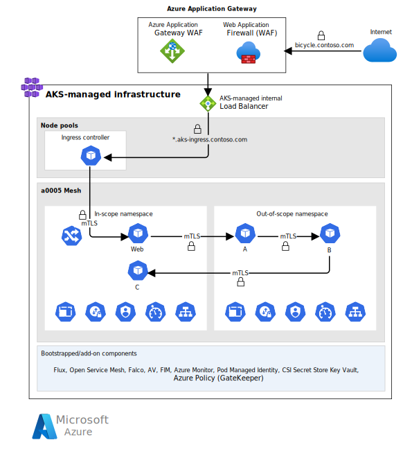

This article describes a reference architecture for an Azure Kubernetes Service (AKS) cluster that runs a workload in compliance with the Payment Card Industry Data Security Standard (PCI-DSS 3.2.1). This architecture is focused on the infrastructure and *not* the PCI-DSS 3.2.1 workload.

> This article is part of a series. Read the [introduction](aks-pci-intro.yml).

The recommendations and examples are extracted from this accompanying reference implementation:

 [GitHub: Azure Kubernetes Service (AKS) Baseline Cluster for Regulated Workloads](https://github.com/mspnp/aks-baseline-regulated) demonstrates the regulated infrastructure. This implementation provides a microservices application. It's included to help you experience the infrastructure and illustrate the network and security controls. The application does *not* represent or implement an actual PCI DSS workload.

:::image type="content" border="false" source="./images/regulated-architecture.svg" alt-text="Architecture of an AKS PCI infrastructure." lightbox="./images/regulated-architecture.svg":::

*Download a [Visio file](https://arch-center.azureedge.net/aks-pci-ra-code-assets.vsdx) of this architecture.*

That network architecture is based on a hub-spoke topology. The hub virtual network contains the firewall to control egress traffic, gateway traffic from on-premises networks, and a third network for SRE (site reliability engineer) cluster access. There are two spoke virtual networks. One spoke contains the AKS cluster that is a component of the card-holder environment (CDE), and hosts the PCI DSS workload. The other spoke builds virtual machine images used for controlled SRE access to the environment.

> [!IMPORTANT]
>
> The architecture and the implementation builds on the [AKS baseline architecture](/azure/architecture/reference-architectures/containers/aks/baseline-aks). To get the most out of this article, familiarize yourself with the baseline components. In this section, we'll highlight the differences between the two architectures.

## Components

Here are the main components used in this architecture. If you are not familiar with these services, see the [Related Azure services](#related-azure-services) for links to product documentation.

**Azure Firewall**

The firewall instance secures outbound network traffic. Without this layer of security, the flow might communicate with a malicious third-party service that could exfiltrate sensitive company data.

**Azure Bastion**

The baseline architecture provided a subnet for Azure Bastion, but didn't provision the resource. This architecture adds Azure Bastion in the subnet and it provides secure access to a jump box.

**Azure Image Builder**

Provisioned in a separate virtual network, it creates VM images with base security and configuration. In this architecture, it's customized to build secure node images with management tools such as the Azure CLI, `kubectl`, and Flux CLI pre-installed.

**Azure Virtual Machine Scale Sets for jump box instances**

The spoke network has additional compute for a jump box. This scale set is intended to be the governed access point to run tools against the AKS cluster, such as `kubectl`, as needed.

**Azure Application Gateway with integrated Web Application Firewall (WAF)**

Azure Application Gateway load balances at Layer 7. WAF secures incoming traffic from common web traffic attacks. The instance has a public frontend IP configuration that receives user requests.

**Azure Kubernetes Service (AKS)**

The hosting infrastructure, which is a key part of the cardholder data environment (CDE). The AKS cluster is deployed as a private cluster. So, the Kubernetes API server isn't exposed to the public internet, and traffic to the API server is limited to your private network.

**ACR Tasks**

Provides an automated way of building and maintaining container images.

**Azure Key Vault**

Stores and manages secrets needed for cluster operations, such as certificates and encryption keys.

## Cluster configuration

Here are some significant changes from the baseline architecture:

### Node pool segmentation

In this architecture, the cluster has two user node pools and one system node pool. The compute choice for the node pools remains the same. Each node pool resides in a dedicated subnet to provide an added network isolation boundary between compute tiers.

> [!NOTE]
>
> An alternate approach for compute protection is Azure confidential computing. AKS supports confidential computing nodes that allow you to run sensitive workloads within a hardware-based trusted execution environment (TEE). For details, see [Confidential computing nodes on Azure Kubernetes Service](/azure/confidential-computing/confidential-nodes-aks-overview).
>

The PCI-DSS 3.2.1 requires isolation of the PCI workload from other workloads in terms of operations and connectivity.

- **In-scope:** The PCI workload, the environment in which it resides, and operations.

- **Out-of-scope:** Other workloads that might share services, but are isolated from the in-scope components.

The key strategy is to provide the required level of separation. The preferred way is to deploy in-scope and out-of-scope components in separate clusters. The down side is increased costs for the added infrastructure and the maintenance overhead. This implementation co-locates all components in a shared cluster for simplicity. If you choose to follow that model, use a  rigorous in-cluster segmentation strategy. No matter how you choose to maintain separation, be aware that as your solution evolves, some out-of-scope components might become in-scope.

In the reference implementation, the second approach is demonstrated with a microservices application deployed to a single cluster. The in-scope and out-of-scope workloads are segmented in two separate user node pools. The application has two sets of services; one set has in-scope pods and the other is out-of-scope. Both sets are spread across two user node pools. With the use of Kubernetes taints, in-scope and out-of-scope pods are deployed to separate nodes and they never share a node VM or the network IP space.

### Ingress controller

The Kubernetes ingress controller inside the cluster has been changed to NGINX. In the baseline architecture, used Traefik. This change illustrates that this component can be changed based on your workloads' requirements.

### Private Kubernetes API server

The baseline architecture deployed the AKS cluster in public mode. This means all communication with the AKS-managed Kubernetes API server is over the public internet. This is not acceptable in this architecture because PCI-DSS 3.2.1 prohibits public exposure to any system components. In this regulated architecture, the cluster is deployed as a private cluster. Network traffic to the Kubernetes API server is limited to your private network. The API server is exposed through a private endpoint in the cluster's network. The security is further enhanced with the use of network security groups and other built-in features. These are described in [Network configuration](#networking-configuration).

### Pod security

When describing your workload's security needs, use relevant `securityContext` settings for your containers. This includes basic settings such as `fsGroup`, `runAsUser` / `runAsGroup`, and setting `allowPrivilegeEscalation` to false (unless required). Be clear about defining and removing Linux capabilities and defining your SELinux options in `seLinuxOptions`.

Avoid referencing images by their tags in your deployment manifests. Instead, use the actual image ID. That way, you can reliably map container scan results with the actual content running in your cluster. You can enforce it through Azure Policy for image name to include the image ID pattern in the allowed regular expression. Also follow this guidance when you're using the Dockerfile `FROM` instruction.

## Networking configuration

The hub-spokes are all deployed in separate virtual networks, each in their private address space. By default, no traffic is allowed between any two virtual networks. Within the network, segmentation is applied by creating subnets.

A combination of various Azure services and features and native Kubernetes constructs provide the required level of control. Here are some options used in this architecture.

:::image type="content" border="false" source="./images/network-topology.svg" alt-text="Diagram of the network configuration." lightbox="./images/network-topology.svg":::

### Subnet security through network security groups (NSGs)

There are several NSGs that control the flow in and out of the cluster. Here are some examples:

- The cluster node pools are placed in dedicated subnets. For each subnet, there are NSGs that block any SSH access to node VMs and allow traffic from the virtual network. Traffic from the node pools is restricted to the virtual network.
- All inbound traffic from the internet is intercepted by Azure Application Gateway. For example, NSG rules make sure that:

  - Only HTTPS traffic is allowed in.
  - Traffic from Azure Control Plane is allowed. For more information, see [Allow access to a few source IPs](/azure/application-gateway/configuration-infrastructure#network-security-groups).
- On the subnets that have Azure Container Registry agents, NSGs allow only necessary outbound traffic. For instance, traffic is allowed to Azure Key Vault, Azure Active Directory, Azure Monitor, and other services that the container registry needs to talk to.
- The subnet with the jump box is intended for management operations. The NSG rule only allows SSH access from Azure Bastion in the hub, and limited outbound connections. Jump boxes do not have universal internet access, and are controlled at both the subnet NSG and Azure Firewall.

As your workloads, system security agents, and other components are deployed, add more NSG rules that help define the type of traffic that should be allowed. Traffic shouldn't traverse those subnet boundaries. Because each node pool lives in its own subnet, observe the traffic patterns, and then apply more specific rules.

### Pod-to-pod security with network policies

This architecture attempts to implement the "zero trust" principles of Microsoft as much as possible.

Examples of Zero Trust networks as a concept are demonstrated in the implementation in `a0005-i` and `a0005-o` user-provided namespaces. All workload namespaces should have restrictive NetworkPolicy applied. The policy definitions will depend on the pods running in those namespaces. Make sure you're accounting for readiness, liveliness, and startup probes and also allowance for metrics gathered by the Log Analytics agent. Consider standardizing on ports across your workloads so that you can provide a consistent NetworkPolicy and Azure Policy for allowed container ports.

In certain cases, this is not practical for communication within the cluster. Not all user-provided namespaces can use a zero trust network (for example, `cluster-baseline-settings` can't use one).

### TLS encryption

The baseline architecture provides TLS-encrypted traffic until the ingress controller in the cluster, but pod-to-pod communication is in the clear. In this architecture, TLS extends to pods-to-pod traffic, with Certificate Authority (CA) validation. That TLS is provided by a service mesh, which enforces mTLS connections and verification before allowing communication.

The implementation uses mTLS. mTLS support can be implemented with or without a service mesh. If you use a mesh, ensure that it's compatible with the certificate issuer of your choice. This implementation uses [Open Service Mesh](https://openservicemesh.io).

The ingress controller in this implementation uses a wildcard certificate to handle default traffic when an ingress resource doesn't contain a specific certificate. This might be acceptable, but if your organizational policy doesn't permit using wildcard certificates, you might need to adjust your ingress controller to not use a wildcard certificate.

> [!IMPORTANT]
>
> Any component that decrypts card holder data is considered to be in scope for PCI-DSS 3.2.1, and is subject the same level of scrutiny as the other components in the cardholder data environment. In this architecture, Azure Application Gateway is in scope because it inspects the payload as part of its WAF functionality. An alternate architecture option is to use Azure Firewall Premium as the ingress component, instead of WAF, to take advantage of Azure Firewall's signature-based IDPS capabilities. This will allow the first TLS termination to be in the cluster. However, without a dedicated WAF, you must use additional compensating controls to satisfy [Requirement 6.6](./aks-pci-malware.yml#requirement-66).

### Azure Key Vault network restrictions

All secrets, keys and certificates are stored in Azure Key Vault. Key Vault handles certificate management tasks, such as rotation. Communication with Key Vault is over Azure Private Link. The DNS record associated with Key Vault is in a private DNS zone so that it can't be resolved from the internet. While this enhances security, there are some restrictions.

Azure Application Gateway doesn't support sourcing TLS certificates for the HTTP listener from Key Vault instances that are exposed with Private Link. So, the implementation deploys Key Vault in a hybrid model. It still uses Private Link for connections that support it, but also allows public access for Application Gateway integration. If this hybrid approach isn't suitable for your deployment, move the certificate management process to Application Gateway. This will add management overhead, but then the Key Vault instance will be completely isolated. For information, see:

- [Azure Application Gateway and Key Vault integration](/azure/application-gateway/key-vault-certs#how-integration-works)
- [Create an application gateway with TLS termination using the Azure CLI](/azure/application-gateway/tutorial-ssl-cli).

### DDoS protection

Enable [Azure DDoS Network Protection](/azure/ddos-protection/manage-ddos-protection) for virtual networks with a subnet that contains Application Gateway with a public IP. Doing so protects the infrastructure and workload from mass fraudulent requests. Such requests can cause service disruption or mask another concurrent attack. Azure DDoS comes at a significant cost, and is typically amortized across many workloads that span many IP addresses. Work with your networking team to coordinate coverage for your workload.

## Identity access management

Define roles and set access control according to the requirements of the role. Map roles to Kubernetes actions scoped as narrowly as practical. Avoid roles that span multiple functions. If multiple roles are filled by one person, assign that person all roles that are relevant to the equivalent job functions. So, even if one person is directly responsible for both the cluster and the workload, create your Kubernetes `ClusterRoles` as if there were separate individuals. Then assign that single individual all relevant roles.

Minimize standing access, especially for high-impact accounts, such as SRE/Ops interactions with your cluster. The AKS control plane supports both [Azure AD Privileged Access Management (PAM) just-in-time (JIT)](/azure/aks/managed-aad#configure-just-in-time-cluster-access-with-azure-ad-and-aks) and [Conditional Access Policies](/azure/aks/managed-aad#use-conditional-access-with-azure-ad-and-aks), which provides an additional layers of required authentication validation for privileged access, based on the rules you build.

For more details on using PowerShell to configure conditional access, see [New-AzureADMSConditionalAccessPolicy](/powershell/module/azuread/new-azureadmsconditionalaccesspolicy), [Get-AzureADMSConditionalAccessPolicy](/powershell/module/azuread/get-azureadmsconditionalaccesspolicy), and [Remove-AzureADMSConditionalAccessPolicy](/powershell/module/azuread/remove-azureadmsconditionalaccesspolicy).

## Disk encryption

When you're designing encryption for data at rest, consider storage disks, AKS agent node VMs, other VMs, and any temporary and operating system disks.

### Storage disks

By default, Azure Storage disks are encrypted at rest with Microsoft-managed keys. If you use non-ephemeral operating system disks, or add data disks, we recommend that you use customer-managed keys for control over the encryption keys. Encrypt outside of the storage layer and only write encrypted data into the storage medium. Also, make sure that the keys are never adjacent to the storage layer.

For more information, see [Bring your own keys (BYOK) with Azure disks](/azure/aks/azure-disk-customer-managed-keys).

Consider using BYOK for any other disks that might interact with the cluster, such as your Azure Bastion-fronted jump boxes. If you choose BYOK, the SKU choice for VMs and regional availability will be limited because this feature is not supported on all SKUs or regions.

### VM hosts

We recommend that you enable the encryption-at-host feature. This will encrypt the VM host and any temporary operating system, or data disks that are cached on a VM host. Read more about [VM support for host-based encryption](/azure/virtual-machines/disk-encryption#encryption-at-host---end-to-end-encryption-for-your-vm-data).

That feature is extended to the data stored on the VM host of your AKS agent nodes through the [Host-Based Encryption](/azure/aks/enable-host-encryption) feature. Similar to BYOK, this feature might limit your VM SKU and region choices.

You can enforce those features through Azure Policy.

### Cluster backups (state and resources)

If your workload requires in-cluster storage, have a robust and secure process for backup and recovery. Consider services such as Azure Backup (for Azure Disks and Azure Files), for backup and recovery of any `PersistantVolumeClaim`. There are advantages if the backup system supports native Kubernetes resources. You can supplement your primary method that reconciles the cluster to a well-known state, with the backup system for critical system recovery techniques. For example, it can help in drift detection and cataloging system state changes over time at the Kubernetes resource level.

Backup processes need to classify data in the backup within or external to the cluster. If the data is in scope for PCI DSS 3.2.1, extend your compliance boundaries to include the lifecycle and destination of the backup, which will be outside of the cluster. Backups can be an attack vector. When designing your backup, consider geographic restrictions, encryption at rest, access controls, roles and responsibilities, auditing, time-to-live, and tampering prevention.

In-cluster backup systems are expected to run with high privileges during its operations. Evaluate the risk and benefit of bringing a backup agent into your cluster. Does the agent capability overlap with another management solution in the cluster? What is the minimum set of tools you need to accomplish this task without expanding the attack surface?

## Azure Policy considerations

Typically, Azure policies applied do not have workload-tuned settings. In the implementation, we're applying the **Kubernetes cluster pod security restricted standards for Linux-based workloads** initiative, which doesn't allow tuning of settings. Consider exporting this initiative and customizing its values for your specific workload. You can include all Gatekeeper `deny` Azure policies under one custom initiative, and all `audit` Azure policies under another initiative. Doing so categorizes block actions from information-only policies.

Consider including the `kube-system` and `gatekeeper-system` namespaces to policies in your *audit* policies for added visibility. Including those namespaces in *deny* policies could cause cluster failure because of an unsupported configuration.

You can enforce data encryption by setting some Azure Policy alerts. For example, you can enforce BYOK with an alert that detects clusters that don't have `diskEncryptionSetID` on the cluster resource. Another policy can detect if Host-Based Encryption is enabled on `agentPoolProfiles`. The reference implementation doesn't use any disks in the cluster, and the operating system disk is ephemeral. Both of those example policies are in place as a reminder of the security feature. The policies are set to `audit`, not `block`.

## Managing images

Use distribution-less base images for your workloads. With these images, the security surface area is minimized because supplementary images, such as shells and package managers, are removed. A benefit is reduced CVE hit rates.

Azure Container Registry supports images that meet the [Open Container Initiative (OCI) Image Format Specification](https://github.com/opencontainers/image-spec/blob/master/spec.md). This, coupled with an admission controller that supports validating signatures, can ensure that you're only running images that you've signed with your private keys. There are open-source solutions such as SSE Connaisseur or IBM Portieris that integrate those processes.

Protect container images and other OCI artifacts because they contain the organization's intellectual property. Use customer-managed keys and encrypt the contents of your registries. By default, the data is encrypted at rest with service-managed keys, but customer-managed keys are sometimes required to meet regulatory compliance standards. Store the key in a managed key store such as Azure Key Vault. Because you create and own the key, you are responsible for operations related to key lifecycle, including rotation and management. For more information, see [Encrypt registry using a customer-managed key](/azure/container-registry/container-registry-customer-managed-keys).

## Kubernetes API Server operational access

:::image type="content" border="false" source="./images/aks-jumpbox.svg" alt-text="Diagram of Kubernetes API Server operational access with a jump box." lightbox="./images/aks-jumpbox.svg":::

You can limit commands executed against the cluster, without necessarily building an operational process based around jump boxes. If you have an IAM-gated IT automation platform, make use of the predefined actions to control and audit the type of actions.

### Build agents

Pipeline agents should be out-of-scope to the regulated cluster because build processes can be threat vectors. While it's common to use Kubernetes as an elastic build agent infrastructure, don't run that process within the boundary of the regulated workload runtime. Your build agents shouldn't have direct access to the cluster. For example, only give build agents network access to Azure Container Registry to push container images, helm charts, and so on. Then, deploy through GitOps. As a common practice, build and release workflows shouldn't have direct access to your Kubernetes Cluster API (or its nodes).

## Monitoring operations

### In-cluster activities

The in-cluster `omsagent` pods running in `kube-system` are the Log Analytics collection agent. They gather telemetry, scrape container `stdout` and `stderr` logs, and collect Prometheus metrics. You can tune its collection settings by updating the `container-azm-ms-agentconfig.yaml` ConfigMap file. In this reference implementation, logging is enabled across `kube-system` and all your workloads. By default, `kube-system` is excluded from logging. Ensure that you're adjusting the log collection process to achieve balance cost objectives, SRE efficiency when you're reviewing logs, and compliance needs.

### Security monitoring

Use [Defender for Containers](/azure/defender-for-cloud/defender-for-containers-introduction) in Microsoft Defender for Cloud to view and remediate security recommendations and to view security alerts on your container resources. Enable Microsoft Defender plans as they apply to various components of the cardholder data environment.

Integrate logs so that you're able to review, analyze, and query data efficiently. Azure provides several options. You can turn on AKS diagnostic logs and send them to a Log Analytics workspace that is part of [Azure Monitor](/azure/azure-monitor/overview). Another option is to integrate data into security information and event management (SIEM) solutions, such as [Microsoft Sentinel](/azure/sentinel/overview).

As required by the standard, all Log Analytics workspaces are set to a 90-day retention period. Consider setting up continuous export for longer-term storage. Don't store sensitive information in log data, and make sure access to archived log data is subject to the same levels of access controls as recent log data.

For a complete perspective, see [Microsoft Defender for Cloud Enterprise Onboarding Guide](https://aka.ms/MDfCOnboarding). This guide addresses enrollment, data exports to your SIEM solutions, responding to alerts, and building workflow automation.

## Related Azure services

Here are links to feature documentation of some key components of this architecture.

- [Azure Kubernetes Service (AKS)](/azure/aks/)
- [Azure Firewall](/azure/firewall-manager/overview)
- [Azure Bastion](/azure/bastion/bastion-overview)
- [Azure Image Builder](/azure/virtual-machines/image-builder-overview)
- [Azure Virtual Machine Scale Sets](/azure/virtual-machine-scale-sets/overview)
- [Azure Application Gateway with integrated Web Application Firewall (WAF)](/azure/web-application-firewall/ag/ag-overview)
- [Azure Container Registry tasks](/azure/container-registry/container-registry-tasks-overview)
- [Azure Key Vault](/azure/key-vault/general/basic-concepts)

## Next steps

Install and maintain a firewall configuration to protect cardholder data. Do not use vendor-supplied defaults for system passwords and other security parameters.

> [!div class="nextstepaction"]
> [Build and maintain a secure network and systems](aks-pci-network.yml)
