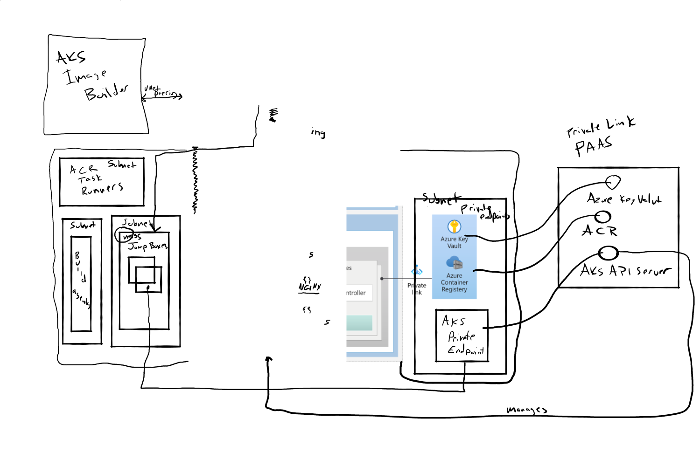
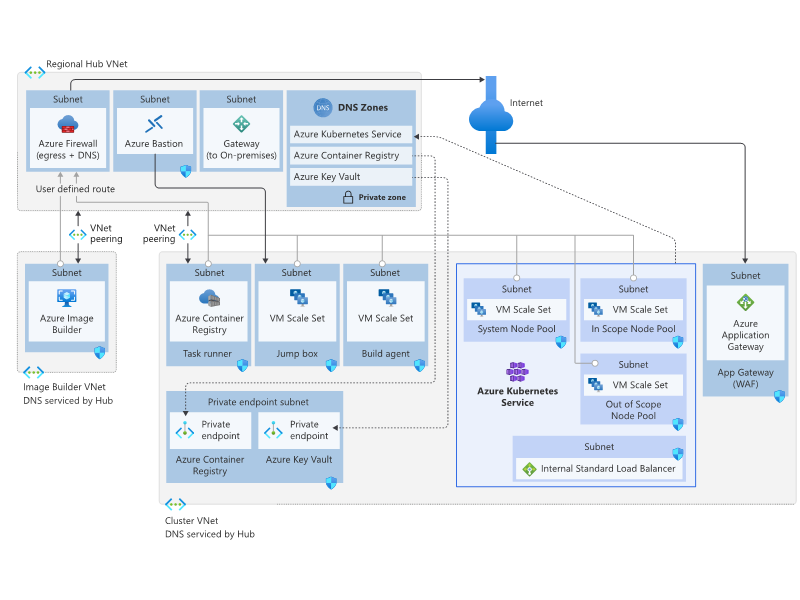
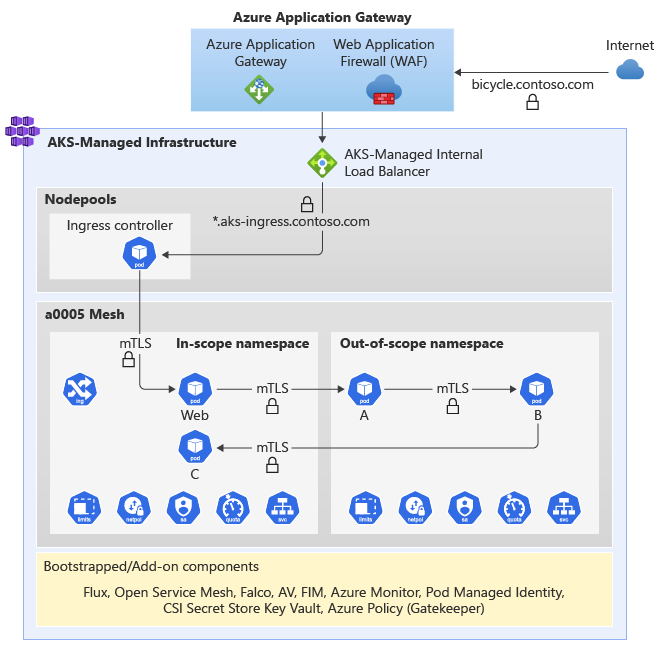

This article describes a reference architecture for an Azure Kubernetes Service (AKS) cluster that runs a workload in compliance with the Payment Card Industry Data Security Standard (PCI-DSS). This architecture is focused on the infrastructure and _not_ the PCI-DSS workload.

> This article is part of a series. Read the [introduction](aks-pci-intro.yml) here.

The recommendations and examples are extracted from this accompanying reference implementation:

 [GitHub: Azure Kubernetes Service (AKS) Baseline Cluster for Regulated Workloads](https://github.com/mspnp/aks-baseline-regulated) demonstrates the regulated infrastructure. This implementation provides a microservices application. It's included to help you experience the infrastructure and illustrate the network and security controls. The application does _not_ represent or implement an actual PCI DSS workload.

That architecture is based on a hub and spoke topology; with one hub and two spokes. The hub virtual network contains the firewall to control egress traffic, gateway traffic from on-premises networks, and a third network for maintenance. There are two spoke virtual networks. One spoke contains the AKS cluster that provides the card-holder environment (CDE), and hosts the PCI DSS workload. The other spoke builds virtual machine images for your workloads.

## Components

> [!IMPORTANT]
>
> The architecture and the implementation builds on the [AKS baseline architecture](/azure/architecture/reference-architectures/containers/aks/secure-baseline-aks). Familiarize yourself with the baseline. In this section, we'll highlight the differences between the two architectures.

**Azure Bastion**

The baseline architecture provided a subnet for Bastion but didn't provision the resource. This architecture adds Bastion in the subnet. It provides secure access to a jump box.

**Azure Virtual Machines (VM)**

The spoke network has an additional compute for a jump box. This machine is intended to run management tools on the AKS cluster, such as kubectl.

**Azure Image Builder**

Provisioned in a separate virtual network. Creates VM images with base security and configuration. In this architecture, it's customized to build secure node images with Ubuntu 18.04-LTS platform (MSFT-provided) image with management tools such as Azure CLI, kubectl and kubelogin, flux CLI.

**Nginx** 

Kubernetes ingress controller inside the cluster. In the baseline architecture, Traefik was used. The service was replaced to illustrate that the service can be changed based on your choice.

## Networking configuration

The hub and spokes are all deployed in separate virtual networks, each in their private address space. Each subnet is isolated with no traffic allowed by default between any two virtual networks. 

Use a combination of various Azure services and feature and native Kubernetes constructs to provide the required level of control. Here are some options used in this architecture.   

### Strict Network Security Groups (NSGs)

Place NSGs on subnets that interact with the cluster. in st around the cluster node pool subnets specifically block any SSH access attempts only allow traffic from the vnet into them. As your workloads, system security agents, etc are deployed, consider adding even more NSG rules that help define the type of traffic that should and should not be traversing those subnet boundaries. Because each nodepool lives in its own subnet, you can apply more specific rules based on known/expected traffic patterns of your workload.

### Azure Key Vault network restrictions

In this reference implementation, Azure Application Gateway (AAG) is sourcing its public-facing certificate from Azure Key Vault. This is great as it help support easier certificate rotation and certificate control. However, currently Azure Application Gateway does not support this on Azure Key Vault instances that are exclusively network restricted via Private Link. This reference implementation deploys Azure Key Vault in a hybrid model, supporting private link and public access specifically to allow AAG integration. Once [Azure Application Gateway supports private link access to Key Vault](https://docs.microsoft.com/azure/application-gateway/key-vault-certs#how-integration-works), we'll update this reference implementation. If this topology will not be suitable for your deployment, change the certificate management process in AAG to abandon the use of Key Vault for the public-facing TLS certificate and [handle the management of that certificate directly within AAG](https://docs.microsoft.com/azure/application-gateway/tutorial-ssl-cli). Doing so will allow your Key Vault instance to be fully isolated.

### Expanded NetworkPolicies

Not all user-provided namespaces in this reference implementation employ a zero-trust network. For example `cluster-baseline-settings` does not. We provide an example of zero-trust networks in `a0005-i` and `a0005-o` as your reference implementation of the concept. All namespaces (other than `kube-system`, `gatekeeper-system`, and other AKS-provided namespaces) should have a maximally restrictive NetworkPolicy applied. What those policies will be will be based on the pods running in those namespaces. Ensure your accounting for readiness, liveliness, and startup probes and also accounting for metrics gathering by `oms-agent`.  Consider standardizing on ports across your workloads so that you can provide a consistent NetworkPolicy and even Azure Policy for allowed container ports.

### Enable DDoS Protection

While not typically a feature of any specific regulated workloads, generally speaking [Azure DDoS Protection Standard](https://docs.microsoft.com/azure/ddos-protection/manage-ddos-protection) should be enabled for any virtual networks with a subnet that contains an Application Gateway with a public IP. This protects your workload from becoming overwhelmed with fraudulent requests which at best could cause a service disruption or at worst be a cover (distraction, log spam, etc) for another concurrent attack. Azure DDoS comes at a significant cost, and is typically amortized across many workloads that span many IP addresses -- work with your networking team to coordinate coverage for your workload.

Additional Azure Policy application

Zero-trust network policies (which are directly tested via violation attempts as part of the sample workload)
mTLS throughout the sample workload (Baseline TLS was terminated at the ingress controller) – this is an example of something that goes beyond PCI requirements
This is implemented via OSM, not as a technology recommendation, but as an implementation detail – we call out plenty of CNCF alternatives there.  Layer 7 network policies within the mesh, including Service Account-based auth.
TLS trust chain certification at all levels, so not just encrypted, but CA chain validated as well.
Nodepool subnet isolation (for refined Firewall and NSG application), including extended NSGs on the nodepool subnets
Flux v2 for GitOps (baseline is Flux v1)
NGINX Ingress Controller (Baseline was Traefik. This was NOT swapped out because of any technical reason, it was swapped out illustratively to show that customers can bring the solution that fits best for them, as is the promise [read: demand] of Kubernetes)
Namespace Limits and Quotas
Team/Organization Role suggestions (coming from the C12 project) and mapping to Azure AD.
Followed by a list of further recommendations that cannot easily be presented in a “one size fits all that are going to be deploying this right from GitHub” solution
Encryption at Host
Azure AD Conditional Access Policies
RBAC JIT Access
Activating Azure Security center at scale (HT: @Yuri Diogenes for his tweet this morning with a link to the enterprise at-scale enrollment docs – perfectly timed!)
OCI artifact signing and validation (this is a stretch goal which we’d like to add before GA – Notary v2 + Azure Policy integration, where are you? 😊)
ACR BYOK Encryption
Azure DDoS (not specifically related to regulated)

## Configuration differences between baseline and regulated architectures

This RI is built directly on top of the AKS Baseline, illustrating the promise that you can start with the AKS Baseline and evolve it into what you need it to be.

:::row:::
   :::column span="":::
      **Design area**
   :::column-end:::
   :::column span="":::
      **AKS baseline architecture**
   :::column-end:::
   :::column span="":::
      **AKS regulated architecture**
   :::column-end:::   
:::row-end:::
:::row:::
   :::column span="":::
      **Architecture**
   :::column-end:::
   :::column span="":::
      

      **Hub network**
      - Azure Firewall&mdash;Controls egress traffic.
      - Placeholder for Azure Bastion.
      - Placeholder for gateway traffic.

      **Spoke network**
      - AKS cluster hosts the workload.
      - Azure Application Gateway with integrated web application firewall (WAF) controls ingress traffic.

      - Connection with other Azure Container Registry and Azure Key Vault over Private Link.

   :::column-end:::
   :::column span="":::
      

    **Hub network**
    - Azure Firewall&mdash;Controls egress traffic. There are additional and stricter rules. See **Network**.
    - Azure Bastion&mdash;provides operational access to a jumpbox in the spoke.
    - Placeholder subnet for gateway traffic.

    **Spoke network**
      - AKS cluster hosts the workload. The configuration has been modified. See  **Cluster configuration**.
      - Azure Application Gateway with integrated web application firewall (WAF) controls ingress traffic. There are additional and stricter rules. See **Network**. 
      - Jumpbox&mdash;runs management tools, such as kubectl.

    **Image builder network**
    - Azure Image Builder&mdash; builds secure node images with Ubuntu 18.04-LTS platform (MSFT-provided) image with management tools such as Azure CLI, kubectl and kubelogin, flux CLI.   
   :::column-end:::   
:::row-end:::
***
:::row:::
   :::column span="":::
      **Cluster configuration**
   :::column-end:::
   :::column span="":::
      - Mode&mdash;Public cluster. All communication to the API server is over the internet.
      - Node pools&mdash;1 user node pool; 1 system node pool. The workload runs all all pods. 
      - Ingress controller&mdash;Traeffik.
   :::column-end:::
   :::column span="":::
      - Mode&mdash;Private cluster. Communication between the cluster and the API server is over a private network. The cluster subnet exposes a private endpoint, which interacts with The Private Link service of the API server virtual network.
      - Node pools&mdash; 2 user node pools; 1 system node pool. The in-scope and out-of-scope workloads are segmented in two separate node pools.
      - Ingress controller&mdash;NGINX.
   :::column-end:::   
:::row-end:::
:::row:::
   :::column span="":::
      **Network**
      Firewall rules
      NSG
      WAF
      Network policies
   :::column-end:::
   :::column span="":::
      Firewall rules
      NSG
      WAF
      Network policies
   :::column-end:::
:::row-end:::
:::row:::
   :::column span="":::
      **Data encryption**
   :::column-end:::
   :::column span="":::
   - TLS-encrypted traffic until the workload pod. 
   :::column-end:::
   :::column span="":::
    - TLS-encrypted traffic extends into the cluster for pod-to-pod communication.
    - TLS trust chain certification at all levels. The CA chain is also validated.
   :::column-end:::   
:::row-end:::
:::row:::
   :::column span="":::
      **Operations**
   :::column-end:::
   :::column span="":::
   - ACR
   - AKV 
   :::column-end:::
   :::column span="":::
    - ACR: 
    - TLS trust chain certification at all levels. The CA chain is also validated.
   :::column-end:::   
:::row-end:::
:::row:::
   :::column span="":::
      **Monitoring**
   :::column-end:::
   :::column span="":::
   - TLS-encrypted traffic until the workload pod. 
   :::column-end:::
   :::column span="":::
    - Enhanced focus on Azure Defender.
    - Integrated logs and metrics in Azure Sentinel as the SIEM solution.
   :::column-end:::   
:::row-end:::
:::row:::
   :::column span="":::
      **Workload**
   :::column-end:::
   :::column span="":::
      A simple hello world .NET application.
   :::column-end:::
   :::column span="":::
      A microservices application with two sets of services. One set has in-scope pods for running a PCI-DSS workload. The other is out-of-scope. Both sets are spread across two user node pools. Segmentation is provided with the use of Kubernetes taints. Both sets are deployed to separate nodes and they never share a node VM. For details, see [Workload isolation](#workload-isolation).
   :::column-end:::   
:::row-end:::

## Security control differences between baseline and regulated architectures

This RI is built directly on top of the AKS Baseline, illustrating the promise that you can start with the AKS Baseline and evolve it into what you need it to be.

:::row:::
   :::column span="":::
      **Design area**
   :::column-end:::
   :::column span="":::
      **AKS baseline architecture**
   :::column-end:::
   :::column span="":::
      **AKS regulated architecture**
   :::column-end:::   
:::row-end:::
:::row:::
   :::column span="":::
      **Cluster mode**
   :::column-end:::
   :::column span="":::
      
   :::column-end:::
   :::column span="":::
      
   :::column-end:::   
:::row-end:::
:::row:::
   :::column span="":::
      **Network**
   :::column-end:::
   :::column span="":::

      - User node pool: 1
        The workload runs all all pods. 

      - System node pool: 1

   :::column-end:::
   :::column span="":::
      - User node pool: 2
        There are two workloads (in-scope and out-of-scope). The workloads are segmented in two separate node pools. For details, see [Workload isolation](#workload-isolation).

      - System node pool: 1

      - Additional compute for a jump box. This VM is used to run management tools.
   :::column-end:::   
:::row-end:::
:::row:::
   :::column span="":::
      **TLS**
   :::column-end:::
   :::column span="":::
      Firewall rules
      NSG
      WAF
      Network policies
   :::column-end:::
   :::column span="":::
      Firewall rules
      NSG
      WAF
      Network policies
   :::column-end:::   
:::row-end:::
:::row:::
   :::column span="":::
      **Malware detection operations**
   :::column-end:::
   :::column span="":::
      Firewall rules
      NSG
      WAF
      Network policies
   :::column-end:::
   :::column span="":::
      Firewall rules
      NSG
      WAF
      Network policies
   :::column-end:::   
:::row-end:::

Key differentiators over Baseline:
- Private AKS API Server, with Azure Bastion-fronted ops access.
- Enhanced focus on Azure Defender for topic
- Introduction of Azure Sentinel into the solution, with call out to SIEMs in general
- Additional Azure Policy application
- Extended retention period on logs to match common 90-day requirements
    - Extended logging validation steps to help a customer acclimate to the logs emitted, including audit (-admin) logs and azure firewall logs
- Enhanced Azure Container Registry topics (Quarantine pattern, subnet-isolated task runner, for example)
- Addresses in-cluster ISV/OSS CNCF solutions like security agents (Falco, Prisma, etc, etc, etc)
- Zero-trust network policies (which are directly tested via violation attempts as part of the sample workload)
- mTLS throughout the sample workload (Baseline TLS was terminated at the ingress controller) – this is an example of something that goes beyond PCI requirements
    - This is implemented via OSM, not as a technology recommendation, but as an implementation detail – we call out plenty of CNCF alternatives there.
	Layer 7 network policies within the mesh, including Service Account-based auth.
    - TLS trust chain certification at all levels, so not just encrypted, but CA chain validated as well.
- Nodepool subnet isolation (for refined Firewall and NSG application), including extended NSGs on the nodepool subnets
- Flux v2 for GitOps (baseline is Flux v1)
- NGINX Ingress Controller (Baseline was Traefik.  This was NOT swapped out because of any technical reason, it was swapped out illustratively to show that customers can bring the solution that fits best for them, as is the promise [read: demand] of Kubernetes)
- Namespace Limits and Quotas
- Team/Organization Role suggestions (coming from the C12 project) and mapping to Azure AD.
- Followed by a list of further recommendations that cannot easily be presented in a “one size fits all that are going to be deploying this right from GitHub” solution
    - Encryption at Host
    - Azure AD Conditional Access Policies
    - RBAC JIT Access
    - Activating Azure Security center at scale (HT: @Yuri Diogenes for his tweet this morning with a link to the enterprise at-scale enrollment docs – perfectly timed!)
    - OCI artifact signing and validation (this is a stretch goal which we’d like to add before GA – Notary v2 + Azure Policy integration, where are you? 😊)
    - ACR BYOK Encryption
    - Azure DDoS (not specifically related to regulated)

### Workload isolation
The main theme of the PCI standard is to isolate the PCI workload from other workloads in terms of operations and connectivity. In this series we differentiate between those concepts as:

- In-scope&mdash;The PCI workload, the environment in which it resides, and operations.

- Out-of-scope&mdash;Other workloads that may share services but are isolated from the in-scope components.

The key strategy is to provide the required level of segmentation. One way is to deploy in-scope and out-of-scope components in separate clusters. The down side is increased costs for the added infrastructure and the maintenance overhead. Another approach is to colocate all components in a shared cluster. Use segmentation strategies to maintain the separation. 

In the reference implementation, the second approach is demonstrated with a microservices application deployed to a single cluster. The application has  two sets of services; one set has in-scope pods and the other is out-of-scope. Both sets are spread across two user node pools. With the use of Kubernetes taints, in-scope and out-of-scope pods are deployed to separate nodes and they never share a node VM.

> [!IMPORTANT]
>
> The reference architecture and implementation have not been certified by an official authority. By completing this series and deploying the code assets, you do not clear audit for PCI DSS. Acquire compliance attestations from third-party auditors.

## Next

Install and maintain a firewall configuration to protect cardholder data. Do not use vendor-supplied defaults for system passwords and other security parameters.

> [!div class="nextstepaction"]
> [Build and Maintain a Secure Network and Systems](aks-pci-network.yml)