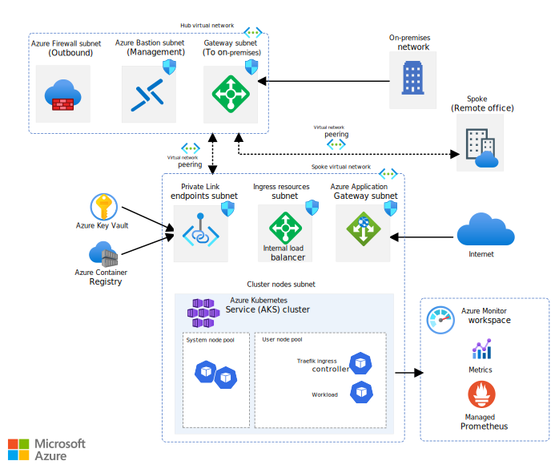

This reference architecture provides a recommended baseline infrastructure architecture to deploy an Azure Kubernetes Service (AKS) cluster. It uses our design principles and is based on AKS [architectural best practices](/azure/architecture/framework/services/compute/azure-kubernetes-service/azure-kubernetes-service) from the [Azure Well-Architected Framework](/azure/well-architected/). These resources help guide an interdisciplinary or multiple distinct teams like networking, security, and identity through deploying this general purpose infrastructure.

This architecture isn't focused on a workload. It concentrates on the AKS cluster itself. This information is the minimum recommended baseline for most AKS clusters. It integrates with Azure services that deliver observability, a network topology that supports multi-regional growth, and secures the in-cluster traffic.

Your business requirements influence the target architecture and it can vary between different application contexts. Consider the architecture as your starting point for preproduction and production stages.

You can find an implementation of this architecture on [GitHub: AKS baseline reference implementation](https://github.com/mspnp/aks-baseline). Use it as an alternative starting point and configure the reference architecture based on your needs.

> [!NOTE]
> The reference architecture requires knowledge of Kubernetes and its concepts. If you need a refresher, see the [**Learn more about AKS**](#learn-more-about-aks) section for resources.

:::row:::
    :::column:::

      #### Networking configuration
      [Network topology](#network-topology)\
      [Plan the IP addresses](#plan-the-ip-addresses)\
      [Deploy Ingress resources](#deploy-ingress-resources)
    :::column-end:::
    :::column:::

      #### Cluster compute
      [Compute for the base cluster](#configure-compute-for-the-base-cluster)\
      [Container image reference](#container-image-reference)\
      [Policy management](#policy-management)
    :::column-end:::
    :::column:::

      #### Identity management
      [Integrate Microsoft Entra ID for the cluster](#integrate-azure-active-directory-for-the-cluster)\
      [Integrate Microsoft Entra ID for the workload](#integrate-azure-active-directory-for-the-workload)
    :::column-end:::
:::row-end:::

:::row:::
   :::column:::

      #### Secure data flow
      [Secure the network flow](#secure-the-network-flow)\
      [Add secret management](#add-secret-management)
    :::column-end:::
   :::column:::

      #### Business continuity
      [Scalability](#node-and-pod-scalability)\
      [Cluster and node availability](#business-continuity-decisions)\
      [Availability and multi-region support](#availability-zones-and-multi-region-support)
    :::column-end:::  
    :::column:::

      #### Operations
      [Cluster and workload CI/CD pipelines](#cluster-and-workload-operations-devops)\
      [Cluster health and metrics](#monitor-and-collect-metrics)\
      [Cost management and reporting](#cost-management)
    :::column-end:::
:::row-end:::

## Network topology

This architecture uses a hub-spoke network topology. The hub and spoke network topology deploys in separate virtual networks connected through [peering](/azure/virtual-network/virtual-network-peering-overview). Some advantages of this topology are:

- Enables segregated management. Enables a way to apply governance and adhere to the principle of least privilege. It also supports the concept of an [Azure landing zone](/azure/cloud-adoption-framework/ready/landing-zone/) with a separation of duties.

- Minimizes direct exposure of Azure resources to the public internet.

- Provides regional hub-spoke topologies for organizations. Hub-spoke network topologies can be expanded in the future and provide workload isolation.

- Requires a web application firewall (WAF) service to help govern HTTP traffic flow for all web applications. 

- Provides support for workloads that span multiple subscriptions.

- Makes the architecture extensible. To accommodate new features or workloads, you can add new spokes instead of redesigning the network topology.

- Supports sharing resources, such as a firewall and a domain name system (DNS), across networks.

- Aligns with the [Azure enterprise-scale landing zones](/azure/cloud-adoption-framework/ready/enterprise-scale/implementation).

[ ](images/aks-baseline-architecture.svg#lightbox)

*Download a [Visio file](https://arch-center.azureedge.net/aks-baseline-architecture.vsdx) of this architecture.*

For more information, see [Hub-spoke network topology in Azure](../../../networking/architecture/hub-spoke.yml).

To review the network design changes included in the Windows containers on AKS baseline reference architecture, see [Windows containers on AKS](./windows-containers-on-aks.yml#network-design).

### Hub

The hub virtual network is the central point of connectivity and observability. In this architecture, the hub contains these components:

- Azure Firewall with global firewall policies defined by your central IT teams to enforce organization-wide firewall policy.
- Azure Bastion for remote access to virtual machines.
- Gateway subnet for VPN connectivity.
- Azure Monitor for network observability.

Within the network, three subnets deploy.

#### Subnet to host Firewall

[Firewall](/azure/firewall/) is firewall as a service. The firewall instance secures outbound network traffic. Without this layer of security, the traffic might communicate with a malicious, non-Microsoft service that could exfiltrate sensitive workload data. [Firewall Manager](/azure/firewall-manager/overview) lets you centrally deploy and configure multiple Firewall instances and manage Firewall policies for this *hub virtual network* architecture type.

#### Subnet to host a gateway

This subnet is a placeholder for a VPN or ExpressRoute gateway. The gateway provides connectivity between the routers in your on-premises network and the virtual network.

#### Subnet to host Azure Bastion

This subnet is a placeholder for [Azure Bastion](/azure/bastion/bastion-overview). You can use Bastion to securely access Azure resources without exposing the resources to the internet. This subnet is for management and operations only.

### Spoke

The spoke virtual network contains the AKS cluster and other related resources. The spoke has four subnets:

#### Subnet to host Azure Application Gateway

[Application Gateway](/azure/application-gateway/overview) is a web traffic load balancer operating at Layer 7. The reference implementation uses the Application Gateway v2 SKU that enables [Azure Web Application Firewall (WAF)](/azure/application-gateway/waf-overview). WAF secures incoming traffic from common web traffic attacks, including bots. The instance has a public frontend IP configuration that receives user requests. By design, Application Gateway requires a dedicated subnet.

#### Subnet to host the ingress resources

To route and distribute traffic, [Traefik](https://doc.traefik.io/traefik/) is the ingress controller that is going to fulfill the Kubernetes ingress resources. The Azure internal load balancers exist in this subnet. For more information, see [Use an internal load balancer with AKS](/azure/aks/internal-lb).

#### Subnet to host the cluster nodes

AKS maintains two separate groups of nodes (or node pools). The *system node pool* hosts pods that run core cluster services. The *user node pool* runs your workload and the ingress controller to enable inbound communication to the workload.

#### Subnet to host Private Link endpoints

Create Azure Private Link connections for the [Azure Container Registry](/azure/container-registry/) and [Azure Key Vault](/azure/key-vault/general/overview). Access these services by using a [private endpoint](/azure/private-link/private-endpoint-overview) within the spoke virtual network. Private endpoints don't require a dedicated subnet. You can also place them in the hub virtual network. In the baseline implementation, the endpoints deploy to a dedicated subnet within the spoke virtual network. This approach reduces traffic passing the peered network connection. It keeps the resources that belong to the cluster in the same virtual network. It also lets you apply granular security rules at the subnet level by using network security groups.

For more information, see [Private Link deployment options](../../../networking/guide/private-link-hub-spoke-network.yml#decision-tree-for-private-link-deployment).

## Plan the IP addresses

[ ](images/aks-baseline-network-topology.svg#lightbox)

*Download a [Visio file](https://arch-center.azureedge.net/aks-baseline_network_topology.vsdx) of this architecture.*

The address space of the virtual network should be large enough to hold all subnets. Account for all entities that receive traffic. IP addresses for those entities allocate from the subnet address space. Consider these points.

- Upgrades

    AKS updates nodes regularly to make sure the underlying virtual machines are up to date on security features and other system patches. During an upgrade process, AKS creates a node that temporarily hosts the pods, while the upgrade node is cordoned and drained. That temporary node is assigned an IP address from the cluster subnet. Ensure you have enough address space for these temporary node IP addresses.

    For pods, you might need more addresses depending on your strategy. For rolling updates, you need addresses for the temporary pods that run the workload while the actual pods are updated. If you use the replaced strategy, pods are removed, and the new ones are created. So, addresses associated with the old pods are reused.

- Scalability

    Take into consideration the node count of all system and user nodes and their maximum scalability limit. Suppose you want to scale out by 400%. You need four times the number of addresses for all those scaled-out nodes.

    In this architecture, each pod can be contacted directly. So, each pod needs an individual address. Pod scalability impacts the address calculation. That decision depends on your choice about the number of pods you want to grow.

- Azure Private Link addresses

    Factor in the addresses that are required for communication with other Azure services over Private Link. In this architecture, we have two addresses assigned for the links to Azure Container Registry and Key Vault.

- Azure reserves [Certain addresses](/azure/virtual-network/virtual-networks-faq#are-there-any-restrictions-on-using-ip-addresses-within-these-subnets) for its uses. They can't be assigned.

The preceding list isn't exhaustive. If your design has other resources that impact the number of available IP addresses, accommodate those addresses.

This architecture is designed for a single workload. In a production AKS cluster, the system node pool should always be separated from the user node pool. When you run multiple workloads on the cluster, you might want to isolate the user node pools from each other. That choice results in more subnets that are smaller in size. Also, the ingress resource might be more complex, and as a result you might need multiple ingress controllers that require extra IP addresses.

For the complete set of considerations for this architecture, see [AKS baseline Network Topology](https://github.com/mspnp/aks-secure-baseline/blob/main/networking/topology.md).

For information related to planning IP for an AKS cluster, see [Plan IP addressing for your cluster](/azure/aks/configure-azure-cni#plan-ip-addressing-for-your-cluster).

To review the IP address planning considerations included in the Windows containers on AKS baseline reference architecture, see the [companion article](./windows-containers-on-aks.yml#ip-address-planning).

## Add-ons and preview features

Kubernetes and AKS continuously evolve, with faster release cycles than software for on-premises environments. This baseline architecture depends on select AKS preview features and AKS add-ons. Here's the difference between the two:

- AKS team describes preview features as *shipped and improving*. The reason is many of the preview features stay in that state for only a few months before moving to general release (GA) phase.
- AKS [add-ons and extensions](/azure/aks/integrations#add-ons) provide extra, supported functionality. AKS manages their installation, configuration, and lifecycle.

This baseline architecture doesn't include every preview feature or add-on. Instead, only the ones that add significant value to a general-purpose cluster are included. As these features come out of preview, this baseline architecture is revised accordingly. There are some other preview features or AKS add-ons you might want to evaluate in preproduction clusters that augment your security, manageability, or other requirements. With non-Microsoft add-ons, you must install and maintain them, including tracking available versions and installing updates after upgrading a cluster's Kubernetes version.

## Container image reference

In addition to the workload, the cluster might contain several other images, such as the ingress controller. Some of those images might reside in public registries. Consider these points when pulling them into your cluster.

- Authenticate the cluster to pull the image.
- Import a public image, if you're using one, into the container registry that aligns with your service level objective (SLO). Otherwise, the image might be subject to unexpected availability problems, which can cause operational issues if the image isn't available when you need it. Here are some benefits of using your container registry instead of a public registry:

  - You can block unauthorized access to your images.
  - You don't have public facing dependencies.
  - You can access image pull logs to monitor activities and triage connectivity problems.
  - You can take advantage of integrated container scanning and image compliance.

  Another option is Container Registry.

- Pull images from authorized registries. You can enforce this restriction through Azure Policy. In this reference implementation, the cluster only pulls images from Container Registry that deploy as part of the architecture.

## Configure compute for the base cluster

In AKS, each node pool maps to a Virtual Machine (VM) scale set. Nodes are VMs in each node pool. Consider using a smaller VM size for the system node pool to minimize costs. This reference implementation deploys the system node pool with three DS2_v2 nodes. That size is sufficient to meet the expected load of the system pods. The OS disk is 512 GB.

For the user node pool, here are some considerations:

- Choose larger node sizes to pack the maximum number of pods set on a node. It minimizes the footprint of services that run on all nodes, such as monitoring and logging.

- Select the appropriate VM type if you have specialized workload requirements. For example, you might need a memory-optimized product for some workloads, or a GPU-accelerated product for others. To learn more about the VM product families available in Azure, see [Sizes for virtual machines in Azure](/azure/virtual-machines/sizes/overview).

- Deploy at least two nodes. That way, the workload has a high availability pattern with two replicas. With AKS, you can change the node count without recreating the cluster.

- Plan the actual node sizes for your workload based on the requirements determined by your design team. Based on the business requirements, we choose DS4_v2 for the production workload. To lower costs, you can drop the size to DS3_v2, which is the minimum recommendation.

- Assume that your workload consumes up to 80% of each node when planning capacity for your cluster. The remaining 20% is reserved for AKS services.

- Set the maximum pods per node based on your capacity planning. If you're trying to establish a capacity baseline, start with a value of 30. Adjust that value based on the requirements of the workload, the node size, and your IP constraints.

<a name='integrate-azure-active-directory-for-the-cluster'></a>

## Integrate Microsoft Entra ID for the cluster

Securing access to and from the cluster is critical. Think from the cluster's perspective when you're making security choices:

-   *Inside-out access*. AKS access to Azure components such as networking infrastructure, Azure Container Registry, and Key Vault. Authorize only those resources that the cluster is allowed access.
-   *Outside-in access*. Providing identities access to the Kubernetes cluster. Authorize only those external entities that are allowed access to the Kubernetes API server and Azure Resource Manager.

### AKS access to Azure

There are two ways to manage AKS to Azure access through Microsoft Entra ID: *service principals* or *managed identities for Azure resources*.

Of the two ways, managed identities are recommended. With service principals, you're responsible for managing and rotating secrets, either manually or programmatically. With managed identities, Microsoft Entra ID manages and performs the authentication and timely rotation of secrets for you.

We recommend that you enable [managed identities](/azure/aks/use-managed-identity#summary-of-managed-identities) so that the cluster can interact with external Azure resources through Microsoft Entra ID. You can enable this setting only during cluster creation. Even if Microsoft Entra ID isn't used immediately, you can incorporate it later.

By default, there are two primary [identities](/azure/aks/use-managed-identity#summary-of-managed-identities) used by the cluster: the *cluster identity* and the *kubelet identity*. The *cluster identity* is used by the AKS control plane components to manage cluster resources including ingress load balancers, AKS managed public IPs, and so on. The *kubelet identity* is used to authenticate with Container Registry. Some add-ons also support authentication by using a managed identity.

As an example for the inside-out case, let's study the use of managed identities when the cluster needs to pull images from a container registry. This action requires the cluster to get the credentials of the registry. If you don't use a managed identity, then you might store that information in the form of Kubernetes Secrets object and use `imagePullSecrets` to retrieve the secret. That approach isn't recommended because of security complexities. Not only do you need prior knowledge of the secret but also disclosure of that secret through the DevOps pipeline. Another reason is the operational overhead of managing the rotation of the secret. Instead, grant `AcrPull` access to the kubelet managed identity of the cluster to your registry. This approach addresses those concerns.

In this architecture, the cluster accesses Azure resources that Microsoft Entra ID secures and the cluster performs operations that support managed identities. Assign Azure role-based access control (Azure RBAC) and permissions to the cluster's managed identities, depending on the operations that the cluster intends to do. The cluster authenticates itself to Microsoft Entra ID and then allowed or denied access based on the roles assigned to it. Here are some examples from this reference implementation where Azure built-in roles are assigned to the cluster:

- [Network Contributor](/azure/role-based-access-control/built-in-roles#network-contributor). The cluster's ability to control the spoke virtual network. This role assignment allows AKS cluster system assigned identity to work with the dedicated subnet for the Internal Ingress Controller services.
- [Monitoring Metrics Publisher](/azure/role-based-access-control/built-in-roles#monitoring-metrics-publisher). The cluster's ability to send metrics to Azure Monitor.
- [AcrPull](/azure/role-based-access-control/built-in-roles#acrpull). The cluster's ability to pull images from the specified Azure Container Registries.

### Cluster access

Microsoft Entra integration also simplifies security for outside-in access. Suppose a user wants to use kubectl. As an initial step, they run the `az aks get-credentials` command to get the credentials of the cluster. Microsoft Entra ID authenticates the user's identity against the Azure roles that are allowed to get cluster credentials. For more information, see [Available cluster roles permissions](/azure/aks/control-kubeconfig-access#available-cluster-roles-permissions).

AKS supports Kubernetes access by using Microsoft Entra ID in two ways. The first is by using Microsoft Entra ID as an identity provider integrated with the native Kubernetes RBAC system. The other method uses native Azure RBAC to control cluster access. The following sections detail both approaches.

<a name='associate-kubernetes-rbac-to-azure-active-directory'></a>

#### Associate Kubernetes RBAC with Microsoft Entra ID

Kubernetes supports role-based access control (RBAC) through:

- A set of permissions. Defined by a `Role` or `ClusterRole` object for cluster-wide permissions.

- Bindings that assign users and groups who have permission to do the actions. Defined by a `RoleBinding` or `ClusterRoleBinding` object.

Kubernetes has some built-in roles such as cluster-admin, edit, view, and so on. Bind those roles to Microsoft Entra users and groups to use enterprise directory to manage access. For more information, see [Use Kubernetes RBAC with Microsoft Entra integration](/azure/aks/azure-ad-rbac).

Be sure your Microsoft Entra groups used for cluster and namespace access are included in your [Microsoft Entra access reviews](/azure/active-directory/governance/access-reviews-overview).

#### Use Azure RBAC for Kubernetes authorization

Instead of using Kubernetes native RBAC ([ClusterRoleBindings and RoleBindings](https://kubernetes.io/docs/reference/access-authn-authz/rbac/#rolebinding-and-clusterrolebinding)) for authorization with integrated Microsoft Entra authentication, another option that we recommend, is to use Azure RBAC and Azure role assignments to enforce authorization checks on the cluster. You can even assign these role assignments at the management group, subscription, or resource group scopes. All clusters under the scope then inherit a consistent set of role assignments with respect to who has permissions to access the objects on the Kubernetes cluster.

For more information, see [Azure RBAC for Kubernetes Authorization](/azure/aks/manage-azure-rbac).

#### Local accounts

AKS supports native [Kubernetes user authentication](https://kubernetes.io/docs/reference/access-authn-authz/authentication/#users-in-kubernetes). We don't recommend user access to clusters with this method because access is certificate-based and performs external to your primary identity provider. It makes your centralized user access control and governance difficult. Always manage access to your cluster by using Microsoft Entra ID, and configure your cluster to explicitly disable local account access.

In this reference implementation, local cluster accounts access is explicitly disabled when the cluster deploys.

<a name='integrate-azure-active-directory-for-the-workload'></a>

## Integrate Microsoft Entra ID for the workload

Similar to having an Azure system-assigned managed identity for the entire cluster, you can assign managed identities at the pod level. A workload identity allows the hosted workload to access resources through Microsoft Entra ID. For example, the workload stores files in Azure Storage. When it needs to access those files, the pod authenticates itself against the resource as an Azure managed identity.

In this reference implementation, [Microsoft Entra Workload ID on AKS](/azure/aks/workload-identity-overview) handles the managed identities for pods. This approach integrates with the Kubernetes native capabilities to federate with external identity providers. For more information about Microsoft Entra Workload ID federation, see [Workload identity federation](/entra/workload-id/workload-identity-federation).

## Deploy Ingress resources

Kubernetes Ingress resources handle routing and distributing for incoming traffic to the cluster. There are two parts of Ingress resources:

- Internal load balancer. Managed by AKS. The load balancer exposes the ingress controller through a private static IP address. It serves as single point of contact that receives inbound flows.

    This architecture uses Azure Load Balancer. Load Balancer is outside the cluster in a subnet dedicated for ingress resources. It receives traffic from Application Gateway and that communication is over transport layer security (TLS). For more information about TLS encryption for inbound traffic, see [Ingress traffic flow](#ingress-traffic-flow).

- Ingress controller. This example uses Traefik. It runs in the user node pool in the cluster. It receives traffic from the internal load balancer, terminates TLS, and forwards it to the workload pods over HTTP.

The Ingress controller is a critical component of cluster. Consider the following points when configuring this component.

- Choose a scope within which the ingress controller is allowed operate as part of your design decisions. For example, you might allow the controller to only interact with the pods that run a specific workload.

- Avoid placing replicas on the same node to spread out the load and help ensure business continuity if a node goes down. Use `podAntiAffinity` for this purpose.

- Constrain pods to be scheduled only on the user node pool by using `nodeSelectors`. This setting isolates workload and system pods.

- Open ports and protocols that allow specific entities to send traffic to the ingress controller. In this architecture, Traefik only receives traffic from Application Gateway.

- Configure `readinessProbe` and `livenessProbe` settings that monitor the health of the pods at the specified interval. Ingress controller should send signals that indicate the health of pods.

- Consider restricting the ingress controller's access to specific resources and the ability to perform certain actions. That restriction can be implemented through Kubernetes RBAC permissions. For example, in this architecture, Traefik is granted permissions to watch, get, and list services and endpoints by using rules in the Kubernetes `ClusterRole` object.

> [!NOTE]
> The choice for the appropriate ingress controller is driven by the requirements, the workload, the skill set of the operator, and the supportability of the technology options. Most importantly, your ingress controller needs to meet your SLO expectation.
>
> Traefik is an open-source option for a Kubernetes cluster and is chosen in this architecture for *illustrative* purposes. It shows third-party product integration with Azure services. For example, the implementation shows how to integrate Traefik with Microsoft Entra Workload ID and Key Vault.
>
> Another choice is Application Gateway Ingress Controller, and it's well integrated with AKS. Apart from its capabilities as an ingress controller, it offers other benefits. For example, Application Gateway acts as the virtual network entry point of your cluster. It can observe traffic entering the cluster. If you have an application that requires WAF, Application Gateway is a good choice because it's integrated with WAF. Also, it provides the opportunity to do TLS termination.

To review the ingress design used in the Windows containers on AKS baseline reference architecture, see the [companion article](./windows-containers-on-aks.yml#ingress-design).

### Router settings

The ingress controller uses routes to determine where to send traffic. Routes specify the source port at which the traffic is received and information about the destination ports and protocols.

Here's an example from this architecture:

Traefik uses the Kubernetes provider to configure routes. The `annotations`, `tls`, and `entrypoints` indicate that routes will be served over HTTPS. The `middlewares` specifies that only traffic from the Application Gateway subnet is allowed. The responses use gzip encoding if the client accepts. Because Traefik does TLS termination, communication with the backend services is over HTTP.

```yaml
apiVersion: networking.k8s.io/v1
kind: Ingress
metadata:
  name: aspnetapp-ingress
  namespace: a0008
  annotations:
    kubernetes.io/ingress.allow-http: "false"
    kubernetes.io/ingress.class: traefik-internal
    traefik.ingress.kubernetes.io/router.entrypoints: websecure
    traefik.ingress.kubernetes.io/router.tls: "true"
    traefik.ingress.kubernetes.io/router.tls.options: default
    traefik.ingress.kubernetes.io/router.middlewares: app-gateway-snet@file, gzip-compress@file
spec:
  tls:
  - hosts:
      - bu0001a0008-00.aks-ingress.contoso.com
  rules:
  - host: bu0001a0008-00.aks-ingress.contoso.com
    http:
      paths:
      - path: /
        pathType: Prefix
        backend:
          service:
            name: aspnetapp-service
            port: 
              number: 80
```

## Secure the network flow

Network flow, in this context, is categorized as:

- **Ingress traffic**: is from the client to the workload running in the cluster.

- **Egress traffic**: is from a pod or node in the cluster to an external service.

- **Pod-to-pod traffic**: is the communication between pods. This traffic includes communication between the ingress controller and the workload. Also, if your workload is composed of multiple applications deployed to the cluster, communication between those applications falls into this category.

- **Management traffic**: is traffic that goes between the client and the Kubernetes API server.

[ ](images/traffic-flow.svg#lightbox)

*Download a [Visio file](https://arch-center.azureedge.net/secure-baseline-aks-traffic-flow.vsdx) of this architecture.*

This architecture has several layers of security to secure all types of traffic.

### Ingress traffic flow

The architecture only accepts TLS encrypted requests from the client. TLS v1.2 is the minimum allowed version with a restricted set of ciphers. Server Name Indication (SNI) strict matching is enabled. End-to-end TLS is set up through Application Gateway by using two different TLS certificates, as shown in this image.

[ ](images/tls-termination.svg#lightbox)

*Download a [Visio file](https://arch-center.azureedge.net/secure-baseline-aks-tls-termination.vsdx) of this architecture.*

1. The client sends an HTTPS request to the domain name: `bicycle.contoso.com`. That name is associated with a DNS record to the public IP address of Application Gateway. This traffic is encrypted to help ensure that the traffic between the client browser and gateway can't be inspected or changed.

2. Application Gateway has an integrated web application firewall (WAF) and negotiates the TLS handshake for `bicycle.contoso.com`, allowing only secure ciphers. Application Gateway is a TLS termination point. It processes WAF inspection rules and runs routing rules that forward the traffic to the configured backend. The TLS certificate stores in Key Vault. Access it by using a user-assigned managed identity integrated with Application Gateway. For information, see [TLS termination with Key Vault certificates](/azure/application-gateway/key-vault-certs).

3. As traffic moves from Application Gateway to the backend, it's encrypted again with another TLS certificate (wildcard for `*.aks-ingress.contoso.com`) as forwards to the internal load balancer. This re-encryption helps make sure unsecured traffic doesn't flow into the cluster subnet.

4. The ingress controller receives the encrypted traffic through the load balancer. The controller is another TLS termination point for `*.aks-ingress.contoso.com` and forwards the traffic to the workload pods over HTTP. The certificates are stored in Key Vault and mounted into the cluster by using the Container Storage Interface (CSI) driver. For more information, see [Add secret management](#add-secret-management).

You can implement end-to-end TLS traffic at every hop through the workload pod. Be sure to measure the performance, latency, and operational affects when making the decision to secure pod-to-pod traffic. For most single-tenant clusters, with proper control plane RBAC and mature Software Development Lifecycle practices, it's sufficient to TLS encrypt up to the ingress controller and protect with Web Application Firewall (WAF). That minimizes overhead in workload management and network performance impacts. Your workload and compliance requirements dictate where you perform [TLS termination](/azure/application-gateway/ssl-overview#tls-termination).

### Egress traffic flow

In this architecture, we recommend that all egress traffic from the cluster communicates through Firewall. Or you can use your own similar network virtual appliance. We don't recommend using other egress options, such as [NAT Gateway](/azure/virtual-network/nat-gateway/nat-gateway-resource) or [HTTP proxy](/azure/aks/http-proxy) because they don't provide network traffic inspection. For zero-trust control and the ability to inspect traffic, all egress traffic from the cluster moves through Firewall. You can implement that choice with user-defined routes (UDRs). The next hop of the route is the [private IP address](/azure/virtual-network/virtual-network-ip-addresses-overview-arm#private-ip-addresses) of Firewall. Here, Firewall decides whether to block or allow the egress traffic. That decision is based on the specific rules defined in Firewall or the built-in threat intelligence rules.

An alternative to Firewall is to use AKS's [HTTP Proxy](/azure/aks/http-proxy) feature. All traffic egressing the cluster is set first to the IP address of the HTTP Proxy, which decides to forward the traffic or drop it.

With either method, review the required [egress network rules](/azure/aks/limit-egress-traffic) for AKS.

> [!NOTE]
> If you use a public load balancer as your public point for ingress traffic and egress through Firewall using UDRs, you might see an [asymmetric routing situation](/azure/aks/limit-egress-traffic#add-a-dnat-rule-to-azure-firewall). This architecture uses *internal* load balancers in a dedicated ingress subnet behind the Application Gateway. This design choice not only enhances security, but also eliminates asymmetric routing concerns. Alternatively, you could route ingress traffic through Firewall before or after your Application Gateway, but this approach isn't necessary for most situations and we don't recommend it.
> For more information about asymmetric routing, see [Integrate Firewall with Azure Standard Load Balancer](/azure/firewall/integrate-lb#asymmetric-routing).

An exception to the zero-trust control is when the cluster needs to communicate with other Azure resources. For instance, the cluster needs to pull an updated image from the container registry, or secrets from Key Vault. The recommended approach is by using [Azure Private Link](/azure/private-link/private-link-overview). The advantage is that specific subnets reach the service directly instead of the traffic between the cluster and the services going over the internet. A downside is that Private Link needs extra configuration instead of using the target service over its public endpoint. Also, not all Azure services or products support Private Link. For those cases, consider enabling a [Virtual Network service endpoint](/azure/virtual-network/virtual-network-service-endpoints-overview) on the subnet to access the service.

If Private Link or service endpoints aren't an option, you can reach other services through their public endpoints, and control access through Firewall rules and the firewall built into the target service. Because this traffic goes through the static IP addresses of the firewall, those addresses can be added the service's IP allowlist. One downside is that Firewall needs to have more rules to make sure only traffic from a specific subnet is allowed. Factor in those addresses when you're planning multiple IP addresses for egress traffic with Firewall, otherwise you could reach port exhaustion. For more information about planning for multiple IP addresses, see [Restrict and control outbound traffic](/azure/aks/limit-egress-traffic#restrict-egress-traffic-using-azure-firewall).

To review Windows-specific egress considerations used in the Windows containers on AKS baseline reference architecture, see the [companion article](./windows-containers-on-aks.yml#egress-traffic-flow).

### Pod-to-pod traffic

By default, a pod can accept traffic from any other pod in the cluster. Kubernetes `NetworkPolicy` is used to restrict network traffic between pods. Apply policies judiciously, otherwise you might have a situation where a critical network flow is blocked. *Only* allow specific communication paths, as needed, such as traffic between the ingress controller and workload. For more information, see [Network policies](/azure/aks/use-network-policies).

Enable network policy when the cluster is provisioned because it can't be added later. There are a few choices for technologies that implement `NetworkPolicy`. Azure Network Policy is recommended, which requires Azure Container Networking Interface (CNI), see the following note. Other options include Calico Network Policy, a well-known open-source option. Consider Calico if you need to manage cluster-wide network policies. Calico isn't covered under standard Azure support.

For more information, see [Differences between Azure Network Policy and Calico policies and their capabilities](/azure/aks/use-network-policies#differences-between-azure-and-calico-policies-and-their-capabilities).

> [!NOTE]
> AKS supports multiple networking models including kubenet, Azure Container Networking Interface (CNI), and Azure CNI Overlay. The CNI models are the more advanced models and a CNI-based model is required for enabling Azure Network Policy. Both CNI models are highly performant, with performance between pods on par with virtual machines in a virtual network. A CNI-based networking model is recommended.
>
> In the non-overlay CNI model, every pod gets an IP address from the subnet address space. Resources within the same network (or peered resources) can access the pods directly through their IP address. NAT isn't needed for routing that traffic.
>
> Azure CNI also offers enhanced security control because it enables the use of Azure Network Policy. It's recommended that Azure CNI Overlay be used for IP address constrained deployments, which only allocates IP addresses from the node pool subnet for the nodes and uses a highly optimized overlay layer for pod IPs.
>
> For information about the models, see [Choosing a CNI network model to use](/azure/aks/azure-cni-overlay#choosing-a-network-model-to-use) and [Compare kubenet and Azure CNI network models](/azure/aks/concepts-network#compare-network-models).

### Management traffic

As part of running the cluster, the Kubernetes API server receives traffic from resources that want to do management operations on the cluster, such as requests to create resources or the scale the cluster. Examples of those resources include the build agent pool in a DevOps pipeline, an Azure Bastion instance within the Bastion subnet, and node pools themselves. Instead of accepting this management traffic from all IP addresses, use AKS's Authorized IP Ranges feature to only allow traffic from your authorized IP ranges to the API server.

For more information, see [Define API server authorized IP ranges](/azure/aks/api-server-authorized-ip-ranges).

For another layer of control, at the cost of extra complexity, you can provision a private AKS cluster. By using a private cluster, you can help ensure network traffic between your API server and your node pools remains on the private network only and is never exposed to the internet. For more information, see [AKS Private Clusters](/azure/aks/private-clusters).

## Add secret management

Store secrets in a managed key store, such as Key Vault. The advantage is that a managed key store handles the rotation of secrets. It provides strong encryption and an access audit log. It also keeps core secrets out of the deployment pipeline. In this architecture, Key Vault firewall is enabled and configured with private link connections to the resources in Azure that need to access secrets and certificates.

Key Vault is well integrated with other Azure services. Use the built-in feature of those services to access secrets. For an example about how Application Gateway accesses TLS certificates for the ingress flow, see the [Ingress traffic flow](#ingress-traffic-flow) section.

The Azure RBAC permission model for Key Vault allows you to assign the workload identities to either the **Key Vault Secrets User** or **Key Vault Reader** role assignment, and access the secrets. For more information, see [Access Key Vault by using RBAC](/azure/key-vault/general/rbac-guide).

### Accessing cluster secrets

You need to use workload identities to allow a pod to access secrets from a specific store. To facilitate the retrieval process, use a [Secrets Store CSI driver](https://github.com/kubernetes-sigs/secrets-store-csi-driver). When the pod needs a secret, the driver connects with the specified store, retrieves secret on a volume, and mounts that volume in the cluster. The pod can then get the secret from the volume file system.

The CSI driver has many providers to support various managed stores. In this implementation, we choose the [Key Vault with Secrets Store CSI Driver](/azure/aks/csi-secrets-store-driver) by using the add-on to retrieve the TLS certificate from Key Vault and load it in the pod running the ingress controller. It happens during pod creation and the volume stores both public and the private keys.

## Workload storage

The workload used in this architecture is stateless. If you need to store state, persisting it outside the cluster is recommended. Guidance for workload state is outside the scope of this article.

To learn more about storage options, see [Storage options for applications in AKS](/azure/aks/concepts-storage).

## Policy management

An effective way to manage an AKS cluster is by enforcing governance through policies. Kubernetes implements policies through OPA Gatekeeper. For AKS, policies are delivered through Azure Policy. Each policy is applied to all clusters in its scope. OPA Gatekeeper handles Azure Policy enforcement in the cluster and all policy checks are logged. Policy changes aren't immediately reflected in your cluster, so expect to see some delays.

There are two different scenarios that Azure Policy delivers for managing your AKS clusters:

* Preventing or restricting deployment of AKS clusters in a resource group or subscription by evaluating your organizations standards. For example, follow a naming convention, specify a tag, and so on.
* Secure your AKS cluster through Azure Policy for Kubernetes.

When setting policies, apply them based on the requirements of the workload. Consider these factors:

- Do you want to set a collection of policies (called initiatives) or choose individual policies? Azure Policy provides two built-in initiatives: basic and restricted. Each initiative is a collection of built-in policies applicable to an AKS cluster. We recommend that you select an initiative *and* choose other policies for the cluster and the resources. You can choose resources such as Container Registry, Application Gateway, Key Vault, and so on, which interact with the cluster, per the requirements of your organization.

- Do you want to **Audit** or **Deny** the action? In **Audit** mode, the action is allowed but flagged as **Non-Compliant**. Have processes to check noncompliant states at a regular cadence and take necessary action. In **Deny** mode, the action is blocked because it violates the policy. Be careful in choosing this mode because it can be too restrictive for the workload to function.

- Do you have areas in your workload that shouldn't be compliant by design? Azure Policy has the capability to specify Kubernetes namespaces that are exempt from policy enforcement. We recommend that you still apply policies in **Audit** mode so that you're aware of those instances.

- Do you have requirements that aren't covered by the built-in policies? You can create a custom Azure Policy definition that applies your custom OPA Gatekeeper policies. Don't apply custom policies directly to the cluster. To learn more about creating custom policies, see [Create and assign custom policy definitions](/azure/aks/use-azure-policy#create-and-assign-a-custom-policy-definition-preview).

- Do you have organization-wide requirements? If so, add those policies at the management group level. Your cluster should also assign its own workload-specific policies, even if the organization has generic policies.

- Azure policies are assigned to specific scopes. Ensure the *production* policies are also validated against your *preproduction* environment. Otherwise, when deploying to your production environment, you might run into unexpected extra restrictions that weren't accounted for in preproduction.

In this reference implementation, Azure Policy is enabled when the AKS cluster is created and assigns the restrictive initiative in **Audit** mode to gain visibility into noncompliance.

The implementation also sets extra policies that aren't part of any built-in initiatives. Those policies are set in **Deny** mode. For example, there's a policy in place to make sure images are only pulled from the deployed Container Registry. Consider creating your own custom initiatives. Combine the policies that are applicable for your workload into a single assignment.

To observe how Azure Policy is functioning from within your cluster, you can access the pod logs for all pods in the `gatekeeper-system` namespace and the logs for the `azure-policy` and `azure-policy-webhook` pods in the `kube-system` namespace.

To review Windows-specific Azure Policy considerations included in the Windows containers on AKS baseline reference architecture, see the [companion article](./windows-containers-on-aks.yml#policy-management).

## Node and pod scalability

With increasing demand, Kubernetes can scale out by adding more pods to existing nodes, through horizontal pod autoscaling (HPA). When more pods can no longer be scheduled, the number of nodes must be increased through AKS cluster autoscaling. A complete scaling solution must have ways to scale both pod replicas and the node count in the cluster.

There are two approaches: autoscaling or manual scaling.

The manual or programmatic way requires you to monitor and set alerts on CPU utilization or custom metrics. For pod scaling, the application operator can increase or decrease the number of pod replicas by adjusting the `ReplicaSet` through Kubernetes APIs. For cluster scaling, one way is to get notified when the Kubernetes scheduler fails. Another way is to watch for pending pods over time. You can adjust the node count through Azure CLI or the portal.

Autoscaling is the recommended approach because some of those manual mechanisms are built into the autoscaler.

As a general approach, start by performance testing with a minimum number of pods and nodes. Use those values to establish the baseline expectation. Then, use a combination of performance metrics and manual scaling to locate bottlenecks and understand the application's response to scaling. Finally, use this data to set the parameters for autoscaling. For more information on a performance tuning scenario using AKS, see [Performance tuning scenario: Distributed business transactions](../../../performance/distributed-transaction.yml).

### Horizontal Pod Autoscaler

The [Horizontal Pod Autoscaler (HPA)](https://kubernetes.io/docs/tasks/run-application/horizontal-pod-autoscale/) is a Kubernetes resource that scales the number of pods.

In the HPA resource, setting the minimum and maximum replica count is recommended. Those values constrain the autoscaling bounds.

HPA can scale based on the CPU utilization, memory usage, and custom metrics. Only CPU utilization is provided out of the box. The HorizontalPodAutoscaler definition specifies target values for those metrics. For instance, the spec sets a target CPU utilization. While pods are running, the HPA controller uses Kubernetes Metrics API to check each pod's CPU utilization. It compares that value against the target utilization and calculates a ratio. It then uses the ratio to determine whether pods are overallocated or underallocated. It relies on the Kubernetes scheduler to assign new pods to nodes or remove pods from nodes.

There might be a race condition where HPA checks before a scaling operation is complete. The outcome might be an incorrect ratio calculation. For details, see [Cooldown of scaling events](/azure/aks/concepts-scale#cooldown-of-scaling-events).

If your workload is event-driven, a popular open-source option is [Kubernetes event-driven autoscaling (KEDA)](https://github.com/kedacore/keda). Consider KEDA if an event source, such as message queue, drives your workload, rather than your workload being CPU- or memory-bound. KEDA supports many event sources or scalers. You can find a list of event sources that KEDA can scale at [KEDA scalers](https://keda.sh/#scalers). The list includes the [Azure Monitor scaler](https://keda.sh/docs/latest/scalers/azure-monitor/), which is a convenient way to scale KEDA workloads based on Azure Monitor metrics.

### Cluster autoscaler

The [cluster autoscaler](/azure/aks/cluster-autoscaler) is an AKS add-on component that scales the number of nodes in a node pool. Add it during cluster provisioning. You need a separate cluster autoscaler for each user node pool.

The Kubernetes scheduler triggers the cluster autoscaler. When the Kubernetes scheduler fails to schedule a pod because of resource constraints, the autoscaler automatically provisions a new node in the node pool. Conversely, the cluster autoscaler checks the unused capacity of the nodes. If the node isn't running at an expected capacity, the pods are moved to another node, and the unused node is removed.

When you enable autoscaler, set the maximum and minimum node count. The recommended values depend on the performance expectation of the workload, how much you want the cluster to grow, and cost implications. The minimum number is the reserved capacity for that node pool. In this reference implementation, the minimum value is set to 2 because of the simple nature of the workload.

For the system node pool, the recommended minimum value is 3.

To review scaling considerations included in the Windows containers on AKS baseline reference architecture, see the [companion article](./windows-containers-on-aks.yml#node-and-pod-scaling).

## Business continuity decisions

To maintain business continuity, define the SLO for the infrastructure and your application. To learn more about SLOs, see [Recommendations for defining reliability targets](/azure/well-architected/reliability/metrics). Review the SLA conditions for AKS in the latest [SLA for online services](https://www.microsoft.com/licensing/docs/view/Service-Level-Agreements-SLA-for-Online-Services) article.

### Cluster nodes

To meet the minimum level of availability for workloads, multiple nodes in a node pool are needed. If a node goes down, another node in the node pool in the same cluster can continue running the application. For reliability, three nodes are recommended for the system node pool. For the user node pool, start with no less than two nodes. If you need higher availability, provision more nodes.

Isolate your application from the system services by placing it in a separate node pool, referred to as a user node pool. This way, Kubernetes services run on dedicated nodes and don't compete with your workload. We recommend that you use tags, labels, and taints to identify the node pool, schedule your workload, and help ensure you taint your system node pool with the **CriticalAddonsOnly** [taint](/azure/aks/use-system-pools#system-and-user-node-pools).

Regular upkeep on your cluster, such as timely updates are crucial for reliability. Also, we recommend that you monitor the health of the pods through probes.

### Pod availability

**Specify pod resource requirements**. We highly recommended that you specify pod resource requirements in your deployments. The scheduler can then appropriately schedule the pod. Reliability is greatly reduced if your pods can't be scheduled.

**Set pod disruption budgets**. This setting determines how many replicas in a deployment can come down during an update or upgrade event. For more information, see [Pod disruption budgets](/azure/aks/operator-best-practices-scheduler#plan-for-availability-using-pod-disruption-budgets).

Configure multiple replicas in the deployment to handle disruptions such as hardware failures. For planned events such as updates and upgrades, a disruption budget can help ensure the required number of pod replicas exist to handle expected application load.

**Set resource quotas on the workload namespaces**. The resource quota on a namespace helps ensure pod requests and limits are properly set on a deployment. For more information, see [Enforce resource quotas](/azure/aks/operator-best-practices-scheduler#enforce-resource-quotas).

> [!NOTE]
> Setting resources quotas at the cluster level can cause problem when deploying third-party workloads that do not have proper requests and limits.

**Set pod requests and limits**. Setting requests and limits allows Kubernetes to efficiently allocate CPU and memory resources to the pods, and enables you to have higher container density on a node. Requests and limits can also increase your reliability while reducing your costs because of better hardware utilization.

To estimate the limits for a workload, test and establish a baseline. Start with equal values for requests and limits. Then, gradually tune those values until you establish a threshold that can cause instability in the cluster.

Requests and limits can be specified in your deployment manifests. For more information, see [Set pod requests and limits](/azure/aks/developer-best-practices-resource-management#define-pod-resource-requests-and-limits).

### Availability zones and multi-region support

To protect against some types of outages, you should use [availability zones](/azure/aks/availability-zones) if the region supports them. Both the control plane components and the nodes in the node pools are then able to spread across zones. If an entire zone is unavailable, a node in another zone within the region is still available. Each node pool maps to a separate virtual machine scale set, which manages node instances and scalability. The AKS service manages scale set operations and configuration. Here are some considerations when you enable multizone:

- **Entire infrastructure.** Choose a region that supports availability zones. For more information, see [Limitations and region availability](/azure/aks/availability-zones#limitations-and-region-availability). To have an Uptime SLA, you need to choose the Standard or Premium tier; the Uptime SLA is greater when using availability zones.

- **Cluster**. You can only set availability zones when you create the node pool. It can't be changed later. The node sizes should be supported in all zones so that the expected distribution is possible. The underlying virtual machine scale set provides the same hardware configuration across zones.

    Multizone support not only applies to node pools, but the control plane as well. The AKS control plane spans the zones requested, like the node pools. If you don't use zone support in your cluster, the control plane components aren't guaranteed to spread across availability zones.

- **Dependent resources**. For complete zonal benefit, all service dependencies must also support zones. If a dependent service doesn't support zones, it's possible that a zone failure could cause that service to fail.

    For example, a managed disk is available in the zone where it was provisioned. If a failure happens, the node might move to another zone, but the managed disk doesn't move with the node to that zone.

For simplicity, in this architecture AKS is deployed to a single region with node pools spanning availability zones 1, 2, and 3. Other resources of the infrastructure, such as Firewall and Application Gateway are deployed to the same region also with multizone support. Geo-replication is enabled for Azure Container Registry.

### Multiple regions

Enabling availability zones isn't enough in the unlikely event that the entire region goes down. To have higher availability, run multiple AKS clusters, in different regions.

- Prefer [paired regions](/azure/reliability/cross-region-replication-azure#azure-paired-regions) when they're available. A benefit of using paired regions is reliability during platform updates. Azure makes sure that only one region in the pair is updated at a time. [Some regions don't have pairs](/azure/reliability/cross-region-replication-azure#regions-with-availability-zones-and-no-region-pair). If your region isn't paired, you can still deploy a multi-region solution by selecting other regions to use. Consider using a CI/CD pipeline that is configured to orchestrate recovery from a region failure. Certain DevOps tools such as Flux can make the multi-region deployments easier.

- Provide the location where the redundant service has its secondary instance if an Azure resource supports geo-redundancy. For example, by enabling geo-replication for Azure Container Registry, it automatically replicates images to the selected Azure regions. It also provides continued access to images even if the primary region experiences an outage.

- Choose a traffic router that can distribute traffic across zones or regions, depending on your requirement. This architecture deploys Azure Load Balancer because it can distribute nonweb traffic across zones. If you need to distribute traffic across regions, Azure Front Door should be considered. For other considerations, see [Choose a load balancer](../../../guide/technology-choices/load-balancing-overview.yml).

> [!NOTE]
> We've extended this reference architecture to include multiple regions in an active/active and highly available configuration. For information about that reference architecture, see [AKS baseline for multiregion clusters](../aks-multi-region/aks-multi-cluster.yml).
>
>  You can find an implementation of the multiregion architecture on [GitHub: AKS for multi-region deployment](https://github.com/mspnp/aks-baseline-multi-region). Use it as a starting point and configure it per your needs.

### Disaster recovery

If a failure happens in the primary region, you should be able to quickly create a new instance in another region. Here are some recommendations:

- Use multiple regions. If your primary region has a paired region, use that pair. If not, select regions based on your data residency and latency requirements.

- Use a nonstateful workload that you can replicate efficiently. If you need to store state in the cluster, which we don't recommend, be sure you back up the data frequently in the paired region.

- Integrate the recovery strategy, such as replicating to another region, as part of the DevOps pipeline to meet your Service Level Objectives (SLO).

- Provision each Azure service by using features that support disaster recovery. For example, in this architecture, Azure Container Registry is enabled for geo-replication. If a region fails, you can still pull images from the replicated region.

- Deploy your infrastructure as code, including your AKS cluster and any other components you need. If you need to deploy into another region, you can reuse the scripts or templates to create an identical instance.

#### Cluster backup

For many architectures, provisioning a new cluster and returning it to operating state can be accomplished through GitOps-based [Cluster bootstrapping](#cluster-bootstrapping) and followed by application deployment. But if there's critical resource state, such as config maps, jobs, and potential secrets that can't be captured within your bootstrapping process, consider your recovery strategy. We recommend that you run stateless workloads in Kubernetes. If your architecture involves disk-based state, you also need to consider your recovery strategy for that content.

When cluster backup needs to be part of your recovery strategy, you need to install a solution that matches your business requirements within the cluster. This agent is responsible for pushing cluster resource state out to a destination of your choosing and coordinating Azure Disk-based, persistent volume snapshots.

VMware's [Velero](https://velero.io/) is an example of a common Kubernetes backup solution that you could install and manage directly. Alternatively, the [AKS backup extension](/azure/backup/azure-kubernetes-service-cluster-backup) can be used to provide a managed Velero implementation. The AKS backup extension supports backing up both Kubernetes resources and persistent volumes, with schedules and backup scope externalized as vault configuration in Azure Backup.

The reference implementation doesn't implement backup, which would involve extra Azure resources in the architecture to manage, monitor, pay for, and secure. These resources might include an Azure Storage account, Azure Backup vault & configuration, and [Trusted Access](/azure/aks/trusted-access-feature). Instead, GitOps combined with the intent to run stateless workload is the recovery solution implemented.

Choose and validate a solution that meets your business objective, including your defined recovery-point objective (RPO) & recovery-time objective (RTO). Define this recovery process in a team runbook and practice it for all business-critical workloads.

### Kubernetes API Server SLA

AKS can be used as a free service, but that tier doesn't offer a financially backed SLA. To obtain an SLA, you must choose the [Standard tier](/azure/aks/free-standard-pricing-tiers). We recommend all production clusters use the Standard tier. Reserve the Free tier for preproduction clusters and Premium tier for [mission-critical workloads](/azure/well-architected/mission-critical/mission-critical-overview) only. When you use Azure availability zones, the Kubernetes API server SLA is higher. Your node pools, and other resources, are covered under their own SLAs. To learn more about the specific SLAs for each service, see [SLA for online services](https://www.microsoft.com/licensing/docs/view/Service-Level-Agreements-SLA-for-Online-Services).

### Tradeoff

There's a cost-to-availability tradeoff for deploying the architecture across zones and especially regions. Some replication features, such as geo-replication in Azure Container Registry, are available in premium SKUs, which is more expensive. For multi-region deployments, the cost also increases because bandwidth charges apply when traffic moves across regions.

Also, expect extra network latency in node communication between zones or regions. Measure the effect of this architectural decision on your workload.

### Test with simulations and forced failovers

Increase reliability through forced failover testing with simulated outages. Simulations can include stopping a node, bringing down all AKS resources in a particular zone to simulate a zonal failure, or invoking an external dependency failure. You can also use Azure Chaos Studio to simulate various types of outages in Azure and on the cluster.

For more information, see [Chaos Studio](/azure/chaos-studio/chaos-studio-overview).

## Monitor and collect metrics

We recommend Azure Monitor [Container insights](/azure/azure-monitor/containers/container-insights-overview) to monitor the performance of container workloads because you can view events in real time. It captures container logs from the running pods and aggregates them for viewing. It also collects information from Metrics API about memory and CPU use to monitor the health of running resources and workloads. You can also use it to monitor performance as the pods scale. It includes telemetry that's critical for monitoring, analysis, and visualization of the collected data. It identifies trends and enables you to configure alerting to be proactively notified of critical problems.

Most workloads hosted in pods emit Prometheus metrics. Container insights can integrate with Prometheus. You can view the application and workload metrics collected from nodes and Kubernetes.

Some non-Microsoft solutions integrate with Kubernetes, such as Datadog, Grafana, or New Relic. So if your organization already uses these solutions, you can take advantage of it.

With AKS, Azure manages some of the core Kubernetes services. Azure implements the logs for the AKS control plane components as [resource logs](/azure/azure-monitor/essentials/resource-logs). We recommend that most clusters keep the following options enabled always. They can help you troubleshoot cluster problems and have a relatively low log density:

- **ClusterAutoscaler** logging enables you to gain observability into the scaling operations. For more information, see [Retrieve cluster autoscaler logs and status](/azure/aks/cluster-autoscaler#retrieve-cluster-autoscaler-logs-and-status).
- **KubeControllerManager** enables you to gain observability into the interaction between Kubernetes and the Azure control plane.
- **KubeAuditAdmin** enables you to gain observability into activities that modify your cluster. There's no reason to have KubeAudit and KubeAuditAdmin both enabled. KubeAudit is a superset of KubeAuditAdmin that includes nonmodify (read) operations as well.
- **Guard** lets you captures Microsoft Entra ID and Azure RBAC audits.

It might be helpful for you to enable other log categories, such as KubeScheduler or KubeAudit, during early cluster or workload lifecycle development. The added cluster autoscaling, pod placement and scheduling, and similar data can help you troubleshoot cluster or workload operations concerns. But if you keep the extended troubleshooting logs on full time after your troubleshooting needs end, you might be incurring unnecessary costs to ingest and store the data in Azure Monitor.

While Azure Monitor includes a set of existing log queries to start with, you can also use them as a foundation to help build your own queries. As your library grows, you can save and reuse log queries by using one or more [query packs](/azure/azure-monitor/logs/query-packs). Your custom library of queries provides more observability into the health and performance of your AKS clusters. It supports achieving your SLOs.

For more information about our monitoring best practices for AKS, see [Monitoring AKS with Azure Monitor](/azure/aks/monitor-aks).

To review Windows-specific monitoring considerations included in the Windows containers on AKS baseline reference architecture, see the [companion article](./windows-containers-on-aks.yml#monitoring).

### Network metrics

Basic, cluster level networking metrics are made available through native [platform and Prometheus metrics](/azure/aks/monitor-aks#metrics). The [Network Observability add-on](/azure/aks/network-observability-overview) can further be used to expose network metrics at the node level. Most clusters should use the Network Observability add-on to provide extra network troubleshooting capabilities, and to detect unexpected network usage or problems at the node level.

For workloads that are *highly sensitive* to Transmission Control Protocol (TCP) or User Datagram Protocol (UDP) packet loss, latency, or DNS pressure, having pod-level network metrics is important. In AKS that level of detail is provided by the [Advanced Network Observability](/azure/aks/advanced-network-observability-concepts) offering. Most workloads don't require this depth of network observability, and you shouldn't install the Advanced Network Observability add-on unless your pods demand a highly optimized network, with sensitivity down to the packet level.

### Enable self-healing

Monitor the health of pods by setting [Liveness and Readiness probes](https://kubernetes.io/docs/tasks/configure-pod-container/configure-liveness-readiness-startup-probes/). If an unresponsive pod is detected, Kubernetes restarts the pod. A liveness probe determines if the pod is healthy. If it doesn't respond, Kubernetes restarts the pod. A readiness probe determines if the pod is ready to receive requests and traffic.

> [!NOTE]
> AKS provides built-in self-healing for infrastructure nodes by using [Node auto-repair](/azure/aks/node-auto-repair).

### Routine updates for AKS clusters

Part of day-2 operations for Kubernetes clusters is to perform routine platform and OS updates. There are three layers of updates to address on every AKS cluster:

- The Kubernetes version (for example, Kubernetes 1.30.3 to 1.30.7 or Kubernetes 1.30.7 to 1.31.1), which might come with Kubernetes API changes and deprecations. Version changes at this layer affect the whole cluster.
- The virtual hard disk (VHD) image on each node, which combines operating system updates and AKS component updates. These updates are tested against the cluster's Kubernetes version. Version changes at this layer are applied at the node pool level and don't affect the Kubernetes version.
- The operating system's own native update process, Windows update, apt, and so on. The OS vendor supplies these updates directly and they aren't tested against the cluster's Kubernetes version. Version changes at this layer affect a single node and don't affect the Kubernetes version.

Each of these layers is independently controlled. You decide how each layer is handled for your workload's clusters. Choose how often each AKS cluster, its node pools, or its nodes are updated (the *cadence*). Also, pick what days or times to apply the updates (your *maintenance window*). Choose whether updates install manually or automatically or not at all. Just like the workload that runs on your cluster needs a safe deployment practice, so do the updates to your clusters.

For a comprehensive perspective on patching and upgrading, see [AKS patch and upgrade guidance](/azure/architecture/operator-guides/aks/aks-upgrade-practices) in the [AKS day-2 operations guide](/azure/architecture/operator-guides/aks/day-2-operations-guide). Use the following information for baseline recommendations as it relates to this architecture.

#### Immutable infrastructure

Workloads that operate AKS clusters as immutable infrastructure don't update their clusters. Automatic and manual updates don't happen. Set the node image upgrade to [`none`](/azure/aks/auto-upgrade-node-os-image#channels-for-node-os-image-upgrades) and the cluster autoupgrade to [`none`](/azure/aks/auto-upgrade-cluster#cluster-auto-upgrade-channels). In this configuration, you're solely responsible for all upgrades at all layers. When an update that you want becomes available, you must test the update in a preproduction environment and evaluate its compatibility on a new cluster. After that, a production replica stamp deploys that includes the updated AKS version and node pool VHDs. When the new production cluster is ready, the old cluster drains and eventually gets decommissioned.

Immutable infrastructure with regular deployments of new infrastructure is the only situation in which a production cluster shouldn't have in-place upgrade strategy applied to it. All other clusters should have an in-place upgrade strategy.

#### In-place upgrades

Workloads that don't operate AKS clusters as immutable infrastructure, should regularly update their running clusters, addressing all three all layers. Align your update process to your workload's requirements. Use the following recommendations as a starting point for designing your routine update process.

- Schedule the [planned maintenance](/azure/aks/planned-maintenance) feature of AKS so you can control upgrades on your cluster. This feature enables you to perform the updates, an inherently risky operation, at a controlled time to reduce impact from an unexpected failure.
- Configure [pod disruption budgets](https://kubernetes.io/docs/tasks/run-application/configure-pdb/) such that your application remains stable during rolling upgrades. However, don't configure the budgets to be so aggressive that they block node upgrades from happening, because most upgrades require a cordon and drain process on each node.
- Confirm Azure resource quota and resource availability. In-place upgrades deploy new instances of nodes (known as surge nodes) before old nodes are removed. This means Azure quota and IP address space must be available for the new nodes. A [surge value](/azure/aks/upgrade-aks-cluster#customize-node-surge-upgrade) of 33% is a good starting point for most workloads.
- Test compatibility with tooling (such as service meshes or security agents you added to your cluster) and your workload components (such as ingress controllers, service meshes, and your workload pods) in a preproduction environment.

##### In-place upgrades for nodes

Use the `NodeImage` autoupgrade channel for node OS image upgrades. This channel configures your cluster to update the VHD on each node with node-level updates. Microsoft tests the updates against your AKS version. For Windows nodes, the updates are made about once per month. For Linux nodes, these updates happen about once per week.

- These upgrades never change your AKS or Kubernetes version, so Kubernetes API compatibility isn't a concern with these upgrades.
- Using `NodeImage` as the upgrade channel respects your planned maintenance window, which should be set for at least once a week, no matter what node image OS, to help ensure timely application.
- These updates include OS-level security, compatibility, and functional updates, OS configuration settings, and AKS component updates.
- Image releases and their included component version numbers are tracked by using the [AKS release tracker](/azure/aks/release-tracker).

If the security requirements for your cluster demand a more aggressive patching cadence and your cluster can tolerate the potential interruptions, use the `SecurityPatch` upgrade channel instead. Microsoft also tests the updates. The updates only publish if there are security upgrades that Microsoft considers important enough to release before the next scheduled node image upgrade. When you use the `SecurityPatch` channel, you also get the updates that the `NodeImage` channel received. The `SecurityPatch` channel option still honors your maintenance windows, so be sure your maintenance window has more frequent gaps (such as daily or every other day) to support these unexpected security updates.

Most clusters doing in-place upgrades should avoid the `None` and `Unmanaged` node image upgrade channel options.

##### In-place updates to the cluster

Kubernetes is a rapidly evolving platform, and regular updates bring important security fixes and new capabilities. It's important that you remain current with Kubernetes updates. You should stay within the [two most recent versions (N-2)](/azure/aks/supported-kubernetes-versions). Upgrading to the latest version of Kubernetes is critical because new versions are released frequently.

Most clusters should be able to perform in-place AKS version updates with enough caution and rigor. The risk of performing an in-place AKS version upgrade can mostly be mitigated through sufficient preproduction testing, quota validation, and pod disruption budget configuration. However, any in-place upgrade can have unexpected behavior. If in-place upgrades are deemed too risky for your workload, then we recommended you use a [Blue-green deployment of AKS clusters](/azure/architecture/guide/aks/blue-green-deployment-for-aks) approach instead of following the remaining recommendations.

We recommend that you avoid the [cluster autoupgrade](/azure/aks/auto-upgrade-cluster) feature when you first deploy a Kubernetes cluster. Use a manual approach, which provides you with the time to test a new AKS cluster version in your preproduction environments before the updates hit your production environment. This approach also achieves the greatest level of predictability and control. However, you must be diligent about monitoring for new updates to the Kubernetes platform, and quickly adopting new versions as they release. It's better to adopt a 'stay current' mindset over a [Long-term support (LTS)](/azure/aks/long-term-support) approach.

> [!WARNING]
> We don't recommend automatically patching or updating a production AKS cluster, even with minor version updates, unless those updates have been tested in your lower environments first. For more information, see [Regularly update to the latest version of Kubernetes](/azure/aks/operator-best-practices-cluster-security#regularly-update-to-the-latest-version-of-kubernetes) and [Upgrade an AKS cluster](/azure/aks/upgrade-cluster).

You can receive notifications when a new AKS version is available for your cluster by using the [AKS system article for Azure Event Grid](/azure/event-grid/event-schema-aks). The reference implementation deploys this Event Grid system article so that you can subscribe to the `Microsoft.ContainerService.NewKubernetesVersionAvailable` event from your event stream notification solution. Also review the [AKS release notes](https://github.com/Azure/AKS/releases) for specific compatibility concerns, behavior changes, or feature deprecations.

You might eventually reach the point of confidence with Kubernetes releases, AKS releases, your cluster, its cluster-level components, and the workload, to explore the autoupgrade feature. For production systems, it would be rare to ever move beyond `patch`. Also, with auto upgrading your AKS version, be aware of your infrastructure as code's AKS version setting for the AKS cluster so that they don't get out of sync. Configure your [planned maintenance](/azure/aks/planned-maintenance) window to support this autoupgrade operation.

### Security monitoring

Monitor your container infrastructure for both active threats and potential security risks. The following resources:

- [Microsoft Defender for Containers](/azure/defender-for-cloud/defender-for-containers-enable) to [identify and remediate Defender for Cloud recommendations](/azure/defender-for-cloud/defender-for-containers-introduction#hardening) for your Container images.
- Microsoft Defender for Containers regularly [scans your container images for vulnerabilities](/azure/defender-for-cloud/defender-for-containers-introduction#vulnerability-assessment).
- Microsoft Defender for Containers also generates [real-time security alerts for suspicious activities](/azure/defender-for-cloud/defender-for-containers-introduction#run-time-protection-for-kubernetes-nodes-and-clusters).
- AKS [Security Hardening in host OS](/azure/aks/security-hardened-vm-host-image) details information about security hardening applied to AKS virtual machine hosts.

## Cluster and workload operations (DevOps)

For cluster and workload operations considerations, see the [Operational Excellence](/azure/well-architected/operational-excellence/principles) pillar.

### Cluster bootstrapping

After provisioning completes, you have a working cluster, but there might still be some required steps before you can deploy workloads. The process of preparing your cluster is called bootstrapping. Bootstrapping can consist of deploying prerequisite images onto cluster nodes, creating namespaces, and doing other tasks that fulfill the requirements of your organization's use case.

To decrease the gap between a provisioned cluster and a properly configured one, cluster operators should think about what their unique bootstrapping process looks like. They need to prepare the relevant assets in advance. For example, if having Kured running on each node before deploying application workloads is important, the cluster operator should verify that a Container Registry, which contains the target Kured image, already exists *before* they provision the cluster.

You can configure the bootstrapping process by using one of the following methods:

- [GitOps Flux v2 cluster extension](/azure/azure-arc/kubernetes/tutorial-use-gitops-flux2)
- Pipelines
- Self-configuration with Flux or Argo CD, for example

> [!NOTE]
> Any of these methods work with any cluster topology, but we recommend the GitOps Flux v2 cluster extension for fleets because of uniformity and easier governance at scale. When you run only a few clusters, GitOps might be overly complex. You might instead opt to integrate the process into one or more deployment pipelines to ensure that bootstrapping takes place. Use the method that best aligns with your organization and team objectives.

One of the main advantages of using the GitOps Flux v2 cluster extension for AKS is that there's effectively no gap between a provisioned cluster and a bootstrapped cluster. It sets up the environment with a solid management foundation going forward, and it also supports including that bootstrapping as resource templates to align with your IaC strategy.

Finally, when using the extension, `kubectl` isn't required for any part of the bootstrapping process, and usage of `kubectl`-based access can be reserved for emergency break-fix situations. Between templates for Azure resource definitions and the bootstrapping of manifests via the GitOps extension, all normal configuration activities can be performed without the need to use `kubectl`.

### Isolate workload responsibilities

Divide the workload by teams and types of resources to individually manage each portion.

Start with a basic workload that contains the fundamental components and build on it. An initial task would be to configure networking. Provision virtual networks for the hub and spoke and subnets within those networks. For instance, the spoke has separate subnets for system and user node pools, and ingress resources. Deploy a subnet for Firewall in the hub.

Another portion could be to integrate the basic workload with Microsoft Entra ID.

### Use Infrastructure as Code (IaC)

Choose an idempotent declarative method over an imperative approach, where possible. Instead of writing a sequence of commands that specify configuration options, use declarative syntax that describes the resources and their properties. One option is by using [Bicep](/azure/azure-resource-manager/templates/overview) or [Azure Resource Manager templates](/azure/azure-resource-manager/templates/overview). Another option is Terraform.

Make sure as you provision resources as per the governing policies. For example, when selecting VM sizes, stay within the cost constraints and availability zone options to match the requirements of your application. You can also use Azure Policy to enforce your organization's policies for these decisions.

If you need to write a sequence of commands, use [Azure CLI](/cli/azure/what-is-azure-cli). These commands cover a range of Azure services and can be automated through scripting. Azure CLI is supported on Windows and Linux. Another cross-platform option is Azure PowerShell. Your choice depends on your preferred skill set.

Store and version scripts and template files in your source control system.

### Workload CI/CD

Pipelines for workflow and deployment must have the ability to build and deploy applications continuously. Updates must be deployed safely and quickly and rolled back in case there are problems.

Your deployment strategy must include a reliable and an automated continuous delivery (CD) pipeline. Changes to your workload container images should be automatically deployed to the cluster.

In this architecture, [GitHub Actions](https://github.com/marketplace?type=actions) manages the workflow and deployment. Other popular options include [Azure DevOps Services](/azure/virtual-machines/windows/infrastructure-automation#azure-devops-services) and [Jenkins](/azure/developer/jenkins/).

### Cluster CI/CD

[ ](images/workload-ci-cd.svg#lightbox)

*Download a [Visio file](https://arch-center.azureedge.net/secure-baseline-aks-workload-ci-cd.vsdx) of this architecture.*

Instead of using an imperative approach like kubectl, use tools that automatically synchronize cluster and repository changes. To manage the workflow, such as release of a new version and validation of that version before deploying to production, consider a GitOps flow.

An essential part of the CI/CD flow is the bootstrapping of a newly provisioned cluster. A GitOps approach is useful towards this end, allowing operators to declaratively define the bootstrapping process as part of the IaC strategy and see the configuration reflected in the cluster automatically.

When you use GitOps, an agent is deployed in the cluster to make sure that the state of the cluster is coordinated with configuration stored in your private Git repo. One such agent is [flux](https://fluxcd.io/flux/concepts/), which uses one or more operators in the cluster to trigger deployments inside Kubernetes. Flux does these tasks:

- Monitors all configured repositories.
- Detects new configuration changes.
- Triggers deployments.
- Updates the desired running configuration based on those changes.

You can also set policies that govern how those changes are deployed.

Here's an example that shows how to automate cluster configuration with GitOps and flux:

[ ](images/gitops-flow.svg#lightbox)

*Download a [Visio file](https://arch-center.azureedge.net/secure-baseline-aks-gitops-flow.vsdx) of this architecture.*

1. A developer commits changes to source code, such as configuration YAML files, which are stored in a Git repository. The changes are then pushed to a Git server.

2. Flux runs in pod alongside the workload. Flux has read-only access to the Git repository to make sure that Flux is only applying changes as requested by developers.

3. Flux recognizes changes in configuration and applies those changes by using kubectl commands.

4. Developers don't have direct access to the Kubernetes API through kubectl.

5. You have branch policies on your Git server. That way, multiple developers can approve a change through a pull request before the pull request applies to production.

While you can configure GitOps and Flux manually, we recommend the [GitOps with Flux v2 cluster extension](/azure/azure-arc/kubernetes/tutorial-use-gitops-flux2) for AKS.

### Workload and cluster deployment strategies

Deploy *any* change (architecture components, workload, cluster configuration), to at least one preproduction AKS cluster. Doing so simulates the change and might identify problems before they deploy to production.

Run tests/validations at each stage before moving on to the next to make sure you can push updates to the production environment in a highly controlled way and minimize disruption from unanticipated deployment problems. This deployment should follow a similar pattern as production, by using the same GitHub Actions pipeline or Flux operators.

Advanced deployment techniques such as [Blue-green deployment](https://martinfowler.com/bliki/BlueGreenDeployment.html), A/B testing, and [Canary releases](https://martinfowler.com/bliki/CanaryRelease.html), require extra process and potentially extra tooling. [Flagger](https://github.com/fluxcd/flagger) is a popular open-source solution to help solve for your advanced deployment scenarios.

## Cost management

Start by reviewing the cost optimization design checklist and list of recommendations outlined in the [Well Architected Framework for AKS](/azure/architecture/framework/services/compute/azure-kubernetes-service/azure-kubernetes-service#cost-optimization). Use the [Azure pricing calculator](https://azure.microsoft.com/pricing/calculator) to estimate costs for the services used in the architecture. Other best practices are described in the [Cost Optimization](/azure/architecture/framework/cost/overview) section in [Microsoft Azure Well-Architected Framework](/azure/architecture/framework/cost/overview).

Consider enabling [AKS cost analysis](/azure/aks/cost-analysis) for granular cluster infrastructure cost allocation by Kubernetes specific constructs.

To review cost management considerations specific to Windows-based workloads included in the Windows containers on AKS baseline reference architecture, see the [companion article](./windows-containers-on-aks.yml#cost-management).

### Provision

- Understand where your costs come from. There are minimal costs associated with AKS in deployment, management, and operations of the Kubernetes cluster itself. What affects the cost are the virtual machine instances, storage, log data, and networking resources consumed by the cluster. Consider choosing cheaper VMs for system node pools. The [DS2_v2](/azure/virtual-machines/dv2-dsv2-series) series is a typical VM type for the system node pool.

- Don't have the same configuration for dev/test and production environments. Production workloads have extra requirements for high availability and are typically more expensive. This configuration isn't necessary in the dev/test environment.

- Add an Uptime SLA for production workloads. But there are savings for clusters designed for dev/test or experimental workloads where availability isn't required to be guaranteed. For example, the SLO is sufficient. Also, if your workload supports it, consider using dedicated spot node pools that run [Spot VMs](/azure/virtual-machines/windows/spot-vms).

    For nonproduction workloads that include Azure SQL Database or Azure App Service as part of the AKS workload architecture, evaluate if you're eligible to use [Azure Dev/Test subscriptions](https://azure.microsoft.com/pricing/dev-test/) to receive service discounts.

- Provision a cluster with minimum number of nodes and enable the cluster autoscaler to monitor and make sizing decisions instead of starting with an oversized cluster to meet scaling needs.

- Set pod requests and limits to let Kubernetes allocate node resources with higher density so that you use hardware to capacity.

- Consider that when you enable diagnostics on the cluster, it can increase the cost.

- Commit to one- or three-year reserved VM instances to reduce the node costs if your workload must exist for a long period of time. For more information, see [Reserved VMs](/azure/architecture/framework/cost/optimize-vm#reserved-vms).

- Use tags when you create node pools. Tags help when you create custom reports to track incurred costs. You can use tags to track the total expenses and map any cost to a specific resource or team. Also, if the cluster is shared between teams, build chargeback reports per consumer to identify metered costs for shared cloud services. For more information, see [Specify a taint, label, or tag for a node pool](/azure/aks/use-multiple-node-pools).

- Expect extra bandwidth costs if your workload is multi-region and you replicate data between regions. For more information, see [Bandwidth pricing](https://azure.microsoft.com/pricing/details/bandwidth/).

- Create budgets to stay within the cost constraints that your organization identifies. You can create budgets through Microsoft Cost Management. You can also create alerts to get notifications when certain thresholds are exceeded. For more information, see [Create a budget using a template](/azure/cost-management-billing/costs/quick-create-budget-template).

### Monitor

You can monitor the entire cluster, and the cost of compute, storage, bandwidth, firewall, and logs. Azure provides various dashboards to monitor and analyze cost:

- [Azure Advisor](/azure/advisor/advisor-get-started)

- [Microsoft Cost Management](/azure/cost-management-billing/costs/)

Ideally, monitor your costs in real time or at least at a regular cadence. You can then take action before the end of the month when costs are already calculated. Also, monitor the monthly trends over time to stay in budget.

To make data-driven decisions, pinpoint which resource (at a granular level) incurs the most cost. Also, have a good understanding of the meters that calculate resources usage. For example, by analyzing metrics, you can determine whether the platform is oversized. You can see the usage meters in Azure Monitor metrics.

### Optimize

Act on recommendations provided by [Azure Advisor](https://portal.azure.com/#blade/Microsoft_Azure_Expert/AdvisorMenuBlade/overview). There are other ways to optimize:

- Enable the cluster autoscaler to detect and remove underutilized nodes in the node pool.

  > [!IMPORTANT]
  > Aggressively changing cluster autoscaler settings (such as min/max node settings for a node pool) for cost reasons might have counterproductive results. For example, if `scale-down-unneeded-time` is set to 10 minutes, and the min/max node settings are modified every five minutes based on workload characteristics, the number of nodes will never go down. This is because the calculation of the unneeded time for each node will be reset due to the cluster autoscaler settings being refreshed.

- Choose a lower SKU for the node pools, if your workload supports it.

- If the application doesn't require burst scaling, consider sizing the cluster to just the right size by analyzing performance metrics over time.

- If your workload supports it, [scale your user node pools to 0 nodes](/azure/aks/scale-cluster#scale-user-node-pools-to-0) when there's no expectation for them to be running. Furthermore, if there are no workloads left scheduled to be run in your cluster, consider using the [AKS Start/Stop feature](/azure/aks/start-stop-cluster) to shut down all compute, which includes your system node pool and the AKS control plane.

For other cost-related information, see [AKS pricing](https://azure.microsoft.com/pricing/details/kubernetes-service/).

## Next steps

Continue learning about the AKS baseline architecture:

- To learn about hosting Microservices on the AKS baseline, see [Advanced AKS microservices architecture](../aks-microservices/aks-microservices-advanced.yml).
- For deploying the AKS baseline across multiple regions, see [AKS baseline for multiregion clusters](../aks-multi-region/aks-multi-cluster.yml).
- For deploying the AKS baseline into a PCI-DSS 3.2.1 environment, see [AKS regulated cluster for PCI-DSS 3.2.1](../aks-pci/aks-pci-intro.yml).
- To learn about considerations for adding Windows containers to the reference architecture, see the companion article: [Windows containers on AKS baseline reference architecture](./windows-containers-on-aks.yml)

### Learn more about AKS

- To review the AKS product roadmap, see the [AKS roadmap on GitHub](https://github.com/Azure/AKS/projects/1).
- If you need a refresher on Kubernetes, complete the [Intro to Kubernetes](/training/paths/intro-to-kubernetes-on-azure/) and [Develop and deploy applications on Kubernetes](/training/paths/develop-deploy-applications-kubernetes/) learning paths.

## Related resources

See the following related guides:

- [Azure Well-Architected Framework review for AKS](/azure/architecture/framework/services/compute/azure-kubernetes-service/azure-kubernetes-service)
- The [AKS Landing Zone Accelerator](/azure/cloud-adoption-framework/scenarios/app-platform/aks/landing-zone-accelerator), which is an enterprise-scale implementation based on this architecture. The accelerator helps you set up your Azure environment in a consistent and repeatable manner by using Infrastructure-As-Code (IaC) for an AKS deployment.
- [AKS day-2 operations guide](/azure/architecture/operator-guides/aks/day-2-operations-guide)

See the following related architectures:

- [Microservices architecture on AKS](/azure/architecture/reference-architectures/containers/aks-microservices/aks-microservices)
- [Use Firewall to help protect an AKS cluster](../../../guide/aks/aks-firewall.yml)
- [GitOps for AKS](/azure/architecture/example-scenario/gitops-aks/gitops-blueprint-aks)
- [Data streaming with AKS](/azure/architecture/solution-ideas/articles/data-streaming-scenario)
