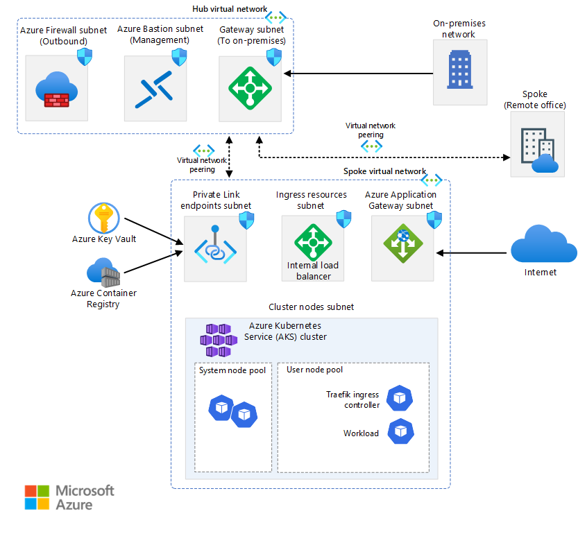
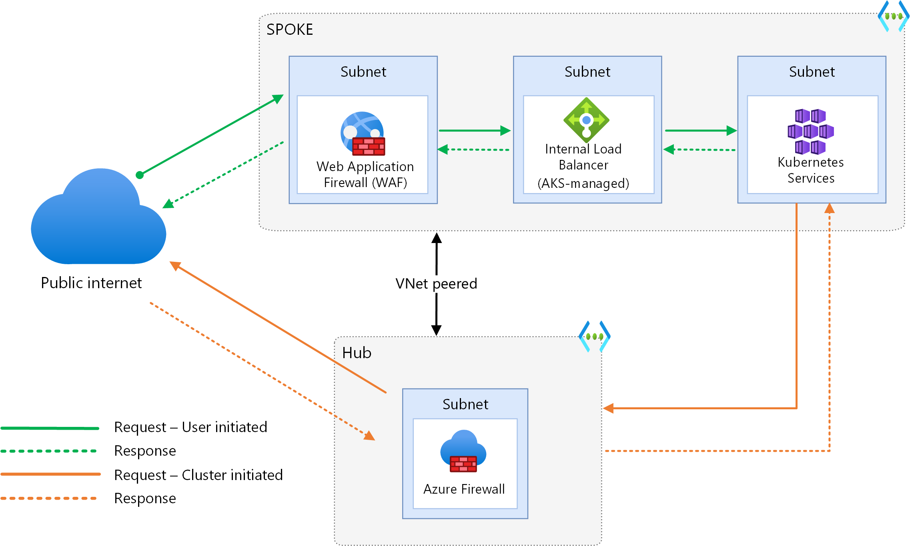
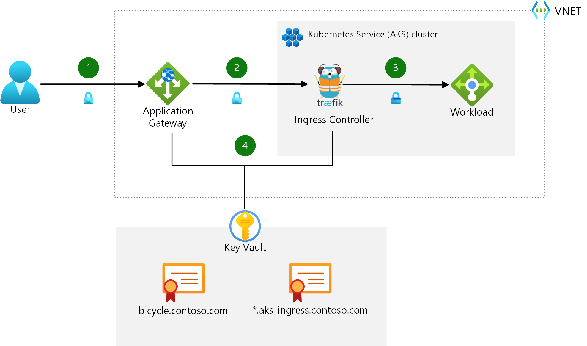
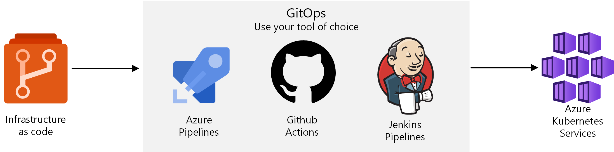
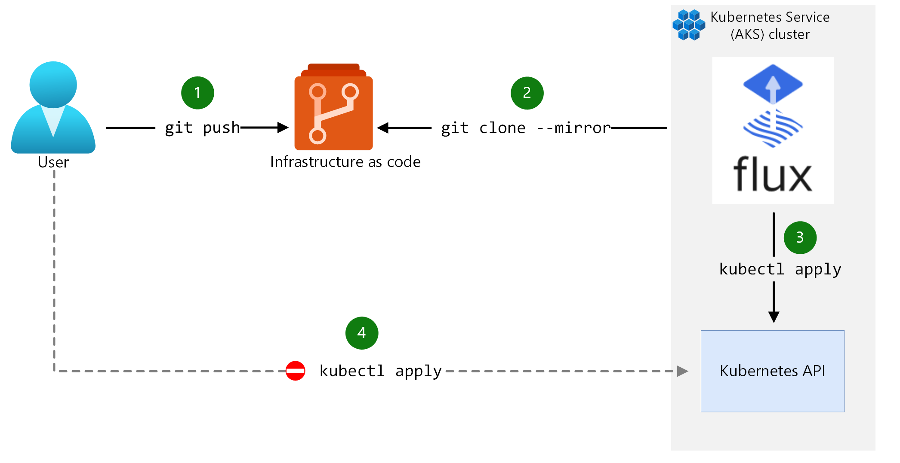

This reference architecture provides a recommended baseline infrastructure architecture to deploy an Azure Kubernetes Service (AKS) cluster on Azure. It uses our design principles and is based on our [architectural best practices](/azure/architecture/framework/services/compute/azure-kubernetes-service/azure-kubernetes-service) from the [Azure Well-Architected Framework](/azure/architecture/framework/) to guide an interdisciplinary or multiple distinct teams like networking, security, and identity through getting this general purpose infrastructure deployed.

This architecture isn't focused on a workload, rather it concentrates on the AKS cluster itself. The information here is the minimum recommended baseline for most AKS clusters. It integrates with Azure services that delivers observability, a network topology that supports multi-regional growth, and secures the in-cluster traffic.

The target architecture is influenced by your business requirements, and as a result it can vary between different application contexts. It should be considered as your starting point for pre-production and production stages.

 An implementation of this architecture is available on [GitHub: Azure Kubernetes Service (AKS) Baseline Reference Implementation](https://github.com/mspnp/aks-baseline). You can use it as a starting point and configure it per your needs.

> [!NOTE]
> This reference architecture requires knowledge of Kubernetes and its concepts. If you need a refresher, see the [**Learn more about AKS**](#learn-more-about-aks) section for resources.

:::row:::
    :::column:::

      #### Networking configuration
      [Network topology](#network-topology)\
      [Plan the IP addresses](#plan-the-ip-addresses)\
      [Deploy Ingress resources](#deploy-ingress-resources)
    :::column-end:::
    :::column:::

      #### Cluster compute
      [Compute for the base cluster](#configure-compute-for-the-base-cluster)\
      [Container image reference](#container-image-reference)\
      [Policy management](#policy-management)
    :::column-end:::
    :::column:::

      #### Identity management
      [Integrate Azure AD for the cluster](#integrate-azure-active-directory-for-the-cluster)\
      [Integrate Azure AD for the workload](#integrate-azure-active-directory-for-the-workload)
    :::column-end:::
:::row-end:::

:::row:::
   :::column:::

      #### Secure data flow
      [Secure the network flow](#secure-the-network-flow)\
      [Add secret management](#add-secret-management)
    :::column-end:::
   :::column:::

      #### Business continuity
      [Scalability](#node-and-pod-scalability)\
      [Cluster and node availability](#business-continuity-decisions)\
      [Availability and multi-region support](#availability-zones-and-multi-region-support)
    :::column-end:::  
    :::column:::

      #### Operations
      [Cluster and workload CI/CD pipelines](#cluster-and-workload-operations-devops)\
      [Cluster health and metrics](#monitor-and-collect-metrics)\
      [Cost management and reporting](#cost-management)
    :::column-end:::
:::row-end:::

## Network topology

This architecture uses a hub-spoke network topology. The hub and spoke(s) are deployed in separate virtual networks connected through [peering](/azure/virtual-network/virtual-network-peering-overview). Some advantages of this topology are:

- Segregated management. Enables a way to apply governance and adhere to the principle of least privilege. It also supports the concept of an [Azure landing zone](/azure/cloud-adoption-framework/ready/landing-zone/) with separation of duties.

- Minimizes direct exposure of Azure resources to the public internet.

- Organizations often operate with regional hub-spoke topologies. Hub-spoke network topologies can be expanded in the future and provide workload isolation.

- All web applications should require a web application firewall (WAF) service to help govern HTTP traffic flow.

- A natural choice for workloads that span multiple subscriptions.

- It makes the architecture extensible. To accommodate new features or workloads, new spokes can be added instead of redesigning the network topology.

- Certain resources, such as a firewall and DNS can be shared across networks.

- Aligns with the [Azure enterprise-scale landing zones](/azure/cloud-adoption-framework/ready/enterprise-scale/implementation).



*Download a [Visio file](https://arch-center.azureedge.net/aks-baseline-architecture.vsdx) of this architecture.*

For more information, see [Hub-spoke network topology in Azure](../../hybrid-networking/hub-spoke.yml).

### Hub

The hub virtual network is the central point of connectivity and observability. A hub always contains an Azure Firewall with global firewall policies defined by your central IT teams to enforce organization wide firewall policy, Azure Bastion, a gateway subnet for VPN connectivity, and Azure Monitor for network observability.

Within the network, three subnets are deployed.

#### Subnet to host Azure Firewall

[Azure Firewall](/azure/firewall/) is firewall as a service. The firewall instance secures outbound network traffic. Without this layer of security, this traffic might communicate with a malicious third-party service that could exfiltrate sensitive company data. [Azure Firewall Manager](/azure/firewall-manager/overview) enables you to centrally deploy and configure multiple Azure Firewall instances and manage Azure Firewall policies for this *hub virtual network* network architecture type.

#### Subnet to host a gateway

This subnet is a placeholder for a VPN or ExpressRoute gateway. The gateway provides connectivity between the routers in your on-premises network and the virtual network.

#### Subnet to host Azure Bastion

This subnet is a placeholder for [Azure Bastion](/azure/bastion/bastion-overview). You can use Bastion to securely access Azure resources without exposing the resources to the internet. This subnet is used for management and operations only.

### Spoke

The spoke virtual network contains the AKS cluster and other related resources. The spoke has four subnets:

#### Subnet to host Azure Application Gateway

Azure [Application Gateway](/azure/application-gateway/overview) is a web traffic load balancer operating at Layer 7. The reference implementation uses the Application Gateway v2 SKU that enables [Web Application Firewall](/azure/application-gateway/waf-overview) (WAF). WAF secures incoming traffic from common web traffic attacks, including bots. The instance has a public frontend IP configuration that receives user requests. By design, Application Gateway requires a dedicated subnet.

#### Subnet to host the ingress resources

To route and distribute traffic, [Traefik](https://doc.traefik.io/traefik/) is the ingress controller that is going to fulfill the Kubernetes ingress resources. The Azure internal load balancers exist in this subnet. For more information, see [Use an internal load balancer with Azure Kubernetes Service (AKS)](/azure/aks/internal-lb).

#### Subnet to host the cluster nodes

AKS maintains two separate groups of nodes (or node pools). The *system node pool* hosts pods that run core cluster services. The *user node pool* runs your workload and the ingress controller to enable inbound communication to the workload.

#### Subnet to host Private Link endpoints

Azure Private Link connections are created for the [Azure Container Registry](/azure/container-registry/) and [Azure Key Vault](/azure/key-vault/general/overview), so these services can be accessed using [private endpoint](/azure/private-link/private-endpoint-overview) within the spoke virtual network. Private endpoints don't require a dedicated subnet and can also be placed in the hub virtual network. In the baseline implementation, they're deployed to a dedicated subnet within the spoke virtual network. This approach reduces traffic passing the peered network connection, keeps the resources that belong to the cluster in the same virtual network, and allows you to apply granular security rules at the subnet level using network security groups.

For more information, see [Private Link deployment options](../../../guide/networking/private-link-hub-spoke-network.yml#decision-tree-for-private-link-deployment).

## Plan the IP addresses


*Download a [Visio file](https://arch-center.azureedge.net/aks-baseline_network_topology.vsdx) of this architecture.*

The address space of the virtual network should be large enough to hold all subnets. Account for all entities that will receive traffic. IP addresses for those entities will be allocated from the subnet address space. Consider these points.

- Upgrade

    AKS updates nodes regularly to make sure the underlying virtual machines are up to date on security features and other system patches. During an upgrade process, AKS creates a node that temporarily hosts the pods, while the upgrade node is cordoned and drained. That temporary node is assigned an IP address from the cluster subnet.

    For pods, you might need additional addresses depending on your strategy. For rolling updates, you'll need addresses for the temporary pods that run the workload while the actual pods are updated. If you use the replace strategy, pods are removed, and the new ones are created. So, addresses associated with the old pods are reused.

- Scalability

    Take into consideration the node count of all system and user nodes and their maximum scalability limit. Suppose you want to scale out by 400%. You'll need four times the number of addresses for all those scaled-out nodes.

    In this architecture, each pod can be contacted directly. So, each pod needs an individual address. Pod scalability will impact the address calculation. That decision will depend on your choice about the number of pods you want to grow.

- Azure Private Link addresses

    Factor in the addresses that are required for communication with other Azure services over Private Link. In this architecture, we have two addresses assigned for the links to Azure Container Registry and Key Vault.

- [Certain addresses are reserved](/azure/virtual-network/virtual-networks-faq#are-there-any-restrictions-on-using-ip-addresses-within-these-subnets) for use by Azure. They can't be assigned.

The preceding list isn't exhaustive. If your design has other resources that will impact the number of available IP addresses, accommodate those addresses.

This architecture is designed for a single workload. For multiple workloads, you might want to isolate the user node pools from each other and from the system node pool. That choice results in more subnets that are smaller in size. Also, the ingress resource might be more complex, and as a result you might need multiple ingress controllers that requires extra IP addresses.

For the complete set of considerations for this architecture, see [AKS baseline Network Topology](https://github.com/mspnp/aks-secure-baseline/blob/main/networking/topology.md).

For information related to planning IP for an AKS cluster, see [Plan IP addressing for your cluster](/azure/aks/configure-azure-cni#plan-ip-addressing-for-your-cluster).

## Add-ons and preview features

Kubernetes and AKS are continuously-evolving products, with faster release cycles than software for on-premises environments. This baseline architecture depends on select AKS preview features and AKS add-ons. The difference between the two are the following:

- AKS team describes preview features as *shipped and improving*. The reason behind that is that many of the preview features stay in that state for only a few months before moving to general release (GA) phase.
- AKS [add-ons and extensions](/azure/aks/integrations#add-ons) provide additional, supported functionality. Their installation, configuration, and lifecycle is managed by AKS.

This baseline architecture doesn't include every preview feature or add-on, instead only those that add significant value to a general-purpose cluster are included. As these features come out of preview, this baseline architecture will be revised accordingly. There are some additional preview features or AKS add-ons you might want to evaluate in pre-production clusters that augment your security, manageability, or other requirements. With third-party add-ons, you need to install and maintain them, including tracking available versions and installing updates after upgrading a cluster's Kubernetes version.

## Container image reference

In addition to the workload, the cluster might contain several other images, such as the ingress controller. Some of those images might reside in public registries. Consider these points when pulling them into your cluster.

- The cluster is authenticated to pull the image.
- If you're using a public image, consider importing it into your container registry that aligns with your SLO. Otherwise, the image might be subject to unexpected availability issues. Those issues can cause operational issues if the image isn't available when you need it. Here are some benefits of using your container registry instead of a public registry:
  - You can block unauthorized access to your images.
  - You won't have public facing dependencies.
  - You can access image pull logs to monitor activities and triage connectivity issues.
  - Take advantage of integrated container scanning and image compliance.

  An option is Azure Container Registry (ACR).

- Pull images from authorized registries. You can enforce this restriction through Azure Policy. In this reference implementation, the cluster only pulls images from ACR that is deployed as part of the architecture.

## Configure compute for the base cluster

In AKS, each node pool maps to a Virtual Machine Scale Set. Nodes are VMs in each node pool. Consider using a smaller VM size for the system node pool to minimize costs. This reference implementation deploys the system node pool with three DS2_v2 nodes. That size is sufficient to meet the expected load of the system pods. The OS disk is 512 GB.

For the user node pool, here are some considerations:

- Choose larger node sizes to pack the maximum number of pods set on a node. It will minimize the footprint of services that run on all nodes, such as monitoring and logging.

- Deploy at least two nodes. That way, the workload will have a high availability pattern with two replicas. With AKS, you can change the node count without recreating the cluster.

- Actual node sizes for your workload will depend on the requirements determined by the design team. Based on the business requirements, we've chosen DS4_v2 for the production workload. To lower costs one could drop the size to DS3_v2, which is the minimum recommendation.

- When planning capacity for your cluster, assume that your workload can consume up to 80% of each node; the remaining 20% is reserved for AKS services.

- Set the maximum pods per node based on your capacity planning. If you are trying to establish a capacity baseline, start with a value of 30. Adjust that value based on the requirements of the workload, the node size, and your IP constraints.

## Integrate Azure Active Directory for the cluster

Securing access to and from the cluster is critical. Think from the cluster's perspective when you're making security choices:

-   *Inside-out access*. AKS access to Azure components such as networking infrastructure, Azure Container Registry, and Azure Key Vault. Authorize only those resources that the cluster is allowed access.
-   *Outside-in access*. Providing identities access to the Kubernetes cluster. Authorize only those external entities that are allowed access to the Kubernetes API server and Azure Resource Manager.

### AKS access to Azure

There are two ways to manage AKS to Azure access through Azure Active Directory (Azure AD): *service principals* or *managed identities for Azure resources*.

Of the two ways, managed identities is recommended. With service principals, you are responsible for managing and rotating secrets, either manually or programmatically. With managed identities, Azure AD manages and performs the authentication and timely rotation of secrets for you.

It's recommended that [managed identities is enabled](/azure/aks/use-managed-identity#summary-of-managed-identities) so that the cluster can interact with external Azure resources through Azure AD. You can enable this setting only during cluster creation. Even if Azure AD isn't used immediately, you can incorporate it later.

By default, there are two primary [identities](/azure/aks/use-managed-identity#summary-of-managed-identities) used by the cluster, the *cluster identity* and the *kubelet identity*. The *cluster identity* is used by the AKS control plane components to manage cluster resources including ingress load balancers, AKS managed public IPs, etc. The *kubelet identity* is used to authenticate with Azure Container Registry (ACR). Some add-ons also support authentication using a managed identity.

As an example for the inside-out case, let's study the use of managed identities when the cluster needs to pull images from a container registry. This action requires the cluster to get the credentials of the registry. One way is to store that information in the form of Kubernetes Secrets object and use `imagePullSecrets` to retrieve the secret. That approach isn't recommended because of security complexities. Not only do you need prior knowledge of the secret but also disclosure of that secret through the DevOps pipeline. Another reason is the operational overhead of managing the rotation of the secret. Instead, grant `acrPull` access to the kubelet managed identity of the cluster to your registry. This approach addresses those concerns.

In this architecture, the cluster accesses Azure resources that are secured by Azure AD and perform operations that support managed identities. Assign Azure role-based access control (Azure RBAC) and permissions to the cluster's managed identities, depending on the operations that the cluster intends to do. The cluster authenticates itself to Azure AD and then be allowed or denied access based on the roles it has been assigned. Here are some examples from this reference implementation where Azure built-in roles have been assigned to the cluster:

- [Network Contributor](/azure/role-based-access-control/built-in-roles#network-contributor). The cluster's ability to control the spoke virtual network. This role assignment allows AKS cluster system assigned identity to work with the dedicated subnet for the Internal Ingress Controller services.
- [Monitoring Metrics Publisher](/azure/role-based-access-control/built-in-roles#monitoring-metrics-publisher). The cluster's ability to send metrics to Azure Monitor.
- [AcrPull](/azure/role-based-access-control/built-in-roles#acrpull). The cluster's ability to pull images from the specified Azure Container Registries.

### Cluster access

Azure AD integration also simplifies security for outside-in access. Suppose a user wants to use kubectl. As an initial step, they run the `az aks get-credentials` command to get the credentials of the cluster. Azure AD will authenticate the user's identity against the Azure roles that are allowed to get cluster credentials. For more information, see [Available cluster roles permissions](/azure/aks/control-kubeconfig-access#available-cluster-roles-permissions).

AKS allows for Kubernetes access using Azure Active Directory in two ways. The first is using Azure Active Directory as an identity provider integrated with the native Kubernetes RBAC system. The other is using native Azure RBAC to control cluster access. Both are detailed below.

#### Associate Kubernetes RBAC to Azure Active Directory

Kubernetes supports role-based access control (RBAC) through:

- A set of permissions. Defined by a `Role` or `ClusterRole` object for cluster-wide permissions.

- Bindings that assign users and groups who are allowed to do the actions. Defined by a `RoleBinding` or `CluserRoleBinding` object.

Kubernetes has some built-in roles such as cluster-admin, edit, view, and so on. Bind those roles to Azure Active Directory users and groups to use enterprise directory to manage access. For more information, see [Use Kubernetes RBAC with Azure AD integration](/azure/aks/azure-ad-rbac).

Be sure your Azure AD groups used for cluster and namespace access are included in your [Azure AD access reviews](/azure/active-directory/governance/access-reviews-overview).

#### Use Azure RBAC for Kubernetes authorization

Instead of using Kubernetes native RBAC ([ClusterRoleBindings and RoleBindings](https://kubernetes.io/docs/reference/access-authn-authz/rbac/#rolebinding-and-clusterrolebinding)) for authorization with integrated Azure AD authentication, another option that we recommend, is to use Azure RBAC and Azure role assignments to enforce authorization checks on the cluster. These role assignments can even be added at the subscription or resource group scopes so that all clusters under the scope inherit a consistent set of role assignments with respect to who has permissions to access the objects on the Kubernetes cluster.

For more information, see [Azure RBAC for Kubernetes Authorization](/azure/aks/manage-azure-rbac).

#### Local accounts

AKS supports native [Kubernetes user authentication](https://kubernetes.io/docs/reference/access-authn-authz/authentication/#users-in-kubernetes). User access to clusters using this method is not suggested. It is certificate-based and is performed external to your primary identity provider; making centralized user access control and governance difficult. Always manage access to your cluster using Azure Active Directory, and configure your cluster to explicitly disable local account access.

In this reference implementation, access via local cluster accounts is explicitly disabled when the cluster is deployed.

## Integrate Azure Active Directory for the workload

Similar to having an Azure system-assigned managed identity for the entire cluster, you can assign managed identities at the pod level. A workload identity allows the hosted workload to access resources through Azure Active Directory. For example, the workload stores files in Azure Storage. When it needs to access those files, the pod will authenticate itself against the resource as an Azure managed identity.

In this reference implementation, managed identities for pods is provided through [Azure AD workload identity on AKS](/azure/aks/workload-identity-overview). This integrates with the Kubernetes native capabilities to federate with external identity providers. For more information about Azure AD workload identity federation, see the following [overview](/azure/active-directory/develop/workload-identity-federation).

## Deploy Ingress resources

Kubernetes Ingress resources route and distribute incoming traffic to the cluster. There are two portions of Ingress resources:

- Internal load balancer. Managed by AKS. This load balancer exposes the ingress controller through a private static IP address. It serves as single point of contact that receives inbound flows.

    In this architecture, Azure Load Balancer is used. It's placed outside the cluster in a subnet dedicated for ingress resources. It receives traffic from Azure Application Gateway and that communication is over TLS. For information about TLS encryption for inbound traffic, see [Ingress traffic flow](#ingress-traffic-flow).

- Ingress controller. We have chosen Traefik. It runs in the user node pool in the cluster. It receives traffic from the internal load balancer, terminates TLS, and forwards it to the workload pods over HTTP.

The ingress controller is a critical component of cluster. Consider these points when configuring this component.

- As part of your design decisions, choose a scope within which the ingress controller will be allowed operate. For example, you might allow the controller to only interact with the pods that run a specific workload.

- Avoid placing replicas on the same node to spread out the load and ensure business continuity if a node does down. Use `podAntiAffinity` for this purpose.

- Constrain pods to be scheduled only on the user node pool by using `nodeSelectors`. This setting will isolate workload and system pods.

- Open ports and protocols that allow specific entities to send traffic to the ingress controller. In this architecture, Traefik only receives traffic from Azure Application Gateway.

- Ingress controller should send signals that indicate the health of pods. Configure `readinessProbe` and `livenessProbe` settings that will monitor the health of the pods at the specified interval.

- Consider restricting the ingress controller's access to specific resources and the ability to perform certain actions. That restriction can be implemented through Kubernetes RBAC permissions. For example, in this architecture, Traefik has been granted permissions to watch, get, and list services and endpoints by using rules in the Kubernetes `ClusterRole` object.

> [!NOTE]
> The choice for the appropriate ingress controller is driven by the requirements the workload, the skill set of the operator, and the supportability of the technology options. Most importantly, the ability to meet your SLO expectation.
>
> Traefik is a popular open-source option for a Kubernetes cluster and is chosen in this architecture for _illustrative_ purposes. It shows third-party product integration with Azure services. For example, the implementation shows how to integrate Traefik with Azure AD workload identity and Azure Key Vault.
>
> Another choice is Azure Application Gateway Ingress Controller, and it's well integrated with AKS. Apart from its capabilities as an ingress controller, it offers other benefits. For example, Application Gateway acts as the virtual network entry point of your cluster. It can observe traffic entering the cluster. If you have an application that requires WAF, Application Gateway is a good choice because it's integrated with WAF. Also, it provides the opportunity to do TLS termination.

### Router settings

The ingress controller uses routes to determine where to send traffic. Routes specify the source port at which the traffic is received and information about the destination ports and protocols.

Here's an example from this architecture:

Traefik uses the Kubernetes provider to configure routes. The `annotations`, `tls`, and `entrypoints` indicate that routes will be served over HTTPS. The `middlewares` specifies that only traffic from the Azure Application Gateway subnet is allowed. The responses will use gzip encoding if the client accepts. Because Traefik does TLS termination, communication with the backend services is over HTTP.

```yaml
apiVersion:networking.k8s.io/v1
kind: Ingress
metadata:
  name: aspnetapp-ingress
  namespace: a0008
  annotations:
    kubernetes.io/ingress.allow-http: "false"
    kubernetes.io/ingress.class: traefik-internal
    traefik.ingress.kubernetes.io/router.entrypoints: websecure
    traefik.ingress.kubernetes.io/router.tls: "true"
    traefik.ingress.kubernetes.io/router.tls.options: default
    traefik.ingress.kubernetes.io/router.middlewares: app-gateway-snet@file, gzip-compress@file
spec:
  tls:
  - hosts:
      - bu0001a0008-00.aks-ingress.contoso.com
  rules:
  - host: bu0001a0008-00.aks-ingress.contoso.com
    http:
      paths:
      - path: /
        pathType: Prefix
        backend:
          service:
            name: aspnetapp-service
            port: 
              number: 80
```

## Secure the network flow

Network flow, in this context, can be categorized as:

- **Ingress traffic**. From the client to the workload running in the cluster.

- **Egress traffic**. From a pod or node in the cluster to an external service.

- **Pod-to-pod traffic**. Communication between pods. This traffic includes communication between the ingress controller and the workload. Also, if your workload is composed of multiple applications deployed to the cluster, communication between those applications would fall into this category.

- **Management traffic**. Traffic that goes between the client and the Kubernetes API server.



*Download a [Visio file](https://arch-center.azureedge.net/secure-baseline-aks-traffic-flow.vsdx) of this architecture.*

This architecture has several layers of security to secure all types of traffic.

### Ingress traffic flow

The architecture only accepts TLS encrypted requests from the client. TLS v1.2 is the minimum allowed version with a restricted set of cyphers. Server Name Indication (SNI) strict is enabled. End-to-end TLS is set up through Application Gateway by using two different TLS certificates, as shown in this image.



*Download a [Visio file](https://arch-center.azureedge.net/secure-baseline-aks-tls-termination.vsdx) of this architecture.*

1. The client sends an HTTPS request to the domain name: bicycle.contoso.com. That name is associated with through a DNS A record to the public IP address of Azure Application Gateway. This traffic is encrypted to make sure that the traffic between the client browser and gateway cannot be inspected or changed.

2. Application Gateway has an integrated web application firewall (WAF) and negotiates the TLS handshake for bicycle.contoso.com, allowing only secure ciphers. Application Gateway is a TLS termination point, as it's required to process WAF inspection rules, and execute routing rules that forward the traffic to the configured backend. The TLS certificate is stored in Azure Key Vault. It's accessed using a user-assigned managed identity integrated with Application Gateway. For information about that feature, see [TLS termination with Key Vault certificates](/azure/application-gateway/key-vault-certs).

3. As traffic moves from Application Gateway to the backend, it's encrypted again with another TLS certificate (wildcard for \*.aks-ingress.contoso.com) as it's forwarded to the internal load balancer. This re-encryption makes sure traffic that is not secure doesn't flow into the cluster subnet.

4. The ingress controller receives the encrypted traffic through the load balancer. The controller is another TLS termination point for \*.aks-ingress.contoso.com and forwards the traffic to the workload pods over HTTP. The certificates are stored in Azure Key Vault and mounted into the cluster using the Container Storage Interface (CSI) driver. For more information, see [Add secret management](#add-secret-management).

You can implement end-to-end TLS traffic all at every hop the way through to the workload pod. Be sure to measure the performance, latency, and operational impact when making the decision to secure pod-to-pod traffic. For most single-tenant clusters, with proper control plane RBAC and mature Software Development Lifecycle practices, it's sufficient to TLS encrypt up to the ingress controller and protect with Web Application Firewall (WAF). That will minimize overhead in workload management and network performance impacts. Your workload and compliance requirements will dictate where you perform [TLS termination](/azure/application-gateway/ssl-overview#tls-termination).

### Egress traffic flow

In this architecture, we recommend all egress traffic from the cluster communicating through Azure Firewall or your own similar network virtual appliance, over other options such as [NAT Gateway](/azure/virtual-network/nat-gateway/nat-gateway-resource) or [HTTP proxy](/azure/aks/http-proxy). For zero-trust control and the ability to inspect traffic, all egress traffic from the cluster moves through Azure Firewall. You can implement that choice using user-defined routes (UDRs). The next hop of the route is the [private IP address](/azure/virtual-network/virtual-network-ip-addresses-overview-arm#private-ip-addresses) of the Azure Firewall. Here, Azure Firewall decides whether to block or allow the egress traffic. That decision is based on the specific rules defined in the Azure Firewall or the built-in threat intelligence rules.

An alternative to using Azure Firewall is to utilize AKS's [HTTP Proxy](/azure/aks/http-proxy) feature. All traffic egressing the cluster is set first to the IP address of the HTTP Proxy, which decides to forward the traffic or drop it.

With either method, review the required [egress network rules](/azure/aks/limit-egress-traffic) for AKS.

> [!NOTE]
> If you use a public load balancer as your public point for ingress traffic and egress through Azure Firewall using UDRs, you might see an [asymmetric routing situation](/azure/aks/limit-egress-traffic#add-a-dnat-rule-to-azure-firewall). This architecture uses *internal* load balancers in a dedicated ingress subnet behind the Application Gateway. This design choice not only enhances security, but also eliminates asymmetric routing concerns. Alternatively, you could route ingress traffic through your Azure Firewall before or after your Application Gateway, however this approach isn't necessary or recommended for most situations.
> For more information about asymmetric routing, see [Integrate Azure Firewall with Azure Standard Load Balancer](/azure/firewall/integrate-lb#asymmetric-routing).

An exception to the zero-trust control is when the cluster needs to communicate with other Azure resources. For instance, the cluster needs to pull an updated image from the container registry, or secrets from Azure Key Vault. The recommended approach is by using [Azure Private Link](/azure/private-link/private-link-overview). The advantage is that specific subnets reach the service directly instead of the traffic between the cluster and the services going over the internet. A downside is that Private Link needs additional configuration instead of using the target service over its public endpoint. Also, not all Azure services or SKUs support Private Link. For those cases, consider enabling a [Virtual Network service endpoint](/azure/virtual-network/virtual-network-service-endpoints-overview) on the subnet to access the service.

If Private Link or service endpoints aren't an option, you can reach other services through their public endpoints, and control access through Azure Firewall rules and the firewall built into the target service. Because this traffic will go through the static IP addresses of the firewall, those addresses can be added the service's IP allowlist. One downside is that Azure Firewall needs to have additional rules to make sure only traffic from a specific subnet is allowed. Factor in those addresses when you're planning multiple IP addresses for egress traffic with Azure Firewall, otherwise you could reach port exhaustion. For more information about multiple IP address planning, see [Restrict and control outbound traffic](/azure/aks/limit-egress-traffic#restrict-egress-traffic-using-azure-firewall).

### Pod-to-pod traffic

By default, a pod can accept traffic from any other pod in the cluster. Kubernetes `NetworkPolicy` is used to restrict network traffic between pods. Apply policies judiciously, otherwise you might have a situation where a critical network flow is blocked. *Only* allow specific communication paths, as needed, such as traffic between the ingress controller and workload. For more information, see [Network policies](/azure/aks/use-network-policies).

Enable network policy when the cluster is provisioned because it can't be added later. There are a few choices for technologies that implement `NetworkPolicy`. Azure Network Policy is recommended, which requires Azure Container Networking Interface (CNI), see the note below. Other options include Calico Network Policy, a well-known open-source option. Consider Calico if you need to manage cluster-wide network policies. Calico isn't covered under standard Azure support.

For more information, see [Differences between Azure Network Policy and Calico policies and their capabilities](/azure/aks/use-network-policies#differences-between-azure-and-calico-policies-and-their-capabilities).

> [!NOTE]
> AKS supports these networking models: kubenet, Azure Container Networking Interface (CNI), and Azure CNI Overlay. The CNI models are the more advanced models and a CNI-based model is required for enabling Azure Network Policy. In the non-overlay CNI model, every pod gets an IP address from the subnet address space. Resources within the same network (or peered resources) can access the pods directly through their IP address. NAT isn't needed for routing that traffic. Both CNI models are highly performant, with performance between pods on par with virtual machines in a virtual network. Azure CNI also offers enhanced security control because it enables the use Azure Network Policy. It's recommended that Azure CNI Overlay be used for IP address constrained deployments, which only allocates IP addressess from the nodepool subnet(s) for the nodes and uses a highly optimized overlay layer for pod IPs. A CNI-based networking model is recommended.
> 
> For information about the models, see [Choosing a CNI network model to use](/azure/aks/azure-cni-overlay#choosing-a-network-model-to-use) and [Compare kubenet and Azure CNI network models](/azure/aks/concepts-network#compare-network-models).

### Management traffic

As part of running the cluster, the Kubernetes API server will receive traffic from resources that want to do management operations on the cluster, such as requests to create resources or the scale the cluster. Examples of those resources include the build agent pool in a DevOps pipeline, a Bastion subnet, and node pools themselves. Instead of accepting this management traffic from all IP addresses, use AKS's Authorized IP Ranges feature to only allow traffic from your authorized IP ranges to the API server.

For more information, see [Define API server authorized IP ranges](/azure/aks/api-server-authorized-ip-ranges).

For an additional layer of control, at the cost of additional complexity, you can provision a private AKS cluster. By using a private cluster, you can ensure network traffic between your API server and your node pools remains on the private network only, it is not exposed to the internet. For more information, see [AKS Private Clusters](/azure/aks/private-clusters).

## Add secret management

Store secrets in a managed key store, such as Azure Key Vault. The advantage is that the managed store handles rotation of secrets, offers strong encryption, provides an access audit log, and keeps core secrets out of the deployment pipeline. In this architecture, Azure Key Vault firewall is enabled and configured with private link connections to the resources in Azure that need to access secrets and certificates.

Azure Key Vault is well integrated with other Azure services. Use the built-in feature of those services to access secrets. For an example about how Azure Application Gateway accesses TLS certificates for the ingress flow, see the [Ingress traffic flow](#ingress-traffic-flow) section.

The Azure RBAC permission model for Key Vault allows you to assign the workload identities to either the **Key Vault Secrets User** or **Key Vault Reader** role assignment, and access the secrets. For more information, see [Access Azure Key Vault using RBAC](/azure/key-vault/general/rbac-guide).

### Accessing cluster secrets

You'll need to use workload identities to allow a pod to access secrets from a specific store. To facilitate the retrieval process, use a [Secrets Store CSI driver](https://github.com/kubernetes-sigs/secrets-store-csi-driver). When the pod needs a secret, the driver connects with the specified store, retrieves secret on a volume, and mounts that volume in the cluster. The pod can then get the secret from the volume file system.

The CSI driver has many providers to support various managed stores. In this implementation, we've chosen the [Azure Key Vault with Secrets Store CSI Driver](/azure/aks/csi-secrets-store-driver) using the add-on to retrieve the TLS certificate from Azure Key Vault and load it in the pod running the ingress controller. It's done during pod creation and the volume stores both public and the private keys.

## Workload storage

The workload used in this architecture is stateless. If you need to store state, persisting it outside the cluster is recommended. Guidance for workload state is outside the scope of this article.

To learn more about storage options, see [Storage options for applications in Azure Kubernetes Service (AKS)](/azure/aks/concepts-storage).

## Policy management

An effective way to manage an AKS cluster is by enforcing governance through policies. Kubernetes implements policies through OPA Gatekeeper. For AKS, policies are delivered through Azure Policy. Each policy is applied to all clusters in its scope. Azure Policy enforcement is ultimately handled by OPA Gatekeeper in the cluster and all policy checks are logged. Policy changes are not immediately reflected in your cluster, expect to see some delays.

There are two different scenarios that Azure Policy delivers for managing your AKS clusters:

* Preventing or restricting deployment of AKS clusters in a resource group or subscription by evaluating your organizations standards. For example, follow a naming convention, specify a tag, etc.
* Secure your AKS cluster through Azure Policy for Kubernetes.

When setting policies, apply them based on the requirements of the workload. Consider these factors:

- Do you want to set a collection of policies (called initiatives) or choose individual policies? Azure Policy provides two built-in initiatives: basic and restricted. Each initiative is a collection of built-in policies applicable to an AKS cluster. It's recommended that you select an initiative *and* pick and choose additional policies for the cluster and the resources (ACR, Application Gateway, Key Vault, and others) that interact with the cluster, as per the requirements of your organization.

- Do you want to **Audit** or **Deny** the action? In **Audit** mode, the action is allowed but it's flagged as **Non-Compliant**. Have processes to check non-compliant states at a regular cadence and take necessary action. In **Deny** mode, the action is blocked because it violates the policy. Be careful in choosing this mode because it can be too restrictive for the workload to function.

- Do you have areas in your workload that shouldn't be compliant by design? Azure Policy has the capability to specify Kubernetes namespaces which are exempt from policy enforcement. It's recommended that still apply policies in **Audit** mode so that you're aware of those instances.

- Do you have requirements that are not covered by the built-in policies? You can create a custom Azure Policy definition that applies your custom OPA Gatekeeper policies. Don't apply custom policies directly to the cluster. To learn more about creating custom policies, see [Create and assign custom policy definitions](/azure/aks/use-azure-policy#create-and-assign-a-custom-policy-definition-preview).

- Do you have organization-wide requirements? If so, add those policies at the management group level. Your cluster should also assign its own workload-specific policies, even if the organization has generic policies.

- Azure policies are assigned to specific scopes. Ensure the *production* policies are also validated against your *pre-production* environment. Otherwise, when deploying to your production environment, you might run into unexpected additional restrictions that weren't accounted for in pre-production.

In this reference implementation, Azure Policy is enabled when the AKS cluster is created and assigns the restrictive initiative in **Audit** mode to gain visibility into non-compliance.

The implementation also sets additional policies that are not part of any built-in initiatives. Those policies are set in **Deny** mode. For example, there is a policy in place to make sure images are only pulled from the deployed ACR. Consider creating your own custom initiatives. Combine the policies that are applicable for your workload into a single assignment.

To observe how Azure Policy is functioning from within your cluster, you can access the pod logs for all pods in the `gatekeeper-system` namespace as well as the logs for the `azure-policy` and `azure-policy-webhook` pods in the `kube-system` namespace.

## Node and pod scalability

With increasing demand, Kubernetes can scale out by adding more pods to existing nodes, through horizontal pod autoscaling (HPA). When additional pods can no longer be scheduled, the number of nodes must be increased through AKS cluster autoscaling. A complete scaling solution must have ways to scale both pod replicas and the node count in the cluster.

There are two approaches: autoscaling or manual scaling.

The manual or programmatic way requires you to monitor and set alerts on CPU utilization or custom metrics. For pod scaling, the application operator can increase or decrease the number of pod replicas by adjusting the `ReplicaSet` through Kubernetes APIs. For cluster scaling, one way is to get notified when the Kubernetes scheduler fails. Another way is to watch for pending pods over time. You can adjust the node count through Azure CLI or the portal.

Autoscaling is the approach because some of those manual mechanisms are built into the autoscaler.

As a general approach, start by performance testing with a minimum number of pods and nodes. Use those values to establish the baseline expectation. Then use a combination of performance metrics and manual scaling to locate bottlenecks and understand the application's response to scaling. Finally, use this data to set the parameters for autoscaling. For information about a performance tuning scenario using AKS, see [Performance tuning scenario: Distributed business transactions](../../../performance/distributed-transaction.yml).

### Horizontal Pod Autoscaler

The [Horizontal Pod Autoscaler](https://kubernetes.io/docs/tasks/run-application/horizontal-pod-autoscale/) (HPA) is a Kubernetes resource that scales the number of pods.

In the HPA resource, setting the minimum and maximum replica count is recommended. Those values constrain the autoscaling bounds.

HPA can scale based on the CPU utilization, memory usage, and custom metrics. Only CPU utilization is provided out of the box. The HorizontalPodAutoscaler definition specifies target values for those metrics. For instance, the spec sets a target CPU utilization. While pods are running, the HPA controller uses Kubernetes Metrics API to check each pod's CPU utilization. It compares that value against the target utilization and calculates a ratio. It then uses the ratio to determine whether pods are overallocated or underallocated. It relies on the Kubernetes scheduler to assign new pods to nodes or remove pods from nodes.

There might be a race condition where (HPA) checks before a scaling operation is complete. The outcome might be an incorrect ratio calculation. For details, see [Cooldown of scaling events](/azure/aks/concepts-scale#cooldown-of-scaling-events).

If your workload is event-driven, a popular open-source option is [KEDA](https://github.com/kedacore/keda). Consider KEDA if your workload is driven by an event source, such as message queue, rather than being CPU- or memory-bound. KEDA supports many event sources (or scalers). You can find the list of supported KEDA scalers [here](https://keda.sh/#scalers) including the [Azure Monitor scaler](https://keda.sh/docs/latest/scalers/azure-monitor/); a convenient way to scale KEDA workloads based on Azure Monitor metrics.

### Cluster autoscaler

The [cluster autoscaler](/azure/aks/cluster-autoscaler) is an AKS add-on component that scales the number of nodes in a node pool. It should be added during cluster provisioning. You need a separate cluster autoscaler for each user node pool.

The cluster autoscaler is triggered by the Kubernetes scheduler. When the Kubernetes scheduler fails to schedule a pod because of resource constraints, the autoscaler automatically provisions a new node in the node pool. Conversely, the cluster autoscaler checks the unused capacity of the nodes. If the node is not running at an expected capacity, the pods are moved to another node, and the unused node is removed.

When you enable autoscaler, set the maximum and minimum node count. The recommended values depend on the performance expectation of the workload, how much you want the cluster to grow, and cost implications. The minimum number is the reserved capacity for that node pool. In this reference implementation, the minimum value is set to 2 because of the simple nature of the workload.

For the system node pool, the recommended minimum value is 3.

## Business continuity decisions

To maintain business continuity, define the Service Level Agreement for the infrastructure and your application. For information about monthly uptime calculation, see [SLA for Azure Kubernetes Service (AKS)](https://azure.microsoft.com/support/legal/sla/kubernetes-service/v1_1/).

### Cluster nodes

To meet the minimum level of availability for workloads, multiple nodes in a node pool are needed. If a node goes down, another node in the node pool in the same cluster can continue running the application. For reliability, three nodes are recommended for the system node pool. For the user node pool, start with no less than two nodes. If you need higher availability, provision more nodes.

Isolate your application(s) from the system services by placing it in a separate node pool, referred to as a user node pool. This way, Kubernetes services run on dedicated nodes and don't compete with your workload. Use of tags, labels, and taints is recommended to identify the node pool to schedule your workload, and ensure your system node pool is tainted with the **CriticalAddonsOnly** [taint]
(/azure/aks/use-system-pools#system-and-user-node-pools).

Regular upkeep of your cluster such as timely updates is crucial for reliability. Also monitoring the health of the pods through probes is recommended.

### Pod availability

**Ensure pod resources**. It's highly recommended that deployments specify pod resource requirements. The scheduler can then appropriately schedule the pod. Reliability will significantly deprecate if pods cannot be scheduled.

**Set pod disruption budgets**. This setting determines how many replicas in a deployment can come down during an update or upgrade event. For more information, see [Pod disruption budgets](/azure/aks/operator-best-practices-scheduler#plan-for-availability-using-pod-disruption-budgets).

Configure multiple replicas in the deployment to handle disruptions such as hardware failures. For planned events such as updates and upgrades, a disruption budget can ensure the required number of pod replicas exist to handle expected application load.

**Set resource quotas on the workload namespaces**. The resource quota on a namespace will ensure pod requests and limits are properly set on a deployment. For more information, see [Enforce resource quotas](/azure/aks/operator-best-practices-scheduler#enforce-resource-quotas).

> [!NOTE]
> Setting resources quotas at the cluster level can cause problem when deploying third-party workloads that do not have proper requests and limits.

**Set pod requests and limits**. Setting these limits allows Kubernetes to efficiently allocate CPU and/or memory resources to the pods and have higher container density on a node. Limits can also increase reliability with reduced costs because of better hardware utilization.

To estimate the limits, test and establish a baseline. Start with equal values for requests and limits. Then, gradually tune those values until you have established a threshold that can cause instability in the cluster.

Those limits can be specified in your deployment manifests. For more information, see [Set pod requests and limits](/azure/aks/developer-best-practices-resource-management#define-pod-resource-requests-and-limits).

### Availability zones and multi-region support

If your SLA requires a higher uptime, protect against outages by using [availability zones](/azure/aks/availability-zones). You can use availability zones if the region supports them. Both the control plane components and the nodes in the node pools are then able to spread across zones. If an entire zone is unavailable, a node in another zone within the region is still available. Each node pool maps to a separate Virtual Machine Scale Set, which manages node instances and scalability. Scale set operations and configuration are managed by the AKS service. Here are some considerations when enabling multizone:

- **Entire infrastructure.** Choose a region that supports availability zones. For more information, see [Limitations and region availability](/azure/aks/availability-zones#limitations-and-region-availability). If you want to buy an Uptime SLA, choose a region that supports that option. The Uptime SLA is greater when using availability zones.

- **Cluster**. Availability zones can only be set when the node pool is created and can't be changed later. The node sizes should be supported in all zones so that the expected distribution is possible. The underlying Virtual Machine Scale Set provides the same hardware configuration across zones.

    Multizone support not only applies to node pools, but the control plane as well. The AKS control plane will span the zones requested, like the node pools. If you do not use zone support in your cluster, the control plane components are not guaranteed to spread across availability zones.

- **Dependent resources**. For complete zonal benefit, all service dependencies must also support zones. If a dependent service doesn't support zones, it's possible that a zone failure could cause that service to fail.

For example, a managed disk is available in the zone in which it's provisioned. In case of a failure, the node might move to another zone, but the managed disk won't move with the node to that zone.

For simplicity, in this architecture AKS is deployed to a single region with node pools spanning availability zones 1, 2, and 3. Other resources of the infrastructure, such as Azure Firewall and Application Gateway are deployed to the same region also with multizone support. Geo-replication is enabled for Azure Container Registry.

### Multiple regions

Enabling availability zones won't be enough if the entire region goes down. To have higher availability, run multiple AKS clusters, in different regions.

- Use paired regions. Consider using a CI/CD pipeline that is configured to use a paired region to recover from region failures. A benefit of using paired regions is reliability during updates. Azure makes sure that only one region in the pair is updated at a time. Certain DevOps tools such as Flux can make the multi-region deployments easier.

- If an Azure resource supports geo-redundancy, provide the location where the redundant service will have its secondary. For example, enabling geo-replication for Azure Container Registry will automatically replicate images to the selected Azure regions, and will provide continued access to images even if a region were experiencing an outage.

- Choose a traffic router that can distribute traffic across zones or regions, depending on your requirement. This architecture deploys Azure Load Balancer because it can distribute non-web traffic across zones. If you need to distribute traffic across regions, Azure Front Door should be considered. For other considerations, see [Choose a load balancer](../../../guide/technology-choices/load-balancing-overview.yml).

> [!NOTE]
> We've extended this reference architecture to include multiple regions in an active/active and highly available configuration. For information about that reference architecture, see [AKS baseline for multiregion clusters](../aks-multi-region/aks-multi-cluster.yml).
>
>  An implementation of the multiregion architecture is available on [GitHub: Azure Kubernetes Service (AKS) for Multi-Region Deployment](https://github.com/mspnp/aks-baseline-multi-region). You can use it as a starting point and configure it as per your needs.

### Disaster recovery

In case of failure in the primary region, you should be able to quickly create a new instance in another region. Here are some recommendations:

- Use paired regions.

- A non-stateful workload can be replicated efficiently. If you need to store state in the cluster (not recommended), make sure you back up the data frequently in the paired region.

- Integrate the recovery strategy, such as replicating to another region, as part of the DevOps pipeline to meet your Service Level Objectives (SLO).

- When provisioning each Azure service, choose features that support disaster recovery. For example, in this architecture, Azure Container Registry is enabled for geo-replication. If a region goes down, you can still pull images from the replicated region.

#### Cluster backup

For many architectures, provisioning a new cluster and returning it to operating state can be accomplished through GitOps-based [Cluster bootstrapping}(#cluster-bootstrapping) and followed by application deployment. However, if there's critical resource state such as config maps, jobs, and potentially secrets that for some reason can't be captured within your bootstrapping process, then consider your recovery strategy. It's generally recommend to run stateless workloads in Kubernetes, but if your architecture involves disk-based state, you'll also need to consider your recovery strategy for that content.

When cluster backup needs to be part of your recovery strategy, you need to install a solution that matches your business requirements within the cluster. This agent will be responsible for pushing cluster resource state out to a destination of your choosing and coordinating Azure Disk-based, persistent volume snapshots.

VMware's [Velero](https://velero.io/) is an example of a common Kubernetes backup solution that you could install and manage directly. Alternatively, the [AKS backup extension](/azure/backup/azure-kubernetes-service-cluster-backup) can be used to provide a managed Velero implementation. The AKS backup extension supports backing up both Kubernetes resources and persistent volumes, with schedules and backup scope externalized as vault configuration in Azure Backup.

The reference implementation doesn't implement backup, which would involve extra Azure resources in the architecture to manage, monitor, pay for, and secure; such as an Azure Storage account, Azure Backup vault & configuration, and [Trusted Access](/azure/aks/trusted-access-feature). GitOps combined with the intent to run stateless workload is the recovery solution implemented.

Choose and validate a solution that meets your business objective, including your defined recovery-point objective (RPO) & recovery-time objective (RTO). Define this recovery process in a team runbook and practice it for all business-critical workloads.

### Kubernetes API Server SLA

AKS can be used as a free service, but that tier doesn't offer a financially backed SLA. To obtain that SLA, you must choose [Standard tier](/azure/aks/free-standard-pricing-tiers). We recommend all production clusters use the Standard tier. Reserve Free tier clusters for pre-production clusters. When combined with Azure Availability Zones, the Kubernetes API server SLA is increased to 99.95%. Your node pools, and other resources are covered under their own SLA.

### Tradeoff

There's a cost-to-availability tradeoff for deploying the architecture across zones and especially regions. Some replication features, such as geo-replication in Azure Container Registry, are available in premium SKUs, which is more expensive. The cost will also increase because bandwidth charges that are applied when traffic moves across zones and regions.

Also, expect additional network latency in node communication between zones or regions. Measure the impact of this architectural decision on your workload.

### Test with simulations and forced failovers

Ensure reliability through forced failover testing with simulated outages such as stopping a node, bringing down all AKS resources in a particular zone to simulate a zonal failure, or invoke an external dependency failure. Azure Chaos Studio can also be leverage to simulate various types of outages in Azure and on the cluster.

For more information, see [Azure Chaos Studio](/azure/chaos-studio/chaos-studio-overview).

## Monitor and collect metrics

Azure Monitor [Container insights](/azure/azure-monitor/containers/container-insights-overview) is the recommended tool to monitor the performance of container workloads because you can view events in real time. It captures container logs from the running pods and aggregates them for viewing. It also collects information from Metrics API about memory and CPU utilization to monitor the health of running resources and workloads. You can also use it to monitor performance as the pods scale. It includes collection of telemetry critical for monitoring, analysis and visualization of collected data to identify trends, and configure alerting to be proactively notified of critical issues.

Most workloads hosted in pods emit Prometheus metrics. Container insights is capable of integrating with Prometheus to view application and workload metrics it collects from nodes and Kubernetes.

There are some third-party solutions that integrate with Kubernetes you can take advantage of, such as Grafana or Datadog, if your organization already uses them.

With AKS, Azure manages some core Kubernetes services and the logs for the AKS control plane components are implemented in Azure as [resource logs](/azure/azure-monitor/essentials/resource-logs). It is recommended that most clusters have the following enabled at all times as they can help you troubleshoot cluster issues and have a relatively low log density:

- Logging on the **ClusterAutoscaler** to gain observability into the scaling operations. For more information, see [Retrieve cluster autoscaler logs and status](/azure/aks/cluster-autoscaler#retrieve-cluster-autoscaler-logs-and-status).
- **KubeControllerManager** to have observability into the interaction between Kubernetes and the Azure control plane.
- **KubeAuditAdmin** to have observability into activities that modify your cluster.  There is no reason to have both **KubeAudit** and **KubeAuditAdmin** both enabled, as **KubeAudit** is a superset of **KubeAuditAdmin** that includes non-modify (read) operations as well.
- **Guard** captures Azure Active Directory and Azure RBAC audits.

Other log categories, such as **KubeScheduler** or **KubeAudit**, may be very helpful to enable during early cluster or workload lifecycle development, where added cluster autoscaling, pod placement & scheduling, and similar data could help troubleshoot cluster or workload operations concerns. Keeping the extended troubleshooting logs on full time, once the troubleshooting needs are over, might be considered an unnecessary cost to ingest and store in Azure Monitor.

While Azure Monitor includes a set of existing log queries to start with, you can also use them as a foundation to help build your own queries. As your library grows, you can save and reuse log queries using one or more [query packs](/azure/azure-monitor/logs/query-packs). Your custom library of queries help enable additional observability into the health and performance of your AKS clusters, and support your service level objectives (SLOs).

For more information about our monitoring best practices for AKS, see [Monitoring Azure Kubernetes Service (AKS) with Azure Monitor](/azure/aks/monitor-aks).

### Enable self-healing

Monitor the health of pods by setting [Liveness and Readiness probes](https://kubernetes.io/docs/tasks/configure-pod-container/configure-liveness-readiness-startup-probes/). If an unresponsive pod is detected, Kubernetes restarts the pod. Liveness probe determines if the pod is healthy. If it does not respond, Kubernetes will restart the pod. Readiness probe determines if the pod is ready to receive requests/traffic.

> [!NOTE]
> AKS provides built-in self-healing of infrastructure nodes using [Node Auto-Repair](/azure/aks/node-auto-repair).

### Security updates

Keep the Kubernetes version up to date with the [supported N-2 versions](/azure/aks/supported-kubernetes-versions). Upgrading to the latest version of Kubernetes is critical because new versions are released frequently.

For more information, see [Regularly update to the latest version of Kubernetes](/azure/aks/operator-best-practices-cluster-security#regularly-update-to-the-latest-version-of-kubernetes) and [Upgrade an Azure Kubernetes Service (AKS) cluster](/azure/aks/upgrade-cluster).

Notification of events raised by your cluster, such as new AKS version availability for your cluster, can be achieved through the [AKS System Topic for Azure Event Grid](/azure/event-grid/event-schema-aks). The reference implementation, deploys this Event Grid System Topic so that you can subscribe to the `Microsoft.ContainerService.NewKubernetesVersionAvailable` event from your event stream notification solution.

#### Weekly updates

AKS provides new node images that have the latest OS and runtime updates. These new images are not automatically applied. You are responsible for deciding how often the images should get updated. It's recommended that you have a process to upgrade your node pools' base image weekly. For more information, see [Azure Kubernetes Service (AKS) node image upgrade](/azure/aks/node-image-upgrade) the [AKS Release Notes](https://github.com/Azure/AKS/releases).

#### Daily updates

Between image upgrades, AKS nodes download and install OS and runtime patches, individually. An installation might require the node VMs to be rebooted. AKS will not reboot nodes due to pending updates. Have a process that monitors nodes for the applied updates that require a reboot and performs the reboot of those nodes in a controlled manner. An open-source option is [Kured](https://github.com/weaveworks/kured) (Kubernetes reboot daemon).

Keeping your node images in sync with the latest weekly release will minimize these occasional reboot requests while maintaining an enhanced security posture. Relying just on node image upgrades will ensure AKS compatibility and weekly security patching. Whereas applying daily updates will fix security issues faster, they haven't necessarily been tested in AKS. Where possible, use node image upgrade as your primary weekly security patching strategy.

### Security monitoring

Monitor your container infrastructure for both active threats and potential security risks:

- [Enable Microsoft Defender for Containers](/azure/defender-for-cloud/defender-for-containers-enable) to [identify and remediate Defender for Cloud recommendations](/azure/defender-for-cloud/defender-for-containers-introduction#hardening) for your Container images.
- Microsoft Defender for Containers regularly [scans your container images for vulnerabilities](/azure/defender-for-cloud/defender-for-containers-introduction#vulnerability-assessment).
- Microsoft Defender for Containers also generates [real-time security alerts for suspicious activities](/azure/defender-for-cloud/defender-for-containers-introduction#run-time-protection-for-kubernetes-nodes-and-clusters).
- For information about security hardening applied to AKS virtual machine hosts, see [Security Hardening in host OS](/azure/aks/security-hardened-vm-host-image).

## Cluster and workload operations (DevOps)

Here are some considerations. For more information, see the [Operational Excellence](/azure/architecture/framework/devops/release-engineering-cd) pillar.

### Cluster bootstrapping

After provisioning is complete, you have a working cluster, but there might still be steps required before deploying workloads. The process of preparing your cluster is called bootstrapping, and can consist of actions such as deploying prerequisite images onto cluster nodes, creating namespaces, and anything else that satisfies the requirements of your use case or organization.

To decrease the gap between a provisioned cluster and a cluster that's been properly configured, cluster operators should think about what their unique bootstrapping process will look like and prepare relevant assets in advance. For example, if having Kured running on each node before deploying application workloads is important, the cluster operator will want to ensure an ACR containing the target Kured image already exists *before* provisioning the cluster.

The bootstrapping process can be configured using one of the following methods:

- Self configuration using something like Flux or Argo CD
- Pipelines
- [GitOps Flux v2 cluster extension](/azure/azure-arc/kubernetes/tutorial-use-gitops-flux2)

> [!NOTE]
> Any of these methods will work with any cluster topology, but the GitOps Flux v2 cluster extension is recommended for fleets due to uniformity and easier governance at scale. When running only a few clusters, GitOps might be seen as overly complex, and you might instead opt for integrating that process into one or more deployment pipelines to ensure bootstrapping takes place. Use the method that best aligns with the objectives for your organization and team.

One of the main advantages of using the GitOps Flux v2 cluster extension for AKS is that there is effectively no gap between a provisioned cluster and a bootstrapped cluster. It sets the environment up with a solid management foundation going forward, and it also supports the inclusion of that bootstrapping as resource templates to align with your IaC strategy.

Finally, when using the extension, `kubectl` is not required for any part of the bootstrapping process, and usage of `kubectl`-based access can be reserved for emergency break-fix situations. Between templates for Azure Resource definitions and the bootstrapping of manifests via the GitOps extension, all normal configuration activities can be performed without the need to use `kubectl`.

### Isolate workload responsibilities

Divide the workload by teams and types of resources to individually manage each portion.

Start with a basic workload that contains the fundamental components and build on it. An initial task would be to configure networking. Provision virtual networks for the hub and spoke and subnets within those networks. For instance, the spoke has separate subnets for system and user node pools, and ingress resources. A subnet for Azure Firewall in the hub.

Another portion could be to integrate the basic workload with Azure Active Directory.

### Use Infrastructure as Code (IaC)

Choose an idempotent declarative method over an imperative approach, where possible. Instead of writing a sequence of commands that specify configuration options, use declarative syntax that describes the resources and their properties. One option is an [Azure Resource Manager (ARM)](/azure/azure-resource-manager/templates/overview) templates. Another is Terraform.

Make sure as you provision resources as per the governing policies. For example, when selecting the right VM sizes, stay within the cost constraints, availability zone options to match the requirements of your application.

If you need to write a sequence of commands, use [Azure CLI](/cli/azure/what-is-azure-cli). These commands cover a range of Azure services and can be automated through scripting. Azure CLI is supported on Windows and Linux. Another cross-platform option is Azure PowerShell. Your choice will depend on preferred skillset.

Store and version scripts and template files in your source control system.

### Workload CI/CD

Pipelines for workflow and deployment must have the ability to build and deploy applications continuously. Updates must be deployed safely and quickly and rolled back in case there are issues.

Your deployment strategy must include a reliable and an automated continuous delivery (CD) pipeline. Changes to your workload container images should be automatically deployed to the cluster.

In this architecture, we've chosen [GitHub Actions](https://github.com/marketplace?type=actions) for managing the workflow and deployment. Other popular options include [Azure DevOps Services](/azure/virtual-machines/windows/infrastructure-automation#azure-devops-services) and [Jenkins](/azure/developer/jenkins/).

### Cluster CI/CD



Instead of using an imperative approach like kubectl, use tools that automatically synchronize cluster and repository changes. To manage the workflow, such as release of a new version and validation of that version before deploying to production, consider a GitOps flow.

An essential part of the CI/CD flow is the bootstrapping of a newly provisioned cluster. A GitOps approach is useful towards this end, allowing operators to declaratively define the bootstrapping process as part of the IaC strategy and see the configuration reflected in the cluster automatically.

When using GitOps, an agent is deployed in the cluster to make sure that the state of the cluster is coordinated with configuration stored in your private Git repo. One such agent is [flux](https://fluxcd.io/flux/concepts/), which uses one or more operators in the cluster to trigger deployments inside Kubernetes. Flux does these tasks:

- Monitors all configured repositories.
- Detects new configuration changes.
- Triggers deployments.
- Updates the desired running configuration based on those changes.

You can also set policies that govern how those changes are deployed.

Here's an example that shows how to automate cluster configuration with GitOps and flux:



1. A developer commits changes to source code, such as configuration YAML files, which are stored in a git repository. The changes are then pushed to a git server.

2. Flux runs in pod alongside the workload. Flux has read-only access to the git repository to make sure that Flux is only applying changes as requested by developers.

3. Flux recognizes changes in configuration and applies those changes using kubectl commands.

4. Developers do not have direct access to the Kubernetes API through kubectl.

5. Have branch policies on your Git server. That way, multiple developers can approve a change through a pull request before it's applied to production.

While GitOps and Flux can be configured manually, the [GitOps with Flux v2 cluster extension](/azure/azure-arc/kubernetes/tutorial-use-gitops-flux2) is recommended for AKS.

### Workload and cluster deployment strategies

Deploy *any* change (architecture components, workload, cluster configuration), to at least one pre-production AKS cluster. Doing so will simulate the change might unravel issues before deploying to production.

Run tests/validations at each stage before moving on to the next to make sure you can push updates to the production environment in a highly controlled way and minimize disruption from unanticipated deployment issues. This deployment should follow a similar pattern as production, using the same GitHub Actions pipeline or Flux operators.

Advanced deployment techniques such as [Blue-green deployment](https://martinfowler.com/bliki/BlueGreenDeployment.html), A/B testing, and [Canary releases](https://martinfowler.com/bliki/CanaryRelease.html), will require additional process and potentially tooling. [Flagger](https://github.com/weaveworks/flagger) is a popular open-source solution to help solve for your advanced deployment scenarios.

## Cost management

Start by reviewing the cost optimization design checklist and list of recommendations outlined in the [Well Architected Framework for AKS](/azure/architecture/framework/services/compute/azure-kubernetes-service/azure-kubernetes-service#cost-optimization). Use the [Azure pricing calculator](https://azure.microsoft.com/pricing/calculator) to estimate costs for the services used in the architecture. Other best practices are described in the [Cost Optimization](/azure/architecture/framework/cost/overview) section in [Microsoft Azure Well-Architected Framework](/azure/architecture/framework/cost/overview).

### Provision

- There aren't any costs associated with AKS in deployment, management, and operations of the Kubernetes cluster. What does influence cost are the virtual machine instances, storage, log data, and networking resources consumed by the cluster. Consider choosing cheaper VMs for system node pools. The [DS2_v2](/azure/virtual-machines/dv2-dsv2-series) SKU is a typical VM type for the system node pool.

- Don't have the same configuration for dev/test and production environments. Production workloads have extra requirements for high availability and are typically more expensive. This configuration isn't necessary in the dev/test environment.

- For production workloads, add an Uptime SLA. However, there are savings for clusters designed for dev/test or experimental workloads where availability is not required to be guaranteed. For instance, the SLO is sufficient. Also, if your workload supports it, consider using dedicated spot node pools that run [Spot VMs](/azure/virtual-machines/windows/spot-vms).

    For non-production workloads that include Azure SQL Database or Azure App Service as part of the AKS workload architecture, evaluate if you are eligible to use [Azure Dev/Test subscriptions](https://azure.microsoft.com/pricing/dev-test/) to receive service discounts.

- Instead of starting with an oversized cluster to meet the scaling needs, provision a cluster with minimum number of nodes and enable the cluster autoscaler to monitor and make sizing decisions.

- Set pod requests and limits to allow Kubernetes to allocate node resources with higher density so that hardware is utilized to capacity.

- Enabling diagnostics on the cluster can increase the cost.

- If your workload is expected exist for a long period, you can commit to one- or three-year Reserved Virtual Machine Instances to reduce the node costs. For more information, see [Reserved VMs](/azure/architecture/framework/cost/optimize-vm#reserved-vms).

- Use tags when you create node pools. Tags are useful in creating custom reports to track the incurred costs. Tags give the ability to track the total of expenses and map any cost to a specific resource or team. Also, if the cluster is shared between teams, build chargeback reports per consumer to identify metered costs for shared cloud services. For more information, see [Specify a taint, label, or tag for a node pool](/azure/aks/use-multiple-node-pools).

- Data transfers between availability zones in a region are not free. If your workload is multi-region or there are transfers across availability zones, then expect additional bandwidth cost. For more information, see [Traffic across billing zones and regions](/azure/architecture/framework/cost/design-regions?branch=master#traffic-across-billing-zones-and-regions).

- Create budgets to stay within the cost constraints identified by the organization. One way is to create budgets through Azure Cost Management. You can also create alerts to get notifications when certain thresholds are exceeded. For more information, see [Create a budget using a template](/azure/cost-management-billing/costs/quick-create-budget-template).

### Monitor

In order to monitor cost of the entire cluster, along with compute cost, also gather cost information about storage, bandwidth, firewall, and logs. Azure provides various dashboards to monitor and analyze cost:

- [Azure Advisor](/azure/advisor/advisor-get-started)

- [Azure Cost Management](/azure/cost-management-billing/costs/)

Ideally, monitor cost in real time or at least at a regular cadence to take action before the end of the month when costs are already calculated. Also monitor the monthly trend over time to stay in the budget.

To make data-driven decisions, pinpoint which resource (granular level) incurs most cost. Also have a good understanding of the meters that are used to calculate usage of each resource. By analyzing metrics, you can determine if the platform is over-sized for instance. You can see the usage meters in Azure Monitor metrics.

### Optimize

Act on recommendations provided by [Azure Advisor](https://portal.azure.com/#blade/Microsoft_Azure_Expert/AdvisorMenuBlade/overview). There are other ways to optimize:

- Enable the cluster autoscaler to detect and remove underutilized nodes in the node pool.

- Choose a lower SKU for the node pools, if your workload supports it.

- If the application doesn't require burst scaling, consider sizing the cluster to just the right size by analyzing performance metrics over time.

- If your workload supports it, [scale your user node pools to 0 nodes](/azure/aks/scale-cluster#scale-user-node-pools-to-0) when there is no expectation for them to be running. Furthermore, if there are no workloads left scheduled to be run in your cluster, consider using the [AKS Start/Stop feature](/azure/aks/start-stop-cluster) to shut down all compute, which includes your system node pool and the AKS control plane.

For other cost-related information, see [AKS pricing](https://azure.microsoft.com/pricing/details/kubernetes-service/).

## Next steps

Continue learning about the AKS baseline architecture:

- To learn about hosting Microservices on the AKS baseline, see [Advanced Azure Kubernetes Service (AKS) microservices architecture](../aks-microservices/aks-microservices-advanced.yml).
- For deploying the AKS baseline across multiple regions, see [AKS baseline for multiregion clusters](../aks-multi-region/aks-multi-cluster.yml).
- For deploying the AKS baseline into a PCI-DSS 3.2.1 environment, see [AKS regulated cluster for PCI-DSS 3.2.1](../aks-pci/aks-pci-intro.yml).

### Learn more about AKS

- The see the AKS product roadmap, see [Azure Kubernetes Service Roadmap on GitHub](https://github.com/Azure/AKS/projects/1).
- If you need a refresher in Kubernetes, complete the [Intro to Kubernetes](/training/paths/intro-to-kubernetes-on-azure/) and [Develop and deploy applications on Kubernetes](/training/paths/develop-deploy-applications-kubernetes/) learning paths.

## Related resources

See the following related guide:

- [Azure Well-Architected Framework review for Azure Kubernetes Service (AKS)](/azure/architecture/framework/services/compute/azure-kubernetes-service/azure-kubernetes-service)
- [Azure Landing Zone for Azure Kubernetes Service (AKS)](/azure/cloud-adoption-framework/scenarios/app-platform/aks/landing-zone-accelerator)
- [Azure Kubernetes Services (AKS) day-2 operations guide](/azure/architecture/operator-guides/aks/day-2-operations-guide)

See the following related architectures:

- [Microservices architecture on Azure Kubernetes Service](/azure/architecture/reference-architectures/containers/aks-microservices/aks-microservices)
- [Use Azure Firewall to help protect an Azure Kubernetes Service (AKS) cluster](/azure/architecture/example-scenario/aks-firewall/aks-firewall)
- [GitOps for Azure Kubernetes Service](/azure/architecture/example-scenario/gitops-aks/gitops-blueprint-aks)
- [Data streaming with AKS](/azure/architecture/solution-ideas/articles/data-streaming-scenario)
