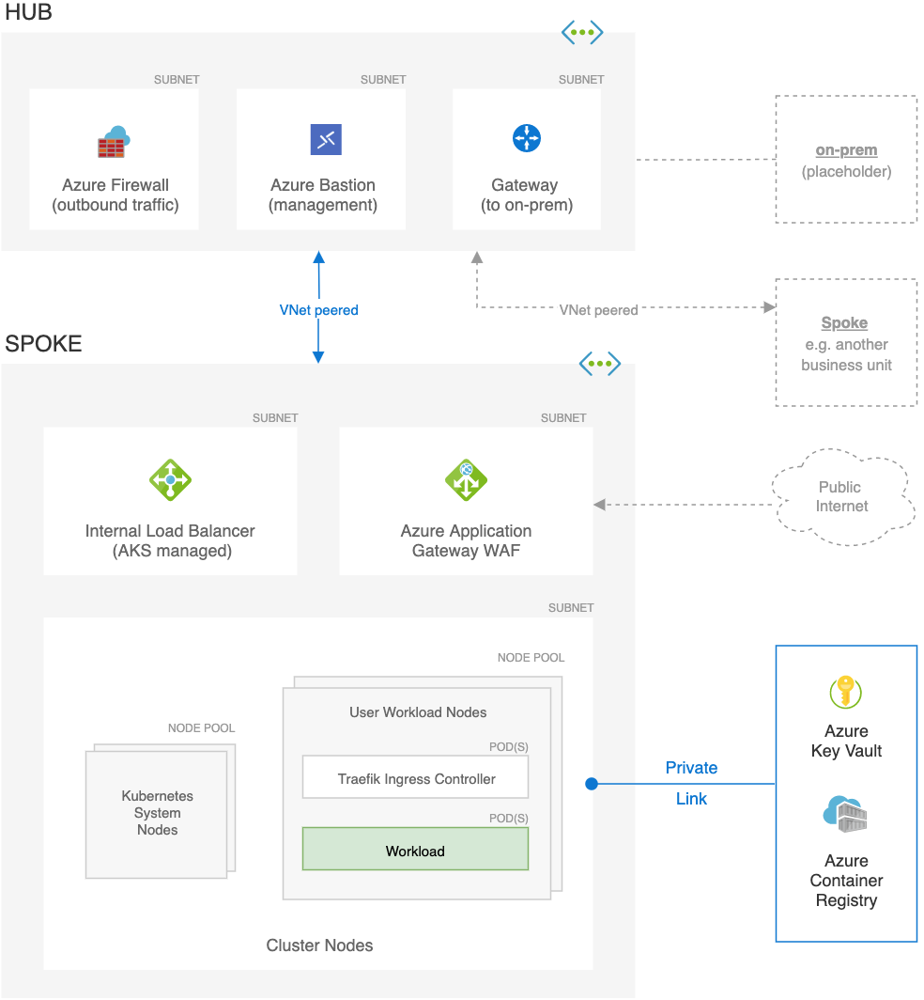

# Secure baseline architecture for an AKS cluster
In this reference architecture, we’ll build a baseline infrastructure that
deploys an Azure Kubernetes Service (AKS) cluster with focus on security. This
article includes recommendations for networking, security, identity, management,
and monitoring of the cluster based on an organization’s business requirements.

 An implementation of this architecture is available
on [GitHub: Azure Kubernetes Service (AKS) Secure Baseline Reference Implementation](https://github.com/mspnp/aks-secure-baseline). You can use it as a
starting point and configure it as per your needs.

## Case study – Contoso Bicycle
----------------------------

This architecture is built for a fictitious company, Contoso Bicycle. The
company is a small and fast-growing startup that provides online web services to
its clientele in the west coast, North America. The web services were deployed
to the cloud from the get-go. They have no on-premises datacenters or legacy
applications. Here's the brief cloud profile:

- Have several workloads running and operating in Azure.
- Use Azure Active Directory for identity management.
- Knowledgeable about containers and have considered them for application development. 
- Aware of Kubernetes as a well-known container orchestration.
- Researched AKS as a possibility. 

The IT teams need guidance about architectural recommendations for running their web services in an AKS cluster.

### Organization structure

Contoso Bicycle has a single IT Team with these sub teams.

#### Architecture team

Work with the line of business from idea through deployment into production.
They understand all aspects of the Azure components: function, integration,
controls, and monitoring capabilities. The team evaluates those aspects for
functional, security, and compliance requirements. They coordinate and have
representation from other teams. Their workflow aligns with Contoso's SDL process.

#### Development team

Responsible for developing Contoso’s web services. They rely on the guidance
from the architecture team about implementing cloud design patterns. They own and run the integration and deployment pipeline for the web services.

#### Security team

Review Azure services and workloads from the lens of security. Incorporate Azure
service best practices in configurations. They review choices for authentication, authorization, network connectivity, encryption, and key management and, or rotation. Also, they have monitoring requirements for any proposed service.

#### Identity team

Responsible for identity and access management for the Azure environment. They
work with the Security and Architecture teams for use of Azure Active Directory,
role-based access controls, and segmentation. Also, monitoring service
principles for service access and application level access.

#### Networking team

Make sure that different architectural components can talk to each other in a secure manner. They manage the hub and spoke network topologies and IP space allocation.

#### Operations team

Responsible for the infrastructure deployment and day-to-day operations of the
Azure environment.

### Business requirements

Here are the requirements based on an initial [Well-Architected
Framework review](https://docs.microsoft.com/assessments/?mode=pre-assessment&session=local).

#### Reliability

- Global presence: The customer base is focused on the West Coast of North
America.

- Business continuity: The workloads need to be highly available at a minimum
cost. They have a Recovery Time Objective (RTO) of 4 hours.

- On-premises connectivity: They don’t need to connect to on-premises datacenters or
legacy applications.

#### Performance efficiency

The web service’s host should have these capabilities.

- Auto scaling: Automatically scale to handle the demands of expected traffic
patterns. The web service is unlikely to experience a high-volume scale event.
The scaling methods shouldn't drive up the cost.

- Right sizing: Select hardware size and features that are suited for the web
service and are cost effective.

- Growth: Ability to expand the workload or add adjacent workloads as the product
matures and gains market adoption.

- Monitoring: Emit telemetry metrics to get insights into the performance and
scaling operations. Integration with Azure Monitor is preferred.

- Workload-based scaling: Allow granular scaling per workload and independent
scaling between different partitions in the workload.

#### Security

- Identity management: Contoso is an existing Microsoft 365 user. They rely
heavily on Azure Active Directory as their control plane for identity.

- Certificate: They must expose all web services through SSL and aim for
end-to-end encryption, as much as possible.

- Network: They have existing workloads running in Azure Virtual Networks. They
would like to minimize direct exposure to Azure resources to the public
internet. Their existing architecture runs with regional hub and spoke
topologies. This way, the network can be expanded in the future and also provide workload isolation.
All web applications require a web application firewall (WAF) service to help
govern HTTP traffic flows.

- Secrets management: They would like to use a secure store for sensitive
information.

- Container registry: Currently not using a registry and are looking for guidance.

- Container scanning: They know the importance of container scanning but
are concerned about added cost. The information isn't sensitive, but would like the option to scan in the future.

#### Operational excellence

- Logging, monitoring, metrics, alerting: They use Azure Monitor for their
existing workloads. They would like to use it for AKS, if possible.

- Automated deployments: They understand the importance of automation. They build
automated processes for all infrastructure so that environments and workloads
can easily be recreated consistently and at any time.

#### Cost optimization

- Cost center: There’s only one line-of-business. So, all costs are billed to a
single cost center.

- Budget and alerts: They have certain planned budgets. They want to be alerted
when certain thresholds like 50%, 75%, and 90% of the plan has been reached.

### Design and technology choices

-   Deploy the AKS cluster into an existing Azure Virtual Network spoke. Use the
    existing Azure Firewall in the regional hub for securing outgoing traffic
    from the cluster.

-   Traffic from public facing website is required to be encrypted. This encryption is
    implemented with Azure Application Gateway with integrated web
    application firewall (WAF).

-   Use Traefik as the Kubernetes ingress controller.

-   The workload is stateless. No data will be persisted inside the cluster.

-   Given there's only one line-of-business, there's a single workload. Azure
    Network Policy will be enabled for future use.

-   Azure Container Registry will be used for the container image registry. The cluster will access the registry through Azure Private Link.

-   To stay up to date with OS and security patches, have tools to help
    the restart of nodes when needed.

-   AKS will be integrated with Azure Active Directory for role-based access control. This choice is aligned with the strategy of using identity as an operational control plane.

-   Azure Monitor will be used for logging, metrics, monitoring, and alerting to
    use the existing knowledge of Log Analytics.

-   Azure Key Vault will be used to store all secret information including SSL certificates. Key Vault data will be mounted by using Azure Key Vault with Secrets Store CSI Driver.

-   Two node pools will be used in AKS. The system node pool will be used for
    critical system pods. The second node pool will be used for the
    application workload.

-   To make sure the workload is scaled properly, requests and limits will be
    enforced by assigning quotas for the Horizontal Pod Autoscaling (HPA). AKS cluster autoscaler will be enabled so that additional nodes are automatically provisioned if pods can’t be scheduled.

## Network topology

This architecture uses a hub-spoke network topology. The hub and spoke(s) are
deployed in separate virtual networks connected through
[peering](https://docs.microsoft.com/azure/virtual-network/virtual-network-peering-overview).
Some advantages of this topology are:

-   Segregated management. It allows for a way to apply governance and control
    the blast radius. It also supports the concept of landing zone with
    separation of duties.

-   A natural choice for workloads that span multiple subscriptions.

-   It makes the architecture extensible. To accommodate new features or
    workloads, new spokes can be added instead of redesigning the network
    topology.

-   Certain resources, such as a firewall and DNS can be shared across networks.

### Hub 

The hub virtual network is the central point of connectivity and observability.
Within the network, three subnets are deployed.

#### Subnet to host Azure Firewall

[Azure Firewall](https://docs.microsoft.com/azure/firewall/) is firewall as
a service. The firewall instance secures outbound network traffic. Without
this layer of security, the flow might communicate with a malicious
third-party service that could exfiltrate sensitive company data.

#### Subnet to host a gateway

This subnet is a placeholder for a VPN or ExpressRoute gateway. The gateway
provides connectivity between the routers in the on-premises network and the
virtual network.

#### Subnet to host Azure Bastion

This subnet is a placeholder for [Azure
Bastion](https://docs.microsoft.com/azure/bastion/bastion-overview). You can
use Bastion to securely access Azure resources without exposing the
resources to the internet. This subnet is used for management and operations only.

### Spoke

The spoke virtual network will contain the AKS cluster and other related
resources. The spoke has three subnets:

#### Subnet to host Azure Application Gateway 

Azure [Application
Gateway](https://docs.microsoft.com/azure/application-gateway/overview) is a
web traffic load balancer operating at Layer 7. The reference implementation
uses the Application Gateway v2 SKU that enables [Web Application
Firewall](https://docs.microsoft.com/azure/application-gateway/waf-overview) (WAF).
WAF secures incoming traffic from common web traffic attacks. The instance
has a public frontend IP configuration that receives user requests. By
design, Application Gateway requires a dedicated subnet.

#### Subnet to host the ingress resources

To route and distribute traffic, Traefik is the ingress controller that
is going to fulfill the Kubernetes ingress resources.

#### Subnet to host the cluster nodes

AKS maintains two separate groups of nodes (or node pools). The *system node
pool* hosts pods that run core cluster services. The *user node pool* runs
the Contoso workload and the ingress controller to facilitate inbound
communication to the workload. The workload is a simple ASP.NET application.

For additional information, [Hub-spoke network topology in
Azure](https://docs.microsoft.com/azure/architecture/reference-architectures/hybrid-networking/hub-spoke).

## Plan the IP addresses

The address space of the virtual network should be large enough to hold all
subnets. Account for all entities that will receive traffic. IP addresses for
those entities will be allocated from the subnet address space. Consider these
points.
- Upgrade

    AKS updates nodes regularly to make sure the underlying virtual machines are
up to date on security features and other system patches. During an upgrade
process, AKS creates a node that temporarily hosts the pods, while the
upgrade node is cordoned and drained. That temporary node is assigned an IP
address from the cluster subnet.

    For pods, you might need additional addresses depending on your strategy.
For rolling updates, you'll need addresses for the temporary pods that run the workload while the actual pods are updated. If you use
the replace strategy, pods are removed, and the new ones are created. So,
addresses associated with the old pods are reused.

    For details on various deployment strategies, see [Kubernetes deployment
strategy](https://kubernetes.io/docs/concepts/workloads/controllers/deployment/%23strategy).

- Scalability

    Take into consideration the node count of all system and user nodes and
their maximum scalability limit. Suppose you want to scale out by 400%. You
will need four times the number of addresses for all those scaled-out nodes.

    In this architecture, each pod can be contacted directly. So, each pod
needs an individual address. Pod scalability will impact the address
calculation. That decision will depend on your choice about the number of
pods you want to grow.

- Azure Private Link addresses

    Factor in the addresses that are required for communication with other Azure
services over Private Link. In this architecture, we have two addresses
assigned for the links to Azure Container Registry and Key Vault.

- [Certain addresses are
    reserved](https://docs.microsoft.com/azure/virtual-network/virtual-networks-faq#are-there-any-restrictions-on-using-ip-addresses-within-these-subnets)
    for use by Azure. They can't be assigned.

The preceding list isn't exhaustive. If your design has other resources that
will impact the number of available IP addresses, accommodate those addresses.

This architecture is designed for a single workload. For multiple workloads, you
may want to isolate the user node pools from each other and from the system node
pool. That choice may result in more subnets that are smaller in size. Also, the
ingress resource might be more complex. You might need multiple ingress
controllers that will require extra addresses.

For the complete set of considerations for this architecture, see [AKS baseline
Network
Topology](https://github.com/mspnp/reference-architectures/blob/fcp/aks-baseline/aks/secure-baseline/networking-readme.md#aks-baseline-network-topology).

For information related to planning IP for an AKS cluster, see [Plan IP
addressing for your
cluster](https://docs.microsoft.com/azure/aks/configure-azure-cni#plan-ip-addressing-for-your-cluster).

## Configure compute for the base cluster
In AKS, each node pool maps to a virtual machine scale set. Nodes are VMs in
each node pool. Consider using a smaller VM size for the system node pool to
minimize costs. This reference implementation deploys the system node pool with
three DS2_v2 nodes. That size is sufficient to meet the expected load of the
system pods. The OS disk is 512 GB.

For the user node pool, here are some considerations:

-   Choose larger node sizes to pack the maximum number of pods set on a node.
    It'll minimize the footprint of services that run on all nodes, such as
    monitoring and logging.

-   Deploy at least two nodes. That way, the workload will have a high
    availability pattern with two replicas. With AKS, you can change the node
    count without recreating the cluster.

-   Actual node sizes for your workload will depend on the requirements
    determined by the design team. Based on the [requirements of the Contoso
    Bicycle company](#business-requirements), we chose DS4_v2 for the production workload. To lower costs
    one could drop the size to DS3_v2, which is the minimum recommendation.

-   When planning capacity for your cluster, assume that your workload can
    consume up to 80% of each node; the remaining 20% is reserved for AKS
    services.

-   The maximum pods per node, is set to 30, which is also the default.
    Increasing this value can impact performance of thebecause of an unexpected node
    failure or expected node maintenance events.
