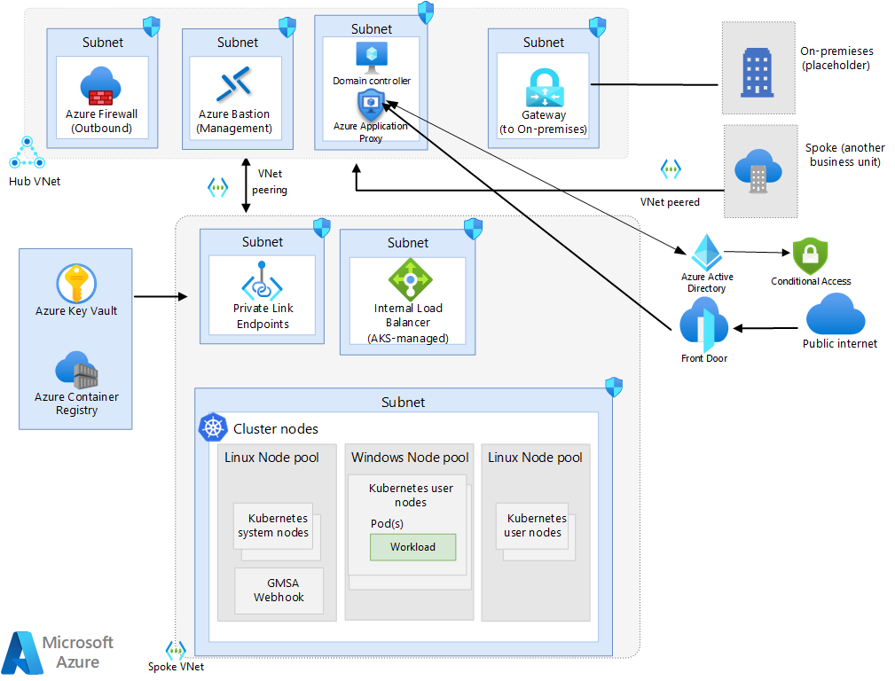
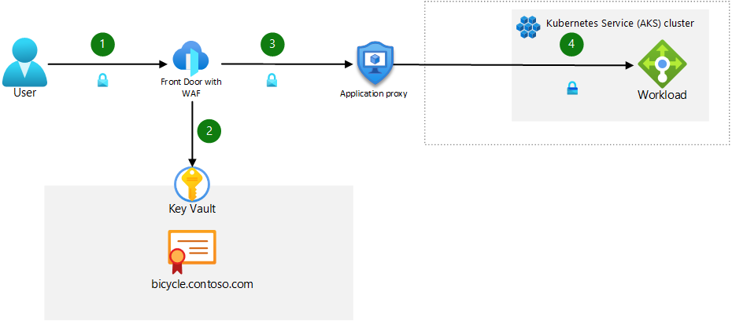

This article is meant to be considered as an extension to the [AKS Baseline architecture](/azure/architecture/reference-architectures/containers/aks/baseline-ak), which provides a thorough review of the recommended configurations to deploy an AKS cluster into a production environment. The focus of this article is on providing guidance relative to deploying Windows containers on AKS. As such, this article focuses on those configurations specific to deploying Windows on AKS and you should refer back to the AKS Baseline documentation for configurations already described there.

Refer to the [AKS Windows baseline GitHub project](https://github.com/Azure/aks-baseline-windows) to review the reference implementation associated with this reference architecture including sample deployment code.

## Network topology

The network design used in this architecture is based off of the [design](./baseline-aks.yml#network-topology) used in the AKS Baseline architecture and therefore shares all of the core components with that design except for the following changes.

- The ingress solution in this architecture was replaced with a solution that uses Azure Application Proxy to support Kerberos authentication.
- Active Directory domain controllers and Azure Application Proxy have been added.

The diagram below shows the hub-spoke network design used in this architecture.

### Node pool topology

This architecture uses three node pools: A system node pool running Linux, a user node pool running Linux, and a user node pool running Windows.  The Windows and Linux user node pools are used for workloads while the system node pool is used for all system-level configurations, like CoreDNS.

>[!NOTE]
> Using separate node pools for Linux-based and Windows-based workloads requires the use of a [node selector](/azure/aks/operator-best-practices-advanced-scheduler#control-pod-scheduling-using-node-selectors-and-affinity) to ensure that when you deploy a given workload, it is deployed into the appropriate node pool based on the workload type.

## Ingress design

Kubernetes ingress resources route and distribute incoming traffic to the cluster. This architecture makes use of [Azure Front Door](/azure/frontdoor/front-door-overview) and [Azure AD Application Proxy](/azure/active-directory/app-proxy/what-is-application-proxy) to secure ingress traffic, as opposed to Azure App Gateway, which is used in the [baseline architecture](/azure/architecture/reference-architectures/containers/aks/baseline-aks#deploy-ingress-resources). These products were chosen for this architecture because Kerberos authentication isn't supported natively with Azure Application Gateway. Azure Application Gateway serves as both an ingress controller and supports WAF. For Windows deployments using modern authentication, Azure Application Gateway with WAF is recommended. NGINX Pro ingress controller supports both Kerberos and modern authentication; however, it doesn't provide networking protection for your cluster. It is recommended that you either use NGINX with Azure Front Door or Azure Application Gateway to protect your workloads. The components are described below.

- **Azure Front Door with WAF** (AFD): AFD is the public-facing ingress point for the apps hosted on the AKS cluster.  AFD Premium is used in this design as it allows the use of [Private Link](/azure/frontdoor/private-link), which locks traffic between AFD and the cluster to private networking, providing the highest level of security. [Web Application Firewall](/azure/web-application-firewall/afds/afds-overview) (WAF) protects against common web application exploits and vulnerabilities.
- **Azure AD Application Proxy**: This component serves as the second ingress point in front of the internal load balancer managed by AKS. It has Azure Active Directory enabled for pre-authentication of users and uses a conditional access policy to prevent unauthorized IP ranges and users from accessing the site. This is the only way to route Kerberos authentication requests while using an Azure service that supports WAF. For a detailed description of providing single sign-on access to Application Proxy-protected apps, refer to [Kerberos Constrained Delegation for single sign-on (SSO) to your apps with Application Proxy](/azure/active-directory/app-proxy/application-proxy-configure-single-sign-on-with-kcd)
- **Internal load balancer**: Managed by AKS. This load balancer exposes the ingress controller through a private static IP address. It serves as a single point of contact that receives inbound HTTP requests.

In order to implement this design, AFD must be configured to use the Application Proxy URL that is created when the app is published in that service.  This configuration routes inbound traffic to the proxy and allows pre-authentication to happen.

### Ingress traffic flow

1. The client sends an HTTPS request to the domain name: bicycle.contoso.com. That name is associated with the DNS A record for the public IP address of Azure Front Door. This traffic is encrypted to make sure that the traffic between the client browser and gateway can't be inspected or changed.
1. Azure Front Door has an integrated web application firewall (WAF) and negotiates the TLS handshake for bicycle.contoso.com, allowing only secure ciphers. Azure Front Door Gateway is a TLS termination point, as it's required to process WAF inspection rules, and execute routing rules that forward the traffic to the configured backend. The TLS certificate is stored in Azure Key Vault.
1. AFD routes the user request to the Azure Application Proxy. The user must authenticate with Azure AD if pre-authentication is enabled.
1. The App Proxy routes the user to the backend app container via the AKS load balancer.

>[!NOTE]
> You can enforce end-to-end TLS traffic at every hop in the flow, but consider measuring the performance, latency, and operational impact when making the decision to secure pod-to-pod traffic. For most single-tenant clusters, with proper control plane RBAC and mature Software Development Lifecycle practices, it's sufficient to force encryption up to the ingress controller and protect the backend with a Web Application Firewall (WAF). That configuration will minimize overhead in workload management and network performance impacts. Your workload and compliance requirements will dictate where you perform TLS termination.

### Egress traffic flow

All [guidance](./baseline-aks.yml#egress-traffic-flow) found in the AKS Baseline article apply here with an additional recommendation for Windows workloads: In order to take advantage of automatic Windows Server updates, you must not block the [required FQDNs](/azure/aks/outbound-rules-control-egress#windows-server-based-node-pools-required-fqdn--application-rules) in your Azure Firewall ruleset.

## IP address planning

Unlike AKS clusters with Linux node pools, AKS clusters with Windows node pools require Azure CNI.  Using Azure CNI allows a pod to be assigned an IP address from an Azure Virtual Network. The pod can then communicate via the Azure Virtual Network just like any other device. It can connect to other pods, to peered networks or on-premises networks using ExpressRoute or a VPN, or to other Azure services using Private Link.

All [guidance](/azure/architecture/reference-architectures/containers/aks/baseline-aks#plan-the-ip-addresses) relative to planning the IP addresses provided in the AKS Baseline architecture article applies here, with one additional recommendation: consider provisioning a dedicated subnet for your domain controllers.  With regard to the Windows node pool, it is recommended that you segregate that from the other node pools logically through separate subnets.

## Node pool upgrade

The process for upgrading Windows nodes is unchanged from guidance provided in the [Azure Kubernetes Service (AKS) node image upgrade](/azure/aks/node-image-upgrade) documentation but you should consider the following schedule differences to plan your upgrade cadence.

Microsoft provides new Windows Server images, including up-to-date patches, for nodes monthly and doesn't perform any automatic patching or updates. As such, you must manually or programmatically update your nodes according to this schedule. Using GitHub Actions to create a cron job that runs on a schedule allows you to programmatically schedule monthly upgrades. The guidance provided in the documentation linked above reflects Linux node processes, but you can update the YAML file to set your cron schedule to run monthly rather than biweekly. You'll also need to change the “runs-on” parameter in the YAML file to “windows-latest” to ensure that you're upgrading to the most recent Windows Server image.

>[!NOTE]
> Clusters must be upgraded before performing node and node pool upgrades.  Follow the [Cluster upgrades](/azure/aks/upgrade-cluster) guidance to perform the upgrade.

## Compute considerations

The larger image sizes associated with Windows server-based images requires the deployment of appropriately sized OS disks in your node pool.  Using ephemeral OS disks is still recommended for all nodes, including Windows, so ensure that you understand the [size requirements](/azure/virtual-machines/ephemeral-os-disks#size-requirements) you must adhere to when planning your deployment.

## Identity management

If you require Active Directory authentication and authorization through [Group Managed Service Accounts](/windows-server/security/group-managed-service-accounts/group-managed-service-accounts-overview) (gMSA) must enable the gMSA profile on your AKS cluster running Windows nodes. The [gMSA PowerShell module](/virtualization/windowscontainers/manage-containers/gmsa-aks-ps-module) demonstrates how to confirm you that have enabled the gMSA profile successfully and walks through the steps to set up the integration. During the setup, you're asked to create an Azure Key Vault for storing the user credentials required to retrieve the service account and a Managed Identity. If you already have a Key Vault or Managed Identity you’d like to use, use the names of the existing resources for the parameter values in the PowerShell module. Prior to setting up your gMSA integration, ensure you have a domain controller that is running and is accessible by the AKS cluster.

## Node and pod scaling

Cluster autoscaler guidance is unchanged for Windows containers. Refer to the [Cluster autoscaler]( /azure/architecture/reference-architectures/containers/aks/baseline-aks#cluster-autoscaler) documentation for guidance.

The baseline cluster documentation describes the manual and autoscaling approaches that are available for pod scaling. Both approaches are available for clusters running Windows containers and the [guidance](./baseline-aks.yml#node-and-pod-scalability) provided in that article generally apply here as well.

What differs between Linux and Windows containers with respect to pod scaling operations is the size of the image in most cases. The larger image sizes of Windows containers will likely increase the amount of time for scaling operations to complete and therefore some considerations on scaling approach should be taken. This scenario is common with legacy .NET applications due to the size of the .NET runtime. In order to mitigate the delays in pulling the image down during scaling times, you can utilize a [DaemonSet](/azure/aks/hybrid/create-daemonsets) to pull down the image from ACR to cache on every Windows node, and therefore spin up the pods with the image pre-loaded. From that point, the pods would need just to run through the app configuration processes defined for your workload before being brought online.

Benchmarking exercises should be performed to understand the time impact of performing scaling operations and this data should be weighed against business requirements. If your workload needs to scale faster than is possible through autoscaling, it is recommended to consider the following alternative “hot spare” solution:

You'll first need to conduct baseline testing to identify how many pods you'll need to run at peak load times and off-peak load times. With this baseline established, you can plan your node count to account for the total number of nodes you'll need to have available at any given time. This solution involves using manual scaling for your cluster and setting the initial number of nodes to the off-peak number of nodes required. When you approach a peak time period, you'll need to preemptively scale to the peak-load time number of nodes. As time goes on, you'll need to re-establish your baseline regularly to account for changing app usage or other business requirements.

## Monitoring

Monitoring your Windows containers can be done in two ways: Azure Monitor and using the [Windows Containers Log Monitor](https://github.com/microsoft/windows-container-tools/tree/main/LogMonitor) tool.

Containers running Windows can be monitored with Azure Monitor and [Container Insights](/azure/azure-monitor/containers/container-insights-overview), much like Linux containers. Log Monitor allows you to pull logs from Windows services and application events and port them to STDOUT for consumption by kubectl logs.

With the general availability of Windows Server support for AKS, an AKS cluster with Windows Server nodes has a preview agent installed as a daemonset pod on each individual Windows Server node to collect logs and forward them to Log Analytics. For performance metrics, a Linux node that's automatically deployed in the cluster as part of the standard deployment collects and forwards the data to Azure Monitor for all Windows nodes in the cluster.

[Container insights](/azure/azure-monitor/containers/container-insights-overview) supports clusters running the Linux and Windows Server 2019 operating system. The container runtimes it supports are Moby and any CRI-compatible runtime such as CRI-O and ContainerD. Docker is no longer supported as a container runtime as of September 2022.  

Container insight monitoring for a Windows Server cluster has the following limitations:

- Windows doesn't have a Memory RSS metric. As a result, it isn't available for Windows nodes and containers. The [Working Set](/windows/win32/memory/working-set) metric is available
- Disk storage capacity information isn't available for Windows nodes.
- Only pod environments are monitored, not Docker environments.

## Policy management

All policy [guidance](./baseline-aks.yml#policy-management) found in the AKS baseline article apply for Windows workloads. Additional Windows-specific policies found in the [Azure Policy built-in definitions for Azure Kubernetes Service](/azure/aks/policy-reference) reference article to consider are:

- [Kubernetes cluster Windows containers should not overcommit CPU and memory](https://portal.azure.com/#blade/Microsoft_Azure_Policy/PolicyDetailBlade/definitionId/%2Fproviders%2FMicrosoft.Authorization%2FpolicyDefinitions%2Fa2abc456-f0ae-464b-bd3a-07a3cdbd7fb1)
- [Kubernetes cluster Windows containers should not run as ContainerAdministrator](https://portal.azure.com/#blade/Microsoft_Azure_Policy/PolicyDetailBlade/definitionId/%2Fproviders%2FMicrosoft.Authorization%2FpolicyDefinitions%2F5485eac0-7e8f-4964-998b-a44f4f0c1e75)
- [Kubernetes cluster Windows containers should only run with approved user and domain user group](https://portal.azure.com/#blade/Microsoft_Azure_Policy/PolicyDetailBlade/definitionId/%2Fproviders%2FMicrosoft.Authorization%2FpolicyDefinitions%2F57dde185-5c62-4063-b965-afbb201e9c1c)

## Cluster bootstrapping

As with the cluster bootstrapping [guidance](/azure/architecture/reference-architectures/containers/aks/baseline-aks#cluster-bootstrapping) provided in the AKS Baseline article, cluster operators should consider thier bootstrapping approach for Windows-based workloads as well.  The same guidance provided in the AKS Baseline article apply here as well.

## Cost management

All cost optimization [guidance](./baseline-aks.yml#cost-management) found in the AKS Baseline article apply for Windows workloads.  Other cost considerations that should be accounted for are:

- The licensing costs for Windows Server increase the cost of nodes for your AKS cluster. Cost optimization recommendations for this factor include reserving capacity or using existing licenses if you already have them for other business uses. See the [Azure Hybrid Benefit for Windows Server](/windows-server/get-started/azure-hybrid-benefit)(AHUB) documentation to learn about discounts for your Software Assurance (SA) applicable Windows Server licenses.
- The size of Windows container images may incur additional Azure Container Registry (ACR) costs due to the amount of storage required for multiple images, the number of concurrent nodes pulling from the ACR and geo-replication requirements.

## Contributors

*This article is maintained by Microsoft. It was originally written by the following contributors.*

Principal authors:

- [Isabelle Bersano](https://www.linkedin.com/in/isabelle-bersano-a4380b146) | Cloud Solution Architect
- [Akshay Nimbalkar](https://www.linkedin.com/in/akshaynimbalkar/) | Principal Cloud Solution Architect
- [Clayton Siemens](https://www.linkedin.com/in/clayton-siemens-3514896/) | Principal Content Developer

*To see non-public LinkedIn profiles, sign in to LinkedIn.*

## Next steps

- Learn more about [Windows containers](/virtualization/windowscontainers/about/)

## Related resources

- Learn how to deploy [Windows node pools on an AKS cluster](/azure/aks/learn/quick-windows-container-deploy-cli)
