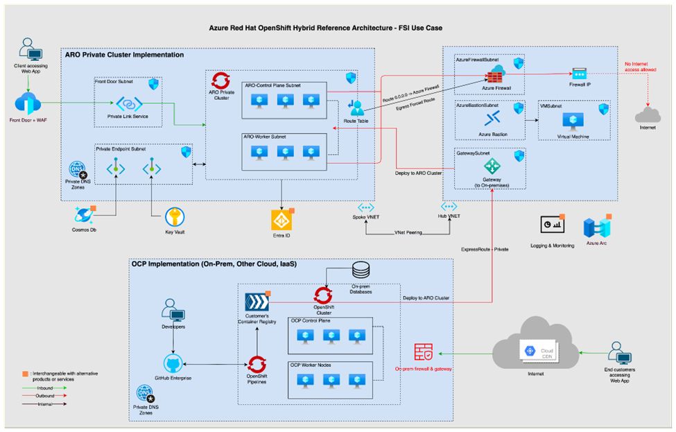

This article shows you how to modify the Azure Red Hat OpenShift (ARO) landing zone accelerator architecture for the financial services industry (FSI). This guidance focuses on creating secure, resilient, and compliant solutions for the FSI using ARO in a hybrid cloud environment.

Before you build a production environment with Azure Red Hat OpenShift, read [Azure Red Hat OpenShift landing zone accelerator](/azure/cloud-adoption-framework/scenarios/app-platform/azure-red-hat-openshift/landing-zone-accelerator).

## Architecture

### Data Flow

This scenario covers an application running on an ARO cluster with connectivity to resources on-premises and in a hub virtual network on Azure that is protected by Azure Firewall. The data flow is as follows:

- The developer writes code within the company's network and pushes the code to a code repository. In this case, the code repository used is GitHub Enterprise.
- The customer's deployment pipeline takes the code and containerizes it, deploying it in an on-premises container registry.
- This image can then be deployed into an on-premises OpenShift Cluster and extended to an ARO cluster on Azure.
- The image also gets deployed to ARO via ExpressRoute, which routes the traffic through the Hub Azure Virtual Network to the private ARO cluster in the Spoke Virtual network. These two networks are peered.
- Traffic coming from the ARO cluster is first routed through the peered Hub Virtual Network and through an Azure Firewall instance.
- Customers can access the application by accessing a web address that directs traffic to Azure Front Door.
- Azure Front door is connected to the private ARO cluster using Private Link services.

### Components

- [Azure Red Hat OpenShift](https://azure.microsoft.com/products/openshift) provides highly available, fully managed OpenShift clusters on demand, monitored and operated jointly by Microsoft and Red Hat and is the primary compute platform in this architecture.
- [Microsoft Entra ID](https://learn.microsoft.com/entra/fundamentals/whatis) (formerly Azure Active Directory) is a cloud-based identity and access management service that your employees can use to access external resources. In this architecture, it's used to provide users and users secure, granular access to the resources.
- [ExpressRoute](/azure/well-architected/service-guides/azure-expressroute) lets you extend your on-premises networks into the Microsoft cloud over a private connection with the help of a connectivity provider. In this architecture, it's used to provide private, high bandwidth connectivity between on-premises resources and Azure.
- [Azure Key vaults](/azure/key-vault/general/overview) is a key management solution that helps store and manage secrets, keys, and certificates. In this architecture, it's being used to securely store secrets for the applications running on the private ARO cluster.
- [Azure Bastions](/azure/well-architected/service-guides/virtual-machines) is a fully managed PaaS service that you deploy to securely connect to virtual machines (VM) via private IP address. In this architecture, Azure Bastion is being used to connect to the Azure VM within the private network since we're implementing a private cluster.
- [Azure Firewalls](/azure/well-architected/service-guides/virtual-machines) cloud-native and intelligent network firewall security service that provides the best of breed threat protection for your cloud workloads running in Azure. In this architecture, Azure firewall is used to monitor and filter network traffic in an out of the ARO environment.

### Alternatives

Red Hat and Azure Red Hat OpenShift (ARO) is a platform that has offers alternatives to customers. With ARO, you get access to the OpenShift ecosystem. This means that the platform services you get running OpenShift on-premises mostly also apply to ARO. ARO allows you to use those as alternatives to some of the Azure services mentioned in this document.

You can also use third-party alternatives. For example, customers might decide to host their container registry on-premises  or use OpenShift GitOps instead of GitHub Actions. Other alternative considerations would be third party monitoring solutions that work seamlessly with ARO environments. This document focuses on Azure alternatives customers often use to build their solutions on ARO.

## Scenario details

FSI and other regulated industry ARO customers often have more stringent requirements for their environments. This scenario is an architectural guidance that outlines the comprehensive criteria and guidelines for designing solutions to meet the unique requirements of financial institutions utilizing Azure Red Hat OpenShift (ARO) in a hybrid cloud environment.

With a focus on security, it encompasses measures such as enabling private connectivity from on-premises environments, implementing stringent controls on private link usage, establishing private registries, ensuring network segregation, and deploying robust encryption protocols for data both at rest and in transit. Identity and access management, alongside role-based access controls, ensure secure user administration within ARO clusters.

Resilience planning involves distributing resources across Availability Zones for fault tolerance, while compliance obligations cover third-party risk assessments, regulatory adherence, and disaster recovery protocols. Observability strategies include logging, monitoring, and backup mechanisms to uphold operational efficiency and regulatory compliance. These guidelines provide a comprehensive framework for deploying and managing ARO solutions tailored specifically to the needs of the financial services industry.

### Potential use cases

This scenario is most relevant to customers in regulated industries including finance and healthcare. This would also apply to other customers who have elevated security requirements than regular scenarios, for example, when building solutions with strict data governance requirements.

## Recommendations

These recommendations implement the pillars of the Azure Well-Architected Framework, which is a set of guiding tenets that can be used to improve the quality of a workload. For more information, see [Microsoft Azure Well-Architected Framework](/azure/well-architected/).

### Reliability

Reliability ensures your application can meet the commitments you make to your customers. For more information, see [Design review checklist for Reliability](/azure/well-architected/reliability/checklist). Resilience is essential for Microsoft Azure Red Hat OpenShift (ARO) to maintain the uninterrupted operation of mission-critical applications. Follow these reliability recommendations:

- *Availability zones and multi-region deployments*: Distribute control plane and worker nodes across three Availability Zones (AZs) within an Azure region. This ensures the control plane cluster maintains quorum and mitigates potential failures across entire AZs. Implement this distribution as a standard practice. Additionally, deploy ARO clusters in multiple regions to protect against region-wide failures. Use Azure Front Door to route traffic to these clusters for improved resilience.

- *Disaster recovery*: Implement rigorous disaster recovery standards to safeguard customer data and ensure continuous business operations. Follow the guidelines in the [ARO - Considerations for Disaster Recovery](https://cloud.redhat.com/experts/aro/disaster-recovery/) documentation to meet these standards effectively.

- *Backup*: Ensure compliance with stringent backup requirements to protect sensitive customer data. Configure ARO to attach to Azure storage by default and ensure it automatically reattaches after a restore operation. Enable this feature by following the instructions in the [Create an Azure Red Hat OpenShift 4 cluster Application Backup](/azure/openshift/howto-create-a-backup) documentation.

### Security

Security provides assurances against deliberate attacks and the abuse of your valuable data and systems. For more information, see [Design review checklist for Security](/azure/well-architected/security/checklist). Security is paramount in the financial industry, requiring stringent measures to protect sensitive data, and ensure regulatory compliance. Follow these security recommendations:

#### Networking

- *Private connectivity from on-premises environment*: Financial industry use cases require exclusive private network connectivity without public internet access. Implement Azure private links for private IP addresses inaccessible from the internet, and use ExpressRoute for connectivity from on-premises data centers. Use Azure Private Link and ExpressRoute for security. Refer to [Create an Azure Red Hat OpenShift 4 private cluster](/azure/openshift/howto-create-private-cluster-4x) documentation for more details.

- *Push-only private link*: Financial companies often restrict Azure workload traffic from connecting back to their data centers. Configure Private Link Gateways for inbound-only access from private data centers to Azure. Ensure system dependencies in the private data center push data to Azure, and apply firewall policy exceptions on a case-by-case basis following least privilege principles. Use Azure Private Link and Firewall policy for this configuration.

- *Private registry*: To scan all images and prevent the use of vulnerable images, use a centralized container repository within your perimeter. Distribute container images to runtime locations. Implement ACR (Azure Container Registry) and Supported External Registries for this purpose. Learn more about connecting to private registries at the [Using Azure Container Registry in Private ARO clusters](https://cloud.redhat.com/experts/aro/aro-acr/) documentation.

- *Network segmentation*: Segment default subnets for security and network isolation. Create distinct subnets for Front Door, ARO Control Plane, ARO Worker/Data Plane, Azure Firewall, Azure Bastion, and Gateway. Utilize Azure networking for these configurations.

#### Data

- *Encryption at rest*: Ensure data encryption at rest using default storage policies and configurations. Encrypt ETCD behind the control plane, storage on each worker node, and configure CSI access to Azure File, Block, and Blob for Persistent Volumes. Use ETCD and storage data encryption (ARO feature) and manage keys either through the customer or Azure. For more information, see [Security for the Azure Red Hat OpenShift landing zone accelerator](/azure/cloud-adoption-framework/scenarios/app-platform/azure-red-hat-openshift/security#design-recommendations).

- *Encryption in transit*: Encrypt all interconnections between services in a default ARO cluster. Enable TLS for traffic between services, use network policies, service mesh, and Key Vault for certificate storage. Implement TLS, Network policies, Service mesh, and Azure Key Vault. For more information, see the [Update Azure Red Hat OpenShift cluster certificates](/azure/openshift/howto-update-certificates) documentation.

- *Key management service*: Ensure secure storage and servicing of secrets using Azure Key Vault. Consider third-party ISVs like Hashicorp Vault or Cyberark Concur for additional options. Handle certificates and secrets with Azure Key Vault and consider BYOK models. Use Azure Key Vault as the main component. Learn more at the [Customer-managed keys for Azure Storage encryption](/azure/storage/common/customer-managed-keys-overview) documentation.

#### Authentication and authorization

- *Identity and access management*: Deploy ARO clusters with managed Azure AD integration for centralized identity management. Use Microsoft Entra ID for this purpose. Learn more at the [Configure ARO to use Microsoft Entra ID Group Claims](https://cloud.redhat.com/experts/idp/group-claims/aro/) documentation.

- *Role-based access control (RBAC)*: Implement RBAC in ARO to provide granular filtering of user actions and access levels. Use RBAC in FSI scenarios to ensure least privilege access to the cloud environment. For more information, see [Managing Role-based Access Control (RBAC)](https://docs.openshift.com/aro/3/admin_guide/manage_rbac.html) documentation.

#### Compliance

- *Third-party risk assessments*: Follow financial compliance regulations by adhering to least privilege access, limiting duration for escalated privileges, and auditing SRE resource access. Refer to the ARO documentation for the SRE shared responsibility model and access escalation procedures. For more information, see the [SRE Access to Azure Red Hat OpenShift (ARO)](https://access.redhat.com/solutions/6997379) and [Overview of responsibilities for Azure Red Hat OpenShift](/azure/openshift/responsibility-matrix).

- *Regulatory compliance*: Use Azure Policy to address various regulatory requirements related to compliance in FSI scenarios. For more information, see [Azure Policy](/azure/governance/policy/overview) and [Azure Policy built-in initiative definitions](/azure/governance/policy/samples/built-in-initiatives) documentation.

### Operational excellence

Operational excellence covers the operations processes that deploy an application and keep it running in production. For more information, see [Design review checklist for Operational Excellence](/azure/well-architected/operational-excellence/checklist). With robust observability tools and practices in place, FSI companies can proactively detect and address issues and optimize resource utilization. Follow these operational-excellence recommendations:

- *Implement effective logging and monitoring*: Use Azure Monitor and Azure Sentinel to track actions and ensure system integrity within your ARO environment. Supplement with third-party tools such as Dynatrace, Datadog, and Splunk. Ensure Managed Prometheus/Grafana is available for ARO.

- *Use Arc-enabled Kubernetes*: Integrate Arc-enabled Kubernetes with your ARO environment for enhanced logging and monitoring capabilities. Use the provided tools to optimize resource utilization and maintain compliance with industry regulations. Enable comprehensive monitoring and observability by following the guidelines in the Arc-enabled Kubernetes documentation. For more information, check out the [Arc-enabled Kubernetes](/azure/azure-arc/kubernetes/overview) page and the [enabling monitoring for Arc enabled clusters](/azure/azure-monitor/containers/kubernetes-monitoring-enable?tabs=cli#arc-enabled-cluster) documentation.

## Contributors

*This article is maintained by Microsoft. It was originally written by the following contributors.*

- [Ayobami Ayodeji](https://www.linkedin.com/in/ayobamiayodeji/) | Senior Program Manager

*To see nonpublic LinkedIn profiles, sign in to LinkedIn.*

## Next steps

The landing zone accelerator is an open-source repo that consists of an Azure CLI reference implementation along with Critical Design Area recommendations. The repo is [available on GitHub](https://github.com/Azure/ARO-Landing-Zone-Accelerator).

