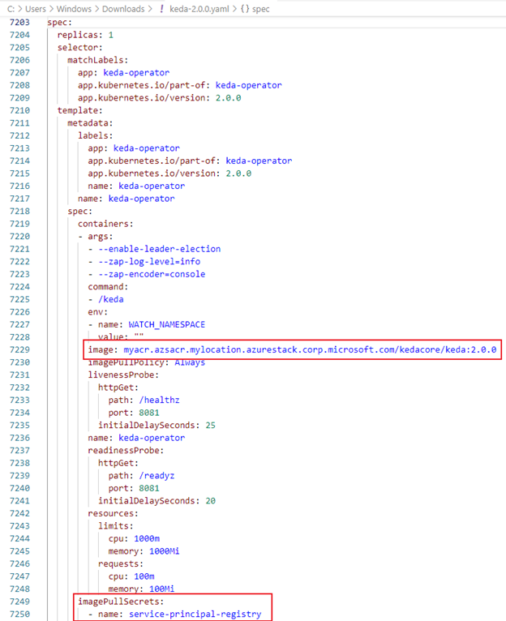
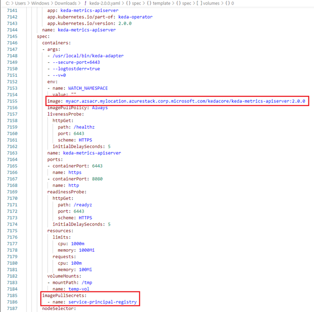
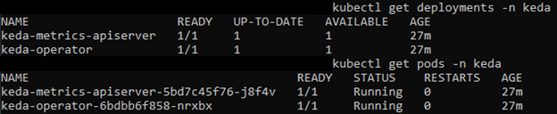
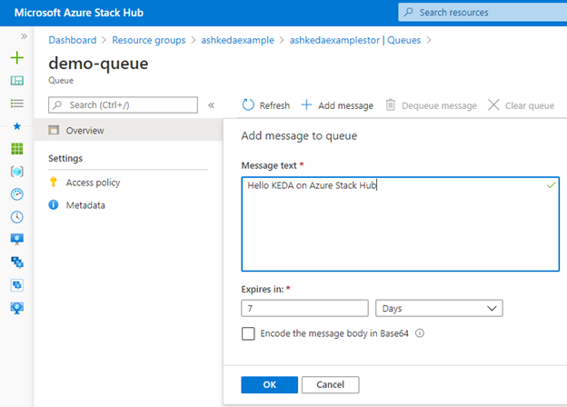
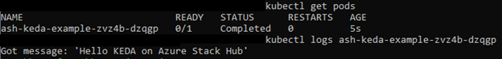

This article shows you how to deploy [Kubernetes Event-driven Autoscaling (KEDA)](https://keda.sh/) to a Kubernetes cluster on a [disconnected Azure Stack Hub](/azure-stack/operator/azure-stack-disconnected-deployment?view=azs-2102),
using Azure Kubernetes Service (AKS) and Azure Container Registry. The same
deployment strategy will work on a connected Azure Stack Hub as well. This
article also shows you how to implement an example of a job that you can scale
with KEDA using an Azure storage queue.

In this solution guide, you will learn how to:

-   Create an AKS cluster on Azure Stack Hub.
-   Create an Azure container registry on Azure Stack Hub.
-   Create a storage account on Azure Stack Hub.
-   Deploy KEDA to AKS and Azure Container Registry on Azure Stack Hub.
-   Deploy an example application to AKS and Azure Container Registry on Azure
    Stack Hub.

## Prerequisites

Before getting started with this development guide, make sure you obtain
operator access or work with your Azure Stack Hub administrator to have access
to do the following:

-   Install AKS and Azure Container Registry on the Azure Stack Hub resource
    provider.
-   Obtain a subscription using an offer type that provides a storage quota.
-   Create a service principal in your directory and set it up for use with
    Azure Stack Hub resources, with contributor access at the Azure Stack Hub
    subscription scope.
-   Provide an [Ubuntu 16.04 Linux image](/azure-stack/operator/azure-stack-download-azure-marketplace-item?view=azs-2102&tabs=az1%2Caz2&pivots=state-disconnected).
-   Obtain access to the Azure Stack Hub user portal with at least contributor
    permissions to the subscription.
-   Create an Ubuntu 16.04 Linux virtual machine (VM) within your Azure Stack
    Hub subscription to use as a jump box.
-   See the following pages to create a VM via the [Azure Stack Hub portal](/azure-stack/user/azure-stack-quick-linux-portal?view=azs-2102), [PowerShell](/azure-stack/user/azure-stack-quick-create-vm-linux-powershell?view=azs-2102&tabs=az1%2Caz2%2Caz3%2Caz4%2Caz5%2Caz6%2Caz7%2Caz8), or [Azure CLI](/azure-stack/user/azure-stack-quick-create-vm-linux-cli?view=azs-2102).

Download the necessary installation files that will be installed on the jump
box:

-   [Azure CLI 2.28.0](/cli/azure/release-notes-azure-cli?tabs=azure-cli).
    Note that this specific version is required to be able to work with AKS and
    Azure Container Registry on Azure Stack Hub.
-   [kubectl](https://kubernetes.io/docs/tasks/tools/install-kubectl-linux/).
    Follow the instructions under “*Download the latest release with the
    command”* to download the installation file.
-   [Docker Community Edition](https://docs.docker.com/get-docker/). Download
    the desired version of containerd, docker-ce, and docker-ce-cli.
-   [KEDA](https://keda.sh/).
-   [.NET Core SDK](/dotnet/core/install/).
    Install on your development workstation (separate from Azure Stack Hub).

## Note about disconnected deployment

When working to deploy an application to a disconnected Azure Stack Hub, all of
the required third-party installation files and the related application
deployment files must be accessible within your Azure Stack Hub.

See the following articles for more information about a disconnected Azure Stack
Hub and options to transfer files:

-   [Azure disconnected deployment planning decisions for Azure Stack Hub integrated systems](/azure-stack/operator/azure-stack-disconnected-deployment?view=azs-2102)
-   [Use data transfer tools in Azure Stack Hub Storage](/azure-stack/user/azure-stack-storage-transfer?view=azs-2102&tabs=az1)

The rest of this article assumes that all the necessary installation files
discussed above have been transferred to a location within your Azure Stack Hub
that is accessible by the Linux VM jump box.

## Install required software on jump box

Before creating and deploying the necessary services, you must install the
following on your jump box:

-   Azure CLI: Run the *sudo apt install azure-cli_xenial_all.deb* command to
    install the file mentioned in the prerequisites.
-   kubectl: Follow these
    [instructions](https://kubernetes.io/docs/tasks/tools/install-kubectl-linux/)
    using the file mentioned in the prerequisites.
-   Docker CE: Follow these
    [instructions](https://docs.docker.com/engine/install/ubuntu/#install-from-a-package)
    to install Docker from a package and then follow the [Docker
    post-installation steps for
    Linux](https://docs.docker.com/engine/install/linux-postinstall/).

## Create storage account, AKS cluster, and Azure container registry via CLI

First, from your jump box, follow the instructions to [connect to Azure Stack
Hub with Azure
CLI](/azure-stack/user/azure-stack-version-profiles-azurecli2?view=azs-2102&tabs=ad-win#connect-with-azure-cli).

Next, create a storage account with a queue to use for this example:

```
RESOURCE_GROUP='ashkedaexample'
LOCATION='myLocation'

# Create a resource group if needed
az group create --name "$RESOURCE_GROUP" --location "$LOCATION"

# Create a storage account
az storage account create --name ashkedaexamplestor --resource-group 
"$RESOURCE_GROUP" --kind Storage --location "$LOCATION" --sku 
Standard_LRS

# Create a storage queue
CONNECTION_STRING=$(az storage account show-connection-string --name 
ashkedaexamplestor --query connectionString)
az storage queue create --name demo-queue --account-name 
ashkedaexamplestor --connection-string "$CONNECTION_STRING"
```

For general information and differences between Azure and Azure Stack Hub, you
can review [AKS Engine on Azure Stack
Hub](https://github.com/Azure/aks-engine/blob/master/docs/topics/azure-stack.md),
and then create a new AKS cluster with one node using a Standard_DS2_v2 VM (2
vCPU, 7 GB RAM). See [Deploy a Kubernetes cluster on Azure Stack Hub with
CLI](/azure-stack/user/azure-stack-kubernetes-aks-engine-deploy-cluster?view=azs-2102#deploy-a-kubernetes-cluster)
for more details.

```
SPN_USERNAME="***"
SPN_PASSWORD="***"

# Create the cluster
az aks create --resource-group "$RESOURCE_GROUP" --name myakscluster -
-dns-name-prefix myakscluster --nodepool-name mynodepool --admin-
username azureuser --service-principal "$SPN_USERNAME" --client-secret 
"$SPN_PASSWORD" --node-count 1 --generate-ssh-keys --load-balancer-sku 
basic --location "$LOCATION"

Finally, create a new Azure Container Registry resource:

az acr create --name myacr --resource-group "$RESOURCE_GROUP" --
location "$LOCATION" --sku Standard --admin-enabled true
```

## Connect to AKS and create Kubernetes secrets

From your jump box, run the following command to use *kubectl* to interact with
your new AKS cluster:

```
az aks get-credentials --resource-group "$RESOURCE_GROUP" --name 
myakscluster –admin
```

Next, create two new Kubernetes secrets that will be used in the deployments to
your AKS cluster. The first secret is a Docker registry secret which will be
used by the deployments to sign in to your new Azure Container Registry using
your service principal application ID and security token/password. This secret
will need to be created in both the default and KEDA namespaces because the
example application built below will be deployed to the default namespace.

```
DOCKER_SERVER="myacr.azsacr.mylocation.azurestack.corp.microsoft.com"

# Docker Server Registry Secret in Default namespace
kubectl create secret docker-registry service-principal-registry --
docker-server="$DOCKER_SERVER" --docker-username="$SPN_USERNAME" --
docker-password="$SPN_PASSWORD"

# Create the keda namespace
kubectl create namespace keda

# Docker Server Registry Secret in keda namespace
kubectl create secret docker-registry service-principal-registry --
namespace keda --docker-server="$DOCKER_SERVER" --docker-
username="$SPN_USERNAME" --docker-password="$SPN_PASSWORD"
```

The second secret will store the connection string for your new storage account.
This will be leveraged in an environment variable in our demo deployment that is
scaled by KEDA. A generic secret is used in this example for simplicity, ease of
use with the KEDA deployment, and because of the level of access required on a
disconnected Azure Stack Hub to be able to view the secret (for instance,
someone must first gain access to the disconnected Azure Stack Hub, then to a
jump box, and to a user sign-in to be able to communicate with AKS via Azure
CLI).

```
# Generic Secret for Storage Account
CONNECTION_STRING=$(az storage account show-connection-string --name 
ashkedaexamplestor --query connectionString | sed -e 's/^"//' -e 
's/"$//')
kubectl create secret generic storage-account --from-
literal=connection-string="$CONNECTION_STRING"
```

## Save KEDA Docker images locally

Prior to deploying KEDA to your newly created AKS and Azure container registry,
you must first pull down and save the Docker images to your development
workstation used in the KEDA operator and metrics adapter deployments. These
will need to be deployed to your Azure container registry on your disconnected
Azure Stack Hub for KEDA to work properly.

```
# KEDA Operator
docker pull docker.io/kedacore/keda:2.0.0
docker save kedacore/keda | gzip > keda.tar.gz
# KEDA Metrics API Server
docker pull docker.io/kedacore/keda-metrics-apiserver:2.0.0
docker save kedacore/keda-metrics-apiserver | gzip > keda-metrics-
apiserver.tar.gz
```

## Edit KEDA v2.0.0 deployment file

You can use a single deployment file, *keda-2.0.0.yaml*, to deploy the KEDA
operator and metrics API server to AKS. The following edits will need to be made
to reference images on your Azure container registry and to utilize
*imagePullSecrets* to authenticate with your Azure container registry.

Below, you see a screenshot on how to deploy the KEDA operator:



The following screenshot shows the changes needed to deploy the metrics API
server:



## Deploy KEDA images to Azure Container Registry

Once you have copied the KEDA images you saved on your development workstation
to a location accessible from your jump box on Azure Stack Hub, you can tag and
push your images to your Azure container registry using the following commands:

```
# Load the Docker images
zcat keda.tar.gz | sudo docker load
zcat keda-metrics-apiserver.tar.gz | sudo docker load

# Tag the Docker images
docker tag kedacore/keda:2.0.0 "$DOCKER_SERVER"/kedacore/keda:2.0.0
docker tag kedacore/keda-metrics-apiserver:2.0.0 
"$DOCKER_SERVER"/kedacore/keda-metrics-apiserver:2.0.0

# Login to ACR
az acr login --name myacr

# Push the Docker Images
docker push "$DOCKER_SERVER"/kedacore/keda:2.0.0
docker push "$DOCKER_SERVER"/kedacore/keda-metrics-apiserver:2.0.0
```

## Deploy KEDA to AKS

From your jump box, run the following commands to deploy KEDA to your AKS
cluster:

```
kubectl apply -f keda-2.0.0.yaml
```

Then use kubectl to validate that KEDA was deployed successfully and that the
operator and metrics adapter were able to pull their respective images from your
Azure container registry.

```
kubectl get deployments -n keda
kubectl get pods -n keda
```



## Build example app to be scaled by KEDA

On your development workstation, execute the following command to create a new
.NET Core application:

```
dotnet new console --name ASHKEDAExample -o App
```

Next, replace the contents of the *App\\ASHKEDAExample.csproj* file with the
following:

```
<Project Sdk="Microsoft.NET.Sdk">
  <PropertyGroup>
    <OutputType>Exe</OutputType>
    <TargetFramework>netcoreapp3.1</TargetFramework>
    <TargetName>ASHKEDAExample</TargetName>
  </PropertyGroup>
  <ItemGroup>
    <PackageReference Include="Azure.Storage.Queues" Version="12.6.2" />
  </ItemGroup>
</Project>
```

Finally, replace the contents of the *App\Program.cs* file with the following:

```
using System;
using Azure.Storage.Queues;
using Azure.Storage.Queues.Models;

namespace ASHKEDAExample
{
    class Program
    {
        static void Main(string[] args)
        {
            string storageConnectionString = 
Environment.GetEnvironmentVariable("AZURE_STORAGE_CONNECTION_STRING");
            if(storageConnectionString == null || 
storageConnectionString.Length == 0){
                Console.WriteLine("AZURE_STORAGE_CONNECTION_STRING not 
set");
                return;
            }
            
            const string queueName = "demo-queue";
            var message = "no-message";

            QueueClient queueClient = new 
QueueClient(storageConnectionString, queueName);

            if (queueClient.Exists())
            { 
                QueueMessage[] retrievedMessage = 
queueClient.ReceiveMessages();
                if(retrievedMessage.Length > 0){
                    message = retrievedMessage[0].MessageText;
                    Console.WriteLine($"Got message: 
'{retrievedMessage[0].MessageText}'");

queueClient.DeleteMessage(retrievedMessage[0].MessageId, 
retrievedMessage[0].PopReceipt);
                } else {
                    Console.WriteLine($"No Message in queue 
{queueName}");
                    return;
                }
            }  
        }
    }
}
```

Now that the example application has been created, we will create a Dockerfile
that will build the example project so that it can be deployed to Azure
Container Registry on Azure Stack Hub. To do that, create a new directory called
container at the same level as *App* and within the directory create a new file
entitled *Dockerfile*. The following should be pasted into Dockerfile:

```
# https://hub.docker.com/_/microsoft-dotnet
FROM mcr.microsoft.com/dotnet/sdk:3.1 AS build
WORKDIR /source

# copy csproj and restore as distinct layers
COPY *.csproj .
RUN dotnet restore

# copy everything else and build app
COPY Program.cs .
RUN dotnet publish --self-contained --runtime linux-x64 -c release -o 
/app

# final stage/image
FROM mcr.microsoft.com/dotnet/runtime:3.1
WORKDIR /app
COPY --from=build /app ./
```

Note that your working directory should have the following structure:  


Build your application into your Docker image and save the Docker image so that
it can be transferred to a location on your Azure Stack Hub that is accessible
by the jump box.

```
cd App
docker build -t ash-keda-example:latest -f ../container/Dockerfile .
docker save ash-keda-example:latest | gzip > ash-keda-example.tar.gz
```

## Deploy example app image to Azure Container Registry

Once you have copied the KEDA images that were saved on your development
workstation to a location accessible from your jump box on Azure Stack Hub you
can tag and push your images to your Azure container registry using the
following commands:

```
# Load the Docker images
zcat ash-keda-example.tar.gz | sudo docker load

# Tag the Docker images
docker tag ash-keda-example:latest "$DOCKER_SERVER"/ash-keda-example:latest

# Login to ACR
az acr login --name myacr

# Push the Docker Images
docker push "$DOCKER_SERVER"/ash-keda-example:latest
```

## Deploy example app to AKS

Create a new file named *ash-keda-example.yaml* (this can be created via an
editor directly on the jump box, or it can be transferred from your development
workstation) and paste the following into the file:

```
apiVersion: keda.sh/v1alpha1
kind: ScaledJob
metadata:
  name: ash-keda-example
  namespace: default
spec:
  pollingInterval: 10
  maxReplicaCount: 4
  jobTargetRef:
    parallelism: 1
    completions: 1
    activeDeadlineSeconds: 600
    backoffLimit: 6
    template:
      spec:
        containers:
        - name: ash-keda-example
          image: myacr.azsacr.mylocation.azurestack.corp.microsoft.com/ash-keda-
example:latest
          resources:
            requests:
              memory: "1Gi"
              cpu: "1000m"
            limits:
              memory: "2Gi"
              cpu: "1950m"
          command: ['sh', '-c', '/app/ASHKEDAExample']
          env:
          - name: AZURE_STORAGE_CONNECTION_STRING
            valueFrom:
              secretKeyRef:
                name: storage-account
                key: connection-string
        imagePullSecrets:
        - name: service-principal-registry
  triggers:
  - type: azure-queue
    metadata:
      queueName: demo-queue
      queueLength: '1'
      connectionFromEnv: AZURE_STORAGE_CONNECTION_STRING
      accountName: ashkedaexamplestor
```

From your jump box, you can run the following commands to deploy KEDA to your
AKS:

```
kubectl apply -f ash-keda-example.yaml
```

Note that you will not see any pods until a new message is added to your Azure
storage queue.

## Create message in Azure storage queue to test example app

Add a new message to your demo-queue to test your example app deployment. You
should see the message removed from the queue and see the message reflected in
the pod logs for ash-keda-example on your AKS cluster.



Check the pod logs with the following commands:

```
kubectl get pods # Copy the most recent ash-keda-example pod name 
into the next line
kubectl logs <most recent ash-keda-example pod name>
```



## Clean up resources

You can run the following commands from the jump box on Azure Stack Hub to
delete the resources created during this tutorial:

```
az aks delete --name myakscluster --resource-group "$RESOURCE_GROUP" -
y
az acr delete --name myacr --resource-group "$RESOURCE_GROUP" -y
az storage account delete --name ashkedaexamplestor --resource-group 
"$RESOURCE_GROUP" -y
az group delete --name "$RESOURCE_GROUP" -y
```

The jump box VM can be deleted through the Azure Stack Hub portal. Additionally,
you should delete any Docker images on your development workstation that you no
longer want via the *docker rmi* command.

## Next steps

Azure Architecture Center guides:

-   [Configure hybrid cloud connectivity using Azure and Azure Stack Hub](/azure/architecture/hybrid/deployments/solution-deployment-guide-connectivity)
-   [Deploy a high availability Kubernetes cluster on Azure Stack Hub](/azure/architecture/hybrid/deployments/solution-deployment-guide-highly-available-kubernetes)

Product documentation:

-   [Azure Stack Hub](https://azure.microsoft.com/products/azure-stack/hub/#overview)
-   [Azure Container Registry](/azure/container-registry/container-registry-intro)
-   [Azure Kubernetes Service (AKS)](/azure/aks/intro-kubernetes)

Microsoft Learn learning paths:

-   [Introduction to Azure Stack](/learn/modules/intro-to-azure-stack/)
-   [Introduction to Kubernetes on Azure](/learn/paths/intro-to-kubernetes-on-azure/)
-   [Architect modern applications in Azure](/learn/paths/architect-modern-apps/)

## Related resources

-   [Azure Stack Hub overview](/azure-stack/operator/azure-stack-overview?view=azs-2102)
-   [What is the AKS engine on Azure Stack Hub?](/azure-stack/user/azure-stack-kubernetes-aks-engine-overview?view=azs-2102)
-   [Support policies for AKS engine on Azure Stack Hub](/azure-stack/user/azure-stack-kubernetes-aks-engine-support?view=azs-2102)
