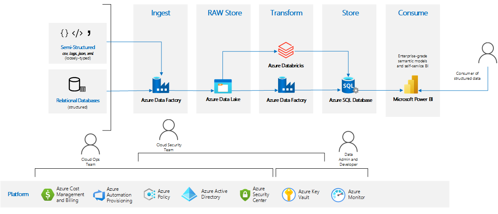
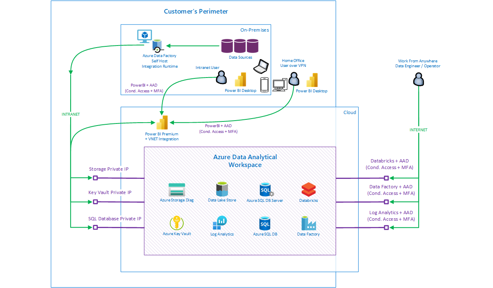

<!---
Comment: DONE
#Introductory section - no heading

#> This should be an introduction of the business problem and why this scenario was built to solve it.
#>> What industry is the customer in?
#>> What prompted them to solve the problem?
#>> What services were used in building out this solution?
#>> What does this example scenario show? What are the customer's goals?

#> What were the benefits of implementing the solution described below?
-->

In recent years, the demand for business users capability to consume, transform, model, and visualize large amounts of complex data from multiple heterogenous sources has increased dramatically. To meet this demand in a cost effective, scalable way many large companies have benefitted from moving to cloud-based data platforms. This move allows companies to leverage the economy of scale the cloud provides to achieve lower total cost of ownership and faster time to value from data. Regulated industries are no exception to this as these companies need to store and process vast amounts of highly sensitive data (e.g., protected health information) every day. However, due to the sensitive nature of this data, there are many regulations (e.g., HIPAA) in place to constrain the methods for storing, transporting, and processing the data. As a result of this, regulated industries have been hesitant to adopt cloud-based data platforms due to the large financial penalties for a regulatory violation as well as the perceived loss of control that comes from moving to a cloud-based platform. 

The worldwide COVID-19 pandemic changed all of this as many regulated industries on-premises data platforms were largely unable to cope with the increased workload coming as a direct result of the pandemic. While these companies are now embracing cloud-based data platforms, they are typically doing so in two extreme ways. Either with highly complex and detailed security requirements or with limited knowledge of security capabilities and practices in cloud. This makes rapid deployment of services and solutions challenging as many security options can be disabled, overlooked or simply ignored, leaving these companies open to regulatory action (e.g., financial penalties) if left unchecked.

The Infrastructure Accelerator pattern is designed to ameliorate this issue by tackling data analysis workloads in regulated industries. This pattern is specifically designed to help ensure the detailed security and privacy requirements of different regulated industries are met by leveraging configurable, template based service deployment automation. All build on Azure managed services to reduce management overhead. Specifically, the pattern focuses on high quality security standards, auditing, monitoring key protection, encryption capabilities, and tight integration with security perimeters (when applicable). You can think about this guidance as Enterprise Ready plug-able infrastructure building block for Data Analytics workloads utilizing Microsoft Best Practices for Landing Zones.
Users of this pattern will have the flexibility to choose which data processing services (e.g., Azure Data Factory, Azure Databricks, Azure Synapse Analytics) they want to use with the comfort of knowing the services will be deployed using both Microsoft best practices for Landing Zones as well as any company specific policy requirements. In short, we believe that all customers from regulated industries will benefit from this pattern and infrastructure deployment accelerator tools.

Some of the key benefits of this pattern are:

- Speed of deployment and consistency between projects and environments (DEV/TEST/STG/PROD).
- Coverage of major data analysis use cases ETL/ELT + PowerBI (Ingestion/Transformation/Storage/Data Lake/SQL/PowerBI).
- Focus on automated support of enterprise-grade security standards.
- Strong support for auditing, monitoring and diagnostics data.
- Constraint of network communication to network/security perimeters (when applicable).
- Easy consumption of data sources from inside perimeter along with cloud-based data analysis.
- Benefit from cloud managed services with reduced management and operation overhead.
- Seamless integration with cloud native tools (e.g., Power Platform).
- Automated protection and encryption of storage containing potentially sensitive data.
- Secure protection of keys and credentials.
- Designed to support easy customer-based customization
- No Azure landing zone needed but can integrate seamlessly, including hub-and-spoke network topology.

## Potential use cases

<!---
Comment: DONE
#> Are there any other use cases or industries where this would be a fit?
#> How similar or different are they to what's in this article?
-->

Any customer looking for PaaS solution for Data and AI workloads plus visualization (ETL/ELT + PowerBI)
integrated with network perimeter and with focus on high security standards,
protecting data, Auditing, Monitoring should benefit from this pattern.

<!---
Comment: DONE
#These other uses cases have similar design patterns:

#- List of example use cases
-->

- Regulated industries generally
- Financial sector
- Healthcare clinical trials
- Financial reporting and financial departments
- Supply chain management
- Manufacturing

## Architecture

<!---
Comment: DONE
#_Architecture diagram goes here_

#> What does the solution look like at a high level?
#> Why did we build the solution this way?
#> What will the customer need to bring to this?  (Software, skills, etc?)

#Under the diagram, include a numbered list that describes the data flow or workflow.
-->

The following diagram shows a high level overview of the architecture for the infrastructure accelerator for data analysis workloads in regulated industries. As this pattern is targetted for use in highly regulated industries, our primary focus is to provide a high degree of security at all levels from storage to transport to use. 

#Focus is to provide the highest security level as this deployment pattern is used in Highly Regulated Industries.

#In upper part you can see the capabilities of the pattern. Items like input and target data sources (can be in cloud or onPrem), ingestion area, storing and snapshot data (versioning) in raw and cheap way, transform raw data, storing optimized data in structured way and with metadata for consumers and consume capabilities through front ends.

In the upper part you can see the capabilities of the pattern. This includes elements such as target data sources (cloud or on-premise), ingestion areas, snapshot data, transformed data, optomized data storage, metadata storage, and front-end consumption capabilities.

The bottom part on the other hand is showing the responsibilities of the different IT roles that are typically involved with cloud-data analysis workloads.

This architecture provides state-of-the-art data analysis capabilities without sacrificing governance or security capabilities.

Implementation of this pattern requires specific skills including:
#Implementation of such architecture and pattern in full range with major benefits requires specific skill-set like:

- An understanding of how to configure, monitor and operate the Azure cloud. This includes governance models, security, policies, landing zones and automation in Azure.
- An understanding of how to configure and monitor cloud networking, private links, DNS, routing, access control lists, firewalls, and VPN integrations.
- An understanding of how to monitor cloud security, security incidents, and constantly evaluate security threads.
- An understanding of Azure data tools such as Azure Data Factory, Azure Databricks, Azure Data Lake Storage, and Azure SQL Database. The ability to integrate data components (ETL/ELT), create semantic models, and use different data formats (e.g., parquet, AVRO, CSV).
- End users familiar with the use of Power BI for self service reporting.

Description of implementation workflow:

- Infrastructure and Governance model:
  - The cloud ops team provisions in a repeatable and consistent way, the data analysis environment with existing optimized security
  settings for regulated industries through an automated, parametrized process. Existing scripts with optional modifications based on enterprise specific standards and policies can be used for this task. Once deployed, the team can start to see security compliance reports as well as billing information for the deployed environment.
  - The network team typically integrates the environment with enterprise network (ideally following the hub-and-spoke model with an enterprise firewall), enables private links for endpoints, and starts network traffic monitoring. Here, the integration of Microsoft Power BI with the virtual network (to use private traffic) is highly recommended.
  - The cloud security team reviews the infrastructure through either built-in or enterprise-specific Azure policies, reviews the security score of the environment in Azure Advisor/Azure Security Center. The security team can also own and maintain credentials stored in the Azure Key Vault to specific data source systems along with any encryption keys. Finally, the security team can also start to monitor audit information stored in the central Log Analytics Workspace.
- Usage and Data Analysis Capabilities:
  - Data administrators/data developers can develop ETL/ELT pipelines and semantic models for self-service BI. This covers the complete data preparation life cycle (i.e., Ingest/Store/Transform/Serve).
#  - Data administrators/data developers can develop ETL/ELT pipelines and semantic models for self-service BI. This covers the complete data preparation life cycle (Ingest/Store/Transform/Serve in Optimized Model/Consume).
  - Business users can start to consume and present data through business-focused semantic models prepared by data developers. This is typically done through front end applications like Microsoft Power BI or custom applications but third party applications can be used as well.

The following diagram shows a component based view along with an example integration with an enterprise environment.

### Description of Pattern and Architecture in Details

Business users need to present, consume, slice and dice data in quickly on multiple devices from multiple places. Ideally on data model which is optimized (transformed) for the data domain they are aligned to.

To achieve this, you typically need a scalable, heterogenous data ingestion process to ingest data from multiple data sources in raw format (typically coming from an on-premise source). This data needs to be stored cost effectively, typically with multiple versions and historical snapshots. Next, the data needs to be cleaned, combined, pre-aggregated and stored for downstream consumption. The final version of the data typically is stored in a serving layer with indexing capabilities for speed for access although non-indexed storage can also be used. Lastly, data security mechanisms (e.g., masking, encryption) should be applied to data which should not be seen by users from other geo regions or departments. Specifically, the security team needs to understand (propagate security context) who can view (or consume) data in different ways and ensure you are filtering data for users based on roles. It is highly recommended to do this using automated security mechanisms such as Role Based Access Control and Row Level Security as opposed to manually filtering data. 

#, database engine should do it for you based on roles.
#To achieve this, you typically need a scalable, heterogenous data ingestion process to ingest data from multiple data sources in raw format (typically coming from an on-premise source). Store them to cheap storage in multiple versions and with history, clean data, combine data Together, pre-aggregate data and store them again in structured way with indexing capability to provide speed for access. You probably also want to mask data and secure/hide data which should not be seen by users from other geo regions or departments.

_**Business Users needs to present, consume, slice and dice data in quick way on multiple devices from multiple places**_

This can be achieved by easy-to-use PowerBI reporting tool, which can be used from anywhere and on multiple platforms and devices.

PowerBI runs in the cloud as a managed service. The service can be also integrated with perimeter for access from devices and can also access data sources which are part of perimeter (on-premises or in cloud via private link).

Using the PowerBI gateway for perimeter access is not recommended as the PowerBI gateway typically multiplexes users to one service identity and thus can undermine the security model of the data serving tier. 
#context against target database which is important to preserve.

PowerBI also supports integration with Azure Active Directory (cloud identity) as well as advanced security features. Both identity and security context can be propagated through PowerBI to the database engine allowing the engine to use native filtering capabilities based on the role accessing user belongs to.

For example, users from mobile devices outside the perimeter need to access predefined, optimized reports which access and render sensitive data from data sources hosted inside the perimeter. Our implementation first has users establish VPN connectivity, if necessary, and then prompted to authenticate to the PowerBI service. Once verified with MFA the PowerBI rendering engine will pass the user's identity to the target database hosted inside the perimeter. The database can then verify the accessing user and understand user's role/security group, applying query/data filtering as required by the security policy for that user.

_**Need to get data in scalable way from multiple data sources in raw format (typically sitting on-prem), store them in scalable way with huge volumes to cheap storage in multiple versions and with history**_

PowerBI ideally needs to consume optimized data models for specific data domain in order to improve the user experience, reduce waiting time, and improve data model maintenance. To produce these models, users typically need to run a process which will ingest data from multiple data sources in raw format and store that data for further processing. Although there are many ways to do this, our approach recommends Azure Data Factory for this job. 
#- Easy to use ETL tool along with Azure Storage in Azure Data Lake (Hierarchical namespace) mode.

Azure Data Factory is a managed PaaS service which allows users to connect to many data sources using over 90 (and still growing) supported connectors in multiple file formats. The main interfance for Azure Data Factory is the workspace where ETL process can be designed and executed at scale using a drag-and-drop interface. The workspace can be accessed from anywhere the access policy, specified by security administrators, allows. Finally, Data Factory need to provides accesses to data sources outside of Azure (i.e., on-premise) without punching holes into the enterprise firewall using the Self-Hosted Integration Runtime. This component is installed in the on-premises environment (physical or virtual machine) and should be deployed in a location allowed to send outgoing communication to Azure. After this is done, Azure Data Factory can use the Self-Hosted Integration Runtime to ingest data from valid data sources inside organizations and process them in Azure.

#by specific associated and only allowed Azure Data Factory instance.

# Similar approach like accessing O365 workspace.
#Azure Data Factory understands and can store data in multiple file formats.
#Azure Data Factory can access data and store them in scalable manner as snapshots to Azure Data Lake Storage. 

#Basically, get data in scalable way from anywhere and store them in raw format to Azure Data Lake Storage in versioned way so more sophisticated data models can be built based on such data.

#Azure Data Lake Storage is a cost effective, practically unlimited storage space where data can be stored in raw formats, in multiple versions (e.g daily snapshots) and storage is providing very secure (Role Based Access Control) way to store data. This storage is also optimized for support of massive parallel processing of data. To provide even better security story, Azure Data Lake Storage is part of perimeter without exposing any public endpoint.

Azure Data Lake Storage is a cost effective, cloud-native storage service capable of securely storing in verious formats. In addition, Azure Data Lake Storage supports storing multiple versions (e.g daily snapshots) of data and supports Role Based Access Control while being optimized to support of massive parallel processing of data (e.g., using Spark). Finally, Azure Data Lake Storage supports private endpoints, allowing data to be stored/retrieved without traveling over a public endpoint.

Using our pattern, cloud storage (e.g., Azure Data Lake Storage) is not typically accessed directly by PowerBI (although direct access is technically possible and supported). Instead, Storage is both a long-term storage and short-term staging area for data transformation tools (e.g., Spark). PowerBI accesses the transformed data created from these tools typically using a service better suited to serving and indexing large amounts of data (e.g., Azure Dedicated SQL Pools) 

#working with more structured and optimized domain driven data source built from raw data from storage.

_**Store data in structured way with indexing capability to provide speed for access. Data model which is optimized (transformed) for data domain data are aligned to.**_

Once the data, along with any snapshots, are available in cost-effective object storage (e.g., Azure Data Lake Storage), it is necessary to transform the data to the desired form. A difference here compared to older approaches to ETL/ELT is all raw data is typically stored as opposed to only storing the final version/form of the data. This allows existing data models to be quickly updated as requirements change, without requiring a reload from the initial source system.

#in raw, versioned, and complete form, it's time to transform them to the most useful product. As domain data model expectations changes during a time it's very useful to keep data in complete - raw form and with history. This allows at any point in time to introduce new dimension or attribute to domain data model with projection to the history.
#Once the data are snapshot and available in cheap storage in raw, versioned, and complete form, it's time to transform them to the most useful product. As domain data model expectations changes during a time it's very useful to keep data in complete - raw form and with history. This allows at any point in time to introduce new dimension or attribute to domain data model with projection to the history.

ADAW supports transformation of data primarily using Azure Data Factory, Azure Databricks, and Azure Synapse Analytics. Each service is scalable and provides a rich transformational environment complete with features and adapters.

Our solution was designed for reading data from Azure Data Lake Storage through private endpoint (part of perimeter), cleaning/normalizing data at scale, transforming at scale, aggregating/merging/combining data at scale and with cost control. More concretely, fast transformations can be done with more compute power for higher cost while slower transformation can be done with less compute power for a lower cost. Finally, storage of the cleaned/transformed/aggregated and domain optimized data is done using a highly structured database with indexed data and business/domain specific vocabulary (e.g., Azure SQL Database).
#Our solution was designed for reading data from Azure Data Lake Storage through private endpoint (part of perimeter), cleaning/normalizing data at scale, transforming at scale, aggregating/merging/combining data at scale and with cost controli. More concretely,  (Azure Data Factory and/or Azure Databricks - fast transformation with more horse power for higher cost vs slower transformation with less power for better price) and storing cleaned/transformed/aggregated and domain optimized data to highly structured database with indexed data and business/domain specific vocabulary (Azure SQL Database).

Azure Databricks should be deployed with Premium SKU to enable advanced security features like RBAC for Cluster, Jobs, Notebooks and Azure AD passthrough. Also, Azure Databricks Virtual Network integrated with data sources and perimeter and firewall for egress control should be enabled.

Azure Data Factory and Azure Databricks workspace (not data) can be accessed through a public endpoint with Azure Active Directory authentication and enabled conditional access.

Azure SQL Database in this solution plays a key role as data source consumed by PowerBI clients. The model is optimized for business domain, for PowerBI reports, with the correct business terminology and attributes and security trimming done at the database engine level through native capabilities. In addition, PowerBI is configured in the way to consume data over private endpoints from Azure SQL Database (point-to-point) and ingest data from Azure Databricks / Azure Data Factory Self Host Integration Runtime to improve security posture.

_**Mask data and secure/hide data which should not be seen by users from other geo regions or departments.**_

Data stored in the business data domain database (e.g., Azure SQL Database) will likely contain data across whole organization and with sensitive data. It is important to allow access only to subset of data based on the roles of an accessing user and typically, data crosses regions from different units in different geo locations. Filtering manually in code is error prone and while filtering in reports itself can also be problematic and therefore these approaches should be avoided. Instead filtering based on security context should be done purely on the database level. This will force all other consuming tools (including reporting tools) to receive already filtered data. To enable this, accessing tools should pass the identity of a viewing user instead of service accounts, allowing the system to stay compliant with any auditing and traceability requirements.

Azure SQL Database implements such native features on the database engine level (row-level security) which makes implementation of a centralized security filtering and auditing model easier. Although this requires propagating the security context from the viewing user to the database level, PowerBI can understand and propagate the security context (user's cloud identity) to the business data domain database. That database is able to use that identity to authenticate, authorize, and filter data for the user based on the identity or roles that user belongs to.

### Components

<!---
Comment: DONE
#A bulleted list of components in the architecture (including all relevant Azure services) with links to the service pages.
#> Why is each component there?
#> What does it do and why was it necessary?
#> Link the name of the service (via embedded link) to the service's product service page. Be sure to exclude the localization part of the URL (such as "en-US/").

- Examples: 
  - [Azure App Service](https://azure.microsoft.com/services/app-service)
  - [Azure Bot Service](https://azure.microsoft.com/services/bot-service)
  - [Azure Cognitive Services Language Understanding](https://azure.microsoft.com/services/cognitive-services/language-understanding-intelligent-service)
  - [Azure Cognitive Services Speech Services](https://azure.microsoft.com/services/cognitive-services/speech-services)
  - [Azure SQL Database](https://azure.microsoft.com/services/sql-database)
  - [Azure Monitor](https://azure.microsoft.com/services/monitor): Application Insights is a feature of Azure Monitor.
  - [Resource Groups][resource-groups] is a logical container for Azure resources.  We use resource groups to organize everything related to this project in the Azure console.
-->

Key Components and services used in this pattern:

- [Azure Data Lake Store Generation 2](https://azure.microsoft.com/services/storage/data-lake-storage): Storage for business data with snapshots in raw and versioned format.
- [Azure SQL Database](https://azure.microsoft.com/products/azure-sql/database): Serving relational data layer as data source consumed by PowerBI clients
- [Azure Databricks](https://azure.microsoft.com/services/databricks): Data Transformation engine. Allows you to spin up clusters and build quickly in a fully managed Apache Spark environment.
- [Azure Data Factory](https://azure.microsoft.com/services/data-factory): Data integration and transformation ETL/ELT layer.
- [Azure Blob Storage](https://azure.microsoft.com/services/storage/blobs): Storage for diagnostics, infrastructure logs and audit data. Business data should not be stored in blob storage next to the diagnostics data.
- [Azure Key Vault](https://azure.microsoft.com/services/key-vault): Store, Protect keys and credentials in secure place and monitor operations and access to it.
- [Azure Monitor and Log Analytics Workspace](https://azure.microsoft.com/services/monitor): Monitor environment, diagnostics info, performance, view audit logs, vulnerability scans, traffic flows and let the platform send events for critical issues.
- [Power BI or Power BI Premium + VNET Integration - Optional](https://docs.microsoft.com/data-integration/vnet/use-data-gateways-sources-power-bi): Import or direct query datasets to connect to data services within an Azure VNet without the need of an on-premises data gateway.
- [Azure Data Factory Self Host Integration Runtime - Optional](https://docs.microsoft.com/azure/data-factory/create-self-hosted-integration-runtime): Can run activities between a cloud data store and a data store in a private network. It also can dispatch transform activities against compute resources in an on-premises network or an Azure virtual network.

### Alternatives

<!---
Comment: DONE
#Use this section to talk about alternative Azure services or architectures that you might consider for this #solution. Include the reasons why you might choose these alternatives.

#> What alternative technologies were considered and why didn't we use them?
-->

There is overlap between what this pattern provides with what is available in the Azure Synapse Analytics product. Whenever possible, the use of Azure Synapse Analytics is preferred. However, in regulated industries in particular, some customers cannot use/deploy Azure Synapse Analytics for a variety of reasons; in those cases this pattern can help compared to manually deploying a custom data analytics stack.

See [Enterprise Data Warehouse Architecture](/azure/architecture/solution-ideas/articles/enterprise-data-warehouse) as alternative solution to this pattern.

## Considerations

<!---
Comment: DONE
#> Are there any lessons learned from running this that would be helpful for new customers?  What went wrong when building it out?  What went right?
#> How do I need to think about managing, maintaining, and monitoring this long term?
#> Note that you should have at least two of the H3 sub-sections.
-->

#DJ Comment: I don't unerstand this
In general, try to avoid configuring Azure policies to prevent deployments when security requirements are not met. Prefer audit mode and monitoring resources which are not compliant or Azure policies with auto remediation steps.

Provide to users the autonomy so they are not limited with various capabilities. Specifically, users should be enabled to be productive and demonstrate value quickly instead of being focused on plumbing, troubleshooting permissions, network connectivity, blocked network ports, Azure endpoints etc.

### Availability

<!---
Comment: DONE
#> How do I need to think about managing, maintaining, and monitoring this long term?
-->

This architecture pattern is based at managed Azure services with built-in HA according to the specific SLAs. Prefer Zone redundancy options where available (like storage for example). Geo redundancy is not utilized in this current architecture.
Consider how mission critical is ingestion process and how mission critical is consumption process. It might have different criticality requirements and cost options.

### Operations

<!---
Comment: DONE
#> How do I need to think about operating this solution?
-->

Typical list of operations on this pattern:

- Identity Team - Monitor Azure Active Directory Identity Protection, MFA, Conditional Access
- Cloud Ops Team - Monitor and operate Azure cloud, governance model, Billing, security, Azure policies, landing zone
- Cloud Network Team - Monitor cloud networking, routing, access control lists, firewall, network traffic
- Cloud Security Team - Monitor cloud security, security incidents, constantly evaluating security threads, security recommendations, security score, enforce security standards, key vault and credentials
- Solution Owner Team - Monitor performance of the solution, diagnostics logs, Troubleshooting

### Performance

<!---
Comment: DONE
#> Are there any key performance considerations (past the typical)?
-->

This architecture pattern is based at managed Azure services with built-in and flexible performance options which allows users to find the right balance between speed and cost.

There may be performance challenges related to Azure VMs (used by Azure Databricks - make sure to select appropriate SKU size), network throughput, bandwidth, latency, limits of host of Azure Data Factory Self Host Integration Runtime.

Azure SQL Database has some artificial performance and scalability limits - depends on selected SKU. This can be changed any time later based on utilization.

### Scalability

<!---
Comment: DONE
#> Are there any size considerations around this specific solution?
#> What scale does this work at?
#> At what point do things break or not make sense for this architecture?
-->

This architecture pattern is based on managed Azure services with built-in scalability features allowing users to find right the balance between speed and cost.

This solution can work with petabytes of data.

If data ingestion is done from on premises data sources (e.g., through Azure Data Factory Self Host Integration Runtime), bandwidth can be a limiting factor along with the latency of the VPN network and compute power of Self Host Integration Runtime machine.

Address range / Size of virtual network for Data Analytical Workspace can limit number of VMs used by Azure Databricks.

### Security

<!---
Comment: DONE
#> Are there any security considerations (past the typical) that I should know about this? 
-->

Consider following security monitoring and practices:

- Use Azure Active Directory Identity Protection, configure MFA, Conditional Access and Monitor Azure Active Directory
- Use Azure Security Center to monitor environments, recommendations, security score and potential issues and incidents
- Use Azure Policies to monitor and Enforce security standards
- Use and Monitor Diagnostic settings, vulnerability scans, traffic flows and Auditing Logs, forward logs to SIEM
- Monitor Network traffic, routing, firewall, access control list and keep traffic in perimeter through private link and VPN feature
- Store Credentials, Keys and secrets in Key Vault, limit access to Key Vault to limited number of people, do keys rotations and monitor operations and access to Key Vault

### Resiliency

<!---
Comment: DONE
#> Are there any key resiliency considerations (past the typical)?
-->

This pattern builds on Azure PaaS services hosted in one specific region. It might be beneficial to utilize other Azure regions as well to increase resiliency of this solution but that comes with the cost of additional complexity. Geo redundancy is currently out of scope of this pattern.

### DevOps

<!---
Comment: DONE
#> Are there any key DevOps considerations (past the typical)?
-->

Not observed

## Deploy this scenario

<!---
Comment: DONE
#> (Optional, but greatly encouraged)
#>
#> Is there an example deployment that can show me this in action?  What would I need to change to run this in production?
-->

To implement this pattern go to the link to the project page: [Azure Data Analytical Workspace (ADAW) - Reference Architecture 2021 for Regulated Industries](https://github.com/jbinko/ADAW).
The link includes deployment scripts, to successfully deploy workspace for data analysis based on Azure services.

The Data Analytical Workspace can be deployed automatically using the provided, cloud-native scripts. This provides users with a consistent experience with a focus on high quality security standards. Approve once, deploy multiple times in the same secure way.

## Pricing

<!---
> How much will this cost to run?
#> Are there ways I could save cost?
> If it scales linearly, than we should break it down by cost/unit. If it does not, why?
#> What are the components that make up the cost?
#> How does scale affect the cost?
>
> Link to the pricing calculator with all of the components in the architecture included, even if they're a $0 or $1 usage.
> If it makes sense, include small/medium/large configurations. Describe what needs to be changed as you move to larger sizes.
-->

The majority of components in this Architecture are based on Azure services with pay-as-you-go model.
Services like Azure Databricks, Azure Data Factory, Azure Key Vault, Virtual Network, Azure Monitor have low or no cost until execution of the calculation operation is started.

For Azure Data Lake Store and Azure Blob Storage cost depends on how much data is stored in the storage. Storage cost is not typically a factor for bigger enterprises unless you need to deal with tenths of terabytes and more.

Cost for Azure SQL Database depends on SKU and might be flat cost or cost per use, size of SQL and amount of data.

Log Analytics Workspace can incur some significant cost for data collected and stored in the workspace. Consider enabling retention policies for the data stored in a workspace.

Data transfer cost incurs for traffic leaving Azure Datacenter (Egress). No any cost for ingress.

VPN Connectivity like Azure Express Route or Site-2-Site connectivity is typically shared infrastructure cost.

Azure Data Factory Self Host Integration Runtime is typically hosted in the private data center and thus separated from Azure cost.

Consider Azure reservation options for Compute and Storage to optimize cost of the solution when needed.

PowerBI cost has per user model separated from Azure cost. PowerBI premium has different pricing model also separated from Azure cost.

## Next steps

<!---
Comment: DONE
#> Where should I go next if I want to start building this?
#> Are there any reference architectures that help me build this?
#> Be sure to link to the Architecture Center, to related architecture guides and architectures.
 
- Examples:
  - [Artificial intelligence (AI) - Architectural overview](/azure/architecture/data-guide/big-data/ai-overview)
  - [Choosing a Microsoft cognitive services technology](/azure/architecture/data-guide/technology-choices/cognitive-services)
  - [What are Azure Cognitive Services?](/azure/cognitive-services/what-are-cognitive-services)
  - [What is Language Understanding (LUIS)?](/azure/cognitive-services/luis/what-is-luis)
  - [What is the Speech service?](/azure/cognitive-services/speech-service/overview)
  - [What is Azure Active Directory B2C?](/azure/active-directory-b2c/overview)
  - [Introduction to Bot Framework Composer](/composer/introduction)
  - [What is Application Insights](/azure/azure-monitor/app/app-insights-overview)
  - [Chatbot for hotel reservations](/azure/architecture/example-scenario/ai/commerce-chatbot)
  - [Build an enterprise-grade conversational bot](/azure/architecture/reference-architectures/ai/conversational-bot)
  - [Speech-to-text conversion](/azure/architecture/reference-architectures/ai/speech-ai-ingestion)
-->

To implement this pattern go to the link to the project page: [Azure Data Analytical Workspace (ADAW) - Reference Architecture 2021 for Regulated Industries](https://github.com/jbinko/ADAW).
Link includes deployment scripts, to successfully deploy workspace for data analysis based on Azure services.

Also see:
  - [Enterprise Data Warehouse Architecture](/azure/architecture/solution-ideas/articles/enterprise-data-warehouse)
  - [Modern data warehouse for small and medium business](/azure/architecture/example-scenario/data/small-medium-data-warehouse)
  - [Data warehousing and analytics](/azure/architecture/example-scenario/data/data-warehouse)

## Related resources

<!---
Comment: DONE
#> Are there any relevant case studies or customers doing something similar?
#> Is there any other documentation that might be useful?
#> Are there product documents that go into more detail on specific technologies that are not already linked?

[calculator]: https://azure.com/e/
-->

[Microsoft Azure Well-Architected Framework](https://docs.microsoft.com/en-us/azure/architecture/framework/)

[Microsoft Cloud Adoption Framework for Azure](https://docs.microsoft.com/azure/cloud-adoption-framework/)

[Cloud Adoption Framework enterprise-scale landing zone architecture](https://docs.microsoft.com/azure/cloud-adoption-framework/ready/enterprise-scale/architecture)

[Hub-spoke network topology in Azure](https://docs.microsoft.com/azure/architecture/reference-architectures/hybrid-networking/hub-spoke)

[Azure Data Analytical Workspace (ADAW) - Reference Architecture 2021 for Regulated Industries](https://github.com/jbinko/ADAW)
