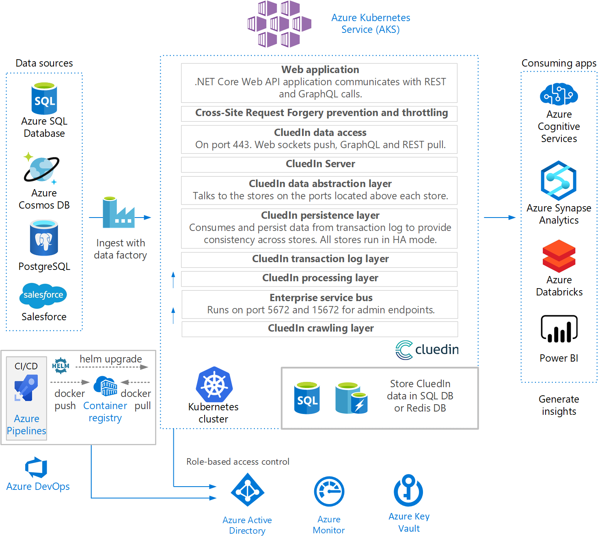

Enterprise companies have many processes and projects that are fueled by data. Data use cases from machine learning to business intelligence all require the same master data management (MDM) processes:

1. Data projects start with data *discovery*, to determine where data is and what systems it uses.
2. Data *integration* then brings multiple data sources together into a unified or connected data set.
3. The next step is to *normalize, standardize, harmonize,* and *clean* the data so machines can process it in a uniform, consistent, and high-fidelity manner.
4. Finally, the data must be made easily and readily available for business operational needs.

During these processes, *governance* ensures data control and privacy protection with clear ownership, full traceability, and an audit trail of data origins, processing, and use.

The CluedIn platform encapsulates the data management processes and pillars into a coherent, consistent, end-to-end MDM solution.

CluedIn uses a data integration technique called *eventual connectivity* that yields better results than classic *extract, transform, load (ETL)* or *extract, load, transform (ELT)* models. Eventual connectivity uses [GraphQL](https://graphql.org/) queries to blend data seamlessly from across many siloed data sources.

With eventual connectivity, data isn't joined or blended upon entry or loading into other systems. Instead, data loads as is, and records are tagged using metadata. Eventually, records with the same tags merge or build a relationship in the graph.

This sophisticated data merging technique provides a foundation for data-driven solutions. The CluedIn hub integrates data into a pipeline that cleans, prepares, models, governs, enriches, deduplicates, and catalogs data to make it easily available and accessible for business uses.

CluedIn provides businesses with metrics about the quality of data it ingests, intelligently detecting dirty data and preparing it for cleaning by data engineers. Proprietary fuzzy logic machine learning algorithms help data stewards, business users, and curators label data and teach the system to identify, correct, and prevent data quality issues over time.

CluedIn includes enterprise-grade governance, for assurance that you can use your data safely and confidently. CluedIn can stream the cleaned, governed data directly to analysis systems like Power BI to make it easily available to the rest of the business. Native support for autoscaling leverages the power of Azure to provide a scalable environment for the biggest data workloads.

## Architecture

- CluedIn ingests data from sources like Azure SQL DB, Azure Cosmos DB, PostgreSQL, and Salesforce databases via Azure Data Factory.

- The enterprise service bus connects through ports 5672 and 15672 for admin endpoints. Crawlers send data to the bus, and the processing layer consumes data from the bus, over port 5672.

- The CluedIn crawling layer takes input from customer cloud or on-premises accessible systems like SAP, Oracle, Slack, and Hadoop, or can use on-premises agents to crawl non-public data.

- The CluedIn solution consists of various functional layers that run in a Kubernetes cluster in Azure Kubernetes Service (AKS). A combination of .NET Core microservice applications handles distinct functions like user interface, queuing, data ingestion, and processing large streams of data.

- The CluedIn ASP.NET Core web application communicates through a combination of REST and GraphQL calls over port 443. GraphQL and REST HTTPS calls use a pull model, and WebSockets calls use a push model.
  
  All communication from the browser comes into the application through a set of ingress definitions, so requires only a single public IP address. In a production environment, all communication is over secure socket layer (SSL).
  
- CluedIn handles secure data access with throttling and Cross-Site Request Forgery (CSRF) prevention.

- On the server, the data abstraction application layer communicates with the different data stores through the ports for each store.

- In the persistence layer, databases consume data from the transaction log and persist it to provide eventual consistency across the different data stores. All the stores run in high-availability (HA) mode.
  
  Unlike with data virtualization, the CluedIn persistence layer ingests parts of source data and preserves the highest fidelity version of data and its structure. This high fidelity means that the CluedIn data fabric can serve business requests for data in any format or model.
  
- CluedIn stores the cleaned, processed data in SQL or Redis databases, and provides the data to analytics services to generate insights.

- CluedIn security grants permissions and controls access to different services through Azure Active Directory (Azure AD) role-based access control, with Azure Key Vault key control and Azure Monitor access logging.

- Azure Pipelines continuous integration and continuous delivery (CI/CD) pipelines trigger deployments and rolling updates to the AKS environment.

CluedIn runs in [Docker containers](https://hub.docker.com/) and uses [Kubernetes](https://kubernetes.io/) to host and orchestrate the different pieces of the application. This architecture means that CluedIn works well in elastic environments and can automatically scale to needed sizes and infrastructure.

## Components

The CluedIn solution itself runs on [Azure Kubernetes Service (AKS)](https://azure.microsoft.com/services/kubernetes-service/), a highly available, secure, and fully managed Kubernetes service for deploying and managing containerized applications. AKS offers serverless Kubernetes, integrated CI/CD, and enterprise-grade security and governance.

CluedIn uses and supports many database sources and services, including:

- [Azure SQL Database](https://azure.microsoft.com/services/sql-database/), a managed relational cloud database service that is always up to date and can automatically scale resources on demand.
- [Azure SQL Managed Instance](https://azure.microsoft.com/services/azure-sql/sql-managed-instance/) runs on any on-premises database infrastructure to offer Azure cloud benefits like elastic scale, unified management, and a cloud billing model for existing SQL Server applications.
- [Azure Cosmos DB](https://azure.microsoft.com/services/cosmos-db/), a fully managed, non-relational NoSQL serverless database for modern app development.
- [Azure Data Lake](https://azure.microsoft.com/solutions/data-lake/), a scalable data storage and analytics service.
- [Azure Data Factory](https://azure.microsoft.com/services/data-factory/), a fully managed, serverless data integration solution for ingesting, preparing, and transforming data at scale. CluedIn uses over 90 built-in Data Factory connectors to acquire data from sources like Amazon Redshift, Google BigQuery, HDFS, Oracle Exadata, Teradata, Salesforce, Marketo, ServiceNow, and all Azure data services.

CluedIn provides processed data to many analytics apps and services, including:

- [Azure Databricks](https://azure.microsoft.com/services/databricks/), a fast, easy, and collaborative Apache Spark-based analytics service.
- [Azure Synapse Analytics](https://azure.microsoft.com/services/synapse-analytics/), a limitless analytics service that brings together enterprise data warehousing and Big Data analytics.
- [Log Analytics](/azure/azure-monitor/log-query/log-analytics-tutorial), a tool in the Azure portal to edit, run, and analyze queries from Azure Monitor log data.
- [Azure Cognitive Services](https://azure.microsoft.com/services/cognitive-services/), a comprehensive family of AI services and cognitive APIs for building intelligent apps.
- [Power BI](https://powerbi.microsoft.com), a Microsoft business analytics service that provides interactive visualizations and business intelligence with an easy-to-use report creation interface.

- Azure Pipelines

- Azure AD
- Azure Key Vault

- Azure SignalR Service

## Considerations

The CluedIn platform has the following characteristics and considerations:

### Resiliency

- CluedIn takes automatic daily database backups and keeps them in your long-term storage for 30 days by default. The entire platform is built on redundant, fault tolerant stacks that maintain backups for all subsystems. Round the clock monitoring systems ensure that services are as untainted as possible. CluedIn follows industry standard practices for infrastructure redundancy.

- CluedIn surfaces and stores only a representation of your data, not the original version. CluedIn manages the data representations behind multiple firewall and proxy layers, and authenticates them with a set of unique keys. If CluedIn detects destructive data intrusion, you can temporarily wipe your CluedIn data from your servers. Once the intrusion is subsided, CluedIn regathers your data to get back its original state.

- All data stores run in high-availability (HA) mode.

### Scalability

- Native support for autoscaling leverages the power of Azure to provide a scalable environment for the biggest data workloads.

- Schemaless graph modeling means that the data model is automatically inferred from the source data, rather than being explicitly integrated. New data sources automatically connect to every other data source. The number of data sources can scale infinitely without increasing integration complexity.

### Security

- In addition to authenticated user accounts, CluedIn also supports single sign-on (SSO) and identity frameworks. Requests to the CluedIn application use encrypted access tokens that have no correlation with user identity.

- CluedIn security grants permissions and controls access to different services through Azure AD role-based access control. Azure Key Vault stores access keys and secrets, and Azure Monitor monitors access.

- CluedIn stores all sourced data on your environment with 256-bit AES encryption, which is stronger or equal to the encryption level of the sources.

- CluedIn handles secure data access with throttling and Cross-Site Request Forgery (CSRF) prevention.

### DevOps

- CluedIn supports unit, integration, and functional testing to see if your data is transforming the way you expect it to. You can run virtualized processing pipelines in memory for sandbox testing, and create production-grade assertions to help debug and track down data issues.

- Fully scripted data deployment processes let you set up, test, and roll out with full confidence.

- CluedIn integrates with Azure Pipelines CI/CD pipelines for development, testing, and deployment.

## Deployment
- You can deploy CluedIn locally for development and evaluation purposes using Docker. For more information and instructions, see [CluedIn with Docker](http://documentation.cluedin.net/docs/00-gettingStarted/30-docker-local.html).

- For testing and production environments, you can deploy CluedIn with Kubernetes. CluedIn provides a Helm package manager chart to install CluedIn quickly in a Kubernetes cluster. The chart installs the CluedIn server, website, and other required services like storage and queues. For more information and instructions, see [CluedIn with Kubernetes](http://documentation.cluedin.net/docs/00-gettingStarted/40-kubernetes.html).
