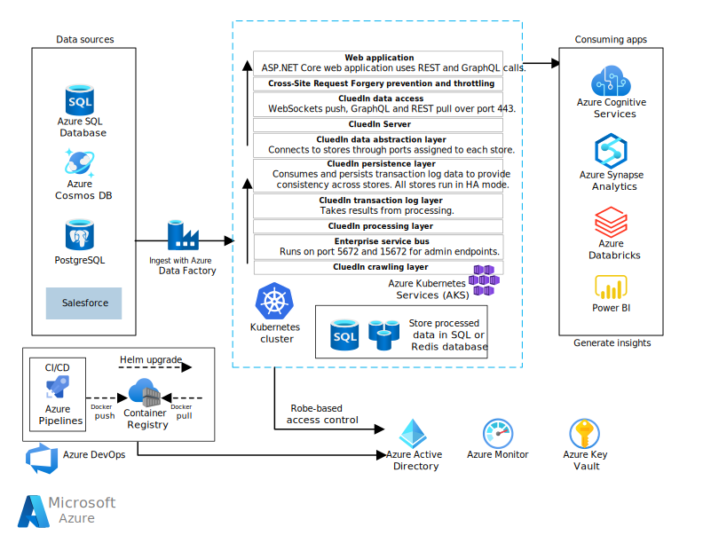

This CluedIn architecture provides businesses with metrics about the quality of data it ingests, intelligently detecting dirty data and preparing it for cleaning by data engineers and data stewards. Proprietary fuzzy logic machine learning algorithms help business users and curators label data, and teach the system to identify, correct, and prevent data quality issues over time.

## Architecture

*Download a [Visio file](https://arch-center.azureedge.net/cluedin-architecture.vsdx) of this architecture.*

### Dataflow

The CluedIn solution consists of various functional layers that run in a Kubernetes cluster in Azure Kubernetes Service (AKS). A combination of .NET Core microservice applications handles distinct functions like data ingestion, streaming data processing, queuing, and user interface.

1. The CluedIn crawling layer ingests data from customer cloud sources like Azure SQL DB, Azure Cosmos DB, PostgreSQL, and Salesforce databases via Azure Data Factory connectors.

   CluedIn also takes input from on-premises accessible systems like SAP, Oracle, IBM, and Hadoop, or can use on-premises agents to crawl non-public data.

1. The enterprise service bus connects through ports 5672 and 15672 for admin endpoints. Crawlers send data to the bus, and the processing layer consumes data from the bus, over port 5672.

1. The transaction log layer takes results from the processing layer.

1. In the persistence layer, databases consume data from the transaction log and persist it to provide eventual consistency across the different data stores. All the stores run in high-availability (HA) mode.

   Unlike with data virtualization, the CluedIn persistence layer ingests parts of the source data and preserves the highest fidelity version of data and its structure. This high fidelity means that the CluedIn Data Fabric can serve business requests for data in any format or model.

1. The data abstraction layer connects to the different data stores through the ports for each store.

1. Data access is through GraphQL, REST, and WebSockets calls over port 443. GraphQL and REST use a pull model, and WebSockets uses a push model.

   CluedIn protects data access through throttling and Cross-Site Request Forgery (CSRF) prevention.

1. The CluedIn ASP.NET Core web application communicates through a combination of REST and GraphQL calls over port 443.

   All communication from the browser into the application uses a set of ingress definitions, which require only a single public IP address. In a production environment, all communication is over secure socket layer (SSL).

1. The CluedIn application provides cleaned, processed data to analytics services like Power BI and Azure Synapse Analytics for generating insights. The system backs up and stores all data in SQL or Redis databases.

### Components

CluedIn runs on [Azure Kubernetes Service (AKS)](https://azure.microsoft.com/services/kubernetes-service/), a highly available, secure, and fully managed Kubernetes service for deploying and managing containerized applications. AKS offers serverless Kubernetes, integrated CI/CD, and enterprise-grade security and governance.

CluedIn uses and supports many database sources and services, including:

- [Azure SQL Database](https://azure.microsoft.com/services/sql-database/), a managed relational cloud database service that is always up to date and can automatically scale resources on demand.
- [Azure SQL Managed Instance](https://azure.microsoft.com/services/azure-sql/sql-managed-instance/), for broad SQL Server engine compatibility with existing SQL Server applications. SQL Managed Instance provides on-premises database infrastructures with Azure cloud benefits like elastic scale, unified management, and a cloud billing model.
- [Azure Cosmos DB](https://azure.microsoft.com/services/cosmos-db/), a fully managed, non-relational NoSQL serverless database for modern app development.
- [Azure Data Lake](https://azure.microsoft.com/solutions/data-lake/), a scalable data storage and analytics service.
- [Azure Data Factory](https://azure.microsoft.com/services/data-factory/), a fully managed, serverless data integration solution for ingesting, preparing, and transforming data at scale. CluedIn uses over 90 built-in Data Factory connectors to acquire data from sources like Amazon Redshift, Google BigQuery, HDFS, Oracle Exadata, Teradata, Salesforce, Marketo, ServiceNow, and all Azure data services.

CluedIn provides processed, governed data to many analytics apps and services, including:

- [Azure Databricks](https://azure.microsoft.com/services/databricks/), a fast, easy, and collaborative Apache Spark-based analytics service.
- [Azure Synapse Analytics](https://azure.microsoft.com/services/synapse-analytics/), a limitless analytics service that brings together enterprise data warehousing and Big Data analytics.
- [Log Analytics](/azure/azure-monitor/log-query/log-analytics-tutorial), an Azure portal tool to edit, run, and analyze queries from Azure Monitor log data.
- [Azure Cognitive Services](https://azure.microsoft.com/services/cognitive-services/), a comprehensive family of AI services and cognitive APIs for building intelligent apps.
- [Power BI](https://powerbi.microsoft.com), a Microsoft business analytics service that combines interactive visualizations and business intelligence with an easy-to-use report creation interface.

## Scenario details

Modern enterprise companies base many processes and projects on data, but the raw data has to be prepared for consumption. Data use cases from advanced analytics to machine learning all require similar data preparation processes and attention.

1. Data projects start with data *discovery*, to determine where data is and what systems it uses.
2. Data *integration* then brings multiple data sources together into a unified or connected data set.
3. The next step is to *normalize, standardize, harmonize,* and *clean* the data so machines can process it in a uniform, consistent, and high-fidelity manner.
4. Finally, the data must be made easily and readily available for business needs.

During these processes, *governance* must ensure data control and privacy protection with clear ownership, full traceability, and an audit trail of data origins, processing, and use.

The [CluedIn platform](https://appsource.microsoft.com/product/office/WA200003700?tab=Overview) encapsulates these data management processes and pillars into a coherent, consistent, end-to-end Master Data Management (MDM) solution. CluedIn uses a data integration technique called *eventual connectivity* that yields better results than classic *extract, transform, load (ETL)* or *extract, load, transform (ELT)* models. Eventual connectivity uses [GraphQL](https://graphql.org/) queries to blend data seamlessly from across many siloed data sources.

With eventual connectivity, data isn't joined or blended upon entry or loading into other systems. Instead, CluedIn loads the data as is, and tags records using metadata. Eventually, records with the same tags merge or build a relationship in the graph.

This sophisticated data merging technique provides a foundation for data-driven solutions. The CluedIn Data Fabric integrates data into a pipeline that cleans, prepares, models, governs, enriches, deduplicates, and catalogs data to make it easily available and accessible for business uses.

CluedIn provides businesses with metrics about the quality of data it ingests, intelligently detecting dirty data and preparing it for cleaning by data engineers and data stewards. Proprietary fuzzy logic machine learning algorithms help business users and curators label data, and teach the system to identify, correct, and prevent data quality issues over time.

CluedIn includes enterprise-grade governance, for assurance that you can use your data safely and confidently. CluedIn can stream cleaned, governed data directly to analysis systems like Power BI, Azure Databricks, Azure Synapse Analytics, or Azure Cognitive Services  to make it easily available to the rest of the business. Native support for autoscaling leverages the power of Azure to provide a scalable environment for the biggest data workloads.

### Potential use cases

#### Building a single view of data

 - Due to CluedIn's semantic modeling, it makes building a Single View of your Master Data a much easier thing to achieve compared to traditional approaches. CluedIn's customers are using CluedIn to build a connected, historical and high quality view of their most critical business data. CluedIn not only supports mastering of classic Master domains like People, Companies, Vendors and Products - it supports and endless number of different domains as well as unstructured domains like files, mail, events and more. If you require a centralized repository of master data that is clean, enriched, governed, quality-controlled and cataloged, then CluedIn is a good fit for your use cases.

#### A data fabric

 - CluedIn is a Gartner Cool Vendor in 2020, due to its ability to orchestrate data from across 10's, 100's and 1000's of different and complex datasources into a unified data hub. If you need to wrangle data from a lot of different datasources with ease, then CluedIn can be used as a data fabric to achieve this. This can provide a streaming infrastructure for your data that can also proactively clean and master the data as it flows onto downstream consumers.

#### Sophisticated merging and linking of master data

 - CluedIn's unique data modeling approach utilizes a graph database, which allows for complex data to be merged and linked with simplicity. Unlike traditional approaches, to solve this challenge, CluedIn adds additional machine learning and graph analytics to merge, match, and link records with a very high precision.

## Considerations

These considerations implement the pillars of the Azure Well-Architected Framework, which is a set of guiding tenets that can be used to improve the quality of a workload. For more information, see [Microsoft Azure Well-Architected Framework](/azure/architecture/framework).

### Reliability

Reliability ensures your application can meet the commitments you make to your customers. For more information, see [Overview of the reliability pillar](/azure/architecture/framework/resiliency/overview).

- CluedIn takes automatic daily database backups and keeps them in long-term storage for 30 days by default. The entire platform is built on redundant, fault tolerant stacks that maintain backups for all subsystems. Round the clock monitoring systems ensure that services are as untainted as possible. CluedIn follows industry standard practices for infrastructure redundancy.

- CluedIn surfaces and stores only a representation of your data, not the original version. If CluedIn detects destructive data intrusion, it can temporarily wipe the CluedIn data from your servers. Once the intrusion subsides, CluedIn regathers the data to get back to its original state.

- All data stores run in high-availability mode.

### Scalability

- CluedIn runs in [Docker containers](https://hub.docker.com/) and uses [Kubernetes](https://kubernetes.io/) to host and orchestrate the different pieces of the application. This architecture means that CluedIn works well in elastic environments and can automatically scale to needed sizes and infrastructure.

- Native support for autoscaling leverages the power of Azure to provide a scalable environment for the biggest data workloads.

- Schemaless graph modeling automatically infers a data model from the source data. New data sources automatically connect to all other data sources, rather than having to be explicitly integrated. The number of data sources can scale infinitely without increasing integration complexity.

### Security

Security provides assurances against deliberate attacks and the abuse of your valuable data and systems. For more information, see [Overview of the security pillar](/azure/architecture/framework/security/overview).

- CluedIn security grants permissions and controls access to different services through [Azure RBAC](/azure/role-based-access-control/overview), with [Azure Key Vault](https://azure.microsoft.com/services/key-vault/) security key control and [Azure Monitor](https://azure.microsoft.com/services/monitor/) access tracking and logging.

- In addition to authenticated user accounts, CluedIn also supports single sign-on (SSO) and identity frameworks. Requests to the CluedIn application use encrypted access tokens that have no correlation with user identity.

- CluedIn manages stored data representations behind multiple firewall and proxy layers, and authenticates them with a set of unique keys.

- CluedIn stores all sourced data with 256-bit AES encryption, which is stronger than or equal to the encryption level of the supported data sources.

- Throttling and CSRF prevention protect data access.

### DevOps

- CluedIn uses [Azure Pipelines](https://azure.microsoft.com/services/devops/pipelines/) continuous integration and continuous delivery (CI/CD) pipelines to handle deployments and rolling updates to the AKS environment.

- CluedIn supports unit, integration, and functional testing to ensure that data transforms as expected. Virtualized processing pipelines can run in memory for sandbox testing. Production-grade assertions can help debug and track down data issues.

- For testing and production environments, CluedIn provides a [Helm package manager](https://helm.sh/) chart to install CluedIn quickly in a Kubernetes cluster. Fully scripted data deployment processes support setup, test, and rollout.

### Cost optimization

Cost optimization is about looking at ways to reduce unnecessary expenses and improve operational efficiencies. For more information, see [Overview of the cost optimization pillar](/azure/architecture/framework/cost/overview).

The pricing for CluedIn is open and transparent. You can see the pricing on their [website](https://www.cluedin.com/cluedin-azure-costs).

#### Azure sizing and starting a trial

You can start a 7-day trial of CluedIn on their [website](https://www.cluedin.com/cluedin-on-microsoft-azure), which can also help you scope your Azure hosting costs with prebuilt Azure estimates for different sized environments.

## Deploy this scenario

- To deploy CluedIn for development and evaluation purposes using Docker, see [CluedIn with Docker](https://documentation.cluedin.net/deployment/docker-compose).

- To install CluedIn quickly in a Kubernetes cluster, see [CluedIn with Kubernetes](https://documentation.cluedin.net/deployment/local/step-2#authenticate-to-cluedin-acr). The [Helm chart](https://cluedin-io.github.io/Charts/) installs the CluedIn server, website, and other required services, like storage and queues.

## Next steps

- For more information about CluedIn, see the [CluedIn website](https://www.cluedin.com/).
- For CluedIn documentation, see the [CluedIn documentation](http://documentation.cluedin.net/).

## Related resources

- For an overview of Azure data architecture, see the [Azure Data Architecture Guide](../../data-guide/index.md).
- For an example end-to-end Azure data platform, see [Azure data platform end-to-end](../../example-scenario/dataplate2e/data-platform-end-to-end.yml).
