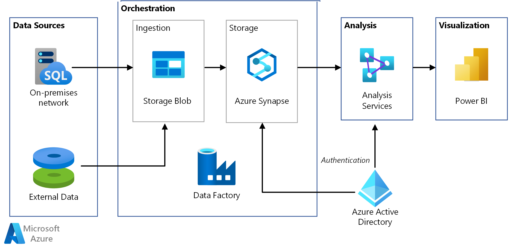

# Automated enterprise BI with Azure Synapse Analytics and Azure Data Factory

This reference architecture shows how to perform incremental loading in an [extract, load, and transform (ELT)](../../data-guide/relational-data/etl.md#extract-load-and-transform-elt) pipeline. It uses Azure Data Factory to automate the ELT pipeline. The pipeline incrementally moves the latest OLTP data from an on-premises SQL Server database into Azure Synapse. Transactional data is transformed into a tabular model for analysis.

 A reference implementation for this architecture is available on [GitHub][github].



This architecture builds on the one shown in [Enterprise BI with Azure Synapse](./enterprise-bi-synapse.md), but adds some features that are important for enterprise data warehousing scenarios.

- Automation of the pipeline using Data Factory.
- Incremental loading.
- Integrating multiple data sources.
- Loading binary data such as geospatial data and images.

## Architecture

The architecture consists of the following components.

### Data sources

**On-premises SQL Server**. The source data is located in a SQL Server database on premises. To simulate the on-premises environment, the deployment scripts for this architecture provision a virtual machine in Azure with SQL Server installed. The [Wide World Importers OLTP sample database][wwi] is used as the source database.

**External data**. A common scenario for data warehouses is to integrate multiple data sources. This reference architecture loads an external data set that contains city populations by year, and integrates it with the data from the OLTP database. You can use this data for insights such as: "Does sales growth in each region match or exceed population growth?"

### Ingestion and data storage

**Blob Storage**. Blob storage is used as a staging area for the source data before loading it into Azure Synapse.

**Azure Synapse**. [Azure Synapse](/azure/sql-data-warehouse/) is a distributed system designed to perform analytics on large data. It supports massive parallel processing (MPP), which makes it suitable for running high-performance analytics.

**Azure Data Factory**. [Data Factory][adf] is a managed service that orchestrates and automates data movement and data transformation. In this architecture, it coordinates the various stages of the ELT process.

### Analysis and reporting

**Azure Analysis Services**. [Analysis Services](/azure/analysis-services/) is a fully managed service that provides data modeling capabilities. The semantic model is loaded into Analysis Services.

**Power BI**. Power BI is a suite of business analytics tools to analyze data for business insights. In this architecture, it queries the semantic model stored in Analysis Services.

### Authentication

**Azure Active Directory** (Azure AD) authenticates users who connect to the Analysis Services server through Power BI.

Data Factory can use also use Azure AD to authenticate to Azure Synapse, by using a service principal or Managed Service Identity (MSI). For simplicity, the example deployment uses SQL Server authentication.

## Data pipeline

In [Azure Data Factory][adf], a pipeline is a logical grouping of activities used to coordinate a task &mdash; in this case, loading and transforming data into Azure Synapse.

This reference architecture defines a master pipeline that runs a sequence of child pipelines. Each child pipeline loads data into one or more data warehouse tables.


## Incremental loading

When you run an automated ETL or ELT process, it's most efficient to load only the data that changed since the previous run. This is called an *incremental load*, as opposed to a full load that loads all the data. To perform an incremental load, you need a way to identify which data has changed. The most common approach is to use a *high water mark* value, which means tracking the latest value of some column in the source table, either a datetime column or a unique integer column.

Starting with SQL Server 2016, you can use [temporal tables](/sql/relational-databases/tables/temporal-tables). These are system-versioned tables that keep a full history of data changes. The database engine automatically records the history of every change in a separate history table. You can query the historical data by adding a FOR SYSTEM_TIME clause to a query. Internally, the database engine queries the history table, but this is transparent to the application.

> [!NOTE]
> For earlier versions of SQL Server, you can use [Change Data Capture](/sql/relational-databases/track-changes/about-change-data-capture-sql-server) (CDC). This approach is less convenient than temporal tables, because you have to query a separate change table, and changes are tracked by a log sequence number, rather than a timestamp.
>

Temporal tables are useful for dimension data, which can change over time. Fact tables usually represent an immutable transaction such as a sale, in which case keeping the system version history doesn't make sense. Instead, transactions usually have a column that represents the transaction date, which can be used as the watermark value. For example, in the Wide World Importers OLTP database, the Sales.Invoices and Sales.InvoiceLines tables have a `LastEditedWhen` field that defaults to `sysdatetime()`.

Here is the general flow for the ELT pipeline:

1. For each table in the source database, track the cutoff time when the last ELT job ran. Store this information in the data warehouse. (On initial setup, all times are set to '1-1-1900'.)

2. During the data export step, the cutoff time is passed as a parameter to a set of stored procedures in the source database. These stored procedures query for any records that were changed or created after the cutoff time. For the Sales fact table, the `LastEditedWhen` column is used. For the dimension data, system-versioned temporal tables are used.

3. When the data migration is complete, update the table that stores the cutoff times.

It's also useful to record a *lineage* for each ELT run. For a given record, the lineage associates that record with the ELT run that produced the data. For each ETL run, a new lineage record is created for every table, showing the starting and ending load times. The lineage keys for each record are stored in the dimension and fact tables.


After a new batch of data is loaded into the warehouse, refresh the Analysis Services tabular model. See [Asynchronous refresh with the REST API](/azure/analysis-services/analysis-services-async-refresh).

## Data cleansing

Data cleansing should be part of the ELT process. In this reference architecture, one source of bad data is the city population table, where some cities have zero population, perhaps because no data was available. During processing, the ELT pipeline removes those cities from the city population table. Perform data cleansing on staging tables, rather than external tables.

Here is the stored procedure that removes the cities with zero population from the City Population table. (You can find the source file [here](https://github.com/mspnp/reference-architectures/blob/master/data/enterprise_bi_sqldw_advanced/azure/sqldw_scripts/citypopulation/%5BIntegration%5D.%5BMigrateExternalCityPopulationData%5D.sql).)

```sql
DELETE FROM [Integration].[CityPopulation_Staging]
WHERE RowNumber in (SELECT DISTINCT RowNumber
FROM [Integration].[CityPopulation_Staging]
WHERE POPULATION = 0
GROUP BY RowNumber
HAVING COUNT(RowNumber) = 4)
```

## External data sources

Data warehouses often consolidate data from multiple sources. This reference architecture loads an external data source that contains demographics data. This dataset is available in Azure blob storage as part of the [WorldWideImportersDW](https://github.com/Microsoft/sql-server-samples/tree/master/samples/databases/wide-world-importers/sample-scripts/polybase) sample.

Azure Data Factory can copy directly from blob storage, using the [blob storage connector](/azure/data-factory/connector-azure-blob-storage). However, the connector requires a connection string or a shared access signature, so it can't be used to copy a blob with public read access. As a workaround, you can use PolyBase to create an external table over Blob storage and then copy the external tables into Azure Synapse.

## Handling large binary data

In the source database, the Cities table has a Location column that holds a [geography](/sql/t-sql/spatial-geography/spatial-types-geography) spatial data type. Azure Synapse doesn't support the **geography** type natively, so this field is converted to a **varbinary** type during loading. (See [Workarounds for unsupported data types](/azure/sql-data-warehouse/sql-data-warehouse-tables-data-types#unsupported-data-types).)

However, PolyBase supports a maximum column size of `varbinary(8000)`, which means some data could be truncated. A workaround for this problem is to break the data up into chunks during export, and then reassemble the chunks, as follows:

1. Create a temporary staging table for the Location column.

2. For each city, split the location data into 8000-byte chunks, resulting in 1 &ndash; N rows for each city.

3. To reassemble the chunks, use the T-SQL [PIVOT](/sql/t-sql/queries/from-using-pivot-and-unpivot) operator to convert rows into columns and then concatenate the column values for each city.

The challenge is that each city will be split into a different number of rows, depending on the size of geography data. For the PIVOT operator to work, every city must have the same number of rows. To make this work, the T-SQL query (which you can view [here][MergeLocation]) does some tricks to pad out the rows with blank values, so that every city has the same number of columns after the pivot. The resulting query turns out to be much faster than looping through the rows one at a time.

The same approach is used for image data.

## Slowly changing dimensions

Dimension data is relatively static, but it can change. For example, a product might get reassigned to a different product category. There are several approaches to handling slowly changing dimensions. A common technique, called [Type 2](https://wikipedia.org/wiki/Slowly_changing_dimension#Type_2:_add_new_row), is to add a new record whenever a dimension changes.

In order to implement the Type 2 approach, dimension tables need additional columns that specify the effective date range for a given record. Also, primary keys from the source database will be duplicated, so the dimension table must have an artificial primary key.

The following image shows the Dimension.City table. The `WWI City ID` column is the primary key from the source database. The `City Key` column is an artificial key generated during the ETL pipeline. Also notice that the table has `Valid From` and `Valid To` columns, which define the range when each row was valid. Current values have a `Valid To` equal to '9999-12-31'.


The advantage of this approach is that it preserves historical data, which can be valuable for analysis. However, it also means there will be multiple rows for the same entity. For example, here are the records that match `WWI City ID` = 28561:


For each Sales fact, you want to associate that fact with a single row in City dimension table, corresponding to the invoice date. As part of the ETL process, create an additional column that

The following T-SQL query creates a temporary table that associates each invoice with the correct City Key from the City dimension table.

```sql
CREATE TABLE CityHolder
WITH (HEAP , DISTRIBUTION = HASH([WWI Invoice ID]))
AS
SELECT DISTINCT s1.[WWI Invoice ID] AS [WWI Invoice ID],
                c.[City Key] AS [City Key]
    FROM [Integration].[Sale_Staging] s1
    CROSS APPLY (
                SELECT TOP 1 [City Key]
                    FROM [Dimension].[City]
                WHERE [WWI City ID] = s1.[WWI City ID]
                    AND s1.[Last Modified When] > [Valid From]
                    AND s1.[Last Modified When] <= [Valid To]
                ORDER BY [Valid From], [City Key] DESC
                ) c

```

This table is used to populate a column in the Sales fact table:

```sql
UPDATE [Integration].[Sale_Staging]
SET [Integration].[Sale_Staging].[WWI Customer ID] =  CustomerHolder.[WWI Customer ID]
```

This column enables a Power BI query to find the correct City record for a given sales invoice.

## Security considerations

For additional security, you can use [Virtual Network service endpoints](/azure/virtual-network/virtual-network-service-endpoints-overview) to secure Azure service resources to only your virtual network. This fully removes public Internet access to those resources, allowing traffic only from your virtual network.

With this approach, you create a VNet in Azure and then create private service endpoints for Azure services. Those services are then restricted to traffic from that virtual network. You can also reach them from your on-premises network through a gateway.

Be aware of the following limitations:

- If service endpoints are enabled for Azure Storage, PolyBase cannot copy data from Storage into Azure Synapse. There is a mitigation for this issue. For more information, see [Impact of using VNet Service Endpoints with Azure storage](/azure/sql-database/sql-database-vnet-service-endpoint-rule-overview?toc=%2fazure%2fvirtual-network%2ftoc.json#impact-of-using-vnet-service-endpoints-with-azure-storage).

- To move data from on-premises into Azure Storage, you will need to whitelist public IP addresses from your on-premises or ExpressRoute. For details, see [Securing Azure services to virtual networks](/azure/virtual-network/virtual-network-service-endpoints-overview#secure-azure-services-to-virtual-networks).

- To enable Analysis Services to read data from Azure Synapse, deploy a Windows VM to the virtual network that contains the Azure Synapse service endpoint. Install [Azure On-premises Data Gateway](/azure/analysis-services/analysis-services-gateway) on this VM. Then connect your Azure Analysis service to the data gateway.

## Deploy the solution

To the deploy and run the reference implementation, follow the steps in the [GitHub readme][github]. It deploys the following:

- A Windows VM to simulate an on-premises database server. It includes SQL Server 2017 and related tools, along with Power BI Desktop.
- An Azure storage account that provides Blob storage to hold data exported from the SQL Server database.
- An Azure Synapse instance.
- An Azure Analysis Services instance.
- Azure Data Factory and the Data Factory pipeline for the ELT job.

## Related resources

You may want to review the following [Azure example scenarios](/azure/architecture/example-scenario) that demonstrate specific solutions using some of the same technologies:

- [Data warehousing and analytics for sales and marketing](/azure/architecture/example-scenario/data/data-warehouse)
- [Hybrid ETL with existing on-premises SSIS and Azure Data Factory](/azure/architecture/example-scenario/data/hybrid-etl-with-adf)
- [Enterprise BI in Azure with Azure Synapse](/azure/architecture/reference-architectures/data/enterprise-bi-sqldw).

<!-- links -->

[adf]: /azure/data-factory
[github]: https://github.com/mspnp/azure-data-factory-sqldw-elt-pipeline
[MergeLocation]: https://github.com/mspnp/reference-architectures/blob/master/data/enterprise_bi_sqldw_advanced/azure/sqldw_scripts/city/%5BIntegration%5D.%5BMergeLocation%5D.sql
[wwi]: /sql/sample/world-wide-importers/wide-world-importers-oltp-database
