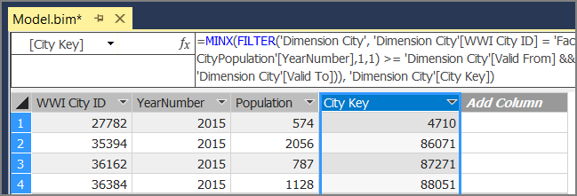

# Run scheduled ELT jobs with SQL Data Warehouse and Azure Data Factory


## Deploy the solution

A deployment for this reference architecture is available on [GitHub][ref-arch-repo-folder]. It deploys the following:

  * A Windows VM to simulate an on-premises database server. It includes SQL Server 2017 and related tools, along with Power BI Desktop.
  * An Azure storage account that provides Blob storage to hold data exported from the SQL Server database.
  * An Azure SQL Data Warehouse instance.
  * An Azure Analysis Services instance.
  * Azure Data Factory and the Data Factory pipeline for the ELT job.

### Prerequisites

1. Clone, fork, or download the zip file for the [Azure reference architectures][ref-arch-repo] GitHub repository.

2. Install the [Azure Building Blocks][azbb-wiki] (azbb).

3. From a command prompt, bash prompt, or PowerShell prompt, login to your Azure account as follows:

    ```bash
    az login  
    ```

### Deploy the Azure resources

This step provisions SQL Data Warehouse, Azure Analysis Services, and Data Factory.

1. Navigate to the `data\enterprise_bi_sqldw_advanced\azure\templates` folder of the [GitHub repository][ref-arch-repo].

2. Run the following Azure CLI command to create a resource group.  

    ```bash
    az group create --name <resource_group_name> --location <region>  
    ```

    Specify a region that supports SQL Data Warehouse, Azure Analysis Services, and Data Factory v2. See [Azure Products by Region](https://azure.microsoft.com/global-infrastructure/services/)

3. Run the following Azure CLI command. Replace the parameter values shown in angle brackets.

    ```bash
    az group deployment create --resource-group <resource_group_name> \
     --template-file azure-resources-deploy.json \
     --parameters "dwServerName"="<data_warehouse_server_name>" \
     "dwAdminLogin"="adminuser" "dwAdminPassword"="<data-warehouse-password>" \ 
     "storageAccountName"="<storage_account_name>" \
     "analysisServerName"="<analysis_server_name>" \
     "analysisServerAdmin"="<user@contoso.com>"
    ```

    - The `storageAccountName` parameter must follow the [naming rules](../../best-practices/naming-conventions.md#naming-rules-and-restrictions) for Storage accounts. 
    - For the `analysisServerAdmin` parameter, use your Azure Active Directory user principal name (UPN).

4. Run the following Azure CLI command to get the access key for the storage account. You will use this key in the next step.

    ```bash
    az storage account keys list -n <storage_account_name> -g <resource_group_name> --query [0].value
    ```

5. Run the following Azure CLI command. Replace the parameter values shown in angle brackets. 

    ```bash
    az group deployment create --resource-group <resource_group_name> \
    --template-file adf-pipeline-deploy.json \
    --parameters "factoryName"="<adf_factory_name>" \
    "sinkDWConnectionString"="Server=tcp:<data_warehouse_server_name>.database.windows.net,1433;Initial Catalog=wwi;Persist Security Info=False;User ID=adminuser;Password=<data-warehouse-password>;MultipleActiveResultSets=False;Encrypt=True;TrustServerCertificate=False;Connection Timeout=30;" \
    "blobConnectionString"="DefaultEndpointsProtocol=https;AccountName=<storage_account_name>;AccountKey=<storage_account_key>;EndpointSuffix=core.windows.net" \
    "sourceDBConnectionString"="Server=sql1;Database=WideWorldImporters;User Id=adminuser;Password=<sql-db-password>;Trusted_Connection=True;"
    ```

    Note that the connection strings have substrings shown in angle brackets that must be replaced. For `<storage_account_key>`, use the key that you got in the previous step. The value of `<sql-db-password>` will be the password for the on-premises SQL Server VM, which you will create later.

### Get the Integration Runtime authentication key

For the on-premise server (below), you will need an authentication key for the Azure Data Factory [integration runtime](/azure/data-factory/concepts-integration-runtime). Perform the following steps.

1. In the [Azure Portal](https://portal.azure.com/), navigate to the Data Factory instance.

2. In the Data Factory blade, click **Author & Monitor**. This opens the Azure Data Factory portal in another browser window.

    

3. In the Azure Data Factory portal, select the pencil icon ("Author"). 

4. Click **Connections**, and then select **Integration Runtimes**.

5. Under **sourceIntegrationRuntime**, click the pencil icon ("Edit").

    > [!NOTE]
    > The portal will show the status as "unavailable". This is expected until you deploy the on-premises server.

6. Find **Key1** and copy the value of the authentication key.

### Deploy the simulated on-premises server

This step deploys a VM as a simulated on-premises server, which includes SQL Server 2017 and related tools. It also loads the sample [Wide World Importers OLTP database](/sql/sample/world-wide-importers/wide-world-importers-oltp-database) into SQL Server.

1. Navigate to the `data\enterprise_bi_sqldw_advanced\onprem\templates` folder of the repository.

2. In the `onprem.parameters.json` file, replace `testPassw0rd!23` with the password that you specified earlier for `<sql-db-password>`. These must match, or the Data Factory pipeline will fail.

3. In the same file, paste the Integration Runtime authentication key into the `IntegrationRuntimeGatewayKey` parameter, as shown below:

    ```json
    "protectedSettings": {
        "configurationArguments": {
            "SqlUserCredentials": {
                "userName": ".\\adminUser",
                "password": "<sql-db-password>"
            },
            "IntegrationRuntimeGatewayKey": "<authentication key>"
        }
    ```

3. Run `azbb` to deploy the on-premises server, as follows:

    ```bash
    azbb -s <subscription_id> -g <resource_group_name> -l <region> -p onprem.parameters.json --deploy
    ```

This step may take 20 to 30 minutes to complete, which includes running the [DSC](/powershell/dsc/overview) script to install the tools and restore the database. 


### Run the data warehouse scripts

1. In the [Azure Portal](https://portal.azure.com/), find the on-premises VM, which is named `sql-vm1`.

2. Click **Connect** and use Remote Desktop to connect to the VM.

3. From your Remote Desktop session, open a command prompt and run the following commands.

    ```
    cd C:\SampleDataFiles\reference-architectures\data\enterprise_bi_sqldw_advanced\azure\sqldw_scripts

    deploy_database.cmd -S <data_warehouse_server_name>.database.windows.net -d wwi -U adminuser -P <data-warehouse-password> -N -I
    ```

    For `<data_warehouse_server_name>` and `<data-warehouse-password>`, use the data warehouse server name and password from earlier.

To verify this step, you can use SQL Server Management Studio (SSMS) to connect to the SQL Data Warehouse database. You should see the database table schemas.

### Run the Data Factory pipeline

1. From the same Remote Desktop session, open a PowerShell window.

2. Run the following PowerShell command. Choose **Yes** when prompted.

    ```powershell
    Install-Module -Name AzureRM -AllowClobber
    ```

3. Run the following PowerShell command. Enter your Azure credentials when prompted.

    ```powershell
    Connect-AzureRmAccount 
    ```

4. Run the following PowerShell commands. 

    ```powershell
    Set-AzureRmContext -SubscriptionId <subscription id>

    Invoke-AzureRmDataFactoryV2Pipeline -DataFactory <data-factory-name> -PipelineName "MasterPipeline" -ResourceGroupName <resource-group>

5. In the Azure Portal, navigate to the Data Factory instance that was created earlier.

6. In the Data Factory blade, click **Author & Monitor**. This opens the Azure Data Factory portal in another browser window.

    

7. In the Azure Data Factory portal, click the **Monitor** icon. 

8. Verify that the pipeline has completed successfully.

    


### Build the Azure Analysis Services model

In this step, you will create a tabular model that imports data from the data warehouse. Then you will deploy the model to Azure Analysis Services.

**Create a new tabular project**

1. From your Remote Desktop session, launch SQL Server Data Tools 2015.

2. Select **File** > **New** > **Project**.

3. In the **New Project** dialog, under **Templates**, select  **Business Intelligence** > **Analysis Services** > **Analysis Services Tabular Project**. 

4. Name the project and click **OK**.

5. In the **Tabular model designer** dialog, select **Integrated workspace**  and set **Compatibility level** to `SQL Server 2017 / Azure Analysis Services (1400)`. 

6. Click **OK**.


**Import data**

1. In the **Tabular Model Explorer** window, right-click the project and select **Import from Data Source**.

2. Select **Azure SQL Data Warehouse** and click **Connect**.

3. For **Server**, enter the fully qualified name of your Azure SQL Data Warehouse server. You can get this value from the Azure Portal. For **Database**, enter `wwi`. Click **OK**.

4. In the next dialog, choose **Database** authentication and enter your Azure SQL Data Warehouse user name and password, and click **OK**.

5. In the **Navigator** dialog, select the checkboxes for the **Fact.\*** and **Dimension.\*** tables.

    

6. Click **Load**. When processing is complete, click **Close**. You should now see a tabular view of the data.

**Add calculated columns**

1. Select the **Fact CityPopulation** table, click the **Column** menu, and then click **Add Column**.

2. In the formula bar, type the following:

    ```
    =MINX(FILTER('Dimension City', 'Dimension City'[WWI City ID] = 'Fact CityPopulation'[WWI City ID] && (DATE('Fact CityPopulation'[YearNumber],1,1) >= 'Dimension City'[Valid From] && DATE('Fact CityPopulation'[YearNumber],1,1) <= 'Dimension City'[Valid To])), 'Dimension City'[City Key])
    ```

3. Press ENTER to accept the formula.

4. Rename the columm **City Key**.

    

5. Select the **Fact Sale** table and repeat steps 1 &ndash; 4, but use the following formula:

    ```
    =MINX(FILTER('Dimension City', 'Dimension City'[WWI City ID] = 'Fact Sale'[WWI City ID] && ('Fact Sale'[Invoice Date Key] >= 'Dimension City'[Valid From] && 'Fact Sale'[Invoice Date Key] <= 'Dimension City'[Valid To])), 'Dimension City'[City Key])
    ```

For more information about creating calculated columns, see [Create a Calculated Column](/sql/analysis-services/tabular-models/ssas-calculated-columns-create-a-calculated-column).

**Create measures**

1. In the model designer, select any of the tables. (It doesn't matter which table you select.)

2. Click a cell in the the measure grid. By default, the measure grid is displayed below the table. 

3. In the formula bar, enter the following and press ENTER:

    ```
    Total Sales:=SUM([Total Including Tax])
    ```

4. Repeat these steps to create the following measures:

    ```
    Number of Years:=(MAX('Fact CityPopulation'[YearNumber])-MIN('Fact CityPopulation'[YearNumber]))+1
    
    Beginning Population:=CALCULATE(SUM('Fact CityPopulation'[Population]),FILTER('Fact CityPopulation','Fact CityPopulation'[YearNumber]=MIN('Fact CityPopulation'[YearNumber])))
    
    Ending Population:=CALCULATE(SUM('Fact CityPopulation'[Population]),FILTER('Fact CityPopulation','Fact CityPopulation'[YearNumber]=MAX('Fact CityPopulation'[YearNumber])))
    
    CAGR:=IFERROR((([Ending Population]/[Beginning Population])^(1/[Number of Years]))-1,0)
    ```

    

For more information about creating measures, see [Measures](/sql/analysis-services/tabular-models/measures-ssas-tabular).

**Create relationships**

1. In the **Tabular Model Explorer** window, right-click the project and select **Model View** > **Diagram View**.

2. Drag the **[Fact Sale].[City Key]** field to the **[Dimension City].[City Key]** field to create a relationship.  

3. Drag the **[Face CityPopulation].[City Key]** field to the **[Dimension City].[City Key]** field.  

    

**Deploy the model**

1. From the **File** menu, choose **Save All**.  

2. In **Solution Explorer**, right-click the project and select **Properties**. 

3. Under **Server**, enter the URL of your Azure Analysis Services instance. You can get this value from the Azure Portal. In the portal, select the Analysis Services resource, click the Overview pane, and look for the **Server Name** property. It will be similar to `asazure://westus.asazure.windows.net/contoso`. Click **OK**.

    

4. In **Solution Explorer**, right-click the project and select **Deploy**. Sign into Azure if prompted. When processing is complete, click **Close**.

5. In the Azure portal, view the details for your Azure Analysis Services instance. Verify that your model appears in the list of models.

    

### Analyze the data in Power BI Desktop

In this step, you will use Power BI to create a report from the data in Analysis Services.

1. From your Remote Desktop session, launch Power BI Desktop.

2. In the Welcome Scren, click **Get Data**.

3. Select **Azure** > **Azure Analysis Services database**. Click **Connect**

    

4. Enter the URL of your Analysis Services instance, then click **OK**. Sign into Azure if prompted.

5. In the **Navigator** dialog, expand the tabular project, select the model, and click **OK**.

2. In the **Visualizations** pane, select the **Table** icon. In the Report view, resize the visualization to make it larger.

6. In the **Fields** pane, expand **Dimension City**.

7. From **Dimension City**, drag **City** and **State Province** to the **Values** well.

9. In the **Fields** pane, expand **Fact Sales**.

10. From **Fact Sales**, drag **CAGR**, **Ending Population**,  and **Total Sales** to the **Value** well.

11. Under **Visual Level Filters**, select **Ending Population**. Set the filter to "is greater than 100000" and click **Apply filter**.

12. Under **Visual Level Filters**, select **Total Sales**. Set the filter to "is 0" and click **Apply filter**.


The table now shows cities with population greater than 100,000 and zero sales. CAGR  stands for Compounded Annual Growth Rate and measures the rate of population growth per city. You could use this value to find cities with high growth rates, for example. However, note that the values for CAGR in the model aren't accurate, because they are derived from sample data.

To learn more about Power BI Desktop, see [Getting started with Power BI Desktop](/power-bi/desktop-getting-started).


[azure-cli-2]: /azure/install-azure-cli
[azbb-repo]: https://github.com/mspnp/template-building-blocks
[azbb-wiki]: https://github.com/mspnp/template-building-blocks/wiki/Install-Azure-Building-Blocks
[ref-arch-repo]: https://github.com/mspnp/reference-architectures
[ref-arch-repo-folder]: https://github.com/mspnp/reference-architectures/tree/master/data/enterprise_bi_sqldw_advanced
