# Automated enterprise BI with SQL Data Warehouse and Azure Data Factory

This reference architecture shows how to perform incremental loading in an [ELT](../../data-guide/relational-data/etl.md#extract-load-and-transform-elt) (extract-load-transform) pipeline. It uses Azure Data Factory to automate the ELT pipeline. The pipeline incrementally moves the latest OLTP data from an on-premises SQL Server database into SQL Data Warehouse. Transactional data is transformed into a tabular model for analysis. [**Deploy this solution**.](#deploy-the-solution)

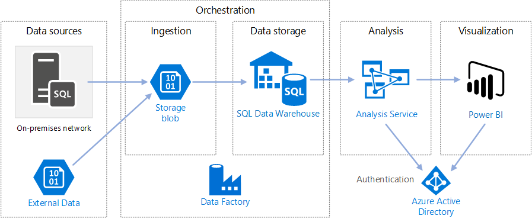

This architecture builds on the one shown in [Enterprise BI with SQL Data Warehouse](./enterprise-bi-sqldw.md), but adds some features that are important for enterprise data warehousing scenarios.

-	Automation of the pipeline using Data Factory.
-	Incremental loading.
-	Integrating multiple data sources.
-	Loading binary data such as geospatial data and images.

## Architecture

The architecture consists of the following components.

### Data sources

**On-premises SQL Server**. The source data is located in a SQL Server database on premises. To simulate the on-premises environment, the deployment scripts for this architecture provision a virtual machine in Azure with SQL Server installed. The [Wide World Importers OLTP sample database][wwi] is used as the source database.

**External data**. A common scenario for data warehouses is to integrate multiple data sources. This reference architecture loads an external data set that contains city populations by year, and integrates it with the data from the OLTP database. You can use this data for insights such as: "Does sales growth in each region match or exceed population growth?"

### Ingestion and data storage

**Blob Storage**. Blob storage is used as a staging area for the source data before loading it into SQL Data Warehouse.

**Azure SQL Data Warehouse**. [SQL Data Warehouse](/azure/sql-data-warehouse/) is a distributed system designed to perform analytics on large data. It supports massive parallel processing (MPP), which makes it suitable for running high-performance analytics. 

**Azure Data Factory**. [Data Factory][adf] is a managed service that orchestrates and automates data movement and data transformation. In this architecture, it coordinates the various stages of the ELT process.

### Analysis and reporting

**Azure Analysis Services**. [Analysis Services](/azure/analysis-services/) is a fully managed service that provides data modeling capabilities. The semantic model is loaded into Analysis Services.

**Power BI**. Power BI is a suite of business analytics tools to analyze data for business insights. In this architecture, it queries the semantic model stored in Analysis Services.

### Authentication

**Azure Active Directory** (Azure AD) authenticates users who connect to the Analysis Services server through Power BI.

Data Factory can use also use Azure AD to authenticate to SQL Data Warehouse, by using a service principal or Managed Service Identity (MSI). For simplicity, the example deployment uses SQL Server authentication.

## Data pipeline

In [Azure Data Factory][adf], a pipeline is a logical grouping of activities used to coordinate a task &mdash; in this case, loading and transforming data into SQL Data Warehouse. 

This reference architecture defines a master pipeline that runs a sequence of child pipelines. Each child pipeline loads data into one or more data warehouse tables.


## Incremental loading

When you run an automated ETL or ELT process, it's most efficient to load only the data that changed since the previous run. This is called an *incremental load*, as opposed to a full load that loads all of the data. To perform an incremental load, you need a way to identify which data has changed. The most common approach is to use a *high water mark* value, which means tracking the latest value of some column in the source table, either a datetime column or a unique integer column. 

Starting with SQL Server 2016, you can use [temporal tables](/sql/relational-databases/tables/temporal-tables). These are system-versioned tables that keep a full history of data changes. The database engine automatically records the history of every change in a separate history table. You can query the historical data by adding a FOR SYSTEM_TIME clause to a query. Internally, the database engine queries the history table, but this is transparent to the application. 

> [!NOTE]
> For earlier versions of SQL Server, you can use [Change Data Capture](/sql/relational-databases/track-changes/about-change-data-capture-sql-server) (CDC). This approach is less convenient than temporal tables, because you have to query a separate change table, and changes are tracked by a log sequence number, rather than a timestamp. 

Temporal tables are useful for dimension data, which can change over time. Fact tables usually represent an immutable transaction such as a sale, in which case keeping the system version history doesn't make sense. Instead, transactions usually have a column that represents the transaction date, which can be used as the watermark value. For example, in the Wide World Importers OLTP database, the Sales.Invoices and Sales.InvoiceLines tables have a `LastEditedWhen` field that defaults to `sysdatetime()`. 

Here is the general flow for the ELT pipeline:

1. For each table in the source database, track the cutoff time when the last ELT job ran. Store this information in the data warehouse. (On initial setup, all times are set to '1-1-1900'.)

2. During the data export step, the cutoff time is passed as a parameter to a set of stored procedures in the source database. These stored procedures query for any records that were changed or created after the cutoff time. For the Sales fact table, the `LastEditedWhen` column is used. For the dimension data, system-versioned temporal tables are used.

3. When the data migration is complete, update the table that stores the cutoff times.

It's also useful to record a *lineage* for each ELT run. For a given record, the lineage associates that record with the ELT run that produced the data. For each ETL run, a new lineage record is created for every table, showing the starting and ending load times. The lineage keys for each record are stored in the dimension and fact tables.


After a new batch of data is loaded into the warehouse, refresh the Analysis Services tabular model. See [Asynchronous refresh with the REST API](/azure/analysis-services/analysis-services-async-refresh).

## Data cleansing

Data cleansing should be part of the ELT process. In this reference architecture, one source of bad data is the city population table, where some cities have zero population, perhaps because no data was available. During processing, the ELT pipeline removes those cities from the city population table. Perform data cleansing on staging tables, rather than external tables.

Here is the stored procedure that removes the cities with zero population from the City Population table. (You can find the source file [here](https://github.com/mspnp/reference-architectures/blob/master/data/enterprise_bi_sqldw_advanced/azure/sqldw_scripts/citypopulation/%5BIntegration%5D.%5BMigrateExternalCityPopulationData%5D.sql).) 

```sql
DELETE FROM [Integration].[CityPopulation_Staging]
WHERE RowNumber in (SELECT DISTINCT RowNumber
FROM [Integration].[CityPopulation_Staging]
WHERE POPULATION = 0
GROUP BY RowNumber
HAVING COUNT(RowNumber) = 4)
```

## External data sources

Data warehouses often consolidate data from multiple sources. This reference architecture loads an external data source that contains demographics data. This dataset is available in Azure blob storage as part of the [WorldWideImportersDW](https://github.com/Microsoft/sql-server-samples/tree/master/samples/databases/wide-world-importers/sample-scripts/polybase) sample.

Azure Data Factory can copy directly from blob storage, using the [blob storage connector](/azure/data-factory/connector-azure-blob-storage). However, the connector requires a connection string or a shared access signature, so it can't be used to copy a blob with public read access. As a workaround, you can use PolyBase to create an external table over Blob storage and then copy the external tables into SQL Data Warehouse. 

## Handling large binary data 

In the source database, the Cities table has a Location column that holds a [geography](/sql/t-sql/spatial-geography/spatial-types-geography) spatial data type. SQL Data Warehouse doesn't support the **geography** type natively, so this field is converted to a **varbinary** type during loading. (See [Workarounds for unsupported data types](/azure/sql-data-warehouse/sql-data-warehouse-tables-data-types#unsupported-data-types).)

However, PolyBase supports a maximum column size of `varbinary(8000)`, which means some data could be truncated. A workaround for this problem is to break the data up into chunks during export, and then reassemble the chunks, as follows:

1. Create a temporary staging table for the Location column.

2. For each city, split the location data into 8000-byte chunks, resulting in 1 &ndash; N rows for each city.

3. To reassemble the chunks, use the T-SQL [PIVOT](/sql/t-sql/queries/from-using-pivot-and-unpivot) operator to convert rows into columns and then concatenate the column values for each city.

The challenge is that each city will be split into a different number of rows, depending on the size of geography data. For the PIVOT operator to work, every city must have the same number of rows. To make this work, the T-SQL query (which you can view [here][MergeLocation]) does some tricks to pad out the rows with blank values, so that every city has the same number of columns after the pivot. The resulting query turns out to be much faster than looping through the rows one at a time.

The same approach is used for image data.

## Slowly changing dimensions

Dimension data is relatively static, but it can change. For example, a product might get reassigned to a different product category. There are several approaches to handling slowly changing dimensions. A common technique, called [Type 2](https://wikipedia.org/wiki/Slowly_changing_dimension#Type_2:_add_new_row), is to add a new record whenever a dimension changes. 

In order to implement the Type 2 approach, dimension tables need additional columns that specify the effective date range for a given record. Also, primary keys from the source database will be duplicated, so the dimension table must have an artificial primary key.

The following image shows the Dimension.City table. The `WWI City ID` column is the primary key from the source database. The `City Key` column is an artificial key generated during the ETL pipeline. Also notice that the table has `Valid From` and `Valid To` columns, which define the range when each row was valid. Current values have a `Valid To` equal to '9999-12-31'.


The advantage of this approach is that it preserves historical data, which can be valuable for analysis. However, it also means there will be multiple rows for the same entity. For example, here are the records that match `WWI City ID` = 28561:


For each Sales fact, you want to associate that fact with a single row in City dimension table, corresponding to the invoice date. As part of the ETL process, create an additional column that 

The following T-SQL query creates a temporary table that associates each invoice with the correct City Key from the City dimension table.

```sql
CREATE TABLE CityHolder
WITH (HEAP , DISTRIBUTION = HASH([WWI Invoice ID]))
AS
SELECT DISTINCT s1.[WWI Invoice ID] AS [WWI Invoice ID],
                c.[City Key] AS [City Key]
    FROM [Integration].[Sale_Staging] s1
    CROSS APPLY (
                SELECT TOP 1 [City Key]
                    FROM [Dimension].[City]
                WHERE [WWI City ID] = s1.[WWI City ID]
                    AND s1.[Last Modified When] > [Valid From]
                    AND s1.[Last Modified When] <= [Valid To]
                ORDER BY [Valid From], [City Key] DESC
                ) c

```

This table is used to populate a column in the Sales fact table:

```sql
UPDATE [Integration].[Sale_Staging]
SET [Integration].[Sale_Staging].[WWI Customer ID] =  CustomerHolder.[WWI Customer ID]
```

This column enables a Power BI query to find the correct City record for a given sales invoice.

## Security considerations

For additional security, you can use [Virtual Network service endpoints](/azure/virtual-network/virtual-network-service-endpoints-overview) to secure Azure service resources to only your virtual network. This fully removes public Internet access to those resources, allowing traffic only from your virtual network.

With this approach, you create a VNet in Azure and then create private service endpoints for Azure services. Those services are then restricted to traffic from that virtual network. You can also reach them from your on-premises network through a gateway.

Be aware of the following limitations:

- At the time this reference architecture was created, VNet service endpoints are supported for Azure Storage and Azure SQL Data Warehouse, but not for Azure Analysis Service. Check the latest status [here](https://azure.microsoft.com/updates/?product=virtual-network). 

- If service endpoints are enabled for Azure Storage, PolyBase cannot copy data from Storage into SQL Data Warehouse. There is a mitigation for this issue. For more information, see [Impact of using VNet Service Endpoints with Azure storage](/azure/sql-database/sql-database-vnet-service-endpoint-rule-overview?toc=%2fazure%2fvirtual-network%2ftoc.json#impact-of-using-vnet-service-endpoints-with-azure-storage). 

- To move data from on-premises into Azure Storage, you will need to whitelist public IP addresses from your on-premises or ExpressRoute. For details, see [Securing Azure services to virtual networks](/azure/virtual-network/virtual-network-service-endpoints-overview#securing-azure-services-to-virtual-networks).

- To enable Analysis Services to read data from SQL Data Warehouse, deploy a Windows VM to the virtual network that contains the SQL Data Warehouse service endpoint. Install [Azure On-premises Data Gateway](/azure/analysis-services/analysis-services-gateway) on this VM. Then connect your Azure Analysis service to the data gateway.

## Deploy the solution

A deployment for this reference architecture is available on [GitHub][ref-arch-repo-folder]. It deploys the following:

  * A Windows VM to simulate an on-premises database server. It includes SQL Server 2017 and related tools, along with Power BI Desktop.
  * An Azure storage account that provides Blob storage to hold data exported from the SQL Server database.
  * An Azure SQL Data Warehouse instance.
  * An Azure Analysis Services instance.
  * Azure Data Factory and the Data Factory pipeline for the ELT job.

### Prerequisites

[!INCLUDE [ref-arch-prerequisites.md](../../../includes/ref-arch-prerequisites.md)]

### Variables

The steps that follow include some user-defined variables. You will need to replace these with values that you define.

- `<data_factory_name>`. Data Factory name.
- `<analysis_server_name>`. Analysis Services server name.
- `<active_directory_upn>`. Your Azure Active Directory user principal name (UPN). For example, `user@contoso.com`.
- `<data_warehouse_server_name>`. SQL Data Warehouse server name.
- `<data_warehouse_password>`. SQL Data Warehouse administrator password.
- `<resource_group_name>`. The name of the resource group.
- `<region>`. The Azure region where the resources will be deployed.
- `<storage_account_name>`. Storage account name. Must follow the [naming rules](../../best-practices/naming-conventions.md#naming-rules-and-restrictions) for Storage accounts.
- `<sql-db-password>`. SQL Server login password.

### Deploy Azure Data Factory

1. Navigate to the `data\enterprise_bi_sqldw_advanced\azure\templates` folder of the [GitHub repository][ref-arch-repo].

2. Run the following Azure CLI command to create a resource group.  

    ```bash
    az group create --name <resource_group_name> --location <region>  
    ```

    Specify a region that supports SQL Data Warehouse, Azure Analysis Services, and Data Factory v2. See [Azure Products by Region](https://azure.microsoft.com/global-infrastructure/services/)

3. Run the following command

    ```
    az group deployment create --resource-group <resource_group_name> \
        --template-file adf-create-deploy.json \
        --parameters factoryName=<data_factory_name> location=<location>
    ```

Next, use the Azure Portal to get the authentication key for the Azure Data Factory [integration runtime](/azure/data-factory/concepts-integration-runtime), as follows:

1. In the [Azure Portal](https://portal.azure.com/), navigate to the Data Factory instance.

2. In the Data Factory blade, click **Author & Monitor**. This opens the Azure Data Factory portal in another browser window.

    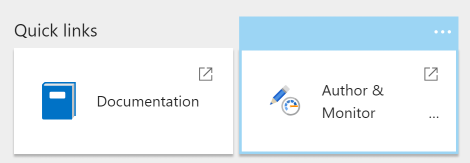

3. In the Azure Data Factory portal, select the pencil icon ("Author"). 

4. Click **Connections**, and then select **Integration Runtimes**.

5. Under **sourceIntegrationRuntime**, click the pencil icon ("Edit").

    > [!NOTE]
    > The portal will show the status as "unavailable". This is expected until you deploy the on-premises server.

6. Find **Key1** and copy the value of the authentication key.

You will need the authentication key for the next step.

### Deploy the simulated on-premises server

This step deploys a VM as a simulated on-premises server, which includes SQL Server 2017 and related tools. It also loads the [Wide World Importers OLTP database][wwi] into SQL Server.

1. Navigate to the `data\enterprise_bi_sqldw_advanced\onprem\templates` folder of the repository.

2. In the `onprem.parameters.json` file, search for `adminPassword`. This is the password to log into the SQL Server VM. Replace the value with another password.

3. In the same file, search for `SqlUserCredentials`. This property specifies the SQL Server account credentials. Replace the password with a different value.

4. In the same file, paste the Integration Runtime authentication key into the `IntegrationRuntimeGatewayKey` parameter, as shown below:

    ```json
    "protectedSettings": {
        "configurationArguments": {
            "SqlUserCredentials": {
                "userName": ".\\adminUser",
                "password": "<sql-db-password>"
            },
            "IntegrationRuntimeGatewayKey": "<authentication key>"
        }
    ```

5. Run the following command.

    ```bash
    azbb -s <subscription_id> -g <resource_group_name> -l <region> -p onprem.parameters.json --deploy
    ```

This step may take 20 to 30 minutes to complete. It includes running a [DSC](/powershell/dsc/overview) script to install the tools and restore the database. 

### Deploy Azure resources

This step provisions SQL Data Warehouse, Azure Analysis Services, and Data Factory.

1. Navigate to the `data\enterprise_bi_sqldw_advanced\azure\templates` folder of the [GitHub repository][ref-arch-repo].

2. Run the following Azure CLI command. Replace the parameter values shown in angle brackets.

    ```bash
    az group deployment create --resource-group <resource_group_name> \
     --template-file azure-resources-deploy.json \
     --parameters "dwServerName"="<data_warehouse_server_name>" \
     "dwAdminLogin"="adminuser" "dwAdminPassword"="<data_warehouse_password>" \ 
     "storageAccountName"="<storage_account_name>" \
     "analysisServerName"="<analysis_server_name>" \
     "analysisServerAdmin"="<user@contoso.com>"
    ```

    - The `storageAccountName` parameter must follow the [naming rules](../../best-practices/naming-conventions.md#naming-rules-and-restrictions) for Storage accounts. 
    - For the `analysisServerAdmin` parameter, use your Azure Active Directory user principal name (UPN).

3. Run the following Azure CLI command to get the access key for the storage account. You will use this key in the next step.

    ```bash
    az storage account keys list -n <storage_account_name> -g <resource_group_name> --query [0].value
    ```

4. Run the following Azure CLI command. Replace the parameter values shown in angle brackets. 

    ```bash
    az group deployment create --resource-group <resource_group_name> \
    --template-file adf-pipeline-deploy.json \
    --parameters "factoryName"="<data_factory_name>" \
    "sinkDWConnectionString"="Server=tcp:<data_warehouse_server_name>.database.windows.net,1433;Initial Catalog=wwi;Persist Security Info=False;User ID=adminuser;Password=<data_warehouse_password>;MultipleActiveResultSets=False;Encrypt=True;TrustServerCertificate=False;Connection Timeout=30;" \
    "blobConnectionString"="DefaultEndpointsProtocol=https;AccountName=<storage_account_name>;AccountKey=<storage_account_key>;EndpointSuffix=core.windows.net" \
    "sourceDBConnectionString"="Server=sql1;Database=WideWorldImporters;User Id=adminuser;Password=<sql-db-password>;Trusted_Connection=True;"
    ```

    The connection strings have substrings shown in angle brackets that must be replaced. For `<storage_account_key>`, use the key that you got in the previous step. For `<sql-db-password>`, use the SQL Server account password that you specified in the `onprem.parameters.json` file previously.

### Run the data warehouse scripts

1. In the [Azure Portal](https://portal.azure.com/), find the on-premises VM, which is named `sql-vm1`. The user name and password for the VM are specified in the `onprem.parameters.json` file.

2. Click **Connect** and use Remote Desktop to connect to the VM.

3. From your Remote Desktop session, open a command prompt and navigate to the following folder on the VM:

    ```
    cd C:\SampleDataFiles\reference-architectures\data\enterprise_bi_sqldw_advanced\azure\sqldw_scripts
    ```

4. Run the following command:

    ```
    deploy_database.cmd -S <data_warehouse_server_name>.database.windows.net -d wwi -U adminuser -P <data_warehouse_password> -N -I
    ```

    For `<data_warehouse_server_name>` and `<data_warehouse_password>`, use the data warehouse server name and password from earlier.

To verify this step, you can use SQL Server Management Studio (SSMS) to connect to the SQL Data Warehouse database. You should see the database table schemas.

### Run the Data Factory pipeline

1. From the same Remote Desktop session, open a PowerShell window.

2. Run the following PowerShell command. Choose **Yes** when prompted.

    ```powershell
    Install-Module -Name AzureRM -AllowClobber
    ```

3. Run the following PowerShell command. Enter your Azure credentials when prompted.

    ```powershell
    Connect-AzureRmAccount 
    ```

4. Run the following PowerShell commands. Replace the values in angle brackets.

    ```powershell
    Set-AzureRmContext -SubscriptionId <subscription id>

    Invoke-AzureRmDataFactoryV2Pipeline -DataFactory <data-factory-name> -PipelineName "MasterPipeline" -ResourceGroupName <resource_group_name>

5. In the Azure Portal, navigate to the Data Factory instance that was created earlier.

6. In the Data Factory blade, click **Author & Monitor**. This opens the Azure Data Factory portal in another browser window.

    

7. In the Azure Data Factory portal, click the **Monitor** icon. 

8. Verify that the pipeline completes successfully. It can take a few minutes.

    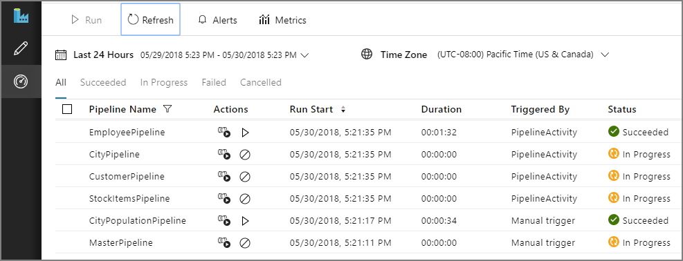


## Build the Analysis Services model

In this step, you will create a tabular model that imports data from the data warehouse. Then you will deploy the model to Azure Analysis Services.

**Create a new tabular project**

1. From your Remote Desktop session, launch SQL Server Data Tools 2015.

2. Select **File** > **New** > **Project**.

3. In the **New Project** dialog, under **Templates**, select  **Business Intelligence** > **Analysis Services** > **Analysis Services Tabular Project**. 

4. Name the project and click **OK**.

5. In the **Tabular model designer** dialog, select **Integrated workspace**  and set **Compatibility level** to `SQL Server 2017 / Azure Analysis Services (1400)`. 

6. Click **OK**.


**Import data**

1. In the **Tabular Model Explorer** window, right-click the project and select **Import from Data Source**.

2. Select **Azure SQL Data Warehouse** and click **Connect**.

3. For **Server**, enter the fully qualified name of your Azure SQL Data Warehouse server. You can get this value from the Azure Portal. For **Database**, enter `wwi`. Click **OK**.

4. In the next dialog, choose **Database** authentication and enter your Azure SQL Data Warehouse user name and password, and click **OK**.

5. In the **Navigator** dialog, select the checkboxes for the **Fact.\*** and **Dimension.\*** tables.

    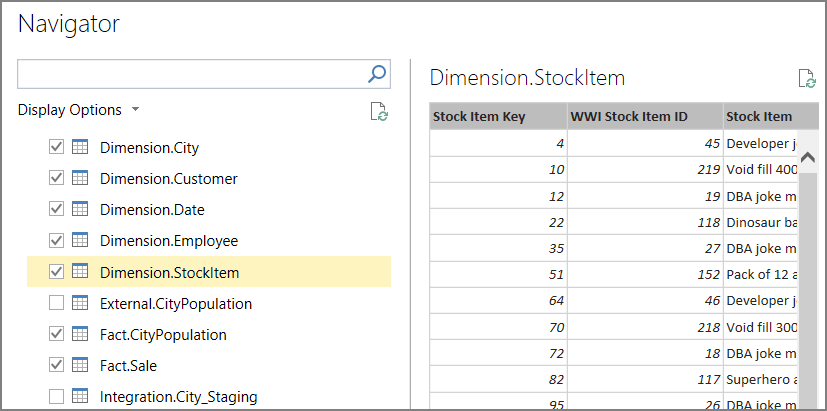

6. Click **Load**. When processing is complete, click **Close**. You should now see a tabular view of the data.

**Create measures**

1. In the model designer, select the **Fact Sale** table.

2. Click a cell in the the measure grid. By default, the measure grid is displayed below the table. 

    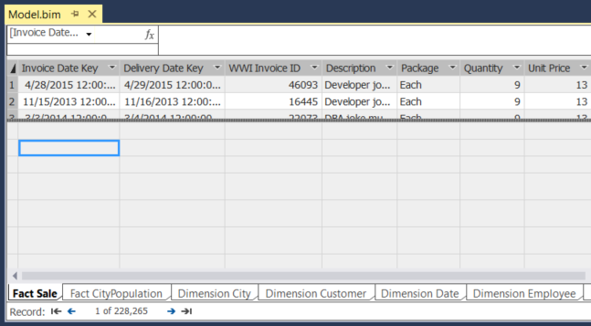

3. In the formula bar, enter the following and press ENTER:

    ```
    Total Sales:=SUM('Fact Sale'[Total Including Tax])
    ```

4. Repeat these steps to create the following measures:

    ```
    Number of Years:=(MAX('Fact CityPopulation'[YearNumber])-MIN('Fact CityPopulation'[YearNumber]))+1
    
    Beginning Population:=CALCULATE(SUM('Fact CityPopulation'[Population]),FILTER('Fact CityPopulation','Fact CityPopulation'[YearNumber]=MIN('Fact CityPopulation'[YearNumber])))
    
    Ending Population:=CALCULATE(SUM('Fact CityPopulation'[Population]),FILTER('Fact CityPopulation','Fact CityPopulation'[YearNumber]=MAX('Fact CityPopulation'[YearNumber])))
    
    CAGR:=IFERROR((([Ending Population]/[Beginning Population])^(1/[Number of Years]))-1,0)
    ```

    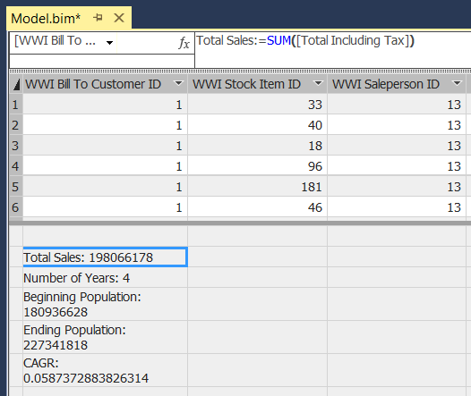

For more information about creating measures in SQL Server Data Tools, see [Measures](/sql/analysis-services/tabular-models/measures-ssas-tabular).

**Create relationships**

1. In the **Tabular Model Explorer** window, right-click the project and select **Model View** > **Diagram View**.

2. Drag the **[Fact Sale].[City Key]** field to the **[Dimension City].[City Key]** field to create a relationship.  

3. Drag the **[Face CityPopulation].[City Key]** field to the **[Dimension City].[City Key]** field.  

    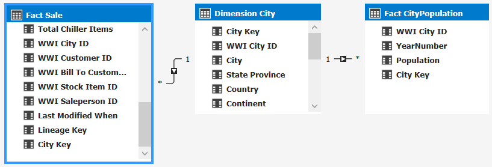

**Deploy the model**

1. From the **File** menu, choose **Save All**.

2. In **Solution Explorer**, right-click the project and select **Properties**. 

3. Under **Server**, enter the URL of your Azure Analysis Services instance. You can get this value from the Azure Portal. In the portal, select the Analysis Services resource, click the Overview pane, and look for the **Server Name** property. It will be similar to `asazure://westus.asazure.windows.net/contoso`. Click **OK**.

    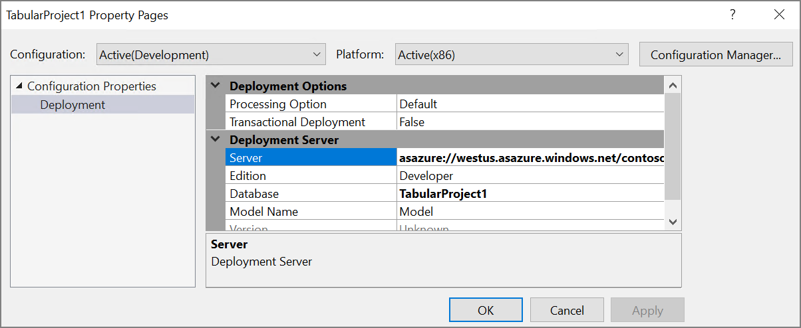

4. In **Solution Explorer**, right-click the project and select **Deploy**. Sign into Azure if prompted. When processing is complete, click **Close**.

5. In the Azure portal, view the details for your Azure Analysis Services instance. Verify that your model appears in the list of models.

    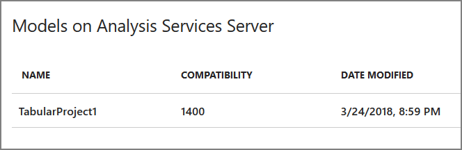

## Analyze the data in Power BI Desktop

In this step, you will use Power BI to create a report from the data in Analysis Services.

1. From your Remote Desktop session, launch Power BI Desktop.

2. In the Welcome Scren, click **Get Data**.

3. Select **Azure** > **Azure Analysis Services database**. Click **Connect**

    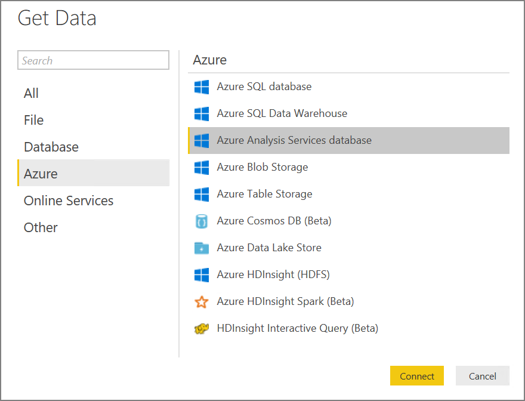

4. Enter the URL of your Analysis Services instance, then click **OK**. Sign into Azure if prompted.

5. In the **Navigator** dialog, expand the tabular project, select the model, and click **OK**.

2. In the **Visualizations** pane, select the **Table** icon. In the Report view, resize the visualization to make it larger.

6. In the **Fields** pane, expand **Dimension City**.

7. From **Dimension City**, drag **City** and **State Province** to the **Values** well.

9. In the **Fields** pane, expand **Fact Sale**.

10. From **Fact Sale**, drag **CAGR**, **Ending Population**,  and **Total Sales** to the **Value** well.

11. Under **Visual Level Filters**, select **Ending Population**. Set the filter to "is greater than 100000" and click **Apply filter**.

12. Under **Visual Level Filters**, select **Total Sales**. Set the filter to "is 0" and click **Apply filter**.

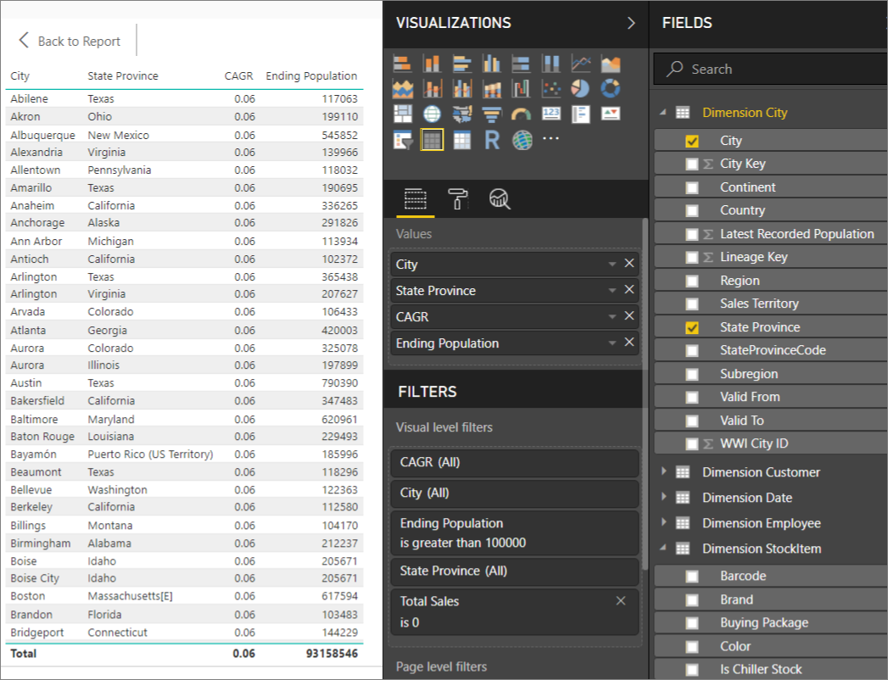

The table now shows cities with population greater than 100,000 and zero sales. CAGR  stands for Compounded Annual Growth Rate and measures the rate of population growth per city. You could use this value to find cities with high growth rates, for example. However, note that the values for CAGR in the model aren't accurate, because they are derived from sample data.

To learn more about Power BI Desktop, see [Getting started with Power BI Desktop](/power-bi/desktop-getting-started).


[adf]: //azure/data-factory
[azure-cli-2]: //azure/install-azure-cli
[azbb-repo]: https://github.com/mspnp/template-building-blocks
[azbb-wiki]: https://github.com/mspnp/template-building-blocks/wiki/Install-Azure-Building-Blocks
[MergeLocation]: https://github.com/mspnp/reference-architectures/blob/master/data/enterprise_bi_sqldw_advanced/azure/sqldw_scripts/city/%5BIntegration%5D.%5BMergeLocation%5D.sql
[ref-arch-repo]: https://github.com/mspnp/reference-architectures
[ref-arch-repo-folder]: https://github.com/mspnp/reference-architectures/tree/master/data/enterprise_bi_sqldw_advanced
[wwi]: //sql/sample/world-wide-importers/wide-world-importers-oltp-database
