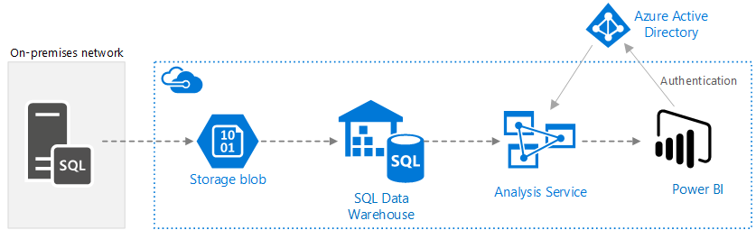
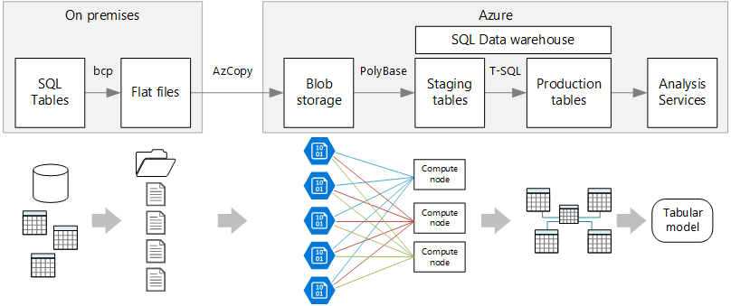
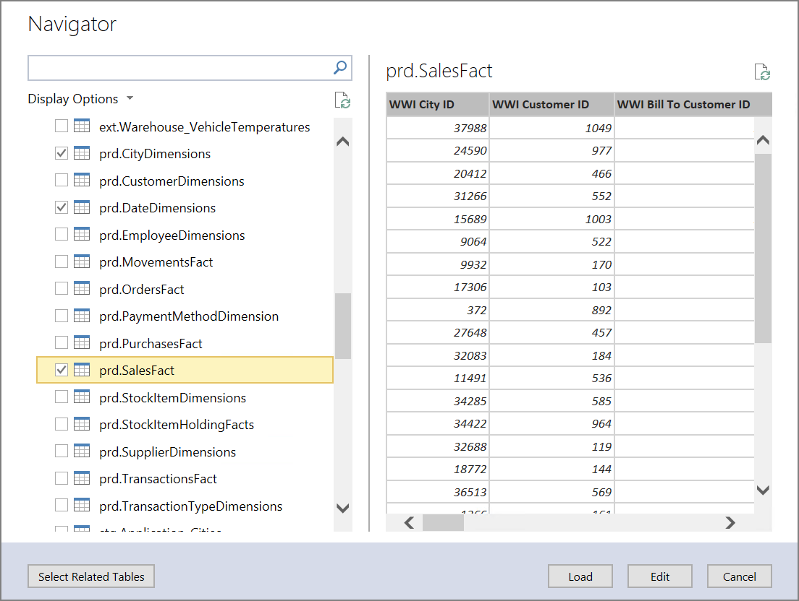
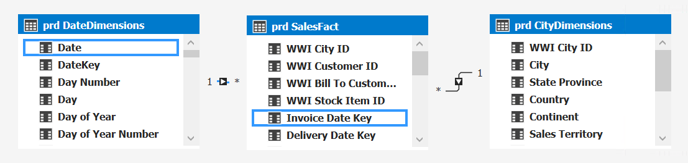
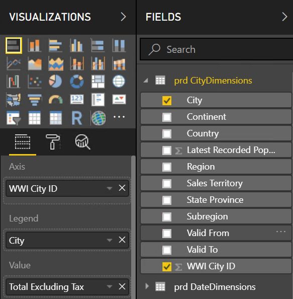
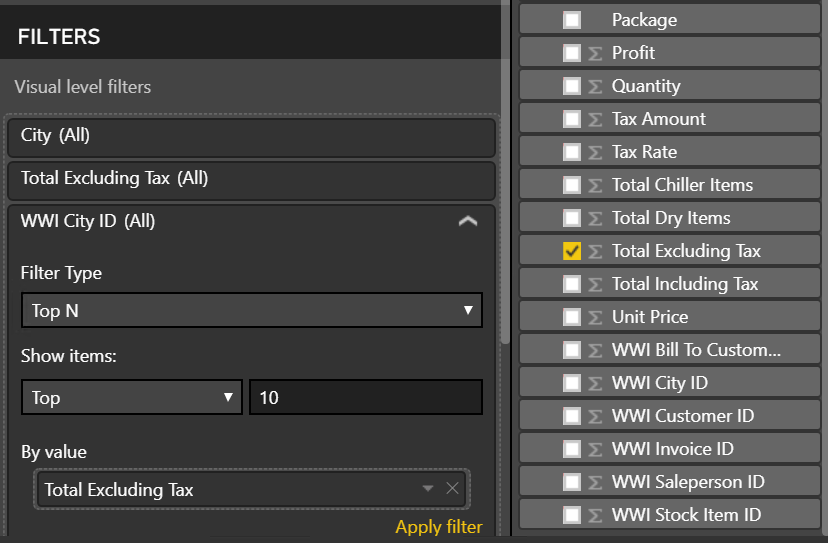
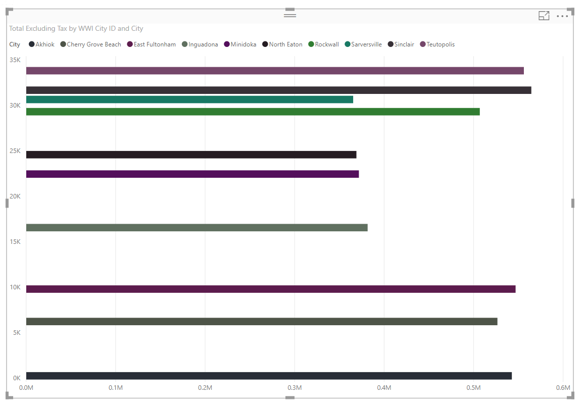

# Enterprise BI with SQL Data Warehouse

This reference architecture implements an [ELT](../../data-guide/relational-data/etl.md#extract-load-and-transform-elt) (extract-load-transform) pipeline that moves data from an on-premises SQL Server database into SQL Data Warehouse and transforms the data for analysis. [**Deploy this solution**.](#deploy-the-solution)



**Scenario**: An organization has a large OLTP data set stored in a SQL Server database on premises. The organization wants to use SQL Data Warehouse to perform analysis using Power BI. 

This reference architecture is designed for one-time or on-demand jobs. If you need to move data on a continuing basis (hourly or daily), we recommend using Azure Data Factory to define an automated workflow. For a reference architecture that uses Data Factory, see [Automated enterprise BI with SQL Data Warehouse and Azure Data Factory](./enterprise-bi-adf.md).

## Architecture

The architecture consists of the following components.

### Data source

**SQL Server**. The source data is located in a SQL Server database on premises. To simulate the on-premises environment, the deployment scripts for this architecture provision a VM in Azure with SQL Server installed. The [Wide World Importers OLTP sample database][wwi] is used as the source data.

### Ingestion and data storage

**Blob Storage**. Blob storage is used as a staging area to copy the data before loading it into SQL Data Warehouse.

**Azure SQL Data Warehouse**. [SQL Data Warehouse](/azure/sql-data-warehouse/) is a distributed system designed to perform analytics on large data. It supports massive parallel processing (MPP), which makes it suitable for running high-performance analytics. 

### Analysis and reporting

**Azure Analysis Services**. [Analysis Services](/azure/analysis-services/) is a fully managed service that provides data modeling capabilities. Use Analysis Services to create a semantic model that users can query. Analysis Services is especially useful in a BI dashboard scenario. In this architecture, Analysis Services reads data from the data warehouse to process the semantic model, and efficiently serves dashboard queries. It also supports elastic concurrency, by scaling out replicas for faster query processing.

Currently, Azure Analysis Services supports tabular models but not multidimensional models. Tabular models use relational modeling constructs (tables and columns), whereas multidimensional models use OLAP modeling constructs (cubes, dimensions, and measures). If you require multidimensional models, use SQL Server Analysis Services (SSAS). For more information, see [Comparing tabular and multidimensional solutions](/sql/analysis-services/comparing-tabular-and-multidimensional-solutions-ssas).

**Power BI**. Power BI is a suite of business analytics tools to analyze data for business insights. In this architecture, it queries the semantic model stored in Analysis Services.

### Authentication

**Azure Active Directory** (Azure AD) authenticates users who connect to the Analysis Services server through Power BI.

## Data pipeline
 
This reference architecture uses the [WorldWideImporters](/sql/sample/world-wide-importers/wide-world-importers-oltp-database) sample database as a data source. The data pipeline has the following stages:

1. Export the data from SQL Server to flat files (bcp utility).
2. Copy the flat files to Azure Blob Storage (AzCopy).
3. Load the data into SQL Data Warehouse (PolyBase).
4. Transform the data into a star schema (T-SQL).
5. Load a semantic model into Analysis Services (SQL Server Data Tools).


 
> [!NOTE]
> For steps 1 &ndash; 3, consider using Redgate Data Platform Studio. Data Platform Studio applies the most appropriate compatibility fixes and optimizations, so it's the quickest way to get started with SQL Data Warehouse. For more information, see [Load data with Redgate Data Platform Studio](/azure/sql-data-warehouse/sql-data-warehouse-load-with-redgate). 

The next sections describe these stages in more detail.

### Export data from SQL Server

The [bcp](/sql/tools/bcp-utility) (bulk copy program) utility is a fast way to create flat text files from SQL tables. In this step, you select the columns that you want to export, but don't transform the data. Any data transformations should happen in SQL Data Warehouse.

**Recommendations**

If possible, schedule data extraction during off-peak hours, to minimize resource contention in the production environment. 

Avoid running bcp on the database server. Instead, run it from another machine. Write the files to a local drive. Ensure that you have sufficient I/O resources to handle the concurrent writes. For best performance, export the files to dedicated fast storage drives.

You can speed up the network transfer by saving the exported data in Gzip compressed format. However, loading compressed files into the warehouse is slower than loading uncompressed files, so there is a tradeoff between faster network transfer versus faster loading. If you decide to use Gzip compression, don't create a single Gzip file. Instead, split the data into multiple compressed files.

### Copy flat files into blob storage

The [AzCopy](/azure/storage/common/storage-use-azcopy) utility is designed for high-performance copying of data into Azure blob storage.

**Recommendations**

Create the storage account in a region near the location of the source data. Deploy the storage account and the SQL Data Warehouse instance in the same region. 

Don't run AzCopy on the same machine that runs your production workloads, because the CPU and I/O consumption can interfere with the production workload. 

Test the upload first to see what the upload speed is like. You can use the /NC option in AzCopy to specify the number of concurrent copy operations. Start with the default value, then experiment with this setting to tune the performance. In a low-bandwidth environment, too many concurrent operations can overwhelm the network connection and prevent the operations from completing successfully.  

AzCopy moves data to storage over the public internet. If this isn't fast enough, consider setting up an [ExpressRoute](/azure/expressroute/) circuit. ExpressRoute is a service that routes your data through a dedicated private connection to Azure. Another option, if your network connection is too slow, is to physically ship the data on disk to an Azure datacenter. For more information, see [Transferring data to and from Azure](/azure/architecture/data-guide/scenarios/data-transfer).

During a copy operation, AzCopy creates a temporary journal file, which enables AzCopy to restart the operation if it gets interrupted (for example, due to a network error). Make sure there is enough disk space to store the journal files. You can use the /Z option to specify where the journal files are written.

### Load data into SQL Data Warehouse

Use [PolyBase](/sql/relational-databases/polybase/polybase-guide) to load the files from blob storage into the data warehouse. PolyBase is designed to leverage the MPP (Massively Parallel Processing) architecture of SQL Data Warehouse, which makes it the fastest way to load data into SQL Data Warehouse. 

Loading the data is a two-step process:

1. Create a set of external tables for the data. An external table is a table definition that points to data stored outside of the warehouse &mdash; in this case, the flat files in blob storage. This step does not move any data into the warehouse.
2. Create staging tables, and load the data into the staging tables. This step copies the data into the warehouse.

**Recommendations**

Consider SQL Data Warehouse when you have large amounts of data (more than 1 TB) and are running an analytics workload that will benefit from parallelism. SQL Data Warehouse is not a good fit for OLTP workloads or smaller data sets (< 250GB). For data sets less than 250GB, consider Azure SQL Database or SQL Server. For more information, see [Data warehousing](../../data-guide/relational-data/data-warehousing.md).

Create the staging tables as heap tables, which are not indexed. The queries that create the production tables will result in a full table scan, so there is no reason to index the staging tables.

PolyBase automatically takes advantage of parallelism in the warehouse. The load performance scales as you increase DWUs. For best performance, use a single load operation. There is no performance benefit to breaking the input data into chunks and running multiple concurrent loads.

PolyBase can read Gzip compressed files. However, only a single reader is used per compressed file, because uncompressing the file is a single-threaded operation. Therefore, avoid loading a single large compressed file. Instead, split the data into multiple compressed files, in order to take advantage of parallelism. 

Be aware of the following limitations:

- PolyBase supports a maximum column size of `varchar(8000)`, `nvarchar(4000)`, or `varbinary(8000)`. If you have data that exceeds these limits, one option is to break the data up into chunks when you export it, and then reassemble the chunks after import. 

- PolyBase uses a fixed row terminator of \n or newline. This can cause problems if newline characters appear in the source data.

- Your source data schema might contain data types that are not supported in SQL Data Warehouse.

To work around these limitations, you can create a stored procedure that performs the necessary conversions. Reference this stored procedure when you run bcp. Alternatively, [Redgate Data Platform Studio](/azure/sql-data-warehouse/sql-data-warehouse-load-with-redgate) automatically converts data types that aren’t supported in SQL Data Warehouse.

For more information, see the following articles:

- [Best practices for loading data into Azure SQL Data Warehouse](/azure/sql-data-warehouse/guidance-for-loading-data).
- [Migrate your schemas to SQL Data Warehouse](/azure/sql-data-warehouse/sql-data-warehouse-migrate-schema)
- [Guidance for defining data types for tables in SQL Data Warehouse](/azure/sql-data-warehouse/sql-data-warehouse-tables-data-types)

### Transform the data

Transform the data and move it into production tables. In this step, the data is transformed into a star schema with dimension tables and fact tables, suitable for semantic modeling.

Create the production tables with clustered columnstore indexes, which offer the best overall query performance. Columnstore indexes are optimized for queries that scan many records. Columnstore indexes don't perform as well for singleton lookups (that is, looking up a single row). If you need to perform frequent singleton lookups, you can add a non-clustered index to a table. Singleton lookups can run significantly faster using a non-clustered index. However, singleton lookups are typically less common in data warehouse scenarios than OLTP workloads. For more information, see [Indexing tables in SQL Data Warehouse](/azure/sql-data-warehouse/sql-data-warehouse-tables-index).

> [!NOTE]
> Clustered columnstore tables do not support `varchar(max)`, `nvarchar(max)`, or `varbinary(max)` data types. In that case, consider a heap or clustered index. You might put those columns into a separate table.

Because the sample database is not very large, we created replicated tables with no partitions. For production workloads, using distributed tables is likely to improve query performance. See [Guidance for designing distributed tables in Azure SQL Data Warehouse](/azure/sql-data-warehouse/sql-data-warehouse-tables-distribute). Our example scripts run the queries using a static [resource class](/azure/sql-data-warehouse/resource-classes-for-workload-management).

### Load the semantic model

Load the data into a tabular model in Azure Analysis Services. In this step, you create a semantic data model by using SQL Server Data Tools (SSDT). You can also create a model by importing it from a Power BI Desktop file. Because SQL Data Warehouse does not support foreign keys, you must add the relationships to the semantic model, so that you can join across tables.

### Use Power BI to visualize the data

Power BI supports two options for connecting to Azure Analysis Services:

- Import. The data is imported into the Power BI model.
- Live Connection. Data is pulled directly from Analysis Services.

We recommend Live Connection because it doesn't require copying data into the Power BI model. Also, using DirectQuery ensures that results are always consistent with the latest source data. For more information, see [Connect with Power BI](/azure/analysis-services/analysis-services-connect-pbi).

**Recommendations**

Avoid running BI dashboard queries directly against the data warehouse. BI dashboards require very low response times, which direct queries against the warehouse may be unable to satisfy. Also, refreshing the dashboard will count against the number of concurrent queries, which could impact performance. 

Azure Analysis Services is designed to handle the query requirements of a BI dashboard, so the recommended practice is to query Analysis Services from Power BI.

## Scalability considerations

### SQL Data Warehouse

With SQL Data Warehouse, you can scale out your compute resources on demand. The query engine optimizes queries for parallel processing based on the number of compute nodes, and moves data between nodes as necessary. For more information, see [Manage compute in Azure SQL Data Warehouse](/azure/sql-data-warehouse/sql-data-warehouse-manage-compute-overview).

### Analysis Services

For production workloads, we recommend the Standard Tier for Azure Analysis Services, because it supports partitioning and DirectQuery. Within a tier, the instance size determines the memory and processing power. Processing power is measured in Query Processing Units (QPUs). Monitor your QPU usage to select the appropriate size. For more information, see [Monitor server metrics](/azure/analysis-services/analysis-services-monitor).

Under high load, query performance can become degraded due to query concurrency. You can scale out Analysis Services by creating a pool of replicas to process queries, so that more queries can be performed concurrently. The work of processing the data model always happens on the primary server. By default, the primary server also handles queries. Optionally, you can designate the primary server to run processing exclusively, so that the query pool handles all queries. If you have high processing requirements, you should separate the processing from the query pool. If you have high query loads, and relatively light processing, you can include the primary server in the query pool. For more information, see [Azure Analysis Services scale-out](/azure/analysis-services/analysis-services-scale-out). 

To reduce the amount of unnecessary processing, consider using partitions to divide the tabular model into logical parts. Each partition can be processed separately. For more information, see [Partitions](/sql/analysis-services/tabular-models/partitions-ssas-tabular).

## Security considerations

### IP whitelisting of Analysis Services clients

Consider using the Analysis Services firewall feature to whitelist client IP addresses. If enabled, the firewall blocks all client connections other than those specified in the firewall rules. The default rules whitelist the Power BI service, but you can disable this rule if desired. For more information, see [Hardening Azure Analysis Services with the new firewall capability](https://azure.microsoft.com/blog/hardening-azure-analysis-services-with-the-new-firewall-capability/).

### Authorization

Azure Analysis Services uses Azure Active Directory (Azure AD) to authenticate users who connect to an Analysis Services server. You can restrict what data a particular user is able to view, by creating roles and then assigning Azure AD users or groups to those roles. For each role, you can: 

- Protect tables or individual columns. 
- Protect individual rows based on filter expressions. 

For more information, see [Manage database roles and users](/azure/analysis-services/analysis-services-database-users).

## Deploy the solution

A deployment for this reference architecture is available on [GitHub][ref-arch-repo-folder]. It deploys the following:

  * A Windows VM to simulate an on-premises database server. It includes SQL Server 2017 and related tools, along with Power BI Desktop.
  * An Azure storage account that provides Blob storage to hold data exported from the SQL Server database.
  * An Azure SQL Data Warehouse instance.
  * An Azure Analysis Services instance.

### Prerequisites

[!INCLUDE [ref-arch-prerequisites.md](../../../includes/ref-arch-prerequisites.md)]

### Deploy the simulated on-premises server

First you'll deploy a VM as a simulated on-premises server, which includes SQL Server 2017 and related tools. This step also loads the [Wide World Importers OLTP database][wwi] into SQL Server.

1. Navigate to the `data\enterprise_bi_sqldw\onprem\templates` folder of the repository.

2. In the `onprem.parameters.json` file, replace the values for `adminUsername` and `adminPassword`. Also change the values in the `SqlUserCredentials` section to match the user name and password. Note the `.\\` prefix in the userName property.
    
    ```bash
    "SqlUserCredentials": {
      "userName": ".\\username",
      "password": "password"
    }
    ```

3. Run `azbb` as shown below to deploy the on-premises server.

    ```bash
    azbb -s <subscription_id> -g <resource_group_name> -l <region> -p onprem.parameters.json --deploy
    ```

    Specify a region that supports SQL Data Warehouse and Azure Analysis Services. See [Azure Products by Region](https://azure.microsoft.com/global-infrastructure/services/)

4. The deployment may take 20 to 30 minutes to complete, which includes running the [DSC](/powershell/dsc/overview) script to install the tools and restore the database. Verify the deployment in the Azure portal by reviewing the resources in the resource group. You should see the `sql-vm1` virtual machine and its associated resources.

### Deploy the Azure resources

This step provisions SQL Data Warehouse and Azure Analysis Services, along with a Storage account. If you want, you can run this step in parallel with the previous step.

1. Navigate to the `data\enterprise_bi_sqldw\azure\templates` folder of the repository.

2. Run the following Azure CLI command to create a resource group. You can deploy to a different resource group than the previous step, but choose the same region. 

    ```bash
    az group create --name <resource_group_name> --location <region>  
    ```

3. Run the following Azure CLI command to deploy the Azure resources. Replace the parameter values shown in angle brackets. 

    ```bash
    az group deployment create --resource-group <resource_group_name> \
     --template-file azure-resources-deploy.json \
     --parameters "dwServerName"="<server_name>" \
     "dwAdminLogin"="<admin_username>" "dwAdminPassword"="<password>" \ 
     "storageAccountName"="<storage_account_name>" \
     "analysisServerName"="<analysis_server_name>" \
     "analysisServerAdmin"="user@contoso.com"
    ```

    - The `storageAccountName` parameter must follow the [naming rules](../../best-practices/naming-conventions.md#naming-rules-and-restrictions) for Storage accounts.
    - For the `analysisServerAdmin` parameter, use your Azure Active Directory user principal name (UPN).

4. Verify the deployment in the Azure portal by reviewing the resources in the resource group. You should see a storage account, Azure SQL Data Warehouse instance, and Analysis Services instance.

5. Use the Azure portal to get the access key for the storage account. Select the storage account to open it. Under **Settings**, select **Access keys**. Copy the primary key value. You will use it in the next step.

### Export the source data to Azure Blob storage 

In this step, you will run a PowerShell script that uses bcp to export the SQL database to flat files on the VM, and then uses AzCopy to copy those files into Azure Blob Storage.

1. Use Remote Desktop to connect to the simulated on-premises VM.

2. While logged into the VM, run the following commands from a PowerShell window.  

    ```powershell
    cd 'C:\SampleDataFiles\reference-architectures\data\enterprise_bi_sqldw\onprem'

    .\Load_SourceData_To_Blob.ps1 -File .\sql_scripts\db_objects.txt -Destination 'https://<storage_account_name>.blob.core.windows.net/wwi' -StorageAccountKey '<storage_account_key>'
    ```

    For the `Destination` parameter, replace `<storage_account_name>` with the name the Storage account that you created previously. For the `StorageAccountKey` parameter, use the access key for that Storage account.

3. In the Azure portal, verify that the source data was copied to Blob storage by navigating to the storage account, selecting the Blob service, and opening the `wwi` container. You should see a list of tables prefaced with `WorldWideImporters_Application_*`.

### Run the data warehouse scripts

1. From your Remote Desktop session, launch SQL Server Management Studio (SSMS). 

2. Connect to SQL Data Warehouse

    - Server type: Database Engine
    
    - Server name: `<dwServerName>.database.windows.net`, where `<dwServerName>` is the name that you specified when you deployed the Azure resources. You can get this name from the Azure portal.
    
    - Authentication: SQL Server Authentication. Use the credentials that you specified when you deployed the Azure resources, in the `dwAdminLogin` and `dwAdminPassword` parameters.

2. Navigate to the `C:\SampleDataFiles\reference-architectures\data\enterprise_bi_sqldw\azure\sqldw_scripts` folder on the VM. You will execute the scripts in this folder in numerical order, `STEP_1` through `STEP_7`.

3. Select the `master` database in SSMS and open the `STEP_1` script. Change the value of the password in the following line, then execute the script.

    ```sql
    CREATE LOGIN LoaderRC20 WITH PASSWORD = '<change this value>';
    ```

4. Select the `wwi` database in SSMS. Open the `STEP_2` script and execute the script. If you get an error, make sure you are running the script against the `wwi` database and not `master`.

5. Open a new connection to SQL Data Warehouse, using the `LoaderRC20` user and the password indicated in the `STEP_1` script.

6. Using this connection, open the `STEP_3` script. Set the following values in the script:

    - SECRET: Use the access key for your storage account.
    - LOCATION: Use the name of the storage account as follows: `wasbs://wwi@<storage_account_name>.blob.core.windows.net`.

7. Using the same connection, execute scripts `STEP_4` through `STEP_7` sequentially. Verify that each script completes successfully before running the next.

In SMSS, you should see a set of `prd.*` tables in the `wwi` database. To verify that the data was generated, run the following query: 

```sql
SELECT TOP 10 * FROM prd.CityDimensions
```

## Build the Analysis Services model

In this step, you will create a tabular model that imports data from the data warehouse. Then you will deploy the model to Azure Analysis Services.

1. From your Remote Desktop session, launch SQL Server Data Tools 2015.

2. Select **File** > **New** > **Project**.

3. In the **New Project** dialog, under **Templates**, select  **Business Intelligence** > **Analysis Services** > **Analysis Services Tabular Project**. 

4. Name the project and click **OK**.

5. In the **Tabular model designer** dialog, select **Integrated workspace**  and set **Compatibility level** to `SQL Server 2017 / Azure Analysis Services (1400)`. Click **OK**.

6. In the **Tabular Model Explorer** window, right-click the project and select **Import from Data Source**.

7. Select **Azure SQL Data Warehouse** and click **Connect**.

8. For **Server**, enter the fully qualified name of your Azure SQL Data Warehouse server. For **Database**, enter `wwi`. Click **OK**.

9. In the next dialog, choose **Database** authentication and enter your Azure SQL Data Warehouse user name and password, and click **OK**.

10. In the **Navigator** dialog, select the checkboxes for **prd.CityDimensions**, **prd.DateDimensions**, and **prd.SalesFact**. 

    

11. Click **Load**. When processing is complete, click **Close**. You should now see a tabular view of the data.

12. In the **Tabular Model Explorer** window, right-click the project and select **Model View** > **Diagram View**.

13. Drag the **[prd.SalesFact].[WWI City ID]** field to the **[prd.CityDimensions].[WWI City ID]** field to create a relationship.  

14. Drag the **[prd.SalesFact].[Invoice Date Key]** field to the **[prd.DateDimensions].[Date]** field.  
    

15. From the **File** menu, choose **Save All**.  

16. In **Solution Explorer**, right-click the project and select **Properties**. 

17. Under **Server**, enter the URL of your Azure Analysis Services instance. You can get this value from the Azure Portal. In the portal, select the Analysis Services resource, click the Overview pane, and look for the **Server Name** property. It will be similar to `asazure://westus.asazure.windows.net/contoso`. Click **OK**.

    

18. In **Solution Explorer**, right-click the project and select **Deploy**. Sign into Azure if prompted. When processing is complete, click **Close**.

19. In the Azure portal, view the details for your Azure Analysis Services instance. Verify that your model appears in the list of models.

    

## Analyze the data in Power BI Desktop

In this step, you will use Power BI to create a report from the data in Analysis Services.

1. From your Remote Desktop session, launch Power BI Desktop.

2. In the Welcome Scren, click **Get Data**.

3. Select **Azure** > **Azure Analysis Services database**. Click **Connect**

    

4. Enter the URL of your Analysis Services instance, then click **OK**. Sign into Azure if prompted.

5. In the **Navigator** dialog, expand the tabular project that you deployed, select the model that you created, and click **OK**.

2. In the **Visualizations** pane, select the **Stacked Bar Chart** icon. In the Report view, resize the visualization to make it larger.

6. In the **Fields** pane, expand **prd.CityDimensions**.

7. Drag **prd.CityDimensions** > **WWI City ID** to the **Axis** well.

8. Drag **prd.CityDimensions** > **City** to the **Legend** well.

9. In the **Fields** pane, expand **prd.SalesFact**.

10. Drag **prd.SalesFact** > **Total Excluding Tax** to the **Value** well.

    

11. Under **Visual Level Filters**, select **WWI City ID**.

12. Set the **Filter Type** to `Top N`, and set **Show Items** to `Top 10`.

13. Drag **prd.SalesFact** > **Total Excluding Tax** to the **By Value** well

    

14. Click **Apply Filter**. The visualization shows the top 10 total sales by city.

    

To learn more about Power BI Desktop, see [Getting started with Power BI Desktop](/power-bi/desktop-getting-started).

## Next steps

- For more information about this reference architecture, visit our [GitHub repository][ref-arch-repo-folder].
- Learn about the [Azure Building Blocks][azbb-repo].

<!-- links -->

[azure-cli-2]: /azure/install-azure-cli
[azbb-repo]: https://github.com/mspnp/template-building-blocks
[azbb-wiki]: https://github.com/mspnp/template-building-blocks/wiki/Install-Azure-Building-Blocks
[github-folder]: https://github.com/mspnp/reference-architectures/tree/master/data/enterprise_bi_sqldw
[ref-arch-repo]: https://github.com/mspnp/reference-architectures
[ref-arch-repo-folder]: https://github.com/mspnp/reference-architectures/tree/master/data/enterprise_bi_sqldw
[wwi]: /sql/sample/world-wide-importers/wide-world-importers-oltp-database
