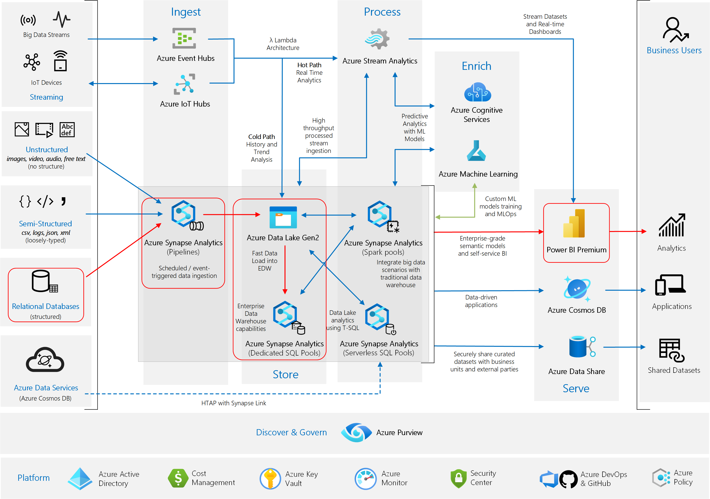
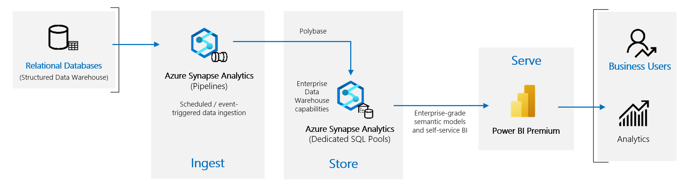
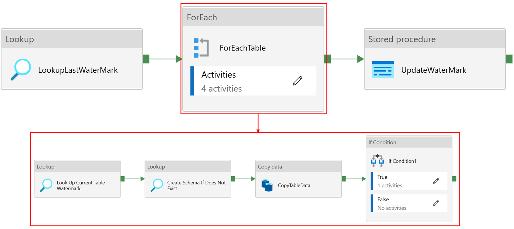

This reference architecture implements the [Analytics end-to-end with Azure Synapse][e2e-analytics] pattern, using a Synapse Pipeline to ingest data from an on-premises Data Warehouse into Synapse SQL Pools, before transforming the data for analysis.

<!-- Requires update
 A reference implementation for this architecture is available on [GitHub][github-folder].
-->

### Enterprise Architecture

<!--
TODO - may be grey out the background more and only circle the Synapse Provisioned Pools without ADLS? 
-->

**Scenario**: An organization has a large on-premises Data Warehouse stored in a SQL Database. The organization wants to use Azure Synapse to perform analysis using Power BI.

This reference architecture shows on-premises Data Warehouse as a source of ongoing ingestion with cloud based processing and serving of BI Model. 
This approach could be an end goal or a first step towards full modernization with cloud based components.  

## Architecture

The architecture consists of the following components.

### Data source

**SQL Server**. The source data is located in a SQL Server database on premises. To simulate the on-premises environment, the deployment scripts for this architecture provision a VM in Azure with SQL Server installed. The [Adventure Works DW][adventureworksdw-sample-link] is used as the source data schema and sample data. 
<! TODO - import the backup, save inside the repo and change variable format? -->

### Ingestion and data storage

**Azure Data Lake Gen2 (ADLS)**. [ADLS](/azure/databricks/data/data-sources/azure/adls-gen2/) is used as a temparary 'stage' area during PolyBase copy into Azure Synapse Dedicated SQL Pool.

**Azure Synapse**. [Azure Synapse](/azure/sql-data-warehouse/) is a distributed system designed to perform analytics on large data. It supports massive parallel processing (MPP), which makes it suitable for running high-performance analytics. Azure Synapse Dedicated Pool is a target for ongoing ingestion from on-premises. It is levereged for further processing if required, as well as serving the data for PowerBI over Direct Query mode. 

**Azure Synapse Pipelines**. [Synapse Pipelines](/azure/data-factory/concepts-pipelines-activities) are used as a tool to orchestrate data ingestion and transformation within your Azure Synapse workspace. We are using 'High Watermark' approach to deliver ongoing ingestion of data. 

### Analysis and reporting

Data modeling approach in this use case is presented by composition of Enterprise model and BI Semantic model. [Enterprise model][enterprise-model] is stored in [Synapse Dedicated SQL Pool][synapse-dedicated-pool] and the [BI Semantic model][bi-model] is stored in [Power BI Premium Capacities][pbi-premium-capacities]. Power BI accesses the data via Direct Query mode. 

### Authentication

**Azure Active Directory (Azure AD)** authenticates users who connect to Power BI dashboards and apps and we use SSO to connect to the data souce in Azure Synapse Provisioned Pool. Authorization happens on the source.  

### Architecture Diagram

<!-- TODO: find better place for this -->

## Data pipeline

This reference architecture uses the [Adventure Works DW][adventureworksdw-sample-link] sample database as a data source. The data pipeline has the following stages:

<!--
1. Export the data from SQL Server to flat files (bcp utility).
2. Copy the flat files to Azure Blob Storage (AzCopy).
3. Load the data into Azure Synapse (PolyBase).
4. Transform the data into a star schema (T-SQL).
5. Load a semantic model into Analysis Services (SQL Server Data Tools). 
-->

1. Most recent watermark entry is retrieved from the control table, located in the SQL DB.
1. For every table in the SQL DB, the pipeline will:

    1. Find the most recent entry in the table's watermark column
    1. Check if a schema for the table exists, and create a schema if one is not found.
    1. The Copy Data activity in Azure Synapse Pipelines will copy data from the SQL DB into the ADLS staging environment.
    1. Data from the staging environment is then loaded into the Synapse Provisioned SQL Pool via PolyBase
    1. We store the new watermark value to update later <!-- TODO - Noah: change if condition to appending variable onto list, update stored proc to simplify-->
1. A stored procedure to update the watermark stored in the SQL DB is executed.

<!-- synapse data mapping flows, added by eng team TODO: how mapping data flows transform the data-->

The next sections describe these stages in more detail.

### Load data into Azure Synapse

Use [PolyBase](/sql/relational-databases/polybase/polybase-guide) to load the files from blob storage into the data warehouse. PolyBase is designed to leverage the MPP (Massively Parallel Processing) architecture of Azure Synapse, which makes it the fastest way to load data into Azure Synapse.

Loading the data is a two-step process:

1. Create a set of external tables for the data. An external table is a table definition that points to data stored outside of the warehouse &mdash; in this case, the flat files in blob storage. This step does not move any data into the warehouse.
2. Create staging tables, and load the data into the staging tables. This step copies the data into the warehouse.

**Recommendations:**

Consider Azure Synapse when you have large amounts of data (more than 1 TB) and are running an analytics workload that will benefit from parallelism. Azure Synapse is not a good fit for OLTP workloads or smaller data sets (less than 250 GB). For data sets less than 250 GB, consider Azure SQL Database or SQL Server. For more information, see [Data warehousing](../../data-guide/relational-data/data-warehousing.md).

Create the staging tables as heap tables, which are not indexed. The queries that create the production tables will result in a full table scan, so there is no reason to index the staging tables.

PolyBase automatically takes advantage of parallelism in the warehouse. The load performance scales as you increase DWUs. For best performance, use a single load operation. There is no performance benefit to breaking the input data into chunks and running multiple concurrent loads.

PolyBase can read Gzip compressed files. However, only a single reader is used per compressed file, because uncompressing the file is a single-threaded operation. Therefore, avoid loading a single large compressed file. Instead, split the data into multiple compressed files, in order to take advantage of parallelism.

Be aware of the following limitations:

- PolyBase supports a maximum column size of `varchar(8000)`, `nvarchar(4000)`, or `varbinary(8000)`. If you have data that exceeds these limits, one option is to break the data up into chunks when you export it, and then reassemble the chunks after import.

- PolyBase uses a fixed row terminator of \n or newline. This can cause problems if newline characters appear in the source data.

- Your source data schema might contain data types that are not supported in Azure Synapse.

To work around these limitations, you can create a stored procedure that performs the necessary conversions. Reference this stored procedure when you run bcp. Alternatively, [Redgate Data Platform Studio](/azure/sql-data-warehouse/sql-data-warehouse-load-with-redgate) automatically converts data types that aren't supported in Azure Synapse.

For more information, see the following articles:

- [Best practices for loading data into Azure Synapse](/azure/sql-data-warehouse/guidance-for-loading-data).
- [Migrate your schemas to Azure Synapse](/azure/sql-data-warehouse/sql-data-warehouse-migrate-schema)
- [Guidance for defining data types for tables in Azure Synapse](/azure/sql-data-warehouse/sql-data-warehouse-tables-data-types)

### Transform the data

Transform the data and move it into production tables. In this step, the data is transformed into a star schema with dimension tables and fact tables, suitable for semantic modeling.

Create the production tables with clustered columnstore indexes, which offer the best overall query performance. Columnstore indexes are optimized for queries that scan many records. Columnstore indexes don't perform as well for singleton lookups (that is, looking up a single row). If you need to perform frequent singleton lookups, you can add a non-clustered index to a table. Singleton lookups can run significantly faster using a non-clustered index. However, singleton lookups are typically less common in data warehouse scenarios than OLTP workloads. For more information, see [Indexing tables in Azure Synapse](/azure/sql-data-warehouse/sql-data-warehouse-tables-index).

> [!NOTE]
> Clustered columnstore tables do not support `varchar(max)`, `nvarchar(max)`, or `varbinary(max)` data types. In that case, consider a heap or clustered index. You might put those columns into a separate table.

Because the sample database is not very large, we created replicated tables with no partitions. For production workloads, using distributed tables is likely to improve query performance. See [Guidance for designing distributed tables in Azure Synapse](/azure/sql-data-warehouse/sql-data-warehouse-tables-distribute). Our example scripts run the queries using a static [resource class](/azure/sql-data-warehouse/resource-classes-for-workload-management).

### Load the semantic model

Load the data into a tabular model in Azure Analysis Services. In this step, you create a semantic data model by using SQL Server Data Tools (SSDT). You can also create a model by importing it from a Power BI Desktop file. Because Azure Synapse does not support foreign keys, you must add the relationships to the semantic model, so that you can join across tables.

### Use Power BI to visualize the data

Power BI supports two options for connecting to Azure Analysis Services:

- Import. The data is imported into the Power BI model.
- Live Connection. Data is pulled directly from Analysis Services.

We recommend Live Connection because it doesn't require copying data into the Power BI model. Also, using DirectQuery ensures that results are always consistent with the latest source data. For more information, see [Connect with Power BI](/azure/analysis-services/analysis-services-connect-pbi).

**Recommendations:**

Avoid running BI dashboard queries directly against the data warehouse. BI dashboards require very low response times, which direct queries against the warehouse may be unable to satisfy. Also, refreshing the dashboard will count against the number of concurrent queries, which could impact performance.

Azure Analysis Services is designed to handle the query requirements of a BI dashboard, so the recommended practice is to query Analysis Services from Power BI.

## Scalability considerations

### Azure Synapse

With Azure Synapse, you can scale out your compute resources on demand. The query engine optimizes queries for parallel processing based on the number of compute nodes, and moves data between nodes as necessary. For more information, see [Manage compute in Azure Synapse](/azure/sql-data-warehouse/sql-data-warehouse-manage-compute-overview).

### Analysis Services

For production workloads, we recommend the Standard Tier for Azure Analysis Services, because it supports partitioning and DirectQuery. Within a tier, the instance size determines the memory and processing power. Processing power is measured in Query Processing Units (QPUs). Monitor your QPU usage to select the appropriate size. For more information, see [Monitor server metrics](/azure/analysis-services/analysis-services-monitor).

Under high load, query performance can become degraded due to query concurrency. You can scale out Analysis Services by creating a pool of replicas to process queries, so that more queries can be performed concurrently. The work of processing the data model always happens on the primary server. By default, the primary server also handles queries. Optionally, you can designate the primary server to run processing exclusively, so that the query pool handles all queries. If you have high processing requirements, you should separate the processing from the query pool. If you have high query loads, and relatively light processing, you can include the primary server in the query pool. For more information, see [Azure Analysis Services scale-out](/azure/analysis-services/analysis-services-scale-out).

To reduce the amount of unnecessary processing, consider using partitions to divide the tabular model into logical parts. Each partition can be processed separately. For more information, see [Partitions](/sql/analysis-services/tabular-models/partitions-ssas-tabular).

## Security considerations

### IP allow list of Analysis Services clients

Consider using the Analysis Services firewall feature to allow list client IP addresses. If enabled, the firewall blocks all client connections other than those specified in the firewall rules. The default rules allow list the Power BI service, but you can disable this rule if desired. For more information, see [Hardening Azure Analysis Services with the new firewall capability](https://azure.microsoft.com/blog/hardening-azure-analysis-services-with-the-new-firewall-capability/).

### Authorization

Azure Analysis Services uses Azure Active Directory (Azure AD) to authenticate users who connect to an Analysis Services server. You can restrict what data a particular user is able to view, by creating roles and then assigning Azure AD users or groups to those roles. For each role, you can:

- Protect tables or individual columns.
- Protect individual rows based on filter expressions.

For more information, see [Manage database roles and users](/azure/analysis-services/analysis-services-database-users).

## DevOps considerations

- Create separate resource groups for production, development, and test environments. Separate resource groups make it easier to manage deployments, delete test deployments, and assign access rights.

- Use the [Azure Building blocks][azbb] templates provided in this architecture or create [Azure Resource Manager template][arm-template] to deploy the Azure resources following the infrastructure as Code (IaC) Process. With templates,  automating deployments using [Azure DevOps Services][az-devops], or other CI/CD solutions is easier.

- Put each workload in a separate deployment template and store the resources in source control systems. You can deploy the templates together or individually as part of a CI/CD process, making the automation process easier.

    In this architecture, there are three main workloads:
    - The data warehouse server, Analysis Services, and related resources.
    - Azure Data Factory.
    - An on-premises to cloud simulated scenario.
    
    Each workload has its own deployment template.
    
    The data warehouse server is set up and configured by using Azure CLI commands which follows the imperative approach of the IaC practice. Consider using deployment scripts and integrate them in the automation process.

- Consider staging your workloads. Deploy to various stages and run validation checks at each stage before moving to the next stage. That way you can push updates to your production environments in a highly controlled way and minimize unanticipated deployment issues. Use [Blue-green deployment][blue-green-dep] and [Canary releases][cannary-releases]  strategies for updating live production environments.

    Have a good rollback strategy for handling failed deployments. For example, you can automatically redeploy an earlier, successful deployment from your deployment history. See the --rollback-on-error flag parameter in Azure CLI.

- [Azure Monitor][azure-monitor] is the recommended option for analyzing the performance of your data warehouse and the entire Azure analytics platform for an integrated monitoring experience. [Azure Synapse Analytics][synapse-analytics] provides a monitoring experience within the Azure portal to show insights to your data warehouse workload. The Azure portal is the recommended tool when monitoring your data warehouse because it provides configurable retention periods, alerts, recommendations, and customizable charts and dashboards for metrics and logs.

For more information, see the DevOps section in [Microsoft Azure Well-Architected Framework][AAF-devops].

## Cost Considerations

### Azure Synapse

- Choose **Compute Optimized Gen1** for frequent scaling operations. This option is priced as pay-as-you-go, based on Data warehouse units consumption (DWU).

- Choose **Compute Optimized Gen2** for intensive workloads with higher query performance and compute scalability needs. You can choose the pay-as-you-go model or use reserved plans of one year (37% savings) or 3 years (65% savings).

Data storage is charged separately. Other services such as disaster recovery and threat detection are also charged separately.

For more information, see [Azure Synapse Pricing][az-synapse-pricing].

### Azure Analysis Services

Pricing for Azure Analysis Services depends on the tier. The reference implementation of this architecture uses the **Developer** tier, which is recommended for evaluation, development, and test scenarios. Other tiers include, the **Basic** tier, which is recommended for small production environment; the **Standard** tier for mission-critical production applications. For more information, see [The right tier when you need it](/azure/analysis-services/analysis-services-overview#the-right-tier-when-you-need-it).

No charges apply when you pause your instance.

For more information, see [Azure Analysis Services pricing][az-as-pricing].

### Blob Storage

Consider using the Azure Storage reserved capacity feature to lower cost on storage. With this model, you get a discount if you can commit to reservation for fixed storage capacity for one or three years. For more information, see [Optimize costs for Blob storage with reserved capacity][az-storage-reserved].

### Power BI Embedded

Power BI Embedded is a Platform-as-a-Service (PaaS) solution that offers a set of APIs to enable the integration of Power BI content into custom apps and websites. Users who publish BI content need to be licensed with [Power BI Pro][powerbi-pro-purchase]. For information about pricing, see [Power BI Embedded pricing][powerbi-embedded-pricing].

For more information, see the Cost section in [Microsoft Azure Well-Architected Framework][aaf-cost].

## Deploy the solution

To the deploy and run the reference implementation, follow the steps in the [GitHub readme][github-folder]. It deploys the following resources:

- A Windows VM to simulate an on-premises database server. It includes SQL Server 2017 and related tools, along with Power BI Desktop.
- An Azure storage account that provides Blob storage to hold data exported from the SQL Server database.
- An Azure Synapse instance.
- An Azure Analysis Services instance.

## Next steps

- Use Azure Data Factory to automate the ELT pipeline. See [Automated enterprise BI with Azure Synapse and Azure Data Factory][adf-ra].

## Related resources

You may want to review the following [Azure example scenarios](/azure/architecture/example-scenario) that demonstrate specific solutions using some of the same technologies:

- [Data warehousing and analytics for sales and marketing](../../example-scenario/data/data-warehouse.yml)
- [Hybrid ETL with existing on-premises SSIS and Azure Data Factory](../../example-scenario/data/hybrid-etl-with-adf.yml)

<!-- links -->

[AAF-devops]: ../../framework/devops/overview.md
[arm-template]: /azure/azure-resource-manager/resource-group-overview#resource-groups
[az-devops]: /azure/virtual-machines/windows/infrastructure-automation#azure-devops-services
[azbb]: https://github.com/mspnp/template-building-blocks/wiki
[azure-monitor]: https://azure.microsoft.com/services/monitor
[blue-green-dep]: https://martinfowler.com/bliki/BlueGreenDeployment.html
[cannary-releases]: https://martinfowler.com/bliki/CanaryRelease.html
[e2e-analytics]: ../../example-scenario/dataplate2e/data-platform-end-to-end-content.md
[github-folder]: https://github.com/mspnp/azure-sqldw-enterprise-bi
[synapse-analytics]: /azure/sql-data-warehouse/sql-data-warehouse-concept-resource-utilization-query-activity
[wwi]: /sql/sample/world-wide-importers/wide-world-importers-oltp-database
[powerbi-embedded-pricing]: https://azure.microsoft.com/pricing/details/power-bi-embedded
[powerbi-pro-purchase]: /power-bi/service-admin-purchasing-power-bi-pro
[adventureworksdw-sample-link]: /sql/samples/adventureworks-install-configure?view=sql-server-ver15&tabs=ssms
[az-synapse-pricing]: https://azure.microsoft.com/pricing/details/synapse-analytics
[az-as-pricing]: https://azure.microsoft.com/pricing/details/analysis-services
[az-storage-reserved]: /azure/storage/blobs/storage-blob-reserved-capacity
[aaf-cost]: ../../framework/cost/overview.md
[enterprise-model]: powerbi-docs/guidance/center-of-excellence-business-intelligence-solution-architecture.md#enterprise-models
[bi-model]:powerbi-docs/guidance/center-of-excellence-business-intelligence-solution-architecture.md#bi-semantic-models
[pbi-premium-capacities]: powerbi-docs/admin/service-premium-what-is.md#reserved-capacities
[synapse-dedicated-pool]:azure/articles/synapse-analytics/sql-data-warehouse/sql-data-warehouse-overview-what-is.md#synapse-sql-pool-in-azure-synapse
