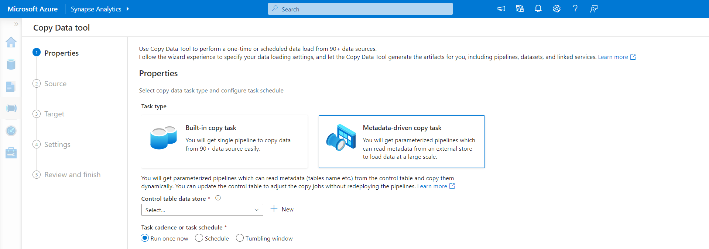

This reference architecture implements the [Analytics end-to-end with Azure Synapse][e2e-analytics] pattern, using a Synapse Pipeline to ingest data from an on-premises Data Warehouse into Synapse SQL Pools, before transforming the data for analysis.

<!-- Requires update
 A reference implementation for this architecture is available on [GitHub][github-folder].
-->

### Enterprise Architecture

<!-- 
-->
*Diagram: [Analytics end-to-end with Azure Synapse][e2e-analytics].*
<!--
TODO - may be grey out the background more and only circle the Synapse Provisioned Pools without ADLS? asterisk? 
-->

**Scenario**: An organization has a large on-premises Data Warehouse stored in a SQL Database. The organization wants to use Azure Synapse to perform analysis, using Power BI to serve these insights.

This reference architecture shows on-premises Data Warehouse as a source of ongoing ingestion with cloud based processing and serving of BI Model.
This approach could be an end goal or a first step towards full modernization with cloud based components.  

## Architecture

The architecture consists of the following components.

### Data source

**SQL Server**. The source data is located in a SQL Server database on premises. To simulate the on-premises environment, the deployment scripts for this architecture provision a VM in Azure with SQL Server installed. The [Adventure Works DW][adventureworksdw-sample-link] is used as the source data schema and sample data.

### Ingestion and data storage

**Azure Data Lake Gen2 (ADLS)**. [ADLS](/azure/databricks/data/data-sources/azure/adls-gen2/) is used as a temporary 'staging' area during PolyBase copy into Azure Synapse Dedicated SQL Pool.

**Azure Synapse**. [Azure Synapse](/azure/sql-data-warehouse/) is a distributed system designed to perform analytics on large data. It supports massive parallel processing (MPP), which makes it suitable for running high-performance analytics. Azure Synapse Dedicated SQL Pool is a target for ongoing ingestion from on-premises. It can be used for further processing if required, as well as serving the data for PowerBI over Direct Query mode.

**Azure Synapse Pipelines**. [Synapse Pipelines](/azure/data-factory/concepts-pipelines-activities) are used as a tool to orchestrate data ingestion and transformation within your Azure Synapse workspace.

### Analysis and reporting

Data modeling approach in this use case is presented by composition of Enterprise model and BI Semantic model. [Enterprise model][enterprise-model] is stored in [Synapse Dedicated SQL Pool][synapse-dedicated-pool] and the [BI Semantic model][bi-model] is stored in [Power BI Premium Capacities][pbi-premium-capacities]. Power BI accesses the data via Direct Query mode.

### Authentication

**Azure Active Directory (Azure AD)** authenticates users who connect to Power BI dashboards and apps and we use SSO to connect to the data souce in Azure Synapse Provisioned Pool. Authorization happens on the source.  

### Architecture Diagram

<!-- TODO: find better place for this -->

### Incremental loading

When you run an automated ETL or ELT process, it's most efficient to load only the data that changed since the previous run. This is called an *incremental load*, as opposed to a full load that loads all the data. To perform an incremental load, you need a way to identify which data has changed. The most common approach is to use a *high water mark* value, which means tracking the latest value of some column in the source table, either a datetime column or a unique integer column.

Starting with SQL Server 2016, you can use [temporal tables](/sql/relational-databases/tables/temporal-tables). These are system-versioned tables that keep a full history of data changes. The database engine automatically records the history of every change in a separate history table. You can query the historical data by adding a FOR SYSTEM_TIME clause to a query. Internally, the database engine queries the history table, but this is transparent to the application.

> [!NOTE]
> For earlier versions of SQL Server, you can use [Change Data Capture](/sql/relational-databases/track-changes/about-change-data-capture-sql-server) (CDC). This approach is less convenient than temporal tables, because you have to query a separate change table, and changes are tracked by a log sequence number, rather than a timestamp.
>

Temporal tables are useful for dimension data, which can change over time. Fact tables usually represent an immutable transaction such as a sale, in which case keeping the system version history doesn't make sense. Instead, transactions usually have a column that represents the transaction date, which can be used as the watermark value. For example, in the AdventureWorks Data Warehouse, the `SalesLT.*` tables have a `LastModified` field.

Here is the general flow for the ELT pipeline:

1. For each table in the source database, track the cutoff time when the last ELT job ran. Store this information in the data warehouse. (On initial setup, all times are set to `1-1-1900`.) <!-- reword-->

2. During the data export step, the cutoff time is passed as a parameter to a set of stored procedures in the source database. These stored procedures query for any records that were changed or created after the cutoff time. For all tables in our example, we can use the `ModifiedDate` column.

3. When the data migration is complete, update the table that stores the cutoff times.

## Data pipeline

This reference architecture uses the [Adventure Works DW][adventureworksdw-sample-link] sample database as a data source. The [Incremental Data Load pattern](incremental-load) discussed above is implemented to ensure we only load data that was modified or added after the most recent pipeline run.

<!-- insert overview of tools/ architecture-->

### Metadata-driven copy tool

This architecture uses the built in [metadata-driven copy tool](metadata-copy) within Synapse Pipelines to incrementally load all tables contained within our relational database. By navigating through the wizard-based experience, we connect the Copy Data tool to our source database, and configure either incremental or full loading for each table. The Copy Data tool will then create both the pipelines, and SQL scripts to generate the control table required to store data for the incremental loading process (e.g. High watermark value/column for each table). Once these scripts are run, the pipeline will be ready to load all tables in the source data warehouse into the Synapse dedicated pool.

The tool will create three pipelines to iterate over all the tables in the database, before loading the data.

The pipelines generated by this tool will:

- Count the number of objects (e.g. tables) to be copied in the pipeline run.
- For each object to be loaded/copied the pipeline will:
  - Retrieve the high watermark value from the control table
  - Copy Data from the source tables into the staging account in ADLS Gen2
  - !!Load data into the Dedicated SQL pool via Polybase/ Copy command (TBC)
  - Update the high watermark value in the control table

### Copy Activity - Loading data into Synapse SQL Pool

The Copy activity will copy data from the SQL DB into the Synapse SQL Pool. In this example, because our SQL DB is in Azure, we use the Azure integration runtime to read data from the SQL DB and write the data into the specified staging environment (ADLS).  <!--check staging file type-->

[PolyBase](/sql/relational-databases/polybase/polybase-guide) is used to load the files from the ADLS staging environment into the data warehouse. PolyBase is designed to leverage the MPP (Massively Parallel Processing) architecture of Azure Synapse, which makes it the fastest way to load data into Azure Synapse.

Loading the data is a two-step process:

1. Create a set of external tables for the data. An external table is a table definition that points to data stored outside of the warehouse &mdash; in this case, the flat <!--check staging file type--> files in blob storage. This step does not move any data into the warehouse.
2. Create staging tables, and load the data into the staging tables. This step copies the data into the warehouse.

**Recommendations:**

Consider Azure Synapse when you have large amounts of data (more than 1 TB) and are running an analytics workload that will benefit from parallelism. Azure Synapse is not a good fit for OLTP workloads or smaller data sets (less than 250 GB). For data sets less than 250 GB, consider Azure SQL Database or SQL Server. For more information, see [Data warehousing](../../data-guide/relational-data/data-warehousing.md).

Create the staging tables as heap tables, which are not indexed. The queries that create the production tables will result in a full table scan, so there is no reason to index the staging tables.

PolyBase automatically takes advantage of parallelism in the warehouse. The load performance scales as you increase DWUs. For best performance, use a single load operation. There is no performance benefit to breaking the input data into chunks and running multiple concurrent loads.

PolyBase can read Gzip compressed files. However, only a single reader is used per compressed file, because decompressing the file is a single-threaded operation. Therefore, avoid loading a single large compressed file. Instead, split the data into multiple compressed files, in order to take advantage of parallelism.

Be aware of the following limitations:

- PolyBase supports a maximum column size of `varchar(8000)`, `nvarchar(4000)`, or `varbinary(8000)`. If you have data that exceeds these limits, one option is to break the data up into chunks when you export it, and then reassemble the chunks after import.

- PolyBase uses a fixed row terminator of \n or newline. This can cause problems if newline characters appear in the source data.

- Your source data schema might contain data types that are not supported in Azure Synapse.

To work around these limitations, you can create a stored procedure that performs the necessary conversions. Alternatively, [Redgate Data Platform Studio](/azure/sql-data-warehouse/sql-data-warehouse-load-with-redgate) automatically converts data types that aren't supported in Azure Synapse. <!-- check -->

For more information, see the following articles:

- [Best practices for loading data into Azure Synapse](/azure/sql-data-warehouse/guidance-for-loading-data).
- [Migrate your schemas to Azure Synapse](/azure/sql-data-warehouse/sql-data-warehouse-migrate-schema)
- [Guidance for defining data types for tables in Azure Synapse](/azure/sql-data-warehouse/sql-data-warehouse-tables-data-types)

### Using Synapse Pipelines

Azure Synapse Pipelines are used to define the ordered set of activities to complete for our incremental load pattern. Triggers are used to start the pipeline, which can be triggered manually or at a time specified. <!-- elaborate -->

### Transform the data

Transform the data and move it into production tables. In this step, the data is transformed into a star schema with dimension tables and fact tables, suitable for semantic modeling. <!-- confirm-->

Create the production tables with clustered columnstore indexes, which offer the best overall query performance. Columnstore indexes are optimized for queries that scan many records. Columnstore indexes don't perform as well for singleton lookups (that is, looking up a single row). If you need to perform frequent singleton lookups, you can add a non-clustered index to a table. Singleton lookups can run significantly faster using a non-clustered index. However, singleton lookups are typically less common in data warehouse scenarios than OLTP workloads. For more information, see [Indexing tables in Azure Synapse](/azure/sql-data-warehouse/sql-data-warehouse-tables-index).

> [!NOTE]
> Clustered columnstore tables do not support `varchar(max)`, `nvarchar(max)`, or `varbinary(max)` data types. In that case, consider a heap or clustered index. You might put those columns into a separate table.

Because the sample database is not very large, we created replicated tables with no partitions. For production workloads, using distributed tables is likely to improve query performance. See [Guidance for designing distributed tables in Azure Synapse](/azure/sql-data-warehouse/sql-data-warehouse-tables-distribute). Our example scripts run the queries using a static [resource class](/azure/sql-data-warehouse/resource-classes-for-workload-management).

### Use Power BI Premium to access, model and visualize the data - Galina

TODO: connect mode, security, data gateways, authorization
Power BI premium components
links to deployment guides

Power BI supports several options for connecting to data sources on Azure, in particular Azure Synapse Provisioned Pool:

- Import. The data is imported into the Power BI model.
- Direct Query. Data is pulled directly from relational storage.
- [Composite model](https://docs.microsoft.com/en-us/power-bi/transform-model/desktop-composite-models). Importing some tables and Direct Query others.

This use case is delivered with Direct Query dashboard, because the amount of data we use and model/dashboard complexity is not high, so we can deliver good user experience. Direct Query delegates the query to the powerful compute engine underneath and utilizes extensive security capabilities on the source. Also, using DirectQuery ensures that results are always consistent with the latest source data. 

Leveraging [Power BI Premium Gen2](https://docs.microsoft.com/en-us/power-bi/admin/service-premium-what-is) gives you ability to handle big models, paginated reports, PBI deployment pipelins and built-in Analysis Services endpoint, as well as to have dedicated [capacity](https://docs.microsoft.com/en-us/power-bi/admin/service-premium-what-is#reserved-capacities) with unique value proposition. 
When the BI Model grows or dashbord complexity increases, you may prefer to switch to composite models and start importing parts of look up tables and some pre-aggregated data. Enabling [Query Caching](https://docs.microsoft.com/en-us/power-bi/connect-data/power-bi-query-caching) within Power BI for imported datasets is an options, as well as leveraging [Dual Tables](https://docs.microsoft.com/en-us/power-bi/transform-model/desktop-storage-mode) for storage mode property. Within Composite model, datasets act as virtual pass through layer. When the user interacts with visualizations, Power BI generates SQL queries to Synapse SQL Pools Dual Storage: in memory or direct query depending on which one is more efficient, the engine decides when to switch from in-memory to direct query and pushes the logic to the Synapse SQL Pool. Depending on the context of the query tables can act as either cached (imported) or not cached Composite Models: pick and choose which table to cache into memory, combine data from one or more DirectQuery sources, and/or combine data from a mix of DirectQuery sources and imported data. 

**Recommendations:**
When using PBI Direct Query over Azure Synapse Analytics Provisioned Pool, consider 
 1. using Azure Synapse [Result Set Caching](https://docs.microsoft.com/en-us/azure/synapse-analytics/sql-data-warehouse/performance-tuning-result-set-caching).
It caches query results in the user database for repetitive use, improves query performance (down to milliseconds), reduces compute resource usage. Queries using cached results set do not use any concurrency slots in Azure Synapse Analytics and thus do not count against existing concurrency limits.
2. using Azure Synapse [Materialized Views](https://docs.microsoft.com/en-us/azure/synapse-analytics/sql/develop-materialized-view-performance-tuning)
The views do pre-compute, store, and maintain data in SQL DW just like a table. Queries that use all or a subset of the data in materialized views can get faster performance and they don't need to make a direct reference to the defined materialized view to use it.

## Scalability considerations

This section provides details on the sizing decisions to accomodate this dataset as well as gives further guidance for you to pick the right size for workload.
### Azure Synapse Provisioned Pool
There is a range of [Data Warehouse configurations](https://docs.microsoft.com/en-us/azure/synapse-analytics/sql-data-warehouse/sql-data-warehouse-manage-compute-overview) to choose from, raging from

|Data warehouse units	|# of compute nodes	 |# of distributions per node|
|---------------------|--------------------|-------------------------|
|DW100c             	|1          	       |60                         |
<tbody></tbody>
|                     | -- TO --           |                           |
|DW30000c	            |60	                 |1                        |  

To see the performance benefits of scaling out, especially for larger data warehouse units, you want to use at least a 1-TB data set. To find the best number of data warehouse units for your dedicated SQL pool, try scaling up and down. Run a few queries with different numbers of data warehouse units after loading your data. Since scaling is quick, you can try various performance levels in an hour or less.

**Recommendations for finding the best number of data warehouse units:**

For a dedicated SQL pool in development, begin by selecting a smaller number of data warehouse units. A good starting point is DW400c or DW200c.
Monitor your application performance, observing the number of data warehouse units selected compared to the performance you observe.
Assume a linear scale, and determine how much you need to increase or decrease the data warehouse units.
Continue making adjustments until you reach an optimum performance level for your business requirements.
**Scaling**
- [Scale compute for Synapse SQL pool with the Azure portal](https://docs.microsoft.com/en-us/azure/synapse-analytics/sql-data-warehouse/quickstart-scale-compute-portal)
- [Scale compute for dedicated SQL pool with Azure PowerShell](https://docs.microsoft.com/en-us/azure/synapse-analytics/sql-data-warehouse/quickstart-scale-compute-powershell)
- [Scale compute for dedicated SQL pool in Azure Synapse Analytics using T-SQL](https://docs.microsoft.com/en-us/azure/synapse-analytics/sql-data-warehouse/quickstart-scale-compute-tsql)
- [Pausing, monitoring and automation](https://docs.microsoft.com/en-us/azure/synapse-analytics/sql-data-warehouse/sql-data-warehouse-manage-compute-overview)

<!-- ### Azure Synapse Pipelines -->

<!-- ### Azure Synapse Provisioned Pool -->

<!-- ### Power BI premium -->

## Security considerations
Frequent headlines of data breaches, malware infections, and malicious code injection are among an extensive list of security concerns for companies looking to cloud modernization. The enterprise customer requires a cloud provider or service solution that can address their concerns as they can't afford to get it wrong.

Some common security questions include:

- How can I control who can see what data?
- What are the options for verifying a user's identity?
- How is my data protected?
- What network security technology can I use to protect the integrity, confidentiality, and access of my networks and data?
- What are the tools that detect and notify me of threats?
### For awnsers to these questions and more: ###
- [Data protection](https://docs.microsoft.com/en-us/azure/synapse-analytics/guidance/security-white-paper-data-protection)
- [Access control](https://docs.microsoft.com/en-us/azure/synapse-analytics/guidance/security-white-paper-access-control)
- [Authentication](https://docs.microsoft.com/en-us/azure/synapse-analytics/guidance/security-white-paper-authentication)
- [Network security](https://docs.microsoft.com/en-us/azure/synapse-analytics/guidance/security-white-paper-network-security)
- [Threat detection](https://docs.microsoft.com/en-us/azure/synapse-analytics/guidance/security-white-paper-threat-protection)

## DevOps ##

#### General Recommendataions: ####

- Create separate resource groups for production, development, and test environments. Separate resource groups make it easier to manage deployments, delete test deployments, and assign access rights.

- Use the templates provided in this architecture or create [Azure Resource Manager template][arm-template] to deploy the Azure resources following the infrastructure as Code (IaC) Process. With templates,  automating deployments using [Azure DevOps Services][az-devops], or other CI/CD solutions is easier.

- Put each workload in a separate deployment template and store the resources in source control systems. You can deploy the templates together or individually as part of a CI/CD process, making the automation process easier.

  In this architecture, there are three main workloads:
  
  - The data warehouse server, and related resources.
  - Azure Synapse pipelines.
  - An on-premises to cloud simulated scenario.
  
  Each workload should have its own deployment template.

- Consider staging your workloads. Deploy to various stages and run validation checks at each stage before moving to the next stage. That way you can push updates to your production environments in a highly controlled way and minimize unanticipated deployment issues. Use [Blue-green deployment][blue-green-dep] and [Canary releases][cannary-releases]  strategies for updating live production environments.

    Have a good rollback strategy for handling failed deployments. For example, you can automatically redeploy an earlier, successful deployment from your deployment history. See the --rollback-on-error flag parameter in Azure CLI.

- [Azure Monitor][azure-monitor] is the recommended option for analyzing the performance of your data warehouse and the entire Azure analytics platform for an integrated monitoring experience. [Azure Synapse Analytics][synapse-analytics] provides a monitoring experience within the Azure portal to show insights to your data warehouse workload. The Azure portal is the recommended tool when monitoring your data warehouse because it provides configurable retention periods, alerts, recommendations, and customizable charts and dashboards for metrics and logs.

#### Quick start: ####

- Portal - [Azure Synapse Proof-of-Concept](https://github.com/Azure/azure-quickstart-templates/tree/master/quickstarts/microsoft.synapse/synapse-poc) 
- Azure CLI - [Create an Azure synapse workspace with Azure CLI](https://docs.microsoft.com/en-us/azure/synapse-analytics/quickstart-create-workspace-cli)
- Terraform - [Modern Data Warehousing with Terraform and Microsoft Azure](https://github.com/terraform-azurerm-examples/example-adf-synapse)

For more information, see the DevOps section in [Microsoft Azure Well-Architected Framework][AAF-devops].

## Cost Considerations

This section provides information on the pricing for different Services involved in this solution, as well as mentiones decisions made for this usecase with sample dataset. 

### Azure Synapse

[Azure Synapse Analytics](https://azure.microsoft.com/pricing/details/synapse-analytics/) serverless architecture allows you to scale your compute and storage levels independently. Compute resources are charged based on usage, and you can scale or pause these resources on demand. Storage resources are billed per terabyte, so your costs will increase as you ingest more data.

### Azure Synapse Pipelines

Pricing details for Synapse Pipelines can be found under 'Data Integation' tab on Synapse pricing page above. There are three main componets that incluence the price of Synapse Pipeline: 1. Data Pipelines activities and integration runtime hours, 2. Data Flows cluster size and execution, 3. Operation charges.
Depending on the componets/activities you choose, frequency and number of Integration Runtime units, the price would vary.

For the sample dataset, we have picked standard Azure Hosted Integration Runtime, Copy Data Activity for the core of the pipeline, which is triggered on a daily schedule for all of the enteties (tables) in the source database. No dataflows. No operational costs, as we have less than one million opeations with Pipelines a month. 

### Azure Synapse Dedicated Pool and Storage

Pricing details for Synapse Dedicated Pool can be found under 'Data Warehousing' tab on Synapse pricing page above. Under Dedicated consumption model, customers are billed per DWU units provisioned, per hour of uptime. Another contributing factors is data storage costs (size of your data at rest + snapshots + reo redundancy if any). 

For the sameple dataset, we have provisioned 500DWU, which guarantees good experience for Analytical load. We keep compute up and running over business hours of reporting.
If taken into production, reserved DW capacity is an attractive options for cost management. Different techniques should be leveraged to maximize cost/performance metrics of your DW, which are covered in the sections above. 

### Blob Storage

Consider using the Azure Storage reserved capacity feature to lower cost on storage. With this model, you get a discount if you can commit to reservation for fixed storage capacity for one or three years. For more information, see [Optimize costs for Blob storage with reserved capacity][az-storage-reserved].

There is no persistant storage in this usecase. 

### Power BI Premium

Power BI Premium pricing details can be found on the product pricing page (https://powerbi.microsoft.com/en-us/pricing/). 

This usecase leverages PBI Premium workspaces (https://docs.microsoft.com/en-us/power-bi/admin/service-premium-what-is) with a range of performance enhancements build in to accomodate demanding Analytical requirment.

## Deploy the solution

## Next steps

## Related resources

You may want to review the following [Azure example scenarios](/azure/architecture/example-scenario) that demonstrate specific solutions using some of the same technologies:

- [Data warehousing and analytics for sales and marketing](../../example-scenario/data/data-warehouse.yml)
- [Hybrid ETL with existing on-premises SSIS and Azure Data Factory](../../example-scenario/data/hybrid-etl-with-adf.yml)

<!-- links -->

[AAF-devops]: ../../framework/devops/overview.md
[arm-template]: /azure/azure-resource-manager/resource-group-overview#resource-groups
[az-devops]: /azure/virtual-machines/windows/infrastructure-automation#azure-devops-services
[azbb]: https://github.com/mspnp/template-building-blocks/wiki
[azure-monitor]: https://azure.microsoft.com/services/monitor
[blue-green-dep]: https://martinfowler.com/bliki/BlueGreenDeployment.html
[cannary-releases]: https://martinfowler.com/bliki/CanaryRelease.html
[e2e-analytics]: ../../example-scenario/dataplate2e/data-platform-end-to-end-content.md
[github-folder]: https://github.com/mspnp/azure-sqldw-enterprise-bi
[synapse-analytics]: /azure/sql-data-warehouse/sql-data-warehouse-concept-resource-utilization-query-activity
[wwi]: /sql/sample/world-wide-importers/wide-world-importers-oltp-database
[powerbi-embedded-pricing]: https://azure.microsoft.com/pricing/details/power-bi-embedded
[powerbi-pro-purchase]: /power-bi/service-admin-purchasing-power-bi-pro
[adventureworksdw-sample-link]: /sql/samples/adventureworks-install-configure?view=sql-server-ver15&tabs=ssms
[az-synapse-pricing]: https://azure.microsoft.com/pricing/details/synapse-analytics
[az-as-pricing]: https://azure.microsoft.com/pricing/details/analysis-services
[az-storage-reserved]: /azure/storage/blobs/storage-blob-reserved-capacity
[aaf-cost]: ../../framework/cost/overview.md
[enterprise-model]: powerbi-docs/guidance/center-of-excellence-business-intelligence-solution-architecture.md#enterprise-models
[bi-model]:powerbi-docs/guidance/center-of-excellence-business-intelligence-solution-architecture.md#bi-semantic-models
[incremental-load]: azure/data-factory/tutorial-incremental-copy-overview
[pbi-premium-capacities]: powerbi-docs/admin/service-premium-what-is.md#reserved-capacities
[synapse-dedicated-pool]:azure/articles/synapse-analytics/sql-data-warehouse/sql-data-warehouse-overview-what-is.md#synapse-sql-pool-in-azure-synapse
[pbi-what-is-premium]: power-bi/admin/service-premium-what-is#analysis-services-in-power-bi-premium
[metadata-copy]: azure/data-factory/copy-data-tool-metadata-driven
