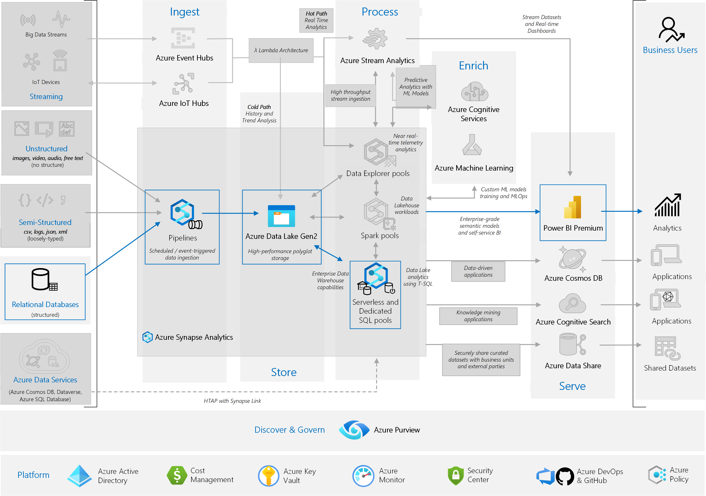

This reference architecture implements the [Analytics end-to-end with Azure Synapse][e2e-analytics] pattern, using a Synapse Pipeline to ingest data from an on-premises Data Warehouse into Synapse SQL Pools, before transforming the data for analysis.

<!-- Requires update
 A reference implementation for this architecture is available on [GitHub][github-folder].
-->

### Enterprise Architecture

<!-- 
-->
*Diagram: [Analytics end-to-end with Azure Synapse][e2e-analytics]. Red path denotes the scope of this article.*
<!--
TODO - may be grey out the background more and only circle the Synapse Provisioned Pools without ADLS? asterisk? 
-->

**Scenario**: An organization has a large on-premises Data Warehouse stored in a SQL Database. The organization wants to use Azure Synapse to perform analysis, using Power BI to serve these insights.

This reference architecture shows on-premises Data Warehouse as a source of ongoing ingestion with cloud based processing and serving of BI Model.
This approach could be an end goal or a first step towards full modernization with cloud based components.  

## Architecture

The architecture consists of the following components.

### Data source

**SQL Server**. The source data is located in a SQL Server database on premises. To simulate the on-premises environment, the deployment scripts for this architecture provision a VM in Azure with SQL Server installed. The [Adventure Works DW][adventureworksdw-sample-link] is used as the source data schema and sample data. 
<!--TODO - import the backup, save inside the repo and change variable format? -->

### Ingestion and data storage

**Azure Data Lake Gen2 (ADLS)**. [ADLS](/azure/databricks/data/data-sources/azure/adls-gen2/) is used as a temparary 'staging' area during PolyBase copy into Azure Synapse Dedicated SQL Pool.

**Azure Synapse**. [Azure Synapse](/azure/sql-data-warehouse/) is a distributed system designed to perform analytics on large data. It supports massive parallel processing (MPP), which makes it suitable for running high-performance analytics. Azure Synapse Dedicated SQL Pool is a target for ongoing ingestion from on-premises. It can be used for further processing if required, as well as serving the data for PowerBI over Direct Query mode.

**Azure Synapse Pipelines**. [Synapse Pipelines](/azure/data-factory/concepts-pipelines-activities) are used as a tool to orchestrate data ingestion and transformation within your Azure Synapse workspace.

### Analysis and reporting

Data modeling approach in this use case is presented by composition of Enterprise model and BI Semantic model. [Enterprise model][enterprise-model] is stored in [Synapse Dedicated SQL Pool][synapse-dedicated-pool] and the [BI Semantic model][bi-model] is stored in [Power BI Premium Capacities][pbi-premium-capacities]. Power BI accesses the data via Direct Query mode.

### Authentication

**Azure Active Directory (Azure AD)** authenticates users who connect to Power BI dashboards and apps and we use SSO to connect to the data souce in Azure Synapse Provisioned Pool. Authorization happens on the source.  

### Architecture Diagram

<!-- TODO: find better place for this -->

### Incremental loading *TODO review

When you run an automated ETL or ELT process, it's most efficient to load only the data that changed since the previous run. This is called an *incremental load*, as opposed to a full load that loads all the data. To perform an incremental load, you need a way to identify which data has changed. The most common approach is to use a *high water mark* value, which means tracking the latest value of some column in the source table, either a datetime column or a unique integer column.

Starting with SQL Server 2016, you can use [temporal tables](/sql/relational-databases/tables/temporal-tables). These are system-versioned tables that keep a full history of data changes. The database engine automatically records the history of every change in a separate history table. You can query the historical data by adding a FOR SYSTEM_TIME clause to a query. Internally, the database engine queries the history table, but this is transparent to the application.

> [!NOTE]
> For earlier versions of SQL Server, you can use [Change Data Capture](/sql/relational-databases/track-changes/about-change-data-capture-sql-server) (CDC). This approach is less convenient than temporal tables, because you have to query a separate change table, and changes are tracked by a log sequence number, rather than a timestamp.
>

Temporal tables are useful for dimension data, which can change over time. Fact tables usually represent an immutable transaction such as a sale, in which case keeping the system version history doesn't make sense. Instead, transactions usually have a column that represents the transaction date, which can be used as the watermark value. For example, in the AdventureWorks Data Warehouse, the `SalesLT.*` tables have a `LastModified` field that defaults to `sysdatetime()`. <!-- Check default-->

Here is the general flow for the ELT pipeline:

1. For each table in the source database, track the cutoff time when the last ELT job ran. Store this information in the data warehouse. (On initial setup, all times are set to `1-1-1900`.) <!-- reword-->

2. During the data export step, the cutoff time is passed as a parameter to a set of stored procedures in the source database. These stored procedures query for any records that were changed or created after the cutoff time. For all tables in our example, we can use the `ModifiedDate` column.

3. When the data migration is complete, update the table that stores the cutoff times.

## Data pipeline

This reference architecture uses the [Adventure Works DW][adventureworksdw-sample-link] sample database as a data source. The [Incremental Data Load pattern](incremental-load) discussed above is implemented to ensure we only load data that was modified or added after the most recent pipeline run. The data pipeline has the following stages:

<!--
1. Export the data from SQL Server to flat files (bcp utility).
2. Copy the flat files to Azure Blob Storage (AzCopy).
3. Load the data into Azure Synapse (PolyBase).
4. Transform the data into a star schema (T-SQL).
5. Load a semantic model into Analysis Services (SQL Server Data Tools). 
-->

<!-- Noah TODO: link to copy data tool-->

1. Most recent watermark entry is retrieved from the control table, located in the SQL DB.
1. For every table in the SQL DB, the pipeline will:

    1. Find the latest value in the table's watermark column
    1. Check if a schema for the table exists, and create a schema if one is not found.
    1. The Copy Data activity in Azure Synapse Pipelines will copy data from the SQL DB into the ADLS staging environment.
    1. Data from the staging environment is then loaded into the Synapse Provisioned SQL Pool via PolyBase
    1. The new watermark value to is saved in the control table by a Stored Procedure, in preparation for the next pipeline run. <!-- TODO - Noah: change if condition to appending variable onto list, update stored proc to simplify-->
1. A stored procedure to update the watermark stored in the SQL DB is executed.

<!-- synapse data mapping flows, added by eng team TODO: how mapping data flows transform the data-->

The next sections describe these stages in more detail.

<!-- keeping original data for authoring reference - delete before PR merge
### Export data from SQL Database

The [bcp](/sql/tools/bcp-utility) (bulk copy program) utility is a fast way to create flat text files from SQL tables. In this step, you select the columns that you want to export, but don't transform the data. Any data transformations should happen in Azure Synapse.
TODO: what to change on source

**Recommendations:**
TODO: how to make efficient -->

### Using Synapse Pipelines

Azure Synapse Pipelines are used to define the ordered set of activities to complete for our incremental load pattern. TODO: Elaborate.

**Recommendations:**

TODO: how to set up recurrence to deliver HWM

TODO:IR size selection. pricing?

Create the storage account in a region near the location of the source data. Deploy the storage account and the Azure Synapse instance in the same region.

Don't run AzCopy on the same machine that runs your production workloads, because the CPU and I/O consumption can interfere with the production workload.

Test the upload first to see what the upload speed is like. You can use the /NC option in AzCopy to specify the number of concurrent copy operations. Start with the default value, then experiment with this setting to tune the performance. In a low-bandwidth environment, too many concurrent operations can overwhelm the network connection and prevent the operations from completing successfully.

AzCopy moves data to storage over the public internet. If this isn't fast enough, consider setting up an [ExpressRoute](/azure/expressroute/) circuit. ExpressRoute is a service that routes your data through a dedicated private connection to Azure. Another option, if your network connection is too slow, is to physically ship the data on disk to an Azure datacenter. For more information, see [Transferring data to and from Azure](../../data-guide/scenarios/data-transfer.md).

During a copy operation, AzCopy creates a temporary journal file, which enables AzCopy to restart the operation if it gets interrupted (for example, due to a network error). Make sure there is enough disk space to store the journal files. You can use the /Z option to specify where the journal files are written.

<!--
### Use Azure Synapse Provisioned Pool

TODO

### Transform the data

Transform the data and move it into production tables. In this step, the data is transformed into a star schema with dimension tables and fact tables, suitable for semantic modeling.

Create the production tables with clustered columnstore indexes, which offer the best overall query performance. Columnstore indexes are optimized for queries that scan many records. Columnstore indexes don't perform as well for singleton lookups (that is, looking up a single row). If you need to perform frequent singleton lookups, you can add a non-clustered index to a table. Singleton lookups can run significantly faster using a non-clustered index. However, singleton lookups are typically less common in data warehouse scenarios than OLTP workloads. For more information, see [Indexing tables in Azure Synapse](/azure/sql-data-warehouse/sql-data-warehouse-tables-index).

> [!NOTE]
> Clustered columnstore tables do not support `varchar(max)`, `nvarchar(max)`, or `varbinary(max)` data types. In that case, consider a heap or clustered index. You might put those columns into a separate table.

Because the sample database is not very large, we created replicated tables with no partitions. For production workloads, using distributed tables is likely to improve query performance. See [Guidance for designing distributed tables in Azure Synapse](/azure/sql-data-warehouse/sql-data-warehouse-tables-distribute). Our example scripts run the queries using a static [resource class](/azure/sql-data-warehouse/resource-classes-for-workload-management).

### Load the semantic model

Load the data into a tabular model in Azure Analysis Services. In this step, you create a semantic data model by using SQL Server Data Tools (SSDT). You can also create a model by importing it from a Power BI Desktop file. Because Azure Synapse does not support foreign keys, you must add the relationships to the semantic model, so that you can join across tables.

-->

### Look up previous watermark

The Lookup activity is used to query the control table for the most recent watermark value. The control table will contain the watermark value corresponding to the most recent value in the watermark column from the last data load. This value is updated in the last step of our data pipeline, to ensure we only load data changed since our most recent pipeline run.

**Recommendations:**

This technique works best if the data type of the watermark column is the same across all tables in your Data Warehouse.

### ForEach Table

The ForEach activity is configured to iterate over every table in the Data Warehouse, allowing us to check if any data has been modified, and if so, copy that data into our SQL Pool. <!-- TODO: links for all activities-->

**Recommendations:**

Something about setting the items params/ array

### Copy Activity - Loading data into Synapse SQL Pool

The Copy activity will copy data from the SQL DB into the Synapse SQL Pool. In this example, because our SQL DB is in Azure, we use the Azure integration runtime to read data from the SQL DB and write the data into the specified staging environment (ADLS).  <!--check staging file type-->

[PolyBase](/sql/relational-databases/polybase/polybase-guide) is used to load the files from the ADLS staging environment into the data warehouse. PolyBase is designed to leverage the MPP (Massively Parallel Processing) architecture of Azure Synapse, which makes it the fastest way to load data into Azure Synapse.

Loading the data is a two-step process:

1. Create a set of external tables for the data. An external table is a table definition that points to data stored outside of the warehouse &mdash; in this case, the flat <!--check staging file type--> files in blob storage. This step does not move any data into the warehouse.
2. Create staging tables, and load the data into the staging tables. This step copies the data into the warehouse.

**Considerations**
TODO: target schema needs to exist

**Recommendations:**

Consider Azure Synapse when you have large amounts of data (more than 1 TB) and are running an analytics workload that will benefit from parallelism. Azure Synapse is not a good fit for OLTP workloads or smaller data sets (less than 250 GB). For data sets less than 250 GB, consider Azure SQL Database or SQL Server. For more information, see [Data warehousing](../../data-guide/relational-data/data-warehousing.md).

Create the staging tables as heap tables, which are not indexed. The queries that create the production tables will result in a full table scan, so there is no reason to index the staging tables.

PolyBase automatically takes advantage of parallelism in the warehouse. The load performance scales as you increase DWUs. For best performance, use a single load operation. There is no performance benefit to breaking the input data into chunks and running multiple concurrent loads.

PolyBase can read Gzip compressed files. However, only a single reader is used per compressed file, because decompressing the file is a single-threaded operation. Therefore, avoid loading a single large compressed file. Instead, split the data into multiple compressed files, in order to take advantage of parallelism.

Be aware of the following limitations:

- PolyBase supports a maximum column size of `varchar(8000)`, `nvarchar(4000)`, or `varbinary(8000)`. If you have data that exceeds these limits, one option is to break the data up into chunks when you export it, and then reassemble the chunks after import.

- PolyBase uses a fixed row terminator of \n or newline. This can cause problems if newline characters appear in the source data.

- Your source data schema might contain data types that are not supported in Azure Synapse.

To work around these limitations, you can create a stored procedure that performs the necessary conversions. Alternatively, [Redgate Data Platform Studio](/azure/sql-data-warehouse/sql-data-warehouse-load-with-redgate) automatically converts data types that aren't supported in Azure Synapse.

For more information, see the following articles:

- [Best practices for loading data into Azure Synapse](/azure/sql-data-warehouse/guidance-for-loading-data).
- [Migrate your schemas to Azure Synapse](/azure/sql-data-warehouse/sql-data-warehouse-migrate-schema)
- [Guidance for defining data types for tables in Azure Synapse](/azure/sql-data-warehouse/sql-data-warehouse-tables-data-types)

### Stored Procedure = TODO* the new watermark value

After copying new records into our SQL pool, we execute the stored procedure defined in the [incremental load pattern](incremental-load). This will update the value of the high watermark in our control table.

### Transform the data

TODO: No transformation happening here, bringing the model one to one
Mapping data flow..

**Recommendataions:**

TODO: partitioning on MPP if needed

// Galina to cover PBI with modelling

### Use Power BI Premium to access, model and visualize the data - Galina

TODO: connect mode, security, data gateways, authorization
Power BI premium components
links to deployment guides

Power BI supports several options for connecting to data sources on Azure, in particular Azure Synapse Provisioned Pool:

- Import. The data is imported into the Power BI model.
- Direct Query. Data is pulled directly from relational storage.
- [Composite model](https://docs.microsoft.com/en-us/power-bi/transform-model/desktop-composite-models). Importing some tables and Direct Query others.

This use case is delivered with Direct Query dashboard, because the amount of data we use and model/dashboard complexity is not high, so we can deliver good user experience. Direct Query delegates the query to the powerful compute engine underneath and utilizes extensive security capabilities on the source. Also, using DirectQuery ensures that results are always consistent with the latest source data. 

Leveraging [Power BI Premium Gen2](https://docs.microsoft.com/en-us/power-bi/admin/service-premium-what-is) gives you ability to handle big models, paginated reports, PBI deployment pipelins and built-in Analysis Services endpoint, as well as to have dedicated [capacity](https://docs.microsoft.com/en-us/power-bi/admin/service-premium-what-is#reserved-capacities) with unique value proposition. 
When the BI Model grows or dashbord complexity increases, you may prefer to switch to composite models and start importing parts of look up tables and some pre-aggregated data. Enabling [Query Caching](https://docs.microsoft.com/en-us/power-bi/connect-data/power-bi-query-caching) within Power BI for imported datasets is an options, as well as leveraging [Dual Tables](https://docs.microsoft.com/en-us/power-bi/transform-model/desktop-storage-mode) for storage mode property. Within Composite model, datasets act as virtual pass through layer. When the user interacts with visualizations, Power BI generates SQL queries to Synapse SQL Pools Dual Storage: in memory or direct query depending on which one is more efficient, the engine decides when to switch from in-memory to direct query and pushes the logic to the Synapse SQL Pool. Depending on the context of the query tables can act as either cached (imported) or not cached Composite Models: pick and choose which table to cache into memory, combine data from one or more DirectQuery sources, and/or combine data from a mix of DirectQuery sources and imported data. 

**Recommendations:**
When using PBI Direct Query over Azure Synapse Analytics Provisioned Pool, consider 
 1. using Azure Synapse [Result Set Caching](https://docs.microsoft.com/en-us/azure/synapse-analytics/sql-data-warehouse/performance-tuning-result-set-caching).
It caches query results in the user database for repetitive use, improves query performance (down to milliseconds), reduces compute resource usage. Queries using cached results set do not use any concurrency slots in Azure Synapse Analytics and thus do not count against existing concurrency limits.
2. using Azure Synapse [Materialized Views](https://docs.microsoft.com/en-us/azure/synapse-analytics/sql/develop-materialized-view-performance-tuning)
The views do pre-compute, store, and maintain data in SQL DW just like a table. Queries that use all or a subset of the data in materialized views can get faster performance and they don't need to make a direct reference to the defined materialized view to use it.

## Scalability considerations

TODO: overview

### Synapse Pipelines

todo

### Azure Synapse Provisioned Pool

With Azure Synapse, you can scale out ([using The Portal, Powershell or T-SQL](/azure/synapse-analytics/sql-data-warehouse/quickstart-scale-compute-portal)) your compute resources on demand. The query engine optimizes queries for parallel processing based on the number of compute nodes, and moves data between nodes as necessary. For more information, see [Manage compute in Azure Synapse](/azure/sql-data-warehouse/sql-data-warehouse-manage-compute-overview).
Scaling can be accomplished using teh Portal, Powershell of T-SQL

### Power BI premium

## Security considerations

### for all components  - private connectivity

### Authorization

Azure Analysis Services uses Azure Active Directory (Azure AD) to authenticate users who connect to an Analysis Services server. You can restrict what data a particular user is able to view, by creating roles and then assigning Azure AD users or groups to those roles. For each role, you can:

- Protect tables or individual columns.
- Protect individual rows based on filter expressions.

For more information, see [Manage database roles and users](/azure/analysis-services/analysis-services-database-users).
*/

## DevOps considerations
#### Quick start: ####

[Azure Synapse 1-click POC](https://github.com/Azure/Test-Drive-Azure-Synapse-with-a-1-click-POC) environment with pre-populated dataset, pipeline, notebook
This 1-click deployment allows the user to deploy a Proof-of-Concept environment of Azure Synapse Analytics with dataset (New York Taxi Trips & Fares data), pipeline to (ingest, merge, aggregate), notebook (Spark ML prediction). 

#### General Recommendataions: ####

- Create separate resource groups for production, development, and test environments. Separate resource groups make it easier to manage deployments, delete test deployments, and assign access rights.

- Use the [Azure Building blocks][azbb] templates provided in this architecture or create [Azure Resource Manager template][arm-template] to deploy the Azure resources following the infrastructure as Code (IaC) Process. With templates,  automating deployments using [Azure DevOps Services][az-devops], or other CI/CD solutions is easier.

- Put each workload in a separate deployment template and store the resources in source control systems. You can deploy the templates together or individually as part of a CI/CD process, making the automation process easier.

  In this architecture, there are three main workloads:
  
  - The data warehouse server, Analysis Services, and related resources.
  - Azure Data Factory.
  - An on-premises to cloud simulated scenario.
  
  Each workload has its own deployment template.
  
  The data warehouse server is set up and configured by using Azure CLI commands which follows the imperative approach of the IaC practice. Consider using deployment scripts and integrate them in the automation process.

- Consider staging your workloads. Deploy to various stages and run validation checks at each stage before moving to the next stage. That way you can push updates to your production environments in a highly controlled way and minimize unanticipated deployment issues. Use [Blue-green deployment][blue-green-dep] and [Canary releases][cannary-releases]  strategies for updating live production environments.

    Have a good rollback strategy for handling failed deployments. For example, you can automatically redeploy an earlier, successful deployment from your deployment history. See the --rollback-on-error flag parameter in Azure CLI.

- [Azure Monitor][azure-monitor] is the recommended option for analyzing the performance of your data warehouse and the entire Azure analytics platform for an integrated monitoring experience. [Azure Synapse Analytics][synapse-analytics] provides a monitoring experience within the Azure portal to show insights to your data warehouse workload. The Azure portal is the recommended tool when monitoring your data warehouse because it provides configurable retention periods, alerts, recommendations, and customizable charts and dashboards for metrics and logs.

For more information, see the DevOps section in [Microsoft Azure Well-Architected Framework][AAF-devops].

## Cost Considerations - Galina

### Azure Synapse

- Choose **Compute Optimized Gen1** for frequent scaling operations. This option is priced as pay-as-you-go, based on Data warehouse units consumption (DWU).

- Choose **Compute Optimized Gen2** for intensive workloads with higher query performance and compute scalability needs. You can choose the pay-as-you-go model or use reserved plans of one year (37% savings) or 3 years (65% savings).

Data storage is charged separately. Other services such as disaster recovery and threat detection are also charged separately.

For more information, see [Azure Synapse Pricing][az-synapse-pricing].

### Azure Analysis Services

Pricing for Azure Analysis Services depends on the tier. The reference implementation of this architecture uses the **Developer** tier, which is recommended for evaluation, development, and test scenarios. Other tiers include, the **Basic** tier, which is recommended for small production environment; the **Standard** tier for mission-critical production applications. For more information, see [The right tier when you need it](/azure/analysis-services/analysis-services-overview#the-right-tier-when-you-need-it).

No charges apply when you pause your instance.

For more information, see [Azure Analysis Services pricing][az-as-pricing].

### Blob Storage

Consider using the Azure Storage reserved capacity feature to lower cost on storage. With this model, you get a discount if you can commit to reservation for fixed storage capacity for one or three years. For more information, see [Optimize costs for Blob storage with reserved capacity][az-storage-reserved].

### Power BI Embedded

Power BI Embedded is a Platform-as-a-Service (PaaS) solution that offers a set of APIs to enable the integration of Power BI content into custom apps and websites. Users who publish BI content need to be licensed with [Power BI Pro][powerbi-pro-purchase]. For information about pricing, see [Power BI Embedded pricing][powerbi-embedded-pricing].

For more information, see the Cost section in [Microsoft Azure Well-Architected Framework][aaf-cost].
*/

## Deploy the solution

/*
To the deploy and run the reference implementation, follow the steps in the [GitHub readme][github-folder]. It deploys the following resources:

- A Windows VM to simulate an on-premises database server. It includes SQL Server 2017 and related tools, along with Power BI Desktop.
- An Azure storage account that provides Blob storage to hold data exported from the SQL Server database.
- An Azure Synapse instance.
- An Azure Analysis Services instance.

*/

## Next steps

TODO: write about scaling up consideration here?

## Related resources

You may want to review the following [Azure example scenarios](/azure/architecture/example-scenario) that demonstrate specific solutions using some of the same technologies:

- [Data warehousing and analytics for sales and marketing](../../example-scenario/data/data-warehouse.yml)
- [Hybrid ETL with existing on-premises SSIS and Azure Data Factory](../../example-scenario/data/hybrid-etl-with-adf.yml)

<!-- links -->

[AAF-devops]: ../../framework/devops/overview.md
[arm-template]: /azure/azure-resource-manager/resource-group-overview#resource-groups
[az-devops]: /azure/virtual-machines/windows/infrastructure-automation#azure-devops-services
[azbb]: https://github.com/mspnp/template-building-blocks/wiki
[azure-monitor]: https://azure.microsoft.com/services/monitor
[blue-green-dep]: https://martinfowler.com/bliki/BlueGreenDeployment.html
[cannary-releases]: https://martinfowler.com/bliki/CanaryRelease.html
[e2e-analytics]: ../../example-scenario/dataplate2e/data-platform-end-to-end-content.md
[github-folder]: https://github.com/mspnp/azure-sqldw-enterprise-bi
[synapse-analytics]: /azure/sql-data-warehouse/sql-data-warehouse-concept-resource-utilization-query-activity
[wwi]: /sql/sample/world-wide-importers/wide-world-importers-oltp-database
[powerbi-embedded-pricing]: https://azure.microsoft.com/pricing/details/power-bi-embedded
[powerbi-pro-purchase]: /power-bi/service-admin-purchasing-power-bi-pro
[adventureworksdw-sample-link]: /sql/samples/adventureworks-install-configure?view=sql-server-ver15&tabs=ssms
[az-synapse-pricing]: https://azure.microsoft.com/pricing/details/synapse-analytics
[az-as-pricing]: https://azure.microsoft.com/pricing/details/analysis-services
[az-storage-reserved]: /azure/storage/blobs/storage-blob-reserved-capacity
[aaf-cost]: ../../framework/cost/overview.md
[enterprise-model]: powerbi-docs/guidance/center-of-excellence-business-intelligence-solution-architecture.md#enterprise-models
[bi-model]:powerbi-docs/guidance/center-of-excellence-business-intelligence-solution-architecture.md#bi-semantic-models
[incremental-load]: azure/data-factory/tutorial-incremental-copy-overview
[pbi-premium-capacities]: powerbi-docs/admin/service-premium-what-is.md#reserved-capacities
[synapse-dedicated-pool]:azure/articles/synapse-analytics/sql-data-warehouse/sql-data-warehouse-overview-what-is.md#synapse-sql-pool-in-azure-synapse
[pbi-what-is-premium] https://docs.microsoft.com/en-us/power-bi/admin/service-premium-what-is#analysis-services-in-power-bi-premium
