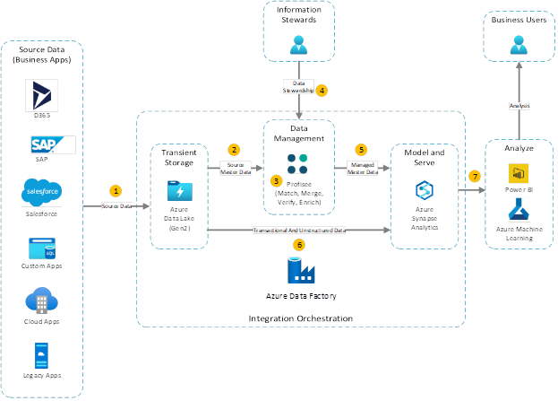
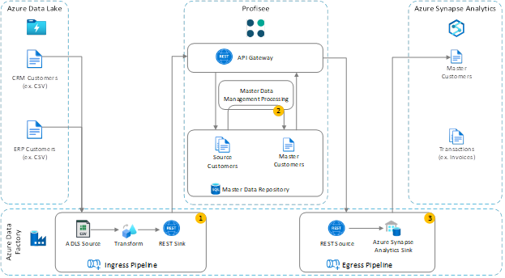
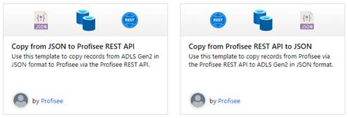
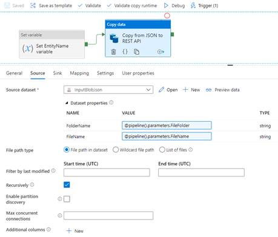
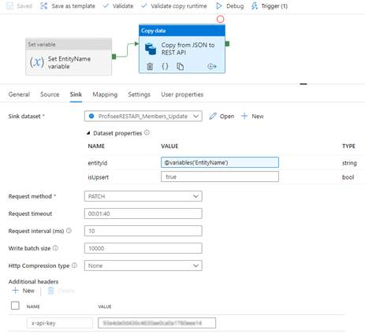

# Master Data Management in Azure with Profisee

## Role of Master Data Management

Azure is used as the core of many digital transformation programs, but it is dependent on the quality and consistency of data from multiple sources – business applications, databases, data feeds, etc. – and delivers value through business intelligence, analytics, machine learning and more. Profisee’s MDM solution completes the Azure Data Estate with a fast, affordable, and scalable method to ‘align and combine’ data from multiple sources by enforcing consistent data standards on source data (match, merge, standardize, verify, correct). Native integration with Azure Data Factory and other Azure Data Services further streamlines this process to accelerate the delivery Azure business benefits.

A core aspect of how MDM solutions function is that they combine data from multiple sources to create a ‘Golden Record Master’ containing the best-known and trusted data for each record. This is built out domain-by-domain according to requirements, but nearly always requires multiple domains. Common domains are customer, product, and location but domains can represent anything from reference data to contracts and drug names. In general, the better domain coverage that can be built out relative to the broad Azure data requirements the better.  

## Reference Architecture

This architectural pattern demonstrates how Master Data Management can be incorporated into the Azure Data Services ecosystem to improve the quality of data used for analytics and operational decision making. Master Data Management solves several common challenges including the identification and management of duplicate data (match and merge), flagging, and resolving data quality issues, standardizing, and enriching data, and the ability for data stewards to proactively manage and improve the data. This pattern presents a modern approach to MDM, with all technologies deployable natively in Azure, including Profisee which can be deployed via containers and orchestrated with Azure Kubernetes Service.

 

## Data flow

 

1. **Source Data Load** – Source data from business applications is copied to Azure Data Lake, where it is initially stored for further transformation and use in downstream analytics. Source data can generally be classified into one of three categories:
   1. Structured master data – The information that describes customers, products, locations, etc. Master data is low volume, high complexity, and changes slowly over time, is often the data that organizations struggle the most with data quality.
   2. Structured transactional data – Business events that occur at a specific point in time, such as an order, invoice, or interaction. Transactions include the metrics for that transaction (ex. sales price) and references master data (ex. the product and customer involved in a purchase). Transactional data is typically high volume, low complexity, and static (does not change over time).
   3. Unstructured data – Can include documents, images, videos, social media content, audio, etc. Modern analytics platforms can increasingly leverage unstructured data to glean new insights previously unavailable. Unstructured data is often associated to master data, such as the customer associated to a social media account, or the product associated to an image.

2. **Source Master Data Load** – Master data from source business applications is loaded into the Master Data Management (MDM) application. Source data should be loaded “as is”, with complete lineage information and minimal transformations. 

3. **Automated MDM Processing** – The Master Data Management (MDM) solution uses automated processes to standardize, verify, and enrich data (ex. Verify and standardize address data), identify data quality issues, group duplicate records (ex. Duplicate customers), and generate master records (a.k.a. golden records). 

4. **Data Stewardship** – As necessary, data stewards can review and manage groups of matched records, create/manage data relationships, fill in missing information, and resolve data quality issues. Multiple alternate hierarchical roll-ups can be managed as required (ex. Product hierarchies).

5. **Managed Master Data Load** – High quality master data flows into downstream analytics solutions. This is again simplified since data integrations no longer require any data quality transformations.

6. **Transactional and Unstructured Data Load** – Transactional and unstructured data is loaded into the downstream analytics solution, where it is combined with high quality master data.

7. **Visualization and Analysis** – Data is modelled and made available to business users for analysis. High quality master data eliminates common data quality issues, and improved insights are gained. 

### Components

1. Azure [Data Factory](https://azure.microsoft.com/en-us/services/data-factory/) is a hybrid data integration service that allows you to create, schedule and orchestrate your ETL/ELT workflows.

2. [Azure Data Lake](https://azure.microsoft.com/en-us/solutions/data-lake/) provides limitless storage for analytics data.

3. [Profisee](https://profisee.com/platform/) is the Fast, Affordable, and Scalable Master Data Management platform that integrates seamlessly with the Microsoft ecosystem.

4. Azure [Synapse Analytics](https://azure.microsoft.com/en-us/services/synapse-analytics/) is the fast, flexible and trusted cloud data warehouse that lets you scale, compute and store elastically and independently, with a massively parallel processing architecture.

5. [Power BI](https://powerbi.microsoft.com/en-us/) is a suite of business analytics tools that deliver insights throughout your organization. Connect to hundreds of data sources, simplify data prep, and drive ad hoc analysis. Produce beautiful reports, then publish them for your organization to consume on the web and across mobile devices.

## Master Data Management Integration Pipeline

 

Above shows the details for integrating with the Profisee Master Data Management solution. Key to note is that Azure Data Factory and Profisee include native REST integration support, providing a lightweight and modern integration.

1. **Load Source Data to MDM** –Azure Data Factory is used to extract data from the data lake, transform it to match the master data model, and stream it into the MDM repository via a REST sink.

2. **Master Data Management Processing** – The MDM platform processes source master data through a sequence of activities to verify, standardize and enrich the data, as well as execute data quality processes. Finally, matching and survivorship is performed to identify and group duplicate records and create master records. Optionally, data stewards can be issues tasks to perform data stewardship. The result is a set of master data for use in downstream analytics.

3. **Load Master Data for Analytics** – Azure Data Factory uses its REST source to stream master data from Profisee to Azure Synapse Analytics. 

 

### Azure Data Factory Templates for Profisee

In collaboration with Microsoft, Profisee has developed a set of Azure Data Factory templates that make it faster and easier to integrate Profisee into the Azure Data Services ecosystem. These templates use Azure Data Factories REST data source and data sink to read and write data from Profisee’s REST Gateway API. Templates are provided for both reading from and writing to Profisee. 

Figure 1 - Azure Data Factory templates for Profisee

### Example ADF Template – JSON to Profisee over REST

The following screenshots illustrate an Azure Data Factory template that copies data from a JSON file in an Azure Data Lake to Profisee via REST. 

Figure 2 - Source JSON Data

Figure 3 - Sink to Profisee via REST

 

Click here for additional documentation for the [Azure Data Factory templates for Profisee](https://github.com/profisee/azuredatafactory).

## Master Data Management Processing

In an analytical MDM use case, data is often processed through the MDM solution on an automated basis as part of the broader integration process to load data for analytics. Below illustrates a typical process for customer data in this context.

#### 1. Source Data Load

Source data is loaded into the MDM solution from source systems, including lineage information. In this case, we have 2 source records from CRM and one from the ERP application, which upon visual inspection appear to represent the same person.

| **Source Name** | **Source**    **Address** | **Source  State** | **Source**    **Phone** | **Source**    **ID** | **Standard  Address** | **Standard  State** | **Standard  Name** | **Standard  Phone** | **Similarity** |
| --------------- | ------------------------- | ----------------- | ----------------------- | -------------------- | --------------------- | ------------------- | ------------------ | ------------------- | -------------- |
| Alana  Bosh     | 123  Main Street          | GA                | 7708434125              | CRM-100              |                       |                     |                    |                     |                |
| Bosch,  Alana   | 123  Main St              | Georgia           | 404-854-7736            | CRM-121              |                       |                     |                    |                     |                |
| Alana  Bosch    |                           | (404)  854-7736   | ERP-988                 |                      |                       |                     |                    |                     |                |

 

#### 2. Data Verification and Standardization

Verification and standardization rules and services are used to standardize and verify address, name, and phone number information.

| **Source Name** | **Source**    **Address** | **Source  State** | **Source**    **Phone** | **Source**    **ID** | **Standard  Address** | **Standard  State** | **Standard  Name** | **Standard  Phone** | **Similarity** |
| --------------- | ------------------------- | ----------------- | ----------------------- | -------------------- | --------------------- | ------------------- | ------------------ | ------------------- | -------------- |
| Alana  Bosh     | 123  Main Street          | GA                | 7708434125              | CRM-100              | 123 Main St           | GA                  | Alana Bosh         | 770 843 4125        |                |
| Bosch,  Alana   | 123  Main St              | Georgia           | 404-854-7736            | CRM-121              | 123 Main St           | GA                  | Alana Bosch        | 404 854 7736        |                |
| Alana  Bosch    |                           | (404)  854-7736   | ERP-988                 |                      |                       | Alana Bosch         | 404 854 7736       |                     |                |

 

#### 3. Matching

With data standardized, matching is performed, identifying the similarity between records in the group. In this scenario, two records match each other exactly on Name and Phone, and the other fuzzy matches on Name and Address.

| **Source Name** | **Source**    **Address** | **Source  State** | **Source**    **Phone** | **Source**    **ID** | **Standard  Address** | **Standard  State** | **Standard  Name** | **Standard  Phone** | **Similarity** |
| --------------- | ------------------------- | ----------------- | ----------------------- | -------------------- | --------------------- | ------------------- | ------------------ | ------------------- | -------------- |
| Alana  Bosh     | 123  Main Street          | GA                | 7708434125              | CRM-100              | 123 Main St           | GA                  | Alana Bosh         | 770 843 4125        | .9             |
| Bosch,  Alana   | 123  Main St              | Georgia           | 404-854-7736            | CRM-121              | 123 Main St           | GA                  | Alana Bosch        | 404 854 7736        | 1.0            |
| Alana  Bosch    |                           | (404)  854-7736   | ERP-988                 |                      |                       | Alana Bosch         | 404 854 7736       | 1.0                 |                |

 

#### 4. Survivorship

With a group formed, survivorship creates and populates a master record (also called a “golden record”) to represent the group. 

| **Source Name**     | **Source**    **Address** | **Source  State** | **Source**    **Phone** | **Source**    **ID** | **Standard  Address** | **Standard  State** | **Standard  Name** | **Standard  Phone** | **Similarity** |
| ------------------- | ------------------------- | ----------------- | ----------------------- | -------------------- | --------------------- | ------------------- | ------------------ | ------------------- | -------------- |
| Alana  Bosh         | 123  Main Street          | GA                | 7708434125              | CRM-100              | 123 Main St           | GA                  | Alana Bosh         | 770 843 4125        | .9             |
| Bosch,  Alana       | 123  Main St              | Georgia           | 404-854-7736            | CRM-121              | 123 Main St           | GA                  | Alana Bosch        | 404 854 7736        | 1.0            |
| Alana  Bosch        |                           | (404)  854-7736   | ERP-988                 |                      |                       | Alana Bosch         | 404 854 7736       | 1.0                 |                |
| **Master  Record:** | **123 Main St**           | **GA**            | **Alana Bosch**         | **404 854 7736**     |                       |                     |                    |                     |                |

 

This master record, along with improved source data and lineage information can be loaded into the downstream analytics solution, where it can be tied back to transactional data.

This is a basic example of automated MDM processing. Data quality rules can also be used to automatically calculate/update values, and flag missing or invalid values for data stewards to resolve. Data stewards can also manage the data, including managing hierarchical rollups of data. 

 

### The Impact of Master Data Management on Integration Complexity

As illustrated above, Master Data Management addresses several common challenges encountered when integrating data into an analytics solution. This includes correcting data quality issues, standardizing/enriching data, and rationalizing duplicate data. Incorporating MDM into your analytics architecture fundamentally changes the data flow by eliminating hardcoded logic the integration process, and offloading it to the MDM solution, significantly simplifying integrations. The table below outlines some common differences in the integration process with and without MDM.

| **Capability**                       | **Without  MDM**                                             | **With MDM**                                                 |
| ------------------------------------ | ------------------------------------------------------------ | ------------------------------------------------------------ |
| Data Quality                         | Data quality  rules and transformations are hardcoded into integration processes to fix and  correct data as it is moved. This requires technical resources for both the  initial implementation and ongoing maintenance of these rules, making data  integration processes complicated and expensive to develop and maintain. | Data quality  logic and rules are configured and enforced by the MDM solution. Integration  processes perform no data quality transformations, instead moving the data  “as-is” into the MDM solution. Data integration processes are simple and  affordable to develop and maintain. |
| Data  Standardization and Enrichment | Logic to  standardize and align reference and master data are hardcoded into  integration processes. Integrations must be developed with third-party  services to perform standardization of address, name, email, and phone data. | Using built  in rules and out of the box integrations with third party data services, data  can be standardized within the MDM solution, simplifying integration  processes. |
| Duplicate  Data Management           | Duplicate  records that exist within and across applications are identified and grouped  based on existing unique identifiers. This requires identifiers to be shared  across systems (ex. SSN, email, etc.), and these can only be matched and  grouped when identical. More sophisticated approaches require significant  investments in integration engineering. | Built-in  machine learning matching capabilities identify duplicate records within and  across systems, generating a golden record to represent the group. This  enables records to be “fuzzy matched”, grouping records that are similar,  with explainable results. Groups can be managed in scenarios where the ML  engine is unable to form a group with high confidence. |
| Data  Stewardship                    | Data  stewardship activities are confined to updating data in the source  applications (ERP, CRM, etc.). Typically, issues are discovered when  performing analytics such as missing, incomplete, or incorrect data. The  issues are corrected in the source application, and then are updated in the  analytics solution during the next update. Any new information to manage must  be added to source applications, which can take time and be costly. | MDM solutions  have built-in data stewardship capabilities, enabling users to access and  manage data. Ideally, the system is configured to flag issues and prompt data  stewards to correct them. New information or hierarchies can be quickly  configured in the solution so that they can be managed by data stewards. |

## Master Data Management Use Cases

While there are numerous use cases for Master Data Management, there are a small number of use cases that cover most real-world MDM implementations. Note that although these use cases are focused on a single domain, they are unlikely to be built from only that domain. In other words, even these focused use cases are most likely to include multiple master data domains.

### Customer 360

Consolidating customer data for analytics is the most common MDM use case. Organizations capture customer data across an increasing number of applications, creating duplicate customer data within and across applications with inconsistencies and discrepancies. This poor-quality data makes it difficult to realize the value of modern analytics solutions due to poor quality customer data. Symptoms include the following challenges:

* Hard to answer basic business questions like “Who are our top customers” and “How many new customers did we have”, requiring significant manual effort.

* Missing and inaccurate customer information, making it difficult to roll up drill down into data.

* Inability to analyzing customer data across systems or business units due to an inability to uniquely identify a customer across organizational and system boundaries.

* Poor quality insights from AI and ML due to poor quality input data

### Product 360

Product data is often spread across multiple enterprise applications, such as ERP, PLM, E-Commerce, etc. The result is a challenge understanding the total catalog of products that have inconsistent definitions for properties such as the product’s name, description, and characteristics. This is complicated by different definitions of reference data. Symptoms include the following challenges:

* Inability to support different alternative hierarchical roll-up and drill down paths for product analytics

* Whether finished goods or material inventory, difficulty understanding exactly what products you have on hand, the vendors it is purchased from, and duplicate products leading to excess inventory

* Hard to rationalize products due to conflicting definitions, leading to missing or inaccurate information in analytics

### Reference Data 360

In the context of analytics, reference data exists as numerous lists of data that is often used to further describe other sets of master data. For example, lists of countries, currencies, colors, sizes, units of measure, etc. Inconsistent reference data leads to obvious errors in downstream analytics. Symptoms include:

* Multiple representations of the same thing. For example, the state Georgia as “GA” and “Georgia”, making it difficult to aggregate and drill down into data consistently. 

* Difficulty aggregating data from across applications due to an inability to crosswalk the reference data values between systems. For example, the color red is represented by “R” in the ERP system, and “Red” in PLM system.

* Difficult to tie numbers across organizations due to differences in agreed upon reference data values for categorizing data.

### Finance 360

Financial organizations rely heavily on data for critical activities such as monthly, quarterly, and annual reporting. Organizations with multiple finance and accounting systems often have financial data across multiple general ledgers, which need to be consolidated to produce financial reports. Master Data Management can provide a centralized place to map and manage Accounts, Cost Centers, Business Entities, and other financial data sets to a consolidated view. Symptoms include the following challenges:

* Difficulty aggregating financial data across multiple systems into a consolidated view

* Lack of process for adding and mapping new data elements in the financial systems

* Delays in producing end of period financial reports

 

More information:

* [Link to ADF Templates for Profisee on GitHub](https://github.com/profisee/azuredatafactory)

* [Link to PaaS deployment of Profisee to Azure on GitHub](https://github.com/Profisee/kubernetes/tree/master/Azure-ARM)

* [For more information on Profisee on Azure](https://profisee.com/profisee-microsoft/)