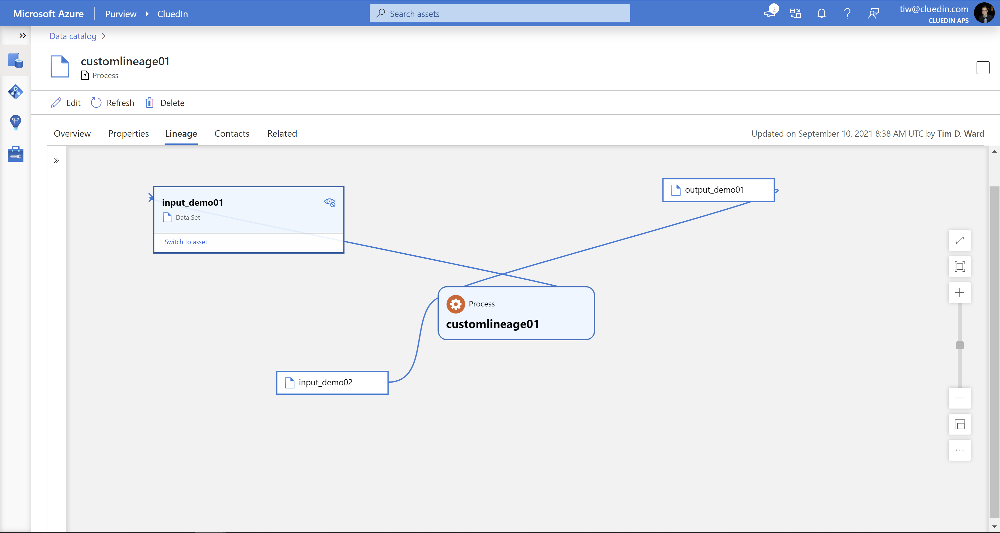
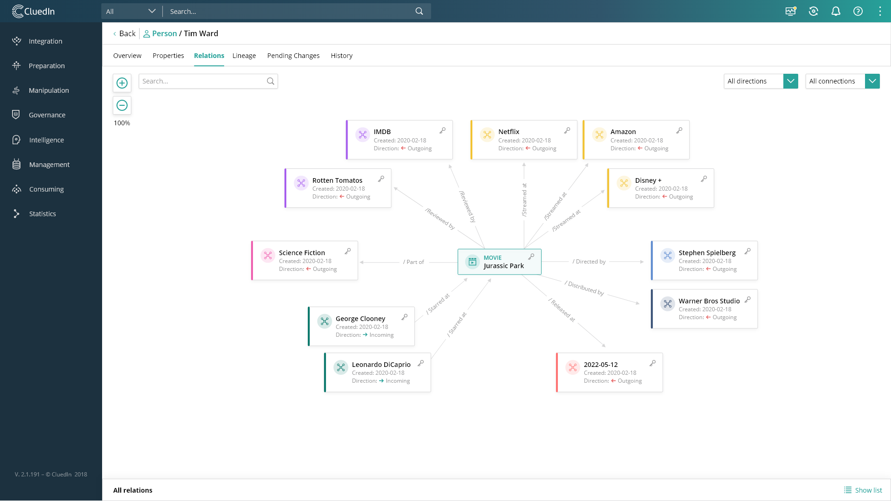

The architecture encapsulates many pillars of master data management (MDM) into a coherent, consistent, end-to-end MDM solution. CluedIn has introduced a *zero-modeling* MDM approach that has been proven to accelerate MDM projects and increase success rates of the MDM initiatives.

## Architecture

The following diagram demonstrates the CluedIn architectural structure and data flow.

*Download a [Visio file](https://arch-center.azureedge.net/migrate-mds-to-azure-with-cluedin.vsdx) of this architecture.*

### Workflow

CluedIn uses the Azure virtual private network (VPN) to allow you to connect to migrate on-premises MDS instances, or to connect directly to a cloud hosted SQL VM with a hosted MDS instance. All CluedIn needs is to point to the Windows Communication Foundation (WCF) service of MDS, and it will automate the process of moving the data, rules, workflows, and everything else into CluedIn or the respective Microsoft service.

With native integration to Azure Cost Management + Billing, you can easily forecast your CluedIn MDM workloads, as you move from MDS to CluedIn. CluedIn utilizes the Azure Autoscale feature, to be able to scale the environment up and down. CluedIn also integrates natively into budgets in Azure, so that you can easily control your spending in the cloud. This integration eliminates the need for time-consuming forecasting and budgeting, because the costs will become obvious within the Azure platform.

SSIS packages can be migrated to Azure Data Factory, to move all your ETL pipelines into a cloud-native solution.

### Components

CluedIn provides native integration to 27 Azure services, including the following components:

- [Azure Data Lake Gen2](/azure/storage/blobs/data-lake-storage-introduction)
- [Azure Purview](https://azure.microsoft.com/services/purview)
- [Azure Active Directory](https://azure.microsoft.com/services/active-directory)
- [Azure Key Vault](https://azure.microsoft.com/services/key-vault)
- [Azure Event Hubs](https://azure.microsoft.com/services/event-hubs)
- [Azure Service Bus](https://azure.microsoft.com/services/service-bus)
- [Azure Monitor](https://azure.microsoft.com/services/monitor)
- [Azure SQL Managed Instances](https://azure.microsoft.com/products/azure-sql/managed-instance)
- [Azure Databricks](https://azure.microsoft.com/services/databricks)
- [Azure Synapse Analytics](https://azure.microsoft.com/services/synapse-analytics)
- [Microsoft Dataverse](https://powerplatform.microsoft.com/dataverse)
- [Azure Functions](https://azure.microsoft.com/services/functions)
- [Power Automate](https://flow.microsoft.com)
- [Power Apps](https://powerapps.microsoft.com)
- [Power BI](https://powerbi.microsoft.com)
- [Azure Bot Service](https://azure.microsoft.com/services/bot-services)
- [Azure DevOps](https://azure.microsoft.com/services/devops)
- [Azure Container Registry](https://azure.microsoft.com/services/container-registry)
- [Azure Data Factory](https://azure.microsoft.com/services/data-factory)
- [Azure Cache for Redis](https://azure.microsoft.com/services/cache)
- [Azure Autoscale](https://azure.microsoft.com/features/autoscale/)

### Alternatives

You can also extend the platform to alternative scenarios to the core features of CluedIn.

In this version of CluedIn, extending the platform is all done with native Azure Services. All events are exposed on the Event Hub, for your developers to interact with them in any way that they want. Azure Data Factory can be used to push data to CluedIn, which offers support to bring in data across all of the different Azure Services into CluedIn. Azure Functions can be used to subscribe to the Event Hubs, in which you can create your customizations in any of the supported languages in Azure Functions.

## Scenario details

Master Data has been given the task to solve data quality, data governance, and mastering of the most important business data within a company. If you are currently using an on-premises or cloud-hosted SQL master data services (MDS) instance or instances, then the following scenario simplifies the experience of moving to a native Azure master data management solution by CluedIn.

CluedIn provides a side-by-side feature parity to SQL MDS that provides user-familiarity for data stewards and MDM teams to easily migrate their daily workloads from MDS to CluedIn. In addition, CluedIn provides many more valuable data master functionalities, including a foundation of ready-for-insight data into your business.

### CluedIn features

Master data services traditionally contain the following main functionality:

- Support for model versioning
- Business rules
- Data quality services
- Workflow
- Hierarchies
- Excel plugin

CluedIn provides functionality for all of the above. In addition, the following use-cases are also enabled:

- Hierarchies can now be visualized natively in Power BI.
- Workflows are migrated and can be built and extended directly in Power Automate.
- Business rules and data quality services are natively migrated into the CluedIn Rules engine.
- CluedIn provides built-in data enrichment for your MDS records, to automatically fix and validate addresses, company information, and more.
- Manage consent and run data subject access requests.
- Write back to the MDS instance, if necessary.

CluedIn also supports migrating data change history, and it can automatically build up data quality history from your MDS instances. You can also run an MDS solution and CluedIn in-sync, if you don't want to turn off your MDS instances as soon as the migration process has finished.

CluedIn natively supports the Common Data Model / Dataverse. In other words,  Power Apps, Power Automate, Power BI, virtual chatbots, and Microsoft Dynamics users can all natively utilize data from CluedIn, without the need for any extra setup or integration.

#### CluedIn natively integrates with Azure Purview

Azure Purview brings data governance capabilities to the Microsoft Azure cloud, and CluedIn provides native integration to its functionality.

- The Azure Purview Glossary is available directly in CluedIn and vice-versa.
- CluedIn can ingest assets that have been registered in Purview.
- CluedIn scans the personal information from Azure Purview, and it can pinpoint to a record level where the personal data is. It also adds supports for personal information in unstructured and semi-structured data, not just structured.
- CluedIn will use the schema set in Purview to automatically map data sets into CluedIn.
- CluedIn extends the Purview Lineage with detailed processing logs.
- CluedIn can initiate Purview Scans before a new data ingestion is scheduled.

The following image demonstrates the Lineage feature set.

#### Azure Data Factory support

Azure Data Factory (ADF) brings support for connecting to over 100+ services. This data can be directly delivered into CluedIn using live streams of push data from ADF. CluedIn not only allows you to connect to your Master Data Service (MDS) instances, but it also connects to hundreds of data sources from across SAAS, databases, data lakes, and more.

The following are key ADF support features:

- You can set it up to listen to events from Event Hub, and then you can feed the data right back into CluedIn.
- Native support is available directly within CluedIn to set up ADF-specific endpoints.
- You can easily utilize existing ADF pipelines with a new target sink.

## Considerations

These considerations implement the pillars of the Azure Well-Architected Framework, which is a set of guiding tenets that can be used to improve the quality of a workload. For more information, see [Microsoft Azure Well-Architected Framework](/azure/architecture/framework).

### Modeling

CluedIn uses an automatic modeling process, so there is no need to migrate or re-create data models from master data services (MDS) or other data sources, such as Microsoft Dynamics. This feature utilizes a graph database to automatically build a model based off the data that is sent to the system. If you move from a traditional relational based model to a graph, then you bring tremendous value and flexibility in your master data initiatives. The graph approach is not that different to a relational style of modeling.

The most important aspect of this modeling is that a relational style will give you and your team a flexible way to represent your master data models, in all different shapes and sizes. This style leads to immense flexibility, when your business requires that your master data model stretches to fit into different use cases and business requirements. CluedIn utilizes an up-front schema-less approach to data ingestion. Your data does not need to fit into a tight and rigid schema on entry into the platform. However, a tight and rigid schema can be applied on the data's way out of CluedIn, when it is used in the different use cases that are applying the data from the CluedIn platform.

The following image shows the Relations feature set.

### Availability

This solution is hosted as a managed-application offering and can be applied in your own tenant, where the vendor will manage upgrades, maintenance, backups, and more on your behalf.

CluedIn natively integrates into [Azure Service Health](https://azure.microsoft.com/features/service-health) and Azure scheduled maintenance, so that upgrades and patches feel like native Azure announcements. In combination with the high robustness on the Azure environment, CluedIn can cater for the highest of service-level agreement (SLA) requirements.

### Performance efficiency

Performance efficiency is the ability of your workload to scale to meet the demands placed on it by users in an efficient manner. For more information, see [Performance efficiency pillar overview](/azure/architecture/framework/scalability/overview).

CluedIn separates storage from compute, so the processing of data is completely *stateless*. Because it is backed by a streaming service bus, this means that CluedIn can scale up and down, as much or as little as you need, dependent upon your workloads. CluedIn supports the Azure autoscale features inside of [Azure Kubernetes Service](https://azure.microsoft.com/overview/kubernetes-on-azure) (AKS), so that scaling can be automated. To increase performance in the processing of data, you will simply allocate more processing pods to your Kubernetes cluster, which can all be automated.

### Scalability

CluedIn supports the integration of as many MDS instances as you need. For example, you can ingest and manage 50 MDS instances in CluedIn. You can either run them multitenant or all blended in the same account. Once your MDS solution has been migrated to CluedIn, there are many ways to onboard new systems and master data, with different choices in how to load the data.

CluedIn runs in Docker containers and uses Kubernetes to host and orchestrate the different pieces of the application. This architecture means that CluedIn works well in elastic environments and can automatically scale to needed sizes and infrastructure.

With native support for autoscaling, CluedIn uses the power of Azure to provide a scalable environment for the biggest data workloads. It is not un-common for CluedIn accounts to have tens of millions or hundreds of millions of records in the platform.

### Security

Security provides assurances against deliberate attacks and the abuse of your valuable data and systems. For more information, see [Overview of the security pillar](/azure/architecture/framework/security/overview).

CluedIn security grants permissions and controls access to different services through Azure RBAC, with Azure Key Vault security key control and Azure Monitor access tracking and logging. In addition to authenticated user accounts, CluedIn also supports single sign-on (SSO) and identity frameworks. Requests to the CluedIn application use encrypted access tokens that have no correlation with user identity. With Native Azure Active Directory support, simply plugin your SAML 2.0 information into CluedIn and it can immediately be used to manage user and role access to your new MDM solution.

### Resiliency

CluedIn runs in a high-availability mode at the data store and application level. Due to the separation of storage and processing, CluedIn has built-in resistance and fault tolerance. Different parts of the CluedIn application can be scaled up and down independently, to cater for a diverse array of workloads.

### Operational excellence

CluedIn uses Azure Pipelines' continuous integration and continuous delivery (CI/CD) pipelines to handle deployments and rolling updates to the AKS environment. Customers can also utilize this infrastructure to deploy their own customizations to CluedIn itself.

### Cost optimization

Cost optimization is about looking at ways to reduce unnecessary expenses and improve operational efficiencies. For more information, see [Overview of the cost optimization pillar](/azure/architecture/framework/cost/overview).

CluedIn costs start low and, based off your usage, will scale up pricing to match the usage. Budgets can be set directly within the Azure portal so you can keep control of your operational costs.

#### Azure sizing and starting a trial

You can start a trial of CluedIn on their website, which can also help you scope your Azure hosting costs with prebuilt Azure estimates for different-sized environments.

## Deploy this scenario

To deploy CluedIn for development and evaluation purposes using Docker, see [CluedIn with Docker](https://documentation.cluedin.net/versions/3.2.3/docs/00-gettingStarted/30-docker-local.html).

To install CluedIn in production, CluedIn instances can be directly installed from the Azure Marketplace in your own Azure tenant.

## Contributors

*This article is maintained by Microsoft. It was originally written by the following contributors.* 

Principal author:

- [Oliver Kaae Vinter](https://www.linkedin.com/in/oliverkaaevinter) | Senior Partner Development Manager

*To see non-public LinkedIn profiles, sign in to LinkedIn.*

## Next steps

- For more information about CluedIn, see the [CluedIn website](https://www.cluedin.com).
- For instructions on deploying and using CluedIn, see the [CluedIn documentation](https://documentation.cluedin.net/versions/3.2.3).
- [CluedIn with Docker](https://documentation.cluedin.net/versions/3.2.3/docs/00-gettingStarted/30-docker-local.html)

## Related resources

- [Master data management with Azure and CluedIn](/azure/architecture/reference-architectures/data/cluedin)
- For an overview of Azure data architecture, see the [Azure Data Architecture Guide](/azure/architecture/data-guide).
- [Analytics end-to-end with Azure Synapse](/azure/architecture/example-scenario/dataplate2e/data-platform-end-to-end)
