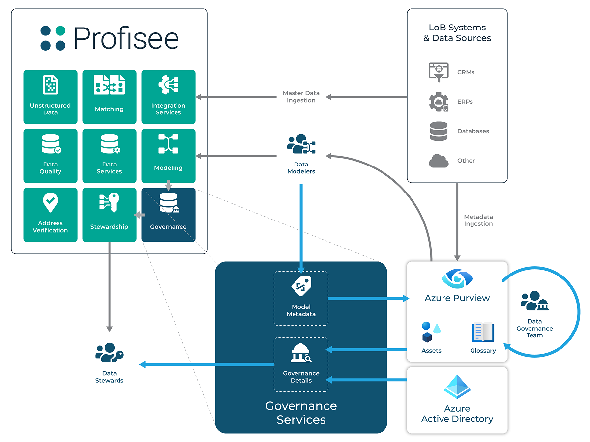
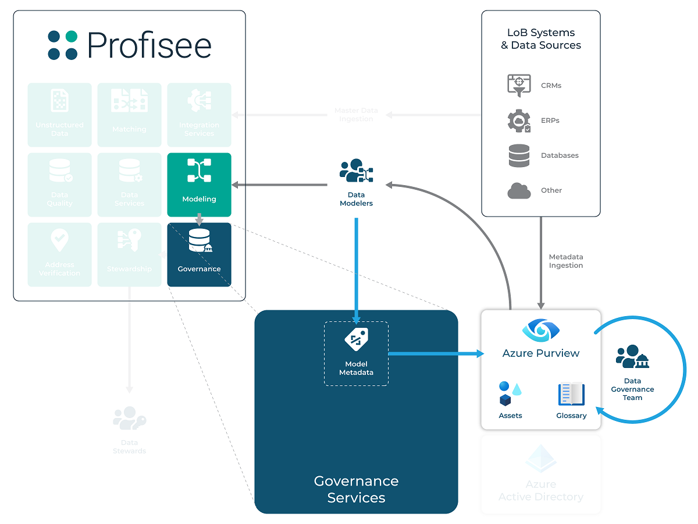
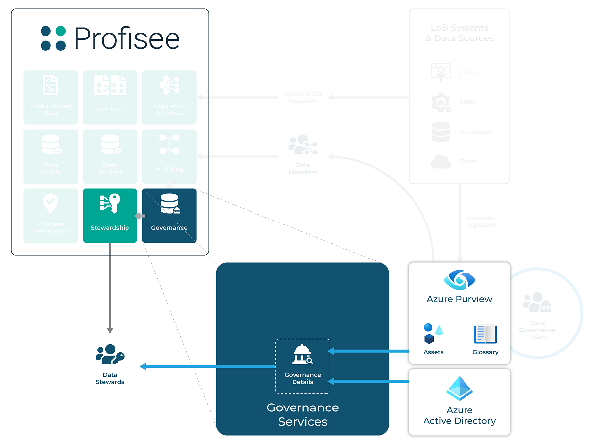
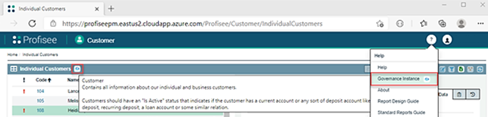
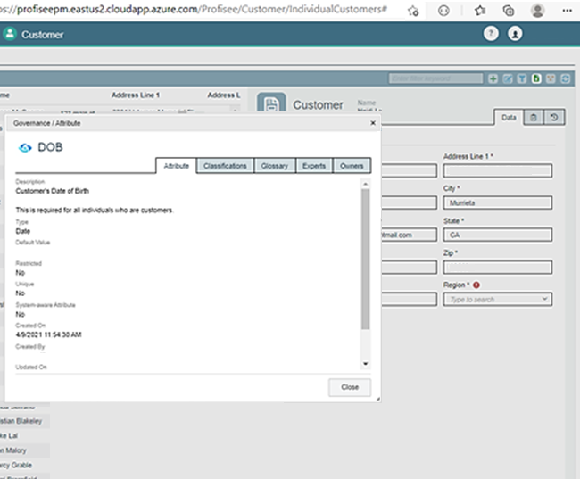
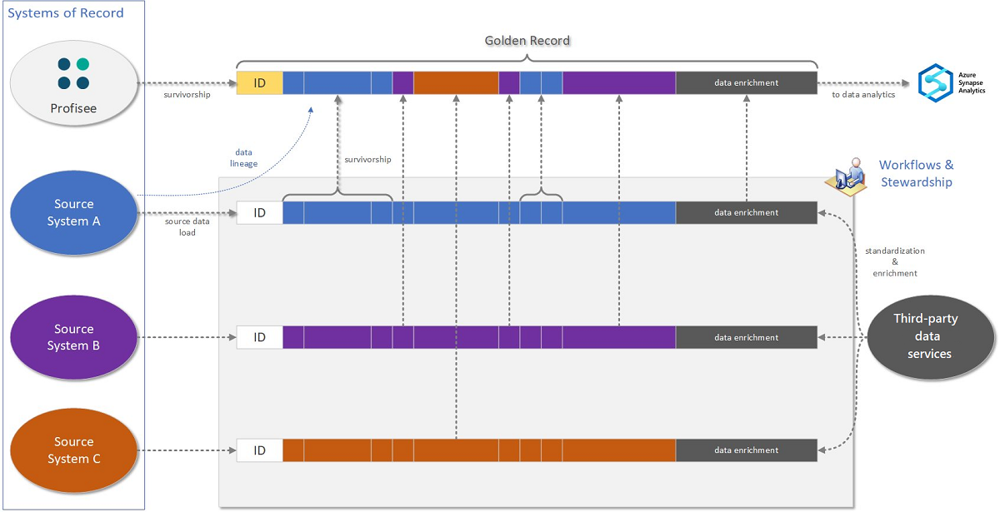
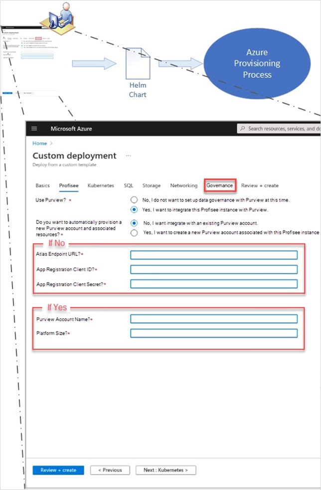

After you catalog enterprise data sources, you might determine that there are multiple sources of master data, which is the common data that's shared across systems. Examples of master data include customer, product, location, asset, and vendor data. It's important for this data to be effective and to form a common trusted platform for analytics and operational improvement. To get the data into that state, you can merge, validate, and correct it in Profisee. You can do this effectively when you use the governance definitions, insights, and expertise that are detailed in Microsoft Purview. In this way, Microsoft Purview and Profisee Master Data Management (MDM) form a foundation for governance and data management, and they maximize the business value of data in Azure.

This example scenario shows how Microsoft Purview and Profisee MDM work together to provide a foundation of high-quality, trusted data for the Azure data estate. For a short video about this solution, see [The power of fully integrated master data management in Azure](https://profisee.com/resources/the-power-of-fully-integrated-master-data-management-in-azure/).

## Architecture

The following diagram shows the steps that you take when you develop and operate your master data solution. Think of these steps as highly iterative. As your solution evolves, you might repeat these steps and phases, sometimes automatically and sometimes manually. Whether you use automatic or manual steps depends on the changes that your master data solution, metadata, and data undergo.

:::image type="content" source="images/purview-microservice-design-architecture.png.png" alt-text="Architectural diagram that shows the data flow when you migrate from SQL Server MDS to Profisee MDM." lightbox="images/purview-microservice-design-architecture.png.png" border="false":::

*Download a [Visio file](https://arch-center.azureedge.net/purview-microservice-design-architecture.vsdx) of this architecture.*

### Dataflow

Metadata and data flow include these steps, which are shown in the preceding figure:

1. Pre-built Microsoft Purview connectors are used to build a data catalog from source business applications. The connectors scan data sources and populate the Microsoft Purview data catalog.

1. The master data model is published to Microsoft Purview. Master data entities that are created in Profisee MDM are seamlessly published to Microsoft Purview. This step further populates the Microsoft Purview data catalog and ensures that there's a record of this critical source of data in Microsoft Purview.

1. Governance standards and policies for data stewardship are used to enrich master data entity definitions. The data is enriched in Microsoft Purview with data dictionary and glossary information, ownership data, and sensitive data classifications. Any definitions and metadata that are available in Microsoft Purview are visible in real time in Profisee as guidance for the MDM data stewards.

1. Master data from source systems is loaded into Profisee MDM. A data integration toolset like Azure Data Factory extracts data from the source systems by using any of over 100 pre-built connectors or a REST gateway. Multiple streams of master data are loaded to Profisee MDM. Master data is the data that defines a domain entity, such as customer, product, asset, location, vendor, patient, household, menu item, and ingredient data. This data is typically present in multiple systems. Resolving differing definitions and matching and merging this data across systems is critical to the ability to use this data in a meaningful way.

1. The master data is standardized, matched, merged, enriched, and validated according to governance rules. Other systems such as Microsoft Purview might define data quality and governance rules. But Profisee MDM is the system that enforces these rules. Source records are matched and merged within and across source systems to create the most complete and correct record possible. Data quality rules check each record for compliance with business and technical requirements. Any record that fails validation or matches with a low probability score is subject to remediation. To remediate failed validations, a workflow process assigns records that require review to data stewards who are experts in their business data domain. After a record has been verified or corrected, it's ready to use as a golden record master.

1. Transactional data is loaded into a downstream analytics solution. A data integration toolset like Azure Data Factory extracts transactional data from source systems by using any of over 100 pre-built connectors or a REST gateway. The toolset loads the data directly into the analytics data platform. That platform might be Azure Synapse Analytics or a different analytics database. Analysis on this raw information without the proper master golden data is subject to inaccuracy, because data overlaps, mismatches, and conflicts aren't yet resolved.

1. Power BI connectors provide direct access to the curated master data. Power BI users can use the master data directly in reports. A dedicated Power BI connector recognizes and enforces role-based security. It also hides various system fields to simplify use.

1. High-quality, curated master data is published to a downstream analytics solution. If master data records have been merged into a single golden record, parent-child links to the original records are preserved.

1. A complete, consistent data foundation is available. The analytics platform has a set of data that's complete, consistent, and accurate. That data includes properly curated master data and associated transactional data. With that data combination, a solid foundation of trusted data is available for further analysis. In Microsoft-centric environments, Azure Synapse Analytics is generally preferred. But you can use any analytics database. Snowflake and Databricks are common choices.

1. Visualization and analytics are performed with high-quality master data. Using high-quality master data eliminates common data quality issues and helps to deliver sound insights for driving the business, no matter which tools that are used for analysis, machine learning, and visualization.

### Components

- [Microsoft Purview](https://azure.microsoft.com/services/purview/) is a data governance solution that provides broad visibility into on-premises and cloud data estates. It offers a combination of data discovery and classification, lineage, metadata search and discovery, and usage insights. All these features help you manage and understand data across your enterprise data landscape.

- [Profisee MDM](https://profisee.com/platform/) is a fast and intuitive MDM platform that integrates seamlessly with Microsoft technologies and the Azure data management ecosystem.

- [Azure Data Factory](https://azure.microsoft.com/products/data-factory/) is a hybrid data integration service. You can use Data Factory to create, schedule, and orchestrate extract, transform, and load (ETL) and extract, load, and transform (ELT) workflows. Data Factory also offers more than 100 pre-built connectors and a REST gateway that you can use to extract data from source systems.

- [Azure Synapse Analytics](https://azure.microsoft.com/services/synapse-analytics/) is a fast, flexible, and trusted cloud data warehouse that uses a massive parallel processing architecture. You can use Azure Synapse Analytics to scale, compute, and store data elastically and independently.

- [Power BI](https://powerbi.microsoft.com/) is a suite of business analytics tools that delivers insights throughout your organization. You can use Power BI to connect to hundreds of data sources, simplify data preparation, and drive improvised analysis. You can also produce beautiful reports and then publish them for your organization to consume on the web and on mobile devices.

### Alternatives

If you don't have a purpose-built MDM application, you can find some of the technical capabilities that you need to build an MDM solution in Azure:

- Data quality. When you load data into an analytics platform, you can build data quality into integration processes. For example, you can use hard-coded scripts to apply data quality transformations in an [Azure Data Factory](/azure/data-factory/introduction) pipeline.
- Data standardization and enrichment. Azure Maps can provide data verification and standardization for address data. You can use the standardized data in Azure Functions and Azure Data Factory. To standardize other data, you might need to develop hard-coded scripts.
- Duplicate data management: You can use Azure Data Factory to [deduplicate rows](/azure/data-factory/how-to-data-flow-dedupe-nulls-snippets) if sufficient identifiers are available for an exact match. You likely need custom hard-coded scripts to implement the logic that's needed to merge matched rows while applying appropriate data survivorship techniques.
- Data stewardship. You can use [Power Apps](https://powerapps.microsoft.com) to quickly develop basic data stewardship solutions to manage data in Azure. You can also develop appropriate user interfaces for reviews, workflows, alerts, and validations.

## Scenario details

As the amount of data you load into Azure increases, the need to properly govern and manage that data across all your data sources and data consumers also grows. Data that seemed adequate in the source system is often found to be deficient when shared. It might have missing or incomplete information, duplications and conflicts, and be of poor quality overall. What is needed is data that is complete, consistent, and accurate.

Without high-quality data in your Azure data estate, the business value of Azure is undermined, perhaps critically. The solution is to build a foundation for data governance and management that can produce and deliver a source of truth for high-quality, trusted data. Working together, Microsoft Purview and Profisee MDM form such a platform.

:::image type="content" source="images/microsoft-purview-profisee-mdm-benefits.png" alt-text="Architecture diagram that shows how Microsoft Purview and Profisee MDM transform ungoverned data into high-quality, trusted data." lightbox="images/microsoft-purview-profisee-mdm-benefits.png" border="false":::

Microsoft Purview catalogs all your data sources and identifies any sensitive information and lineage. It gives the data architect a place to consider the appropriate data standards to impose on all data. Microsoft Purview focuses on governance to find, classify, and define policies and standards. The tasks of enforcing policies and standards, cataloging data sources, and remediating deficient data fall to technologies like MDM systems.

Profisee MDM is designed to accept master data from any source. Profisee MDM then matches, merges, standardizes, verifies, corrects, and synchronizes the data across systems. This process ensures that data can be properly integrated and that it meets the needs of downstream systems, such as business intelligence (BI) and machine learning applications. The integrative Profisee platform enforces governance standards across multiple data silos.

Microsoft Purview and Profisee MDM work better together. When integrated, they streamline data management tasks and ensure that all systems work to enforce the same standards. Profisee MDM publishes its master data model to Microsoft Purview, where it can participate in governance. Microsoft Purview then shares the output of governance, such as a data catalog and glossary information. Profisee can review the output and enforce standards. By working jointly, Microsoft Purview and Profisee create a natural, better-together synergy that goes deeper than the independent offerings.

For example, after you catalog enterprise data sources, you might determine that there are multiple sources of master data, such as customer or product data. To be effective, you should merge, validate, and correct master data in Profisee MDM by using governance definitions, insights, and expertise that are detailed in Microsoft Purview. In this way, Microsoft Purview and Profisee MDM form a foundation for governance and data management, and they maximize the business value of data in Azure.

The following points list the benefits of using Profisee MDM with Microsoft Purview:

- A common technical foundation. Profisee originated in Microsoft technologies. Profisee and Microsoft use common tools, databases, and infrastructure, which makes the Profisee solution familiar to anyone who works with Microsoft technologies. In fact, for many years, Profisee MDM was built on Microsoft Master Data Services (MDS). Now that MDS is nearing the end of its life, Profisee is the premier upgrade and replacement solution for MDS.
- Developer collaboration and joint development. Profisee and Microsoft Purview developers collaborate extensively to ensure a good complementary fit between their respective solutions. This collaboration delivers a seamless integration that meets customer needs.
- Joint sales and deployments. Profisee has more MDM deployments on Azure, and jointly with Microsoft Purview, than any other MDM vendor. You can purchase Profisee through Azure Marketplace. In fiscal year 2023, Profisee is the only MDM vendor with a top-tier Microsoft partner certification that has an IaaS, CaaS, or SaaS offering on Azure Marketplace.
- Rapid and reliable deployment. A critical feature of all enterprise software is rapid and reliable deployment. According to the [Gartner Peer Insights](https://www.gartner.com/peer-insights/home) platform, Profisee has more implementations that take under 90 days than any other MDM vendor.
- Multiple domains. Profisee offers an approach to MDM that inherently uses multiple domains. There are no limitations to the number of master data domains that you can create. This design aligns well with customers who plan to modernize their data estate. Customers might start with a limited number of domains, but they ultimately benefit from maximizing their domain coverage across their whole data estate. This domain coverage is matched to their data governance coverage.
- Engineering that's designed for Azure. Profisee has been engineered to be cloud native with options for both SaaS and managed IaaS or CaaS deployments on Azure.

### Potential use cases

For a detailed list of MDM use cases of this solution, see [MDM use cases](#mdm-use-cases), later in this article. Key MDM use cases include the following retail and manufacturing examples:

- Consolidating customer data for analytics.
- Having a 360-degree view of product data in a consistent and accessible form, such as each product's name, description, and characteristics.
- Establishing reference data to consistently augment descriptions of master data. For example, reference data includes lists of countries/regions, currencies, colors, sizes, and units of measure.

These MDM solutions also help financial organizations that rely heavily on data for critical activities, such as timely reporting.

### MDM integration with Microsoft Purview

The following diagram illustrates in detail the integration of Profisee MDM in Microsoft Purview. To support this integration, the Profisee governance subsystem provides bidirectional integration with Microsoft Purview, which consists of two distinct flows:

- Solution metadata publishing occurs when your data modelers make changes to your master data model, matching strategies and their related sub-artifacts. These changes are seamlessly published to Microsoft Purview as they occur. Publishing these changes syncs the metadata that's related to your master data model and solution. As a result, the Microsoft Purview data catalog is further populated, and Microsoft Purview has a record of this critical data source.
- Governance details are returned and provided to data stewards and business users. These details are available as the users view data, enrich data, and remediate data quality issues by using the Profisee FastApp portal.

#### Purview integration capabilities

The Purview catalog and glossary can help you maximize integration.

##### Master data model design

One of the challenges of preparing an MDM solution is determining what constitutes master data and which data sources to use when you populate your master data model. You can use Microsoft Purview to help with this effort. You can take advantage of the ability to scan your critical data sources, and you can engage your data stewards and subject matter experts. This way, you can enrich your Microsoft Purview data catalog with information that your stewards can then tap, to better align your master data model with your LOB systems. You can reconcile conflicting terminology. This process yields a master data model that optimally reflects the terminology and definitions that you want to standardize your business on. It also avoids outdated and misleading verbiage.

The following excerpt from the broader diagram illustrates this integration use case. First, you use Microsoft Purview system scanning functions to ingest metadata from your LOB systems. Next, your data stewards and SMEs prepare a solid catalog and contacts. Then the data modelers who work with Profisee MDM modeling services can prepare and evolve your master data model. This work aligns with the standards that you define in Purview.

As your stewards evolve the model, the modeling services within the Profisee MDM platform publish changes that are received by Profisee MDM governance services. In turn, Profisee MDM prepares and forwards those changes to Microsoft Purview, for inclusion in its updated data catalog. These additions to the catalog ensure that your master data definitions are included in the broader data estate, and that they can be governed and controlled in the same manner as your LOB system metadata. By ensuring this information is cataloged together, you're in a better position to connect the dots between your master data and your LOB system data.

##### Data stewardship

Large enterprises with correspondingly complex and expansive data estates can present challenges to data stewards, who are responsible for managing and remediating issues as they arise. Key data domains can be complex, with many obscure attributes that only tenured employees with significant institutional knowledge understand. Through the Profisee MDM integration with Microsoft Purview, you can capture this institutional knowledge within Microsoft Purview and make it available for use within Profisee MDM. As a result, you alleviate a great need for corporate data knowledge when you manage critical and time-sensitive information.

The following figure illustrates the flow of information from Microsoft Purview to the data stewards who work in the Profisee FastApp portal. The governance data service integrates with Microsoft Purview and Azure Active Directory (Azure AD). It provides lookup services to portal users, which allows them to retrieve enriched governance data about the entities and the attributes that they work with in the FastApp portal.

Governance services also resolve contacts that are received from Microsoft Purview to their full profile details, which are available in Azure AD. With complete profile details, stewards can effectively collaborate with data owners and experts as they work to enhance the quality of your master data.

The Governance dialog is the user interface through which data stewards and users interact with governance-level details. It renders information that's obtained from Microsoft Purview to the users. By using this information, the users can review the details behind the data from which the dialog was launched. If the information provided in the Governance dialog is insufficient, the users can directly navigate to the Microsoft Purview user experience.

Data stewards and business users can access three Profisee MDM data asset types via the FastApp portal:

- Profisee Instance, which provides the infrastructure properties of the specific instance of the Profisee MDM platform that the user is viewing.
- Profisee Entity, which provides the properties of the master data entity (the table) that the steward or user is currently viewing.
- Profisee Attribute, which provides the properties of the attribute (such as the field or column) in which the user is interested.

The following figure illustrates where users working in the FastApp portal can view governance details for each of these asset types. You can find instance-level details in the **Help** menu. You can access entity details from the page zone header, which contains an entity grid. For attribute details, go to the form that's associated with the entity grid. Access the details from the labels that are associated with the attribute.

To see summary information, hover over the governance icon, such as Microsoft Purview. Select the icon to display the full governance dialog:

To go to the full Microsoft Purview user experience, select the governance icon in the dialog header. Selecting the icon takes you to Microsoft Purview in the context of the asset that you're currently viewing. You're then free to navigate elsewhere in Microsoft Purview, based on your discovery needs.

### Master data management processing

The power of a master data management solution is in the details.

#### Data modeling

The heart of your MDM solution is the underlying data model. It represents the definition of *master data* within your company. Developing a master data model involves the following tasks:

- Identify elements of source data, from across your systems landscape, that are critical to your company's operations and central to analyzing performance.
- Enrich the model with elements that you obtain from other third-party sources that render the data more useful, accurate, and trustworthy.
- Establish clear ownership and permissions related to the elements of your data model. This practice helps to ensure that you factor visibility and change management into your model's design.

Data governance is a critical foundation for supporting all these activities:

- Your governance data catalog, dictionary, glossary, and supporting resources are invaluable sources of information to your governance data stewards. These resources help stewards analyze what to include as part of your master data model. They also help determine ownership and sensitive data classifications in Microsoft Purview. You can reinforce terminology in your model. Through this practice, you can establish an official lexicon for your business. By integrating terminology, your master data model can also translate any esoteric terms that are in use in various source systems to the approved language of the business.
- Third-party systems are often a source of master data that's separate and apart from your LOB systems. It's critical to add elements to your model to capture the information that these systems add to your data, and to reflect these sources of information back into your data catalog.
- You can use ownership and data access, as identified in your governance catalog, to enforce access and change management permissions within your master data management solution. As a result, you align your corporate policies and needs with the tools that you use to manage and steward your master data.

#### Source data load

Ideally, your disparate LOB systems load data into your master data model with little to no change or transformation. The goal is to have a centralized version of the data, as it exists in the source system. There should be as little loss of fidelity as possible between the source system and your master data repository. By limiting the complexity of your loading process, you make lineage simpler. And when you use technology such as Azure Data Factory pipelines, your governance solution can inspect the flow. Then it can connect the dots between your source system and your master data model, extracting data from source systems by using any of over 100 pre-built connectors and a REST gateway.

#### Data enrichment and standardization

After you load source data into your model, you can extend it by tapping into rich sources of third-party data. You can use these systems to improve the data that you obtain from your LOB systems. You can also use these systems to augment the source data with information that enhances its use for other downstream consumers. For example:

- You can use address-verification services, such as Bing, to correct and improve source system addresses. These services can standardize and add missing information that's crucial to geo-location and mail delivery.
- Third-party information services, such as Dun & Bradstreet, can provide general purpose or industry-specific data. You can use this data to extend the value of your golden master record. Specifically, you might add information that was unavailable or in conflict in your disparate LOB systems.

Profisee's publish/subscribe infrastructure makes it easy to integrate your own third-party sources into your solution, as needed.

The ability to understand the sources and meaning behind this data is as critical for third-party data as it is for your internal LOB systems. By integrating your master data model into your governance data catalog, you can connect the dots between internal and external sources of data while enriching your model with governance details.

#### Data quality validation and stewardship

After you load and enrich your data, it's important to check it for quality and adherence to standards that you establish through your governance processes. Microsoft Purview can again be a rich source of standards information. You can use Microsoft Purview to drive the data quality rules that your MDM solution enforces. Profisee MDM can also publish data quality rules as assets to your governance catalog. The rules can be subject to review and approval, which helps you provide top-down oversight of quality standards that are associated with your master data. Because your rules are tied to master data entities and attributes, and because those attributes are traced back to the source system, you can use this information to establish the root cause of the poor data quality that originates from your LOB systems.

Data stewards are experts in their business domain. As steward address issues that your master data solution reveals, they can use the Microsoft Purview data governance catalog.  The catalog helps stewards understand and resolve quality issues as they arise. Backed by the support of data owners and experts, the stewards are armed to address data quality issues quickly and accurately.

#### Matching and survivorship

With enriched, high-quality source data, you're positioned to produce a golden record master that represents the most accurate information across your disparate LOB systems. The following figure illustrates how all the steps culminate in high-quality data that's ready to use for business analysis. When desired, you can harmonize this data across your data estate.

The Profisee MDM matching engine produces a golden record master as part of the survivorship process. Survivorship rules selectively populate the golden record with information that's chosen across your various source systems.

The Profisee MDM history and audit tracking subsystem tracks changes that users make. This subsystem also tracks changes that system processes like survivorship make. Matching and survivorship make it possible to trace the flow of information from your source records to the master. Profisee MDM has a record of the source system that's responsible for a given source record. You also know how disparate source records populate the golden record. As a result, you can achieve data lineage from your analytics back to the source data that your reports reference.

### Master data management use cases

Although there are numerous use cases for MDM, a few use cases cover most real-world MDM implementations. These use cases focus on a single domain, but they're unlikely to be built from only that domain. In other words, even these focused use cases most likely involve multiple domains.

#### Customer 360

Consolidating and standardizing customer data for BI analytics is the most common MDM use case. Organizations capture customer data across an increasing number of systems and applications. Duplicate customer data records result. These duplicates are located within and across applications, and they contain inconsistencies and discrepancies. The poor quality of the customer data limits the value of modern analytics solutions. Symptoms include the following challenges:

- It's hard to answer basic business questions like, "Who are our top customers?" and "How many new customers did we have?" Answering these questions requires significant manual effort.
- You have missing and inaccurate customer information, which makes it difficult to roll up or drill down into the data.
- You're unable to uniquely identify or verify a customer across organizational and system boundaries. As a result, you're unable to analyze your customer data across systems or business units.
- You have poor-quality insights from AI and machine learning due to the poor-quality input data.

#### Product 360

Product data is often spread across multiple enterprise applications, such as ERP, PLM, or e-commerce applications. As a result, it's challenging to understand the total catalog of products that have inconsistent definitions for properties, such as the product name, description, and characteristics. This situation is complicated by different definitions of reference data. Symptoms include the following challenges:

- You're unable to support different alternative hierarchical roll-up and drill-down paths for product analytics.
- With finished goods or material inventory, you have difficulty evaluating product inventory and established vendors. You also have duplicate products, which leads to excess inventory.
- It's hard to rationalize products due to conflicting definitions, which leads to missing or inaccurate information in analytics.

#### Reference data 360

In the context of analytics, reference data exists as numerous lists of data. These lists are often used to further describe other sets of master data. For example, reference data includes lists of countries/regions, currencies, colors, sizes, and units of measure. Inconsistent reference data leads to obvious errors in downstream analytics. Symptoms are:

- Multiple representations of the same value. For example, the state of Georgia is listed as *GA* and *Georgia*, which makes it difficult to consistently aggregate and drill down into data.
- Difficulty streamlining data across systems due to an inability to *crosswalk*, or map, the reference data values between the systems. For example, the color red is represented by *R* in the ERP system and *Red* in the PLM system.
- Difficulty tying numbers across organizations due to differences in established reference data values that are used for data categorization.

#### Finance 360

Financial organizations rely heavily on data for critical activities, such as monthly, quarterly, and annual reporting. Organizations with multiple finance and accounting systems often have financial data across multiple general ledgers, which need to be consolidated to produce financial reports. MDM can provide a centralized hub to map and manage accounts, cost centers, business entities, and other financial data sets. Through the centralized hub, MDM provides a consolidated view of these datasets. Symptoms include the following challenges:

- Difficulty aggregating financial data across multiple systems into a consolidated view
- Lack of process for adding and mapping new data elements in financial systems
- Delays in producing end-of-period financial reports

## Considerations

These considerations implement the pillars of the Azure Well-Architected Framework, which is a set of guiding tenets that can be used to improve the quality of a workload. For more information, see [Microsoft Azure Well-Architected Framework](/azure/architecture/framework).

Consider these factors when you choose a data management solution for your organization.

### Availability

Profisee runs natively on Azure Kubernetes Service and Azure SQL Database. Both services offer out of the box capabilities to support high availability.

### Scalability

Profisee runs natively on Azure Kubernetes Service and Azure SQL Database. Azure Kubernetes Service can be configured to scale Profisee up and out, depending on your needs. Azure SQL Database can be deployed in numerous configurations, to balance performance, scalability, and costs.

### Security

Security provides assurances against deliberate attacks and the abuse of your valuable data and systems. For more information, see [Overview of the security pillar](/azure/architecture/framework/security/overview).

Profisee authenticates users, by using OpenID Connect, which implements an OAuth 2.0 authentication flow. Most organizations configure Profisee to authenticate users against Azure Active Directory, which ensures that you can apply and enforce your enterprise policies for authentication.

### Cost optimization

Cost optimization is about looking at ways to reduce unnecessary expenses and improve operational efficiencies. For more information, see [Overview of the cost optimization pillar](/azure/architecture/framework/cost/overview).

Running costs consist of a software license and Azure consumption. For more information, [contact Profisee](https://profisee.com/contact/).

## Deploy this scenario

The Profisee platform can be deployed as a platform as a solution (PaaS) in Azure by using the [Profisee ARM template](https://github.com/Profisee/kubernetes/tree/master/Azure-ARM). For integration with Purview, select **Yes, configure using Purview**, and then fill in the following details:

* In the **Select Purview Account** dropdown, select **Purview account**.
* Enter the App Registration **Client ID** and the **Client Secret** that has the **Purview Data Curator** role assigned.

The following figure illustrates how these options are reflected in the Profisee ARM template:

## Contributors

*This article is maintained by Microsoft. It was originally written by the following contributors.* 

Principal author:

 - [Gaurav Malhotra](https://www.linkedin.com/in/gamalhotra/) | Principal Group PM Manager
 
*To see non-public LinkedIn profiles, sign in to LinkedIn.*

## Next steps

- Understand the capabilities of the [REST Copy Connector](/azure/data-factory/connector-rest) in Azure Data Factory.
- Learn more about [Profisee running natively in Azure](https://profisee.com/profisee-microsoft/).
- Learn how to deploy Profisee to Azure, by using an [ARM template](https://github.com/Profisee/kubernetes/tree/master/Azure-ARM).
- View the [Profisee Azure Data Factory templates](https://github.com/profisee/azuredatafactory).

## Related resources

### Architecture guides

- [Extract, transform, and load (ETL)](../../data-guide/relational-data/etl.yml)
- [Data warehousing](../../data-guide/relational-data/data-warehousing.yml)
- [Batch processing](../../data-guide/big-data/batch-processing.yml)
- [Choosing a batch processing technology in Azure](../../data-guide/technology-choices/batch-processing.md)

### Reference architectures

- [Master data management with Profisee and Azure Data Factory](profisee-master-data-management-data-factory.yml)
- [Analytics end-to-end with Azure Synapse](../../example-scenario/dataplate2e/data-platform-end-to-end.yml)
- [Modern analytics architecture with Azure Databricks](../../solution-ideas/articles/azure-databricks-modern-analytics-architecture.yml)
- [Big data analytics with enterprise-grade security using Azure Synapse](../../solution-ideas/articles/big-data-analytics-enterprise-grade-security.yml)
- [Automated enterprise BI](enterprise-bi-adf.yml)
- [Optimize marketing with machine learning](../../solution-ideas/articles/optimize-marketing-with-machine-learning.yml)
- [Enterprise business intelligence](/azure/architecture/example-scenario/analytics/enterprise-bi-synapse)
