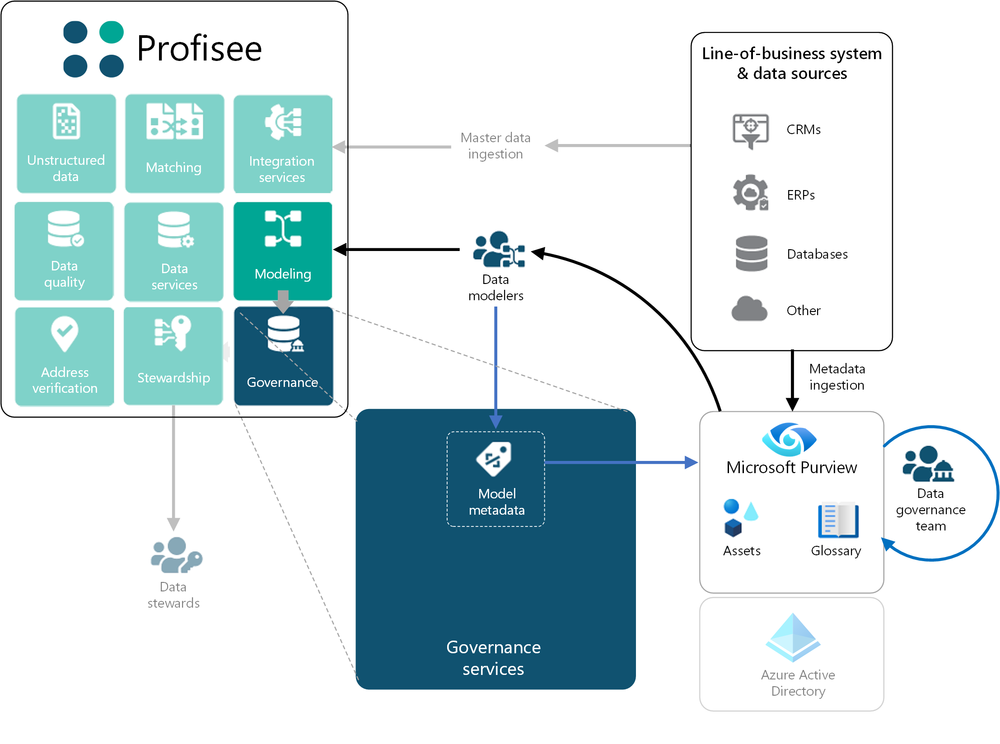

As more data is loaded into Azure, the need to properly govern and manage that data across all your data sources and data consumers also grows. Data that seemed adequate in the source system is often found to be deficient when shared. It may have missing or incomplete information, duplications and conflicts, and be of poor quality overall.

Without high-quality data in your Azure data estate, the business value of Azure will be undermined, perhaps critically. The solution is to build a foundation for data governance and management that can produce and deliver high-quality, trusted data. Working together, Azure Purview and Profisee master data management (MDM) form such a platform.

**Azure Purview** catalogs all the data sources and identifies any sensitive information, as well as lineage. It gives the data architect a place to consider the  appropriate data standards that should be imposed on all data. Purview's focus is on governance to find, classify, and define policies and standards. Enforcing policies, standards and remediating deficient data falls to technologies like master data management (MDM).

**Profisee MDM** is designed to accept master data from any source, then match, merge, standardize, verify, correct, and synchronize it across systems, ensuring data can be properly integrated and will meet the needs of downstream systems, such as business intelligence (BI), machine learning, and so on.

**Better together**: Purview and Profisee MDM are integrated to streamline these tasks and ensure that all systems are working to enforce the same standards. Profisee publishes its master data model to Purview, where it can participate in governance. Purview then shares the output of governance, such as a data catalog and glossary information, so it can be reviewed and enforced by Profisee.

For example, after cataloging enterprise data sources, it may be determined that there are multiple sources of customer data. To be effective, master data should be merged, validated, and corrected in Profisee, by using governance definitions, insights, and expertise that are detailed in Purview. In this way, Purview and Profisee form the foundation for governance and data management, and they maximize the business value of data in Azure.

## Potential use cases

You'll find a robust list of the use cases in the "MDM use cases" section, later in this article. Key master data management (MDM) use cases include the following retail and manufacturing examples:

* Consolidating customer data for analytics.
* Understanding the total catalog of your product data, in a consistent and accessible form, such as each product's name, description, and characteristics.
* Establishing reference data to further consistently describe other sets of master data. For example, reference data includes lists of countries, currencies, colors, sizes, and units of measure.

In addition, these MDM solutions help financial organizations that rely heavily on data for critical activities, such as monthly, quarterly, and annual reporting.

## Architecture

The flow illustration next represents the general order of activity that occurs during the development and subsequent operation of your master data solution. This flow should be thought of as **highly iterative**. As your solution evolves, these steps and phases may be repeated, sometimes automatically and sometimes manually, depending on the changes occurring to your master data solution, metadata, and/or data.

### Metadata and data flow

Metadata and data flow include these steps, shown in the preceding figure:

1. **LOB scanning & classification**: The flow begins by scanning line-of-business (LOB) systems to identify and establish an initial set of assets in Purview. These assets can then be further classified, described, and organized, helping establish a baseline understanding of the data estate. A baseline is a key input for data modelers who are configuring the master data management solution.
2. **Master data modeling**: Purview creates a rich source of enterprise metadata that informs your master data model. Modelers, alongside subject matter experts, improve model effectiveness and accuracy. As your master data model is defined, metadata that's associated with your master data model (such as model entities and attributes) are published to Purview, which automatically allows Profisee to participate in governance as part of your data estate.
3. **Source master data load**: ETL processes, such as Azure Data Factory (ADF) pipelines, can load data into your master data model. In addition, Purview can interrogate such ETL pipelines to infer lineage details that are then added to your governance catalog. This step can help you connect the dots between your LOB systems and your associated master data.
4. **Source data and metadata enrichment**: Aspects of your master data solution can drive the creation of new master data entities and attributes that enrich your data and support related stewardship processes. Like master data modeling, the metadata associated with this enriched data is published automatically to Purview, and it becomes part of your catalog and data estate. Source data enrichment may include one or more of the following:
5. Creation of golden (or master) records that represent the best information that's available across disparate LOB systems, contributing to your master data model.
    - Enriched and improved address, phone, and email contact information that is obtained through supported third-party providers.
    - New record attributions that contain transformed data that originates from Profisee's data quality rules engine and/or data stewardship activities.
    - Process-oriented control attributes that support various stewardship, workflow, and data quality stage-gate behaviors.
6. **Governance data enrichment**: As your master metadata details are published to Purview, your governance team can enhance it with enterprise-level details that help with usage and stewardship, such as glossary entries, supporting resources, data classification, sensitivity identification, ownership, and subject-matter expertise.
7. **Data stewardship**: Enriched governance information is made available to data stewards through Profisee's FastApp Portal, which allows stewards to make good decisions, when faced with quality issues and/or matching conflict resolution challenges. Owners and experts can be quickly identified and reached via instant message (such as Teams chat), email, or phone, thus fostering collaboration between stewards, business users, and data owners.
8. **Managed master data**: After quality checks and stewardship activities have been completed, high-quality master data can be applied by the business, through analytics supported by Azure Synapse. Like data ingress, real-time or near-real-time data feeds can be supported by Azure Data Factory pipelines to your analytics. And applying the ability to infer lineage from the pipeline metadata, you're able to trace lineage from your analytics back to the LOB applications that originated the data that you are presently analyzing.

### Components

- [Azure Purview](https://azure.microsoft.com/services/purview/) is a data governance solution that provides broad visibility of organizations' on-premises and cloud data estates. It offers a combination of data discovery and classification, lineage, metadata search and discovery, and usage insights, which help you manage and understand data across your enterprise data landscape.

- [Profisee](https://profisee.com/platform/) is a fast and scalable MDM platform that integrates seamlessly with Microsoft technologies and the Azure data management ecosystem.

- [Azure Data Factory](https://azure.microsoft.com/services/data-factory/) is a hybrid data integration service that allows you to create, schedule, and orchestrate your ETL/ELT workflows.

- [Azure Synapse Analytics](https://azure.microsoft.com/services/synapse-analytics/) is a fast, flexible, and trusted cloud data warehouse that lets you scale, compute, and store data elastically and independently, with a massive parallel processing architecture.

- [Power BI](https://powerbi.microsoft.com/) is a suite of business analytics tools that delivers insights throughout  your organization. Connect to hundreds of data sources, simplify data preparation, and drive improvised analysis. Produce beautiful reports, and then publish them for your organization to consume, on the web and across mobile devices.

## Alternatives

In the abscence of a purpose-built MDM application, some of the technical capabilities needed to build an MDM solution may be found within the Azure ecosystem:

- **Data quality**: When loading to an analytics platform, data quality can be built into integration processes. For example, you can use hardcoded scripts to apply data quality transformations in an [Azure Data Factory](https://azure.microsoft.com/services/data-factory/) pipeline.
- **Data standardization and enrichment**: [Azure Maps](https://azure.microsoft.com/services/azure-maps/) is available to provide data verification and standardization for address data. The standardized data can be used in Azure Functions and/or Azure Data Factory. Standardization of other data may require you to develop hardcoded scripts.
- **Duplicate data management**: Azure Data Factory can be used to [deduplicate rows](/azure/data-factory/how-to-data-flow-dedupe-nulls-snippets), where sufficient identifiers are available for an exact match. In this case, the logic to merge matched with appropriate survivorship would likely require custom hardcoded scripts.
- **Data stewardship**: [Power Apps](https://powerapps.microsoft.com/) can be used to quickly develop simple data stewardship solutions to manage data in Azure, along with appropriate user interfaces for review, workflow, alerts, and validations.

## MDM integration with Azure Purview

The following figure illustrates in more detail Profisee's Azure Purview integration. To support this integration, Profisee's **Governance** subsystem provides bidirectional integration with Purview, which consists of two distinct flows:

- **Model metadata** publishing occurs when your data modelers make changes to your master data model. These changes are published to Purview as they occur, thus keeping your Purview metadata in synch with Profisee's definition of your master data model.
- **Governance details** are returned and provided to data stewards and business users, as they view and remediate data quality issues in Profisee's FastApp Portal.

### Purview integration capabilities

The Purview catalog and glossary can help you maximize integration.

#### Master data model design

One of the challenges when preparing a master data management solution is determining what constitutes *master data* and from which data sources you will populate your master data model. You can use Purview to help with this effort, by taking advantage of the ability to scan your critical data sources, and by engaging your data governance team and subject matter experts. This way, you can enrich your catalog with information that your master data modelers can then tap, to better align your master data model with your LOB systems. You can reconcile conflicting terminology, which yields a master data model that optimally reflects the terminology and definitions on which your business wants to standardize, while avoiding outdated and misleading terms.

The following excerpt from the broader diagram illustrates this integration use-case. First, you use Purview's system scanning functions to ingest metadata from your LOB systems. After your governance team and SMEs have prepared a solid catalog and contacts, then the data modelers working with Profisee's modeling services can prepare and evolve your master data model, in alignment with your established standards (as defined in Purview).

As your master data modelers evolve the model, the modeling services within the Profisee platform will publish changes that are received by Profisee's governance services. In turn, Profisee prepares and forwards those changes to Purview, for inclusion in its updated catalog. These additions to the catalog ensure that your master data definitions are included in the broader data estate, and that they can be governed and controlled in the same manner as your LOB system's metadata. By ensuring this information is cataloged together, you are in a better position to connect the dots between your master data and your LOB system data.

#### Data stewardship

Large enterprises with correspondingly complex and expansive data estates can present challenges to data stewards, who are responsible for managing and remediating issues as they arise. Key data domains can be complex, with many obscure attributes that only tenured employees with significant institutional knowledge understand. Profisee's integration with Purview allows this institutional knowledge to be captured within Purview, and made available for use within Profisee. Thus, you're bringing this knowledge of corporate data closer to the point of need, when you're managing critical and time-sensitive information.

The following figure illustrates the flow of information from Purview to the data stewards, who are working in Profisee's FastApp Portal. The Governance Data Service integrates with both Azure Purview and Azure Active Directory. It provides lookup services to portal users, which allows them to retrieve enriched governance data about the entities and the attributes that they are working with in the FastApp portal.

Governance services also resolve contacts received from Purview to their full profile details, which are available in Azure Active Directory. Complete profile details allow stewards to effectively collaborate with data owners and experts, as they work to enhance the quality of your master data.

The Governance dialog is the user interface through which data stewards and users interact with governance-level details. It renders information obtained from Purview to the users, allowing them to review the details behind the data from which the dialog was launched. If the information provided in the Governance Dialog is insufficient, it also allows the user to directly navigate to the full user experience of Purview.

Data stewards and business users can access three Profisee data asset types via the FastApp Portal:

- **Profisee Instance**: Provides the infrastructure properties of the specific instance of the Profisee platform that the user is viewing.
- **Profisee Entity**: Provides the properties of the master data entity (the table) that the steward or user is currently viewing.
- **Profisee Attribute**: Provides the properties of the attribute (such as the field or column) in which the user is interested.

The following figure illustrates where users working in the FastApp Portal can view governance details for each of the respective asset types that are described above. Instance-level details can be found in the **Help** menu. Entity details can be accessed from the page zone header, which contains an entity grid. Attribute details can be accessed from the labels that are associated with the attribute, on the form that's associated with the entity grid.

Summary information is available to the user, by hovering over the governance icon (such as Purview). Select the icon to raise the full governance dialog:

You can go to the full Azure Purview user experience by selecting the governance icon in the dialog header. Selecting the icon takes the user to Purview in the context of the asset currently being viewed. You are then free to navigate elsewhere in Purview, based on your discovery needs.

## Master data management processing

The power of a master data management solution is in the details.

### Data modeling

The heart of your master data management solution is the underlying data model. It represents the definition of *master data* within your company. Developing a master data model involves the following tasks:

-  Identify elements of source data, from across your systems landscape, that are critical to your company's operations and central to analyzing performance.
- Enrich the model with elements that are obtained from other third-party sources that render the data more accurate and useful.
- Establish clear ownership and permissions related to the elements of your data model, thus ensuring that visibility and change management are factored into your model's design.

Data governance is a critical foundation for supporting all these activities:

- Your governance data catalog, glossary, and supporting resources are invaluable sources of information to your data modeling team, in order to analyze what should be included as part of your master data model. Terminology can be reinforced in your model, which allows you to establish an official lexicon for your business. Integrating terminology also allows your master data model to translate from esoteric terms, in use in various source systems, to the approved language of the business.
- Third-party systems are often a source of master data that is separate and apart from your LOB systems. It is critical to add elements to your model to capture the additional information that these systems add to your data, and to reflect these sources of information back into your data catalog.
- Ownership and data access, as identified in your governance catalog, can be used to enforce access and change management permissions within your master data management solution. Thus, you align your corporate policies and needs with the tools that are used to manage and steward your master data.

### Source data load

Data is loaded into your master data model from your disparate LOB systems, ideally, with little to no change or transformation. The goal is to have a centralized version of the data, as it exists in the source system, with as little loss of fidelity between the source system and your master data repository as possible. By limiting the complexity of your loading process, lineage is made simpler. And by using technology such as Azure Data Factory pipelines, your governance solution can inspect the flow, and then it can connect the dots between your source system and your master data model.

### Data enrichment and standardization

After the source data is loaded into your model, you can extend it by tapping into rich sources of third-party data. These systems can be used to improve the data obtained from your LOB systems, or to augment the source data with information that enhances its use for other downstream consumers. For example:

- Address-verification services (such as Bing) can be used to correct and improve source system addresses, by standardizing and adding missing information that is crucial to geo-location and to mail delivery (for example).
- Third-party information services (such as Dun & Bradstreet) can provide general purpose or industry-specific data that extends the value of your master data with information that was unavailable, directly from your LOB systems.

Profisee's publish/subscribe infrastructure makes it easy to integrate your own third-party sources into your solution, as needed.

The ability to understand the sources and meaning behind these data are as critical for third-party data as they are for your internal LOB systems. By integrating your master data model into your governance data catalog, you can connect the dots between both internal and external sources of data.

### Data quality validation and stewardship

After your data has been loaded and enriched, it's important to check it for quality and adherence to standards that are established through your governance processes. Purview can, again, be a rich source of standards information and can be used to drive your data quality rules, to be enforced by your master data management solution. Additionally, data quality rules can be published by Profisee, as assets to your governance catalog. The rules can be subject to review and approval, which helps you provide top-down oversight to quality standards that are associated with your master data. Because your rules are tied to master data entities and attributes, and because those attributes are traced back to source system, you can use this information to establish the root cause for the poor data quality that originates from your LOB systems.

As data stewards address issues that are surfaced through your master data solution, they can apply Purview's data governance catalog to help with understanding and resolving quality issues, as they arise. Backed by the support of data owners and experts, they are armed to address data quality issues quickly and accurately.

### Matching and survivorship

With enriched, high-quality source data, you are now positioned to produce a *golden record* that represents the most accurate information across your disparate LOB systems. The following figure illustrates how all the steps culminate in data that is of high quality and that is ready to use for business analysis. When desired, you can harmonize this data across your data estate.

Profisee's matching engine produces a *golden record* as part of the survivorship process. Survivorship rules selectively populate the golden record with information that's chosen across your various source systems.

Profisee's history and audit tracking subsystem tracks changes that are not only made by users, but also by system processes, such as survivorship. Matching and survivorship allow the traceability of the flow of information from your source records to the master. Because Profisee knows the source system responsible for a given source record, and because you know how the golden record was populated from disparate source records, you can achieve data lineage from your analytics back to the source data that's referenced in those reports.

## Master data management use cases

Although there are numerous use cases for MDM, a few use cases cover most real-world MDM implementations. These use cases are focused on a single domain, but they are unlikely to be built from only that domain. In other words, even these focused use cases most likely include multiple master data domains.

### Customer 360

Consolidating customer data for analytics is the most common MDM use case. Organizations capture customer data across an increasing number of applications, which creates duplicate customer data within and across applications, with inconsistencies and discrepancies. It makes it difficult to realize the value of modern analytics solutions, due to the poor quality of the customer data. Symptoms include the  following challenges:

- It's hard to answer basic business questions, like, "Who are our top customers?" and "How many new customers did we have?" Answering these questions then requires significant manual effort.

- You have missing and inaccurate customer information, making it difficult to roll up or drill down into the data.

- You have an inability to analyze your customer data across the systems or business units, due to an inability to uniquely identify a customer across organizational and  system boundaries.

- You have poor-quality insights from AI and machine learning, due to the poor-quality input data.

### Product 360

Product data is often spread across multiple enterprise applications, such as ERP, PLM, or e-commerce. The result is a challenge understanding the total catalog of products that have inconsistent definitions for properties, such as the product's name, description, and characteristics. It's complicated by different definitions of reference data.  Symptoms include the following challenges:

- The inability to support different alternative hierarchical rollup and drill-down paths for product analytics.
- Whether finished goods or material inventory, you have a difficulty understanding exactly what products you have on hand, the vendors your products are purchased from, and you have duplicate products, which leads to excess inventory.
- It's hard to rationalize products due to conflicting definitions, which leads to missing or inaccurate information in analytics.

### Reference data 360

In the context of analytics, reference data exists as numerous lists of data, which is often used to further describe other sets of master data. For example, reference data includes lists of countries, currencies, colors, sizes, and units of measure. Inconsistent reference data leads to obvious errors in downstream analytics. Symptoms are:

- Multiple representations of the same thing. For example, the state of Georgia is listed as "GA" and "Georgia," which makes it difficult to aggregate and drill down into data consistently.
- Difficulty aggregating data from across applications due to an inability to crosswalk the reference data values between the systems. For example, the color red is represented by "R" in the ERP system, and it shows as "Red" in the PLM system.
- Difficulty tying numbers across organizations due to differences in agreed upon reference data values that are used to categorize data.

### Finance 360

Financial organizations rely heavily on data for critical activities, such as monthly, quarterly, and annual reporting. Organizations with multiple finance and accounting systems often have financial data across multiple general ledgers, which need to be consolidated to produce financial reports. MDM can provide a centralized place to map and manage accounts, cost centers, business entities, and other financial data sets, to a consolidated view. Symptoms include the following challenges:

- Difficulty aggregating financial data across multiple systems into a consolidated view.
- Lack of process for adding and mapping new data elements in the financial systems.
- Delays in producing end-of-period financial reports.

## Considerations

Consider these factors when you choose a data management solution for your organization.

### Availability

Profisee runs natively on Azure Kubernetes Service and Azure SQL Database. Both services offer out of the box capabilities to support high availability.

### Scalability

Profisee runs natively on Azure Kubernetes Service and Azure SQL Database. Azure Kubernetes Service can be configured to scale Profisee up and out, depending on your needs. Azure SQL Database can be deployed in numerous configurations, to balance performance, scalability, and costs.

### Security

Profisee authenticates users, by using OpenID Connect, which implements an OAuth 2.0 authentication flow. Most organizations configure Profisee to authenticate users against Azure Active Directory, which ensures that you can apply and enforce your enterprise policies for authentication.

## Deploy the scenario

The Profisee platform can be deployed as a platform as a solution (PaaS) in Azure by using the [Profisee ARM template](https://github.com/Profisee/kubernetes/tree/master/Azure-ARM). For integration with Purview select "Yes, configure using Purview" and fill the below details:

- Select the **Purview account** from the drop down against "Select Purview Account".
- An App Registration **Client ID** and **Client Secret** that has the **Purview Data Curator** role assigned.

The following figure illustrates how these options are reflected in Profisee's ARM template:

## Pricing

Running costs consist of a software license and Azure consumption. For more information, [contact Profisee](https://profisee.com/contact/).

## Next steps

- Understand the capabilities of the [REST Copy Connector](/azure/data-factory/connector-rest) in Azure Data Factory.
- Learn more about [Profisee running natively in Azure](https://profisee.com/profisee-microsoft/).
- Learn how to deploy Profisee to Azure, by using an [ARM template](https://github.com/Profisee/kubernetes/tree/master/Azure-ARM).
- View the [Profisee Azure Data Factory templates](https://github.com/profisee/azuredatafactory).

## Related resources

### Architecture guides

- [Extract, transform, and load (ETL)](../../data-guide/relational-data/etl.md)
- [Data warehousing](../../data-guide/relational-data/data-warehousing.md)
- [Batch processing](../../data-guide/big-data/batch-processing.md)
- [Choosing a batch processing technology in Azure](../../data-guide/technology-choices/batch-processing.md)

### Reference architectures

- [Master data management with Profisee and Azure Data Factory](profisee-master-data-management-data-factory.yml)
- [Analytics end-to-end with Azure Synapse](../../example-scenario/dataplate2e/data-platform-end-to-end.yml)
- [Modern analytics architecture with Azure Databricks](../../solution-ideas/articles/azure-databricks-modern-analytics-architecture.yml)
- [Big data analytics with enterprise-grade security using Azure Synapse](../../solution-ideas/articles/big-data-analytics-enterprise-grade-security.yml)
- [Automated enterprise BI](enterprise-bi-adf.yml)
- [Optimize marketing with machine learning](../../solution-ideas/articles/optimize-marketing-with-machine-learning.yml)
- [Enterprise business intelligence](enterprise-bi-synapse.yml)
