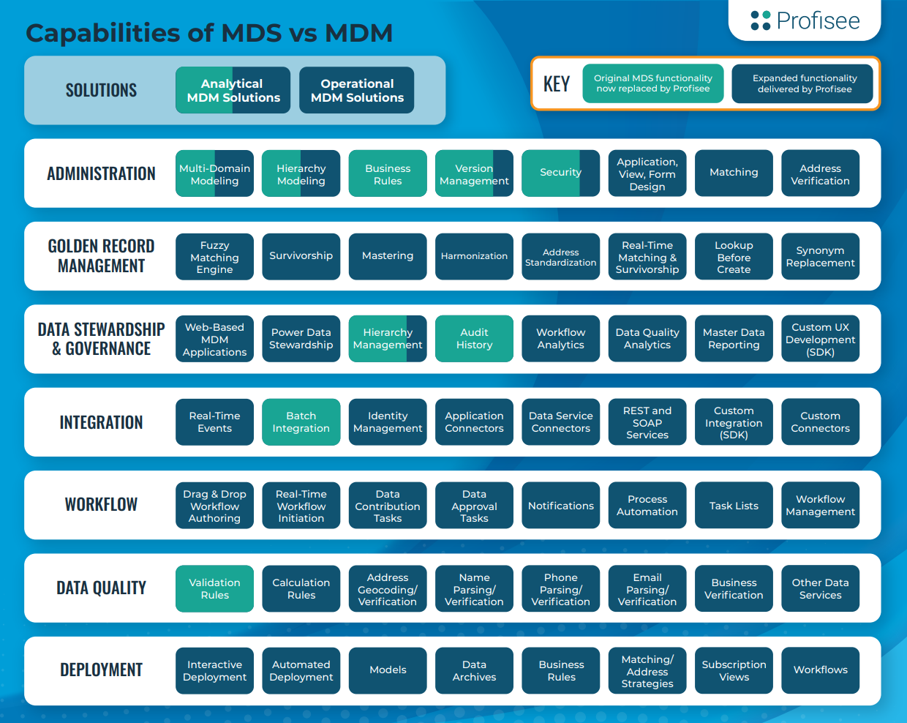
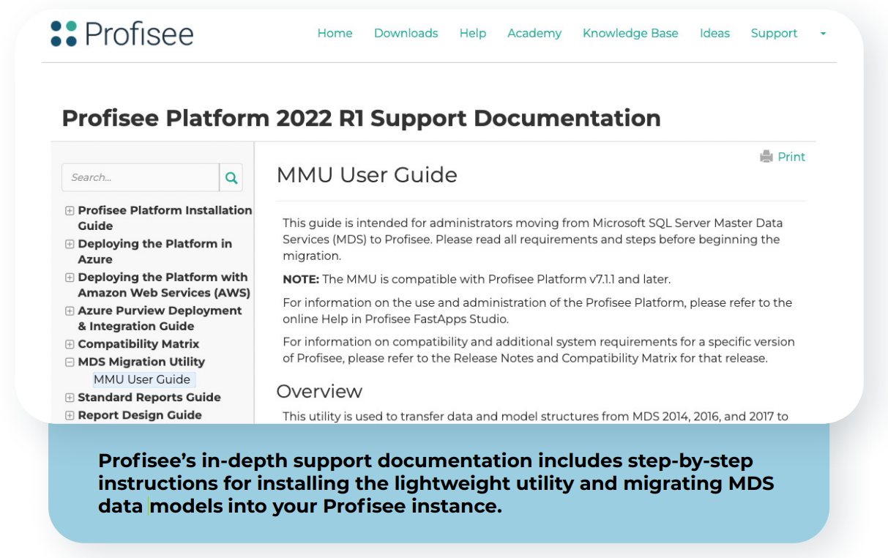
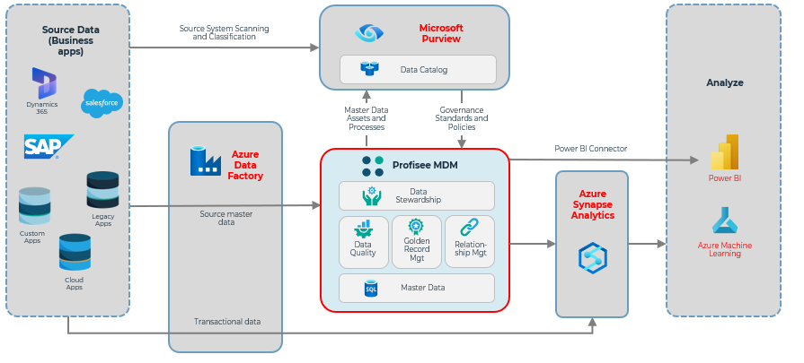
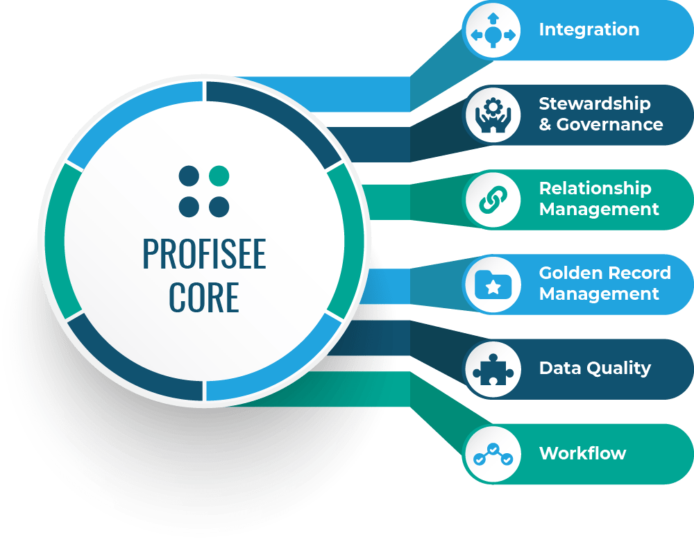

# Migrate SQL Server Master Data Services to Azure with Profisee Master Data Management #

Microsoft Purview 
Data Factory 
SQL Database 
Synapse Analytics 

When Microsoft announced in June 2021 that it would no longer actively
support [SQL Server Master Data Services](https://docs.microsoft.com/en-us/sql/master-data-services/master-data-services-overview-mds?view=sql-server-ver16)
(MDS) and only provide maintenance in the current version, many
long-time users began contemplating their options. For many, the
opportunity to upgrade to a more full-featured Master Data Management
(MDM) platform is the obvious choice — especially if it can be done with
minimal effort and disruption.

Profisee MDM is a full-featured MDM platform that was originally built
using MDS as a foundation. In fact, several of the original
developers of Profisee MDM were the [original developers of MDS](https://profisee.com/solutions/microsoft-enterprise/), and MDS
was part of the architecture of early versions of the Profisee Platform.

Although the MDS underpinning was removed several years ago when it
became clear Microsoft would not migrate MDS to the cloud, it still
represents a familiar architecture to current MDS users. Since all
legacy Profisee users did migrate from an MDS-based version of Profisee
to the current architecture, Profisee developed several automated
migration capabilities to streamline MDS migration for users down to a
few clicks.

Due to the history with MDS and experience migrating many legacy MDS
users, Profisee has [more MDS migration experience than any other MDM vendor](https://profisee.com/solutions/microsoft-enterprise/master-data-services/).

Aside from the ease of migration, there are several benefits of
migrating to a fully featured MDM platform such as Profisee, including:

- **Matching**: create a single golden record master by matching between
  and within data sources

- **Data quality**: enforce data-quality and governance rules

- **Data stewardship**: engage human experts to approve low-probability
  matches and/or directly remediate problem data, as required

- **Workflow**: orchestrate the routing of data issues to data stewards,
  as required

- **Multidomain**: model and master data from multiple domains
  (customer, product, location, asset and more) simultaneously in the
  same system along with any and all reference data

- **Deployment options**: Cloud-native Platform-as-a-Service (PaaS) and
  turn-key Software-as-a-Service (SaaS)

## Features of MDS and Profisee MDM ##

While MDS was an excellent tool for reference data management — helping
organizations manage customer lists, product lists, hierarchies, state
codes, cost centers and other attributes — it was limited in many areas.
The chart below shows some of the functional areas where Profisee
expands on the more limited MDS toolset into a complete MDM platform.

Although Profisee was once based on MDS, it has since re-engineered its
multidomain MDM platform from the ground up on a modern,
[Platform-as-a-Service (PaaS) architecture](https://profisee.com/our-technology/modern-cloud-architecture/), which is also offered in a
turnkey SaaS model. And with [native integrations into leading Azure services](https://links.imagerelay.com/cdn/3467/ql/701d7595dd964c0dbcba2fab2541805e/Azure-Marketplace-Datasheet.pdf) — including [Microsoft Purview](https://docs.microsoft.com/en-us/azure/architecture/reference-architectures/data/profisee-master-data-management-purview), [Azure Data Factory](https://docs.microsoft.com/en-us/azure/architecture/reference-architectures/data/profisee-master-data-management-data-factory), Azure
Synapse and [Power BI](https://links.imagerelay.com/cdn/3467/ql/7805cfac87e344459e206ff2f9e2510a/Profisee_Power-BI-Connector_Datasheet.pdf) — Profisee is the [clear choice for the modern Microsoft enterprise](https://profisee.com/solutions/microsoft-enterprise/master-data-services/).

The following chart shows the significant expansion in capabilities
offered by Profisee MDM over MDS:

In addition to the functional expansion shown above, the close fit and
synergy from MDS to Profisee also demonstrates the advantage of
migrating reference data management to a cloud-native, multidomain
platform with Profisee MDM. It also demonstrates why Profisee MDM is a
“natural successor” from MDS, helping organizations easily upgrade to
full-featured MDM. And Profisee’s lightweight MDS Migration Utility
helps users migrate their existing MDS entities, hierarchies, users and
groups to Profisee in just a few clicks.

More Details:

- [MDS Migration on Profisee.com](https://profisee.com/solutions/microsoft-enterprise/master-data-services/)

- [MDS Migration blog post](https://profisee.com/blog/4-key-takeaways-mds-migration-options-and-why-you-should-switch/)

- [Webinar with original architect of MDS](https://profisee.com/resources/mdm-resource-hub/videos/master-data-services-migration-options-and-why-you-should-switch/)

## Profisee MDS Migration Utility (MMU) ##

To ensure simple and fast migration from MDS to full-featured MDM,
Profisee developed the MDS Migration Utility (MMU) and deployed it along
with the Profisee MDM platform at no additional charge.

The MMU utility is lightweight and easy to use, with no installation
required. Simply download the utility from the Profisee Support Portal
and unzip the file into the desired directory. The utility is used to
transfer data and model structures from MDS 2014, 2016 and 2017 to
Profisee MDM. The utility will then re-create the entities, attributes,
relationships and hierarchies from the current MDS implementation
directly within Profisee MDM.

## Technical Considerations ##

- Migration is a one-time process, and each model need only be migrated
  once.

- Entities, hierarchies, users and groups as well as data will be
  seamlessly migrated to Profisee. Profisee customers can reference the
  MMU User Guide for more information.

- Note that data quality rules are not automatically migrated (due to
  availability of more advanced data quality structures in Profisee),
  but most can be quickly re-created — and expanded — in the Profisee
  no-code data quality rules UI.

  

## Deployment ##

Profisee is built on a modern cloud architecture as a containerized
Kubernetes service for easy deployment and flexibility. Customers can
leverage Profisee MDM for complete flexibility to deploy in any cloud,
on-prem or in a hybrid environment or use Profisee MDM SaaS in the Azure
cloud as a full turn-key service for the fastest path to trusted data.

Both Profisee MDM and Profisee MDM SaaS are available as transactable
services via the [Azure Marketplace](https://azuremarketplace.microsoft.com/en-us/marketplace/apps?search=profisee&page=1)
for complete flexibility.

More Details:

- [Cloud-native MDM](https://profisee.com/cloud-master-data-management/)

- [Profisee listings on Azure Marketplace](https://azuremarketplace.microsoft.com/en-us/marketplace/apps?search=profisee&page=1)

## Architecture ##

Profisee provides native integration to all relevant Azure Data
Services, specifically:

- **Microsoft Purview**: Bi-directional integration with Profisee MDM
  allows Microsoft Purview to ***define*** the governance rules and for
  Profisee MDM to ***enforce*** the across multiple data sources.
  Profisee MDM has the first, deepest and most mature integration with
  Microsoft Purview of any MDM system. See the [Profisee-Purview reference data architecture](https://learn.microsoft.com/en-us/azure/architecture/reference-architectures/data/profisee-master-data-management-purview) for more details

- **Power BI**: The Profisee Connector for Power BI simplifies access to
  access complete and consistent ‘certified’ master data for Power BI
  users and further democratizes data-driven decision making — even for
  those unfamiliar with MDM or the Profisee platform. The connector is
  [officially certified by Power BI](https://profisee.com/blog/profisee-now-available-as-native-power-bi-data-source/) and is the first MDM connector
  to be shipped as a native data source in Power BI for seamless access.

- **Azure Data Factory**: To reduce friction in integrating data across
  the ecosystem, Profisee built the first pipeline templates for MDM
  that are now natively available as part of Azure Data Factory.

- **Azure Synapse:** Profisee publishes certified master data into Azure
  Synapse to build a complete, consistent data foundation for any
  advanced analytics, irrespective of data source.

More Details:

- [“Data Governance with Profisee and Microsoft Purview”](https://learn.microsoft.com/en-us/azure/architecture/reference-architectures/data/profisee-master-data-management-purview)

- [“Master Data Management with Profisee and Azure Data Factory”](https://learn.microsoft.com/en-us/azure/architecture/reference-architectures/data/profisee-master-data-management-data-factory)

- [“Deploy Microsoft Purview - Profisee integration for master data management (MDM) - Microsoft Purview”](https://learn.microsoft.com/en-us/azure/purview/how-to-deploy-profisee-purview-integration)

## Profisee MDM Core Features ##

Profisee MDM is a full-featured multi-domain MDM solution that can accommodate all functionality available in MDS and more:

 

- **Profisee Core**: Allows for creation and deployment of flexible entity models
  to represent and master any domain

- **Integration**: Profisee Integrator makes it easy synchronize clean,
  consistent and trusted data across enterprise applications and data
  warehouses with out-of-the-box, real-time and bi-directional
  integrations and support for REST APIs and webhooks

- **Stewardship and Governance**: Gives data stewards the ability to
  interact with their data for common tasks such reviewing and approving
  matches and correcting data quality issues, as required. Web-based
  user interface is intuitive and configurable to create applications
  tailored to typical data stewardship workflows and tasks.

- **Relationship Management**: Allows for modeling and exploration of
  both hierarchical (parent-child) rollups (typically used in reference
  data management and analytics) and peer-level entity relationships
  through common attributes.

- **Golden Record Management**: De-duplicate data between and within
  data sources with automated match, merge and survivorship functions.
  Matching is based on machine-learning algorithms and is configurable
  for any master data domain and matching strategy. Survivorship rules
  are similarly configurable to allow for specification of preferred
  sources when conflicts occur or to require human review in the case of
  a low-confidence result. Includes dedicated match-result viewer to
  explore and verify matching process.

- **Data Quality:** Specify data quality rules to verify for valid data.
  Machine-learning anomaly detection can help flag out-of-bands values
  and route for appropriate remediation.

- **Workflow**: Highly configurable workflow engine to optimize and
  orchestrate routing of various tasks to data stewards for review
  and/or intervention.

## Next steps ##

- For more information about Profisee, see the [Profisee website](https://profisee.com/).

- For instructions on upgrading from Master Data Services to Profisee, see the [Profisee MDS Migration Utility web page](https://profisee.com/solutions/microsoft-enterprise/master-data-services/).

- Learn more about Profisee’s shared history with Microsoft and SQL Server MDS in this [blog from one of the original architects of MDS](https://profisee.com/blog/4-key-takeaways-mds-migration-options-and-why-you-should-switch/).

## Related resources ##

- [Data governance with Profisee and Microsoft Purview](https://docs.microsoft.com/en-us/azure/architecture/reference-architectures/data/profisee-master-data-management-purview)

- [Master data management with Profisee and Azure Data Factory](https://docs.microsoft.com/en-us/azure/architecture/reference-architectures/data/profisee-master-data-management-data-factory)

- For an overview of Azure data architecture, see the [Azure Data Architecture Guide](https://docs.microsoft.com/en-us/azure/architecture/data-guide).

- [Analytics end-to-end with Azure Synapse](https://docs.microsoft.com/en-us/azure/architecture/example-scenario/dataplate2e/data-platform-end-to-end)
