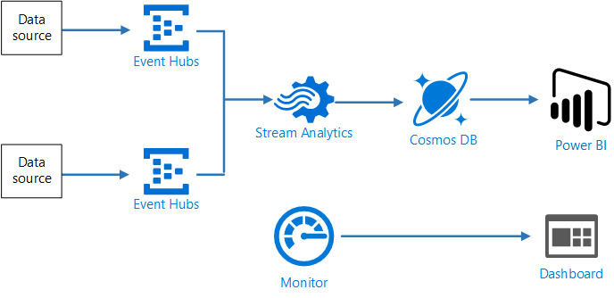

# Stream processing with Azure Stream Analytics

This reference architecture shows how to correlate two streams of data using Azure Stream Analytics and calculate a rolling average across a time window.




**Scenario**: Taxi cabs collect data about each taxi trip. For this scenario, we assume there are two separate devices sending data. The taxi has a meter that sends information about each ride &mdash; the duration, distance, and pickup and dropoff locations. A separate device accepts sends information about fares. For example, this might be a mobile app that customers use to pay the fare. The taxi company wants to calculate the average tip per mile driven, in real time, in order to spot trends.

## Architecture

The architecture consists of the following components.

**Data sources**. In this architecture, there are two data sources that generate data streams in real time. The first stream contains ride information, and the second contains fare information. The reference architecture includes a simulated data generator that reads from a set of static files and pushes the data to Event Hubs. In a real scenario, the data sources would be devices installed in the taxi cabs.

**Azure Event Hubs**. Event Hubs is an event ingestion service. This architecture uses two event hub instances, one for each data source. Each data source sends a stream of data to the associated event hub.

**Azure Stream Analytics**. Stream Analytics reads the data streams from the two event hubs and performs stream processing.

**Cosmos DB**. The output from the Stream Analytics job is a series of records, which are written as JSON documents to a Cosmos DB document database.

**Power BI**.  Power BI is a suite of business analytics tools to analyze data for business insights. In this architecture, it loads the data from Cosmos DB.

## Data ingestion

To simulate a data source, this reference architecture uses the [New York City Taxi Data](https://uofi.app.box.com/v/NYCtaxidata/folder/2332218797) dataset. This dataset contains data about taxi trips in New York City over a 4-year period (2010 &ndash; 2013). It contains two types of record: Ride data and fare data. Ride data includes trip duration, trip distance, and pickup and dropoff location. Fare data includes fare, tax, and tip amounts. Common fields in both record types include medallion number, hack license, and vendor ID. Togther these three fields uniquely identify a taxi plus a driver. The data is stored in CSV format. 

The data generator is a .NET core application that reads the records and sends them to Azure Event Hubs. The generator sends ride data in JSON format and fare data in CSV format. 

Event Hubs uses [partitions](https://docs.microsoft.com/en-us/azure/event-hubs/event-hubs-features#partitions) to segment the data. Partitions allow a consumer to read each partition in parallel. When you send data to Event Hubs, you can specify the partition key explicitly. Otherwise, records are assigned to partitions in round-robin fashion. 

In this particular scenario, ride data and fare data should have the same partition ID for a given taxi cab. That will enable Stream Analytics to apply a degree of parallelism when it correlates the two streams. A record in partition *n* of the ride data will match a record in partition *n* of the fare data.


In the data generator, the common data model for both record types has a `PartitionKey` property which is the concatenation of `Medallion`, `HackLicense`, and `VendorId`.

```csharp
public abstract class TaxiData
{
    public TaxiData()
    {
    }

    [JsonProperty]
    public long Medallion { get; set; }

    [JsonProperty]
    public long HackLicense { get; set; }

    [JsonProperty]
    public string VendorId { get; set; }

    [JsonProperty]
    public DateTimeOffset PickupTime { get; set; }

    [JsonIgnore]
    public string PartitionKey
    {
        get => $"{Medallion}_{HackLicense}_{VendorId}";
    }
```

This property is used to provide an explicit partition key when sending to Event Hubs:

```csharp
using (var client = pool.GetObject())
{
    return client.Value.SendAsync(new EventData(Encoding.UTF8.GetBytes(
        t.GetData(dataFormat))), t.PartitionKey);
}
```

## Stream processing

The stream processing job is defined using a SQL query with several distinct steps. The first two steps simply select records from the two input streams.

```sql
WITH
Step1 AS (
    SELECT PartitionId,
           TRY_CAST(Medallion AS nvarchar(max)) AS Medallion,
           TRY_CAST(HackLicense AS nvarchar(max)) AS HackLicense,
           VendorId,
           TRY_CAST(PickupTime AS datetime) AS PickupTime,
           TripDistanceInMiles
    FROM [TaxiRide] PARTITION BY PartitionId
),
Step2 AS (
    SELECT PartitionId,
           medallion AS Medallion,
           hack_license AS HackLicense,
           vendor_id AS VendorId,
           TRY_CAST(pickup_datetime AS datetime) AS PickupTime,
           tip_amount AS TipAmount
    FROM [TaxiFare] PARTITION BY PartitionId
),
```

The next step joins the two streams to select matching records from each stream.

```sql
Step3 AS (
  SELECT tr.PartitionId AS TaxiRidePartitionId,
         tf.PartitionId AS TaxiFarePartitionId,
         tr.Medallion,
         tr.HackLicense,
         tr.VendorId,
         tr.PickupTime,
         tr.TripDistanceInMiles,
         tf.TipAmount
    FROM [Step1] tr
    JOIN [Step2] tf
      ON tr.Medallion = tf.Medallion
     AND tr.HackLicense = tf.HackLicense
     AND tr.VendorId = tf.VendorId
     AND tr.PickupTime = tf.PickupTime
     AND tr.PartitionId = tf.PartitionId
     AND DATEDIFF(minute, tr, tf) BETWEEN 0 AND 15
)
```

Records are joined on a set of record fields that uniquely identify a pair of matching records (Medallion, HackLicense, VendorId, and PickupTime). In addition, the `JOIN` statement must include the partition ID becaause the input streams are partitioned. 

The [DATEDIFF](https://msdn.microsoft.com/azure/stream-analytics/reference/join-azure-stream-analytics) function specifies a limit on how far two matching records can be separated in time. Otherwise, the job would wait indefinitely to get a match. 

The last step in the job computes the average tip per mile, grouped by a hopping window of 5 minutes.

```sql
SELECT System.Timestamp AS WindowTime,
       SUM(tr.TipAmount) / SUM(tr.TripDistanceInMiles) AS AverageTipPerMile
  INTO [TaxiDrain]
  FROM [Step3] tr
  GROUP BY HoppingWindow(Duration(minute, 5), Hop(minute, 1))
```

Stream Analytics provides several [windowing functions](https://docs.microsoft.com/en-us/azure/stream-analytics/stream-analytics-window-functions). A hopping window moves forward in time by a fixed period, in this case 1 minute per hop. The result is to calculate a moving average over the past 5 minutes.

## Scalability considerations

Stream Analytics jobs scale best if the job can be parallalized. For Event Hubs input, use the `PARTITION BY` keyword to partition the Stream Analytics job. The data will be divided into subsets based on the Event Hubs partitions. As long as your query doesn't join across partitions or input streams, then each partition will be processed in parallel.

If it's not possible to parallelize the entire job, try to break the job into multiple steps, starting with one or more parallel steps. That way, the first steps can be run in parallel before any joins. For example, in this reference architecture, the first two steps are simple partitioned `SELECT` statements. The last step joins the two input streams. 

## Deploy the solution

A deployment for this reference architecture is available on [GitHub](https://github.com/mspnp/reference-architectures/tree/master/data). 

### Prerequisites

[!INCLUDE [ref-arch-prerequisites.md](../../../includes/ref-arch-prerequisites.md)]

### Download the source data files

1. Create a directory named `DataFile` under the `data/streaming_asa` directory in the GitHub repo.

2. Open a web browser and navigate to https://uofi.app.box.com/v/NYCtaxidata/folder/2332219935.

3. Click **Download** to download a zip file of the ride data.

4. Extract the zip file to the `DataFile` directory.

    > [!NOTE]
    > This zip file contains other zip files. Don't extract the child zip files.

The directory structure should look like the following:

```
/data
    /streaming_asa
        /DataFile
            /FOIL2013
                trip_data_1.zip
                trip_data_2.zip
                trip_data_3.zip
                ...
```

### Deploy the Azure resources

1. From a shell or Windows Command Prompt, run the following command and follow the sign-in prompt:

    ```bash
    az login
    ```

2. Navigate to the folder `data/streaming_asa` in the GitHub repository

    ```bash
    cd data/streaming_asa
    ```

2. Run the following commands to deploy the Azure resources:

    ```bash
    export resourceGroup='[Resource group name]'
    export resourceLocation='[Location]'
    export cosmosDatabaseAccount='[Cosmos DB account name]'
    export cosmosDatabase='[Cosmod DB database name]'
    export cosmosDataBaseCollection='[Cosmos DB collection name]'
    export eventHubNamespace='[Event Hubs namespace name]'

    # Create a resource group
    az group create --name $resourceGroup --location $resourceLocation

    # Deploy resources
    az group deployment create --resource-group $resourceGroup \
      --template-file ./azure/deployresources.json --parameters \
      eventHubNamespace=$eventHubNamespace \
      outputCosmosDatabaseAccount=$cosmosDatabaseAccount \
      outputCosmosDatabase=$cosmosDatabase \
      outputCosmosDatabaseCollection=$cosmosDataBaseCollection

    # Create a database 
    az cosmosdb database create --name $cosmosDatabaseAccount \
        --db-name $cosmosDatabase --resource-group $resourceGroup

    # Create a collection
    az cosmosdb collection create --collection-name $cosmosDataBaseCollection \
        --name $cosmosDatabaseAccount --db-name $cosmosDatabase \
        --resource-group $resourceGroup
    ```

3. In the Azure Portal, navigate to the resource group that was created.

4. Open the blade for the Stream Analytics job.

5. Click **Start** to start the job. Select **Now** as the output start time. 

### Run the data generator

1. Get the Event Hub connection strings

    ```bash
    # RIDE_EVENT_HUB
    az eventhubs eventhub authorization-rule keys list \
        --eventhub-name taxi-ride \
        --name taxi-ride-asa-access-policy \
        --namespace-name $eventHubNamespace \
        --resource-group $resourceGroup \
        --query primaryConnectionString

    # FARE_EVENT_HUB
    az eventhubs eventhub authorization-rule keys list \
        --eventhub-name taxi-fare \
        --name taxi-fare-asa-access-policy \
        --namespace-name $eventHubNamespace \
        --resource-group $resourceGroup \
        --query primaryConnectionString
    ```

2. Update the values in the file `onprem/main.env` as follows:

    ```
    RIDE_EVENT_HUB=[Connection string for taxi-ride event hub]
    FARE_EVENT_HUB=[Connection string for taxi-fare event hub]
    RIDE_DATA_FILE_PATH=/DataFile/FOIL2013
    MINUTES_TO_LEAD=0
    PUSH_RIDE_DATA_FIRST=false
    ```

3. Run the following command to build the Docker image.

    ```bash
    docker build --no-cache -t dataloader .
    ```

4. Run the following command to run the Docker image.

    ```bash
    docker run -v `pwd`/DataFile:/DataFile --env-file=onprem/main.env dataloader:latest
    ```

The output should look like the following:

```
Created 10000 records for TaxiFare
Created 10000 records for TaxiRide
Created 20000 records for TaxiFare
Created 20000 records for TaxiRide
Created 30000 records for TaxiFare
...
```

Let the program run for at least 5 minutes, which is the window defined in the Stream Analytics query. To verify the Stream Analytics job is running correctly, open the Azure Portal and navigate to the Cosmos DB database. Open the **Data Explorer** blade and view the documents. 