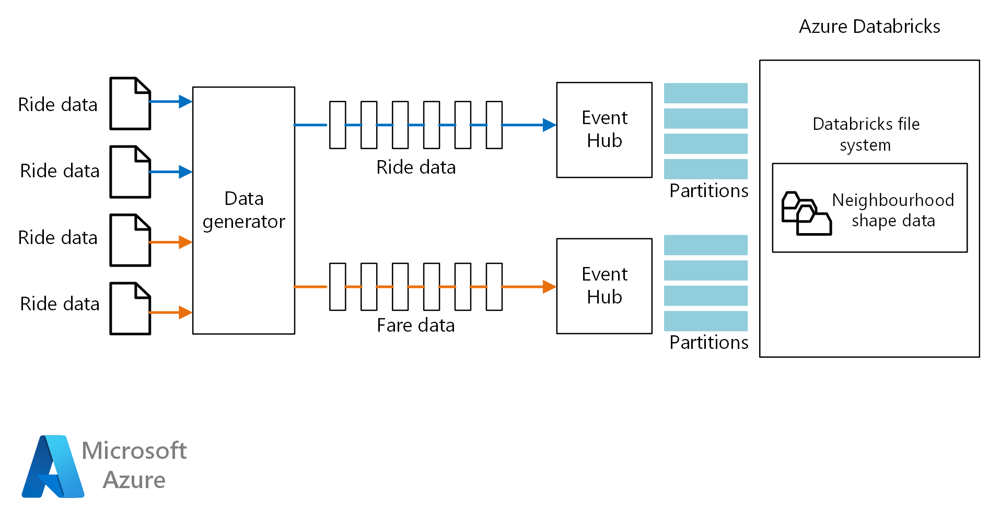

<!-- cSpell:ignore eventhubs shapefile Appender malformedrides malformedfares Dropwizard dropoff taxijob durationms timechart startofday endofday DBUs DBCU -->

This reference architecture shows an end-to-end [stream processing](../../data-guide/big-data/real-time-processing.yml) pipeline. This type of pipeline has four stages: ingest, process, store, and analysis and reporting. For this reference architecture, the pipeline ingests data from two sources, performs a join on related records from each stream, enriches the result, and calculates an average in real time. The results are stored for further analysis.

 A reference implementation for this architecture is available on [GitHub][github].

## Architecture

:::image type="content" source="./images/stream-processing-databricks-new.png" alt-text="[Diagram showing a reference architecture for stream processing with Azure Databricks." border="false" lightbox="./images/stream-processing-databricks-new.png" :::

*Download a [Visio file](https://arch-center.azureedge.net/stream-processing-databricks.vsdx)* of this architecture.

### Workflow

The architecture consists of the following components:

**Data sources**. In this architecture, there are two data sources that generate data streams in real time. The first stream contains ride information, and the second contains fare information. The reference architecture includes a simulated data generator that reads from a set of static files and pushes the data to Event Hubs. The data sources in a real application would be devices installed in the taxi cabs.

**Azure Event Hubs**. [Event Hubs](/azure/event-hubs) is an event ingestion service. This architecture uses two event hub instances, one for each data source. Each data source sends a stream of data to the associated event hub.

**Azure Databricks**. [Databricks](/azure/azure-databricks) is an Apache Spark-based analytics platform optimized for the Microsoft Azure cloud services platform. Databricks is used to correlate of the taxi ride and fare data, and also to enrich the correlated data with neighborhood data stored in the Databricks file system.

**Azure Cosmos DB**. The output of an Azure Databricks job is a series of records, which are written to [Azure Cosmos DB for Apache Cassandra](/azure/cosmos-db). Azure Cosmos DB for Apache Cassandra is used because it supports time series data modeling.

- [Azure Synapse Link for Azure Cosmos DB](/azure/cosmos-db/synapse-link) enables you to run near real-time analytics over operational data in Azure Cosmos DB, **without any performance or cost impact on your transactional workload**, by using the two analytics engines available from your Azure Synapse workspace: [SQL Serverless](/azure/synapse-analytics/sql/on-demand-workspace-overview) and [Spark Pools](/azure/synapse-analytics/spark/apache-spark-overview).

**Azure Log Analytics**. Application log data collected by [Azure Monitor](/azure/monitoring-and-diagnostics) is stored in a [Log Analytics workspace](/azure/log-analytics). Log Analytics queries can be used to analyze and visualize metrics and inspect log messages to identify issues within the application.

### Alternatives

- [Synapse Link](/azure/cosmos-db/synapse-link) is the Microsoft preferred solution for analytics on top of Azure Cosmos DB data.

## Scenario details

**Scenario**: A taxi company collects data about each taxi trip. For this scenario, we assume there are two separate devices sending data. The taxi has a meter that sends information about each ride &mdash; the duration, distance, and pickup and drop-off locations. A separate device accepts payments from customers and sends data about fares. To spot ridership trends, the taxi company wants to calculate the average tip per mile driven, in real time, for each neighborhood.

### Potential use cases

This solution is optimized for the retail industry.

### Data ingestion

To simulate a data source, this reference architecture uses the [New York City Taxi Data](https://uofi.app.box.com/v/NYCtaxidata/folder/2332218797) dataset<sup>[[1]](#note1)</sup>. This dataset contains data about taxi trips in New York City over a four-year period (2010 &ndash; 2013). It contains two types of record: Ride data and fare data. Ride data includes trip duration, trip distance, and pickup and drop-off location. Fare data includes fare, tax, and tip amounts. Common fields in both record types include medallion number, hack license, and vendor ID. Together these three fields uniquely identify a taxi plus a driver. The data is stored in CSV format.

<span id="note1">[1]</span> Donovan, Brian; Work, Dan (2016): New York City Taxi Trip Data (2010-2013). University of Illinois at Urbana-Champaign. <https://doi.org/10.13012/J8PN93H8>

The data generator is a .NET Core application that reads the records and sends them to Azure Event Hubs. The generator sends ride data in JSON format and fare data in CSV format.

Event Hubs uses [partitions](/azure/event-hubs/event-hubs-features#partitions) to segment the data. Partitions allow a consumer to read each partition in parallel. When you send data to Event Hubs, you can specify the partition key explicitly. Otherwise, records are assigned to partitions in round-robin fashion.

In this scenario, ride data and fare data should end up with the same partition ID for a given taxi cab. This enables Databricks to apply a degree of parallelism when it correlates the two streams. A record in partition *n* of the ride data will match a record in partition *n* of the fare data.



*Download a [Visio file](https://arch-center.azureedge.net/stream-processing-databricks-eh.vsdx)* of this architecture.

In the data generator, the common data model for both record types has a `PartitionKey` property that is the concatenation of `Medallion`, `HackLicense`, and `VendorId`.

```csharp
public abstract class TaxiData
{
    public TaxiData()
    {
    }

    [JsonProperty]
    public long Medallion { get; set; }

    [JsonProperty]
    public long HackLicense { get; set; }

    [JsonProperty]
    public string VendorId { get; set; }

    [JsonProperty]
    public DateTimeOffset PickupTime { get; set; }

    [JsonIgnore]
    public string PartitionKey
    {
        get => $"{Medallion}_{HackLicense}_{VendorId}";
    }
```

This property is used to provide an explicit partition key when sending to Event Hubs:

```csharp
using (var client = pool.GetObject())
{
    return client.Value.SendAsync(new EventData(Encoding.UTF8.GetBytes(
        t.GetData(dataFormat))), t.PartitionKey);
}
```

#### Event Hubs

The throughput capacity of Event Hubs is measured in [throughput units](/azure/event-hubs/event-hubs-scalability#throughput-units). You can autoscale an event hub by enabling [auto-inflate](/azure/event-hubs/event-hubs-auto-inflate), which automatically scales the throughput units based on traffic, up to a configured maximum.

### Stream processing

In Azure Databricks, data processing is performed by a job. The job is assigned to and runs on a cluster. The job can either be custom code written in Java, or a Spark [notebook](https://docs.databricks.com/user-guide/notebooks/index.html).

In this reference architecture, the job is a Java archive with classes written in both Java and Scala. When specifying the Java archive for a Databricks job, the class is specified for execution by the Databricks cluster. Here, the **main** method of the **com.microsoft.pnp.TaxiCabReader** class contains the data processing logic.

#### Reading the stream from the two event hub instances

The data processing logic uses [Spark structured streaming](https://spark.apache.org/docs/2.1.2/structured-streaming-programming-guide.html) to read from the two Azure event hub instances:

```scala
val rideEventHubOptions = EventHubsConf(rideEventHubConnectionString)
      .setConsumerGroup(conf.taxiRideConsumerGroup())
      .setStartingPosition(EventPosition.fromStartOfStream)
    val rideEvents = spark.readStream
      .format("eventhubs")
      .options(rideEventHubOptions.toMap)
      .load

    val fareEventHubOptions = EventHubsConf(fareEventHubConnectionString)
      .setConsumerGroup(conf.taxiFareConsumerGroup())
      .setStartingPosition(EventPosition.fromStartOfStream)
    val fareEvents = spark.readStream
      .format("eventhubs")
      .options(fareEventHubOptions.toMap)
      .load
```

#### Enriching the data with the neighborhood information

The ride data includes the latitude and longitude coordinates of the pick up and drop off locations. While these coordinates are useful, they are not easily consumed for analysis. Therefore, this data is enriched with neighborhood data that is read from a [shapefile](https://en.wikipedia.org/wiki/Shapefile).

The shapefile format is binary and not easily parsed, but the [GeoTools](http://geotools.org) library provides tools for geospatial data that use the shapefile format. This library is used in the **com.microsoft.pnp.GeoFinder** class to determine the neighborhood name based on the pick up and drop off coordinates.

```scala
val neighborhoodFinder = (lon: Double, lat: Double) => {
      NeighborhoodFinder.getNeighborhood(lon, lat).get()
    }
```

#### Joining the ride and fare data

First the ride and fare data is transformed:

```scala
    val rides = transformedRides
      .filter(r => {
        if (r.isNullAt(r.fieldIndex("errorMessage"))) {
          true
        }
        else {
          malformedRides.add(1)
          false
        }
      })
      .select(
        $"ride.*",
        to_neighborhood($"ride.pickupLon", $"ride.pickupLat")
          .as("pickupNeighborhood"),
        to_neighborhood($"ride.dropoffLon", $"ride.dropoffLat")
          .as("dropoffNeighborhood")
      )
      .withWatermark("pickupTime", conf.taxiRideWatermarkInterval())

    val fares = transformedFares
      .filter(r => {
        if (r.isNullAt(r.fieldIndex("errorMessage"))) {
          true
        }
        else {
          malformedFares.add(1)
          false
        }
      })
      .select(
        $"fare.*",
        $"pickupTime"
      )
      .withWatermark("pickupTime", conf.taxiFareWatermarkInterval())
```

And then the ride data is joined with the fare data:

```scala
val mergedTaxiTrip = rides.join(fares, Seq("medallion", "hackLicense", "vendorId", "pickupTime"))
```

#### Processing the data and inserting into Azure Cosmos DB

The average fare amount for each neighborhood is calculated for a given time interval:

```scala
val maxAvgFarePerNeighborhood = mergedTaxiTrip.selectExpr("medallion", "hackLicense", "vendorId", "pickupTime", "rateCode", "storeAndForwardFlag", "dropoffTime", "passengerCount", "tripTimeInSeconds", "tripDistanceInMiles", "pickupLon", "pickupLat", "dropoffLon", "dropoffLat", "paymentType", "fareAmount", "surcharge", "mtaTax", "tipAmount", "tollsAmount", "totalAmount", "pickupNeighborhood", "dropoffNeighborhood")
      .groupBy(window($"pickupTime", conf.windowInterval()), $"pickupNeighborhood")
      .agg(
        count("*").as("rideCount"),
        sum($"fareAmount").as("totalFareAmount"),
        sum($"tipAmount").as("totalTipAmount"),
        (sum($"fareAmount")/count("*")).as("averageFareAmount"),
        (sum($"tipAmount")/count("*")).as("averageTipAmount")
      )
      .select($"window.start", $"window.end", $"pickupNeighborhood", $"rideCount", $"totalFareAmount", $"totalTipAmount", $"averageFareAmount", $"averageTipAmount")
```

Which is then inserted into Azure Cosmos DB:

```scala
maxAvgFarePerNeighborhood
      .writeStream
      .queryName("maxAvgFarePerNeighborhood_cassandra_insert")
      .outputMode(OutputMode.Append())
      .foreach(new CassandraSinkForeach(connector))
      .start()
      .awaitTermination()
```

## Considerations

These considerations implement the pillars of the Azure Well-Architected Framework, which is a set of guiding tenets that can be used to improve the quality of a workload. For more information, see [Microsoft Azure Well-Architected Framework](/azure/architecture/framework).

### Security

Security provides assurances against deliberate attacks and the abuse of your valuable data and systems. For more information, see [Overview of the security pillar](/azure/architecture/framework/security/overview).

Access to the Azure Databricks workspace is controlled using the [administrator console](https://docs.databricks.com/administration-guide/admin-settings/index.html). The administrator console includes functionality to add users, manage user permissions, and set up single sign-on. Access control for workspaces, clusters, jobs, and tables can also be set through the administrator console.

#### Managing secrets

Azure Databricks includes a [secret store](/azure/databricks/security/secrets/) that is used to store secrets, including connection strings, access keys, user names, and passwords. Secrets within the Azure Databricks secret store are partitioned by **scopes**:

```bash
databricks secrets create-scope --scope "azure-databricks-job"
```

Secrets are added at the scope level:

```bash
databricks secrets put --scope "azure-databricks-job" --key "taxi-ride"
```

> [!NOTE]
> An Azure Key Vault-backed scope can be used instead of the native Azure Databricks scope. To learn more, see [Azure Key Vault-backed scopes](/azure/databricks/security/secrets/secret-scopes).

In code, secrets are accessed via the Azure Databricks [secrets utilities](https://docs.databricks.com/user-guide/dev-tools/dbutils.html#secrets-utilities).

### Monitoring

Azure Databricks is based on Apache Spark, and both use [log4j](https://logging.apache.org/log4j/2.x) as the standard library for logging. In addition to the default logging provided by Apache Spark, you can implement logging to Azure Log Analytics following the article [Monitoring Azure Databricks](../../databricks-monitoring/index.md).

As the **com.microsoft.pnp.TaxiCabReader** class processes ride and fare messages, it's possible that either one may be malformed and therefore not valid. In a production environment, it's important to analyze these malformed messages to identify a problem with the data sources so it can be fixed quickly to prevent data loss. The **com.microsoft.pnp.TaxiCabReader** class registers an Apache Spark Accumulator that keeps track of the number of malformed fare and ride records:

```scala
    @transient val appMetrics = new AppMetrics(spark.sparkContext)
    appMetrics.registerGauge("metrics.malformedrides", AppAccumulators.getRideInstance(spark.sparkContext))
    appMetrics.registerGauge("metrics.malformedfares", AppAccumulators.getFareInstance(spark.sparkContext))
    SparkEnv.get.metricsSystem.registerSource(appMetrics)
```

Apache Spark uses the Dropwizard library to send metrics, and some of the native Dropwizard metrics fields are incompatible with Azure Log Analytics. Therefore, this reference architecture includes a custom Dropwizard sink and reporter. It formats the metrics in the format expected by Azure Log Analytics. When Apache Spark reports metrics, the custom metrics for the malformed ride and fare data are also sent.

The following are example queries that you can use in your Azure Log Analytics workspace to monitor the execution of the streaming job. The argument `ago(1d)` in each query will return all records that were generated in the last day, and can be adjusted to view a different time period.

#### Exceptions logged during stream query execution

```kusto
SparkLoggingEvent_CL
| where TimeGenerated > ago(1d)
| where Level == "ERROR"
```

#### Accumulation of malformed fare and ride data

```kusto
SparkMetric_CL
| where TimeGenerated > ago(1d)
| where name_s contains "metrics.malformedrides"
| project value_d, TimeGenerated, applicationId_s
| render timechart

SparkMetric_CL
| where TimeGenerated > ago(1d)
| where name_s contains "metrics.malformedfares"
| project value_d, TimeGenerated, applicationId_s
| render timechart
```

#### Job execution over time

```kusto
SparkMetric_CL
| where TimeGenerated > ago(1d)
| where name_s contains "driver.DAGScheduler.job.allJobs"
| project value_d, TimeGenerated, applicationId_s
| render timechart
```

For more information, see [Monitoring Azure Databricks](../../databricks-monitoring/index.md).

### DevOps

- Create separate resource groups for production, development, and test environments. Separate resource groups make it easier to manage deployments, delete test deployments, and assign access rights.

- Use [Azure Resource Manager template][arm-template] to deploy the Azure resources following the infrastructure as Code (IaC) Process. With templates, automating deployments using [Azure DevOps Services][az-devops], or other CI/CD solutions is easier.

- Put each workload in a separate deployment template and store the resources in source control systems. You can deploy the templates together or individually as part of a CI/CD process, making the automation process easier.

  In this architecture, Azure Event Hubs, Log Analytics, and Azure Cosmos DB are identified as a single workload. These resources are included in a single ARM template.

- Consider staging your workloads. Deploy to various stages and run validation checks at each stage before moving to the next stage. That way you can push updates to your production environments in a highly controlled way and minimize unanticipated deployment issues.

  In this architecture there are multiple deployment stages. Consider creating an Azure DevOps Pipeline and adding those stages. Here are some examples of stages that you can automate:

  - Start a Databricks Cluster
  - Configure Databricks CLI
  - Install Scala Tools
  - Add the Databricks secrets

  Also, consider writing automated integration tests to improve the quality and the reliability of the Databricks code and its life cycle.

- Consider using [Azure Monitor][azure-monitor] to analyze the performance of your stream processing pipeline. For more information, see [Monitoring Azure Databricks][databricks-monitoring].

For more information, see the DevOps section in [Microsoft Azure Well-Architected Framework][AAF-devops].

### Cost optimization

Cost optimization is about looking at ways to reduce unnecessary expenses and improve operational efficiencies. For more information, see [Overview of the cost optimization pillar](/azure/architecture/framework/cost/overview).

Use the [Azure pricing calculator][azure-pricing-calculator] to estimate costs. Here are some considerations for services used in this reference architecture.

<!-- markdownlint-disable MD024 -->

#### Event Hubs

This reference architecture deploys Event Hubs in the **Standard** tier. The pricing model is based on throughput units, ingress events, and capture events. An ingress event is a unit of data 64 KB or less. Larger messages are billed in multiples of 64 KB. You specify throughput units either through the Azure portal or Event Hubs management APIs.

If you need more retention days, consider the **Dedicated** tier. This tier offers single-tenant deployments with most demanding requirements. This offering builds a cluster based on capacity units (CU) that is not bound by throughput units.

The **Standard** tier is also billed based on ingress events and throughput units.

For information about Event Hubs pricing, see the [Event Hubs pricing][event-hubs-pricing].

#### Azure Databricks

Azure Databricks offers two tiers **Standard** and  **Premium** each supports three workloads. This reference architecture deploys Azure Databricks workspace in the **Premium** tier.

**Data Engineering** and **Data Engineering Light** workloads are for data engineers to build and execute jobs. The **Data Analytics** workload is intended for data scientists to explore, visualize, manipulate, and share data and insights interactively.

Azure Databricks offers many pricing models.

- Pay-as-you-go plan

  You are billed for virtual machines (VMs) provisioned in clusters and Databricks Units (DBUs) based on the VM instance selected. A DBU is a unit of processing capability, billed on a per-second usage. The DBU consumption depends on the size and type of instance running Azure Databricks. Pricing will depend on the selected workload and tier.

- Pre-purchase plan

  You commit to Azure Databricks Units (DBU) as Databricks Commit Units (DBCU) for either one or three years. When compared to the pay-as-you-go model, you can save up to 37%.

For more information, see [Azure Databricks Pricing][azure-databricks-pricing].

#### Azure Cosmos DB

In this architecture, a series of records are written to Azure Cosmos DB by the Azure Databricks job. You are charged for the capacity that you reserve, expressed in Request Units per second (RU/s), used to perform insert operations. The unit for billing is 100 RU/sec per hour. For example, the cost of writing 100-KB items is 50 RU/s.

For write operations, provision enough capacity to support the number of writes needed per second. You can increase the provisioned throughput by using the portal or Azure CLI before performing write operations and then reduce the throughput after those operations are complete. Your throughput for the write period is the minimum throughput needed for the given data plus the throughput required for the insert operation assuming no other workload is running.

##### Example cost analysis

Suppose you configure a throughput value of 1,000 RU/sec on a container. It's deployed for 24 hours for 30 days, a total of 720 hours.

The container is billed at 10 units of 100 RU/sec per hour for each hour. 10 units at $0.008 (per 100 RU/sec per hour) are charged $0.08 per hour.

For 720 hours or 7,200 units (of 100 RUs), you are billed $57.60 for the month.

Storage is also billed, for each GB used for your stored data and index. For more information, see [Azure Cosmos DB pricing model][cosmosdb-pricing].

Use the [Azure Cosmos DB capacity calculator][Cosmos-Calculator] to get a quick estimate of the workload cost.

For more information, see the cost section in [Microsoft Azure Well-Architected Framework][aaf-cost].

## Deploy this scenario

To the deploy and run the reference implementation, follow the steps in the [GitHub readme][github].

## Next steps

- [Stream processing with Azure Stream Analytics](./stream-processing-stream-analytics.yml)
- [Demand Forecasting](../../solution-ideas/articles/demand-forecasting.yml)
- [Real Time Analytics on Big Data Architecture](../../solution-ideas/articles/real-time-analytics.yml)

<!-- links -->

[AAF-devops]: /azure/architecture/framework/devops/overview
[arm-template]: /azure/azure-resource-manager/resource-group-overview#resource-groups
[az-devops]: /azure/virtual-machines/windows/infrastructure-automation#azure-devops-services
[azure-monitor]: https://azure.microsoft.com/services/monitor
[databricks-monitoring]: ../../databricks-monitoring/index.md
[aaf-cost]: /azure/architecture/framework/cost/overview
[Cosmos-Calculator]: https://cosmos.azure.com/capacitycalculator
[cosmosdb-pricing]: https://azure.microsoft.com/pricing/details/cosmos-db
[azure-pricing-calculator]: https://azure.microsoft.com/pricing/calculator
[event-hubs-pricing]: https://azure.microsoft.com/pricing/details/event-hubs
[github]: https://github.com/mspnp/azure-databricks-streaming-analytics
[azure-databricks-pricing]: https://azure.microsoft.com/pricing/details/databricks
