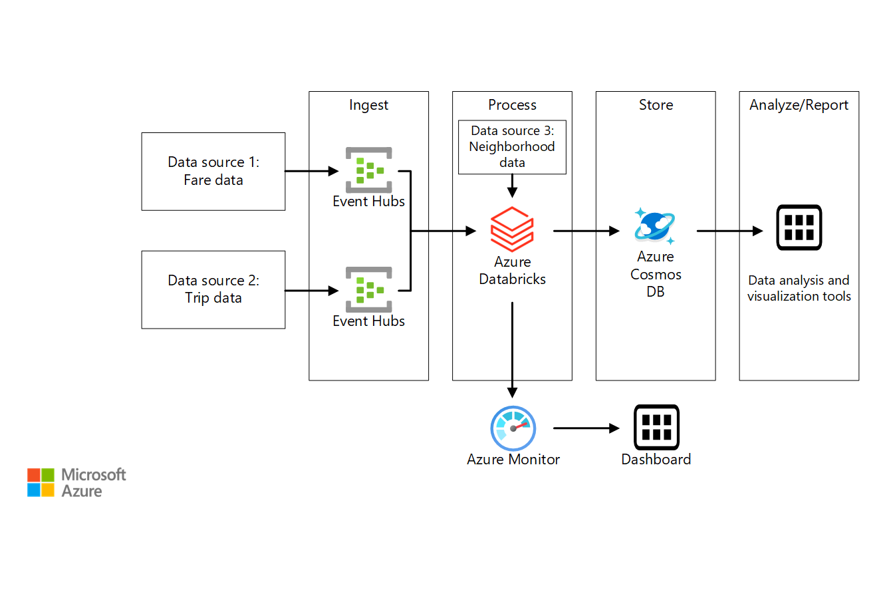

# Stream processing with Azure Databricks

This reference architecture shows an end-to-end stream processing pipeline. The pipeline ingests data from two sources, correlates records in the two streams, and enriches the correlated record with data from external sources. The results are stored for further analysis. [**Deploy this solution**.](#deploy-the-solution)



**Scenario**: A taxi company collects data about each taxi trip. For this scenario, we assume there are two separate devices sending data. The taxi has a meter that sends information about each ride &mdash; the duration, distance, and pickup and dropoff locations. A separate device accepts payments from customers and sends data about fares. The taxi company wants to calculate the average tip per mile driven, in real time, in order to spot trends.

## Architecture

The architecture consists of the following components.

**Data sources**. In this architecture, there are two data sources that generate data streams in real time. The first stream contains ride information, and the second contains fare information. The reference architecture includes a simulated data generator that reads from a set of static files and pushes the data to Event Hubs. In a real application, the data sources would be devices installed in the taxi cabs.

**Azure Event Hubs**. [Event Hubs](/azure/event-hubs/) is an event ingestion service. This architecture uses two event hub instances, one for each data source. Each data source sends a stream of data to the associated event hub.

**Azure Databricks**. [Databricks](/azure/azure-databricks/) is an Apache Spark-based analytics platform optimized for the Microsoft Azure cloud services platform. Databricks is used to correlate of the taxi ride and fare data, and also to enrich the correlated data with neighborhood data stored in a file.

**Cosmos DB**. The output from Azure Databricks job is a series of records, which are written to Cosmos DB using the Cassandra API. The Cassandra API is used because it support time series data modeling.

**Microsoft Power BI**. Power BI is a suite of business analytics tools to analyze data for business insights. In this architecture, it loads the data from Cosmos DB. This allows users to analyze the complete set of historical data that's been collected.  You could also stream the results directly from Stream Analytics to Power BI for a real-time view of the data. For more information, see [Real-time streaming in Power BI](/power-bi/service-real-time-streaming).

**Azure Monitor**. [Azure Monitor](/azure/monitoring-and-diagnostics/) collects performance metrics about the Azure services deployed in the solution. By visualizing these in a dashboard, you can get insights into the health of the solution. 

## Data ingestion

To simulate a data source, this reference architecture uses the [New York City Taxi Data](https://uofi.app.box.com/v/NYCtaxidata/folder/2332218797) dataset<sup>[[1]](#note1)</sup>. This dataset contains data about taxi trips in New York City over a 4-year period (2010 &ndash; 2013). It contains two types of record: Ride data and fare data. Ride data includes trip duration, trip distance, and pickup and dropoff location. Fare data includes fare, tax, and tip amounts. Common fields in both record types include medallion number, hack license, and vendor ID. Together these three fields uniquely identify a taxi plus a driver. The data is stored in CSV format. 

The data generator is a .NET Core application that reads the records and sends them to Azure Event Hubs. The generator sends ride data in JSON format and fare data in CSV format. 

Event Hubs uses [partitions](/azure/event-hubs/event-hubs-features#partitions) to segment the data. Partitions allow a consumer to read each partition in parallel. When you send data to Event Hubs, you can specify the partition key explicitly. Otherwise, records are assigned to partitions in round-robin fashion. 

In this particular scenario, ride data and fare data should end up with the same partition ID for a given taxi cab. This enables Databricks to apply a degree of parallelism when it correlates the two streams. A record in partition *n* of the ride data will match a record in partition *n* of the fare data.


In the data generator, the common data model for both record types has a `PartitionKey` property which is the concatenation of `Medallion`, `HackLicense`, and `VendorId`.

```csharp
public abstract class TaxiData
{
    public TaxiData()
    {
    }

    [JsonProperty]
    public long Medallion { get; set; }

    [JsonProperty]
    public long HackLicense { get; set; }

    [JsonProperty]
    public string VendorId { get; set; }

    [JsonProperty]
    public DateTimeOffset PickupTime { get; set; }

    [JsonIgnore]
    public string PartitionKey
    {
        get => $"{Medallion}_{HackLicense}_{VendorId}";
    }
```

This property is used to provide an explicit partition key when sending to Event Hubs:

```csharp
using (var client = pool.GetObject())
{
    return client.Value.SendAsync(new EventData(Encoding.UTF8.GetBytes(
        t.GetData(dataFormat))), t.PartitionKey);
}
```

### Event Hubs

The throughput capacity of Event Hubs is measured in [throughput units](/azure/event-hubs/event-hubs-features#throughput-units). You can autoscale an event hub by enabling [auto-inflate](/azure/event-hubs/event-hubs-auto-inflate), which automatically scales the throughput units based on traffic, up to a configured maximum. 

### Databricks

Data stream processing is performed by user code deployed to a Databricks cluster. The fare data from the New York Taxi data set includes latitude and longitude coordinates for where the fare was picked up and dropped off. The user code correlates these coordinates with neighborhood data from Zillow's neighborhood boundaries for the state of New York in a process known as **enriching** the data. Several averages are calculated based on the enriched data, which is then pushed to Cosmos DB using the Cassandra API. 

### Cosmos DB

Throughput capacity for Cosmos DB is measured in [Request Units](/azure/cosmos-db/request-units) (RU). In order to scale a Cosmos DB container past 10,000 RU, you must specify a [partition key](/azure/cosmos-db/partition-data) when you create the container, and include the partition key in every document. 

In this reference architecture, new documents are created only once per minute (the hopping window interval), so the throughput requirements are quite low. For that reason, there's no need to assign a partition key in this scenario.

## Deploy the solution

A deployment for this reference architecture is available on [GitHub](https://github.com/mspnp/reference-architectures/tree/master/data). 

### Prerequisites

1. Clone, fork, or download the zip file for the [reference architectures](https://github.com/mspnp/reference-architectures) GitHub repository.

2. Install [Docker](https://www.docker.com/) to run the data generator.

3. Install [Azure CLI 2.0](/cli/azure/install-azure-cli?view=azure-cli-latest).

4. From a command prompt, bash prompt, or PowerShell prompt, sign into your Azure account as follows:

    ```
    az login
    ```
5. Install a Jave IDE, with the following resources:
    - JDK 1.8
    - Scala SDK 2.11
    - Maven 3.5.4

### Download the source data files

1. Create a directory named `DataFile` under the `data/streaming_azuredatabricks` directory in the GitHub repo.

2. Open a web browser and navigate to https://uofi.app.box.com/v/NYCtaxidata/folder/2332219935.

3. Click the **Download** button on this page to download a zip file of all the taxi data for that year.

4. Extract the zip file to the `DataFile` directory.

    > [!NOTE]
    > This zip file contains other zip files. Don't extract the child zip files.

The directory structure should look like the following:

```
/data
    /streaming_azuredatabricks
        /DataFile
            /FOIL2013
                trip_data_1.zip
                trip_data_2.zip
                trip_data_3.zip
                ...
```

### Deploy the Azure resources

1. From a shell or Windows Command Prompt, run the following command and follow the sign-in prompt:

    ```bash
    az login
    ```

2. Navigate to the folder `data/streaming_azuredatabricks` in the GitHub repository

    ```bash
    cd data/streaming_azuredatabricks
    ```

3. Run the following commands to deploy the Azure resources:

    ```bash
    export resourceGroup='[Resource group name]'
    export resourceLocation='[Location]'
    export databricksWorkspaceName='[Databricks Workspace Name]'
    export cosmosDatabaseAccount='[Cosmos DB account name]'
    export eventHubNamespace='[Event Hubs namespace name]'

    # Create a resource group
    az group create --name $resourceGroup --location $resourceLocation

    # Deploy resources
    az group deployment create --resource-group $resourceGroup \
      --template-file ./azure/deployresources.json --parameters \
      eventHubNamespace=$eventHubNamespace \
      databricksWorkspaceName=$databricksWorkspaceName 
      outputCosmosDatabaseAccount=$cosmosDatabaseAccount
    ```

### Add the Zillow Neighborhoods data file to the Databricks file system

1. Configure the Databricks CLI in Azure Cloudshell: 

https://docs.microsoft.com/en-us/azure/azure-databricks/databricks-cli-from-azure-cloud-shell


2. Download the Zillow shape file to Azure Cloudshell:

    ```bash
    curl -o ZillowNeighborhoods-NY.zip https://www.zillowstatic.com/static-neighborhood-boundaries/LATEST/static-neighborhood-boundaries/shp/ZillowNeighborhoods-NY.zip
    ```

3. Generate a personal access token for Databricks:
Follow the steps in the [Azure Databricks authentication documentation](https://docs.azuredatabricks.net/api/latest/authentication.htm) to [generate a token](https://docs.azuredatabricks.net/api/latest/authentication.html#authentication).

4. Configure the Databricks file system in Azure Cloudshell:
    ```bash
    dbfs configure --token
    Databricks Host (should begin with https://): https://westus.azuredatabricks.net/
    Token: <enter token generated in step 3>
    ```
5. Create a folder in the Databricks file system:
    ```bash
    dbfs mkdirs dbfs:/azure-databricks-jobs
    ```
6. Copy the Zillow neighborhood data from step 2:
    ```bash
    dbfs cp ZillowNeighborhoods-NY.zip dbfs:/azure-databricks-jobs
    ```

### Add the Databricks secrets using the Databricks CLI

For this step, you need the following values:

1. The Cosmos DB Cassandra host name. For this value, go back to the resource group from above and click on the `Azure Cosmos DB account`. Then under `Settings`, the host name is in the `CONTACT POINT` field.
2. The `USERNAME` field.
3. The `PRIMARY PASSWORD` field.

1. In Azure Cloud Shell, switch to the Databricks virtual environment you created in step 1 of the `Add the Zillow Neighborhoods data file to the Databricks file system` section above.
2. Enter the following:
    ```
    databricks secrets create-scope --scope "azure-databricks-job"
    ```
3. Enter the following:
    ```
    databricks secrets put --scope azure-databricks-job --key "cassandra-username"
    ```
This opens the vi editor. Enter the `USERNAME` value from the list above. Save and close the editor.
4. Enter the following:
    ```
    databricks secrets put --scope azure-databricks-job --key "cassandra-password"
    ```
This opens the vi editor. Enter the `PRIMARY PASSWORD` value from the list above. Save and close the editor.

### Create a Databricks cluster

1. In the Databricks workspace, click "Clusters", then click "create cluster". Enter a cluster name and click "create cluster".

> [!NOTE]
> "Enable autoscaling" is selected by default. Autoscaling is not necessary for this reference architecture, so you can uncheck this option. The number of workers will then default to `8`, which is the upper limit of the previous autoscaling value. You can set this to `2`, the minimum.

### Build the .jar for the Databricks job

1. Use your Java IDE to build the Maven project file named `pom.xml` located in the root of the `data/streaming_azuredatabricks` directory. The output of this build is a file named `azure-databricks-job-1.0-SNAPSHOT.jar`. This file will be uploaded to Azure Databricks in an upcoming step, so make note of the location of this file.

### Create a Databricks job

1. In the Databricks workspace, click "Jobs", "create job".
2. Enter a job name.
3. Click "set jar", this opens the "Upload JAR to Run" dialog box.
4. Drag the `azure-databricks-job-1.0-SNAPSHOT.jar` file you created in the `Build the .jar for the Databricks job` section to the "Drop JAR here to upload" box.
5. Enter `com.microsoft.pnp.TaxiCabReader` in the `Main Class` field.
6. In the arguments field, enter the following:
    ```
    -n jar:file:/dbfs/ZillowNeighborhoods-NY.zip!/ZillowNeighborhoods-NY.shp --taxi-ride-consumer-group taxi-ride-eh-cg --taxi-fare-consumer-group taxi-fare-eh-cg --window-interval "1 minute" --cassandra-host <Cosmos DB Cassandra host name from above> --cassandra-key-space neighborhoods --cassandra-table-name taxifaredata
    ``` 
7. Install the dependent libraries by following these steps:
    1. In the Databricks workspace, click on "Home", in the `Users` blade, click on your user account name to open your account workspace settings, click on the drop-down arrow beside your account name, click on `create`, and click on `Library` to open the `New Library` dialog. In the `Source` drop-down control, select `Maven Coordinate`. Under the `Install Maven Artifacts` heading, enter `com.microsoft.azure:azure-eventhubs-spark_2.11:2.3.5` in the `Coordinate ` text box. Click on `Create Library`. This will open the `Artifacts` window. Under `Status on running clusters` check the `Attach automatically to all clusters` checkbox.
    2. Repeat step 1 for the `com.datastax.spark:spark-cassandra-connector_2.11:2.3.1` Maven coordinate.
    3. The process is slightly different for the final dependency. On the `New Library` dialog, once again select `Maven Coordinate` from the `Source` drop-down control. In the `Coordinate` text box, enter `org.geotools:gt-shapefile:19.2`. Click on `Advanced Options`, and enter `http://download.osgeo.org/webdav/geotools/` in the `Repository` text box. Click `Create Library`. This will open the `Artifacts` window. Under `Status on running clusters` check the `Attach automatically to all clusters` checkbox.
8. Add the dependent libraries added in step 7 to the job created at the end of step 6. In the Azure Databricks workspace, click on `Jobs`, then click on the job name created in step 2. Click on `Add` beside `Dependent Libraries`. This opens the `Add Dependent Library` dialog. Under `Library From` select `Workspace`. Click on `users`, then your username, then click on `com.microsoft.azure:azure-eventhubs-spark_2.11:2.3.5`. Click `OK`. Repeat this process for `com.datastax.spark:spark-cassandra-connector_2.11:2.3.1` and `org.geotools:gt-shapefile:19.2`.
9. Click on `run now`.

### Run the data generator
1. Get the Event Hub connection strings. You can get these from the Azure portal, or by running the following CLI commands:

    ```bash
    # RIDE_EVENT_HUB
    az eventhubs eventhub authorization-rule keys list \
        --eventhub-name taxi-ride \
        --name taxi-ride-asa-access-policy \
        --namespace-name $eventHubNamespace \
        --resource-group $resourceGroup \
        --query primaryConnectionString

    # FARE_EVENT_HUB
    az eventhubs eventhub authorization-rule keys list \
        --eventhub-name taxi-fare \
        --name taxi-fare-asa-access-policy \
        --namespace-name $eventHubNamespace \
        --resource-group $resourceGroup \
        --query primaryConnectionString
    ```

2. Navigate to the directory `data/streaming_azuredatabricks/onprem` in the GitHub repository

3. Update the values in the file `main.env` as follows:

    ```
    RIDE_EVENT_HUB=[Connection string for taxi-ride event hub]
    FARE_EVENT_HUB=[Connection string for taxi-fare event hub]
    RIDE_DATA_FILE_PATH=/DataFile/FOIL2013
    MINUTES_TO_LEAD=0
    PUSH_RIDE_DATA_FIRST=false
    ```

4. Run the following command to build the Docker image.

    ```bash
    docker build --no-cache -t dataloader .
    ```

5. Navigate back to the parent directory, `data/stream_azuredatabricks`.

    ```bash
    cd ..
    ```

6. Run the following command to run the Docker image.

    ```bash
    docker run -v `pwd`/DataFile:/DataFile --env-file=onprem/main.env dataloader:latest
    ```

The output should look like the following:

```
Created 10000 records for TaxiFare
Created 10000 records for TaxiRide
Created 20000 records for TaxiFare
Created 20000 records for TaxiRide
Created 30000 records for TaxiFare
...
```

Let the program run for at least 5 minutes, which is the window defined in the Stream Analytics query. To verify the Databricks job is running correctly, open the Azure portal and navigate to the Cosmos DB database. Open the **Data Explorer** blade and view the documents. 

[1] <span id="note1">Donovan, Brian; Work, Dan (2016): New York City Taxi Trip Data (2010-2013). University of Illinois at Urbana-Champaign. https://doi.org/10.13012/J8PN93H8
