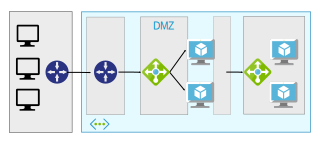

# Network DMZ

These reference architectures show proven practices for creating a network DMZ that protects the boundary between an Azure virtual network and an on-premises network or the Internet.

<ul class="panelContent">
    <li>
        <a href="./secure-vnet-hybrid.md">
            

                

                    

                        

                            

                            
                            

                        

                        

                            <h3>DMZ between Azure and on-premises</h3>
                            
Implements a secure hybrid network that extends an on-premises network to Azure.

                        

                    

                

            

        </a>
    </li>
    <li>
        <a href="./secure-vnet-dmz.md">
            

                

                    

                        

                            

                            
                            

                        

                        

                            <h3>DMZ between Azure and the Internet</h3>
                            
Implements a secure network that accepts Internet traffic to Azure.

                        

                    

                

            

        </a>
    </li>
</ul>

