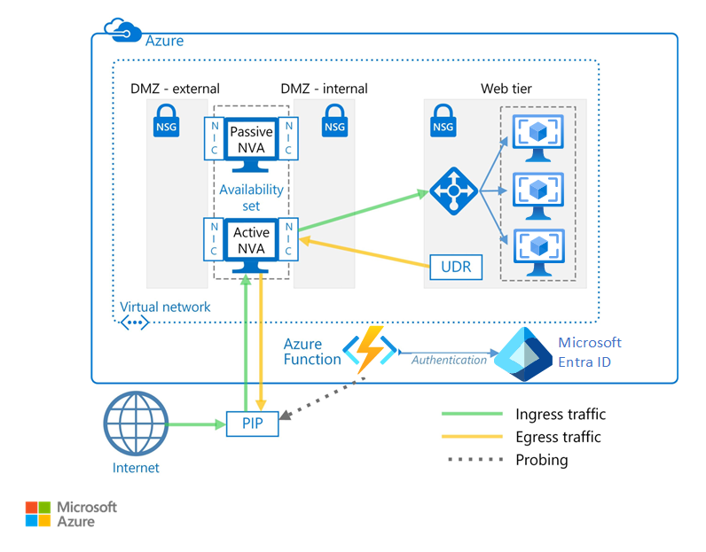

# Deploy highly available network virtual appliances

This article shows how to deploy a set of network virtual appliances (NVAs) for high availability in Azure. An NVA is typically used to control the flow of network traffic from a perimeter network, also known as a DMZ, to other networks or subnets. To learn about implementing a DMZ in Azure, see [Microsoft cloud services and network security][cloud-security]. The article includes example architectures for ingress only, egress only, and both ingress and egress.

**Prerequisites:** This article assumes a basic understanding of Azure networking, [Azure load balancers][lb-overview], and [user-defined routes][udr-overview] (UDRs).

## Architecture diagrams

An NVA can be deployed to a DMZ in many different architectures. For example, the following figure illustrates the use of a [single NVA][nva-scenario] for ingress.

![[0]][0]

In this architecture, the NVA provides a secure network boundary by checking all inbound and outbound network traffic and passing only the traffic that meets network security rules. However, the fact that all network traffic must pass through the NVA means that the NVA is a single point of failure in the network. If the NVA fails, there is no other path for network traffic and all the back-end subnets are unavailable.

To make an NVA highly available, deploy more than one NVA into an availability set.

The following architectures describe the resources and configuration necessary for highly available NVAs:

<!-- markdownlint-disable MD033 -->

| Solution | Benefits | Considerations |
| --- | --- | --- |
| [Ingress with layer 7 NVAs][ingress-with-layer-7] |All NVA nodes are active |Requires an NVA that can terminate connections and use SNAT  Requires a separate set of NVAs for traffic coming from the Internet and from Azure   Can only be used for traffic originating outside Azure |
| [Egress with layer 7 NVAs][egress-with-layer-7] |All NVA nodes are active | Requires an NVA that can terminate connections and implements source network address translation (SNAT)
| [Ingress-Egress with layer 7 NVAs][ingress-egress-with-layer-7] |All nodes are active Able to handle traffic originated in Azure |Requires an NVA that can terminate connections and use SNAT Requires a separate set of NVAs for traffic coming from the Internet and from Azure |
| [PIP-UDR switch][pip-udr-switch] |Single set of NVAs for all traffic Can handle all traffic (no limit on port rules) |Active-passive Requires a failover process |
| [PIP-UDR without SNAT](#pip-udr-nvas-without-snat) | Single set of NVAs for all traffic Can handle all traffic (no limit on port rules) Does not require configuring SNAT for inbound requests |Active-passive Requires a failover process Probing and failover logic run outside the virtual network |

<!-- markdown-enable MD033 -->

## Ingress with layer 7 NVAs

The following figure shows a high availability architecture that implements an ingress DMZ behind an internet-facing load balancer. This architecture is designed to provide connectivity to Azure workloads for layer 7 traffic, such as HTTP or HTTPS:

![[1]][1]

The benefit of this architecture is that all NVAs are active, and if one fails the load balancer directs network traffic to the other NVA. Both NVAs route traffic to the internal load balancer so as long as one NVA is active, traffic continues to flow. The NVAs are required to terminate SSL traffic intended for the web tier VMs. These NVAs cannot be extended to handle on-premises traffic because on-premises traffic requires another dedicated set of NVAs with their own network routes.

## Egress with layer 7 NVAs

The previous architecture can be expanded to provide an egress DMZ for requests originating in the Azure workload. The following architecture is designed to provide high availability of the NVAs in the DMZ for layer 7 traffic, such as HTTP or HTTPS:

![[2]][2]

In this architecture, all traffic originating in Azure is routed to an internal load balancer. The load balancer distributes outgoing requests between a set of NVAs. These NVAs direct traffic to the Internet using their individual public IP addresses.

## Ingress-egress with layer 7 NVAs

In the two previous architectures, there was a separate DMZ for ingress and egress. The following architecture demonstrates how to create a DMZ that can be used for both ingress and egress for layer 7 traffic, such as HTTP or HTTPS:

![[4]][4]

In this architecture, the NVAs process incoming requests from the application gateway. The NVAs also process outgoing requests from the workload VMs in the back-end pool of the load balancer. Because incoming traffic is routed with an application gateway and outgoing traffic is routed with a load balancer, the NVAs are responsible for maintaining session affinity. That is, the application gateway maintains a mapping of inbound and outbound requests so it can forward the correct response to the original requestor. However, the internal load balancer does not have access to the application gateway mappings, and uses its own logic to send responses to the NVAs. It's possible the load balancer could send a response to an NVA that did not initially receive the request from the application gateway. In this case, the NVAs must communicate and transfer the response between them so the correct NVA can forward the response to the application gateway.

> [!NOTE]
> You can also solve the asymmetric routing issue by ensuring the NVAs perform inbound source network address translation (SNAT). This would replace the original source IP of the requestor to one of the IP addresses of the NVA used on the inbound flow. This ensures that you can use multiple NVAs at a time, while preserving the route symmetry.

## PIP-UDR switch with layer 4 NVAs

The following architecture demonstrates an architecture with one active and one passive NVA. This architecture handles both ingress and egress for layer 4 traffic:

![[3]][3]

> [!TIP]
> A complete solution for this architecture is available on [GitHub][pnp-ha-nva].

This architecture is similar to the first architecture discussed in this article. That architecture included a single NVA accepting and filtering incoming layer 4 requests. This architecture adds a second passive NVA to provide high availability. If the active NVA fails, the passive NVA is made active and the UDR and PIP are changed to point to the NICs on the now active NVA. These changes to the UDR and PIP can either be done manually or using an automated process. The automated process is typically daemon or other monitoring service running in Azure. It queries a health probe on the active NVA and performs the UDR and PIP switch when it detects a failure of the NVA.

The preceding figure shows an example [ZooKeeper][zookeeper] cluster providing a high availability daemon. Within the ZooKeeper cluster, a quorum of nodes elects a leader. If the leader fails, the remaining nodes hold an election to elect a new leader. For this architecture, the leader node executes the daemon that queries the health endpoint on the NVA. If the NVA fails to respond to the health probe, the daemon activates the passive NVA. The daemon then calls the Azure REST API to remove the PIP from the failed NVA and attaches it to newly activated NVA. The daemon then modifies the UDR to point to the newly activated NVA's internal IP address.

Do not include the ZooKeeper nodes in a subnet that is only accessible using a route that includes the NVA. Otherwise, the ZooKeeper nodes are inaccessible if the NVA fails. Should the daemon fail for any reason, you won't be able to access any of the ZooKeeper nodes to diagnose the problem.

To see the complete solution including sample code, see the files in the [GitHub repository][pnp-ha-nva].

## PIP-UDR NVAs without SNAT

This architecture uses two Azure virtual machines to host the NVA firewall in an active-passive configuration that supports automated failover but does not require Source Network Address Translation (SNAT).

> [!TIP]
> A complete solution for this architecture is available on [GitHub][ha-nva-fo].

This solution is designed for Azure customers who cannot configure SNAT for inbound requests on their NVA firewalls. SNAT hides the original source client IP address. If you need to log the original IPs or used them within other layered security components behind your NVAs, this solution offers a basic approach.

The failover of UDR table entries is automated by a next-hop address set to the IP address of an interface on the active NVA firewall virtual machine. The automated failover logic is hosted in a function app that you create using [Azure Functions](/azure/azure-functions/). The failover code runs as a serverless function inside Azure Functions. Deployment is convenient, cost-effective, and easy to maintain and customize. In addition, the function app is hosted within Azure Functions, so it has no dependencies on the virtual network. If changes to the virtual network impact the NVA firewalls, the function app continues to run independently. Testing is more accurate as well, because it takes place outside the virtual network using the same route as the inbound client requests.

To check the availability of the NVA firewall, the function app code probes it in one of two ways:

- By monitoring the state of the Azure virtual machines hosting the NVA firewall.

- By testing whether there is an open port through the firewall to the back-end web server. For this option, the NVA must expose a socket via PIP for the function app code to test.

You choose the type of probe you want to use when you configure the function app. To see the complete solution including sample code, see the files in the [GitHub repository][ha-nva-fo].

## Next steps

- Learn how to [implement a DMZ between Azure and your on-premises datacenter][dmz-on-premises] using Azure Firewall.
- [Troubleshoot network virtual appliance issues in Azure](/azure/virtual-network/virtual-network-troubleshoot-nva)

<!-- links -->

[cloud-security]: /azure/best-practices-network-security
[dmz-on-premises]: secure-vnet-dmz.md
[egress-with-layer-7]: #egress-with-layer-7-nvas
[ingress-with-layer-7]: #ingress-with-layer-7-nvas
[ingress-egress-with-layer-7]: #ingress-egress-with-layer-7-nvas
[lb-overview]: /azure/load-balancer/load-balancer-overview/
[nva-scenario]: /azure/virtual-network/virtual-network-scenario-udr-gw-nva/
[pip-udr-switch]: #pip-udr-switch-with-layer-4-nvas
[udr-overview]: /azure/virtual-network/virtual-networks-udr-overview/
[zookeeper]: https://zookeeper.apache.org/
[pnp-ha-nva]: https://github.com/mspnp/ha-nva
[ha-nva-fo]: https://aka.ms/ha-nva-fo

<!-- images -->

[0]: ./images/nva-ha/single-nva.png "Single NVA architecture"
[1]: ./images/nva-ha/l7-ingress.png "Layer 7 ingress"
[2]: ./images/nva-ha/l7-ingress-egress.png "Layer 7 egress"
[3]: ./images/nva-ha/active-passive.png "Active-Passive cluster"
[4]: ./images/nva-ha/l7-ingress-egress-ag.png
