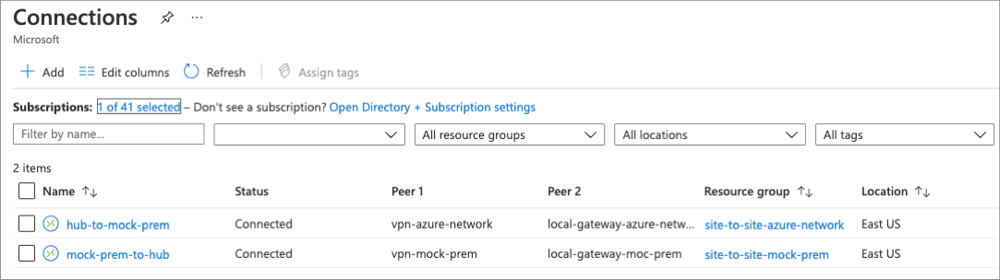

This reference architecture shows a secure hybrid network that extends an on-premises network to Azure. The architecture implements a DMZ, also called a *perimeter network*, between the on-premises network and an Azure virtual network. All inbound and outbound traffic passes through Azure Firewall.

## Architecture

[](./images/dmz-private.png#lightbox)

*Download a [Visio file][visio-download] of this architecture.*

### Workflow

The architecture consists of the following aspects:

- **On-premises network**. A private local-area network implemented in an organization.
- **Azure virtual network**. The virtual network hosts the application and other resources running in Azure.
- **Gateway**. The gateway provides connectivity between the routers in the on-premises network and the virtual network. The gateway is placed in its own subnet.
- **Azure Firewall**. [Azure Firewall](/azure/firewall/) is a managed firewall as a service. The Firewall instance is placed in its own subnet.
- **Virtual network routes**. [Virtual network routes][udr-overview] define the flow of IP traffic within the Azure virtual network. In the diagram shown above, there are two user-defined route tables.

  - In the gateway subnet, traffic sent to the web-tier subnet (10.0.1.0/24) is routed through the Azure Firewall instance.
  - In the web tier subnet, Since there is no route for address space of the VNet itself to point to Azure firewall, web tier instances are able to communicate directly to each other, not via Azure Firewall.

  > [!NOTE]
  > Depending on the requirements of your VPN connection, you can configure Border Gateway Protocol (BGP) routes to implement the forwarding rules that direct traffic back through the on-premises network.

- **Network security groups**. Use [security groups][nsg] to restrict network traffic within the virtual network. For example, in the deployment provided with this reference architecture, the web tier subnet allows TCP traffic from the on-premises network and from within the virtual network; the business tier allows traffic from the web tier, and the data tier allows traffic from the business tier.

- **Bastion**. [Azure Bastion](/azure/bastion/) allows you to log into VMs in the virtual network through SSH or remote desktop protocol (RDP) without exposing the VMs directly to the internet. Use Bastion to manage the VMs in the virtual network.

## Reference deployment

This deployment creates two resource groups; the first holds a mock on-premises network, the second a set of hub and spoke networks. The mock on-premises network and the hub network are connected using Azure Virtual Network gateways to form a site-to-site connection. This configuration is very similar to how you would connect your on-premises datacenter to Azure.

This deployment can take up to 45 minutes to complete. The recommended deployment method is using the portal option found below.

#### [Azure portal](#tab/portal)

Use the following button to deploy the reference using the Azure portal.

[](https://portal.azure.com/#create/Microsoft.Template/uri/https%3A%2F%2Fraw.githubusercontent.com%2Fmspnp%2Fsamples%2Fmaster%2Fsolutions%2Fsecure-hybrid-network%2Fazuredeploy.json)

#### [Azure CLI](#tab/cli)

Run the following command to deploy two resource groups and the secure network reference architecture using the Azure CLI.

When prompted, enter values for an admin user name and password. These values are used to log into the included virtual machines.

```azurecli
az deployment sub create --location eastus \
    --template-uri https://raw.githubusercontent.com/mspnp/samples/master/solutions/secure-hybrid-network/azuredeploy.json
```

#### [PowerShell](#tab/powershell)

Run the following command to deploy two resource groups and the secure network reference architecture using PowerShell.

When prompted, enter values for an admin user name and password. These values are used to log into the included virtual machines.

```azurepowershell
New-AzSubscriptionDeployment -Location eastus `
    -TemplateUri https://raw.githubusercontent.com/mspnp/samples/master/solutions/secure-hybrid-network/azuredeploy.json
```

---

Once the deployment has been completed, verify site-to-site connectivity by looking at the newly created connection resources. While in the Azure portal, search for 'connections' and note that the status of each connection.



The IIS instance found in the spoke network can be accessed from the virtual machine located in the mock on-prem network. Create a connection to the virtual machine using the included Azure Bastion host, open a web browser, and navigate to the address of the application's network load balancer.

For detailed information and additional deployment options, see the ARM Templates used to deploy this solution.

> [!div class="nextstepaction"]
> [Secure Hybrid Network](/samples/mspnp/samples/secure-hybrid-network/)

## Use cases

This architecture requires a connection to your on-premises datacenter, using either a [VPN gateway][ra-vpn] or an [ExpressRoute][ra-expressroute] connection. Typical uses for this architecture include:

- Hybrid applications where workloads run partly on-premises and partly in Azure.
- Infrastructure that requires granular control over traffic entering an Azure virtual network from an on-premises datacenter.
- Applications that must audit outgoing traffic. This is often a regulatory requirement of many commercial systems and can help to prevent public disclosure of private information.

## Recommendations

The following recommendations apply for most scenarios. Follow these recommendations unless you have a specific requirement that overrides them.

### Access control recommendations

Use [Azure role-based access control (Azure RBAC)][rbac] to manage the resources in your application. Consider creating the following [custom roles][rbac-custom-roles]:

- A DevOps role with permissions to administer the infrastructure for the application, deploy the application components, and monitor and restart VMs.

- A centralized IT administrator role to manage and monitor network resources.

- A security IT administrator role to manage secure network resources such as the firewall.

The DevOps and IT administrator roles should not have access to the firewall resources. This should be restricted to the security IT administrator role.

### Resource group recommendations

Azure resources such as VMs, virtual networks, and load balancers can be easily managed by grouping them together into resource groups. Assign Azure roles to each resource group to restrict access.

We recommend creating the following resource groups:

- A resource group containing the virtual network (excluding the VMs), NSGs, and the gateway resources for connecting to the on-premises network. Assign the centralized IT administrator role to this resource group.
- A resource group containing the VMs for the Azure Firewall instance and the user-defined routes for the gateway subnet. Assign the security IT administrator role to this resource group.
- Separate resource groups for each application tier that contain the load balancer and VMs. Note that this resource group shouldn't include the subnets for each tier. Assign the DevOps role to this resource group.

### Networking recommendations

To accept inbound traffic from the internet, add a [Destination Network Address Translation](/azure/firewall/tutorial-firewall-dnat) (DNAT) rule to Azure Firewall.

- Destination address = Public IP address of the firewall instance.
- Translated address = Private IP address within the virtual network.

The example deployment routes internet traffic for port 80 to the web tier load balancer.

[Force-tunnel][azure-forced-tunneling] all outbound internet traffic through your on-premises network using the site-to-site VPN tunnel, and route to the internet using network address translation (NAT). This prevents accidental leakage of any confidential information stored in your data tier and allows inspection and auditing of all outgoing traffic.

Don't completely block internet traffic from the application tiers, as this will prevent these tiers from using Azure PaaS services that rely on public IP addresses, such as VM diagnostics logging, downloading of VM extensions, and other functionality. Azure diagnostics also requires that components can read and write to an Azure Storage account.

Verify that outbound internet traffic is force-tunneled correctly. If you're using a VPN connection with the [routing and remote access service][routing-and-remote-access-service] on an on-premises server, use a tool such as [WireShark][wireshark].

Consider using Application Gateway or Azure Front Door for SSL termination.

## Scalability considerations

For details about the bandwidth limits of VPN Gateway, see [Gateway SKUs](/azure/vpn-gateway/vpn-gateway-about-vpngateways#gwsku). For higher bandwidths, consider upgrading to an ExpressRoute gateway. ExpressRoute provides up to 10 Gbps bandwidth with lower latency than a VPN connection.

For more information about the scalability of Azure gateways, see the scalability consideration section in [Implementing a hybrid network architecture with Azure and on-premises VPN][guidance-vpn-gateway-scalability] and [Implementing a hybrid network architecture with Azure ExpressRoute][guidance-expressroute-scalability].

For details about managing virtual networks and NSGs at scale, see [Azure Virtual Network Manager (AVNM): Create a secured hub and spoke network](/azure/virtual-network-manager/tutorial-create-secured-hub-and-spoke) to create new (and onboard existing) hub and spoke virtual network topologies for central management of connectivity and NSG rules.

## Availability considerations

If you're using Azure ExpressRoute to provide connectivity between the virtual network and on-premises network, [configure a VPN gateway to provide failover][ra-vpn-failover] if the ExpressRoute connection becomes unavailable.

For specific information on maintaining availability for VPN and ExpressRoute connections, see the availability considerations in [Implementing a hybrid network architecture with Azure and on-premises VPN][guidance-vpn-gateway-availability] and [Implementing a hybrid network architecture with Azure ExpressRoute][guidance-expressroute-availability].

## Manageability considerations

If gateway connectivity from your on-premises network to Azure is down, you can still reach the VMs in the Azure virtual network through Azure Bastion.

Each tier's subnet in the reference architecture is protected by NSG rules. You may need to create a rule to open port 3389 for remote desktop protocol (RDP) access on Windows VMs or port 22 for secure shell (SSH) access on Linux VMs. Other management and monitoring tools may require rules to open additional ports.

If you're using ExpressRoute to provide the connectivity between your on-premises datacenter and Azure, use the [Azure Connectivity Toolkit (AzureCT)][azurect] to monitor and troubleshoot connection issues.

You can find additional information about monitoring and managing VPN and ExpressRoute connections in the article [Implementing a hybrid network architecture with Azure and on-premises VPN][guidance-vpn-gateway-devops].

## Security considerations

This reference architecture implements multiple levels of security.

### Routing all on-premises user requests through Azure Firewall

The user-defined route in the gateway subnet blocks all user requests other than those received from on-premises. The route passes allowed requests to the firewall, and these requests are passed on to the application if they are allowed by the firewall rules. You can add other routes, but make sure they don't inadvertently bypass the firewall or block administrative traffic intended for the management subnet.

### Using NSGs to block/pass traffic between application tiers

Traffic between tiers is restricted by using NSGs. The business tier blocks all traffic that doesn't originate in the web tier, and the data tier blocks all traffic that doesn't originate in the business tier. If you have a requirement to expand the NSG rules to allow broader access to these tiers, weigh these requirements against the security risks. Each new inbound pathway represents an opportunity for accidental or purposeful data leakage or application damage.

### Use AVNM to create baseline Security Admin rules

AVNM allows you to create baselines of security rules, which can take priority over network security group rules. [Security admin rules](/azure/virtual-network-manager/concept-security-admins) are evaluated before NSG rules and have the same nature of NSGs, with support for prioritization, service tags, and L3-L4 protocols. This will allow central IT to enforce a baseline of security rules, while allowing an independency of additional NSG rules by the spoke vnet owners. To facilitate a controlled rollout of security rules changes, AVNM's [deployments](/azure/virtual-network-manager/concept-deployments) feature allows you to safely release of these configurations' breaking changes to the hub-and-spoke environments.

### DevOps access

Use [Azure RBAC][rbac] to restrict the operations that DevOps can perform on each tier. When granting permissions, use the [principle of least privilege][security-principle-of-least-privilege]. Log all administrative operations and perform regular audits to ensure any configuration changes were planned.

## Cost optimization

Use the [Azure pricing calculator][azure-pricing-calculator] to estimate costs. Other considerations are described in the Cost optimization section in [Microsoft Azure Well-Architected Framework][aaf-cost].

Here are cost considerations for the services used in this architecture.

### Azure Firewall

In this architecture, Azure Firewall is deployed in the virtual network to control traffic between the gateway's subnet and the subnet in which the application tier runs. In this way Azure Firewall is cost effective because it's used as a shared solution consumed by multiple workloads. Here are the Azure Firewall pricing models:

- Fixed rate per deployment hour.
- Data processed per GB to support auto scaling.

When compared to network virtual appliances (NVAs), with Azure Firewall you can save up to 30-50%. For more information see [Azure Firewall vs NVA][Firewall-NVA].

### Azure Bastion

Azure Bastion securely connects to your virtual machine over RDP and SSH without having the need to configure a public IP on the virtual machine.

Bastion billing is comparable to a basic, low-level virtual machine configured as a jumpbox. Comparing Bastion to a jump box, Bastion is more cost effective considering Bastion's built-in security features and no extra costs incurred for storage and managing a separate server.

### Azure Virtual Network

Azure Virtual Network is free. Every subscription is allowed to create up to 50 virtual networks across all regions. All traffic that occurs within the boundaries of a virtual network is free. So if two VMs that are in the same VNET are talking each other then no charges will occur.

### Internal load balancer

Basic load balancing between virtual machines that reside in the same virtual network is free.

In this architecture, internal load balancers are used to load balance traffic inside a virtual network.

## Next steps

- For more information about managing network security with Azure, see [Microsoft cloud services and network security][cloud-services-network-security].
- For detailed information about protecting resources in Azure, see [Getting started with Microsoft Azure security][getting-started-with-azure-security].

## Related resources

- Learn how to implement a [highly available hybrid network architecture][ra-vpn-failover].
- - For more information about securing Azure gateway connections, see [Implementing a hybrid network architecture with Azure and on-premises VPN][guidance-vpn-gateway-security] and [Implementing a hybrid network architecture with Azure ExpressRoute][guidance-expressroute-security].

<!-- links -->

[aaf-cost]: /azure/architecture/framework/cost/overview
[azure-forced-tunneling]: /azure/vpn-gateway/vpn-gateway-forced-tunneling-rm
[azurect]: https://github.com/Azure/NetworkMonitoring/tree/master/AzureCT
[cloud-services-network-security]: /azure/best-practices-network-security
[azure-pricing-calculator]: https://azure.microsoft.com/pricing/calculator
[Firewall-NVA]: https://azure.microsoft.com/blog/azure-firewall-and-network-virtual-appliances
[getting-started-with-azure-security]: /azure/security/azure-security-getting-started
[guidance-expressroute-availability]: ../hybrid-networking/expressroute.yml#availability
[guidance-expressroute-scalability]: ../hybrid-networking/expressroute.yml#scalability
[guidance-expressroute-security]: ../hybrid-networking/expressroute.yml#security
[guidance-vpn-gateway-availability]: ../hybrid-networking/vpn.yml#availability-considerations
[guidance-vpn-gateway-devops]: ../hybrid-networking/vpn.yml#devops-considerations
[guidance-vpn-gateway-scalability]: ../hybrid-networking/vpn.yml#scalability-considerations
[guidance-vpn-gateway-security]: ../hybrid-networking/vpn.yml#security-considerations
[nsg]: /azure/virtual-network/security-overview
[ra-expressroute]: ../hybrid-networking/expressroute.yml
[ra-vpn-failover]: ../hybrid-networking/expressroute-vpn-failover.yml
[ra-vpn]: ../hybrid-networking/vpn.yml
[rbac-custom-roles]: /azure/role-based-access-control/custom-roles
[rbac]: /azure/role-based-access-control/role-assignments-portal
[routing-and-remote-access-service]: /previous-versions/windows/it-pro/windows-server-2008-R2-and-2008/dd469790(v=ws.11)
[security-principle-of-least-privilege]: /dotnet/framework/data/adonet/security-overview#Anchor_1
[udr-overview]: /azure/virtual-network/virtual-networks-udr-overview
[visio-download]: https://arch-center.azureedge.net/dmz-reference-architectures.vsdx
[wireshark]: https://www.wireshark.org
