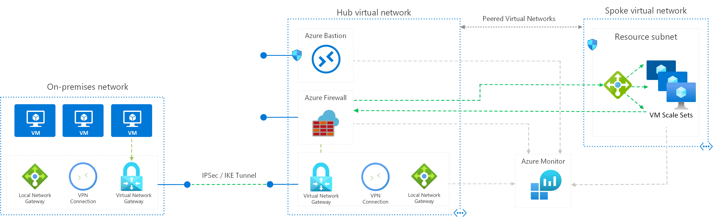
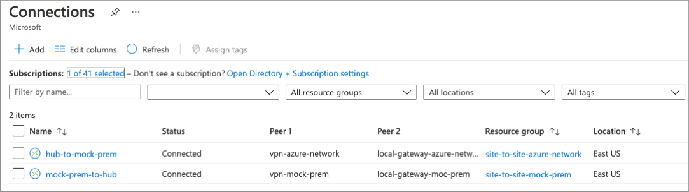

This reference architecture shows a secure hybrid network that extends an on-premises network to Azure. The architecture implements a *perimeter network*, also called a *DMZ*, between the on-premises network and an Azure virtual network. All inbound and outbound traffic passes through Azure Firewall. 

## Architecture

[](./images/dmz-private.png#lightbox)

*Download a [Visio file][visio-download] of this architecture.*

### Components

The architecture consists of the following aspects:

- **On-premises network**. A private local-area network implemented in an organization.
- **Azure virtual network**. The virtual network hosts the solution components and other resources running in Azure.

    [Virtual network routes][udr-overview] define the flow of IP traffic within the Azure virtual network. In the diagram, there are two user-defined route tables.

    In the gateway subnet, traffic is routed through the Azure Firewall instance.

    > [!NOTE]
    > Depending on the requirements of your VPN connection, you can configure Border Gateway Protocol (BGP) routes to implement the forwarding rules that direct traffic back through the on-premises network.

- **Gateway**. The gateway provides connectivity between the routers in the on-premises network and the virtual network. The gateway is placed in its own subnet.
- **Azure Firewall**. [Azure Firewall](/azure/well-architected/service-guides/azure-firewall) is a managed firewall as a service. The Firewall instance is placed in its own subnet.

- **Network security groups**. Use [security groups][nsg] to restrict network traffic within the virtual network. 

- **Virtual machine scale sets**. [Virtual Machine Scale Sets](/azure/virtual-machine-scale-sets/overview) provide the compute tier in the spoke virtual networks. Scale sets deploy and manage a group of identical VMs behind the internal load balancer, and they support autoscaling to match demand.

- **Azure Bastion**. [Azure Bastion](/azure/bastion/) provides secure SSH and RDP access to virtual machine scale set instances without exposing them to the internet. Use Bastion to manage the instances in the virtual network.

    Bastion [requires a dedicated subnet named **AzureBastionSubnet**](/azure/bastion/configuration-settings#subnet).

## Potential use cases

This architecture requires a connection to your on-premises datacenter, using either a [VPN gateway][ra-vpn-failover] or an ExpressRoute connection. Typical uses for this architecture include:

- Hybrid applications where workloads run partly on-premises and partly in Azure.
- Infrastructure that requires granular control over traffic entering an Azure virtual network from an on-premises datacenter.
- Applications that must audit outgoing traffic. Auditing is often a regulatory requirement of many commercial systems and can help to prevent public disclosure of private information.

## Recommendations

The following recommendations apply for most scenarios. Follow these recommendations unless you have a specific requirement that overrides them.

### Access control recommendations

Use [Azure role-based access control (Azure RBAC)][rbac] to manage the resources in your application. Consider creating the following [custom roles][rbac-custom-roles]:

- A DevOps role with permissions to administer the infrastructure for the application, deploy the application components, and manage virtual machine scale set operations such as scaling, reimaging, and upgrades.

- A centralized IT administrator role to manage and monitor network resources.

- A security IT administrator role to manage secure network resources such as the firewall.

The IT administrator role shouldn't have access to the firewall resources. Access should be restricted to the security IT administrator role.

### Resource group recommendations

Azure resources such as virtual machine scale sets, virtual networks, and load balancers can be managed by grouping them together into resource groups. Assign Azure roles to each resource group to restrict access.

We recommend creating the following resource groups:

- A resource group containing the virtual network (excluding the compute resources), NSGs, and the gateway resources for connecting to the on-premises network. Assign the centralized IT administrator role to this resource group.
- A resource group containing the resources for the Azure Firewall instance and the user-defined routes for the gateway subnet. Assign the security IT administrator role to this resource group.
- Separate resource groups for each spoke virtual network that contains the load balancer and virtual machine scale sets.

### Networking recommendations

In this architecture, all inbound and outbound traffic between the on-premises network, the internet, and the spoke virtual networks passes through Azure Firewall. Every flow that crosses the perimeter undergoes network address translation at the firewall, so the firewall's IP addresses, not the workload's, are what external systems and on-premises systems observe. Plan for the following behavior:

- **Published workloads are reachable at the firewall's public IP address, not at the workload's IP address.** You publish a backend with a [destination network address translation (DNAT)](/azure/firewall/tutorial-firewall-dnat) rule on the firewall. The destination address is the firewall's public IP address; the translated address is a private IP address within the virtual network.

- **Outbound flows leave the perimeter sourced from one of the firewall's public IP addresses.** Azure Firewall randomly selects which attached public IP to use for each outbound flow, so partner allowlists, on-premises firewall rules, and audit logs need to cover the entire set of IP addresses attached to the firewall. Use a [public IP address prefix](/azure/virtual-network/ip-services/public-ip-address-prefix) to express that set as a contiguous range.

  The number of public IP addresses attached to the firewall also determines how many concurrent outbound connections can be sustained before source network address translation (SNAT) ports are exhausted.

- **Backends don't see the original client's IP address.** Azure Firewall also applies SNAT on packets that match a DNAT rule so return traffic flows back through the same firewall instance. The backend observes the firewall instance's IP address as the source.

  If your application requires the client's IP address, terminate the client connection upstream in a reverse proxy such as Azure Application Gateway or Azure Front Door, forward the client's IP address in the `X-Forwarded-For` HTTP header, and follow [Preserve the original HTTP host name](/azure/architecture/best-practices/host-name-preservation) so the backend continues to observe the client's host name.

[Force-tunnel][azure-forced-tunneling] all outbound internet traffic through your on-premises network using the site-to-site VPN tunnel. The on-premises edge device performs SNAT to the internet on behalf of the Azure workloads, which routes outbound flows through your existing on-premises egress controls and audit pipeline. This design prevents accidental leakage of any confidential information and allows inspection and auditing of all outgoing traffic.

Don't completely block internet traffic from the resources in the spoke network subnets. Blocking traffic will prevent these resources from using Azure PaaS services that rely on public IP addresses, such as diagnostics logging, provisioning virtual machine extensions and their dependencies, and other platform functionality. Azure diagnostics also requires that components can read and write to an Azure Storage account.

Verify that outbound internet traffic is force-tunneled correctly. If you're using a VPN connection with the [routing and remote access service][routing-and-remote-access-service] on an on-premises server, use a tool such as [WireShark][wireshark].

Consider using Application Gateway or Azure Front Door for SSL termination.

## Considerations

These considerations implement the pillars of the Azure Well-Architected Framework, which is a set of guiding tenets that can be used to improve the quality of a workload. For more information, see [Microsoft Azure Well-Architected Framework](/azure/well-architected/).

### Reliability

Reliability ensures your application can meet the commitments you make to your customers. For more information, see [Design review checklist for Reliability](/azure/well-architected/reliability/checklist).

If you're using Azure ExpressRoute to provide connectivity between the virtual network and on-premises network, [configure a VPN gateway to provide failover][ra-vpn-failover] if the ExpressRoute connection becomes unavailable.

For information on maintaining availability for VPN and ExpressRoute connections, see the availability considerations in:

- [Implementing a hybrid network architecture with Azure and on-premises VPN][guidance-vpn-gateway-availability]
- [Implementing a hybrid network architecture with Azure ExpressRoute][guidance-expressroute-availability]

### Security

Security provides assurances against deliberate attacks and the abuse of your valuable data and systems. For more information, see [Design review checklist for Security](/azure/well-architected/security/checklist).

This reference architecture implements multiple levels of security.

#### Routing all on-premises user requests through Azure Firewall

The user-defined route in the gateway subnet blocks all user requests other than those received from on-premises. The route passes allowed requests to the firewall. The requests are passed on to the resources in the spoke virtual networks if they're allowed by the firewall rules. You can add other routes, but make sure they don't inadvertently bypass the firewall or block administrative traffic intended for the management subnet.

#### Using NSGs to block/pass traffic to spoke virtual network subnets

Traffic to and from resource subnets in spoke virtual networks is restricted by using NSGs. If you have a requirement to expand the NSG rules to allow broader access to these resources, weigh these requirements against the security risks. Each new inbound pathway represents an opportunity for accidental or purposeful data leakage or application damage.

#### DDoS protection

[Azure DDoS Protection](/azure/ddos-protection/ddos-protection-overview), combined with application-design best practices, provides enhanced mitigation against DDoS attacks. Enable Azure DDoS Protection on any perimeter virtual network.

#### Use AVNM to create baseline Security Admin rules

AVNM allows you to create baselines of security rules, which can take priority over network security group rules. [Security admin rules](/azure/virtual-network-manager/concept-security-admins) are evaluated before NSG rules and have the same nature of NSGs, with support for prioritization, service tags, and L3-L4 protocols. AVNM allows central IT to enforce a baseline of security rules, while allowing an independency of additional NSG rules by the spoke virtual network owners. To facilitate a controlled rollout of security rules changes, AVNM's [deployments](/azure/virtual-network-manager/concept-deployments) feature allows you to safely release of these configurations' breaking changes to the hub-and-spoke environments.

#### DevOps access

Use [Azure RBAC][rbac] to restrict the operations that DevOps can perform on each tier. When granting permissions, use the [principle of least privilege][security-principle-of-least-privilege]. Log all administrative operations and perform regular audits to ensure any configuration changes were planned.

### Cost Optimization

Cost Optimization is about looking at ways to reduce unnecessary expenses and improve operational efficiencies. For more information, see [Design review checklist for Cost Optimization](/azure/well-architected/cost-optimization/checklist).

Use this [Azure pricing estimate](https://azure.com/e/7e0622150a1e41ddbcf70b6e3ebf5ff4) as a starting point to estimate the costs for your scenario. It includes the networking components described in this article with example VMs.

Here are cost considerations for the services used in this architecture.

#### Azure Firewall

In this architecture, Azure Firewall is deployed in the virtual network to control traffic between the gateway's subnet and the resources in the spoke virtual networks. Using Azure Firewall as a shared solution across multiple workloads can help reduce duplicate infrastructure. Here are the Azure Firewall pricing models:

- Fixed rate per deployment hour.
- Data processed per GB to support auto scaling.

When compared to network virtual appliances (NVAs), with Azure Firewall you can save up to 30-50%. For more information, see [Azure Firewall vs NVA][Firewall-NVA].

#### Azure Bastion

Azure Bastion securely connects to virtual machine scale set instances over RDP and SSH without requiring a public IP on the instances.

Bastion billing is comparable to a basic, low-level virtual machine configured as a jump box. Bastion is more cost effective than a jump box as it has built-in security features, and doesn't incur extra costs for storage and managing a separate server.

#### Azure Virtual Network

Azure Virtual Network is free. Every subscription is allowed to create up to 1,000 virtual networks across all regions. All traffic that occurs within the boundaries of a virtual network is free. For example, traffic from the internal load balancer to the virtual machine scale set instances doesn't incur network traffic charges.

#### Internal load balancer

In this architecture, internal load balancers are used to distribute traffic to the virtual machine scale set instances inside a virtual network. Standard Load Balancer is required for use with virtual machine scale sets.

### Operational Excellence

Operational Excellence covers the operations processes that deploy an application and keep it running in production. For more information, see [Design review checklist for Operational Excellence](/azure/well-architected/operational-excellence/checklist).

If gateway connectivity from your on-premises network to Azure is down, you can still use Azure Bastion to access resources in the Azure virtual network for troubleshooting. Because virtual machine scale set instances are ephemeral, rely on centralized logging and monitoring through [Azure Monitor](/azure/azure-monitor/vm/vminsights-overview) and [boot diagnostics](/azure/virtual-machines/boot-diagnostics) rather than interactive remote sessions for routine operations.

Each tier's subnet in the reference architecture is protected by NSG rules. Management and monitoring tools might require rules to open additional ports.

If you're using ExpressRoute to provide the connectivity between your on-premises datacenter and Azure, use the [Azure Connectivity Toolkit (AzureCT)][azurect] to monitor and troubleshoot connection issues.

You can find additional information about monitoring and managing VPN and ExpressRoute connections in the article [Implementing a hybrid network architecture with Azure and on-premises VPN][guidance-vpn-gateway-devops].

### Performance Efficiency

Performance Efficiency is the ability of your workload to scale to meet the demands placed on it by users in an efficient manner. For more information, see [Design review checklist for Performance Efficiency](/azure/well-architected/performance-efficiency/checklist).

Virtual machine scale sets in the spoke networks support autoscaling. Configure [autoscale rules](/azure/virtual-machine-scale-sets/virtual-machine-scale-sets-autoscale-overview) based on metrics such as CPU usage or request count so that instances are added or removed in response to demand. Choose an [orchestration mode and upgrade policy](/azure/virtual-machine-scale-sets/virtual-machine-scale-sets-upgrade-policy) that matches your workload's tolerance for disruption during updates.

For more information about the bandwidth limits of VPN Gateway, see [Gateway SKUs](/azure/vpn-gateway/vpn-gateway-about-vpngateways#gwsku). For higher bandwidths, consider upgrading to an ExpressRoute gateway. ExpressRoute provides up to 10-Gbps bandwidth with lower latency than a VPN connection.

For more information about the scalability of Azure gateways, see the scalability consideration sections in:
- [Implementing a hybrid network architecture with Azure and on-premises VPN][guidance-vpn-gateway-scalability] 
- [Implementing a hybrid network architecture with Azure ExpressRoute][guidance-expressroute-scalability]

For more information about managing virtual networks and NSGs at scale, see [Azure Virtual Network Manager (AVNM): Create a secured hub and spoke network](/azure/virtual-network-manager/tutorial-create-secured-hub-and-spoke) to create new (and onboard existing) hub and spoke virtual network topologies for central management of connectivity and NSG rules.

## Deploy this scenario

This deployment creates two resource groups; the first holds a mock on-premises network, the second a set of hub and spoke networks. The mock on-premises network and the hub network are connected using Azure Virtual Network gateways to form a site-to-site connection. This configuration is very similar to how you would connect your on-premises datacenter to Azure.

This deployment can take up to 45 minutes to complete. The recommended deployment method is using the following portal option.

#### [Azure portal](#tab/portal)

Use the following button to deploy the reference using the Azure portal.

[](https://portal.azure.com/#create/Microsoft.Template/uri/https%3A%2F%2Fraw.githubusercontent.com%2Fmspnp%2Fsamples%2Fmain%2Fsolutions%2Fsecure-hybrid-network%2Fazuredeploy.json)

> [!NOTE]
> The portal deployment only deploys the base infrastructure. After the site-to-site connection is established, you still need to add the firewall DNAT rules using the Azure CLI or PowerShell as described in [Add firewall DNAT rules](#add-firewall-dnat-rules).

#### [Azure CLI](#tab/cli)

Run the following command to deploy two resource groups and the secure network reference architecture using the Azure CLI.

When prompted, enter values for an admin user name, password, and a VPN shared key. The admin credentials are used as the default credentials for the virtual machine scale set instances. The shared key authenticates the site-to-site VPN connection between the gateways.

```azurecli
az deployment sub create --location eastus \
    --template-uri https://raw.githubusercontent.com/mspnp/samples/main/solutions/secure-hybrid-network/azuredeploy.bicep
```

#### [PowerShell](#tab/powershell)

Run the following command to deploy two resource groups and the secure network reference architecture using PowerShell.

When prompted, enter values for an admin user name, password, and a VPN shared key. The admin credentials are used as the default credentials for the virtual machine scale set instances. The shared key authenticates the site-to-site VPN connection between the gateways.

```azurepowershell
New-AzSubscriptionDeployment -Location eastus `
    -TemplateUri https://raw.githubusercontent.com/mspnp/samples/main/solutions/secure-hybrid-network/azuredeploy.bicep
```

---

After the deployment finishes, verify site-to-site connectivity by looking at the newly created connection resources. In the Azure portal, search for *connections* and check the status of each connection.



### Add firewall DNAT rules

After the site-to-site connection status shows **Connected**, update the hub firewall with DNAT rules so on-premises traffic can reach the spoke workloads.

#### [Azure CLI](#tab/cli2)

```azurecli
FW_IP=$(az network firewall show -g rg-site-to-site-azure-network-eastus2 -n AzureFirewall --query "ipConfigurations[0].privateIPAddress" -o tsv)
LB_IP=$(az network lb frontend-ip list -g rg-site-to-site-azure-network-eastus2 --lb-name lb-internal --query "[0].privateIPAddress" -o tsv)

az deployment group create -n firewallDnat -g rg-site-to-site-azure-network-eastus2 \
    --template-uri https://raw.githubusercontent.com/mspnp/samples/main/solutions/secure-hybrid-network/nestedtemplates/azure-network-azuredeploy-v2.bicep \
    -p firewallName=AzureFirewall firewallPrivateIp=$FW_IP internalLoadBalancerPrivateIp=$LB_IP
```

#### [PowerShell](#tab/powershell2)

```azurepowershell
$fwIp = (Get-AzFirewall -ResourceGroupName rg-site-to-site-azure-network-eastus2 -Name AzureFirewall).IpConfigurations[0].PrivateIPAddress
$lbIp = (Get-AzLoadBalancerFrontendIpConfig -LoadBalancer (Get-AzLoadBalancer -ResourceGroupName rg-site-to-site-azure-network-eastus2 -Name lb-internal))[0].PrivateIpAddress

New-AzResourceGroupDeployment -Name firewallDnat -ResourceGroupName rg-site-to-site-azure-network-eastus2 `
    -TemplateUri https://raw.githubusercontent.com/mspnp/samples/main/solutions/secure-hybrid-network/nestedtemplates/azure-network-azuredeploy-v2.bicep `
    -firewallName AzureFirewall -firewallPrivateIp $fwIp -internalLoadBalancerPrivateIp $lbIp
```

---

The IIS instance found in the spoke network can be accessed from the virtual machine located in the mock on-premises network. Create a connection to that virtual machine using the included Azure Bastion host, open a web browser, and navigate to the address of the application's internal load balancer.

For more information and other deployment options, see the Bicep templates used to deploy this solution: [Secure Hybrid Network](/samples/mspnp/samples/secure-hybrid-network/).

## Next steps

- [Hub-spoke network topology in Azure][cloud-services-network-security].
- [Azure security documentation][getting-started-with-azure-security].

## Related resources

- [Connect an on-premises network to Azure using ExpressRoute][ra-vpn-failover].
- [Configure ExpressRoute and Site-to-Site coexisting connections using PowerShell][guidance-vpn-gateway-security]
- [Extend an on-premises network using ExpressRoute][guidance-expressroute-security].

<!-- links -->
[azure-forced-tunneling]: /azure/vpn-gateway/vpn-gateway-forced-tunneling-rm
[azurect]: https://github.com/Azure/NetworkMonitoring/tree/main/AzureCT
[cloud-services-network-security]: /azure/best-practices-network-security
[azure-pricing-calculator]: https://azure.microsoft.com/pricing/calculator
[Firewall-NVA]: https://azure.microsoft.com/blog/azure-firewall-and-network-virtual-appliances
[getting-started-with-azure-security]: /azure/security/azure-security-getting-started
[guidance-expressroute-availability]: ../hybrid-networking/expressroute-vpn-failover.yml#reliability
[guidance-expressroute-scalability]: ../hybrid-networking/expressroute-vpn-failover.yml#performance-efficiency
[guidance-expressroute-security]: ../hybrid-networking/expressroute-vpn-failover.yml#security
[guidance-vpn-gateway-availability]: /azure/expressroute/expressroute-howto-coexist-resource-manager#availability-considerations
[guidance-vpn-gateway-devops]: /azure/expressroute/expressroute-howto-coexist-resource-manager#devops-considerations
[guidance-vpn-gateway-scalability]: /azure/expressroute/expressroute-howto-coexist-resource-manager#scalability-considerations
[guidance-vpn-gateway-security]: /azure/expressroute/expressroute-howto-coexist-resource-manager#security-considerations
[nsg]: /azure/virtual-network/security-overview
[ra-vpn-failover]: ../hybrid-networking/expressroute-vpn-failover.yml
[rbac-custom-roles]: /azure/role-based-access-control/custom-roles
[rbac]: /azure/role-based-access-control/role-assignments-portal
[routing-and-remote-access-service]: /previous-versions/windows/it-pro/windows-server-2008-R2-and-2008/dd469790(v=ws.11)
[security-principle-of-least-privilege]: /dotnet/framework/data/adonet/security-overview#Anchor_1
[udr-overview]: /azure/virtual-network/virtual-networks-udr-overview
[visio-download]: https://arch-center.azureedge.net/dmz-reference-architectures.vsdx
[wireshark]: https://www.wireshark.org
