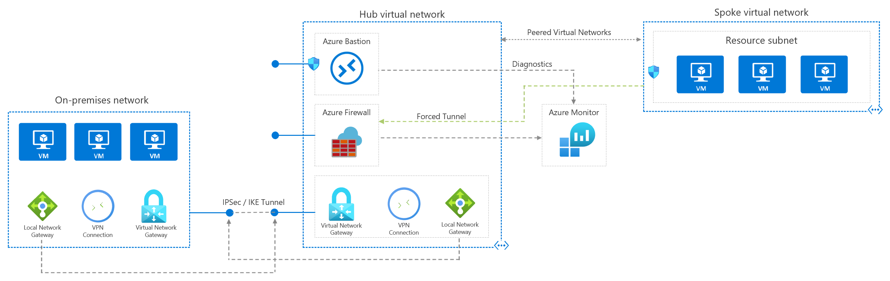
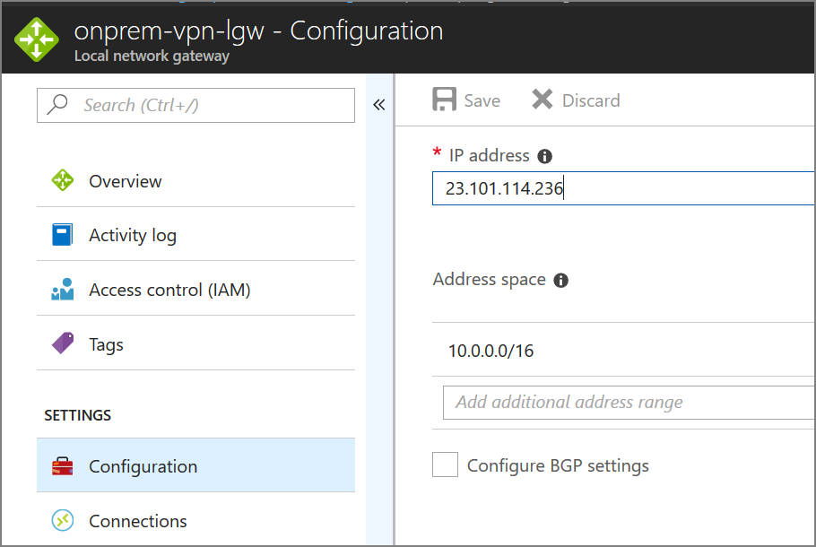

# Network DMZ between Azure and an on-premises datacenter

This reference architecture shows a secure hybrid network that extends an on-premises network to Azure. The architecture implements a DMZ, also called a *perimeter network*, between the on-premises network and an Azure virtual network. All inbound and outbound traffic passes through Azure Firewall. [**Deploy this solution**](#deploy-the-solution).



*Download a [Visio file][visio-download] of this architecture.*

This architecture requires a connection to your on-premises datacenter, using either a [VPN gateway][ra-vpn] or an [ExpressRoute][ra-expressroute] connection. Typical uses for this architecture include:

- Hybrid applications where workloads run partly on-premises and partly in Azure.
- Infrastructure that requires granular control over traffic entering an Azure virtual network from an on-premises datacenter.
- Applications that must audit outgoing traffic. This is often a regulatory requirement of many commercial systems and can help to prevent public disclosure of private information.

## Architecture

The architecture consists of the following components.

- **On-premises network**. A private local-area network implemented in an organization.
- **Azure virtual network**. The virtual network hosts the application and other resources running in Azure.
- **Gateway**. The gateway provides connectivity between the routers in the on-premises network and the virtual network. The gateway is placed in its own subnet.
- **Azure Firewall**. [Azure Firewall](/azure/firewall/) is a managed firewall as a service. The Firewall instance is placed in its own subnet.
- **Virtual network routes**. [Virtual network routes][udr-overview] define the flow of IP traffic within the Azure virtual network. In the diagram shown above, there are two user-defined route tables. 

    - In the gateway subnet, traffic sent to the web-tier subnet (10.0.1.0/24) is routed through the Azure Firewall instance.
    - In the web tier subnet, all traffic (0.0.0.0/0) is sent to the Azure Firewall.

    > [!NOTE]
    > Depending on the requirements of your VPN connection, you can configure Border Gateway Protocol (BGP) routes to implement the forwarding rules that direct traffic back through the on-premises network.
    >

- **Network security groups**. Use [security groups][nsg] to restrict network traffic within the virtual network. For example, in the deployment provided with this reference architecture, the web tier subnet allows TCP traffic from the on-premises network and from within the virtual network; the business tier allows traffic from the web tier; and the data tier allows traffic from the business tier.

- **Jumpbox**. The jumpbox VM implements management and monitoring capabilities for the components running in the virtual network. All remote desktop (RDP) or ssh access to the other VMs go through the jumpbox.

## Recommendations

The following recommendations apply for most scenarios. Follow these recommendations unless you have a specific requirement that overrides them.

### Access control recommendations

Use [role-based access control][rbac] (RBAC) to manage the resources in your application. Consider creating the following [custom roles][rbac-custom-roles]:

- A DevOps role with permissions to administer the infrastructure for the application, deploy the application components, and monitor and restart VMs.

- A centralized IT administrator role to manage and monitor network resources.

- A security IT administrator role to manage secure network resources such as the firewall.

The DevOps and IT administrator roles should not have access to the firewall resources. This should be restricted to the security IT administrator role.

### Resource group recommendations

Azure resources such as VMs, virtual networks, and load balancers can be easily managed by grouping them together into resource groups. Assign RBAC roles to each resource group to restrict access.

We recommend creating the following resource groups:

- A resource group containing the virtual network (excluding the VMs), NSGs, and the gateway resources for connecting to the on-premises network. Assign the centralized IT administrator role to this resource group.
- A resource group containing the VMs for the Azure Firewall instance, the jumpbox and other management VMs, and the user-defined routes for the gateway subnet. Assign the security IT administrator role to this resource group.
- Separate resource groups for each application tier that contain the load balancer and VMs. Note that this resource group shouldn't include the subnets for each tier. Assign the DevOps role to this resource group.

### Networking recommendations

To accept inbound traffic from the internet, add a [Destination Network Address Translation](/azure/firewall/tutorial-firewall-dnat) (DNAT) rule to Azure Firewall. 

- Destination address = Public IP address of the firewall instance
- Translated address = Private IP address within the virtual network.

The example deployment routes internet traffic for port 80 to the web tier load balancer.

[Force-tunnel][azure-forced-tunneling] all outbound internet traffic through your on-premises network using the site-to-site VPN tunnel, and route to the internet using network address translation (NAT). This prevents accidental leakage of any confidential information stored in your data tier and allows inspection and auditing of all outgoing traffic.

Don't completely block internet traffic from the application tiers, as this will prevent these tiers from using Azure PaaS services that rely on public IP addresses, such as VM diagnostics logging, downloading of VM extensions, and other functionality. Azure diagnostics also requires that components can read and write to an Azure Storage account.

Verify that outbound internet traffic is force-tunneled correctly. If you're using a VPN connection with the [routing and remote access service][routing-and-remote-access-service] on an on-premises server, use a tool such as [WireShark][wireshark].

Consider using Application Gateway or Azure Front Door for SSL termination.

### Management subnet recommendations

The management subnet contains a jumpbox that performs management and monitoring functionality. Restrict execution of all secure management tasks to the jumpbox.

Do not create a public IP address for the jumpbox. Instead, create one route to access the jumpbox through the incoming gateway. Create NSG rules so the management subnet only responds to requests from the allowed route.

## Scalability considerations

For details about the bandwidth limits of VPN Gateway, see [Gateway SKUs](/azure/vpn-gateway/vpn-gateway-about-vpngateways#gwsku). For higher bandwidths, consider upgrading to an ExpressRoute gateway. ExpressRoute provides up to 10 Gbps bandwidth with lower latency than a VPN connection.

For more information about the scalability of Azure gateways, see the scalability consideration section in [Implementing a hybrid network architecture with Azure and on-premises VPN][guidance-vpn-gateway-scalability] and [Implementing a hybrid network architecture with Azure ExpressRoute][guidance-expressroute-scalability].

## Availability considerations

If you're using Azure ExpressRoute to provide connectivity between the virtual network and on-premises network, [configure a VPN gateway to provide failover][ra-vpn-failover] if the ExpressRoute connection becomes unavailable.

For specific information on maintaining availability for VPN and ExpressRoute connections, see the availability considerations in [Implementing a hybrid network architecture with Azure and on-premises VPN][guidance-vpn-gateway-availability] and [Implementing a hybrid network architecture with Azure ExpressRoute][guidance-expressroute-availability].

## Manageability considerations

All application and resource monitoring should be performed by the jumpbox in the management subnet. Depending on your application requirements, you may need additional monitoring resources in the management subnet. If so, these resources should be accessed through the jumpbox.

If gateway connectivity from your on-premises network to Azure is down, you can still reach the jumpbox by deploying a public IP address, adding it to the jumpbox, and remoting in from the internet.

Each tier's subnet in the reference architecture is protected by NSG rules. You may need to create a rule to open port 3389 for remote desktop protocol (RDP) access on Windows VMs or port 22 for secure shell (SSH) access on Linux VMs. Other management and monitoring tools may require rules to open additional ports.

If you're using ExpressRoute to provide the connectivity between your on-premises datacenter and Azure, use the [Azure Connectivity Toolkit (AzureCT)][azurect] to monitor and troubleshoot connection issues.

You can find additional information about monitoring and managing VPN and ExpressRoute connections in the articles [Implementing a hybrid network architecture with Azure and on-premises VPN][guidance-vpn-gateway-manageability] and [Implementing a hybrid network architecture with Azure ExpressRoute][guidance-expressroute-manageability].

## Security considerations

This reference architecture implements multiple levels of security.

### Routing all on-premises user requests through Azure Firewall

The user-defined route in the gateway subnet blocks all user requests other than those received from on-premises. The route passes allowed requests to the firewall, and these requests are passed on to the application if they are allowed by the firewall rules. You can add other routes, but make sure they don't inadvertently bypass the firewall or block administrative traffic intended for the management subnet.

### Using NSGs to block/pass traffic between application tiers

Traffic between tiers is restricted by using NSGs. The business tier blocks all traffic that doesn't originate in the web tier, and the data tier blocks all traffic that doesn't originate in the business tier. If you have a requirement to expand the NSG rules to allow broader access to these tiers, weigh these requirements against the security risks. Each new inbound pathway represents an opportunity for accidental or purposeful data leakage or application damage.

### DevOps access

Use [RBAC][rbac] to restrict the operations that DevOps can perform on each tier. When granting permissions, use the [principle of least privilege][security-principle-of-least-privilege]. Log all administrative operations and perform regular audits to ensure any configuration changes were planned.

## Deploy the solution

A deployment for a reference architecture that implements these recommendations is available on [GitHub][github-folder].

### Prerequisites

[!INCLUDE [ref-arch-prerequisites.md](../../../includes/ref-arch-prerequisites.md)]

### Deploy resources

1. Navigate to the `/dmz/secure-vnet-dmz` folder of the reference architectures GitHub repository.

2. Run the following command:

    ```bash
    azbb -s <subscription_id> -g <resource_group_name> -l <region> -p onprem.json --deploy
    ```

3. Run the following command:

    ```bash
    azbb -s <subscription_id> -g <resource_group_name> -l <region> -p secure-vnet-dmz.json --deploy
    ```

### Connect the on-premises and Azure gateways

In this step, you will connect the two local network gateways.

1. In the Azure portal, navigate to the resource group that you created.

2. Find the resource named `ra-vpn-vgw-pip` and copy the IP address shown in the **Overview** blade.

3. Find the resource named `onprem-vpn-lgw`.

4. Click the **Configuration** blade. Under **IP address**, paste in the IP address from step 2.

    

5. Click **Save** and wait for the operation to complete. It can take about 5 minutes.

6. Find the resource named `onprem-vpn-gateway1-pip`. Copy the IP address shown in the **Overview** blade.

7. Find the resource named `ra-vpn-lgw`.

8. Click the **Configuration** blade. Under **IP address**, paste in the IP address from step 6.

9. Click **Save** and wait for the operation to complete.

10. To verify the connection, go to the **Connections** blade for each gateway. The status should be **Connected**.

### Verify that network traffic reaches the web tier

1. In the Azure portal, navigate to the resource group that you created.

2. Find the resource named `fe-config1-web`, which is the load balancer in front of the private DMZ. Copy the private IP address from the **Overview** blade.

3. Find the VM named `jb-vm1`. Click **Connect** and use Remote Desktop to connect to the VM. The user name and password are specified in the onprem.json file.

4. From the Remote Desktop Session, open a web browser and navigate to the IP address from step 2. You should see the default Apache2 server home page.

## Next steps

- Learn how to implement a [highly available hybrid network architecture][ra-vpn-failover].
- For more information about managing network security with Azure, see [Microsoft cloud services and network security][cloud-services-network-security].
- For detailed information about protecting resources in Azure, see [Getting started with Microsoft Azure security][getting-started-with-azure-security].
- For more information about securing Azure gateway connections, see [Implementing a hybrid network architecture with Azure and on-premises VPN][guidance-vpn-gateway-security] and [Implementing a hybrid network architecture with Azure ExpressRoute][guidance-expressroute-security].

<!-- links -->

[azure-forced-tunneling]: /azure/vpn-gateway/vpn-gateway-forced-tunneling-rm
[azurect]: https://github.com/Azure/NetworkMonitoring/tree/master/AzureCT
[cloud-services-network-security]: /azure/best-practices-network-security
[getting-started-with-azure-security]: /azure/security/azure-security-getting-started
[github-folder]: https://github.com/mspnp/reference-architectures/tree/master/dmz/secure-vnet-dmz
[guidance-expressroute-availability]: ../hybrid-networking/expressroute.md#availability-considerations
[guidance-expressroute-manageability]: ../hybrid-networking/expressroute.md#manageability-considerations
[guidance-expressroute-scalability]: ../hybrid-networking/expressroute.md#scalability-considerations
[guidance-expressroute-security]: ../hybrid-networking/expressroute.md#security-considerations
[guidance-vpn-gateway-availability]: ../hybrid-networking/vpn.md#availability-considerations
[guidance-vpn-gateway-manageability]: ../hybrid-networking/vpn.md#manageability-considerations
[guidance-vpn-gateway-scalability]: ../hybrid-networking/vpn.md#scalability-considerations
[guidance-vpn-gateway-security]: ../hybrid-networking/vpn.md#security-considerations
[nsg]: /azure/virtual-network/security-overview
[ra-expressroute]: ../hybrid-networking/expressroute.md
[ra-vpn-failover]: ../hybrid-networking/expressroute-vpn-failover.md
[ra-vpn]: ../hybrid-networking/vpn.md
[rbac-custom-roles]: /azure/active-directory/role-based-access-control-custom-roles
[rbac]: /azure/active-directory/role-based-access-control-configure
[routing-and-remote-access-service]: https://technet.microsoft.com/library/dd469790(v=ws.11).aspx
[security-principle-of-least-privilege]: https://msdn.microsoft.com/library/hdb58b2f(v=vs.110).aspx#Anchor_1
[udr-overview]: /azure/virtual-network/virtual-networks-udr-overview
[visio-download]: https://archcenter.blob.core.windows.net/cdn/dmz-reference-architectures.vsdx
[wireshark]: https://www.wireshark.org/
