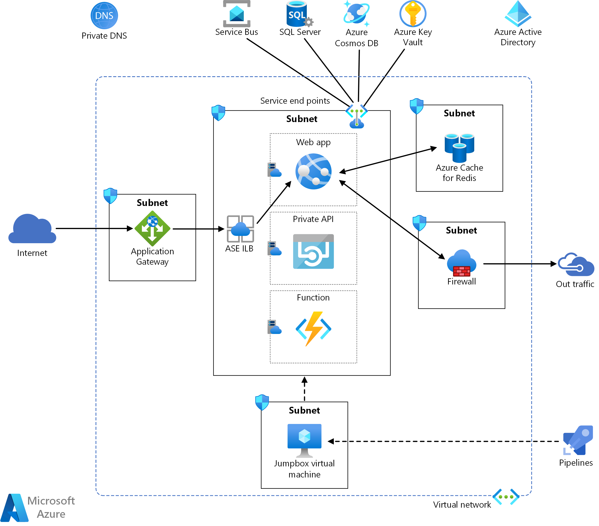
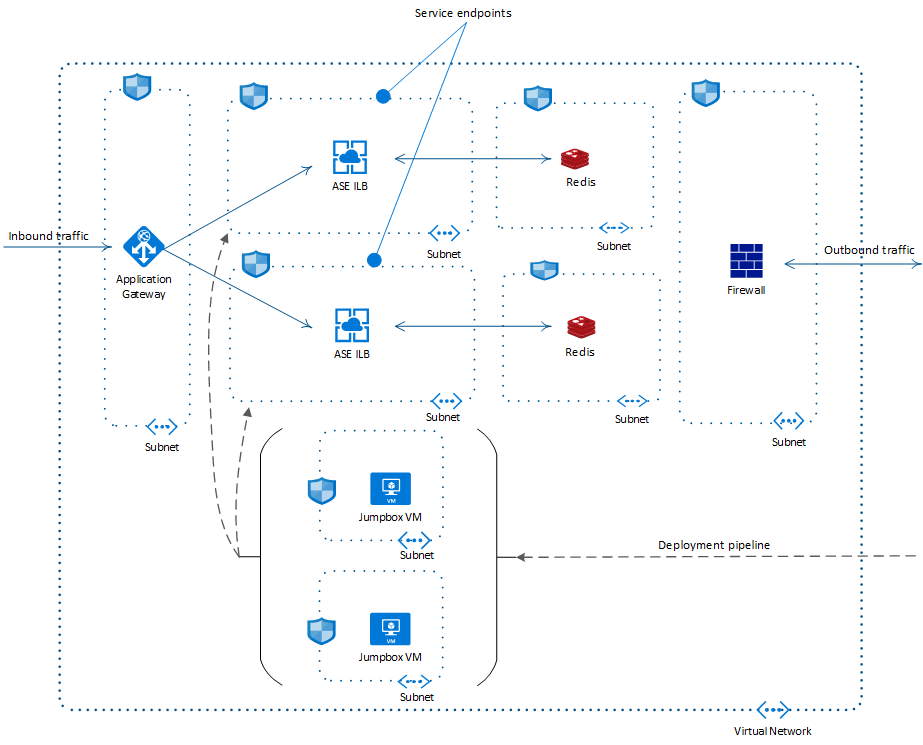

# Enterprise app deployment using App Services Environment

This reference architecture shows an enterprise web application deployment in an App Services Environment or ASE. ASE provides a highly secure, isolated and dedicated environment on the cloud to run a variety of apps, containers, and functions. The ASE is a deployment of these components as App Service plans in a dedicated subnet in a virtual network. These can be accessible to the internet if deployed as an external ASE with a public IP address. Alternatively, enterprises can lock down the ASE subnet by creating an *internal ASE*, with a private IP endpoint. It's also called ASE ILB, as the endpoint acts as an internal load balancer. The ASE used in this reference architecture is the ASE ILB. This article shows the best practices and recommendations to make the internal ASE deployment even more secure, while interacting with other Azure services and the internet.

 A reference implementation for this architecture is available on [GitHub](TBD).

## Architecture

The web app used in this reference implementation is meant to demonstrate common ASE app interactions. It comprises of a web frontend, a web API, and an Azure Function, each created in their own ASE containers or App Service plans. The web app is a simple voting application, with two types of inputs, entries and votes per entry. Users can create new entries and then collect votes for each entry. The app connects with a private web API to create new entries and retrieve existing entries and votes, over the SQL Server database. The web app queues the votes in the Service Bus instance. The function demonstrates asynchronous data updates similar to a backend process, by picking up queued votes and then adding to the SQL database. The web app also retrieves a mock-up ad page on the browser. The web app is the only component accessible to the internet via the App Gateway. Both the web API and the function are private to the ASE subnet.

The web app is accessible via the App Gateway. The app also interacts with Redis cache. Outbound traffic from the app is protected by a Web Application Firewall. Each of these services are in their own subnets within the virtual network. Additionally, a jumpbox VM is deployed in its subnet to allow CI/CD operations with Azure Pipelines. Each of these subnets are protected by *Network security groups*.

The following services show the key deployment pieces in this architecture:

[**App Services Environment**](https://docs.microsoft.com/azure/app-service/environment/intro) with ILB or internal ASE provides a locked down and inherently secure deployment environment for any app, in a dedicated subnet. The ASE subnet can hold multiple **App Services plans**, which are containers for one or more app components. This reference architecture uses three such plans, one for each component of the web application.

[**Virtual Network**](https://docs.microsoft.com/azure/virtual-network/) and subnets form the key infrastructure elements of an ASE deployment. **Network security groups** can be applied to either the virtual network, or individual subnets. This reference architecture applies NSGs to each of the subnet in the VNet to fine-tune the traffic flowing through it. **Service endpoints** lets you extend the virtual network with dedicated endpoints for required services. In addition to the services required by the web application, the ASE infrastructure also requires service endpoints for Event Hubs and Azure Storage for its internal management.

[**Application Gateway**](https://docs.microsoft.com/azure/application-gateway/overview) is the application level web traffic load balancer, configured to route traffic to the ASE ILB. It is configured to use the ASE ILB as the backend. Multiple ILBs for multiple ASE subnets can be used as the backend pool. This reference architecture enables the *Web Application Firewall* in the App Gateway for added security. TBD for multiple apps & domain names, and certs.

[**Azure Firewall**](https://docs.microsoft.com/azure/firewall/overview) is used to secure the outbound traffic from the web application. You can configure it for services that do not allow service endpoints (CHECK). This reference architecture enables the firewall for minimum required ports recommended by ASE, namely, NTP and Azure Monitor.

**Azure Active Directory** or AAD provides access rights and permissions management to Azure resources and services. This reference architecture uses [*Managed Identities*](https://docs.microsoft.com/azure/active-directory/managed-identities-azure-resources/overview) feature of the AAD to control access to the service instance that support it. Wherever possible, use managed identities to avoid storing your credentials in code or even the Key Vault, since that is an additional step.

[**Key Vault**](https://docs.microsoft.com/azure/key-vault/) is used in this architecture to store the credentials for the services that don't support managed identities. Key Vault itself can be accessed through managed identities, providing an additional layer of security. Use this option over storing the secrets directly in the application.

[**Azure Pipelines**](https://docs.microsoft.com/azure/devops/pipelines/) is used in this architecture to provide *Continuous Integration and Continuous Deployment* capabilities to the ASE subnet. The pipelines are configured outside the virtual network, and connected through a **Jumpbox virtual machine**, which is a limited-access and controlled point of interaction within the virtual network. This VM is configured to deploy the release app artifacts into the ASE subnet. TBD, is this VM only for the Devops piece?

## Availability considerations

Multiple ASE subnets can be deployed for multiple availability zones in the same virtual network. Only internal ASEs can be used in multiple zones. Availability zones are specific to a particular region, and ensure your apps are available despite partial failures in that region.

- Zone-pinned ILB ASE ensures uptime for deployed apps, and resources/VMs used by them. However does not guarantee scaling, app creation/deployment, etc. when other zones are out.
- Zonal ILB ASE must be created with an ARM template. After that, can be viewed/modified with CLI or portal. Creation ARM template must have the new zones property, set to 1,2, or 3 based on logical Availability zones.
- For end-to-end zone resiliency, at least 2 zonal ILB ASE are required, each pinned to different zones. Customer's apps must be duplicated on both ASEs.
    - Traffic bound to the apps must be load-balanced. It is recommended to use zone-redundant App Gateway( https://docs.microsoft.com/en-us/azure/application-gateway/application-gateway-autoscaling-zone-redundant ) upstream to the ASEs.
- Same VNet is used for multiple ASE subnets since VNet by default is zone redundant.

This reference implementation demonstrates the steps in [this TBD deployment readme], using two ASEs for two different availability zones. All three web application components are duplicated in the two ASE subnets. Since each app will need to use its own cache, two instances of Redis are deployed per availability zones. Each ASE subnet has its own URL. The inter-app communication within a single ASE is simple. However, more routing strategies may be required (TBD WHICH?) if either one of the six components fails. App Gateway can only detect if the web app is available, whereas only the web app can detect whether the API or the function is available.

## Design considerations

### Application Gateway

The App Gateway rules can be configured either globally or host based. The global configuration is simpler, and better aligned with having the client connect to the App Gateway PIP . The host-based rules are more realistic for an enterprise setup, but require name resolution. For simplicity, this architecture uses a simple global configuration rules. (TBD: is this the right article: https://docs.microsoft.com/azure/application-gateway/how-application-gateway-works).

## Security considerations

### App Service Environment with internal load balancer (or ILB)

An internal ASE deployment is inherently secure and locked down from the outside world, since its a private IP cannot be accessed directly through the internet. It can only be accessed outside through an Application Gateway. The IP address of the internal ASE can be set to the virtual network (CHECK). An internal ASE deployment comes with a default certificate trusted by the browser.

The ASE allows isolated backend apps, such as the private API and the function, that the frontend web app can securely interact with. The ILB is configured to direct the traffic from the App Gateway to the frontend application. (CHECK multiple apps?).

### App Gateway

TBD

#### Traffic encryption

The application gateway supports following SSL encryption levels:

1. Gateway terminated - The encryption stops at the gateway, and unencrypted traffic flows to the backend pool. Use this for improved performance and simpler certificate management. 

1. End to end. This may be required in special circumstances, such high security application accepting only secure connections, compliance requirements, etc. This architecture uses this level of encryption (DOUBLE CHECK) to demonstrate this scenario. The end to end SSL is achieved using a self-signed certificate.

#### Web Application Firewall

A Web application firewall protects the app from common security threats such as SQL injection, as well as provides continuous security management and fixes. When this feature is enabled, the *Web Application Firewall enabled* app gateway secures the ASE components against the incoming internet traffic.

(TBD, add a code snippet from the RI here)

### Firewall

Firewall is used to control the outbound traffic, and currently allows traffic on ports recommended by the ASE documentation. 

Azure services can communicate with the ASE subnet using either service endpoints or the firewall. Most of the services required by the web app in this architecture are accessed over service endpoints (WHY?), namely, Service Bus, Key Vault, SQL Server, and CosmosDB. The traffic from some Azure services using service endpoints needs to be left out of the firewall. Additionally following considerations are required:
    - ASE internally uses SQL Server, Azure Storage and Event Hubs for its own infrastructure management. That traffic must pass through the ASE subnet and not blocked by the firewall. Even if your app environment does not use these services, you still need to create service endpoints for them, and leave out of the firewall.
    - The way CosmosDB handles high availability makes it hard to express in the firewall. If it is instead routed as service endpoints in the ASE subnet, the traffic is handled by Azure and works fine.

The firewall needs to allow some management IPs required by the ASE infrastructure to go through a separate routing table (TBD add the IPs article link here). All traffic needs to be driven through the firewall, except for the management IP addresses. The *firewall.json* on this reference deployment creates a list of routes for the route table from an array of IPs, obtained programmatically (insert link here TBD), then deploys the firewall, and then updates the route table to add the firewall IP. Caveat is that this list may change after the route table is deployed. This will need to be managed manually, by redeploying the route table after getting the notification about changed management IPs.

### Managed identities

Instead of configuring access to resources using secrets in the connection strings, it is recommended to grant permission to the identity assigned to the web application, and then connect directly without any secrets using Managed Identities. For services that doesn't support MSI, keep the secrets required to access that service in a Key Vault, and then access it using managed identities. Avoid keeping secrets directly in the code.

### Key Vault

Key Vault is used to store the secrets for the services that do not support managed identities, either directly or indirectly.

Although Service Bus supports managed identities, it uses RBAC to set up permissions for the app. Owner access to the subscription is required for granting those permission. To allow the deployment scripts in this reference architecture to be used by owner as well as contributor roles, connection strings are used to access the Service Bus. These strings are stored in the key vault. The Key Vault supports managed identities, but does not require RBAC to grant the permissions.This approach may be used for all services that support managed identities using RBAC. Set the access policy for these connection strings appropriately, for example, read-only for the backend, write-only for the frontend, instead of using the root access policy.

### Network security groups

Network security groups are enabled on all subnets to control the rules per subnet. TBD

## Scalability considerations

### App Gateway

App Gateway supports scalability at two levels:

1. Application level - Multiple domains can be configured on the App Gateway to support multiple apps. The app gateway supports domain mapping and host name rewrites. For multiple apps, DNS configuration is needed to allow different domain names pointing to the App Gateway. Different rules are required for each domain since they will each have different certificates.

Be aware while configuring DNS for multiple front ends, that you cannot use "Host Name Override" as that will confuse the ASE in driving the traffic to the appropriate service plan. You may need to set up custom domain names on the app service plans. The deployment scripts can be set up so that adding new sites to the infrastructure will be simple, using custom domains on public website and allowing App Gateway to pass the hostname as is. Same domain name will be used on the isolated ASE and on the internet, allowing App Gateway to be agnostic to what goes back to the ASE. * For multi-site hosting, this blog explains how to configure the App Gateway: https://chenlong.hu/blog/read?id=mea0oNMCWJKGOrf9wlaDDuDVKel4&category=Tech
TBD.

2. Infrastructure level - by enabling [Autoscaling](https://docs.microsoft.com/en-us/azure/application-gateway/application-gateway-autoscaling-zone-redundant). This is only supported in the V2 sku. TBD

## Deployment considerations

Apps can be deployed to an internal ASE only from within the virtual network. The following three methods are widely used to deploy ASE apps:

1. **Through Azure Pipelines**
This implements a complete CI/CD pipeline, ending in an agent located inside the ILB ASE VNet. This is ideal for production environments requiring high throughput of deployment. The build pipeline remains entirely outside the VNet. The deploy pipeline copies the built objects to the build agent inside the VNet, and then deploys to the ASE subnet.

Here are some additional information points:
    - Discussion on the self-hosted build agent between Pipelines and the ASE VNet: https://docs.microsoft.com/en-us/azure/devops/pipelines/agents/v2-windows?view=azure-devops&viewFallbackFrom=vsts
    - DevOps on ASE: https://devopsandcloud.wordpress.com/2018/04/27/deploy-to-azure-ilb-ase-using-visual-studio-online-services/

2. **Manually inside the Virtual Network**
Create a virtual machine inside the ASE VNet with the required tools for the deployment. Open up the RDP connection to the VM using an NSG configuration, copy your code artifacts to the VM, build and deploy to the ASE subnet. This is a simple way to set up an initial build and test development environment. It is however not recommended for production environment since it cannot scale the throughput required.

3. **Point to side connection from local workstation**
(TBD point to the article) This allows you to extend your ASE Vnet to your local machine, and deploy from the local point. This is another way to set up an initial dev environment, and not recommended for production.

### Recommendations

- While deploying with ARM templates in the Dev environment, you may need to split the scripts into two, due to a circular dependency of App Gateway on the ILB address range (explain). An easy resolution is to hard code the ILB IP to `<subnet address space>.11`.

- For multiple ASE deployments, use multiple VMs as build agents inside the VNet. The build pipeline remains singular. The deploy pipeline can be parallelized to deploy on multiple ASE subnets for faster deployments. Be aware that the number of build agents available is dependent on the tier. If enough agents are not available, the remaining deployment pipelines will be serialized. (TBD: how to upgrade to the more expensive version.)

- Some enterprises may not want to maintain a permanent build agent inside the VNet. In that case, you can choose to create a build agent within the DevOps pipeline, and tear it down once the deployment is completed. This adds another step in the DevOps story, however, it will bring down the overall cost and maintenence complexity of the VM. You may even consider using containers as build agents, instead of VMs. (TBD: Link).
    - Build agents can also be completely avoiding by deploying from a *zipped file placed outside the VNet*, typically in a storage account. The storage account will need service endpoints to be accessible from the ASE. The Pipelines DevOps should be able to access the storage. At the end of the release pipeline, a zipped file will be dropped into the blob storage, waiting for the ASE to pick it up and deploy. Be aware of the following limitations of this approach:
        - There is a disconnect between the DevOps and the actual deployment process, leading to difficulties in monitoring and tracing any deployment issues.
        - In a locked down environment with secured traffic, you may need to change the rules to access the zipped file on the storage.
        - You will need to install specific extensions and tools on the ASE to be able to deploy from the zip.

## Cost considerations

TBD.

## Deploy the solution

To deploy the reference implementation for this architecture, see the [GitHub readme](TBD).

## Next steps

To learn more about the reference implementation, read [TBD point to the deployment readmes].

TBD: Related guidance if any.