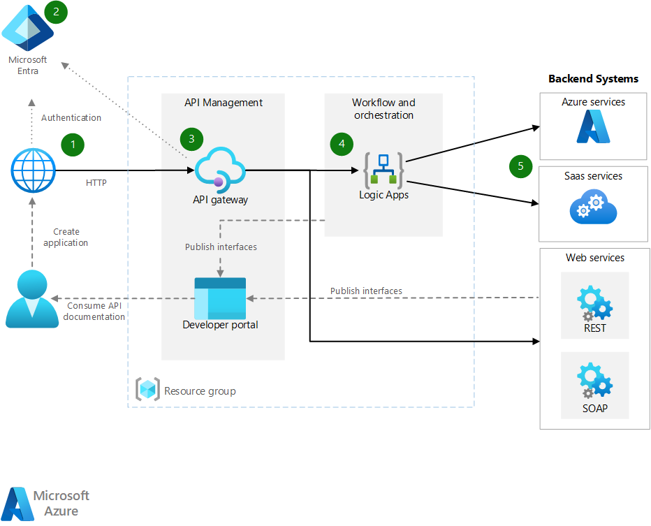

# Basic enterprise integration on Azure

This reference architecture uses [Azure Integration Services][integration-services] to orchestrate calls to enterprise backend systems. The backend systems may include software as a service (SaaS) systems, Azure services, and existing web services in your enterprise.

Azure Integration Services is a collection of services for integrating applications and data. This architecture uses two of those services: [Logic Apps][logic-apps] to orchestrate workflows, and [API Management][apim] to create catalogs of APIs. This architecture is sufficient for basic integration scenarios where the workflow is triggered by synchronous calls to backend services. A more sophisticated architecture using [queues and events](./queues-events.md) builds on this basic architecture.

## Architecture

The architecture has the following components:

- **Backend systems**. The right-hand side of the diagram shows the various backend systems that the enterprise has deployed or relies on. These might include SaaS systems, other Azure services, or web services that expose REST or SOAP endpoints.

- **Azure Logic Apps**. [Logic Apps][logic-apps] is a serverless platform for building enterprise workflows that integrate applications, data, and services. In this architecture, the logic apps are triggered by HTTP requests. You can also nest workflows for more complex orchestration. Logic Apps uses [connectors][logic-apps-connectors] to integrate with commonly used services. Logic Apps offers hundreds of connectors, and you can create custom connectors.

- **Azure API Management**. [API Management][apim] is a managed service for publishing catalogs of HTTP APIs, to promote reuse and discoverability. API Management consists of two related components:

  - **API gateway**. The API gateway accepts HTTP calls and routes them to the backend.

  - **Developer portal**. Each instance of Azure API Management provides access to a [developer portal][apim-dev-portal]. This portal gives your developers access to documentation and code samples for calling the APIs. You can also test APIs in the developer portal.

  In this architecture, composite APIs are built by [importing logic apps][apim-logic-app] as APIs. You can also import existing web services by [importing OpenAPI][apim-openapi] (Swagger) specifications or [importing SOAP APIs][apim-soap] from WSDL specifications.

  The API gateway helps to decouple front-end clients from the back end. For example, it can rewrite URLs, or transform requests before they reach the backend. It also handles many cross-cutting concerns such as authentication, cross-origin resource sharing (CORS) support, and response caching.

- **Azure DNS**. [Azure DNS][dns] is a hosting service for DNS domains. Azure DNS provides name resolution by using the Microsoft Azure infrastructure. By hosting your domains in Azure, you can manage your DNS records by using the same credentials, APIs, tools, and billing that you use for your other Azure services. To use a custom domain name, such as contoso.com, create DNS records that map the custom domain name to the IP address. For more information, see [Configure a custom domain name in API Management][apim-domain].

- **Azure Active Directory (Azure AD)**. Use [Azure AD][aad] to authenticate clients that call the API gateway. Azure AD supports the OpenID Connect (OIDC) protocol. Clients obtain an access token from Azure AD, and API Gateway [validates the token][apim-jwt] to authorize the request. When using the Standard or Premium tier of API Management, Azure AD can also secure access to the developer portal.

## Recommendations

Your specific requirements might differ from the generic architecture shown here. Use the recommendations in this section as a starting point.

### API Management

Use the API Management Basic, Standard, or Premium tiers. These tiers offer a production service level agreement (SLA) and support scale out within the Azure region. Throughput capacity for API Management is measured in *units*. Each pricing tier has a maximum scale-out. The Premium tier also supports scale out across multiple Azure regions. Choose your tier based on your feature set and the level of required throughput. For more information, see [API Management pricing][apim-pricing] and [Capacity of an Azure API Management instance][apim-capacity].

Each Azure API Management instance has a default domain name, which is a subdomain of `azure-api.net`, for example, `contoso.azure-api.net`. Consider configuring a [custom domain][apim-domain] for your organization.

### Logic Apps

Logic Apps works best in scenarios that don't require low latency for a response, such as asynchronous or semi long-running API calls. If low latency is required, for example in a call that blocks a user interface, use a different technology. For example, use Azure Functions or a web API deployed to Azure App Service. Use API Management to front the API to your API consumers.

### Region

To minimize network latency, put API Management and Logic Apps in the same region. In general, choose the region that's closest to your users (or closest to your backend services).

The resource group also has a region. This region specifies where to store deployment metadata and where to execute the deployment template. To improve availability during deployment, put the resource group and resources in the same region.

## Scalability considerations

To increase the scalability of API Management, add [caching policies][apim-caching] where appropriate. Caching also helps reduce the load on back-end services.

To offer greater capacity, you can scale out Azure API Management Basic, Standard, and Premium tiers in an Azure region. To analyze the usage for your service, on the **Metrics** menu, select the **Capacity Metric** option and then scale up or scale down as appropriate. The upgrade or scale process can take from 15 to 45 minutes to apply.

Recommendations for scaling an API Management service:

- Consider traffic patterns when scaling. Customers with more volatile traffic patterns need more capacity.

- Consistent capacity that's greater than 66% might indicate a need to scale up.

- Consistent capacity that's under 20% might indicate an opportunity to scale down.

- Before you enable the load in production, always load-test your API Management service with a representative load.

With the Premium tier, you can scale an API Management instance across multiple Azure regions. This makes API Management eligible for a higher SLA, and lets you provision services near users in multiple regions.

The Logic Apps serverless model means administrators don't have to plan for service scalability. The service automatically scales to meet demand.

## Availability considerations

Review the SLA for each service:

- [API Management SLA][apim-sla]
- [Logic Apps SLA][logic-apps-sla]

If you deploy API Management across two or more regions with Premium tier, it is eligible for a higher SLA. See [API Management pricing][apim-pricing].

### Backups

Regularly [back up][apim-backup] your API Management configuration. Store your backup files in a location or Azure region that differs from the region where the service is deployed. Based on your [RTO][rto], choose a disaster recovery strategy:

- In a disaster recovery event, provision a new API Management instance, restore the backup to the new instance, and repoint the DNS records.

- Keep a passive instance of the API Management service in another Azure region. Regularly restore backups to that instance, to keep it in sync with the active service. To restore the service during a disaster recovery event, you need only repoint the DNS records. This approach incurs additional cost because you pay for the passive instance, but reduces the time to recover.

For logic apps, we recommend a configuration-as-code approach to backing up and restoring. Because logic apps are serverless, you can quickly recreate them from Azure Resource Manager templates. Save the templates in source control, integrate the templates with your continuous integration/continuous deployment (CI/CD) process. In a disaster recovery event, deploy the template to a new region.

If you deploy a logic app to a different region, update the configuration in API Management. You can update the API's **Backend** property by using a basic PowerShell script.

## Manageability considerations

Create separate resource groups for production, development, and test environments. Separate resource groups make it easier to manage deployments, delete test deployments, and assign access rights.

When you assign resources to resource groups, consider these factors:

- **Lifecycle**. In general, put resources that have the same lifecycle in the same resource group.

- **Access**. To apply access policies to the resources in a group, you can use [role-based access control][rbac] (RBAC).

- **Billing**. You can view rollup costs for the resource group.

- **Pricing tier for API Management**. Use the Developer tier for development and test environments. To minimize costs during preproduction, deploy a replica of your production environment, run your tests, and then shut down.

### Deployment

Use [Azure Resource Manager templates][arm] to deploy the Azure resources. Templates make it easier to automate deployments using PowerShell or the Azure CLI.

Put API Management and any individual logic apps in their own separate Resource Manager templates. By using separate templates, you can store the resources in source control systems. You can deploy the templates together or individually as part of a CI/CD process.

### Versions

Each time you change a logic app's configuration or deploy an update through a Resource Manager template, Azure keeps a copy of that version and keeps all versions that have a run history. You can use these versions to track historical changes or promote a version as the logic app's current configuration. For example, you can roll back a logic app to a previous version.

API Management supports two distinct but complementary versioning concepts:

- *Versions* allow API consumers to choose an API version based on their needs, for example, v1, v2, beta, or production.

- *Revisions* allow API administrators to make non-breaking changes in an API and deploy those changes, along with a change log to inform API consumers about the changes.

You can make a revision in a development environment and deploy that change in other environments by using Resource Manager templates. For more information, see [Publish multiple versions of your API][apim-versions]

You can also use revisions to test an API before making the changes current and accessible to users. However, this method isn't recommended for load testing or integration testing. Use separate test or preproduction environments instead.

## Diagnostics and monitoring

Use [Azure Monitor][monitor] for operational monitoring in both API Management and Logic Apps. Azure Monitor provides information based on the metrics configured for each service and is enabled by default. For more information, see:

- [Monitor published APIs][apim-monitor]
- [Monitor status, set up diagnostics logging, and turn on alerts for Azure Logic Apps][logic-apps-monitor]

Each service also has these options:

- For deeper analysis and dashboarding, send Logic Apps logs to [Azure Log Analytics][logic-apps-log-analytics].

- For DevOps monitoring, configure Azure Application Insights for API Management.

- API Management supports the [Power BI solution template for custom API analytics][apim-pbi]. You can use this solution template for creating your own analytics solution. For business users, Power BI makes reports available.

## Security considerations

Although this list doesn't completely describe all security best practices, here are some security considerations that apply specifically to this architecture:

- The Azure API Management service has a fixed public IP address. Restrict access for calling Logic Apps endpoints to only the IP address of API Management. For more information, see [Restrict inbound IP addresses][logic-apps-restrict-ip].

- To make sure users have appropriate access levels, use role-based access control (RBAC).

- Secure public API endpoints in API Management by using OAuth or OpenID Connect. To secure public API endpoints, configure an identity provider, and add a JSON Web Token (JWT) validation policy. For more information, see [Protect an API by using OAuth 2.0 with Azure Active Directory and API Management][apim-oauth].

- Connect to back-end services from API Management by using mutual certificates.

- Enforce HTTPS on the API Management APIs.

### Storing secrets

Never check passwords, access keys, or connection strings into source control. If these values are required, secure and deploy these values by using the appropriate techniques.

If a logic app requires any sensitive values that you can't create within a connector, store those values in Azure Key Vault and reference them from a Resource Manager template. Use deployment template parameters and parameter files for each environment. For more information, see [Secure parameters and inputs within a workflow][logic-apps-secure].

API Management manages secrets by using objects called *named values* or *properties*. These objects securely store values that you can access through API Management policies. For more information, see [How to use Named Values in Azure API Management policies][apim-properties].

## Cost considerations

You are charged for all API Management instances when they are running. If you have scaled up and don't need that level of performance all the time, manually scale down or configure [autoscaling][apim-autoscale].

Logic Apps uses a [serverless](/azure/logic-apps/logic-apps-serverless-overview) model. Billing is calculated based on action and connector execution. For more information, see [Logic Apps pricing](https://azure.microsoft.com/pricing/details/logic-apps/). Currently, there are no tier considerations for Logic Apps.

## Next steps

For greater reliability and scalability, use message queues and events to decouple the backend systems. This pattern is shown in the next reference architecture in this series: [Enterprise integration using message queues and events](./queues-events.md).

<!-- links -->

[aad]: /azure/active-directory
[apim]: /azure/api-management
[apim-autoscale]: /azure/api-management/api-management-howto-autoscale
[apim-backup]: /azure/api-management/api-management-howto-disaster-recovery-backup-restore
[apim-caching]: /azure/api-management/api-management-howto-cache
[apim-capacity]: /azure/api-management/api-management-capacity
[apim-dev-portal]: /azure/api-management/api-management-key-concepts#developer-portal
[apim-domain]: /azure/api-management/configure-custom-domain
[apim-jwt]: /azure/api-management/policies/authorize-request-based-on-jwt-claims
[apim-logic-app]: /azure/api-management/import-logic-app-as-api
[apim-monitor]: /azure/api-management/api-management-howto-use-azure-monitor
[apim-oauth]: /azure/api-management/api-management-howto-protect-backend-with-aad
[apim-openapi]: /azure/api-management/import-api-from-oas
[apim-pbi]: https://azure.microsoft.com/updates/azure-api-management-analytics-powerbi-solution-template/
[apim-pricing]: https://azure.microsoft.com/pricing/details/api-management/
[apim-properties]: /azure/api-management/api-management-howto-properties
[apim-sla]: https://azure.microsoft.com/support/legal/sla/api-management/
[apim-soap]: /azure/api-management/import-soap-api
[apim-versions]: /azure/api-management/api-management-get-started-publish-versions
[arm]: /azure/azure-resource-manager/resource-group-authoring-templates
[dns]: /azure/dns/
[integration-services]: https://azure.microsoft.com/product-categories/integration/
[logic-apps]: /azure/logic-apps/logic-apps-overview
[logic-apps-connectors]: /azure/connectors/apis-list
[logic-apps-log-analytics]: /azure/logic-apps/logic-apps-monitor-your-logic-apps-oms
[logic-apps-monitor]: /azure/logic-apps/logic-apps-monitor-your-logic-apps
[logic-apps-restrict-ip]: /azure/logic-apps/logic-apps-securing-a-logic-app#restrict-inbound-ip-addresses
[logic-apps-secure]: /azure/logic-apps/logic-apps-securing-a-logic-app#access-to-parameter-inputs
[logic-apps-sla]: https://azure.microsoft.com/support/legal/sla/logic-apps
[monitor]: /azure/azure-monitor/overview
[rbac]: /azure/role-based-access-control/overview
[rto]: ../../framework/resiliency/business-metrics.md
