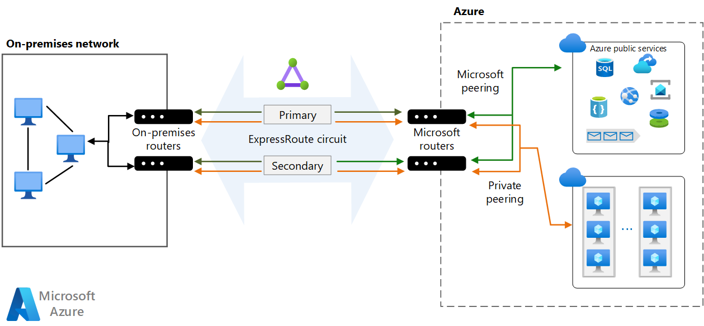
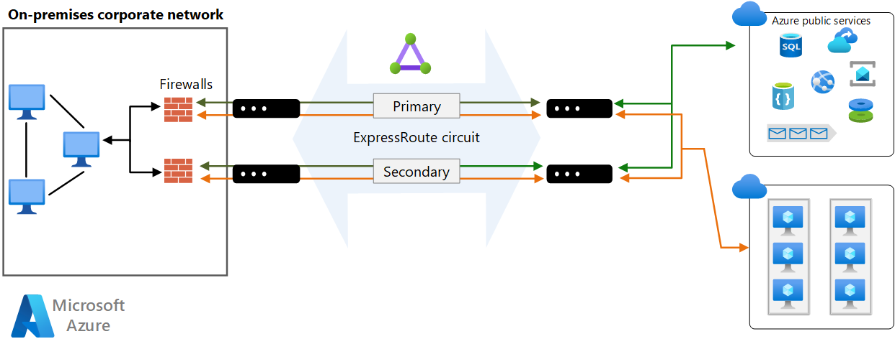
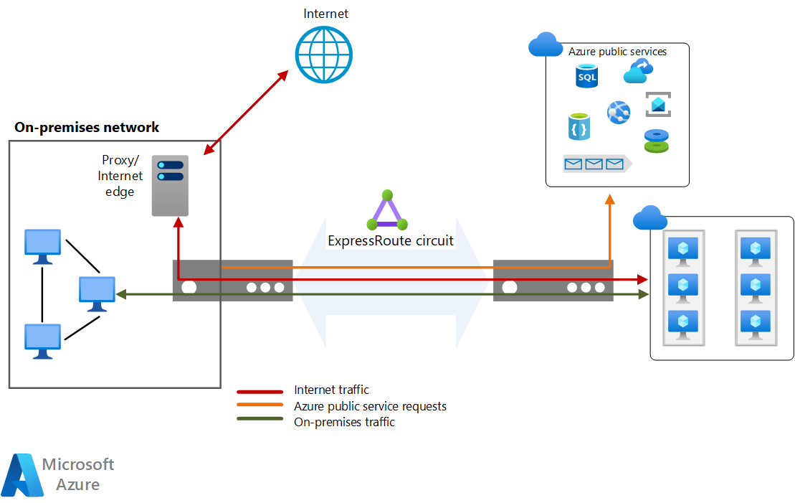

This reference architecture shows how to connect an on-premises network to an Azure virtual network by using Azure ExpressRoute, with a site-to-site virtual private network (VPN) as a failover connection.

## Architecture


*Download a [Visio file](https://arch-center.azureedge.net/expressroute-vpn-failover.vsdx) of this architecture.*

### Workflow

The architecture consists of the following components.

- **On-premises network**. A private local-area network running within an organization.

- **Azure virtual networks**. Each virtual network resides in a single Azure region and can host multiple application tiers. You can segment application tiers by using subnets in each virtual network.

    - **Gateway subnet**. The virtual network gateways are located in the same subnet.

- **VPN appliance**. A device or service that provides external connectivity to the on-premises network. The VPN appliance can be a hardware device, or it can be a software solution such as the Routing and Remote Access Service (RRAS) in Windows Server 2012. For a list of supported VPN appliances and information on configuring selected VPN appliances for connecting to Azure, see [About VPN devices for Site-to-Site VPN Gateway connections][vpn-appliance].

- **ExpressRoute circuit**. A layer 2 or layer 3 circuit supplied by the connectivity provider that joins the on-premises network with Azure through the edge routers. The circuit uses the hardware infrastructure managed by the connectivity provider.

    - **Local edge routers**. Routers that connect the on-premises network to the circuit that's managed by the provider. Depending on how your connection is provisioned, you might need to provide the public IP addresses that the routers use.

    - **Microsoft edge routers**. Two routers in an active-active, highly available configuration. These routers enable a connectivity provider to connect their circuits directly to their datacenter. Depending on how your connection is provisioned, you might need to provide the public IP addresses that the routers use.

- **ExpressRoute virtual network gateway**. The ExpressRoute virtual network gateway enables the Azure virtual network to connect to the ExpressRoute circuit that's used for connectivity with your on-premises network.

- **VPN virtual network gateway**. The VPN virtual network gateway enables the Azure virtual network to connect to the VPN appliance in the on-premises network. The VPN virtual network gateway is configured to accept requests from the on-premises network only through the VPN appliance. For more information, see [Connect an on-premises network to a Microsoft Azure virtual network][connect-to-an-Azure-vnet].

- **VPN connection**. The connection has properties that specify the connection type (IPsec) and the key shared with the on-premises VPN appliance to encrypt traffic.

- **Azure public services**. Azure services that can be used within a hybrid application. These services are also available over the internet, but accessing them by using an ExpressRoute circuit provides low latency and more predictable performance, because traffic doesn't go through the internet.

- **Microsoft 365 services**. The publicly available Microsoft 365 applications and services that Microsoft provides. Connections use [Microsoft peering](/azure/expressroute/expressroute-circuit-peerings) and addresses that are owned by your organization or supplied by your connectivity provider. You can also connect directly to Microsoft CRM Online by using Microsoft peering.

- **Connectivity providers** (not shown). Companies that provide a connection by using either layer 2 or layer 3 connectivity between your datacenter and an Azure datacenter.

### Components

- [Azure ExpressRoute](/azure/well-architected/service-guides/azure-expressroute). You can use ExpressRoute to extend your on-premises networks into the Microsoft cloud over a private connection, with the help of a connectivity provider. With ExpressRoute, you can establish connections to Microsoft cloud services, like Azure and Microsoft 365.

- [Azure Virtual Network](/azure/well-architected/service-guides/virtual-network). Azure Virtual Network is the fundamental building block for your private network on Azure. Virtual Network enables many types of Azure resources, like Azure virtual machines, to communicate with each other, the internet, and on-premises networks with enhanced security.

- [Azure VPN Gateway](/azure/vpn-gateway/vpn-gateway-about-vpngateways). VPN Gateway is a virtual network gateway that enables you to connect your on-premises network to an Azure virtual network by using a site-to-site virtual private network (VPN) connection.

## Scenario details

This reference architecture shows how to connect an on-premises network to an Azure virtual network by using ExpressRoute, with a site-to-site virtual private network (VPN) as a failover connection. Traffic flows between the on-premises network and the Azure virtual network through an ExpressRoute connection. If there's a loss of connectivity in the ExpressRoute circuit, traffic is routed through an IPsec VPN tunnel. [**Deploy this solution**](#deploy-this-scenario).

If the ExpressRoute circuit is unavailable, the VPN route handles only private peering connections. Public peering and Microsoft peering connections pass over the Internet.

## Recommendations

The following recommendations apply for most scenarios. Follow these recommendations unless you have a specific requirement that overrides them.

### Connectivity providers

Select a suitable ExpressRoute connectivity provider for your location. To get a list of connectivity providers that are available at your location, use the following PowerShell command:

```powershell
Get-AzExpressRouteServiceProvider
```

ExpressRoute connectivity providers connect your datacenter to Microsoft in the following ways:

- **Co-located at a cloud exchange**. If you're co-located in a facility that has a cloud exchange, you can order virtual cross-connections to Azure through the co-location provider's Ethernet exchange. Co-location providers can offer either layer 2 cross-connections or managed layer 3 cross-connections between your infrastructure in the co-location facility and Azure.

- **Point-to-point Ethernet connections**. You can connect your on-premises datacenters/offices to Azure by using point-to-point Ethernet links. Point-to-point Ethernet providers can provide layer 2 connections or managed layer 3 connections between your site and Azure.

- **Any-to-any (IPVPN) networks**. You can integrate your wide area network (WAN) with Azure. Internet protocol virtual private network (IPVPN) providers  offer any-to-any connectivity between your branch offices and datacenters. (An IPVPN is typically a multiprotocol label-switching VPN.) Azure can be interconnected to your WAN to make it appear like any other branch office. WAN providers typically offer managed layer 3 connectivity.

For more information about connectivity providers, see the [ExpressRoute introduction][expressroute-introduction].

### ExpressRoute circuit

You can use the following steps to create an ExpressRoute circuit.

1. Run the following PowerShell command:

    ```powershell
    New-AzExpressRouteCircuit -Name <circuit-name> -ResourceGroupName <resource-group> -Location <location> -SkuTier <SKU-tier> -SkuFamily <SKU-family> -ServiceProviderName <service-provider-name> -PeeringLocation <peering-location> -BandwidthInMbps <bandwidth-in-Mbps>
    ```

2. Send the `ServiceKey` for the new circuit to the service provider.

3. Wait for the provider to provision the circuit. To verify the provisioning state of a circuit, run the following PowerShell command:

    ```powershell
    Get-AzExpressRouteCircuit -Name <circuit-name> -ResourceGroupName <resource-group>
    ```

    The `Provisioning state` field in the `Service Provider` section of the output changes from `NotProvisioned` to `Provisioned` when the circuit is ready.

    > [!NOTE]
    > If you use a layer 3 connection, the provider should configure and manage routing for you. You provide the information necessary to enable the provider to implement the appropriate routes.
    >

4. If you use a layer 2 connection:

    1. Reserve two /30 subnets composed of valid public IP addresses for each type of peering that you want to implement. These /30 subnets are used to provide IP addresses for the routers that are used for the circuit. If you're implementing private and Microsoft peering, you need four /30 subnets with valid public IP addresses.

    2. Configure routing for the ExpressRoute circuit. Run the following PowerShell commands for both private and Microsoft peering. For more information, see [Create and modify routing for an ExpressRoute circuit][configure-expressroute-routing].

        ```powershell
        Set-AzExpressRouteCircuitPeeringConfig -Name <peering-name> -ExpressRouteCircuit <circuit-name> -PeeringType <peering-type> -PeerASN <peer-ASN> -PrimaryPeerAddressPrefix <primary-peer-address-prefix> -SecondaryPeerAddressPrefix <secondary-peer-address-prefix> -VlanId <vlan-ID>

        Set-AzExpressRouteCircuit -ExpressRouteCircuit <circuit-name>
        ```

    3. Reserve another pool of valid public IP addresses to use for network address translation (NAT) for Microsoft peering. We recommend that you have a different pool for each peering. Specify the pool to your connectivity provider so they can configure Border Gateway Protocol (BGP) advertisements for those ranges.

### VPN and ExpressRoute gateways

If you already have an existing VPN virtual network gateway in your Azure virtual network, you can create an ExpressRoute virtual network gateway without needing to delete the existing virtual network gateway.

Follow the instructions in [Configure a hybrid network architecture with Azure ExpressRoute][configure-expressroute] to establish your ExpressRoute connection.

Follow the instructions in [Configure a hybrid network architecture with Azure and on-premises VPN][configure-vpn] to establish your VPN virtual network gateway connection.

After you establish the virtual network gateway connections, test the environment by following these steps:

1. Make sure you can connect from your on-premises network to your Azure virtual network.
1. Contact your provider to stop ExpressRoute connectivity for testing.
1. Verify that you can still connect from your on-premises network to your Azure virtual network using the VPN virtual network gateway connection.
1. Contact your provider to reestablish ExpressRoute connectivity.

### Troubleshooting

If a previously functioning ExpressRoute circuit fails to connect and there are no configuration changes on-premises or within your private virtual network, you might need to contact the connectivity provider and work with them to correct the issue. Use the following PowerShell commands to verify that the ExpressRoute circuit is provisioned correctly:

```powershell
Get-AzExpressRouteCircuit -Name <circuit-name> -ResourceGroupName <resource-group>
```

The output of this command shows several properties for your circuit, including `ProvisioningState`, `CircuitProvisioningState`, and `ServiceProviderProvisioningState`, as shown here:

```powershell
ProvisioningState                : Succeeded
Sku                              : {
                                     "Name": "Standard_MeteredData",
                                     "Tier": "Standard",
                                     "Family": "MeteredData"
                                   }
CircuitProvisioningState         : Enabled
ServiceProviderProvisioningState : NotProvisioned
```

If `ProvisioningState` isn't set to `Succeeded` after you try to create a new circuit, remove the circuit by using the following command and try to create it again.

```powershell
Remove-AzExpressRouteCircuit -Name <circuit-name> -ResourceGroupName <resource-group>
```

If your provider already provisioned the circuit, and `ProvisioningState` is set to `Failed` or `CircuitProvisioningState` isn't `Enabled`, contact your provider for assistance.

## Considerations

These considerations implement the pillars of the Azure Well-Architected Framework, which is a set of guiding tenets that can be used to improve the quality of a workload. For more information, see [Microsoft Azure Well-Architected Framework](/azure/well-architected/).

### Reliability

Reliability ensures your application can meet the commitments you make to your customers. For more information, see [Design review checklist for Reliability](/azure/well-architected/reliability/checklist).

ExpressRoute doesn't support router redundancy protocols like Hot Standby Routing Protocol (HSRP) and Virtual Router Redundancy Protocol (VRRP) for high availability. Instead, it uses a redundant pair of BGP sessions per peering. To facilitate highly available connections to your network, Azure provisions two redundant ports on two routers (part of the Microsoft edge) in an active-active configuration.

By default, BGP sessions use an idle timeout value of 60 seconds. If a session times out three times (180 seconds total), the router is marked unavailable and all traffic is redirected to the remaining router. This 180-second timeout might be too long for critical applications. If you need to, you can change your BGP time-out settings on the on-premises router to a shorter duration. ExpressRoute also supports [Bidirectional Forwarding Detection (BFD)](/azure/expressroute/expressroute-bfd) over private peering. By enabling BFD over ExpressRoute, you can expedite link failure detection between Microsoft Enterprise edge (MSEE) devices and the routers on which you terminate the ExpressRoute circuit. You can terminate ExpressRoute over Customer Edge routing devices or Partner Edge routing devices (if you have a managed layer 3 connection service).

You can configure high availability for your Azure connection in different ways, depending on the type of provider you use and the number of ExpressRoute circuits and virtual network gateway connections you're willing to configure. Here's a summary of your availability options:

- If you use a layer 2 connection, deploy redundant routers in your on-premises network in an active-active configuration. Connect the primary circuit to one router and the secondary circuit to the other. This configuration provides a highly available connection at both ends. This configuration is necessary if you require the ExpressRoute service-level agreement (SLA). For more information, see [SLA for Azure ExpressRoute][sla-for-expressroute].

    The following diagram shows a configuration with redundant on-premises routers connected to the primary and secondary circuits. Each circuit handles the traffic for private peering. (Each peering is designated a pair of /30 address spaces, as described in the previous section.)

    

- If you use a layer 3 connection, verify that it provides redundant BGP sessions that handle availability for you.

- If you require maximum resiliency, create multiple circuits to different peering locations. For high resiliency, [ExpressRoute Metro](/azure/expressroute/metro) provides a single circuit with multiple peering locations.
  - For each circuit, consider a different service provider to minimize the risk of network downtime by a single provider outage.

- Configure a site-to-site VPN as a failover path for ExpressRoute. For more information about this option, see [Connect an on-premises network to Azure using ExpressRoute with VPN failover][highly-available-network-architecture]. This option only applies to private peering. For Azure and Microsoft 365 services, the internet is the only failover path.

### Security

Security provides assurances against deliberate attacks and the abuse of your valuable data and systems. For more information, see [Design review checklist for Security](/azure/well-architected/security/checklist).

You can configure security options for your Azure connection in different ways, depending on your security concerns and compliance needs.

ExpressRoute operates in layer 3. You can provide protection from threats in the application layer by using a network security appliance that restricts traffic to legitimate resources.

To improve security, add network security appliances between the on-premises network and the provider edge routers. This helps to restrict the inflow of unauthorized traffic from the virtual network:



For auditing or compliance, you might need to block direct internet access for components that run in the virtual network and implement forced tunneling. In this situation, internet traffic should be redirected back through a proxy that's running on-premises, where it can be audited. You can configure the proxy to block unauthorized traffic from flowing out and filter potentially malicious inbound traffic.



To improve security, don't enable a public IP address for your VMs, and use NSGs to help ensure that these VMs aren't publicly accessible. VMs should only be available via the internal IP address. You can make these addresses accessible through the ExpressRoute network, which enables on-premises DevOps staff to perform configuration or maintenance.

If you must expose management endpoints for VMs to an external network, use NSGs or access control lists to restrict the visibility of these ports to an allowlist of IP addresses or networks.

> [!NOTE]
> Azure VMs deployed through the Azure portal can include a public IP address that provides sign-in access. However, it's a best practice to prohibit this access.

By default, traffic traversing an ExpressRoute connection isn't encrypted. You can optionally configure encryption to be either Point-to-point encryption by MACsec or end-to-end encryption by IPsec; MACsec only available for ExpressRoute Direct. For more information, see [About encryption for Azure ExpressRoute](/azure/expressroute/expressroute-about-encryption#end-to-end-encryption-by-ipsec-faq).

To ensure your data hasn't been tampered with during transit, you can configure an MD5 hash on the ExpressRoute circuit during the [configuration of private peering or Microsoft peering](/azure/expressroute/expressroute-howto-routing-portal-resource-manager#prerequisites) to secure messages between the cross-premises route and the MSEE routers.

For more security considerations, see [Azure security baseline for ExpressRoute](/security/benchmark/azure/baselines/expressroute-security-baseline).

### Cost Optimization

Cost Optimization is about looking at ways to reduce unnecessary expenses and improve operational efficiencies. For more information, see [Design review checklist for Cost Optimization](/azure/well-architected/cost-optimization/checklist).

For ExpressRoute cost considerations, see these articles:

- [Cost considerations in configuring a Hybrid Network Architecture with Azure ExpressRoute](../../reference-architectures/hybrid-networking/expressroute-vpn-failover.yml#considerations).

#### ExpressRoute

In this architecture, an ExpressRoute circuit is used to join the on-premises network with Azure through the edge routers.

ExpressRoute offers two pricing plans. With the Metered Data plan, all inbound data transfer is free. All outbound data transfer is charged based on a predetermined rate.

With the Unlimited Data plan, all inbound and outbound data transfer is free. You're charged a fixed monthly port fee based on high availability dual ports.

Calculate your utilization and choose a billing plan accordingly. We recommend the Unlimited Data plan if you exceed about 68% of utilization.

For more information, see [Azure ExpressRoute pricing][expressroute-pricing].

#### Azure Virtual Network

All application tiers are hosted in a single virtual network and are segmented into subnets.

Azure Virtual Network is free. For every subscription, you can create as many as 1,000 virtual networks across all regions. All traffic that occurs within the boundaries of a virtual network is free, so communication between two VMs in a single virtual network is free.

### Operational Excellence

Operational Excellence covers the operations processes that deploy an application and keep it running in production. For more information, see [Design review checklist for Operational Excellence](/azure/well-architected/operational-excellence/checklist).

- Configure [Connection Monitor](/azure/expressroute/how-to-configure-connection-monitor) to detect network issues by identifying where along the network path the problem is and help you resolve configuration or hardware failures.
- Consider configuring [Dynamic Routing](/azure/expressroute/expressroute-routing#dynamic-route-exchange) over the eBGP protocol to allow for more efficient and flexible routing, ensuring optimal path selection and automatic updates to route tables in response to network changes.
- Configure [Traffic Collector for ExpressRoute](/azure/expressroute/how-to-configure-traffic-collector) and [ExpressRoute Insights with Network Insights](/azure/expressroute/expressroute-network-insights) for near real time performance and network health metrics.

For site-to-site VPN DevOps considerations, see the [Configure a Hybrid Network Architecture with Azure and On-premises VPN][guidance-vpn] guidance.

### Performance Efficiency

Performance Efficiency is the ability of your workload to scale to meet the demands placed on it by users in an efficient manner. For more information, see [Design review checklist for Performance Efficiency](/azure/well-architected/performance-efficiency/checklist).

ExpressRoute circuits provide a high-bandwidth path between networks. Generally, the higher the bandwidth, the higher the cost.

> [!NOTE]
> Use the [Azure Connectivity Toolkit](/azure/expressroute/expressroute-troubleshooting-network-performance#azurect---the-azure-connectivity-toolkit) to ensure the ExpressRoute gateway meets workload requirements.

ExpressRoute offers two [pricing plans][expressroute-pricing]: the Metered Plan and the Unlimited Data plan. Charges vary according to circuit bandwidth. Available bandwidth will probably vary from provider to provider. Use the `Get-AzExpressRouteServiceProvider` cmdlet to see the providers available in your region and the bandwidths that they offer.

A single ExpressRoute circuit can support a certain number of peerings and virtual network links. See [ExpressRoute limits](/azure/azure-subscription-service-limits#expressroute-limits) for more information.

The ExpressRoute Premium add-on provides:

- Increased route limits for private peering.
- An increased number of virtual network links per ExpressRoute circuit.
- Global connectivity for services.

For more information, see [ExpressRoute pricing][expressroute-pricing].

Although some providers allow you to change your bandwidth, be sure to choose an initial bandwidth that surpasses your needs and provides room for growth. If you need to increase bandwidth in the future, you have two options:

- Increase the bandwidth. Avoid this option as much as possible. Not all providers allow you to increase bandwidth dynamically. But if you need a bandwidth increase, check with your provider to ensure that they support changing ExpressRoute bandwidth properties by using PowerShell commands. If they do, run the following commands:

    ```powershell
    $ckt = Get-AzExpressRouteCircuit -Name <circuit-name> -ResourceGroupName <resource-group>
    $ckt.ServiceProviderProperties.BandwidthInMbps = <bandwidth-in-Mbps>
    Set-AzExpressRouteCircuit -ExpressRouteCircuit $ckt
    ```

    You can increase the bandwidth without loss of connectivity. Downgrading the bandwidth disrupts connectivity because you need to delete the circuit and re-create it with the new configuration.

- Change your pricing plan and/or upgrade to Premium. To do so, run the following commands. The `Sku.Tier` property can be `Standard` or `Premium`. The `Sku.Name` property can be `MeteredData` or `UnlimitedData`.

    ```powershell
    $ckt = Get-AzExpressRouteCircuit -Name <circuit-name> -ResourceGroupName <resource-group>

    $ckt.Sku.Tier = "Premium"
    $ckt.Sku.Family = "MeteredData"
    $ckt.Sku.Name = "Premium_MeteredData"

    Set-AzExpressRouteCircuit -ExpressRouteCircuit $ckt
    ```

    > [!IMPORTANT]
    > Be sure the `Sku.Name` property matches the `Sku.Tier` and `Sku.Family`. If you change the family and tier but not the name, your connection will be disabled.
    >
    >

    You can upgrade the SKU without disruption, but you can't switch from the unlimited pricing plan to the metered plan. If you downgrade the SKU, your bandwidth consumption must remain within the default limit of the Standard SKU.

[ExpressRoute scalable gateways](/azure/expressroute/expressroute-about-virtual-network-gateways#expressroute-scalable-gateway-preview) offers the ability automatically scale the ExpressRoute Virtual Network Gateway to accommodate for performance needs without having to intervene manually.

For higher throughput, enable [ExpressRoute FastPath](/azure/expressroute/about-fastpath) to bypass the gateway and improve the data path performance between your on-premises network and Azure virtual networks.

## Deploy this scenario

**Prerequisites**. You must have an existing on-premises infrastructure already configured with a suitable network appliance.

To deploy the solution, perform the following steps.

1. Select the following link:

   [](https://portal.azure.com/#create/Microsoft.Template/uri/https%3a%2f%2fraw.githubusercontent.com%2fAzure%2fazure-quickstart-templates%2fmaster%2fquickstarts%2fmicrosoft.network%2fexpressroute-private-peering-vnet%2fazuredeploy.json)

1. Wait for the link to open in the Azure portal, then select the **Resource group** you would like to deploy these resources into or create a new resource group. The **Region** and **Location** will automatically change to match the resource group.

1. Update the remaining fields if you would like to change the resource names, providers, SKU, or network IP addresses for your environment.

1. Select **Review + create** and then **Create** to deploy these resources.

1. Wait for the deployment to complete.

   > [!NOTE]
   > This template deployment only deploys the following resources:
   >
   > - A resource group (if you create new)
   > - An ExpressRoute circuit
   > - An Azure virtual network
   > - An ExpressRoute virtual network gateway
   >
   > To establish private peering connectivity from on-premises to the ExpressRoute circuit, you need to provide the circuit service key to your service provider. You can find the service key on the overview page of the ExpressRoute circuit resource. For more information on configuring your ExpressRoute circuit, see [Create or modify peering configuration][configure-expressroute-routing]. After you configure private peering, you can link the ExpressRoute virtual network gateway to the circuit. For more information, see [Tutorial: Connect a virtual network to an ExpressRoute circuit using the Azure portal](/azure/expressroute/expressroute-howto-linkvnet-portal-resource-manager).

1. To complete the deployment of site-to-site VPN as a backup to ExpressRoute, see [Create a site-to-site VPN connection](/azure/vpn-gateway/tutorial-site-to-site-portal).

1. Once you've successfully configured a VPN connection to the same on-premises network you configured ExpressRoute, you'll then have completed the setup to back up your ExpressRoute connection if there's total failure at the peering location.

Alternatively, Microsoft Developer Tools offers other deployable scenarios:

- [ExpressRoute circuit with private peering and Azure VNet](/samples/azure/azure-quickstart-templates/expressroute-private-peering-vnet/)
- [Create an ExpressRoute Circuit with BGP Peering](/samples/azure/azure-quickstart-templates/expressroute-circuit-public-private-peering/)

## Contributors

*This article is maintained by Microsoft. It was originally written by the following contributors.*

Principal author:

- [Sarah Parkes](https://www.linkedin.com/in/sarah-p-a06370) | Senior Cloud Solution Architect

*To see non-public LinkedIn profiles, sign in to LinkedIn.*

## Next steps

Product documentation:

- [ExpressRoute Documentation](/azure/expressroute)
- [Azure Security baseline for ExpressRoute](/security/benchmark/azure/baselines/expressroute-security-baseline?toc=%2fazure%2fexpressroute%2fTOC.json)
- [How to create an ExpressRoute circuit](/azure/expressroute/expressroute-howto-circuit-portal-resource-manager)
- [Azure Networking Blog](https://azure.microsoft.com/blog/topics/networking)
- [Configure ExpressRoute and Site-to-Site coexisting connections using PowerShell](/azure/expressroute/expressroute-howto-coexist-resource-manager)
- [What is Azure Virtual Network?](/azure/virtual-network/virtual-networks-overview)
- [Microsoft 365 services](/office365/servicedescriptions/office-365-service-descriptions-technet-library)

Microsoft Learn modules:

- [Configure ExpressRoute and Virtual WAN](/training/modules/configure-expressroute-virtual-wan)
- [Configure virtual network peering](/training/modules/configure-vnet-peering)
- [Design and implement Azure ExpressRoute](/training/modules/design-implement-azure-expressroute)
- [Explore the Microsoft 365 platform services](/training/paths/explore-microsoft-365-platform-services)

## Related resources

- [Hybrid architecture design](../../hybrid/hybrid-start-here.md)
- [Azure hybrid options](../../guide/technology-choices/hybrid-considerations.yml)
- [Hub-spoke network topology in Azure](../../networking/architecture/hub-spoke.yml)
- [Virtual network connectivity options and spoke-to-spoke communication](../../reference-architectures/hybrid-networking/virtual-network-peering.yml)
- [Connect an on-premises network to Azure](index.yml)
- [Implement a secure hybrid network](../dmz/secure-vnet-dmz.yml)
- [Architecture best practices for Azure ExpressRoute](/azure/well-architected/service-guides/azure-expressroute)

<!-- links -->

[vpn-appliance]: /azure/vpn-gateway/vpn-gateway-about-vpn-devices
[connect-to-an-Azure-vnet]: /microsoft-365/enterprise/connect-an-on-premises-network-to-a-microsoft-azure-virtual-network?view=o365-worldwide
[configure-expressroute]: ./expressroute-vpn-failover.yml
[configure-vpn]: /azure/expressroute/expressroute-howto-coexist-resource-manager
[guidance-vpn]: /azure/expressroute/use-s2s-vpn-as-backup-for-expressroute-privatepeering
[configure-expressroute-routing]: /azure/expressroute/expressroute-howto-routing-arm
[sla-for-expressroute]: https://azure.microsoft.com/support/legal/sla/expressroute
[expressroute-introduction]: /azure/expressroute/expressroute-introduction
[expressroute-pricing]: https://azure.microsoft.com/pricing/details/expressroute/
[highly-available-network-architecture]: ./expressroute-vpn-failover.yml
