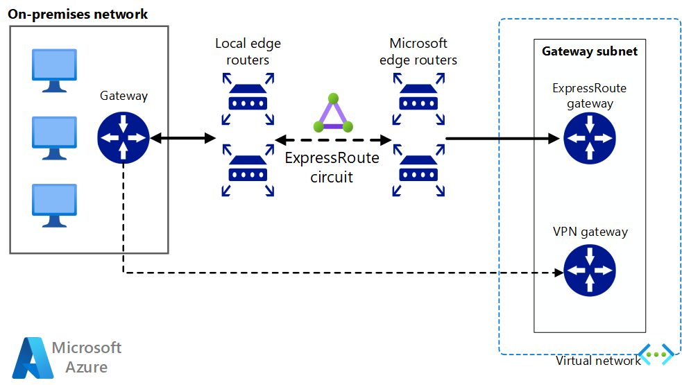

<!-- cSpell:ignore RRAS -->

This reference architecture shows how to connect an on-premises network to an Azure virtual network (VNet) using ExpressRoute, with a site-to-site virtual private network (VPN) as a failover connection. Traffic flows between the on-premises network and the Azure VNet through an ExpressRoute connection. If there's a loss of connectivity in the ExpressRoute circuit, traffic is routed through an IPSec VPN tunnel. [**Deploy this solution**](#deploy-this-scenario).

Note that if the ExpressRoute circuit is unavailable, the VPN route will only handle private peering connections. Public peering and Microsoft peering connections will pass over the Internet.

## Architecture



### Workflow

The architecture consists of the following components.

- **On-premises network**. A private local-area network running within an organization.

- **VPN appliance**. A device or service that provides external connectivity to the on-premises network. The VPN appliance may be a hardware device, or it can be a software solution such as the Routing and Remote Access Service (RRAS) in Windows Server 2012. For a list of supported VPN appliances and information on configuring selected VPN appliances for connecting to Azure, see [About VPN devices for Site-to-Site VPN Gateway connections][vpn-appliance].

- **ExpressRoute circuit**. A layer 2 or layer 3 circuit supplied by the connectivity provider that joins the on-premises network with Azure through the edge routers. The circuit uses the hardware infrastructure managed by the connectivity provider.

- **ExpressRoute virtual network gateway**. The ExpressRoute virtual network gateway enables the VNet to connect to the ExpressRoute circuit used for connectivity with your on-premises network.

- **VPN virtual network gateway**. The VPN virtual network gateway enables the VNet to connect to the VPN appliance in the on-premises network. The VPN virtual network gateway is configured to accept requests from the on-premises network only through the VPN appliance. For more information, see [Connect an on-premises network to a Microsoft Azure virtual network][connect-to-an-Azure-vnet].

- **VPN connection**. The connection has properties that specify the connection type (IPSec) and the key shared with the on-premises VPN appliance to encrypt traffic.

- **Azure Virtual Network (VNet)**. Each VNet resides in a single Azure region, and can host multiple application tiers. Application tiers can be segmented using subnets in each VNet.

- **Gateway subnet**. The virtual network gateways are held in the same subnet.

## Recommendations

The following recommendations apply for most scenarios. Follow these recommendations unless you have a specific requirement that overrides them.

### VNet and GatewaySubnet

Create the ExpressRoute virtual network gateway connection and the VPN virtual network gateway connection in the same VNet with a Gateway object already in place. They'll both share the same subnet named *GatewaySubnet*.

If the VNet already includes a subnet named *GatewaySubnet*, ensure that it has a /27 or larger address space. If the existing subnet is too small, use the following PowerShell command to remove the subnet:

```powershell
$vnet = Get-AzVirtualNetwork -Name <your-vnet-name> -ResourceGroupName <your-resource-group>
Remove-AzVirtualNetworkSubnetConfig -Name GatewaySubnet -VirtualNetwork $vnet
```

If the VNet doesn't contain a subnet named **GatewaySubnet**, create a new one using the following PowerShell command:

```powershell
$vnet = Get-AzVirtualNetwork -Name <your-vnet-name> -ResourceGroupName <your-resource-group>
Add-AzVirtualNetworkSubnetConfig -Name "GatewaySubnet" -VirtualNetwork $vnet -AddressPrefix "10.200.255.224/27"
$vnet = Set-AzVirtualNetwork -VirtualNetwork $vnet
```

### VPN and ExpressRoute gateways

Verify that your organization meets the [ExpressRoute prerequisite requirements][expressroute-prereq] for connecting to Azure.

If you already have a VPN virtual network gateway in your Azure VNet, use the following PowerShell command to remove it:

```powershell
Remove-AzVirtualNetworkGateway -Name <your-gateway-name> -ResourceGroupName <your-resource-group>
```

Follow the instructions in [Configure a hybrid network architecture with Azure ExpressRoute][configure-expressroute] to establish your ExpressRoute connection.

Follow the instructions in [Configure a hybrid network architecture with Azure and On-premises VPN][configure-vpn] to establish your VPN virtual network gateway connection.

After you've established the virtual network gateway connections, test the environment as follows:

1. Make sure you can connect from your on-premises network to your Azure VNet.
2. Contact your provider to stop ExpressRoute connectivity for testing.
3. Verify that you can still connect from your on-premises network to your Azure VNet using the VPN virtual network gateway connection.
4. Contact your provider to reestablish ExpressRoute connectivity.

## Considerations

### DevOps

For ExpressRoute DevOps considerations, see the [Configure a Hybrid Network Architecture with Azure ExpressRoute][guidance-expressroute] guidance.

For site-to-site VPN DevOps considerations, see the [Configure a Hybrid Network Architecture with Azure and On-premises VPN][guidance-vpn] guidance.

### Security

For general Azure security considerations, see [Microsoft cloud services and network security][best-practices-security].

### Cost optimization

For ExpressRoute cost considerations, see these articles:

- [Cost considerations in configuring a Hybrid Network Architecture with Azure ExpressRoute](../../reference-architectures/hybrid-networking/expressroute.yml#considerations).

## Deploy this scenario

**Prerequisites**. You must have an existing on-premises infrastructure already configured with a suitable network appliance.

To deploy the solution, perform the following steps.

1. Select the link below.

    [](https://portal.azure.com/#create/Microsoft.Template/uri/https%3a%2f%2fraw.githubusercontent.com%2fAzure%2fazure-quickstart-templates%2fmaster%2fquickstarts%2fmicrosoft.network%2fexpressroute-private-peering-vnet%2fazuredeploy.json)

1. Wait for the link to open in the Azure portal, then select the **Resource group** you would like to deploy these resources into or create a new resource group. The **Region** and **Location** will automatically change to match the resource group.

1. Update the remaining fields if you would like to change the resource names, providers, SKU, or network IP addresses for your environment.

1. Select **Review + create** and then **Create** to deploy these resources.

1. Wait for the deployment to complete.

    > [!NOTE]
    > This template deployment only deploys the following resources:
    >
    > - Resource Group (if you create new)
    > - ExpressRoute circuit
    > - Virtual Network
    > - ExpressRoute Virtual Network Gateway
    >
    > In order for you to successfully establish private peering connectivity from on-premises to the ExpressRoute circuit, you'll need to engage your service provider with the circuit service key. The service key can be found on the overview page of the ExpressRoute circuit resource. For more information on configuring your ExpressRoute circuit, see [Create or modify peering configuration](/azure/expressroute/expressroute-howto-routing-portal-resource-manager). Once you have configured private peering successfully you can link the ExpressRoute Virtual Network Gateway to the circuit, see [Link virtual network to an ExpressRoute circuit](/azure/expressroute/expressroute-howto-linkvnet-portal-resource-manager).

1. To complete the deployment of site-to-site VPN as a backup to ExpressRoute, see [Create a site-to-site VPN connection](/azure/vpn-gateway/tutorial-site-to-site-portal).

1. Once you've successfully configured a VPN connection to the same on-premises network you configured ExpressRoute, you'll then have completed the setup to back up your ExpressRoute connection if there's total failure at the peering location.

## Next steps

* [ExpressRoute Documentation](/azure/expressroute/)
* [Azure Security baseline for ExpressRoute](/security/benchmark/azure/baselines/expressroute-security-baseline?toc=%2fazure%2fexpressroute%2fTOC.json)
* [How to create an ExpressRoute circuit](https://azure.microsoft.com/resources/videos/azure-expressroute-how-to-create-an-expressroute-circuit/)
* [Azure Networking Blog](https://azure.microsoft.com/en-us/blog/topics/networking)

<!-- links -->

[windows-vm-ra]: ../n-tier/n-tier-sql-server.yml
[linux-vm-ra]: ../n-tier/n-tier-cassandra.yml
[vpn-appliance]: /azure/vpn-gateway/vpn-gateway-about-vpn-devices
[connect-to-an-Azure-vnet]: /microsoft-365/enterprise/connect-an-on-premises-network-to-a-microsoft-azure-virtual-network?view=o365-worldwide
[expressroute-prereq]: /azure/expressroute/expressroute-prerequisites
[configure-expressroute]: ./expressroute.yml
[configure-vpn]: /azure/expressroute/expressroute-howto-coexist-resource-manager
[guidance-expressroute]: ./expressroute.yml
[guidance-vpn]: /azure/expressroute/use-s2s-vpn-as-backup-for-expressroute-privatepeering
[best-practices-security]: /azure/best-practices-network-security
