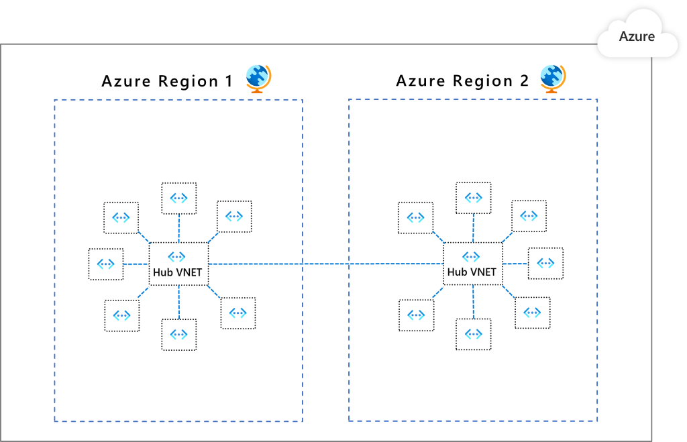

This reference architecture implements a hub-spoke network pattern with customer-managed hub infrastructure components. For a Microsoft-managed hub infrastructure solution, see [Hub-spoke network topology with Azure Virtual WAN](/azure/architecture/networking/hub-spoke-vwan-architecture).

## Architecture


*Download a [Visio file](https://arch-center.azureedge.net/hub-spoke-network-topology-architecture.vsdx) of this architecture.*

### Workflow

This hub-spoke network configuration uses the following architectural elements:

- **Hub virtual network:** The hub virtual network is the central point of connectivity for cross-premises networks. The hub virtual network hosts Azure services that workloads hosted in the spoke virtual networks can consume.

- **Spoke virtual networks:** Spoke virtual networks can isolate workloads and manage them separately from other spokes. Each workload can include multiple tiers, with multiple subnets connected through Azure load balancers. Spokes can exist in different subscriptions and represent different environments, such as Production and Non-production.

- **Virtual network connectivity:** Virtual networks can connect by using a [peering connection](/azure/virtual-network/virtual-network-peering-overview) or a [connected group](/azure/virtual-network-manager/concept-connectivity-configuration). Peering connections and connected groups are non-transitive, low-latency connections between virtual networks.

  Peered or connected virtual networks can exchange traffic over the Azure backbone, without needing a router. Connected groups are available for virtual networks in [network groups](/azure/virtual-network-manager/concept-network-groups) managed by [Azure Virtual Network Manager](/azure/virtual-network-manager/overview).

- **Azure Bastion host:** Azure Bastion lets you securely connect to a virtual machine (VM) by using your browser and the Azure portal. An Azure Bastion host deployed inside an Azure virtual network can access VMs in that virtual network or in connected virtual networks.

- **Azure Firewall:** An Azure Firewall managed firewall instance exists in its own subnet.

- **Azure VPN Gateway or Azure ExpressRoute gateway:** A virtual network gateway enables a virtual network to connect to a virtual private network (VPN) device or Azure ExpressRoute circuit. The gateway provides cross-premises network connectivity. For more information, see [Connect an on-premises network to a Microsoft Azure virtual network](/microsoft-365/enterprise/connect-an-on-premises-network-to-a-microsoft-azure-virtual-network?view=o365-worldwide) and [Extend an on-premises network using VPN](/azure/expressroute/expressroute-howto-coexist-resource-manager).

- **VPN device:** A VPN device or service provides external connectivity to the cross-premises network. The VPN device can be a hardware device or a software solution such as the Routing and Remote Access Service (RRAS) in Windows Server. For more information, see [Validated VPN devices and device configuration guides](/azure/vpn-gateway/vpn-gateway-about-vpn-devices#devicetable).

### Components

- [Azure Virtual Network Manager](https://azure.microsoft.com/products/virtual-network-manager) is a management service that enables you to group, configure, deploy, and manage virtual networks at scale across Azure subscriptions, regions, and tenants. With Virtual Network Manager, you can define groups of virtual networks to identify and logically segment your virtual networks. You can define and apply connectivity and security configurations across the virtual networks in a network group at once.

- [Azure Virtual Network](https://azure.microsoft.com/services/virtual-network) is the fundamental building block for your private network in Azure. Virtual Network enables many Azure resources, such as Azure VMs, to securely communicate with each other, cross-premises networks, and the internet.

- [Azure Bastion](https://azure.microsoft.com/products/azure-bastion) is a fully managed service that provides more secure and seamless Remote Desktop Protocol (RDP) and Secure Shell Protocol (SSH) access to VMs without any exposure through public IP addresses.

- [Azure Firewall](https://azure.microsoft.com/products/azure-firewall) is a managed, cloud-based network security service that protects your Azure Virtual Network resources. This stateful firewall service has built-in high availability and unrestricted cloud scalability to help you create, enforce, and log application and network connectivity policies across subscriptions and virtual networks.

- [VPN Gateway](https://azure.microsoft.com/services/vpn-gateway) is a specific type of virtual network gateway that sends encrypted traffic between a virtual network and an on-premises location over the public internet. You can also use VPN Gateway to send encrypted traffic between Azure virtual networks over the Microsoft network.

- [Azure Monitor](https://azure.microsoft.com/services/monitor) can collect, analyze, and act on telemetry data from your cross-premises environments, including Azure and on-premises. Azure Monitor helps you maximize the performance and availability of your applications and proactively identify problems in seconds.

## Scenario details

This reference architecture implements a hub-spoke network pattern where the hub virtual network acts as a central point of connectivity to many spoke virtual networks. The spoke virtual networks connect with the hub and can be used to isolate workloads. You can also enable cross-premises scenarios by using the hub to connect to on-premises networks.

This architecture describes a network pattern with customer-managed hub infrastructure components. For a Microsoft-managed hub infrastructure solution, see [Hub-spoke network topology with Azure Virtual WAN](/azure/architecture/networking/hub-spoke-vwan-architecture).

The benefits of using a hub and spoke configuration include:

- Cost savings
- Overcoming subscription limits
- Workload isolation

For more information, see [Hub-and-spoke network topology](/azure/cloud-adoption-framework/ready/azure-best-practices/hub-spoke-network-topology).

### Potential use cases

Typical uses for this architecture include workloads that:

- Use different environments, such as development, testing, and production, that require shared services. Shared services might include DNS IDs, NTP, or Active Directory Domain Services (AD DS). Shared services are placed in the hub virtual network, while each environment deploys to a spoke to maintain isolation.
- Don't require connectivity to each other, but require access to shared services.
- Require central control over security aspects, like a DMZ firewall in the hub with segregated workload management in each spoke.
- Require central control over connectivity aspects, such as selective connectivity or isolation between spokes of certain environments or workloads.

## Recommendations

The following recommendations apply to most scenarios. Follow these recommendations unless you have specific requirements that override them.

### Resource groups

The sample solution included in this document uses a single Azure resource group. You can also implement the hub and each spoke in different resource groups and subscriptions.

When you peer virtual networks in different subscriptions, both subscriptions can be associated with the same or different Azure Active Directory (Azure AD) tenant. This flexibility allows for decentralized management of each workload while sharing services maintained in the hub. See [Create a virtual network peering - Resource Manager, different subscriptions, and Azure Active Directory tenants](/azure/virtual-network/create-peering-different-subscriptions).

As a general rule of thumb, a recommendation is to have at least one hub per region. This configuration helps avoid a single point of failure, for example to avoid Region A resources being affected at the network level because of an outage in Region B.

### Virtual network and subnets

The following recommendations outline how to configure the subnets on the virtual network. You can also use a hub-spoke topology without a gateway if you don't need cross-premises network connectivity.

#### GatewaySubnet

The virtual network gateway requires this subnet. Create a subnet named *GatewaySubnet*, with an address range of at least `/27`. The `/27` address range gives the subnet enough scalability configuration options to prevent reaching the gateway size limitations in the future.

For more information about setting up the gateway, see the following reference architectures, depending on your connection type:

- [Hybrid network using ExpressRoute](./expressroute.yml)
- [Hybrid network using a VPN gateway](/azure/expressroute/expressroute-howto-coexist-resource-manager)

For higher availability, you can use ExpressRoute plus a VPN for failover. See [Connect an on-premises network to Azure using ExpressRoute with VPN failover](./expressroute-vpn-failover.yml).

#### AzureFirewallSubnet

Azure Firewall requires this subnet. Create a subnet named *AzureFirewallSubnet*, with an address range of at least `/26`. Regardless of scale, the `/26` address range is the recommended size and covers any future size limitations. This subnet doesn't support network security groups (NSGs). If you use a partner network virtual appliance (NVA), follow its network requirements.

### Virtual network connectivity

Virtual network peering or connected groups are non-transitive relationships between virtual networks. If you need spokes to connect to each other, consider adding a peering connection between those spokes or placing them in the same network group.

If you have several spokes that need to connect with each other, you run out of possible peering connections quickly, because the number of virtual network peerings per virtual network is limited. For more information, see [Networking limits](/azure/azure-subscription-service-limits#networking-limits) and [Connected Groups limits](/azure/virtual-network-manager/faq#what-are-the-service-limitations-of-azure-virtual-network-manager). In this scenario, consider using user-defined routes (UDRs) to force traffic destined to a spoke to be sent to Azure Firewall or other NVA that acts as a router at the hub. This change allows the spokes to connect to each other.

The topology in this architectural design facilitates egress flows. While Azure Firewall is primarily for egress security, it can be an ingress point. For more considerations about hub NVA ingress routing, see [Firewall and Application Gateway for virtual networks](/azure/architecture/example-scenario/gateway/firewall-application-gateway).

You can also configure spokes to use a hub gateway to communicate with remote networks.

To allow traffic to flow from spoke to hub and connect to remote networks by using virtual network peering:

- Configure the peering connection in the hub to allow gateway transit.
- Configure the peering connection in each spoke to use remote gateways.
- Configure all peering connections to allow forwarded traffic.

For more information, see [Create a virtual network peering](/azure/virtual-network/virtual-network-manage-peering#create-a-peering).

To allow traffic to flow from spoke to hub and connect to remote networks by using connected network groups:

- Configure a network group and add member virtual networks.
- Create a hub and spoke connectivity configuration.
- Select **Use hub as a gateway**.

For more information, see [Create a hub and spoke topology with Azure Virtual Network Manager](/azure/virtual-network-manager/how-to-create-hub-and-spoke).

### Spoke connectivity

There are two main ways to allow spoke virtual networks to communicate:

- Communication via an NVA like a firewall and router. This method incurs a hop between the two spokes.
- Direct communication by using virtual network peering or Virtual Network Manager direct connectivity between spokes. This approach doesn't cause a hop between the two spokes and is recommended for minimizing latency.

#### Communication through an NVA

If you require connectivity between spokes, consider deploying Azure Firewall or another NVA. Then create routes to forward traffic from the spoke to the firewall or NVA, which can then route to the second spoke. In this scenario, you must configure the peering connections to allow forwarded traffic.


*Download a [Visio file](https://arch-center.azureedge.net/hub-spoke-network-topology-spock-connectivity.vsdx) of this architecture.*

You can also use a VPN gateway to route traffic between spokes, although this choice impacts latency and throughput. See [Configure VPN gateway transit for virtual network peering](/azure/vpn-gateway/vpn-gateway-peering-gateway-transit) for configuration details.

Evaluate the services you share in the hub to ensure the hub scales for a larger number of spokes. For instance, if your hub provides firewall services, consider your firewall solution's bandwidth limits when you add multiple spokes. You can move some of these shared services to a second level of hubs.

#### Direct communication between virtual network spokes

To connect directly between spoke virtual networks without traversing through the hub virtual network, you can create peering connections directly between spokes or enable direct connectivity for the network group. It's best to limit peering or direct connectivity to spoke virtual networks that are part of the same environment and workload.

When you use Virtual Network Manager, you can add spoke virtual networks to network groups manually, or add networks automatically based on conditions you define. For more information, see [Spoke-to-spoke networking](/azure/architecture/networking/spoke-to-spoke-networking).

The following diagram illustrates using Virtual Network Manager for direct connectivity between spokes.


<!--*Download a [Visio file](https://arch-center.azureedge.net/hub-spoke-network-topology-avnm-connectivity.vsdx) of this architecture.*-->

### Management

For central management of connectivity and security controls, use [Virtual Network Manager](/azure/virtual-network-manager/overview) to create new or onboard existing hub and spoke virtual network topologies. Virtual Network Manager ensures that your hub and spoke network topologies are prepared for large-scale future growth across multiple subscriptions, management groups, and regions.

Example Virtual Network Manager use case scenarios include:

- Democratization of spoke virtual network management to groups such as to business units or application teams. Democratization can result in large numbers of virtual network-to-virtual network connectivity and network security rules requirements.
- Standardization of multiple replica hub and spoke architectures in multiple Azure regions to ensure a global footprint for applications.

To ensure uniform connectivity and network security rules, you can use [network groups](/azure/virtual-network-manager/concept-network-groups) to group virtual networks in any subscription, management group, or region under the same Azure AD tenant. You can automatically or manually onboard virtual networks to network groups through dynamic or static memberships.

You define discoverability of the virtual networks that Virtual Network Manager manages by using [Scopes](/azure/virtual-network-manager/concept-network-manager-scope). This feature provides flexibility for a desired number of network manager instances, which allows further management democratization for virtual network groups.

To connect spoke virtual networks in the same network group to each other, you can implement virtual network peering or [direct connectivity] (/azure/virtual-network-manager/concept-connectivity-configuration#direct-connectivity) through Virtual Network Manager. To extend the capabilities for spokes in different regions to have direct connectivity, the [global mesh](/azure/virtual-network-manager/concept-connectivity-configuration#global-mesh) option enables mesh connectivity between regions. The following diagram shows global mesh connectivity between regions:



You can associate virtual networks within a network group to a baseline set of security admin rules. Network group security admin rules prevent spoke virtual network owners from overwriting baseline security rules while letting them independently add their own sets of security rules and NSGs. For an example of using security admin rules in hub and spoke topologies, see [Tutorial: Create a secured hub and spoke network](/azure/virtual-network-manager/tutorial-create-secured-hub-and-spoke).

To facilitate a controlled rollout of network groups, connectivity, and security rules changes, Virtual Network Manager [configuration deployments](/azure/virtual-network-manager/concept-deployments) help you safely release potentially breaking configuration changes to hub and spoke environments. For more information, see [Configuration deployments in Azure Virtual Network Manager](/azure/virtual-network-manager/concept-deployments).

For more information on how to get started, see [Create a hub and spoke topology with Azure Virtual Network Manager](/azure/virtual-network-manager/how-to-create-hub-and-spoke).

## Considerations

These considerations implement the pillars of the Azure Well-Architected Framework, which is a set of guiding tenets that can be used to improve the quality of a workload. For more information, see [Microsoft Azure Well-Architected Framework](/azure/architecture/framework).

### Security

Security provides assurances against deliberate attacks and the abuse of your valuable data and systems. For more information, see [Overview of the security pillar](/azure/architecture/framework/security/overview).

To ensure a baseline set of security rules, make sure to associate [security admin rules](/azure/virtual-network-manager/concept-security-admins) with virtual networks in network groups. Security admin rules take precedence over and are evaluated before NSG rules. Like NSG rules, security admin rules support prioritization, service tags, and L3-L4 protocols. For more information, see [Security admin rules in Virtual Network Manager](/azure/virtual-network-manager/concept-security-admins).

Use Virtual Network Manager [deployments](/azure/virtual-network-manager/concept-deployments) to facilitate a controlled rollout of potentially breaking changes to network group security rules.

### Cost optimization

Cost optimization is about ways to reduce unnecessary expenses and improve operational efficiencies. For more information, see [Overview of the cost optimization pillar](/azure/architecture/framework/cost/overview).

Consider the following cost-related items when deploying and managing hub and spoke networks:

#### Azure Firewall

This architecture deploys an Azure Firewall instance in the hub network. Using an Azure Firewall deployment as a shared solution consumed by multiple workloads can significantly save cloud spending costs compared to other NVAs. For more information, see [Azure Firewall vs. network virtual appliances](https://azure.microsoft.com/blog/azure-firewall-and-network-virtual-appliances).

To ensure you use all deployed resources effectively, use the right Azure Firewall size. Decide what features you need and which tier best suits your current set of workloads. To learn about the available Azure Firewall SKUs, see [What is Azure Firewall?](/azure/firewall/overview)

#### Virtual network connectivity

You can use private IP addresses with virtual network peering or connected groups to route traffic between virtual networks. Here are some points:

- Ingress and egress traffic is charged at both ends of the peered or connected networks.
- Different zones have different transfer rates.

For instance, data transfer from a virtual network in zone 1 to another virtual network in zone 2 incurs an outbound transfer rate for zone 1 and an inbound rate for zone 2. For more information, see [Virtual network pricing](https://azure.microsoft.com/pricing/details/virtual-network).

[Plan for IP addressing](/azure/cloud-adoption-framework/ready/azure-best-practices/plan-for-ip-addressing) based on your peering requirements, and make sure the address space doesn't overlap across cross-premises locations and Azure locations.

### Operational excellence

Operational excellence covers the operations processes that deploy an application and keep it running in production. For more information, see [Overview of the operational excellence pillar](/azure/architecture/framework/devops/overview).

Use [Azure Network Watcher](/azure/network-watcher/network-watcher-monitoring-overview) to monitor and troubleshoot network components with the following tools:

- Traffic Analytics shows you the systems in your virtual networks that generate the most traffic. You can visually identify bottlenecks before they degenerate into problems.
- Network Performance Manager monitors information about ExpressRoute circuits.
- VPN diagnostics helps troubleshoot site-to-site VPN connections that connect your applications to on-premises users.

Also consider enabling [Azure Firewall diagnostic logging](/azure/firewall/firewall-diagnostics) to get better insights into the DNS requests and the allow/deny results in the logs.

## Deploy this scenario

This deployment includes one hub virtual network and two connected spokes, and also deploys an Azure Firewall instance and Azure Bastion host. Optionally, the deployment can include VMs in the first spoke network and a VPN gateway.

You can choose between virtual network peering or Virtual Network Manager connected groups to create the network connections. Each method offers several deployment options.

### Use virtual network peering

#### [Azure CLI](#tab/cli)

1. Run the following command to create a resource group named `hub-spoke` in the `eastus` region for the deployment. Select **Try it** to use an embedded shell.

   ```azurecli-interactive
   az group create --name hub-spoke --location eastus
   ```

1. Run the following command to deploy the hub and spoke network configuration, virtual network peerings between the hub and spokes, and an Azure Bastion host. When prompted, enter a username and password. You can use this username and password to access VMs in the spoke networks.

   ```azurecli-interactive
   az deployment group create --resource-group hub-spoke \
       --template-uri https://raw.githubusercontent.com/mspnp/samples/main/solutions/azure-hub-spoke/azuredeploy.json
   ```

#### [Azure PowerShell](#tab/powershell)

1. Run the following command to create a resource group named `hub-spoke` in the `eastus` region for the deployment. Select **Try it** to use an embedded shell.

   ```azurepowershell-interactive
   New-AzResourceGroup -Name hub-spoke -Location eastus
   ```

1. Run the following command to deploy the hub and spoke network configuration, virtual network peerings between the hub and spokes, and an Azure Bastion host. When prompted, enter a username and password. You can use this username and password to access VMs in the spoke networks.

   ```azurepowershell-interactive
   New-AzResourceGroupDeployment -ResourceGroupName hub-spoke `
       -TemplateUri https://raw.githubusercontent.com/mspnp/samples/main/solutions/azure-hub-spoke/azuredeploy.json
   ```

#### [Bicep](#tab/bicep)

1. Run the following command to create a resource group named `hub-spoke` in the `eastus` region for the deployment. Select **Try it** to use an embedded shell.

   ```azurecli-interactive
   az group create --name hub-spoke --location eastus
   ```

1. Run the following command to download the Bicep template.

   ```azurecli-interactive
   curl https://raw.githubusercontent.com/mspnp/samples/main/solutions/azure-hub-spoke/bicep/main.bicep > main.bicep
   ```

1. Run the following command to deploy the hub and spoke network configuration, virtual network peerings between the hub and spokes, and an Azure Bastion host. When prompted, enter a username and password. You can use this username and password to access VMs in the spoke networks.

   ```azurecli-interactive
   az deployment group create --resource-group hub-spoke --template-file main.bicep
   ```

#### [Azure portal](#tab/portal)

Use the following button to deploy the reference architecture as an Azure Resource Manager (ARM) template in the Azure portal:

[](https://portal.azure.com/#create/Microsoft.Template/uri/https%3A%2F%2Fraw.githubusercontent.com%2Fmspnp%2Fsamples%2Fmain%2Fsolutions%2Fazure-hub-spoke%2Fazuredeploy.json)
---


For detailed information and extra deployment options, see the [Hub and Spoke ARM and Bicep templates](/samples/mspnp/samples/hub-and-spoke-deployment) that deploy this solution.

### Use Virtual Network Manager connected groups:

#### [Azure CLI](#tab/cli)

1. Run the following command to create a resource group named `hub-spoke` in the `eastus` region for the deployment. Select **Try it** to use an embedded shell.

   ```azurecli-interactive
   az group create --name hub-spoke --location eastus
   ```

1. Run the following command to deploy the hub and spoke network configuration, virtual network connections between the hub and spokes, and an Azure Bastion host. When prompted, enter a username and password. You can use this username and password to access VMs in the spoke networks.

   ```azurecli-interactive
   az deployment group create --resource-group hub-spoke \
       --template-uri https://raw.githubusercontent.com/mspnp/samples/main/solutions/azure-hub-spoke-connected-group/azuredeploy.json
   ```

#### [Azure PowerShell](#tab/powershell)

1. Run the following command to create a resource group for the deployment. Select **Try it** to use an embedded shell.

   ```azurepowershell-interactive
   New-AzResourceGroup -Name hub-spoke -Location eastus
   ```

1. Run the following command to deploy the hub and spoke network configuration, virtual network connections between the hub and spokes, and an Azure Bastion host. When prompted, enter a user name and password. You can use this username and password to access VMs in the spoke networks.

   ```azurepowershell-interactive
   New-AzResourceGroupDeployment -ResourceGroupName hub-spoke `
       -TemplateUri https://raw.githubusercontent.com/mspnp/samples/main/solutions/azure-hub-spoke-connected-group/azuredeploy.json
   ```

#### [Bicep](#tab/bicep)

1. Run the following command to create a resource group for the deployment. Select **Try it** to use an embedded shell.

   ```azurecli-interactive
   az group create --name hub-spoke --location eastus
   ```

1. Run the following command to download the Bicep template.

   ```azurecli-interactive
   curl https://raw.githubusercontent.com/mspnp/samples/main/solutions/azure-hub-spoke-connected-group/bicep/main.bicep > main.bicep
   ```

1. Run the following commands to download all the needed modules to a new directory.

   ```azurecli-interactive
   mkdir modules
   
   curl https://raw.githubusercontent.com/mspnp/samples/main/solutions/azure-hub-spoke-connected-group/bicep/modules/avnm.bicep > modules/avnm.bicep
   curl https://raw.githubusercontent.com/mspnp/samples/main/solutions/azure-hub-spoke-connected-group/bicep/modules/avnmDeploymentScript.bicep > modules/avnmDeploymentScript.bicep
   curl https://raw.githubusercontent.com/mspnp/samples/main/solutions/azure-hub-spoke-connected-group/bicep/modules/hub.bicep > modules/hub.bicep
   curl https://raw.githubusercontent.com/mspnp/samples/main/solutions/azure-hub-spoke-connected-group/bicep/modules/spoke.bicep > modules/spoke.bicep
   ```

1. Run the following command to deploy the hub and spoke network configuration, virtual network connections between the hub and spokes, and a Bastion host. When prompted, enter a user name and password. You can use this username and password to access VMs in the spoke networks.

   ```azurecli-interactive
   az deployment group create --resource-group hub-spoke --template-file main.bicep
   ```

#### [Azure portal](#tab/portal)

Use the following button to deploy the reference architecture as an ARM template in the Azure portal:

[](https://portal.azure.com/#create/Microsoft.Template/uri/https%3A%2F%2Fraw.githubusercontent.com%2Fmspnp%2Fsamples%2Fmain%2Fsolutions%2Fazure-hub-spoke-connected-group%2Fazuredeploy.json)

---


<!-- For detailed information and extra deployment options, see the [Hub and Spoke ARM and Bicep templates](/samples/mspnp/samples/hub-and-spoke-deployment-with-connected-groups/) that deploy this solution.-->

## Next steps

- To learn about secured virtual hubs and the associated security and routing policies configured by Azure Firewall Manager, see [What is a secured virtual hub?](/azure/firewall-manager/secured-virtual-hub)

- The hub in a hub-spoke network topology is the main component of a connectivity subscription in an [Azure landing zone](/azure/cloud-adoption-framework/ready/landing-zone). For more information about building large-scale networks in Azure with routing and security managed by the customer or by Microsoft, see [Define an Azure network topology](/azure/cloud-adoption-framework/ready/azure-best-practices/define-an-azure-network-topology).

## Related resources

Explore the following related architectures:

- [Azure firewall architecture guide](../../example-scenario/firewalls/index.yml)
- [Firewall and Application Gateway for virtual networks](../../example-scenario/gateway/firewall-application-gateway.yml)
- [Troubleshoot a hybrid VPN connection](./troubleshoot-vpn.yml)
- [Spoke to Spoke Networking Scenarios](../../networking/spoke-to-spoke-networking.yml)
- [Hybrid connection](../../solution-ideas/articles/hybrid-connectivity.yml)
- [Connect standalone servers by using Azure Network Adapter](../../hybrid/azure-network-adapter.yml)
- [Secure and govern workloads with network level segmentation](./network-level-segmentation.yml)
- [Baseline architecture for an Azure Kubernetes Service (AKS) cluster](../containers/aks/baseline-aks.yml)
