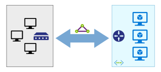

<!-- This file is generated! -->
<!-- See the templates in ./build/reference-architectures  -->
<!-- See data in index.json -->

# Connect an on-premises network to Azure

These reference architectures show proven practices for creating a robust network connection between an on-premises network and Azure. [Which should I choose?](./considerations.md)

<section class="series">
    <ul class="panelContent">
    <!-- VPN -->
<li style="display: flex; flex-direction: column;">
    <a href="./vpn.md" style="display: flex; flex-direction: column; flex: 1 0 auto;">
        

            

                

                    

                        

                            
                        

                    

                    

                        <h3>VPN</h3>
                        
Extend an on-premises network to Azure using a site-to-site virtual private network (VPN).

                    

                

            

        

    </a>
</li>
    <!-- ExpressRoute -->
<li style="display: flex; flex-direction: column;">
    <a href="./expressroute.md" style="display: flex; flex-direction: column; flex: 1 0 auto;">
        

            

                

                    

                        

                            
                        

                    

                    

                        <h3>ExpressRoute</h3>
                        
Extend an on-premises network to Azure using Azure ExpressRoute.

                    

                

            

        

    </a>
</li>
    <!-- ExpressRoute with VPN failover -->
<li style="display: flex; flex-direction: column;">
    <a href="./expressroute-vpn-failover.md" style="display: flex; flex-direction: column; flex: 1 0 auto;">
        

            

                

                    

                        

                            
                        

                    

                    

                        <h3>ExpressRoute with VPN failover</h3>
                        
Extend an on-premises network to Azure using Azure ExpressRoute, with a VPN as a failover connection.

                    

                

            

        

    </a>
</li>
    <!-- Hub-spoke topology -->
<li style="display: flex; flex-direction: column;">
    <a href="./hub-spoke.md" style="display: flex; flex-direction: column; flex: 1 0 auto;">
        

            

                

                    

                        

                            
                        

                    

                    

                        <h3>Hub-spoke topology</h3>
                        
The hub is a central point of connectivity to your on-premises network. The spokes are VNets that peer with the hub, and can be used to isolate workloads.

                    

                

            

        

    </a>
</li>
    </ul>
</section>

<ul class="panelContent cardsI">
</ul>