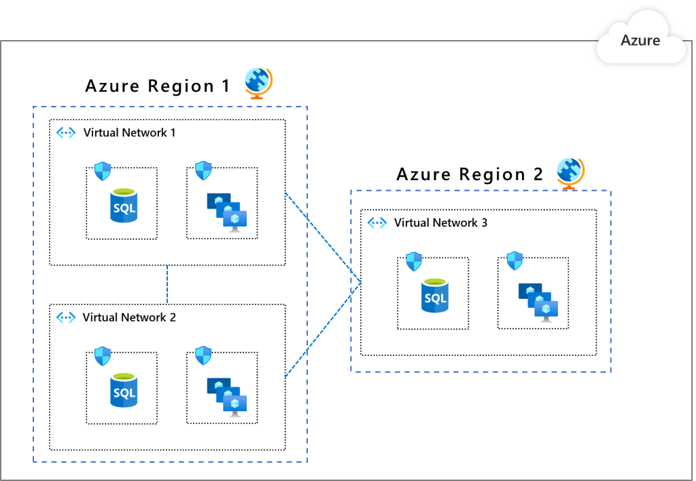

Segmentation is a model in which you take your networking footprint and create software defined perimeters using the different tools available as part of Azure's offerings. You then set rules that govern the traffic from/to these perimeters so that you can have different security postures for various parts your network. Where this becomes useful is when you place different applications (or parts of a given application) into these perimeters so that you govern the communication between these segmented entities. Another advantage of this model is that if a part of your application stack is compromised, you will be able to better contain the impact of this security breach and prevent it from laterally spreading through the rest of your network. This is a key principle associated with the [Zero Trust model published by Microsoft](https://www.microsoft.com/security/blog/2019/10/23/perimeter-based-network-defense-transform-zero-trust-model/) that aims to bring world class security thinking to your organization

## Segmentation Patterns

When you operate on Azure, you have a wide and diverse set of segmentation options available to help you be protected.  

1. [Subscription](/azure/cost-management-billing/manage/create-subscription) : Subscriptions are a high-level construct, which provides platform powered separation between entities. It is intended to carve out boundaries between large organizations within a company and communication between resources in different subscriptions needs to be explicitly provisioned.

2. [Virtual Network](/azure/virtual-network/virtual-networks-overview) : Virtual networks are created within a subscription in private address spaces and provide network level containment of resources with no traffic allowed by default between any two virtual networks. Like subscriptions, any communication between virtual networks needs to be explicitly provisioned.

3. [Network Security Groups (NSG)](/azure/virtual-network/security-overview) : NSGs are access control mechanisms for controlling traffic between resources within a virtual network and also with external networks (for example, the internet, other virtual networks etc.). NSGs can take your segmentation strategy to a granular level by creating perimeters for a subnet, group of VMs or even a single virtual machine.  

4. [Application Security Groups (ASGs)](/azure/virtual-network/application-security-groups): ASGs provide control mechanisms similar to NSGs but are referenced with an application context. It allows you to group a set of VMs under an application tag and define traffic rules that are then applied to each of the underlying VMs.  

5. [Azure Firewall](/azure/firewall/): Azure Firewall is a cloud native stateful Firewall as a service, which can be deployed in your virtual networks or in [Azure Virtual WAN](/azure/virtual-wan/virtual-wan-about) hub deployments for filtering traffic flowing between cloud resources, the Internet, and on-premise. You create rules or policies (using Azure Firewall or [Azure Firewall Manager](/azure/firewall-manager/overview)) specifying allow/deny traffic using layer 3 to layer 7 controls. You can also filter traffic going to the internet using both Azure Firewall and third parties by directing some or all traffic through third-party security providers for advanced filtering & user protection.  

Below are three common patterns we see amongst our customers when it comes to organizing your workload in Azure from a networking perspective. Each of these patterns provides a different type of isolation and connectivity. As to which one works best for your organization is a decision you have to make based on your organization's needs. With each of these models, we describe how segmentation can be done using the above-mentioned Azure Networking services.

It is also very much possible that the right design for your organization is something other than the ones we list here. And that is expected since there is no one (or three) size(s) that fits everyone and you might end up using principles from across these patterns listed below to create what's best for your organization. The beauty of the Azure platform is that it provides the flexibility and tooling you need to build that.

## Pattern 1: Single Virtual Network

In this pattern, all the components of your workload or, in some cases, your entire IT footprint is put inside a single virtual network. This pattern is possible if you are operating solely in a single region since a virtual network cannot span multiple regions.

The entities you would most likely use for creating segments inside this virtual network are either NSGs or ASGs. The choice of which depends on whether you want to refer to your segments as network subnets or application groups. The image below is an example of how such a segmented virtual network would look like.

In this you have Subnet1 where you placed your database workloads and another one, Subnet2, where you have placed your web workloads. You can put NSGs that say that the Subnet1 can talk only with Subnet2 and that the Subnet2 can talk to the Internet. You can also take this concept further in the presence of multiple workloads by carving out subnets, which for example will not allow one workload to communicate to the backend of another workload.

Although we used NSGs to illustrate how subnet traffic can be governed, you can also use a Network Virtualized Appliance from Azure Marketplace or Azure Firewall to enforce this segmentation

## Pattern 2: Multiple Virtual Networks with peering in between them

This pattern is the extension of the previous pattern where you have multiple virtual networks with potential peering connections. You might be opting this pattern for grouping applications into separate virtual networks or you might be needing presence in multiple Azure regions.  One key benefit you get here is the built-in segmentation by way of virtual networks since you have to explicitly peer a virtual network to another one for them to communicate (keep in mind that [virtual network peering](/azure/virtual-network/virtual-network-peering-overview) connectivity is not transitive). You can further segment within a virtual network in a manner similar to patter #1 by using NSGs/ASGs in the virtual networks.

## Pattern 3: Multiple Virtual Networks in a hub & spoke model

This pattern is a more advanced virtual network organization where you designate a virtual network in a given region as the hub for all the other virtual networks in that region. The connectivity between the hub virtual network and its spoke virtual networks is achieved by using [Azure virtual network peering](/azure/virtual-network/virtual-network-peering-overview). All traffic passes through the hub virtual network and it can act as a gateway to other hubs in different regions. In this model, you set up your security posture at the hubs so that they get to segment and govern the traffic in between the virtual networks in a scalable way. One benefit of this pattern is that. as your network topology grows, the security posture overhead does not grow (except when you expand to new regions).

The recommended Azure cloud native segmentation control here is Azure Firewall, which works across both Virtual Networks and subscriptions to govern traffic flows using layer 3 to layer 7 controls. You get to define how your communication rules look like (for example, virtual network X cannot talk with virtual network Y, but it can talk with virtual network Z, no Internet for Virtual network X except access to *.github.com etc.) and apply it consistently. With Azure Firewall Manager preview, you can centrally manage policies across multiple Azure Firewalls and enable DevOps teams to further customize local policies.

Now that we have defined the three patterns' topologies and the segmentation entities, let's see how each of them compares when it comes to the capabilities listed below.

| | Pattern 1 | Pattern 2 | Pattern 3
--- |--- | ---| ---
|**Connectivity/Routing: how each segment communicates to each other** | System routing provides default connectivity to any workload in any subnet | Same as a pattern 1 | No default connectivity between spoke virtual networks. A layer 3 router such as the Azure Firewall in the hub virtual network is required to enable connectivity.
|**Network level traffic filtering**| Traffic is allowed by default. NSG/ASG can be used for filtering this pattern. | Same as a pattern 1 | Traffic between spoke virtual networks is denied by default. Azure Firewall configuration can enable selected traffic for example, windowsupdate.com
|**Centralized logging**| NSG/ASG logs for the virtual network |  Aggregate NSG/ASG logs across all virtual networks | Azure Firewall logs to Azure Monitor all accepted/denied traffic that is sent via a hub
|**Unintended open public endpoints**| DevOps can accidentally open a public endpoint via incorrect NSG/ASG rules. | Same as a pattern 1 |Accidentally opened public endpoint in a spoke virtual network will not enable access as the return packet will be dropped via stateful firewall (that is, asymmetric routing)
**Application level protection** | NSG/ASG provides network layer support only.  | Same as a pattern 1 | Azure Firewall supports FQDN filtering for HTTP/S and MSSQL for outbound traffic and across virtual networks.