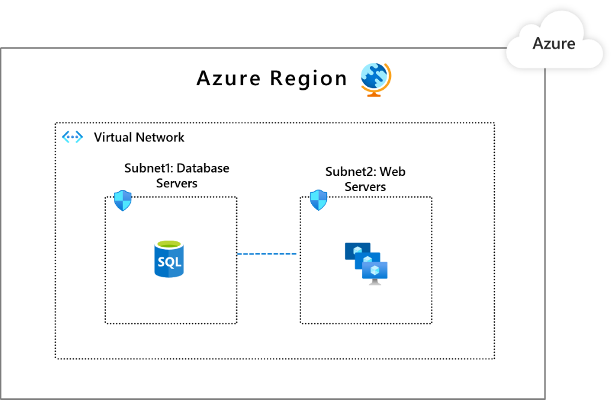

Segmentation is a model in which you take your networking footprint and create software defined perimeters using tools available in Microsoft Azure. You then set rules that govern the traffic from/to these perimeters so that you can have different security postures for various parts of your network. When you place different applications (or parts of a given application) into these perimeters, you can govern the communication between these segmented entities. If a part of your application stack is compromised, you'll be better able to contain the impact of this security breach, and prevent it from laterally spreading through the rest of your network. This ability is a key principle associated with the [Zero Trust model published by Microsoft](https://www.microsoft.com/security/blog/2019/10/23/perimeter-based-network-defense-transform-zero-trust-model/) that aims to bring world-class security thinking to your organization

## Segmentation Patterns

When you operate on Azure, you have a wide and diverse set of segmentation options available to help you be protected.

1. [Subscription](/azure/cost-management-billing/manage/create-subscription): Subscriptions are a high-level construct, which provides platform powered separation between entities. It's intended to carve out boundaries between large organizations within a company. Communication between resources in different subscriptions needs to be explicitly provisioned.

2. [Virtual Network](/azure/virtual-network/virtual-networks-overview): Virtual networks are created within a subscription in private address spaces. The networks provide network-level containment of resources, with no traffic allowed by default between any two virtual networks. Like subscriptions, any communication between virtual networks needs to be explicitly provisioned.

3. [Network Security Groups (NSG)](/azure/virtual-network/security-overview): NSGs are access control mechanisms for controlling traffic between resources within a virtual network. An NSG also controls traffic with external networks, such as the internet, other virtual networks, and so on. NSGs can take your segmentation strategy to a granular level by creating perimeters for a subnet, group of VMs, or even a single virtual machine.

4. [Application Security Groups (ASGs)](/azure/virtual-network/application-security-groups): ASGs provide control mechanisms similar to NSGs but are referenced with an application context. An ASG allows you to group a set of VMs under an application tag. It can define traffic rules that are then applied to each of the underlying VMs.

5. [Azure Firewall](/azure/firewall/): Azure Firewall is a cloud native stateful Firewall as a service. This firewall can be deployed in your virtual networks or in [Azure Virtual WAN](/azure/virtual-wan/virtual-wan-about) hub deployments for filtering traffic that flows between cloud resources, the Internet, and on-premise. You create rules or policies (using Azure Firewall or [Azure Firewall Manager](/azure/firewall-manager/overview)) specifying allow/deny traffic using layer 3 to layer 7 controls. You can also filter traffic that goes to the internet using both Azure Firewall and third parties. Direct some or all traffic through third-party security providers for advanced filtering and user protection.

The following three patterns are common when it comes to organizing your workload in Azure from a networking perspective. Each of these patterns provides a different type of isolation and connectivity. Choosing which model works best for your organization is a decision you should make based on your organization's needs. With each of these models, we describe how segmentation can be done using the above Azure Networking services.

It's also possible that the right design for your organization is something other than the ones we list here. And that outcome is expected, because there's no one (or three) size(s) that fits everyone. You might end up using principles from across these patterns to create what's best for your organization. The Azure platform provides the flexibility and tooling you need.

## Pattern 1: Single Virtual Network

In this pattern, all the components of your workload or, in some cases, your entire IT footprint is put inside a single virtual network. This pattern is possible if you're operating solely in a single region since a virtual network can't span multiple regions.

The entities you would most likely use for creating segments inside this virtual network are either NSGs or ASGs. The choice of which depends on whether you want to refer to your segments as network subnets or application groups. The image below is an example of how such a segmented virtual network would look like.

In this setup, you have Subnet1, where you placed your database workloads, and Subnet2, where you've placed your web workloads. You can put NSGs that say the Subnet1 can talk only with Subnet2, and the Subnet2 can talk to the Internet. You can also take this concept further in the presence of many workloads. Carve out subnets that, for example, won't allow one workload to communicate to the backend of another workload.

Although we used NSGs to illustrate how subnet traffic can be governed, you can also enforce this segmentation by using a Network Virtualized Appliance from Azure Marketplace or Azure Firewall.

## Pattern 2: Multiple Virtual Networks with peering in between them

This pattern is the extension of the previous pattern where you have multiple virtual networks with potential peering connections. You might be opting this pattern for grouping applications into separate virtual networks or you might be needing presence in multiple Azure regions.  You get built-in segmentation through virtual networks, because you explicitly have to peer a virtual network to another one for them to communicate. (Keep in mind that [virtual network peering](/azure/virtual-network/virtual-network-peering-overview) connectivity isn't transitive.) To further segment within a virtual network in a manner similar to pattern 1, use NSGs/ASGs in the virtual networks.

## Pattern 3: Multiple Virtual Networks in a hub & spoke model

This pattern is a more advanced virtual network organization where you choose a virtual network in a given region as the hub for all the other virtual networks in that region. The connectivity between the hub virtual network and its spoke virtual networks is achieved by using [Azure virtual network peering](/azure/virtual-network/virtual-network-peering-overview). All traffic passes through the hub virtual network and it can act as a gateway to other hubs in different regions. You set up your security posture at the hubs, so they get to segment and govern the traffic between the virtual networks in a scalable way. One benefit of this pattern is that. as your network topology grows, the security posture overhead doesn't grow (except when you expand to new regions).

The recommended Azure cloud native segmentation control is Azure Firewall. Azure Firewall works across both Virtual Networks and subscriptions to govern traffic flows using layer 3 to layer 7 controls. You get to define how your communication rules look like (for example, virtual network X can't talk with virtual network Y but can talk with virtual network Z, no Internet for Virtual network X except for access to `*.github.com`, and so on) and apply it consistently. With Azure Firewall Manager preview, you can centrally manage policies across multiple Azure Firewalls and enable DevOps teams to further customize local policies.

The following table shows a comparison of the three pattern topologies:

| | Pattern 1 | Pattern 2 | Pattern 3 |
|--|--|--|--|
|**Connectivity/Routing: how each segment communicates to each other** | System routing provides default connectivity to any workload in any subnet | Same as a pattern 1 | No default connectivity between spoke virtual networks. A layer 3 router such as the Azure Firewall in the hub virtual network is required to enable connectivity.|
|**Network level traffic filtering**| Traffic is allowed by default. NSG/ASG can be used for filtering this pattern. | Same as a pattern 1 | Traffic between spoke virtual networks is denied by default. Azure Firewall configuration can enable selected traffic, such as `windowsupdate.com`.|
|**Centralized logging**| NSG/ASG logs for the virtual network |  Aggregate NSG/ASG logs across all virtual networks | Azure Firewall logs to Azure Monitor all accepted/denied traffic that is sent via a hub.|
|**Unintended open public endpoints**| DevOps can accidentally open a public endpoint via incorrect NSG/ASG rules. | Same as a pattern 1 |Accidentally opened public endpoint in a spoke virtual network won't enable access. The return packet will be dropped via stateful firewall (asymmetric routing).|
|**Application level protection** | NSG/ASG provides network layer support only.  | Same as a pattern 1 | Azure Firewall supports FQDN filtering for HTTP/S and MSSQL for outbound traffic and across virtual networks.|

## Next steps

Learn more about the component technologies:

- [What is Azure Virtual Network?](/azure/virtual-network/virtual-networks-overview)
- [What is Azure Firewall?](/azure/firewall/overview)
- [Azure Monitor overview](/azure/azure-monitor/overview)

Explore related architectures:

- [Azure firewall architecture guide](../../example-scenario/firewalls/index.yml)
- [Firewall and Application Gateway for virtual networks](../../example-scenario/gateway/firewall-application-gateway.yml)
- [Azure Automation in a hybrid environment](../../hybrid/azure-automation-hybrid.yml)
- [Baseline architecture for an Azure Kubernetes Service (AKS) cluster](../containers/aks/secure-baseline-aks.yml)
