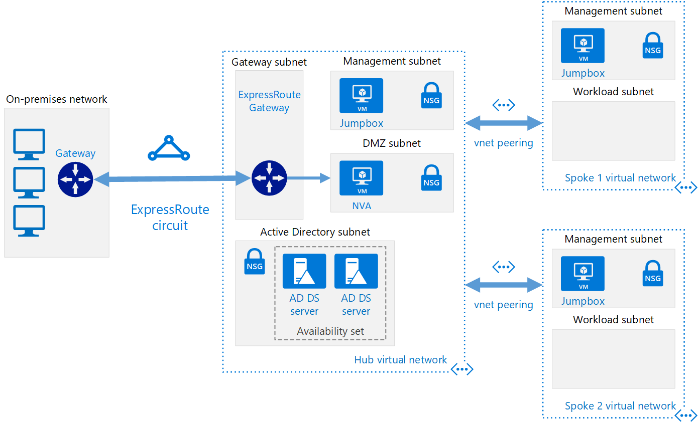

# Hub-spoke network topology with shared services in Azure

This reference architecture builds on the [hub-spoke][guidance-hub-spoke] reference architecture to include shared services in the hub that can be consumed by all spokes.

As a first step toward migrating a datacenter to the cloud, the first services that need to be shared are identity and security. This reference architecture shows how to extend Active Directory services from your on-premises datacenter to Azure, and how to add a network virtual appliance (NVA) that can act as a firewall. The firewall functionality can also be accomplished using [Azure Firewall](/azure/firewall/), a cloud-based network security service.



*Download a [Visio file][visio-download] of this architecture*

The benefits of this topology include:

- **Cost savings** by centralizing services that can be shared by multiple workloads, such as network virtual appliances (NVAs) and DNS servers, in a single location.
- **Overcome subscriptions limits** by peering VNets from different subscriptions to the central hub.
- **Separation of concerns** between central IT (SecOps, InfraOps) and workloads (DevOps).

Typical uses for this architecture include:

- Workloads deployed in different environments, such as development, testing, and production, that require shared services such as DNS, IDS, NTP, or AD DS. Shared services are placed in the hub VNet, while each environment is deployed to a spoke to maintain isolation.
- Workloads that do not require connectivity to each other, but require access to shared services.
- Enterprises that require central control over security aspects, such as a firewall in the hub as a DMZ, and segregated management for the workloads in each spoke.

## Architecture

The architecture consists of the following components.

- **On-premises network**. A private local-area network running within an organization.

- **VPN device**. A device or service that provides external connectivity to the on-premises network. The VPN device may be a hardware device, or a software solution such as the Routing and Remote Access Service (RRAS) in Windows Server 2012. For a list of supported VPN appliances and information on configuring selected VPN appliances for connecting to Azure, see [About VPN devices for Site-to-Site VPN Gateway connections][vpn-appliance].

- **VPN virtual network gateway or ExpressRoute gateway**. The virtual network gateway enables the VNet to connect to the VPN device, or ExpressRoute circuit, used for connectivity with your on-premises network. For more information, see [Connect an on-premises network to a Microsoft Azure virtual network][connect-to-an-Azure-vnet].

> [!NOTE]
> The deployment scripts for this reference architecture use a VPN gateway for connectivity, and a VNet in Azure to simulate your on-premises network.

- **Hub VNet**. Azure VNet used as the hub in the hub-spoke topology. The hub is the central point of connectivity to your on-premises network, and a place to host services that can be consumed by the different workloads hosted in the spoke VNets.

- **Gateway subnet**. The virtual network gateways are held in the same subnet.

- **Shared services subnet**. A subnet in the hub VNet used to host services that can be shared among all spokes, such as DNS or AD DS.

- **DMZ subnet**. A subnet in the hub VNet used to host NVAs that can act as security appliances, such as firewalls.

- **Spoke VNets**. One or more Azure VNets that are used as spokes in the hub-spoke topology. Spokes can be used to isolate workloads in their own VNets, managed separately from other spokes. Each workload might include multiple tiers, with multiple subnets connected through Azure load balancers. For more information about the application infrastructure, see [Running Windows VM workloads][windows-vm-ra] and [Running Linux VM workloads][linux-vm-ra].

- **VNet peering**. Two VNets can be connected using a [peering connection][vnet-peering]. Peering connections are non-transitive, low latency connections between VNets. Once peered, the VNets exchange traffic by using the Azure backbone, without the need for a router. In a hub-spoke network topology, you use VNet peering to connect the hub to each spoke. You can peer virtual networks in the same region, or different regions (Global VNet Peering). For more information, see [Requirements and constraints][vnet-peering-requirements].

> [!NOTE]
> This article only covers [Resource Manager](/azure/azure-resource-manager/resource-group-overview) deployments, but you can also connect a classic VNet to a Resource Manager VNet in the same subscription. That way, your spokes can host classic deployments and still benefit from services shared in the hub.

## Recommendations

All the recommendations for the [hub-spoke][guidance-hub-spoke] reference architecture also apply to the shared services reference architecture.

Also, the following recommendations apply for most scenarios under shared services. Follow these recommendations unless you have a specific requirement that overrides them.

### Identity

Most enterprise organizations have an Active Directory Domain Services (AD DS) environment in their on-premises datacenter. To facilitate management of assets moved to Azure from your on-premises network that depend on AD DS, it is recommended to host AD DS domain controllers in Azure.

If you use Group Policy Objects, that you want to control separately for Azure and your on-premises environment, use a different AD site for each Azure region. Place your domain controllers in a central VNet (hub) that dependent workloads can access.

### Security

As you move workloads from your on-premises environment to Azure, some of these workloads will require to be hosted in VMs. For compliance reasons, you may need to enforce restrictions on traffic traversing those workloads.

You can use network virtual appliances (NVAs) in Azure to host different types of security and performance services. If you are familiar with a given set of appliances on-premises today, it is recommended to use the same virtualized appliances in Azure, where applicable.

> [!NOTE]
> The deployment scripts for this reference architecture use an Ubuntu VM with IP forwarding enabled to mimic a network virtual appliance.

## Deploy the solution

A deployment for this architecture is available on [GitHub][ref-arch-repo]. The deployment creates the following resource groups in your subscription:

- hub-adds-rg
- hub-nva-rg
- hub-vnet-rg
- onprem-vnet-rg
- spoke1-vnet-rg
- spoke2-vnet-rg

The template parameter files refer to these names, so if you change them, update the parameter files to match.

### Prerequisites

[!INCLUDE [ref-arch-prerequisites.md](../../../includes/ref-arch-prerequisites.md)]

### Deploy the simulated on-premises datacenter using azbb

Follow these steps to deploy the architecture:

1. Navigate to the `hybrid-networking\shared-services-stack\` folder of the GitHub repository.

1. Open the `shared-services-stack.json` file.

1. Search for all instances of `[replace-with-username]`, `[replace-with-safe-mode-username]`,`[replace-with-password]`, and `[replace-with-safe-mode-password]`. Enter values for the user name and password in the parameters and save the file.

1. Search for all instances of `[replace-with-shared-key]` and enter a value for a shared key. The values must match.

1. Save the file.

1. Run the following command:

   ```bash
   azbb -s <subscription_id> -g onprem-vnet-rg -l <location> -p shared-services-stack.json --deploy
   ```

1. Wait for the deployment to finish. This deployment creates four virtual networks, four virtual machines to function as jumpboxes, four virtual machines to act as Active Directory domain controllers, two VPN Gateways, and Azure Firewall. The VPN gateway creation can take more than 40 minutes to complete.

### Test connectivity

Test connectivity from the simulated on-premises environment to the hub VNet.

1. Use the Azure portal to find the VM named `jb-vm1` in the `onprem-jb-rg` resource group.

2. Click `Connect` to open a remote desktop session to the VM. Use the password that you specified in the `onprem.json` parameter file.

3. Open a PowerShell console in the VM, and use the `Test-NetConnection` cmdlet to verify that you can connect to the jumpbox VM in the hub VNet.

   ```powershell
   Test-NetConnection 10.0.0.36 -CommonTCPPort RDP
   ```

The output should look similar to the following:

```powershell
ComputerName     : 10.0.0.36
RemoteAddress    : 10.0.0.36
RemotePort       : 3389
InterfaceAlias   : Ethernet 2
SourceAddress    : 192.168.1.000
TcpTestSucceeded : True
```

> [!NOTE]
> By default, Windows Server VMs do not allow ICMP responses in Azure. If you want to use `ping` to test connectivity, you need to enable ICMP traffic in the Windows Advanced Firewall for each VM.

Repeat the same steps to test connectivity to the spoke VNets:

```powershell
Test-NetConnection 10.1.0.36 -CommonTCPPort RDP
Test-NetConnection 10.2.0.36 -CommonTCPPort RDP
```

<!-- links -->

[azure-cli-2]: /azure/install-azure-cli
[azbb]: https://github.com/mspnp/template-building-blocks/wiki/Install-Azure-Building-Blocks
[guidance-hub-spoke]: ./hub-spoke.md
[azure-vpn-gateway]: /azure/vpn-gateway/vpn-gateway-about-vpngateways
[connect-to-an-Azure-vnet]: https://technet.microsoft.com/library/dn786406.aspx
[guidance-expressroute]: ./expressroute.md
[guidance-vpn]: ./vpn.md
[linux-vm-ra]: ../virtual-machines-linux/index.md
[hybrid-ha]: ./expressroute-vpn-failover.md
[naming conventions]: /azure/guidance/guidance-naming-conventions
[resource-manager-overview]: /azure/azure-resource-manager/resource-group-overview
[virtual datacenter]: https://aka.ms/vdc
[vnet-peering]: /azure/virtual-network/virtual-network-peering-overview
[vnet-peering-limit]: /azure/azure-subscription-service-limits#networking-limits
[vnet-peering-requirements]: /azure/virtual-network/virtual-network-peering-overview#requirements-and-constraints
[vpn-appliance]: /azure/vpn-gateway/vpn-gateway-about-vpn-devices
[windows-vm-ra]: ../virtual-machines-windows/index.md

[visio-download]: https://archcenter.blob.core.windows.net/cdn/hybrid-network-hub-spoke.vsdx
[ref-arch-repo]: https://github.com/mspnp/reference-architectures
