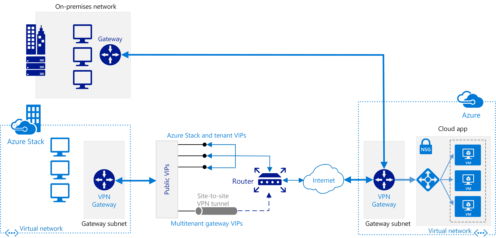

# Connect an on-premises network to Azure using a VPN gateway

This reference architecture shows how to extend a network on premises or on Azure Stack to Azure, using a site-to-site virtual private network (VPN). Traffic flows between the on-premises network and an Azure Virtual Network (VNet) through an IPSec VPN tunnel or through the Azure Stack multitenant VPN gateway. [**Deploy this solution**](#deploy-the-solution).

A diagram of the VPN gateway architecture. An on-premises network connects to an Azure virtual network through a VPN gateway. A virtual network in Azure Stack also connects to the VPN gateway through public VIPs.

*Download a [Visio file][visio-download] of this architecture.*

## Architecture

The architecture consists of the following components.

- **On-premises network**. A private local-area network running within an organization.

- **Azure Stack**. A network environment on an Azure Stack tenant subscription, running within an organization. The Azure Stack [VPN][az-vpn] gateway sends encrypted traffic across a public connection to virtual IP (VIP) addresses and includes the following components:
    - Gateway subnet. A special subnet required to deploy the VPN Gateway on Azure Stack.
    - Local network gateway. Indicates the target IP of the VPN gateway in Azure, as well as the address space of the Azure VNet.
    - Site-to-site VPN tunnel. The connection type (IPSec) and the key shared with the Azure VPN Gateway to encrypt traffic.

- **VPN appliance**. A device or service that provides external connectivity to the on-premises network. The VPN appliance may be a hardware device, or it can be a software solution such as the Routing and Remote Access Service (RRAS) in Windows Server 2012. For a list of supported VPN appliances and information on configuring them to connect to an Azure VPN gateway, see the instructions for the selected device in the article [About VPN devices for Site-to-Site VPN Gateway connections][vpn-appliance].

- **Virtual network (VNet)**. The cloud application and the components for the Azure VPN gateway reside in the same [VNet][azure-virtual-network].

- **Azure VPN gateway**. The [VPN gateway][azure-vpn-gateway] service enables you to connect the VNet to the on-premises network through a VPN appliance or to connect to Azure Stack through a site-to-site VPN tunnel. For more information, see [Connect an on-premises network to a Microsoft Azure virtual network][connect-to-an-Azure-vnet]. The VPN gateway includes the following elements:

  - **Virtual network gateway**. A resource that provides a virtual VPN appliance for the VNet. It is responsible for routing traffic from the on-premises network to the VNet.
  - **Local network gateway**. An abstraction of the on-premises VPN appliance. Network traffic from the cloud application to the on-premises network is routed through this gateway.
  - **Connection**. The connection has properties that specify the connection type (IPSec) and the key shared with the on-premises VPN appliance to encrypt traffic.
  - **Gateway subnet**. The virtual network gateway is held in its own subnet, which is subject to various requirements, described in the Recommendations section below.

- **Cloud application**. The application hosted in Azure. It might include multiple tiers, with multiple subnets connected through Azure load balancers. For more information about the application infrastructure, see [Running Windows VM workloads][windows-vm-ra] and [Running Linux VM workloads][linux-vm-ra].

- **Internal load balancer**. Network traffic from the VPN gateway is routed to the cloud application through an internal load balancer. The load balancer is located in the front-end subnet of the application.

## Recommendations

The following recommendations apply for most scenarios. Follow these recommendations unless you have a specific requirement that overrides them.

### VNet and gateway subnet

Create an Azure VNet with an address space large enough for all of your required resources. Ensure that the VNet address space has sufficient room for growth if additional VMs are likely to be needed in the future. The address space of the VNet must not overlap with the on-premises network. For example, the diagram above uses the address space 10.20.0.0/16 for the VNet.

Create a subnet named *GatewaySubnet*, with an address range of /27. This subnet is required by the virtual network gateway. Allocating 32 addresses to this subnet will help to prevent reaching gateway size limitations in the future. Also, avoid placing this subnet in the middle of the address space. A good practice is to set the address space for the gateway subnet at the upper end of the VNet address space. The example shown in the diagram uses 10.20.255.224/27.  Here is a quick procedure to calculate the [CIDR]:

1. Set the variable bits in the address space of the VNet to 1, up to the bits being used by the gateway subnet, then set the remaining bits to 0.
2. Convert the resulting bits to decimal and express it as an address space with the prefix length set to the size of the gateway subnet.

For example, for a VNet with an IP address range of 10.20.0.0/16, applying step #1 above becomes 10.20.0b11111111.0b11100000.  Converting that to decimal and expressing it as an address space yields 10.20.255.224/27.

> [!WARNING]
> Do not deploy any VMs to the gateway subnet. Also, do not assign an NSG to this subnet, as it will cause the gateway to stop functioning.
>

### Virtual network gateway

Allocate a public IP address for the virtual network gateway.

Create the virtual network gateway in the gateway subnet and assign it the newly allocated public IP address. Use the gateway type that most closely matches your requirements and that is enabled by your VPN appliance:

- Create a [policy-based gateway][policy-based-routing] if you need to closely control how requests are routed based on policy criteria such as address prefixes. Policy-based gateways use static routing, and only work with site-to-site connections.

- Create a [route-based gateway][route-based-routing] if you connect to the on-premises network using RRAS, support multi-site or cross-region connections, or implement VNet-to-VNet connections (including routes that traverse multiple VNets). Route-based gateways use dynamic routing to direct traffic between networks. They can tolerate failures in the network path better than static routes because they can try alternative routes. Route-based gateways can also reduce the management overhead because routes might not need to be updated manually when network addresses change.

For a list of supported VPN appliances, see [About VPN devices for Site-to-Site VPN Gateway connections][vpn-appliances].

> [!NOTE]
> After the gateway has been created, you cannot change between gateway types without deleting and re-creating the gateway.
>

Select the Azure VPN gateway SKU that most closely matches your throughput requirements. For more information, see [Gateway SKUs][azure-gateway-skus]

> [!NOTE]
> The Basic SKU is not compatible with Azure ExpressRoute. You can [change the SKU][changing-SKUs] after the gateway has been created.
>

You are charged based on the amount of time that the gateway is provisioned and available. See [VPN Gateway Pricing][azure-gateway-charges].

Create routing rules for the gateway subnet that direct incoming application traffic from the gateway to the internal load balancer, rather than allowing requests to pass directly to the application VMs.

### On-premises network connection

Create a local network gateway. Specify the public IP address of the on-premises VPN appliance, and the address space of the on-premises network. Note that the on-premises VPN appliance must have a public IP address that can be accessed by the local network gateway in Azure VPN Gateway. The VPN device cannot be located behind a network address translation (NAT) device.

Create a site-to-site connection for the virtual network gateway and the local network gateway. Select the site-to-site (IPSec) connection type, and specify the shared key. Site-to-site encryption with the Azure VPN gateway is based on the IPSec protocol, using preshared keys for authentication. You specify the key when you create the Azure VPN gateway. You must configure the VPN appliance running on-premises with the same key. Other authentication mechanisms are not currently supported.

Ensure that the on-premises routing infrastructure is configured to forward requests intended for addresses in the Azure VNet to the VPN device.

Open any ports required by the cloud application in the on-premises network.

Test the connection to verify that:

- The on-premises VPN appliance correctly routes traffic to the cloud application through the Azure VPN gateway.
- The VNet correctly routes traffic back to the on-premises network.
- Prohibited traffic in both directions is blocked correctly.

### Azure Stack network connection

This reference architecture shows how to connect a virtual network in your Azure Stack deployment to a virtual network in Azure through the Azure Stack multitenant VPN gateway. A common scenario is to isolate critical operations and sensitive data in Azure Stack and take advantage of Azure for public transaction and transitory, non-sensitive operations.

In this architecture, network traffic flows through a VPN tunnel using the multitenant gateway on Azure Stack. Alternatively, traffic can flow over the Internet between Azure Stack and Azure through tenant VIPs, Azure ExpressRoute, or a network virtual appliance that acts as the VPN endpoint.

### Azure Stack virtual network gateway capacity

Both the Azure VPN Gateway and the Azure Stack VPN gateway support Border Gateway Protocol (BGP) for exchanging routing information between Azure and Azure Stack. Azure Stack does not support static routing for the multitenant gateway.

Create an Azure Stack VNet with an assigned IP address space large enough for all your required resources. The address space of the VNet must not overlap with any other network that is going to be connected to this VNet.

A public IP address is assigned to the multitenant gateway during the deployment of Azure Stack. It is taken from the public VIP pool. The Azure Stack operator has no control over what IP address is used but can determine its assignment.

> [!CAUTION]
> Workload VMs cannot be deployed on the Azure Stack gateway subnet. Also, do not assign an NSG to this subnet, as it will cause the gateway to stop functioning.

## Scalability considerations

You can achieve limited vertical scalability by moving from the Basic or Standard VPN Gateway SKUs to the High Performance VPN SKU.

For VNets that expect a large volume of VPN traffic, consider distributing the different workloads into separate smaller VNets and configuring a VPN gateway for each of them.

You can partition the VNet either horizontally or vertically. To partition horizontally, move some VM instances from each tier into subnets of the new VNet. The result is that each VNet has the same structure and functionality. To partition vertically, redesign each tier to divide the functionality into different logical areas (such as handling orders, invoicing, customer account management, and so on). Each functional area can then be placed in its own VNet.

Replicating an on-premises Active Directory domain controller in the VNet, and implementing DNS in the VNet, can help to reduce some of the security-related and administrative traffic flowing from on-premises to the cloud. For more information, see [Extending Active Directory Domain Services (AD DS) to Azure][adds-extend-domain].

## Availability considerations

If you need to ensure that the on-premises network remains available to the Azure VPN gateway, implement a failover cluster for the on-premises VPN gateway.

If your organization has multiple on-premises sites, create [multi-site connections][vpn-gateway-multi-site] to one or more Azure VNets. This approach requires dynamic (route-based) routing, so make sure that the on-premises VPN gateway supports this feature.

For details about service level agreements, see [SLA for VPN Gateway][sla-for-vpn-gateway].

On Azure Stack, you can expand VPN gateways to include interfaces to multiple Azure Stack stamps and Azure deployments.

## Manageability considerations

Monitor diagnostic information from on-premises VPN appliances. This process depends on the features provided by the VPN appliance. For example, if you are using the Routing and Remote Access Service on Windows Server 2012, [RRAS logging][rras-logging].

Use [Azure VPN gateway diagnostics][gateway-diagnostic-logs] to capture information about connectivity issues. These logs can be used to track information such as the source and destinations of connection requests, which protocol was used, and how the connection was established (or why the attempt failed).

Monitor the operational logs of the Azure VPN gateway using the audit logs available in the Azure portal. Separate logs are available for the local network gateway, the Azure network gateway, and the connection. This information can be used to track any changes made to the gateway, and can be useful if a previously functioning gateway stops working for some reason.

A screenshot of the Azure portal, showing audit log events filtered by date.

Monitor connectivity, and track connectivity failure events. You can use a monitoring package such as [Nagios][nagios] to capture and report this information.

To troubleshoot the connection, see [Troubleshoot a hybrid VPN connection](./troubleshoot-vpn.md).

## Security considerations

Generate a different shared key for each VPN gateway. Use a strong shared key to help resist brute-force attacks.

For Azure Stack connections, generate a different shared key for each VPN tunnel. Use a strong shared key to help resist brute-force attacks.

> [!NOTE]
> Currently, you cannot use Azure Key Vault to preshare keys for the Azure VPN gateway.
>

Ensure that the on-premises VPN appliance uses an encryption method that is [compatible with the Azure VPN gateway][vpn-appliance-ipsec]. For policy-based routing, the Azure VPN gateway supports the AES256, AES128, and 3DES encryption algorithms. Route-based gateways support AES256 and 3DES.

If your on-premises VPN appliance is on a perimeter network (DMZ) that has a firewall between the perimeter network and the Internet, you might have to configure additional firewall rules to allow the site-to-site VPN connection.

If the application in the VNet sends data to the Internet, consider [implementing forced tunneling][forced-tunneling] to route all Internet-bound traffic through the on-premises network. This approach enables you to audit outgoing requests made by the application from the on-premises infrastructure.

> [!NOTE]
> Forced tunneling can impact connectivity to Azure services (the Storage Service, for example) and the Windows license manager.
>

## Deploy the solution

To deploy this reference architecture, see the [GitHub readme][readme]. 

<!-- links -->

[adds-extend-domain]: ../identity/adds-extend-domain.md
[az-vpn]: /azure/azure-stack/azure-stack-connect-vpn
[azure-gateway-charges]: https://azure.microsoft.com/pricing/details/vpn-gateway/
[azure-gateway-skus]: /azure/vpn-gateway/vpn-gateway-about-vpngateways#gwsku
[azure-virtual-network]: /azure/virtual-network/virtual-networks-overview
[azure-vpn-gateway]: https://azure.microsoft.com/services/vpn-gateway/
[changing-SKUs]: https://azure.microsoft.com/blog/azure-virtual-network-gateway-improvements/
[CIDR]: https://en.wikipedia.org/wiki/Classless_Inter-Domain_Routing
[connect-to-an-Azure-vnet]: /office365/enterprise/connect-an-on-premises-network-to-a-microsoft-azure-virtual-network
[forced-tunneling]: /azure/vpn-gateway/vpn-gateway-about-forced-tunneling
[gateway-diagnostic-logs]: https://blogs.technet.microsoft.com/keithmayer/2016/10/12/step-by-step-capturing-azure-resource-manager-arm-vnet-gateway-diagnostic-logs/
[linux-vm-ra]: ../virtual-machines-linux/index.md
[nagios]: https://www.nagios.org/
[policy-based-routing]: https://en.wikipedia.org/wiki/Policy-based_routing
[readme]: https://github.com/mspnp/reference-architectures/blob/master/hybrid-networking/vpn/README.md
[route-based-routing]: https://en.wikipedia.org/wiki/Static_routing
[rras-logging]: https://www.petri.com/enable-diagnostic-logging-in-windows-server-2012-r2-routing-and-remote-access
[sla-for-vpn-gateway]: https://azure.microsoft.com/support/legal/sla/vpn-gateway/
[visio-download]: https://archcenter.blob.core.windows.net/cdn/hybrid-network-architectures.vsdx
[vpn-appliance-ipsec]: /azure/vpn-gateway/vpn-gateway-about-vpn-devices#ipsec
[vpn-appliance]: /azure/vpn-gateway/vpn-gateway-about-vpn-devices
[vpn-appliances]: /azure/vpn-gateway/vpn-gateway-about-vpn-devices
[vpn-gateway-multi-site]: /azure/vpn-gateway/vpn-gateway-multi-site
[windows-vm-ra]: ../virtual-machines-windows/index.md
