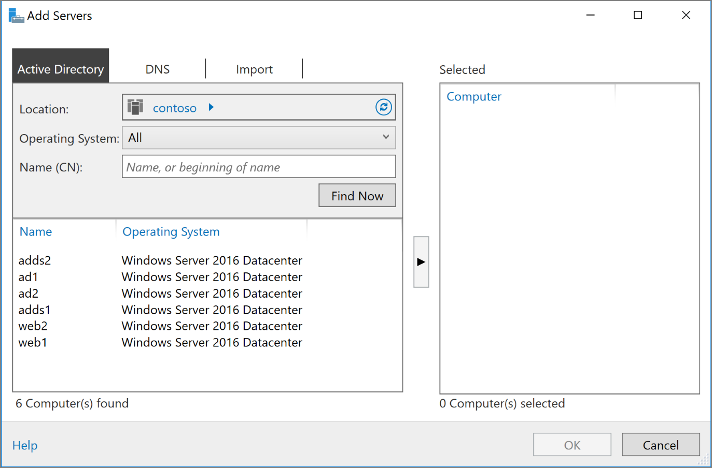

# Extend Active Directory Domain Services (AD DS) to Azure

This reference architecture shows how to extend your Active Directory environment to Azure to provide distributed authentication services using Active Directory Domain Services (AD DS). [**Deploy this solution**.](#deploy-the-solution)

[![0]][0] 

*Download a [Visio file][visio-download] of this architecture.*

AD DS is used to authenticate user, computer, application, or other identities that are included in a security domain. It can be hosted on-premises, but if your application is hosted partly on-premises and partly in Azure, it may be more efficient to replicate this functionality in Azure. This can reduce the latency caused by sending authentication and local authorization requests from the cloud back to AD DS running on-premises. 

This architecture is commonly used when the on-premises network and the Azure virtual network are connected by a VPN or ExpressRoute connection. This architecture also supports bidirectional replication, meaning changes can be made either on-premises or in the cloud, and both sources will be kept consistent. Typical uses for this architecture include hybrid applications in which functionality is distributed between on-premises and Azure, and applications and services that perform authentication using Active Directory.

For additional considerations, see [Choose a solution for integrating on-premises Active Directory with Azure][considerations]. 

## Architecture 

This architecture extends the architecture shown in [DMZ between Azure and the Internet][implementing-a-secure-hybrid-network-architecture-with-internet-access]. It has the following components.

* **On-premises network**. The on-premises network includes local Active Directory servers that can perform authentication and authorization for components located on-premises.
* **Active Directory servers**. These are domain controllers implementing directory services (AD DS) running as VMs in the cloud. These servers can provide authentication of components running in your Azure virtual network.
* **Active Directory subnet**. The AD DS servers are hosted in a separate subnet. Network security group (NSG) rules protect the AD DS servers and provide a firewall against traffic from unexpected sources.
* **Azure Gateway and Active Directory synchronization**. The Azure gateway provides a connection between the on-premises network and the Azure VNet. This can be a [VPN connection][azure-vpn-gateway] or [Azure ExpressRoute][azure-expressroute]. All synchronization requests between the Active Directory servers in the cloud and on-premises pass through the gateway. User-defined routes (UDRs) handle routing for on-premises traffic that passes to Azure. Traffic to and from the Active Directory servers does not pass through the network virtual appliances (NVAs) used in this scenario.

For more information about configuring UDRs and the NVAs, see [Implementing a secure hybrid network architecture in Azure][implementing-a-secure-hybrid-network-architecture]. 

## Recommendations

The following recommendations apply for most scenarios. Follow these recommendations unless you have a specific requirement that overrides them. 

### VM recommendations

Determine your [VM size][vm-windows-sizes] requirements based on the expected volume of authentication requests. Use the specifications of the machines hosting AD DS on premises as a starting point, and match them with the Azure VM sizes. Once deployed, monitor utilization and scale up or down based on the actual load on the VMs. For more information about sizing AD DS domain controllers, see [Capacity Planning for Active Directory Domain Services][capacity-planning-for-adds].

Create a separate virtual data disk for storing the database, logs, and SYSVOL for Active Directory. Do not store these items on the same disk as the operating system. Note that by default, data disks that are attached to a VM use write-through caching. However, this form of caching can conflict with the requirements of AD DS. For this reason, set the *Host Cache Preference* setting on the data disk to *None*. For more information, see [Placement of the Windows Server AD DS database and SYSVOL][adds-data-disks].

Deploy at least two VMs running AD DS as domain controllers and add them to an [availability set][availability-set].

### Networking recommendations

Configure the VM network interface (NIC) for each AD DS server with a static private IP address for full domain name service (DNS) support. For more information, see [How to set a static private IP address in the Azure portal][set-a-static-ip-address].

> [!NOTE]
> Do not configure the VM NIC for any AD DS with a public IP address. See [Security considerations][security-considerations] for more details.
> 
> 

The Active Directory subnet NSG requires rules to permit incoming traffic from on-premises. For detailed information on the ports used by AD DS, see [Active Directory and Active Directory Domain Services Port Requirements][ad-ds-ports]. Also, ensure the UDR tables do not route AD DS traffic through the NVAs used in this architecture. 

### Active Directory site

In AD DS, a site represents a physical location, network, or collection of devices. AD DS sites are used to manage AD DS database replication by grouping together AD DS objects that are located close to one another and are connected by a high speed network. AD DS includes logic to select the best strategy for replacating the AD DS database between sites.

We recommend that you create an AD DS site including the subnets defined for your application in Azure. Then, configure a site link between your on-premises AD DS sites, and AD DS will automatically perform the most efficient database replication possible. Note that this database replication requires little beyond the initial configuration.

### Active Directory operations masters

The operations masters role can be assigned to AD DS domain controllers to support consistency checking between instances of replicated AD DS databases. There are five operations master roles: schema master, domain naming master, relative identifier master, primary domain controller master emulator, and infrastructure master. For more information about these roles, see [What are Operations Masters?][ad-ds-operations-masters].

We recommend you do not assign operations masters roles to the domain controllers deployed in Azure.

### Monitoring

Monitor the resources of the domain controller VMs as well as the AD DS Services and create a plan to quickly correct any problems. For more information, see [Monitoring Active Directory][monitoring_ad]. You can also install tools such as [Microsoft Systems Center][microsoft_systems_center] on the monitoring server (see the architecture diagram) to help perform these tasks.  

## Scalability considerations

AD DS is designed for scalability. You don't need to configure a load balancer or traffic controller to direct requests to AD DS domain controllers. The only scalability consideration is to configure the VMs running AD DS with the correct size for your network load requirements, monitor the load on the VMs, and scale up or down as necessary.

## Availability considerations

Deploy the VMs running AD DS into an [availability set][availability-set]. Also, consider assigning the role of [standby operations master][standby-operations-masters] to at least one server, and possibly more depending on your requirements. A standby operations master is an active copy of the operations master that can be used in place of the primary operations masters server during fail over.

## Manageability considerations

Perform regular AD DS backups. Don't simply copy the VHD files of domain controllers instead of performing regular backups, because the AD DS database file on the VHD may not be in a consistent state when it's copied, making it impossible to restart the database.

Do not shut down a domain controller VM using Azure portal. Instead, shut down and restart from the guest operating system. Shutting down through the portal causes the VM to be deallocated, which resets both the `VM-GenerationID` and the `invocationID` of the Active Directory repository. This discards the AD DS relative identifier (RID) pool and marks SYSVOL as nonauthoritative, and may require reconfiguration of the domain controller.

## Security considerations

AD DS servers provide authentication services and are an attractive target for attacks. To secure them, prevent direct Internet connectivity by placing the AD DS servers in a separate subnet with an NSG acting as a firewall. Close all ports on the AD DS servers except those necessary for authentication, authorization, and server synchronization. For more information, see [Active Directory and Active Directory Domain Services Port Requirements][ad-ds-ports].

Consider implementing an additional security perimeter around servers with a pair of subnets and NVAs, as described in [Implementing a secure hybrid network architecture with Internet access in Azure][implementing-a-secure-hybrid-network-architecture-with-internet-access].

Use either BitLocker or Azure disk encryption to encrypt the disk hosting the AD DS database.

## Deploy the solution

A deployment for this architecture is available on [GitHub][github]. Note that the entire deployment can take up to two hours, which includes creating the VPN gateway and running the scripts that configure AD DS.

### Prerequisites

[!INCLUDE [ref-arch-prerequisites.md](../../../includes/ref-arch-prerequisites.md)]

### Deploy the simulated on-premises datacenter

1. Navigate to the `identity/adds-extend-domain` folder of the GitHub repository.

2. Open the `onprem.json` file. Search for instances of `adminPassword` and `Password` and add values for the passwords.

3. Run the following command and wait for the deployment to finish:

    ```bash
    azbb -s <subscription_id> -g <resource group> -l <location> -p onprem.json --deploy
    ```

### Deploy the Azure VNet

1. Open the `azure.json` file.  Search for instances of `adminPassword` and `Password` and add values for the passwords. 

2. In the same file, search for instances of `sharedKey` and enter shared keys for the VPN connection. 

    ```bash
    "sharedKey": "",
    ```

3. Run the following command and wait for the deployment to finish.

    ```bash
    azbb -s <subscription_id> -g <resource group> -l <location> -p onoprem.json --deploy
    ```

   Deploy to the same resource group as the on-premises VNet.

### Test connectivity with the Azure VNet

After deployment completes, you can test conectivity from the simulated on-premises environment to the Azure VNet.

1. Use the Azure portal, navigate to the resource group that you created.

2. Find the VM named `ra-onpremise-mgmt-vm1`.

3. Click `Connect` to open a remote desktop session to the VM. The username is `contoso\testuser`, and the password is the one that you specified in the `onprem.json` parameter file.

4. From inside your remote desktop session, open another remote desktop session to 10.0.4.4, which is the IP address of the VM named `adds-vm1`. The username is `contoso\testuser`, and the password is the one that you specified in the `azure.json` parameter file.

5. From inside the remote desktop session for `adds-vm1`, go to **Server Manager** and click **Add other servers to manage.** 

6. In the **Active Directory** tab, click **Find now**. You should see a list of the AD, AD DS, and Web VMs.

   

## Next steps

* Learn the best practices for [creating an AD DS resource forest][adds-resource-forest] in Azure.
* Learn the best practices for [creating an Active Directory Federation Services (AD FS) infrastructure][adfs] in Azure.

<!-- links -->

[adds-resource-forest]: adds-forest.md
[adfs]: adfs.md
[azure-cli-2]: /azure/install-azure-cli
[azbb]: https://github.com/mspnp/template-building-blocks/wiki/Install-Azure-Building-Blocks
[implementing-a-secure-hybrid-network-architecture]: ../dmz/secure-vnet-hybrid.md
[implementing-a-secure-hybrid-network-architecture-with-internet-access]: ../dmz/secure-vnet-dmz.md

[adds-data-disks]: https://msdn.microsoft.com/library/azure/jj156090.aspx#BKMK_PlaceDB
[ad-ds-operations-masters]: https://technet.microsoft.com/library/cc779716(v=ws.10).aspx
[ad-ds-ports]: https://technet.microsoft.com/library/dd772723(v=ws.11).aspx
[availability-set]: /azure/virtual-machines/virtual-machines-windows-create-availability-set
[azure-expressroute]: /azure/expressroute/expressroute-introduction
[azure-vpn-gateway]: /azure/vpn-gateway/vpn-gateway-about-vpngateways
[capacity-planning-for-adds]: https://social.technet.microsoft.com/wiki/contents/articles/14355.capacity-planning-for-active-directory-domain-services.aspx
[considerations]: ./considerations.md
[GitHub]: https://github.com/mspnp/reference-architectures/tree/master/identity/adds-extend-domain
[microsoft_systems_center]: https://www.microsoft.com/server-cloud/products/system-center-2016/
[monitoring_ad]: https://msdn.microsoft.com/library/bb727046.aspx
[security-considerations]: #security-considerations
[set-a-static-ip-address]: /azure/virtual-network/virtual-networks-static-private-ip-arm-pportal
[standby-operations-masters]: https://technet.microsoft.com/library/cc794737(v=ws.10).aspx
[visio-download]: https://archcenter.blob.core.windows.net/cdn/identity-architectures.vsdx
[vm-windows-sizes]: /azure/virtual-machines/virtual-machines-windows-sizes

[0]: ./images/adds-extend-domain.png "Secure hybrid network architecture with Active Directory"
