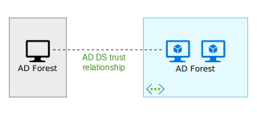

This reference architecture shows how to create a separate Active Directory domain in Azure that is trusted by domains in your on-premises AD forest.

Download a [Visio file][visio-download] for "AD DS Forest" architecture.

Active Directory Domain Services (AD DS) stores identity information in a hierarchical structure. The top node in the hierarchical structure is known as a forest. A forest contains domains, and domains contain other types of objects. This reference architecture creates an AD DS forest in Azure with a one-way outgoing trust relationship with an on-premises domain. The forest in Azure contains a domain that does not exist on-premises. Because of the trust relationship, logons made against on-premises domains can be trusted for access to resources in the separate Azure domain.

Typical uses for this architecture include maintaining security separation for objects and identities held in the cloud, and migrating individual domains from on-premises to the cloud.

For additional considerations, see [Choose a solution for integrating on-premises Active Directory with Azure][considerations].

## Architecture

The architecture has the following components.

- **On-premises network**. The on-premises network contains its own Active Directory forest and domains.
- **Active Directory servers**. These are domain controllers implementing domain services running as VMs in the cloud. These servers host a forest containing one or more domains, separate from those located on-premises.
- **One-way trust relationship**. The example in the diagram shows a one-way trust from the domain in Azure to the on-premises domain. This relationship enables on-premises users to access resources in the domain in Azure, but not the other way around.
- **Active Directory subnet**. The AD DS servers are hosted in a separate subnet. Network security group (NSG) rules protect the AD DS servers and provide a firewall against traffic from unexpected sources.
- **Azure gateway**. The Azure gateway provides a connection between the on-premises network and the Azure VNet. This can be a [VPN connection][azure-vpn-gateway] or [Azure ExpressRoute][azure-expressroute]. For more information, see [Connect an on-premises network to Azure using a VPN gateway](/azure/expressroute/expressroute-howto-coexist-resource-manager).

## Recommendations

For specific recommendations on implementing Active Directory in Azure, see [Extending Active Directory Domain Services (AD DS) to Azure][adds-extend-domain].

### Trust

The on-premises domains are contained within a different forest from the domains in the cloud. To enable authentication of on-premises users in the cloud, the domains in Azure must trust the logon domain in the on-premises forest. Similarly, if the cloud provides a logon domain for external users, it may be necessary for the on-premises forest to trust the cloud domain.

You can establish trusts at the forest level by [creating forest trusts][creating-forest-trusts], or at the domain level by [creating external trusts][creating-external-trusts]. A forest level trust creates a relationship between all domains in two forests. An external domain level trust only creates a relationship between two specified domains. You should only create external domain level trusts between domains in different forests.

Trusts with an on-premises Active Directory are only unidirectional (one-way). A one-way trust enables users in one domain or forest (known as the *incoming* domain or forest) to access the resources held in another (the *outgoing* domain or forest).

The following table summarizes trust configurations for some simple scenarios:

| Scenario | On-premises trust | Cloud trust |
| --- | --- | --- |
| On-premises users require access to resources in the cloud, but not vice versa |One-way, incoming |One-way, outgoing |
| Users in the cloud require access to resources located on-premises, but not vice versa |One-way, outgoing |One-way, incoming |

## Scalability considerations

Active Directory is automatically scalable for domain controllers that are part of the same domain. Requests are distributed across all controllers within a domain. You can add another domain controller, and it synchronizes automatically with the domain. Do not configure a separate load balancer to direct traffic to controllers within the domain. Ensure that all domain controllers have sufficient memory and storage resources to handle the domain database. Make all domain controller VMs the same size.

## Availability considerations

Provision at least two domain controllers for each domain. This enables automatic replication between servers. Create an availability set for the VMs acting as Active Directory servers handling each domain. Put at least two servers in this availability set.

Also, consider designating one or more servers in each domain as [standby operations masters][standby-operations-masters] in case connectivity to a server acting as a flexible single master operation (FSMO) role fails.

## Manageability considerations

For information about management and monitoring considerations, see [Extending Active Directory to Azure][adds-extend-domain].

For additional information, see [Monitoring Active Directory][monitoring_ad]. You can install tools such as [Microsoft Systems Center][microsoft_systems_center] on a monitoring server in the management subnet to help perform these tasks.

## Security considerations

Forest level trusts are transitive. If you establish a forest level trust between an on-premises forest and a forest in the cloud, this trust is extended to other new domains created in either forest. If you use domains to provide separation for security purposes, consider creating trusts at the domain level only. Domain level trusts are non-transitive.

For Active Directory-specific security considerations, see the security considerations section in [Extending Active Directory to Azure][adds-extend-domain].

## DevOps considerations

For DevOps considerations, see Operational excellence in [Extending Active Directory Domain Services (AD DS) to Azure](adds-extend-domain.yml#operational-excellence).

## Cost considerations

Use the [Azure pricing calculator][azure-pricing-calculator] to estimate costs. Other considerations are described in the Cost section in [Microsoft Azure Well-Architected Framework][aaf-cost].

Here are cost considerations for the services used in this architecture.

### AD Domain Services

Consider having Active Directory Domain Services as a shared service that is consumed by multiple workloads to lower costs. For more information, see [Active Directory Domain Services pricing][ADDS-pricing].

### Azure VPN Gateway

The main component of this architecture is the VPN gateway service. You are charged based on the amount of time that the gateway is provisioned and available.

All inbound traffic is free, all outbound traffic is charged. Internet bandwidth costs are applied to VPN outbound traffic.

For more information, see [VPN Gateway Pricing][azure-gateway-charges].

## Next steps

- Learn the best practices for [extending your on-premises AD DS domain to Azure][adds-extend-domain]
- Learn the best practices for [creating an AD FS infrastructure][adfs] in Azure.

<!-- links -->

[aaf-cost]: /azure/architecture/framework/cost/overview
[adds-extend-domain]: ./adds-extend-domain.yml
[ADDS-pricing]: https://azure.microsoft.com/pricing/details/active-directory-ds
[adfs]: ./adfs.yml
[azure-gateway-charges]: https://azure.microsoft.com/pricing/details/vpn-gateway
[azure-expressroute]: /azure/expressroute/expressroute-introduction
[azure-vpn-gateway]: /azure/vpn-gateway/vpn-gateway-about-vpngateways
[considerations]: ./index.yml
[azure-pricing-calculator]: https://azure.microsoft.com/pricing/calculator
[creating-external-trusts]: /previous-versions/windows/it-pro/windows-server-2008-R2-and-2008/cc816837(v=ws.10)
[creating-forest-trusts]: /previous-versions/windows/it-pro/windows-server-2008-R2-and-2008/cc816810(v=ws.10)
[microsoft_systems_center]: https://microsoft.com/cloud-platform/system-center
[monitoring_ad]: /previous-versions/windows/it-pro/windows-2000-server/bb727046(v=technet.10)
[standby-operations-masters]: /previous-versions/windows/it-pro/windows-server-2008-R2-and-2008/cc794737(v=ws.10)
[visio-download]: https://arch-center.azureedge.net/identity-architectures.vsdx
